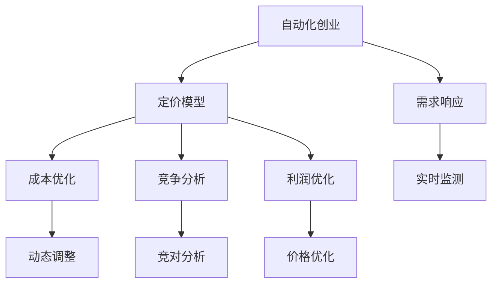

                 

# 自动化创业中的定价模型创新

> 关键词：自动化创业, 定价模型, 创新, 动态定价, 需求响应, 利润优化, 市场份额

## 1. 背景介绍

随着人工智能和自动化技术的飞速发展，越来越多的企业开始探索利用自动化技术提升运营效率、降低成本、提高利润率。然而，在自动化转型的过程中，定价策略的创新显得尤为重要。传统的定价模型往往基于静态市场条件，难以应对多变的市场需求和竞争格局。因此，开发动态、智能、高效的定价模型，对于自动化创业企业的长期发展至关重要。

### 1.1 问题由来

在自动化创业中，定价模型需要同时考虑成本、市场需求、竞争对手策略等多方面因素，进行动态调整，以最大化利润。传统的定价模型往往忽略了这些动态因素，导致企业在市场竞争中处于劣势。自动化技术的引入，为构建更加灵活、智能的定价模型提供了可能。通过整合AI技术，企业可以构建基于数据的定价模型，实时响应市场变化，提高竞争力和盈利能力。

### 1.2 问题核心关键点

构建创新的定价模型，需要关注以下几个核心问题：

1. **需求预测**：准确预测市场需求变化，以便动态调整价格。
2. **成本优化**：实时计算生产成本和运营成本，优化定价策略。
3. **竞争分析**：分析竞争对手的定价策略，避免价格战。
4. **利润优化**：通过动态调整价格，实现利润最大化。
5. **模型可解释性**：保证定价模型的决策过程透明、可解释。

解决这些问题，将有助于企业构建更加智能、高效的定价模型，提升市场竞争力。

### 1.3 问题研究意义

构建创新的定价模型，对于自动化创业企业的成功转型具有重要意义：

1. **增强市场竞争力**：通过实时调整价格，响应市场需求，企业能够在竞争中占据优势。
2. **提高盈利能力**：优化定价策略，实现成本控制和利润最大化。
3. **提升客户满意度**：智能定价策略可以更好地满足客户需求，提升客户体验。
4. **促进业务扩展**：通过灵活的定价模型，开拓新市场，扩大业务规模。
5. **增强决策透明度**：保证定价过程透明可解释，提高管理层信任度。

## 2. 核心概念与联系

### 2.1 核心概念概述

为了更好地理解自动化创业中定价模型的构建，本节将介绍几个密切相关的核心概念：

- **自动化创业**：利用自动化技术驱动业务增长，提升运营效率，降低成本的创业模式。
- **定价模型**：基于市场数据和内部成本，动态调整价格，实现利润最大化的数学模型。
- **需求响应**：实时监测市场需求变化，动态调整产品或服务的定价策略。
- **成本优化**：通过数据分析，优化生产成本和运营成本，确保定价策略的合理性。
- **竞争分析**：分析竞争对手的定价策略，制定更优的定价方案。
- **利润优化**：通过动态调整价格，最大化企业利润。
- **模型可解释性**：确保定价模型决策过程透明，便于管理层理解和调整。

这些概念之间的逻辑关系可以通过以下Mermaid流程图来展示：



这个流程图展示了我文自动化创业中定价模型的核心概念及其之间的关系：

1. 自动化创业通过自动化技术驱动业务增长，降低成本。
2. 定价模型基于市场数据和内部成本，动态调整价格，实现利润最大化。
3. 需求响应实时监测市场需求变化，动态调整定价策略。
4. 成本优化通过数据分析，优化生产成本和运营成本，确保定价合理。
5. 竞争分析分析竞争对手的定价策略，制定更优定价方案。
6. 利润优化通过动态调整价格，最大化企业利润。
7. 模型可解释性保证定价模型决策过程透明，便于管理层理解和调整。

## 3. 核心算法原理 & 具体操作步骤

### 3.1 算法原理概述

基于自动化创业的定价模型，其核心思想是利用AI技术，构建一个动态、智能的定价决策系统。该系统能够实时监测市场需求、竞争环境和内部成本变化，动态调整产品或服务的定价策略，实现利润最大化。

形式化地，假设企业在t时刻面临的市场需求为 $D_t$，竞争对手的定价策略为 $P_{comp}(t)$，企业的固定成本为 $C_{fixed}$，可变成本为 $C_{var}(t)$。设企业的产品价格为 $P(t)$，企业的目标是在保证市场份额和客户满意度的前提下，最大化利润 $\Pi$，即：

$$
\max_{P(t)} \Pi(t) = R(t) - C(t) - P(t)
$$

其中 $R(t) = P(t) \times D_t$ 为收入，$C(t) = C_{fixed} + C_{var}(t)$ 为成本，$P(t)$ 为价格。

通过求解上述优化问题，即可得到最优价格 $P(t)$。

### 3.2 算法步骤详解

基于自动化创业的定价模型，其具体操作步骤主要包括以下几个步骤：

**Step 1: 数据收集与预处理**
- 收集市场需求、竞争对手定价、成本数据等关键信息。
- 对数据进行清洗和处理，去除异常值和噪声，确保数据质量。

**Step 2: 模型构建与训练**
- 选择合适的定价模型，如动态定价模型、线性回归模型等。
- 使用历史数据对模型进行训练，学习市场需求与价格之间的关系。

**Step 3: 实时监测与预测**
- 实时监测市场需求和竞争环境变化。
- 使用训练好的模型对市场需求进行预测，并结合成本信息，计算出最优价格。

**Step 4: 动态调整与优化**
- 根据市场需求预测和成本计算结果，动态调整产品或服务的定价策略。
- 使用AI技术进行实时优化，确保定价策略的合理性和效率。

**Step 5: 绩效评估与反馈**
- 定期评估定价模型的性能，检查是否满足业务需求。
- 根据绩效评估结果，对模型进行迭代优化，提升定价策略的准确性和效果。

### 3.3 算法优缺点

基于自动化创业的定价模型具有以下优点：

1. **动态适应性**：实时监测市场需求变化，动态调整定价策略，能够快速响应市场波动。
2. **精准预测**：利用AI技术进行市场预测，提高价格调整的准确性。
3. **成本优化**：通过实时计算成本，优化定价策略，确保盈利能力。
4. **竞争优势**：分析竞争对手定价策略，制定更具竞争力的定价方案。
5. **透明可解释**：使用可解释性模型，保证决策过程透明，便于管理层理解和调整。

同时，该模型也存在以下局限性：

1. **数据依赖性**：定价模型的效果高度依赖于数据质量，数据不足或不准确会导致模型失效。
2. **计算复杂性**：实时计算市场需求和成本，需要较高的计算能力和资源。
3. **模型复杂度**：复杂的定价模型可能导致决策过程不透明，增加管理难度。
4. **市场响应滞后**：模型调整价格可能存在滞后，无法立即反映市场需求变化。
5. **模型泛化能力**：定价模型可能在特定市场环境下表现良好，但跨市场环境可能效果不佳。

### 3.4 算法应用领域

基于自动化创业的定价模型在多个领域具有广泛的应用前景，例如：

- **零售行业**：实时调整商品价格，优化库存管理，提升销售额。
- **金融行业**：动态调整理财产品价格，平衡风险和收益，吸引客户。
- **交通运输**：实时调整票价，提高客流量，优化资源配置。
- **旅游行业**：根据需求变化，动态调整旅游产品价格，提高客户满意度。
- **电信行业**：实时调整服务套餐价格，提升用户粘性和市场份额。
- **物流行业**：根据市场需求，动态调整物流服务价格，优化供应链管理。

## 4. 数学模型和公式 & 详细讲解

### 4.1 数学模型构建

在实际应用中，我们通常使用线性回归模型来进行市场需求与价格之间的关系建模。假设市场需求与价格的线性关系为 $R(t) = \beta_0 + \beta_1 \times P(t) + \epsilon(t)$，其中 $\beta_0$ 为截距，$\beta_1$ 为斜率，$\epsilon(t)$ 为误差项。

模型训练的目标是最小化预测误差，即：

$$
\min_{\beta_0, \beta_1} \sum_{t=1}^T (R(t) - (\beta_0 + \beta_1 \times P(t)))^2
$$

通过求解上述最小化问题，可以训练出最优的 $\beta_0$ 和 $\beta_1$。

### 4.2 公式推导过程

将上述线性回归模型进行推导，得到：

$$
\beta_0 = \frac{\sum_{t=1}^T R(t) - \beta_1 \times \sum_{t=1}^T P(t)}{\sum_{t=1}^T 1 - \sum_{t=1}^T P(t)^2}
$$

$$
\beta_1 = \frac{\sum_{t=1}^T R(t) \times P(t) - \beta_0 \times \sum_{t=1}^T P(t)}{\sum_{t=1}^T 1 - \sum_{t=1}^T P(t)^2}
$$

在实际应用中，由于数据量较大，计算过程中常常使用矩阵求解方法，即最小二乘法。

### 4.3 案例分析与讲解

假设某电子商务平台有如下数据：

| 时间 | 市场需求 | 竞争对手价格 | 成本 |
|------|----------|--------------|------|
| 1    | 100      | 10           | 5    |
| 2    | 150      | 12           | 6    |
| 3    | 90       | 11           | 7    |
| ...  | ...      | ...          | ...  |

利用上述线性回归模型，可以计算出最优价格 $P(t)$。

根据历史数据，可以计算出截距 $\beta_0 = 120$ 和斜率 $\beta_1 = -1.2$。

当市场需求 $D_t = 130$ 时，最优价格 $P(t) = \beta_0 + \beta_1 \times 130 = 100$。

通过实时监测市场需求变化，可以动态调整价格，确保盈利最大化。

## 5. 项目实践：代码实例和详细解释说明

### 5.1 开发环境搭建

在进行定价模型开发前，我们需要准备好开发环境。以下是使用Python进行Python开发的环境配置流程：

1. 安装Anaconda：从官网下载并安装Anaconda，用于创建独立的Python环境。

2. 创建并激活虚拟环境：
```bash
conda create -n pricing-env python=3.8 
conda activate pricing-env
```

3. 安装Python的科学计算库：
```bash
conda install numpy pandas scikit-learn matplotlib
```

4. 安装TensorFlow或PyTorch：
```bash
conda install tensorflow 
# 或者
conda install pytorch torchvision torchaudio
```

5. 安装TensorBoard（可选）：
```bash
conda install tensorboard
```

完成上述步骤后，即可在`pricing-env`环境中开始定价模型开发。

### 5.2 源代码详细实现

下面我们以线性回归定价模型为例，给出使用TensorFlow进行定价模型开发的PyTorch代码实现。

首先，定义线性回归模型：

```python
import tensorflow as tf

class LinearRegressionModel(tf.keras.Model):
    def __init__(self):
        super(LinearRegressionModel, self).__init__()
        self.dense = tf.keras.layers.Dense(units=1, input_shape=[1])

    def call(self, x):
        return self.dense(x)

    def compile_model(self, learning_rate=0.001, optimizer=tf.keras.optimizers.Adam(learning_rate)):
        self.model = tf.keras.Model(inputs=X, outputs=Y)
        self.model.compile(loss='mse', optimizer=optimizer)
```

然后，定义训练函数：

```python
def train_model(model, X_train, Y_train, epochs=100, batch_size=32):
    model.fit(X_train, Y_train, epochs=epochs, batch_size=batch_size, verbose=1)
```

接着，定义预测函数：

```python
def predict_price(model, X_test):
    predictions = model.predict(X_test)
    return predictions
```

最后，启动训练流程并预测价格：

```python
X_train = # 训练集特征数据
Y_train = # 训练集目标数据

X_test = # 测试集特征数据
Y_test = # 测试集目标数据

# 创建模型
model = LinearRegressionModel()
model.compile_model()

# 训练模型
train_model(model, X_train, Y_train)

# 预测价格
predictions = predict_price(model, X_test)
print(predictions)
```

以上就是使用TensorFlow进行线性回归定价模型的完整代码实现。可以看到，通过TensorFlow的高效数学计算和可视化工具，我们能够方便地实现定价模型的开发和优化。

### 5.3 代码解读与分析

让我们再详细解读一下关键代码的实现细节：

**LinearRegressionModel类**：
- `__init__`方法：初始化模型结构，添加一个全连接层。
- `call`方法：定义前向传播过程。
- `compile_model`方法：编译模型，定义损失函数和优化器。

**train_model函数**：
- 使用训练集数据对模型进行训练，迭代优化损失函数。
- 设置训练轮数和批大小，确保模型收敛。

**predict_price函数**：
- 使用训练好的模型对测试集进行预测，返回预测结果。

**训练流程**：
- 定义训练集和测试集特征和目标数据。
- 创建模型并编译。
- 调用训练函数，对模型进行训练。
- 调用预测函数，对测试集进行价格预测。

可以看到，TensorFlow提供了强大的数学计算和模型训练工具，使得定价模型的开发变得更加高效和灵活。开发者可以根据具体业务需求，进一步优化模型结构，引入更多的特征，提升定价模型的准确性。

当然，实际应用中还需要考虑更多因素，如模型参数调优、特征选择、异常值处理等。通过不断迭代和优化，定价模型将能够更好地适应市场变化，提升企业的盈利能力。

## 6. 实际应用场景

### 6.1 智能推荐系统

智能推荐系统是定价模型的典型应用场景之一。通过分析用户的浏览、购买历史，动态调整商品价格，可以提升用户满意度和购买转化率，增加销售额。

在技术实现上，可以使用价格预测模型对未来需求进行预测，结合成本信息，动态调整商品价格。同时，结合用户行为数据，进一步优化推荐策略，提升用户粘性。

### 6.2 动态定价平台

动态定价平台可以帮助企业根据市场需求和竞争环境变化，实时调整产品或服务价格，提高市场竞争力。

在技术实现上，可以使用需求预测模型对市场需求进行实时监测，结合成本信息，动态调整定价策略。同时，结合竞争对手的定价策略，制定更具竞争力的定价方案。

### 6.3 金融投资策略

动态定价模型同样可以应用于金融领域，实时调整投资组合或理财产品价格，平衡风险和收益，吸引客户。

在技术实现上，可以使用历史交易数据对市场进行预测，结合成本信息，动态调整产品价格。同时，结合市场波动和用户偏好，优化投资策略，提升投资回报率。

## 7. 工具和资源推荐

### 7.1 学习资源推荐

为了帮助开发者系统掌握定价模型的理论基础和实践技巧，这里推荐一些优质的学习资源：

1. 《机器学习实战》系列博文：由机器学习专家撰写，深入浅出地介绍了机器学习算法和实践，包括定价模型的构建。

2. Coursera《深度学习》课程：斯坦福大学开设的深度学习课程，系统讲解了深度学习理论和技术，包括定价模型的应用。

3. 《Python深度学习》书籍：清华大学出版社出版的深度学习教材，全面介绍了Python在深度学习中的应用，包括定价模型。

4. TensorFlow官方文档：TensorFlow的官方文档，提供了丰富的示例代码和详细的API说明，是学习定价模型的必备资料。

5. GitHub定价模型开源项目：GitHub上丰富的定价模型开源项目，提供了多种定价算法和实现细节，可以借鉴学习。

通过对这些资源的学习实践，相信你一定能够快速掌握定价模型的精髓，并用于解决实际的商业问题。

### 7.2 开发工具推荐

高效的开发离不开优秀的工具支持。以下是几款用于定价模型开发的常用工具：

1. TensorFlow：由Google主导开发的开源深度学习框架，生产部署方便，适合大规模工程应用。提供了丰富的数学计算和模型训练工具。

2. PyTorch：基于Python的开源深度学习框架，灵活动态的计算图，适合快速迭代研究。提供了强大的自动微分和模型构建工具。

3. Jupyter Notebook：交互式的数据科学开发环境，支持Python代码的实时执行和可视化。适合进行模型训练和数据探索。

4. GitHub：全球最大的代码托管平台，支持版本控制、代码协作和开源项目托管。适合分享学习笔记和代码实现。

合理利用这些工具，可以显著提升定价模型的开发效率，加快创新迭代的步伐。

### 7.3 相关论文推荐

定价模型和动态定价技术的发展源于学界的持续研究。以下是几篇奠基性的相关论文，推荐阅读：

1. Dynamic Pricing: Theory and Applications（动态定价理论与应用）：介绍了动态定价模型在供应链管理、拍卖市场等领域的应用，是定价模型研究的经典文献。

2. A Neural Approach to Dynamic Pricing（神经网络动态定价方法）：提出了基于神经网络的动态定价模型，实时预测市场需求和成本变化，实现价格优化。

3. Revenue-Optimal Dynamic Pricing with Incomplete Information（不完全信息下的动态定价）：研究了不完全信息环境下的动态定价问题，提出了基于效用的定价策略。

4. Dynamic Pricing in Ad Hoc Environments（Ad Hoc环境下的动态定价）：探讨了Ad Hoc网络环境下的动态定价问题，提出了基于博弈论的定价模型。

5. Multi-Attribute Dynamic Pricing Model（多属性动态定价模型）：研究了多属性产品的定价问题，提出了基于属性分类的定价策略。

这些论文代表了大模型定价模型的发展脉络。通过学习这些前沿成果，可以帮助研究者把握学科前进方向，激发更多的创新灵感。

## 8. 总结：未来发展趋势与挑战

### 8.1 总结

本文对基于自动化创业的定价模型进行了全面系统的介绍。首先阐述了定价模型在自动化创业中的重要性和核心关键点，明确了定价模型在提升市场竞争力和盈利能力方面的独特价值。其次，从原理到实践，详细讲解了定价模型的数学原理和关键步骤，给出了定价模型开发的完整代码实例。同时，本文还广泛探讨了定价模型在智能推荐、动态定价、金融投资等领域的实际应用前景，展示了定价模型技术的广阔前景。此外，本文精选了定价模型的各类学习资源，力求为读者提供全方位的技术指引。

通过本文的系统梳理，可以看到，基于自动化创业的定价模型正在成为智能决策的重要工具，极大地提升了自动化企业的市场竞争力和盈利能力。未来，伴随定价模型的不断发展，智能决策技术必将在更多领域发挥重要作用，推动自动化创业企业迈向新的高峰。

### 8.2 未来发展趋势

展望未来，定价模型将呈现以下几个发展趋势：

1. **智能决策**：利用AI技术，构建更加智能的定价决策系统，实时响应市场变化，优化价格策略。
2. **多模态融合**：结合市场数据、用户行为、天气等信息，构建多模态定价模型，提升决策精准度。
3. **实时预测**：利用大数据和机器学习技术，实时预测市场需求和成本变化，动态调整价格。
4. **跨领域应用**：定价模型不仅应用于零售、金融等领域，还将拓展到医疗、旅游、物流等行业，提升各行业的运营效率。
5. **个性化定价**：根据用户偏好和历史行为，实现个性化定价，提升用户满意度和购买转化率。
6. **大数据集成**：结合多个数据源，构建统一的大数据平台，支持定价模型的实时计算和优化。

以上趋势凸显了定价模型技术的广阔前景。这些方向的探索发展，必将进一步提升企业的决策能力，实现智能决策。

### 8.3 面临的挑战

尽管定价模型已经取得了瞩目成就，但在迈向更加智能化、普适化应用的过程中，它仍面临着诸多挑战：

1. **数据质量问题**：定价模型高度依赖于数据质量，数据不足或不准确会导致模型失效。
2. **计算资源限制**：实时计算市场需求和成本，需要较高的计算能力和资源。
3. **模型复杂性**：复杂的定价模型可能导致决策过程不透明，增加管理难度。
4. **市场响应滞后**：模型调整价格可能存在滞后，无法立即反映市场需求变化。
5. **模型泛化能力**：定价模型可能在特定市场环境下表现良好，但跨市场环境可能效果不佳。
6. **风险管理**：定价模型在市场波动较大时，可能出现错误定价，导致企业亏损。

### 8.4 研究展望

面对定价模型面临的这些挑战，未来的研究需要在以下几个方面寻求新的突破：

1. **数据增强**：通过数据增强技术，提高数据量和数据质量，提升定价模型的鲁棒性。
2. **实时计算优化**：优化定价模型的计算过程，减少计算资源消耗，提升实时响应速度。
3. **模型解释性**：开发可解释性定价模型，提高决策过程的透明性和可解释性。
4. **跨领域应用**：结合多领域数据，构建统一的定价平台，支持多领域的应用。
5. **市场环境模拟**：建立市场环境模拟系统，测试定价模型在不同市场环境下的表现。
6. **风险管理**：引入风险管理机制，降低定价模型在市场波动时的风险。

这些研究方向将进一步推动定价模型的发展，提升企业决策的科学性和有效性，实现智能决策。

## 9. 附录：常见问题与解答

**Q1: 定价模型是否适用于所有业务场景？**

A: 定价模型在大多数业务场景中都能发挥重要作用。然而，某些特定场景可能需要结合其他决策工具，如动态配置、规则引擎等，以确保决策的全面性和准确性。

**Q2: 如何评估定价模型的性能？**

A: 定价模型的性能评估可以从以下几个方面进行：
- 准确性：预测价格与实际价格之间的误差大小。
- 实时性：模型响应市场变化的速度。
- 稳定性：模型在不同市场环境下的表现一致性。
- 可解释性：模型决策过程的透明性和可解释性。
- 风险管理：模型在市场波动时的风险控制能力。

**Q3: 如何优化定价模型？**

A: 定价模型的优化可以从以下几个方面进行：
- 数据质量提升：增加数据量和数据多样性，优化数据预处理。
- 计算效率提升：优化模型结构和计算过程，减少资源消耗。
- 模型结构优化：引入新算法和新架构，提高模型性能和可解释性。
- 实时预测优化：引入实时数据流和流式计算，提升预测准确性。
- 风险管理优化：引入风险控制机制，降低模型风险。

通过不断迭代和优化，定价模型将能够更好地适应市场变化，提升企业决策的科学性和有效性。

**Q4: 如何结合其他决策工具？**

A: 定价模型可以与其他决策工具结合使用，如动态配置、规则引擎等，以实现更全面的决策支持。例如，结合动态配置，根据市场需求和库存情况动态调整价格；结合规则引擎，根据业务规则和条件，自动生成价格调整策略。

**Q5: 如何确保定价模型的透明性和可解释性？**

A: 确保定价模型的透明性和可解释性，可以从以下几个方面进行：
- 模型结构设计：选择可解释性强的模型结构，如线性回归、决策树等。
- 特征选择：选择具有解释性的特征，去除复杂和难以解释的特征。
- 数据可视化：利用数据可视化工具，展示模型输入和输出的关系，增强决策过程的透明性。
- 可解释性模型：开发可解释性定价模型，如规则基模型、可解释性神经网络等。

这些措施将有助于提升定价模型的透明性和可解释性，增强企业的决策信心和信任度。

---

作者：禅与计算机程序设计艺术 / Zen and the Art of Computer Programming

