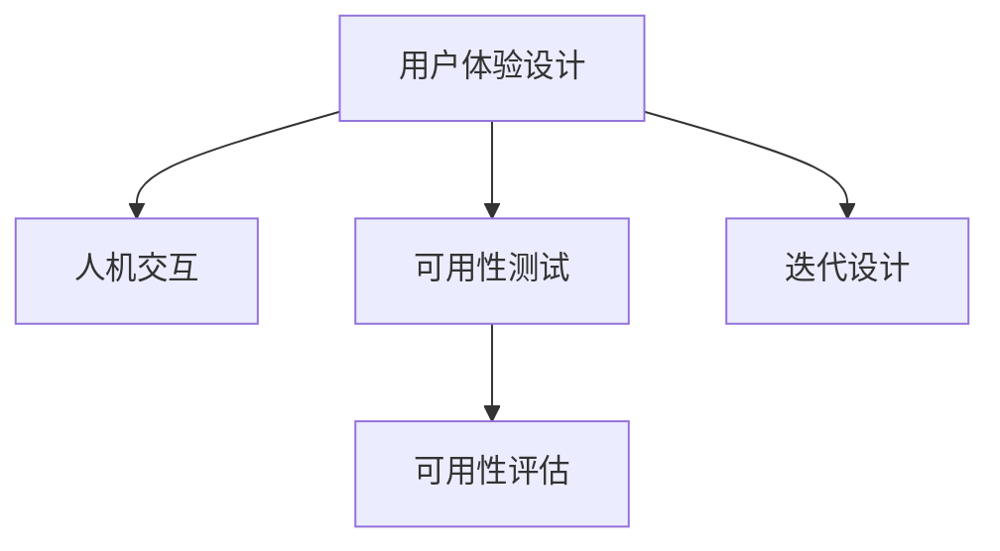

                 

# 自动化创业中的用户体验设计

在当下竞争激烈的商业环境中，用户体验(UX)设计已经成为企业取胜的关键因素之一。尤其是在自动化创业领域，优化用户体验不仅是提升客户满意度的重要手段，更是直接关乎企业生存发展的核心战略。本文将深入探讨自动化创业中用户体验设计的核心概念、实现策略、实际应用场景，以及未来发展趋势，旨在为创业者提供切实可行的指导，帮助他们构建更具竞争力的自动化产品和服务。

## 1. 背景介绍

### 1.1 问题由来
随着人工智能、大数据、云计算等技术的快速发展，自动化技术正日益渗透到各行各业，为企业提供了前所未有的效率提升和成本节约空间。然而，自动化技术本身并不能直接转化为商业价值，它必须通过用户友好的界面和流程才能真正发挥作用。特别是在自动化创业初期，用户体验设计的不足往往成为制约业务增长的瓶颈。

### 1.2 问题核心关键点
在自动化创业中，用户体验设计的核心关键点包括：

1. **用户需求理解**：准确把握目标用户的需求和痛点，是设计良好用户体验的起点。
2. **界面设计**：界面简洁、直观、易用，使用户能够快速上手。
3. **流程优化**：优化自动化流程，减少用户操作复杂性，提升使用效率。
4. **反馈机制**：通过用户反馈不断改进产品和服务，形成良性循环。
5. **安全性和隐私保护**：确保用户数据的安全和隐私，建立用户信任。

### 1.3 问题研究意义
优化用户体验不仅能提升客户满意度，还能增强品牌忠诚度，降低客户流失率，从而直接推动企业增长。在自动化创业中，用户对产品的第一印象往往决定了后续的转化率和回购率。因此，优化用户体验设计是自动化创业成功的关键所在。

## 2. 核心概念与联系

### 2.1 核心概念概述

为了更好地理解自动化创业中的用户体验设计，本节将介绍几个密切相关的核心概念：

- **用户体验设计(User Experience Design, UXD)**：旨在通过合理的设计，提升用户在使用产品和服务时的满意度、效率和愉悦感。
- **人机交互(Human-Computer Interaction, HCI)**：研究如何通过界面设计优化用户与计算机之间的交互，提升操作效率和用户体验。
- **可用性测试(Usability Testing)**：通过用户实际操作测试产品，评估其易用性、效率和满意度，为设计改进提供依据。
- **可用性评估(Measurement of Usability)**：通过定量指标和定性反馈评估产品的可用性，确保设计目标的实现。
- **迭代设计(Iterative Design)**：基于用户反馈，反复迭代设计方案，逐步优化用户体验。

这些核心概念之间的逻辑关系可以通过以下Mermaid流程图来展示：



这个流程图展示了几大核心概念之间的关系：

1. 用户体验设计通过合理的人机交互界面优化用户操作体验。
2. 可用性测试通过用户实际操作，评估设计方案的易用性和效率。
3. 可用性评估通过定量指标和定性反馈，全面衡量产品的可用性。
4. 迭代设计基于用户反馈，反复迭代设计方案，不断优化用户体验。

这些概念共同构成了用户体验设计的核心框架，为自动化创业中的用户设计提供了全面的指导。

## 3. 核心算法原理 & 具体操作步骤

### 3.1 算法原理概述

在自动化创业中，用户体验设计遵循从用户需求出发，通过合理的人机交互设计、可用性测试和反馈机制，逐步优化产品和服务流程的设计原理。其核心在于：

1. **用户中心设计**：以用户需求为核心，设计符合用户习惯和心理预期的界面和流程。
2. **迭代开发**：通过多次迭代测试和改进，逐步完善产品功能和使用体验。
3. **数据驱动设计**：利用用户行为数据，量化分析设计效果，指导设计优化。

### 3.2 算法步骤详解

基于上述原理，以下是自动化创业中用户体验设计的详细操作步骤：

**Step 1: 用户需求调研**
- 通过问卷调查、用户访谈等方式，收集目标用户的需求和痛点。
- 分析用户行为数据，识别常见问题和改进点。

**Step 2: 界面设计和原型制作**
- 根据用户需求，设计简洁、直观、易用的界面原型。
- 使用工具如Sketch、Figma等制作原型图，供用户测试和反馈。

**Step 3: 可用性测试**
- 招募代表性用户，进行可用性测试，记录用户操作路径和反馈。
- 分析测试结果，识别易用性问题和改进点。

**Step 4: 可用性评估**
- 基于用户反馈和行为数据，进行可用性评估。
- 使用工具如Nielsen Usability Heuristics、SUS问卷等，量化评估产品可用性。

**Step 5: 迭代设计**
- 根据测试和评估结果，进行界面和流程的优化。
- 反复迭代设计方案，直至满足用户需求。

**Step 6: 实施和监控**
- 上线优化后的产品，收集用户反馈，持续改进。
- 定期监控用户行为数据，评估产品效果，指导后续优化。

### 3.3 算法优缺点

**优点**：
1. **用户参与度高**：通过用户调研和测试，确保设计方案符合用户需求和习惯。
2. **快速迭代优化**：基于用户反馈，反复迭代设计，快速提升产品可用性。
3. **数据驱动设计**：利用行为数据量化评估，指导设计优化，提升设计效率。

**缺点**：
1. **成本和时间投入大**：用户调研和测试需要耗费大量时间和资源。
2. **流程复杂**：涉及多个步骤，流程较长，可能影响产品发布节奏。
3. **用户需求变化快**：用户需求和市场变化快速，设计方案需要频繁调整。

尽管存在这些缺点，用户体验设计的核心思想和方法论仍是不可或缺的。特别是在自动化创业初期，确保产品能够真正解决用户问题，提升用户体验，是创业成功的关键所在。

### 3.4 算法应用领域

用户体验设计的思想和方法，广泛应用于自动化创业的各个领域：

1. **自动化软件**：优化自动化软件的界面和流程，提高操作效率和用户满意度。
2. **自动化工具**：设计符合用户需求的工具界面，提升工具的易用性和功能性。
3. **自动化服务**：通过服务设计，优化自动化服务的流程和交互，提升用户体验。
4. **自动化营销**：设计自动化营销工具，优化广告投放和客户互动，提升转化率。
5. **自动化客服**：设计自动化客服系统，优化对话流程和交互，提升用户满意度。

这些应用领域涵盖了自动化创业的主要方向，用户体验设计的优化，直接关乎产品的市场竞争力。

## 4. 数学模型和公式 & 详细讲解 & 举例说明

### 4.1 数学模型构建

为了更好地量化用户体验设计的效果，本文将构建一个简单的数学模型来评估产品可用性。假设用户体验指标为 $U$，包含易用性 $E$、效率 $I$、满意度 $S$ 等因子。其数学模型可以表示为：

$$
U = f(E, I, S)
$$

其中 $f$ 为非线性函数，表示各因子对用户体验的综合影响。

### 4.2 公式推导过程

为了推导上述函数 $f$，我们假定：

- 易用性 $E$ 由界面设计和用户反馈决定。
- 效率 $I$ 由操作流程复杂度和自动化程度决定。
- 满意度 $S$ 由用户反馈和行为数据决定。

令 $E(x, y)$ 表示界面设计和用户反馈的函数关系，$I(z, a)$ 表示流程复杂度和自动化程度的函数关系，$S(t, b)$ 表示用户反馈和行为数据的函数关系。则上述模型可以进一步展开为：

$$
U = f(E(x, y), I(z, a), S(t, b))
$$

其中 $x, y, z, a, t, b$ 为输入变量，表示界面设计、用户反馈、流程复杂度、自动化程度、用户反馈和行为数据等因素。

### 4.3 案例分析与讲解

以一个自动化客服系统为例，分析用户体验设计的实现过程。假设系统的用户体验指标 $U$ 可以表示为：

$$
U = f(E, I, S) = f(E_{UI}, I_{flow}, S_{feedback})
$$

其中 $E_{UI}$ 表示用户界面易用性，$I_{flow}$ 表示操作流程效率，$S_{feedback}$ 表示用户反馈满意度。

1. **用户界面易用性 $E_{UI}$**：
   - 界面设计：简洁直观，符合用户习惯。
   - 用户反馈：通过可用性测试和问卷调查收集反馈，识别易用性问题。

2. **操作流程效率 $I_{flow}$**：
   - 流程优化：简化操作流程，减少用户操作步骤。
   - 自动化程度：提升自动化功能，减少人工干预。

3. **用户反馈满意度 $S_{feedback}$**：
   - 用户反馈：通过在线客服和社交媒体收集用户反馈。
   - 行为数据：分析用户操作数据，识别常见问题和改进点。

通过上述分析，可以构建一个初步的用户体验设计模型，用于指导自动化客服系统的优化。在实际应用中，还需要结合具体场景和用户需求，不断调整和优化设计方案。

## 5. 项目实践：代码实例和详细解释说明

### 5.1 开发环境搭建

在进行用户体验设计实践前，我们需要准备好开发环境。以下是使用Python进行Flask开发的环境配置流程：

1. 安装Anaconda：从官网下载并安装Anaconda，用于创建独立的Python环境。

2. 创建并激活虚拟环境：
```bash
conda create -n flask-env python=3.8 
conda activate flask-env
```

3. 安装Flask：从官网获取安装命令，例如：
```bash
pip install Flask
```

4. 安装相关工具包：
```bash
pip install Flask-WTF Flask-SQLAlchemy psycopg2-binary
```

完成上述步骤后，即可在`flask-env`环境中开始开发。

### 5.2 源代码详细实现

这里我们以自动化客服系统的用户界面设计为例，给出使用Flask进行原型设计的PyTorch代码实现。

首先，定义用户界面设计的数据模型：

```python
from flask_sqlalchemy import SQLAlchemy

db = SQLAlchemy()

class User(db.Model):
    id = db.Column(db.Integer, primary_key=True)
    name = db.Column(db.String(50), nullable=False)
    email = db.Column(db.String(120), unique=True, nullable=False)
    password_hash = db.Column(db.String(120), nullable=False)
```

然后，定义视图函数和模板：

```python
from flask import Flask, render_template, request, redirect, url_for
from flask_login import LoginManager, login_user, logout_user, login_required

app = Flask(__name__)
app.config['SECRET_KEY'] = 'my_secret_key'
app.config['SQLALCHEMY_DATABASE_URI'] = 'sqlite:///database.db'
db.init_app(app)

login_manager = LoginManager()
login_manager.init_app(app)

@login_manager.user_loader
def load_user(user_id):
    return User.query.get(int(user_id))

@app.route('/')
@login_required
def home():
    return render_template('index.html')

@app.route('/login')
def login():
    return render_template('login.html')

@app.route('/logout')
@login_required
def logout():
    logout_user()
    return redirect(url_for('index'))

@app.route('/register')
def register():
    return render_template('register.html')

@app.route('/settings')
@login_required
def settings():
    return render_template('settings.html')

@app.route('/chat')
@login_required
def chat():
    return render_template('chat.html')
```

最后，启动Flask服务：

```python
if __name__ == '__main__':
    app.run(debug=True)
```

以上就是使用Flask进行自动化客服系统用户界面设计的完整代码实现。可以看到，Flask提供了简洁的路由系统和模板引擎，可以快速构建Web应用，同时支持数据库集成和用户认证等功能。

### 5.3 代码解读与分析

让我们再详细解读一下关键代码的实现细节：

**User模型**：
- 定义了用户的基本信息，包括姓名、邮箱和密码等，使用SQLAlchemy进行数据库操作。

**路由和视图函数**：
- `@app.route('/')` 装饰器定义了根路由，用户登录后才能访问。
- `@app.route('/login')` 定义登录视图，显示登录表单。
- `@app.route('/logout')` 定义注销视图，退出用户登录。
- `@app.route('/register')` 定义注册视图，用户填写注册表单。
- `@app.route('/settings')` 定义用户设置视图，用户修改个人设置。
- `@app.route('/chat')` 定义聊天记录视图，用户查看聊天记录。

**模板引擎**：
- `render_template` 函数将视图函数渲染成HTML模板，输出到浏览器。
- `Flask-WTF` 和 `Flask-SQLAlchemy` 扩展提供了表单验证和数据库操作功能，增强了应用的安全性和功能性。

通过上述代码实现，我们可以初步搭建一个自动化客服系统的用户界面原型。开发者可以根据实际需求，进一步优化模板设计和业务逻辑，实现更加丰富、实用的功能。

## 6. 实际应用场景

### 6.1 智能客服系统

智能客服系统是用户体验设计在自动化创业中最典型的应用之一。传统的客服系统需要大量人工操作，响应时间慢，用户体验差。而使用用户界面设计的优化技术，可以构建自动化的智能客服系统，提高客服效率和用户满意度。

具体而言，可以通过用户调研和可用性测试，设计符合用户习惯的客服界面和交互流程。利用自然语言处理技术，构建自然流畅的对话系统，实现自动问答和问题识别。同时，通过用户行为数据分析，不断优化对话流程，提升用户互动体验。

### 6.2 自动化金融服务

自动化金融服务需要优化用户体验，确保用户能够高效、安全地进行金融操作。例如，通过设计简洁易用的界面，优化操作流程，减少用户操作步骤。同时，利用用户反馈和行为数据分析，不断优化金融产品设计，提升用户满意度和转化率。

在具体实现中，可以通过用户调研和可用性测试，设计符合金融用户需求的交互界面。利用区块链和智能合约等技术，确保金融操作的安全性和透明性。通过用户行为数据分析，识别常见问题和改进点，不断优化产品设计。

### 6.3 自动化教育平台

自动化教育平台需要优化用户体验，提升学习效率和用户参与度。例如，通过设计符合学生需求的学习界面，优化课程结构和互动设计。利用机器学习和大数据分析，个性化推荐课程内容和资源，提升学习效果。同时，通过用户反馈和行为数据分析，不断优化平台功能，提升用户满意度。

在具体实现中，可以通过用户调研和可用性测试，设计符合学生需求的学习界面和交互流程。利用推荐系统和智能算法，个性化推荐学习内容。通过用户行为数据分析，不断优化平台设计，提升用户参与度和学习效果。

### 6.4 未来应用展望

随着用户体验设计在自动化创业中的不断应用和优化，未来将呈现出以下几个发展趋势：

1. **个性化设计**：利用用户行为数据，实现个性化界面设计和功能推荐，提升用户满意度。
2. **自然语言处理**：通过自然语言处理技术，优化用户与系统的交互，提高操作效率和用户体验。
3. **情感计算**：引入情感计算技术，理解用户情绪和需求，优化交互设计和用户体验。
4. **人机协同**：通过人机协同设计，提升系统智能和自适应能力，增强用户参与度和满意度。
5. **多模态交互**：结合语音、图像、视频等多模态交互技术，提升用户体验的丰富性和便捷性。
6. **全生命周期管理**：从产品设计到售后服务的全生命周期管理，提升用户体验的连续性和稳定性。

这些趋势展示了用户体验设计在自动化创业中的广阔前景，未来的用户体验设计将更加智能、个性化、自适应，为自动化技术在各行各业的落地应用提供坚实的保障。

## 7. 工具和资源推荐

### 7.1 学习资源推荐

为了帮助开发者系统掌握用户体验设计的理论基础和实践技巧，这里推荐一些优质的学习资源：

1. 《用户体验设计基础》系列博文：由用户体验设计专家撰写，深入浅出地介绍了用户体验设计的原理、方法和工具。

2. 《UX Design》课程：由Coursera提供的用户体验设计在线课程，涵盖用户体验设计的核心概念和实践技巧。

3. 《Don't Make Me Think》书籍：Steve Krug的经典之作，介绍了用户体验设计的简洁性和易用性原则。

4. Nielsen Norman Group：世界领先的用户体验设计研究机构，提供丰富的用户体验设计报告和案例分析。

5. UX Design社区：面向用户体验设计师的在线社区，提供交流和学习的平台，汇聚众多设计大师和从业者。

通过对这些资源的学习实践，相信你一定能够快速掌握用户体验设计的精髓，并用于解决实际的自动化创业问题。

### 7.2 开发工具推荐

高效的开发离不开优秀的工具支持。以下是几款用于用户体验设计开发的常用工具：

1. Sketch：最流行的用户体验设计工具之一，支持界面原型设计、高保真设计等功能。
2. Figma：基于Web的协作设计工具，支持实时编辑和团队协作，适用于敏捷开发。
3. Adobe XD：提供界面设计、交互设计、原型设计等功能，广泛应用于用户体验设计领域。
4. InVision：用户测试和分析工具，支持交互式原型展示和用户反馈收集。
5. UserTesting：在线用户测试平台，提供真实用户的操作测试和行为分析。

合理利用这些工具，可以显著提升用户体验设计的开发效率，加快创新迭代的步伐。

### 7.3 相关论文推荐

用户体验设计的相关研究不断发展，以下是几篇奠基性的相关论文，推荐阅读：

1. "The Elements of User Experience" by Jesse James Garrett：提出了用户体验设计的五层模型，为设计实践提供框架。
2. "A Model of User Experience for Networked Spaces" by Nicholas A. Schreiber：探讨了网络空间中的用户体验设计，为数字化体验设计提供指导。
3. "User Experience Engineering" by Jesse James Garrett：介绍了用户体验设计的工程化方法，强调设计、技术和研究的结合。
4. "Designing With the Mind in Mind" by Jim Kalbach：介绍了用户体验设计的心理学原理，提升设计决策的科学性。
5. "Interaction Design Foundation" 网站：提供丰富的用户体验设计资源和案例，涵盖设计原则、方法、工具等。

这些论文代表了大用户体验设计的发展脉络，通过学习这些前沿成果，可以帮助研究者把握学科前进方向，激发更多的创新灵感。

## 8. 总结：未来发展趋势与挑战

### 8.1 总结

本文对自动化创业中的用户体验设计进行了全面系统的介绍。首先阐述了用户体验设计的核心概念和实现策略，明确了用户体验设计在自动化创业中的重要性和实际应用。其次，从原理到实践，详细讲解了用户体验设计的数学模型和操作步骤，给出了用户体验设计任务开发的完整代码实例。同时，本文还广泛探讨了用户体验设计在智能客服、自动化金融服务、自动化教育平台等多个行业领域的应用前景，展示了用户体验设计的巨大潜力。

通过本文的系统梳理，可以看到，用户体验设计在自动化创业中发挥着至关重要的作用。优化用户体验不仅能提升客户满意度，还能增强品牌忠诚度，降低客户流失率，从而直接推动企业增长。未来，伴随用户体验设计的不断优化，自动化创业必将迎来更加广泛的应用场景和更高的市场竞争力。

### 8.2 未来发展趋势

展望未来，用户体验设计在自动化创业中的发展趋势将主要体现在以下几个方面：

1. **技术融合**：用户体验设计将更多地与人工智能、机器学习、自然语言处理等前沿技术融合，提升系统的智能化和自适应能力。
2. **用户参与**：通过用户参与设计，提升设计方案的实用性和用户满意度。
3. **数据驱动**：利用用户行为数据，量化评估设计效果，指导设计优化。
4. **多模态交互**：结合语音、图像、视频等多模态交互技术，提升用户体验的丰富性和便捷性。
5. **全生命周期管理**：从产品设计到售后服务的全生命周期管理，提升用户体验的连续性和稳定性。
6. **国际化设计**：随着全球化趋势的加剧，用户体验设计将更多地考虑国际化和本地化需求，提升全球用户的使用体验。

这些趋势展示了用户体验设计在自动化创业中的广阔前景，未来的用户体验设计将更加智能、个性化、自适应，为自动化技术在各行各业的落地应用提供坚实的保障。

### 8.3 面临的挑战

尽管用户体验设计在自动化创业中取得了显著成效，但仍面临诸多挑战：

1. **用户需求变化快**：用户需求和市场变化快速，设计方案需要频繁调整，增加了设计复杂度。
2. **跨团队协作**：用户体验设计需要多个团队协作，包括设计师、开发人员、产品经理等，沟通成本高。
3. **设计资源投入大**：用户体验设计的优化需要大量人力和时间投入，增加了项目成本。
4. **设计标准不统一**：不同团队和公司有不同的设计标准和规范，设计输出难以统一。
5. **设计工具多样化**：设计工具种类繁多，选择和切换工具增加了设计难度。

尽管存在这些挑战，用户体验设计的核心思想和方法论仍是不可或缺的。特别是在自动化创业初期，确保产品能够真正解决用户问题，提升用户体验，是创业成功的关键所在。

### 8.4 研究展望

面对用户体验设计面临的挑战，未来的研究需要在以下几个方面寻求新的突破：

1. **敏捷设计方法**：引入敏捷设计方法，缩短设计周期，快速响应用户需求变化。
2. **设计工具集成**：开发统一的设计工具平台，降低跨团队协作难度。
3. **自动化设计工具**：引入自动化设计工具，提升设计效率和输出质量。
4. **设计标准统一**：建立统一的设计标准和规范，提升设计输出的一致性。
5. **跨学科合作**：加强与心理学、人机交互、认知科学等学科的合作，提升设计理论的科学性。

这些研究方向的探索，必将引领用户体验设计迈向更高的台阶，为自动化创业带来更加智能、高效、自适应的用户体验，推动自动化技术在各行各业的规模化落地。

## 9. 附录：常见问题与解答

**Q1：用户体验设计在自动化创业中是否必须？**

A: 用户体验设计在自动化创业中至关重要。它不仅提升用户满意度，还增强品牌忠诚度，降低客户流失率，直接推动企业增长。特别是在自动化创业初期，用户对产品的第一印象往往决定了后续的转化率和回购率。因此，用户体验设计是自动化创业成功的关键所在。

**Q2：如何平衡用户体验设计与产品功能开发？**

A: 在自动化创业中，用户体验设计和产品功能开发需要并行进行，相互促进。优先解决核心功能，确保产品可用性。在此基础上，进行用户体验优化，提升用户满意度和转化率。通过用户反馈和行为数据分析，不断优化产品功能，形成良性循环。

**Q3：用户体验设计需要多长时间？**

A: 用户体验设计的周期一般较长，包括调研、设计、测试、评估和优化等多个阶段。具体时间取决于项目规模和复杂度，一般需要数周到数月的持续努力。合理的时间安排和资源分配，是确保设计质量的关键。

**Q4：用户体验设计的成本如何控制？**

A: 用户体验设计的成本主要包括调研、设计、测试和评估等环节。通过合理的资源分配和优先级排序，可以控制设计成本。例如，初期进行快速原型设计和用户测试，逐步优化设计方案，避免大范围的返工和修改。同时，利用自动化工具和敏捷设计方法，提高设计效率和输出质量。

**Q5：用户体验设计的效果如何量化评估？**

A: 用户体验设计的效果可以通过多个指标进行量化评估，包括用户满意度、操作效率、使用频率、转化率等。使用工具如Nielsen Usability Heuristics、SUS问卷等，进行定量和定性评估。同时，通过A/B测试等方法，对比不同设计方案的效果，指导设计优化。

这些常见问题的解答，帮助理解用户体验设计在自动化创业中的重要性和实践技巧，希望能为创业者提供有价值的指导。

---

作者：禅与计算机程序设计艺术 / Zen and the Art of Computer Programming

