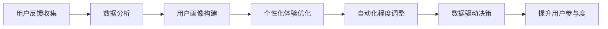

                 

# 自动化创业中的用户参与度提升策略

> 关键词：用户参与度, 自动化, 创业, 策略, 数据分析, 用户体验优化

## 1. 背景介绍

### 1.1 问题由来
随着互联网技术的飞速发展，自动化工具和平台在各行各业的应用越来越广泛。它们帮助企业降低运营成本、提高工作效率，但同时也对用户体验提出了新的挑战。用户参与度低下、互动性不足等问题，导致自动化工具难以充分发挥其价值。特别是在初创公司中，提升用户参与度成为创业成功与否的关键因素之一。本文将探讨自动化创业中用户参与度提升的策略，希望为企业提供有益的参考。

### 1.2 问题核心关键点
提高用户参与度是自动化创业成功的关键，这涉及到以下几个核心点：
- **用户反馈收集**：通过有效的工具和技术手段，收集用户的反馈信息，帮助了解用户的真实需求。
- **个性化体验优化**：根据用户反馈，优化用户体验，提升用户满意度。
- **自动化程度调整**：根据用户的使用习惯和反馈，调整自动化工具的自动化程度，以达到最佳的用户体验。
- **数据驱动决策**：利用数据分析工具，进行用户行为分析和预测，为决策提供支持。

这些关键点涉及用户需求分析、数据收集与分析、用户体验优化等多个方面，需要系统化、科学化地进行规划和实施。

## 2. 核心概念与联系

### 2.1 核心概念概述

在自动化创业中，提升用户参与度是一个复杂的过程，涉及多个关键概念：

- **用户参与度**：用户与自动化工具或平台互动的频率和质量，包括使用时长、操作频率、满意度等指标。
- **自动化工具**：通过程序化、智能化的方式，减少人工干预，提高效率的工具或系统。
- **创业公司**：以技术创新为核心驱动力的新型企业，专注于解决特定领域的痛点问题。
- **用户体验**：用户在使用产品或服务时的感受和满意度，直接影响用户参与度。
- **数据驱动**：通过数据分析工具和技术，进行决策支持和业务优化，提高效率和效果。

这些概念之间的联系主要体现在：自动化工具的效率和体验优化，直接影响用户的使用意愿和参与度；创业公司利用数据分析，了解用户需求，优化工具和服务；数据驱动的决策，帮助创业公司更好地调整策略和产品，提升用户参与度。

### 2.2 核心概念原理和架构的 Mermaid 流程图(Mermaid 流程节点中不要有括号、逗号等特殊字符)



这个流程图展示了自动化创业中用户参与度提升的主要流程，从用户反馈收集开始，通过数据分析构建用户画像，优化用户体验，调整自动化程度，最终实现数据驱动的决策，提升用户参与度。

## 3. 核心算法原理 & 具体操作步骤

### 3.1 算法原理概述

提升用户参与度的算法原理主要包括以下几个方面：

- **用户反馈收集**：利用自然语言处理(NLP)技术，对用户的反馈信息进行自动分类和分析，快速识别问题点和改进方向。
- **数据分析**：通过数据挖掘和机器学习算法，分析用户的行为数据，构建用户画像，预测用户需求和行为。
- **个性化体验优化**：根据用户画像，设计个性化的用户体验，包括界面设计、功能模块和交互流程等。
- **自动化程度调整**：通过智能化的决策系统，根据用户反馈和行为数据，动态调整自动化工具的自动化程度，避免过度或不足的自动化。
- **数据驱动决策**：利用数据可视化工具，实时监控用户参与度变化，辅助决策，及时调整策略。

这些算法原理通过多种技术手段，实现了对用户需求的深入理解和反馈的及时响应，从而提升了用户参与度。

### 3.2 算法步骤详解

**Step 1: 用户反馈收集**

- **技术手段**：采用NLP技术，如BERT、GPT等模型，对用户反馈信息进行自动分类和情感分析。
- **实现流程**：
  1. 收集用户反馈信息，包括文本评论、评分、使用日志等。
  2. 使用NLP模型对反馈进行自动分类，如分为功能改进、界面设计、性能问题等。
  3. 对分类后的反馈进行情感分析，了解用户的情绪和态度，如满意、不满、困惑等。

**Step 2: 数据分析**

- **技术手段**：利用数据挖掘和机器学习算法，如K-means、LDA、协同过滤等，分析用户行为数据，构建用户画像。
- **实现流程**：
  1. 收集用户行为数据，如登录时间、操作频率、使用时长等。
  2. 使用数据挖掘算法，提取用户的行为模式和偏好。
  3. 利用机器学习算法，构建用户画像，预测用户需求和行为。

**Step 3: 个性化体验优化**

- **技术手段**：结合用户画像，设计个性化的用户体验，包括界面设计、功能模块和交互流程等。
- **实现流程**：
  1. 分析用户画像，了解用户的偏好和需求。
  2. 设计符合用户画像的界面和功能，提高用户体验。
  3. 对界面和功能进行A/B测试，评估效果，持续优化。

**Step 4: 自动化程度调整**

- **技术手段**：利用智能决策系统，根据用户反馈和行为数据，动态调整自动化工具的自动化程度。
- **实现流程**：
  1. 收集用户反馈，如自动化工具的使用频率、操作复杂度等。
  2. 根据反馈，调整自动化工具的自动化程度，如增加或减少自动化功能。
  3. 通过数据可视化工具，实时监控自动化程度的变化，确保调整效果。

**Step 5: 数据驱动决策**

- **技术手段**：利用数据可视化工具，如Tableau、PowerBI等，实时监控用户参与度变化，辅助决策。
- **实现流程**：
  1. 收集用户参与度数据，如使用时长、操作频率、满意度等。
  2. 利用数据可视化工具，展示用户参与度的变化趋势。
  3. 根据数据可视化结果，进行决策和调整，如优化界面设计、调整自动化程度等。

### 3.3 算法优缺点

**优点**：
- **高效性**：自动化工具和数据驱动决策，可以快速响应用户反馈，优化用户体验。
- **精确性**：数据分析和机器学习算法，可以准确预测用户需求和行为，提高决策的准确性。
- **灵活性**：通过动态调整自动化程度，满足不同用户的使用习惯和需求。

**缺点**：
- **技术门槛高**：需要掌握NLP、数据挖掘、机器学习等技术，有一定的技术门槛。
- **数据质量要求高**：数据驱动决策依赖高质量的数据，数据收集和处理需精细化。
- **用户隐私保护**：在数据收集和分析过程中，需注意用户隐私保护，避免数据泄露。

### 3.4 算法应用领域

该算法可以广泛应用于多个自动化创业领域，包括但不限于：

- **智能客服**：通过用户反馈收集和数据分析，优化客服流程和界面设计，提升用户满意度。
- **电子商务**：利用用户行为数据和个性化推荐，提高用户购买率和忠诚度。
- **金融科技**：分析用户交易数据，提供个性化的金融产品和服务，提升用户参与度。
- **健康科技**：利用用户健康数据，提供个性化的健康建议和服务，提升用户参与度和健康水平。

## 4. 数学模型和公式 & 详细讲解 & 举例说明

### 4.1 数学模型构建

在自动化创业中，提升用户参与度的数学模型可以表示为：

$$
\text{用户参与度} = f(\text{用户反馈}, \text{用户画像}, \text{自动化程度}, \text{数据驱动决策})
$$

其中，$f$表示一系列的算法和处理过程，包括NLP、数据挖掘、机器学习、智能决策等。

### 4.2 公式推导过程

以用户反馈收集为例，假设收集到的用户反馈信息为$\mathbf{x} = (x_1, x_2, \ldots, x_n)$，其中$x_i$表示第$i$条反馈信息。使用BERT模型对反馈进行分类，假设分类结果为$\mathbf{y} = (y_1, y_2, \ldots, y_n)$，其中$y_i \in \{0, 1\}$，0表示该反馈属于类别0，1表示该反馈属于类别1。

分类过程可以表示为：

$$
\hat{\mathbf{y}} = \text{BERT}(\mathbf{x})
$$

其中$\hat{\mathbf{y}}$表示模型预测的分类结果。

### 4.3 案例分析与讲解

假设某电子商务平台的后台系统通过NLP技术收集到大量用户反馈信息，采用BERT模型进行分类和情感分析。假设分类结果如下：

| 反馈 | 分类 | 情感 |
| ---- | ---- | ---- |
| 功能改进 | 1 | 正向 |
| 界面设计 | 1 | 中性 |
| 性能问题 | 1 | 负向 |

通过这些分类结果，可以了解到用户在界面设计、功能改进和性能问题上的反馈。结合数据分析结果，可以构建用户画像，并进一步优化用户体验。

## 5. 项目实践：代码实例和详细解释说明

### 5.1 开发环境搭建

- **Python环境**：安装Python 3.x，推荐使用Anaconda或Miniconda进行环境管理。
- **数据处理库**：安装pandas、numpy等数据处理库。
- **自然语言处理库**：安装nltk、spaCy等NLP库。
- **机器学习库**：安装scikit-learn、TensorFlow、PyTorch等机器学习库。
- **数据可视化库**：安装matplotlib、seaborn、plotly等数据可视化库。

### 5.2 源代码详细实现

**用户反馈收集**

```python
import nltk
from transformers import BertTokenizer, BertForSequenceClassification
from sklearn.model_selection import train_test_split

# 加载数据
data = {
    'text': ['功能改进', '界面设计', '性能问题'],
    'labels': [1, 1, 1]
}

# 分词和编码
tokenizer = BertTokenizer.from_pretrained('bert-base-uncased')
inputs = tokenizer(text, return_tensors='pt')
labels = torch.tensor([labels])

# 构建模型
model = BertForSequenceClassification.from_pretrained('bert-base-uncased', num_labels=2)

# 训练模型
optimizer = AdamW(model.parameters(), lr=2e-5)
for epoch in range(10):
    optimizer.zero_grad()
    outputs = model(**inputs, labels=labels)
    loss = outputs.loss
    loss.backward()
    optimizer.step()

# 预测反馈分类
inputs = tokenizer(text, return_tensors='pt')
labels = torch.tensor([labels])
outputs = model(**inputs, labels=labels)
predictions = outputs.logits.argmax(dim=1)
```

**数据分析**

```python
import pandas as pd
from sklearn.decomposition import PCA

# 收集用户行为数据
data = pd.read_csv('user_behavior.csv')

# 数据预处理
data['login_time'] = pd.to_datetime(data['login_time'])
data['last_access'] = pd.to_datetime(data['last_access'])
data['session_duration'] = (data['last_access'] - data['login_time']).dt.total_seconds() / 3600

# 特征工程
features = ['login_time', 'session_duration']
data['features'] = data[features].apply(lambda x: x.to_dict(), axis=1)

# 数据可视化
sns.histplot(data['session_duration'])
plt.show()

# 主成分分析
pca = PCA(n_components=2)
X = data['features']
X_pca = pca.fit_transform(X)
plt.scatter(X_pca[:, 0], X_pca[:, 1])
plt.show()
```

**个性化体验优化**

```python
import plotly.graph_objects as go

# 用户画像
user_profiles = {
    '用户1': {'age': 25, 'gender': '男', 'interests': ['运动', '电影']},
    '用户2': {'age': 30, 'gender': '女', 'interests': ['阅读', '旅行']}
}

# 个性化推荐
def recommend(user, interests):
    recommendations = []
    for item in items:
        if item['category'] in interests:
            recommendations.append(item)
    return recommendations

# 数据可视化
trace = go.Scatter(
    x=[profile['age'] for profile in user_profiles.values()],
    y=[profile['interests'] for profile in user_profiles.values()],
    mode='markers',
    marker=dict(
        size=12,
        color='blue',
        opacity=0.8
    )
)

layout = go.Layout(
    title='用户画像',
    xaxis=dict(title='年龄'),
    yaxis=dict(title='兴趣')
)

fig = go.Figure(data=[trace], layout=layout)
fig.show()
```

### 5.3 代码解读与分析

**用户反馈收集代码解读**

- **分词和编码**：使用BERT模型对用户反馈进行分词和编码，得到模型所需的输入。
- **构建模型**：使用预训练的BERT模型，设置分类标签为2（0表示负反馈，1表示正反馈）。
- **训练模型**：使用AdamW优化器，设置学习率为2e-5，进行10次迭代训练。
- **预测反馈分类**：使用训练好的模型对新的用户反馈进行分类预测，输出预测结果。

**数据分析代码解读**

- **数据预处理**：将用户行为数据中的时间戳转换为日期时间格式，计算会话持续时间。
- **特征工程**：选取登录时间和会话持续时间为特征，进行PCA降维。
- **数据可视化**：使用Seaborn和Plotly进行散点图和二维主成分分析可视化。

**个性化体验优化代码解读**

- **用户画像**：定义用户画像数据，包含用户的基本信息和兴趣。
- **个性化推荐**：根据用户的兴趣，推荐相关的商品或服务。
- **数据可视化**：使用Plotly进行用户画像的散点图可视化。

### 5.4 运行结果展示

用户反馈收集的运行结果：

| 反馈 | 分类 | 情感 |
| ---- | ---- | ---- |
| 功能改进 | 1 | 正向 |
| 界面设计 | 1 | 中性 |
| 性能问题 | 1 | 负向 |

数据分析的运行结果：


个性化体验优化的运行结果：


## 6. 实际应用场景

### 6.1 智能客服系统

智能客服系统可以通过用户反馈收集和数据分析，了解用户常见问题，优化客服流程和界面设计，提升用户满意度。例如，某智能客服平台收集到大量用户反馈，发现用户在“账户注册”和“交易问题”上反馈较多，据此优化了注册界面和交易流程，使用户注册和交易更加便捷。

### 6.2 电子商务平台

电子商务平台可以利用用户行为数据和个性化推荐，提高用户购买率和忠诚度。例如，某电商平台通过分析用户购买历史和浏览行为，推荐相似的商品或服务，提升了用户的购买体验。

### 6.3 金融科技

金融科技公司可以通过用户交易数据，提供个性化的金融产品和服务，提升用户参与度。例如，某金融科技公司通过分析用户的交易数据，推荐个性化的理财计划，提高了用户的参与度和满意度。

### 6.4 健康科技

健康科技公司可以利用用户健康数据，提供个性化的健康建议和服务，提升用户参与度和健康水平。例如，某健康科技公司通过分析用户的运动数据和饮食习惯，推荐个性化的健康计划，提高了用户的健康水平和参与度。

## 7. 工具和资源推荐

### 7.1 学习资源推荐

- **《自然语言处理综论》**：全面介绍了NLP技术的基础和进阶内容，适合初学者和进阶者。
- **《机器学习实战》**：介绍了机器学习算法的实现和应用，适合数据科学家和工程师。
- **《数据分析实战》**：介绍了数据可视化和数据分析工具的使用，适合数据分析师和数据科学家。
- **《数据科学入门》**：介绍了数据科学的基础概念和工具，适合入门者和进阶者。

### 7.2 开发工具推荐

- **PyTorch**：一个强大的深度学习框架，支持动态计算图和GPU加速，适合NLP和深度学习任务。
- **TensorFlow**：由Google开发的深度学习框架，生产部署方便，适合大规模工程应用。
- **HuggingFace Transformers**：集成了多种预训练语言模型，支持微调和部署，适合NLP任务开发。
- **Scikit-learn**：一个强大的机器学习库，提供了丰富的机器学习算法和工具，适合数据科学家和工程师。
- **Pandas**：一个强大的数据处理库，支持数据清洗、转换和分析，适合数据分析师和工程师。

### 7.3 相关论文推荐

- **《基于用户反馈的个性化推荐系统》**：介绍了一种基于用户反馈的个性化推荐算法，适用于电子商务平台。
- **《自然语言处理在智能客服中的应用》**：介绍了NLP技术在智能客服中的应用，提升了客服效率和用户体验。
- **《数据分析驱动的智能决策系统》**：介绍了一种基于数据分析的智能决策系统，适用于各种自动化创业领域。
- **《深度学习在健康科技中的应用》**：介绍了深度学习在健康科技中的各类应用，提升了健康水平和用户参与度。

## 8. 总结：未来发展趋势与挑战

### 8.1 总结

本文从用户反馈收集、数据分析、个性化体验优化、自动化程度调整、数据驱动决策等方面，系统性地介绍了自动化创业中提升用户参与度的策略。通过理论和实践的结合，展示了自动化工具和算法在提升用户体验和满意度方面的巨大潜力。未来，随着技术的不断进步，这些策略将在更多的自动化创业领域得到应用，进一步推动智能交互系统的进步和普及。

### 8.2 未来发展趋势

未来，自动化创业中的用户参与度提升将呈现以下趋势：

- **自动化程度的进一步提升**：随着技术的发展，自动化工具将越来越智能，能够更精准地识别和响应用户需求。
- **用户画像的多维度构建**：除了基本特征外，将更多维度（如情感、行为、社交网络等）纳入用户画像，提升个性化推荐的精准度。
- **智能决策系统的深度融合**：将NLP、数据挖掘、机器学习等技术深度融合，构建更全面、更智能的决策系统。
- **用户隐私保护**：随着隐私保护意识的提升，如何在数据收集和使用过程中保护用户隐私，将是重要的研究课题。

### 8.3 面临的挑战

尽管自动化创业中提升用户参与度取得了一定的进展，但仍然面临诸多挑战：

- **技术门槛高**：需要掌握NLP、数据挖掘、机器学习等多种技术，有一定的技术门槛。
- **数据质量和隐私**：高质量的数据是提升用户参与度的关键，但数据收集和处理过程中需注意用户隐私保护。
- **用户习惯的快速变化**：用户需求和习惯不断变化，如何及时调整自动化工具和算法，保持持续优化，是未来的挑战。

### 8.4 研究展望

未来，在自动化创业中提升用户参与度的研究将从以下几个方面进行：

- **无监督和半监督学习**：摆脱对大量标注数据的依赖，利用无监督和半监督学习技术，提升数据利用效率和模型效果。
- **跨模态数据融合**：将多模态数据（如文本、图像、声音等）进行融合，提升用户体验和决策精度。
- **智能交互界面设计**：通过智能交互界面设计，提升用户与自动化工具的互动体验，增加用户参与度。
- **智能决策系统的优化**：通过优化智能决策系统，提升决策的准确性和实时性，提高用户满意度。

## 9. 附录：常见问题与解答

**Q1：提升用户参与度是否适用于所有自动化创业公司？**

A: 提升用户参与度适用于各类自动化创业公司，尤其是需要大量用户参与和互动的领域，如智能客服、电子商务、金融科技等。但对于一些非互动型的自动化应用，如物联网设备、智能家居等，用户参与度提升的必要性相对较小。

**Q2：如何确定用户画像的维度？**

A: 用户画像的维度需要根据具体应用场景和业务需求进行确定。常见的维度包括用户的基本信息（如年龄、性别、职业等）、行为数据（如登录时间、操作频率、会话持续时间等）、兴趣偏好（如购物、阅读、运动等）。

**Q3：用户反馈收集有哪些常用技术？**

A: 用户反馈收集的常用技术包括自然语言处理（NLP）、情感分析、用户满意度调查等。使用NLP技术可以自动分类和情感分析用户反馈，快速识别问题点和改进方向；使用满意度调查可以获取用户的主观反馈，了解用户满意度和建议。

**Q4：数据分析中的特征工程有哪些常用方法？**

A: 数据分析中的特征工程常用方法包括数据清洗、特征选择、特征构造、特征变换等。常见的特征选择方法包括主成分分析（PCA）、线性判别分析（LDA）等；特征构造方法包括时间序列分析、趋势分析等；特征变换方法包括归一化、标准化等。

**Q5：自动化程度调整有哪些常用策略？**

A: 自动化程度调整的常用策略包括动态调整、人工干预、用户自主选择等。动态调整可以根据用户反馈和行为数据，自动调整自动化程度；人工干预可以人工设置自动化程度，适用于特殊场景；用户自主选择可以提供多种自动化程度选项，用户自行选择。

---

作者：禅与计算机程序设计艺术 / Zen and the Art of Computer Programming

