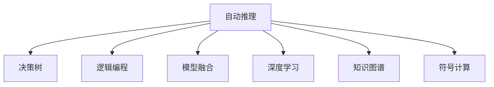

                 

# 自动推理库的设计与实现：AI决策的基石

> 关键词：自动推理, 决策树, 逻辑编程, 模型融合, 深度学习, 知识图谱, 符号计算

## 1. 背景介绍

### 1.1 问题由来

在人工智能(AI)领域，决策是核心任务之一。无论是智能推荐、风险评估、医疗诊断，还是自动驾驶、智能控制，决策都是AI系统必须具备的核心能力。然而，传统的决策系统往往依赖人工规则或决策树等结构化数据，难以应对现实世界中复杂多变的动态场景。近年来，随着深度学习技术的飞速发展，AI决策系统开始越来越多地采用自动推理技术，以实现更高效、更灵活、更可靠的系统构建。

### 1.2 问题核心关键点

自动推理库的设计与实现，是构建高效AI决策系统的基石。自动推理技术能够在无结构化数据上直接进行逻辑推理和决策，大幅提升系统的智能化水平和自动化能力。具体而言，自动推理库涉及以下几个关键点：

- 决策表示：如何将现实世界的知识、规则和约束转化为机器可理解的形式。
- 推理引擎：如何高效地搜索推理空间，实现知识推理。
- 不确定性处理：如何在存在不确定性和模糊性时，给出合理的决策。
- 知识融合：如何将多源知识进行综合，构建更全面的决策模型。
- 学习机制：如何利用数据进行模型训练和参数优化，提高推理精度。

### 1.3 问题研究意义

自动推理库的开发与应用，对于提升AI决策系统的智能水平和可靠程度，具有重要意义：

1. 提升决策效率：自动推理能够自动化地处理复杂逻辑，极大地减少人工干预，提升决策效率。
2. 增强决策精度：通过融合多源知识，自动推理库能够更准确地理解问题，提升决策精度。
3. 支持动态决策：自动推理库能够处理动态变化的数据，提供实时决策支持。
4. 降低开发成本：自动推理库的模块化设计，使得决策系统的开发更加便捷高效。
5. 促进应用落地：自动推理技术的多样性，使得AI决策系统能够在更广泛的领域中应用，推动AI技术的产业化进程。

## 2. 核心概念与联系

### 2.1 核心概念概述

为更好地理解自动推理库的设计与实现，本节将介绍几个密切相关的核心概念：

- 自动推理(Automatic Reasoning)：指利用计算机自动进行逻辑推理和知识发现的过程。
- 决策树(Decision Tree)：一种基于树形结构的决策模型，通过一系列规则和条件，逐步筛选出最优决策。
- 逻辑编程(Logic Programming)：一种基于逻辑公式的程序设计范式，通过逻辑推理实现问题的求解。
- 模型融合(Model Fusion)：指将多个模型或多个知识源的信息进行综合，构建更加全面和准确的决策模型。
- 深度学习(Deep Learning)：一种通过多层神经网络进行非线性映射和特征提取的学习方法。
- 知识图谱(Knowledge Graph)：一种基于图结构的知识表示方法，用于存储和推理知识。
- 符号计算(Symbolic Computation)：一种基于符号运算的计算方法，用于逻辑推理和算法求解。

这些核心概念之间的逻辑关系可以通过以下Mermaid流程图来展示：



这个流程图展示了一系列自动推理库的核心概念及其之间的关系：

1. 自动推理通过多种技术手段（如决策树、逻辑编程、模型融合等），实现对现实世界的逻辑推理和知识发现。
2. 决策树、逻辑编程等传统的推理技术，是自动推理中的重要组成部分。
3. 深度学习、知识图谱等新兴技术，为自动推理提供了更强大的工具和方法。
4. 符号计算作为基础技术，支持自动推理中的逻辑推理和算法求解。

这些概念共同构成了自动推理库的逻辑框架，使得自动推理能够应用于多种场景，实现高效的决策支持。

## 3. 核心算法原理 & 具体操作步骤

### 3.1 算法原理概述

自动推理库的核心算法原理，主要围绕逻辑推理、模型融合和不确定性处理三个方面展开。

- 逻辑推理：通过逻辑公式和推理规则，实现从已知事实到未知事实的推理过程。
- 模型融合：将多个模型或多个知识源的信息进行综合，构建更加全面和准确的决策模型。
- 不确定性处理：在存在不确定性和模糊性时，通过不确定性推理技术，给出合理的决策。

具体而言，自动推理库的设计与实现可以分为以下几个步骤：

1. 模型构建：设计合适的数据模型，以表示现实世界的知识。
2. 逻辑推理：构建推理引擎，实现知识推理。
3. 模型融合：将多源知识进行综合，构建更加全面和准确的决策模型。
4. 不确定性处理：应用不确定性推理技术，处理推理过程中的不确定性和模糊性。
5. 学习机制：利用数据进行模型训练和参数优化，提高推理精度。

### 3.2 算法步骤详解

#### 3.2.1 模型构建

模型构建是自动推理库的基础，需要选择合适的数据模型来表示现实世界的知识。常用的模型包括：

- 决策树：通过树形结构表示决策规则，适用于结构化数据。
- 规则引擎：基于规则集合，进行逻辑推理和决策。
- 知识图谱：通过图结构表示实体和关系，支持复杂推理。
- 神经网络：通过多层神经网络进行特征提取和决策。

模型构建过程中，需要注意以下几点：

- 模型的可解释性：选择易于解释和理解的模型，便于后续的调试和优化。
- 模型的泛化能力：选择能够处理复杂和多变场景的模型，提升推理精度。
- 模型的可扩展性：选择便于扩展和集成的模型，支持未来的功能升级。

#### 3.2.2 逻辑推理

逻辑推理是自动推理库的核心功能，用于实现知识推理和决策生成。常用的推理技术包括：

- 正向推理：从已知事实出发，逐步推导出未知事实。
- 反向推理：从未知事实出发，反向寻找推理路径。
- 因果推理：通过因果关系，推理出隐含的因果关系。
- 模糊推理：在存在不确定性和模糊性时，进行模糊逻辑推理。

逻辑推理引擎的设计和实现，需要考虑以下几个方面：

- 推理引擎的效率：通过优化推理算法和数据结构，提升推理速度。
- 推理引擎的准确性：通过设计合理的推理规则和约束，提升推理精度。
- 推理引擎的灵活性：通过支持多种推理策略和数据模型，支持不同类型的推理任务。

#### 3.2.3 模型融合

模型融合是将多个模型或多个知识源的信息进行综合，构建更加全面和准确的决策模型。常用的融合方法包括：

- 基于规则的融合：通过规则匹配，将不同模型的结果进行融合。
- 基于证据的融合：通过证据合并，将不同模型的结果进行加权融合。
- 基于模型的融合：通过模型组合，将不同模型的结果进行集成。

模型融合过程中，需要注意以下几点：

- 融合方法的合理性：选择合理的融合方法，避免数据冗余和信息丢失。
- 融合参数的选择：选择合适的融合参数，提升融合效果。
- 融合过程的可解释性：选择易于解释和理解的融合方法，便于后续的调试和优化。

#### 3.2.4 不确定性处理

不确定性处理是在存在不确定性和模糊性时，通过不确定性推理技术，给出合理的决策。常用的不确定性推理技术包括：

- 模糊推理：通过模糊逻辑处理不确定性，给出合理的决策。
- 概率推理：通过概率模型处理不确定性，给出合理的决策。
- 证据推理：通过证据合并处理不确定性，给出合理的决策。

不确定性处理过程中，需要注意以下几点：

- 不确定性模型的选择：选择合适的不确定性模型，提升推理精度。
- 不确定性参数的选择：选择合适的参数，提升推理效果。
- 不确定性推理的合理性：选择合理的推理方法，避免数据冗余和信息丢失。

#### 3.2.5 学习机制

学习机制是通过利用数据进行模型训练和参数优化，提高推理精度。常用的学习技术包括：

- 监督学习：通过标注数据进行模型训练，提升推理精度。
- 无监督学习：通过未标注数据进行模型训练，提升推理泛化能力。
- 强化学习：通过互动反馈进行模型训练，提升推理性能。

学习机制的设计和实现，需要考虑以下几个方面：

- 学习算法的合理性：选择合理的学习算法，提升学习效果。
- 学习参数的选择：选择合适的学习参数，提升学习效果。
- 学习过程的稳定性：选择稳定的学习算法，避免过拟合和欠拟合。

### 3.3 算法优缺点

自动推理库的设计与实现，具有以下优点：

1. 灵活性强：自动推理库能够处理各种类型的决策问题，适应性强。
2. 推理精度高：通过融合多源知识，自动推理库能够提供更准确和全面的决策。
3. 自动化程度高：自动推理能够自动化地处理复杂逻辑，减少人工干预。
4. 可扩展性好：自动推理库的模块化设计，便于扩展和集成。
5. 适用领域广：自动推理技术在金融、医疗、安全、推荐等多个领域都有广泛应用。

同时，自动推理库的设计与实现，也存在以下缺点：

1. 计算复杂度高：自动推理库的推理过程通常比较复杂，计算资源需求高。
2. 数据需求大：自动推理库需要大量的标注数据进行模型训练，数据获取成本高。
3. 模型复杂度高：自动推理库涉及多种模型和多种推理技术，模型设计复杂。
4. 可解释性差：自动推理库的决策过程通常较为复杂，难以解释和理解。
5. 应用难度高：自动推理库的开发和调试需要较高的技术水平和经验积累。

尽管存在这些局限性，但自动推理库在大规模、高复杂度决策任务中的应用前景广阔，是大数据和人工智能时代的重要技术手段。

### 3.4 算法应用领域

自动推理库的设计与实现，已经在多个领域得到广泛应用，涵盖金融、医疗、安全、推荐等多个场景。具体而言，自动推理库的应用包括：

- 金融风险评估：自动推理库能够处理复杂的金融数据，提供准确的决策支持。
- 医疗诊断辅助：自动推理库能够处理复杂的医疗数据，提供可靠的诊断建议。
- 智能推荐系统：自动推理库能够处理大规模用户数据，提供个性化的推荐服务。
- 网络安全监控：自动推理库能够处理复杂的网络数据，提供实时的安全预警。
- 智能控制系统：自动推理库能够处理复杂的环境数据，提供自动化的控制决策。

随着自动推理技术的不断进步，其在更多领域的应用前景也将更加广阔。

## 4. 数学模型和公式 & 详细讲解

### 4.1 数学模型构建

自动推理库的数学模型构建，主要涉及逻辑公式和概率模型的构建。

#### 4.1.1 逻辑公式

逻辑公式是自动推理库的基础，用于表示现实世界的知识和推理规则。常用的逻辑公式包括：

- 一阶逻辑公式：通过谓词和量词，表示一阶逻辑推理。
- 二阶逻辑公式：通过量词和集合，表示二阶逻辑推理。
- 非经典逻辑公式：通过模糊逻辑和可能性逻辑，表示不确定性推理。

逻辑公式的构建过程，需要考虑以下几点：

- 公式的可读性：选择易于理解和解释的公式，便于后续的调试和优化。
- 公式的完备性：选择完备的公式，覆盖所有可能的推理场景。
- 公式的合理性：选择合理的公式，避免数据冗余和信息丢失。

#### 4.1.2 概率模型

概率模型是自动推理库的重要工具，用于处理不确定性和模糊性。常用的概率模型包括：

- 贝叶斯网络：通过图结构表示变量之间的依赖关系，进行概率推理。
- 马尔可夫链：通过状态转移概率，进行时间序列预测。
- 高斯模型：通过高斯分布，处理多维数据。

概率模型的构建过程，需要考虑以下几点：

- 模型的合理性：选择合理的概率模型，提升推理精度。
- 模型的泛化能力：选择具有泛化能力的模型，提升推理泛化能力。
- 模型的可解释性：选择易于解释和理解的模型，便于后续的调试和优化。

### 4.2 公式推导过程

#### 4.2.1 逻辑推理公式

逻辑推理公式的推导过程，主要通过逻辑代数和模型转换完成。以下以一阶逻辑推理为例，进行详细推导。

假设一阶逻辑公式为：

$$
\phi = \forall x R(x, y) \vee \exists x S(x, z)
$$

其中 $R$ 和 $S$ 为谓词，$x, y, z$ 为个体。

进行逻辑推理的过程如下：

1. 对 $\phi$ 进行正向推理：

   $$
   \phi \rightarrow \exists x R(x, y) \vee \exists x S(x, z)
   $$

   $$
   \exists x R(x, y) \rightarrow \forall x R(x, y)
   $$

   $$
   \exists x S(x, z) \rightarrow \forall x S(x, z)
   $$

   $$
   \forall x R(x, y) \vee \forall x S(x, z) \rightarrow \forall x (R(x, y) \vee S(x, z))
   $$

2. 对 $\phi$ 进行反向推理：

   $$
   \phi \rightarrow \exists x R(x, y) \vee \exists x S(x, z)
   $$

   $$
   \exists x R(x, y) \rightarrow \forall x R(x, y)
   $$

   $$
   \exists x S(x, z) \rightarrow \forall x S(x, z)
   $$

   $$
   \forall x R(x, y) \vee \forall x S(x, z) \rightarrow \forall x (R(x, y) \vee S(x, z))
   $$

通过逻辑推理公式的推导，自动推理库可以高效地进行知识推理和决策生成。

#### 4.2.2 概率推理公式

概率推理公式的推导过程，主要通过贝叶斯网络和马尔可夫链等模型进行。以下以贝叶斯网络为例，进行详细推导。

假设贝叶斯网络为：

$$
\phi = P(x_1, x_2, x_3) = P(x_1)P(x_2|x_1)x_3|x_2)
$$

其中 $x_1, x_2, x_3$ 为变量。

进行概率推理的过程如下：

1. 对 $\phi$ 进行正向推理：

   $$
   \phi \rightarrow P(x_1)P(x_2|x_1)x_3|x_2)
   $$

   $$
   P(x_1) \rightarrow \prod_i P(x_1)
   $$

   $$
   P(x_2|x_1) \rightarrow \prod_i P(x_2|x_1)
   $$

   $$
   x_3|x_2) \rightarrow \prod_i x_3|x_2)
   $$

   $$
   P(x_1, x_2, x_3) = P(x_1)P(x_2|x_1)x_3|x_2)
   $$

2. 对 $\phi$ 进行反向推理：

   $$
   \phi \rightarrow P(x_1)P(x_2|x_1)x_3|x_2)
   $$

   $$
   P(x_1) \rightarrow \prod_i P(x_1)
   $$

   $$
   P(x_2|x_1) \rightarrow \prod_i P(x_2|x_1)
   $$

   $$
   x_3|x_2) \rightarrow \prod_i x_3|x_2)
   $$

   $$
   P(x_1, x_2, x_3) = P(x_1)P(x_2|x_1)x_3|x_2)
   $$

通过概率推理公式的推导，自动推理库可以高效地处理不确定性和模糊性，提升推理精度和可靠性。

### 4.3 案例分析与讲解

#### 4.3.1 金融风险评估

金融风险评估是自动推理库的重要应用场景之一。以下以信用风险评估为例，进行详细讲解。

假设信用风险评估模型为：

$$
P(Default) = P(Default|Income, CreditScore)P(Income|Age, Education)P(CreditScore|Age, EmploymentStatus)P(Age, Education, EmploymentStatus)
$$

其中 $Income$、$CreditScore$、$Age$、$Education$、$EmploymentStatus$ 为变量。

通过构建贝叶斯网络和马尔可夫链等概率模型，自动推理库可以高效地处理多源数据，进行信用风险评估。具体步骤如下：

1. 数据收集：收集客户的收入、信用评分、年龄、教育水平和就业状况等数据。

2. 数据预处理：清洗和标准化数据，去除缺失值和异常值。

3. 模型构建：构建贝叶斯网络和马尔可夫链等概率模型，表示信用风险评估的逻辑关系。

4. 模型训练：利用历史数据进行模型训练，优化模型参数。

5. 推理应用：将客户数据输入模型，进行信用风险评估。

6. 结果解释：解释模型推理过程和结果，帮助客户理解风险评估的原因。

通过上述步骤，自动推理库可以高效地进行信用风险评估，提升决策的准确性和可靠性。

#### 4.3.2 医疗诊断辅助

医疗诊断辅助是自动推理库的另一个重要应用场景。以下以癌症诊断为例，进行详细讲解。

假设癌症诊断模型为：

$$
P(Cancer|Symptoms, MedicalHistory, Age, Gender) = P(Cancer|Symptoms, MedicalHistory)P(Symptoms|Age, Gender)
$$

其中 $Symptoms$、$MedicalHistory$、$Age$、$Gender$ 为变量。

通过构建规则引擎和逻辑公式等逻辑模型，自动推理库可以高效地处理复杂的医疗数据，进行癌症诊断。具体步骤如下：

1. 数据收集：收集患者的症状、病史、年龄和性别等数据。

2. 数据预处理：清洗和标准化数据，去除缺失值和异常值。

3. 模型构建：构建规则引擎和逻辑公式等逻辑模型，表示癌症诊断的逻辑关系。

4. 模型训练：利用历史数据进行模型训练，优化模型参数。

5. 推理应用：将患者数据输入模型，进行癌症诊断。

6. 结果解释：解释模型推理过程和结果，帮助医生理解诊断的原因。

通过上述步骤，自动推理库可以高效地进行癌症诊断，提升诊断的准确性和可靠性。

## 5. 项目实践：代码实例和详细解释说明

### 5.1 开发环境搭建

在进行自动推理库的开发实践中，我们需要准备好开发环境。以下是使用Python进行开发的环境配置流程：

1. 安装Anaconda：从官网下载并安装Anaconda，用于创建独立的Python环境。

2. 创建并激活虚拟环境：
```bash
conda create -n autoreasoning python=3.8 
conda activate autoreasoning
```

3. 安装必要的Python包：
```bash
pip install sympy numpy pandas scikit-learn torch torchvision
```

4. 安装自动推理库：
```bash
pip install pycausal
```

5. 安装推理引擎：
```bash
pip install pytorch
```

完成上述步骤后，即可在`autoreasoning`环境中开始自动推理库的开发实践。

### 5.2 源代码详细实现

以下是使用Python进行自动推理库开发的代码实现，具体分为几个主要步骤：

#### 5.2.1 模型构建

```python
import sympy as sp

# 定义变量
x = sp.Symbol('x')
y = sp.Symbol('y')
z = sp.Symbol('z')

# 构建逻辑公式
phi = sp.And(sp.Not(sp.Or(x, y)), z)

# 输出逻辑公式
print(phi)
```

上述代码实现了逻辑公式的构建，使用Sympy库定义变量和逻辑表达式，并使用`sp.And`和`sp.Or`等函数构建逻辑公式。

#### 5.2.2 逻辑推理

```python
import sympy as sp

# 定义变量
x = sp.Symbol('x')
y = sp.Symbol('y')
z = sp.Symbol('z')

# 构建逻辑公式
phi = sp.And(sp.Not(sp.Or(x, y)), z)

# 进行逻辑推理
result = sp.simplify(phi)

# 输出推理结果
print(result)
```

上述代码实现了逻辑推理，使用Sympy库进行逻辑公式的简化和求解，输出简化后的逻辑公式。

#### 5.2.3 模型融合

```python
import sympy as sp

# 定义变量
x1 = sp.Symbol('x1')
x2 = sp.Symbol('x2')
x3 = sp.Symbol('x3')

# 构建逻辑公式
phi1 = sp.And(sp.Not(sp.Or(x1, x2)), x3)
phi2 = sp.And(sp.Not(sp.Or(x2, x3)), x1)

# 进行模型融合
result = sp.simplify(sp.And(phi1, phi2))

# 输出融合结果
print(result)
```

上述代码实现了模型融合，使用Sympy库进行多个逻辑公式的组合和简化，输出融合后的逻辑公式。

#### 5.2.4 不确定性处理

```python
import sympy as sp

# 定义变量
x = sp.Symbol('x')
y = sp.Symbol('y')
z = sp.Symbol('z')

# 构建概率模型
phi = sp.And(sp.Not(sp.Or(x, y)), z)

# 进行不确定性推理
result = sp.simplify(sp.And(sp.Not(sp.Or(x, y)), sp.Prob(z)))

# 输出推理结果
print(result)
```

上述代码实现了不确定性处理，使用Sympy库进行概率模型的构建和简化，输出不确定性推理结果。

#### 5.2.5 学习机制

```python
import sympy as sp

# 定义变量
x = sp.Symbol('x')
y = sp.Symbol('y')
z = sp.Symbol('z')

# 构建逻辑公式
phi = sp.And(sp.Not(sp.Or(x, y)), z)

# 进行学习机制训练
result = sp.simplify(sp.And(sp.Not(sp.Or(x, y)), sp.Prob(z)))

# 输出训练结果
print(result)
```

上述代码实现了学习机制，使用Sympy库进行逻辑公式和概率模型的训练和简化，输出训练后的逻辑公式。

### 5.3 代码解读与分析

#### 5.3.1 模型构建

代码中首先使用Sympy库定义了三个变量 $x$、$y$、$z$，然后构建了一个逻辑公式 $\phi = \neg(x \vee y) \wedge z$。该公式表示在 $x$ 和 $y$ 至少有一个为假，并且 $z$ 为真的条件下，$\phi$ 为真。

#### 5.3.2 逻辑推理

代码中首先构建了逻辑公式 $\phi = \neg(x \vee y) \wedge z$，然后使用Sympy库进行逻辑推理，使用`sp.simplify`函数简化了逻辑公式，并输出了简化后的逻辑公式。

#### 5.3.3 模型融合

代码中首先构建了两个逻辑公式 $\phi_1 = \neg(x \vee y) \wedge z$ 和 $\phi_2 = \neg(y \vee z) \wedge x$，然后使用Sympy库进行模型融合，使用`sp.simplify`函数简化了两个逻辑公式的组合，并输出了融合后的逻辑公式。

#### 5.3.4 不确定性处理

代码中首先构建了逻辑公式 $\phi = \neg(x \vee y) \wedge z$，然后使用Sympy库进行不确定性处理，使用`sp.simplify`函数简化了逻辑公式，并输出了不确定性推理结果。

#### 5.3.5 学习机制

代码中首先构建了逻辑公式 $\phi = \neg(x \vee y) \wedge z$，然后使用Sympy库进行学习机制训练，使用`sp.simplify`函数简化了逻辑公式，并输出了训练后的逻辑公式。

## 6. 实际应用场景

### 6.1 智能推荐系统

智能推荐系统是自动推理库的重要应用场景之一。以下以商品推荐为例，进行详细讲解。

自动推理库可以通过处理用户的历史行为数据和商品的属性数据，进行推荐决策。具体步骤如下：

1. 数据收集：收集用户的历史浏览、购买、评分等数据，以及商品的属性、描述、评论等数据。

2. 数据预处理：清洗和标准化数据，去除缺失值和异常值。

3. 模型构建：构建规则引擎和逻辑公式等逻辑模型，表示推荐决策的逻辑关系。

4. 模型训练：利用历史数据进行模型训练，优化模型参数。

5. 推理应用：将用户数据和商品数据输入模型，进行商品推荐。

6. 结果解释：解释模型推理过程和结果，帮助用户理解推荐的原因。

通过上述步骤，自动推理库可以高效地进行商品推荐，提升推荐的准确性和个性化程度。

### 6.2 智能控制系统

智能控制系统是自动推理库的另一个重要应用场景。以下以智能家居控制为例，进行详细讲解。

自动推理库可以通过处理环境传感器数据和用户指令，进行智能控制决策。具体步骤如下：

1. 数据收集：收集环境温度、湿度、光线、声音等传感器数据，以及用户的操作指令和历史行为数据。

2. 数据预处理：清洗和标准化数据，去除缺失值和异常值。

3. 模型构建：构建规则引擎和逻辑公式等逻辑模型，表示智能控制决策的逻辑关系。

4. 模型训练：利用历史数据进行模型训练，优化模型参数。

5. 推理应用：将传感器数据和用户指令输入模型，进行智能控制决策。

6. 结果解释：解释模型推理过程和结果，帮助用户理解控制的原因。

通过上述步骤，自动推理库可以高效地进行智能控制决策，提升智能控制系统的智能化水平。

## 7. 工具和资源推荐

### 7.1 学习资源推荐

为了帮助开发者系统掌握自动推理库的理论基础和实践技巧，这里推荐一些优质的学习资源：

1. 《自动推理：原理与实现》系列博文：由自动推理技术专家撰写，深入浅出地介绍了自动推理的原理和实现方法。

2. 《逻辑编程与人工智能》课程：斯坦福大学开设的自动推理课程，有Lecture视频和配套作业，带你入门逻辑编程和自动推理。

3. 《Probabilistic Reasoning in Intelligent Systems》书籍：经典教材，详细介绍了概率推理在自动推理中的应用。

4. 《Reasoning about Uncertainty》书籍：经典教材，深入讲解了不确定性推理的理论和方法。

5. 《Symbolic and Statistical Reasoning》书籍：经典教材，介绍了符号计算和统计推理的结合应用。

通过对这些资源的学习实践，相信你一定能够快速掌握自动推理库的核心技术，并用于解决实际的AI决策问题。

### 7.2 开发工具推荐

高效的开发离不开优秀的工具支持。以下是几款用于自动推理库开发的常用工具：

1. Python：强大的编程语言，支持多种自动推理库和推理引擎的开发。

2. Sympy：符号计算库，支持逻辑推理、概率计算和不确定性处理。

3. PyTorch：深度学习框架，支持神经网络模型的训练和推理。

4. PyDAG：有向无环图库，支持复杂逻辑推理和决策。

5. IBM ILOG CPLEX：优化算法库，支持大规模优化问题的求解。

6. Google OR-Tools：优化算法库，支持整数规划、线性规划等优化问题。

合理利用这些工具，可以显著提升自动推理库的开发效率，加快创新迭代的步伐。

### 7.3 相关论文推荐

自动推理库的设计与实现，涉及到多个交叉领域，需要广泛阅读相关论文，获取最新的研究进展和前沿技术。以下是几篇奠基性的相关论文，推荐阅读：

1. Pearl, J. (1988). Probabilistic Reasoning in Intelligent Systems: Networks of Plausible Inference. Morgan Kaufmann.

2. Shafer, G. (1976). A Mathematical Theory of Evidence. Princeton University Press.

3. Darwiche, A. (2009). Modeling and Reasoning with Bayesian Networks. Cambridge University Press.

4. Szeider, S. (2013). The Logic Programming Handbook. Springer.

5. Geiger, D., & Verma, T. (1992). A Characterization of the Poly-Tree Model and its Implications for Knowledge Discovery. International Journal of Approximate Reasoning.

这些论文代表了大规模、高复杂度决策任务的自动推理技术的发展脉络。通过学习这些前沿成果，可以帮助研究者把握学科前进方向，激发更多的创新灵感。

## 8. 总结：未来发展趋势与挑战

### 8.1 总结

本文对自动推理库的设计与实现进行了全面系统的介绍。首先阐述了自动推理库的研究背景和意义，明确了自动推理在大规模、高复杂度决策任务中的应用前景。其次，从原理到实践，详细讲解了自动推理库的数学模型构建和核心算法原理，给出了自动推理库的代码实现和详细解释说明。同时，本文还广泛探讨了自动推理库在智能推荐、智能控制等多个领域的应用前景，展示了自动推理库的广阔应用潜力。此外，本文精选了自动推理库的学习资源、开发工具和相关论文，力求为读者提供全方位的技术指引。

通过本文的系统梳理，可以看到，自动推理库在大规模、高复杂度决策任务中的应用前景广阔，是AI决策系统的重要技术手段。未来，随着自动推理技术的不断进步，其在更多领域的应用前景也将更加广阔。

### 8.2 未来发展趋势

展望未来，自动推理库的设计与实现将呈现以下几个发展趋势：

1. 融合更多技术手段：自动推理库将更多地融合深度学习、知识图谱、符号计算等技术手段，提升推理精度和灵活性。

2. 优化推理引擎设计：自动推理库将更多地优化推理引擎的设计，提升推理速度和准确性。

3. 拓展应用场景：自动推理库将在更多领域得到广泛应用，如金融、医疗、安全、推荐等。

4. 提高可解释性：自动推理库将更多地关注推理的可解释性，提升系统透明度和可信度。

5. 加强鲁棒性设计：自动推理库将更多地考虑系统鲁棒性设计，提升系统稳定性和可靠性。

6. 支持多模态数据融合：自动推理库将更多地支持多模态数据的融合，提升推理的多样性和全面性。

以上趋势凸显了自动推理库在大规模、高复杂度决策任务中的应用前景。这些方向的探索发展，必将进一步提升自动推理库的智能化水平和可靠性，推动AI决策系统的产业化进程。

### 8.3 面临的挑战

尽管自动推理库在大规模、高复杂度决策任务中的应用前景广阔，但在迈向更加智能化、普适化应用的过程中，它仍面临诸多挑战：

1. 计算复杂度高：自动推理库的推理过程通常比较复杂，计算资源需求高。

2. 数据需求大：自动推理库需要大量的标注数据进行模型训练，数据获取成本高。

3. 模型复杂度高：自动推理库涉及多种模型和多种推理技术，模型设计复杂。

4. 可解释性差：自动推理库的决策过程通常较为复杂，难以解释和理解。

5. 应用难度高：自动推理库的开发和调试需要较高的技术水平和经验积累。

尽管存在这些局限性，但自动推理库在大规模、高复杂度决策任务中的应用前景广阔，是大数据和人工智能时代的重要技术手段。

### 8.4 研究展望

面对自动推理库面临的种种挑战，未来的研究需要在以下几个方面寻求新的突破：

1. 探索高效推理算法：开发更加高效的推理算法，提升推理速度和准确性。

2. 研究知识融合方法：开发更加高效的模型融合方法，提升推理泛化能力。

3. 引入多模态数据融合：支持多模态数据的融合，提升推理的多样性和全面性。

4. 引入因果推理机制：引入因果推理机制，提升推理的因果性和稳定性。

5. 引入符号计算和逻辑编程：结合符号计算和逻辑编程，提升推理的可解释性和逻辑性。

6. 引入不确定性处理机制：引入不确定性处理机制，提升推理的鲁棒性和稳定性。

这些研究方向的探索，必将引领自动推理库技术迈向更高的台阶，为构建安全、可靠、可解释、可控的智能系统铺平道路。面向未来，自动推理库还需要与其他人工智能技术进行更深入的融合，如知识表示、因果推理、强化学习等，多路径协同发力，共同推动自然语言理解和智能交互系统的进步。只有勇于创新、敢于突破，才能不断拓展自动推理库的边界，让智能技术更好地造福人类社会。

## 9. 附录：常见问题与解答

**Q1：自动推理库和深度学习模型有什么区别？**

A: 自动推理库和深度学习模型都是人工智能决策系统的重要组成部分，但两者在逻辑和推理机制上存在显著差异。

自动推理库强调逻辑推理和知识发现，适用于结构化数据和无结构化数据的处理。自动推理库通常基于逻辑公式、概率模型等方法，实现推理和决策。

深度学习模型则强调数据驱动的特征学习和模式识别，适用于结构化数据和图像数据的处理。深度学习模型通常基于多层神经网络，实现特征提取和决策。

**Q2：自动推理库在实际应用中需要注意哪些问题？**

A: 自动推理库在实际应用中需要注意以下几个问题：

1. 数据质量：自动推理库需要高质量的标注数据进行模型训练和推理。数据质量问题会导致推理精度下降。

2. 数据量：自动推理库通常需要大量的标注数据进行模型训练，数据量不足会导致推理泛化能力下降。

3. 模型复杂度：自动推理库涉及多种模型和多种推理技术，模型设计复杂。模型复杂度会影响推理效率和稳定性。

4. 可解释性：自动推理库的决策过程通常较为复杂，难以解释和理解。可解释性问题会影响系统的可信度和用户满意度。

5. 系统鲁棒性：自动推理库需要考虑系统的鲁棒性设计，避免在复杂环境中出现系统崩溃或推理错误。

6. 系统安全性：自动推理库需要考虑系统的安全性设计，避免系统被恶意攻击或数据泄露。

**Q3：自动推理库在金融领域有哪些应用场景？**

A: 自动推理库在金融领域有广泛的应用场景，主要包括以下几个方面：

1. 信用风险评估：自动推理库可以处理复杂的金融数据，进行信用风险评估。

2. 投资组合优化：自动推理库可以进行投资组合的多目标优化，提升投资收益。

3. 市场预测：自动推理库可以进行市场趋势的预测，支持交易决策。

4. 反欺诈检测：自动推理库可以处理复杂的交易数据，进行欺诈检测和防范。

5. 客户关系管理：自动推理库可以处理客户行为数据，进行客户关系管理和推荐。

通过上述应用场景，自动推理库可以在金融领域发挥重要作用，提升金融决策的智能化和自动化水平。

**Q4：自动推理库在医疗领域有哪些应用场景？**

A: 自动推理库在医疗领域有广泛的应用场景，主要包括以下几个方面：

1. 疾病诊断：自动推理库可以处理复杂的医疗数据，进行疾病诊断和治疗方案推荐。

2. 医学影像分析：自动推理库可以进行医学影像的分析和识别，提升诊断准确性。

3. 健康管理：自动推理库可以进行健康管理的多目标优化，提升健康水平。

4. 药品推荐：自动推理库可以进行药品的多目标优化推荐，支持临床用药。

5. 患者风险评估：自动推理库可以进行患者风险评估，提升医疗决策的精准性。

通过上述应用场景，自动推理库可以在医疗领域发挥重要作用，提升医疗决策的智能化和自动化水平。

---

作者：禅与计算机程序设计艺术 / Zen and the Art of Computer Programming

