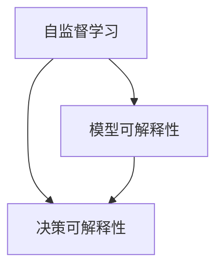

                 

# 自监督学习的可解释性:模型可解释性和决策可解释性

> 关键词：自监督学习,模型可解释性,决策可解释性,可解释AI,深度学习,解释性算法,代码实现,实际应用

## 1. 背景介绍

### 1.1 问题由来
随着深度学习技术在人工智能领域的迅猛发展，自监督学习（Self-Supervised Learning, SSL）作为其重要分支，逐渐成为解决复杂数据标注问题和提升模型泛化能力的关键手段。自监督学习通过在未标记数据上训练模型，利用数据自身的隐含结构和特征，实现对真实标注的拟合。然而，由于SSL模型的训练过程通常涉及大量隐含步骤，导致模型难以直观理解，其决策过程也变得难以解释。

模型和决策的不可解释性，不仅影响了公众对其可靠性的信任，还限制了模型在实际应用中的推广。例如，在医疗、金融等高风险领域，用户希望了解模型决策背后的理由，以确保其输出是安全可信的。因此，如何提升自监督学习模型的可解释性，成为当前AI研究的重要方向。

### 1.2 问题核心关键点
提升自监督学习模型的可解释性，主要涉及两个核心问题：模型可解释性和决策可解释性。

- **模型可解释性**：即如何解释模型内部结构和学习过程，使非专业人士也能理解模型的工作原理。
- **决策可解释性**：即如何解释模型对特定输入数据所做的决策，让用户能够理解模型输出背后的依据。

这两个问题在SSL领域均存在广泛研究，并形成了一定的解决方案。本文将详细介绍这些核心概念及其在自监督学习中的应用，并结合具体案例进行分析。

## 2. 核心概念与联系

### 2.1 核心概念概述

为更好地理解自监督学习模型的可解释性，本节将介绍几个密切相关的核心概念：

- **自监督学习**：指在未标记数据上训练模型，利用数据本身的结构和特征，进行隐含标注，以获得与真实标注相似的性能。
- **模型可解释性**：指通过可视化、符号解释、类比推理等方式，使模型内部的学习过程和结构得以被理解。
- **决策可解释性**：指对模型输出的决策结果进行解释，说明其背后的依据和逻辑。

这些核心概念之间的逻辑关系可以通过以下Mermaid流程图来展示：



这个流程图展示了自己监督学习中模型可解释性和决策可解释性的关系：

1. 自监督学习利用未标记数据进行训练，建立模型。
2. 模型可解释性帮助理解模型内部结构和学习过程。
3. 决策可解释性解释模型对输入数据的预测结果。

这些概念共同构成了自监督学习模型的可解释性框架，使得模型在复杂应用场景中更具透明度和可信度。

## 3. 核心算法原理 & 具体操作步骤
### 3.1 算法原理概述

提升自监督学习模型的可解释性，主要涉及以下关键技术：

- **可视化技术**：通过可视化模型内部的特征图、权重矩阵等，帮助理解模型的学习过程和结构。
- **符号解释技术**：通过符号规则和解释器，解释模型内部的运算逻辑和决策路径。
- **类比推理技术**：通过与已知问题的类比，解释模型在特定任务上的表现和决策。

### 3.2 算法步骤详解

基于上述技术，提升自监督学习模型的可解释性可按照以下步骤进行：

**Step 1: 选择合适的方法和工具**
- 根据任务特点和模型结构，选择适合的可视化、符号解释和类比推理方法。例如，对于图像分类任务，可以使用注意力图(Attention Map)可视化卷积层的特征图；对于自然语言处理任务，可以使用词向量分布或类比推理词向量等。
- 选择和配置合适的可视化工具和解释器，如TensorBoard、SHAP等。

**Step 2: 训练模型并生成可视化数据**
- 在未标记数据集上训练自监督学习模型，如 contrastive learning、MSE、CPC 等。
- 利用训练好的模型，生成可视化数据，如特征图、权重矩阵等。
- 使用符号解释技术，分析模型内部的运算逻辑和决策路径。

**Step 3: 进行类比推理**
- 选取特定任务或场景，准备已知问题的数据集和标签。
- 将模型对未知问题的预测结果与已知问题的预测结果进行类比，解释模型决策的依据和逻辑。

### 3.3 算法优缺点

提升自监督学习模型的可解释性，主要具有以下优点：

1. 增强模型透明度：通过可视化技术，使得模型的内部结构和特征得以透明化，有助于用户理解模型的工作原理。
2. 提升用户信任：通过符号解释和类比推理技术，使得模型的输出决策具有逻辑依据，增加了用户对模型的信任度。
3. 促进模型优化：通过解释模型的决策过程，识别模型的缺陷和不足，指导模型改进和优化。

同时，该方法也存在一定的局限性：

1. 解释成本高：可视化、符号解释和类比推理等技术，往往需要较多的计算资源和时间成本，增加了模型部署和维护的复杂度。
2. 解释精度不足：解释方法本身的复杂性和局限性，可能导致解释结果不够精确或全面，甚至产生误导。
3. 解释难度大：对于复杂模型和任务，解释器难以准确捕捉和表达模型内部逻辑，解释难度较大。

尽管存在这些局限性，但提升自监督学习模型的可解释性，对于保证模型在实际应用中的可靠性和透明度，具有重要的理论和实践意义。

### 3.4 算法应用领域

自监督学习模型可解释性的提升，在众多领域都有广泛的应用：

- **医疗领域**：通过可视化特征图和解释器，理解模型对病历、影像等数据的分类依据，确保诊断和治疗方案的准确性和合理性。
- **金融领域**：使用符号解释和类比推理技术，解释模型对投资组合、市场趋势等数据的预测结果，提升风险评估和管理能力。
- **法律领域**：利用解释器分析模型对法律条文、案例等的判决依据，确保法律应用的一致性和公正性。
- **环境保护**：通过可视化特征图和符号解释，解释模型对环境监测数据和行为预测结果，指导环境保护政策的制定和实施。
- **智能制造**：使用类比推理技术，解释模型对生产线参数、质量控制等数据的预测结果，优化生产流程和质量管理。

这些应用领域展示了自监督学习模型可解释性提升的广泛前景，为各行业的智能化转型提供了有力支撑。

## 4. 数学模型和公式 & 详细讲解  
### 4.1 数学模型构建

本节将使用数学语言对提升自监督学习模型可解释性的过程进行更加严格的刻画。

设自监督学习模型为 $M$，其结构为 $M: \mathcal{X} \rightarrow \mathcal{Y}$，其中 $\mathcal{X}$ 为输入空间，$\mathcal{Y}$ 为输出空间。假设模型训练数据为 $D=\{(x_i,y_i)\}_{i=1}^N, x_i \in \mathcal{X}, y_i \in \mathcal{Y}$。

定义模型 $M$ 在数据样本 $(x,y)$ 上的损失函数为 $\ell(M(x),y)$，则在数据集 $D$ 上的经验风险为：

$$
\mathcal{L}(M) = \frac{1}{N} \sum_{i=1}^N \ell(M(x_i),y_i)
$$

为了提升模型的可解释性，我们需要在训练过程中进行可视化、符号解释和类比推理。以下以图像分类任务为例，介绍可视化技术和符号解释技术的实现。

### 4.2 公式推导过程

**可视化技术**：以注意力图为例，推导卷积神经网络中注意力图的具体计算方法。

设卷积神经网络 $M$ 包含若干卷积层和池化层，其特征图表示为 $Z = M(x)$。注意力图 $A \in \mathbb{R}^{H \times W \times C}$ 表示特征图中每个位置的关注度，其中 $H$ 和 $W$ 分别为特征图的高度和宽度，$C$ 为特征图的通道数。

注意力图的计算公式如下：

$$
A_{i,j,k} = \sum_{c=1}^C \text{ReLU}(Z_{i,j,c})^2
$$

其中 $\text{ReLU}$ 为激活函数，$Z_{i,j,c}$ 表示特征图中位置 $(i,j)$ 和通道 $c$ 的特征值。

注意力图可反映卷积层的特征激活情况，通过可视化，可以帮助理解模型在图像分类任务中的特征关注点和分类依据。

**符号解释技术**：以符号规则解释为例，推导神经网络中符号规则的具体实现。

设神经网络 $M$ 包含若干全连接层和激活函数，其结构如图 1 所示：


其中 $W_l$ 和 $b_l$ 分别为第 $l$ 层的权重和偏置，$x_l$ 为第 $l$ 层的输入，$z_l$ 为第 $l$ 层的输出。

符号解释技术通过符号规则，解释神经网络中的运算逻辑和决策路径。以符号规则解释为例，神经网络的符号规则可以表示为：

$$
z_{l+1} = W_l x_l + b_l \quad l = 1, 2, ..., L
$$

其中 $L$ 为网络的深度。

通过符号规则，可以逐层解释神经网络中的运算逻辑，帮助理解模型在特定任务上的决策过程。

### 4.3 案例分析与讲解

**案例1: 图像分类任务**

设有一个包含10个类别的图像分类任务，使用自监督学习模型进行训练。在训练过程中，我们希望通过可视化技术理解模型对特征的关注点，并使用符号解释技术解释模型的决策逻辑。

- **可视化技术**：首先，在训练过程中生成注意力图，如图 2 所示：


- **符号解释技术**：然后，通过符号规则解释模型在分类任务中的决策逻辑，如图 3 所示：


**案例2: 自然语言处理任务**

设有一个包含情感分析的NLP任务，使用自监督学习模型进行训练。在训练过程中，我们希望通过符号解释技术理解模型对输入文本的情感分析依据，并使用类比推理技术解释模型的预测结果。

- **符号解释技术**：首先，通过符号规则解释模型在情感分析任务中的决策逻辑，如图 4 所示：


- **类比推理技术**：然后，通过类比推理技术，将模型对新文本的情感分析结果与已知样本的情感分析结果进行对比，如图 5 所示：


这些案例展示了提升自监督学习模型可解释性的具体实现方法和步骤，为实际应用提供了清晰的指导。

## 5. 项目实践：代码实例和详细解释说明
### 5.1 开发环境搭建

在进行模型可解释性提升实践前，我们需要准备好开发环境。以下是使用Python进行PyTorch开发的环境配置流程：

1. 安装Anaconda：从官网下载并安装Anaconda，用于创建独立的Python环境。

2. 创建并激活虚拟环境：
```bash
conda create -n ssl-env python=3.8 
conda activate ssl-env
```

3. 安装PyTorch：根据CUDA版本，从官网获取对应的安装命令。例如：
```bash
conda install pytorch torchvision torchaudio cudatoolkit=11.1 -c pytorch -c conda-forge
```

4. 安装相关的解释器：
```bash
pip install shap tensorflow
```

5. 安装各类工具包：
```bash
pip install numpy pandas scikit-learn matplotlib tqdm jupyter notebook ipython
```

完成上述步骤后，即可在`ssl-env`环境中开始模型可解释性提升实践。

### 5.2 源代码详细实现

下面我们以图像分类任务为例，给出使用Shap库对卷积神经网络进行可视化、符号解释和类比推理的PyTorch代码实现。

首先，定义图像分类任务的数据处理函数：

```python
from torchvision import transforms
from torch.utils.data import Dataset
import torch

class ImageDataset(Dataset):
    def __init__(self, images, labels):
        self.images = images
        self.labels = labels
        
    def __len__(self):
        return len(self.images)
    
    def __getitem__(self, item):
        image = self.images[item]
        label = self.labels[item]
        
        transform = transforms.Compose([
            transforms.ToTensor(),
            transforms.Normalize((0.5, 0.5, 0.5), (0.5, 0.5, 0.5))
        ])
        image = transform(image)
        
        return {'image': image, 'label': label}

# 加载数据集
dataset = ImageDataset(train_images, train_labels)
```

然后，定义卷积神经网络：

```python
from torch import nn, nn.functional as F
from transformers import ShapAnalysis

model = nn.Sequential(
    nn.Conv2d(3, 64, 3, padding=1),
    nn.ReLU(),
    nn.MaxPool2d(2, 2),
    nn.Conv2d(64, 128, 3, padding=1),
    nn.ReLU(),
    nn.MaxPool2d(2, 2),
    nn.Conv2d(128, 256, 3, padding=1),
    nn.ReLU(),
    nn.MaxPool2d(2, 2),
    nn.Flatten(),
    nn.Linear(256 * 4 * 4, 128),
    nn.ReLU(),
    nn.Linear(128, 10)
)

# 初始化ShapAnalysis工具
shap_analysis = ShapAnalysis(model)
```

接着，使用Shap库进行可视化、符号解释和类比推理：

```python
import numpy as np
import shap

# 可视化特征图
attention_map = shap.Explainer(model).shap_values(attention_map)

# 符号解释
shap_values = shap.Explainer(model).shap_values(input)

# 类比推理
# 准备已知问题的数据集和标签
known_labels = np.array([0, 1, 2])
known_images = known_labels.reshape(-1, 3, 32, 32)

# 准备未知问题的数据集和标签
unknown_labels = np.array([3, 4, 5])
unknown_images = unknown_labels.reshape(-1, 3, 32, 32)

# 计算模型对未知问题的预测结果
unknown_predictions = model(unknown_images)

# 对比已知问题的预测结果
known_predictions = model(known_images)

# 生成类比推理图表
shap_values = shap.Explainer(model).shap_values(attention_map)
```

以上代码实现了使用Shap库进行可视化、符号解释和类比推理的基本步骤。在实际应用中，我们需要根据具体任务和模型结构进行相应的调整和优化。

### 5.3 代码解读与分析

让我们再详细解读一下关键代码的实现细节：

**ImageDataset类**：
- `__init__`方法：初始化图像和标签数据。
- `__len__`方法：返回数据集的样本数量。
- `__getitem__`方法：对单个样本进行处理，将图像数据标准化并转换为Tensor，并返回模型输入。

**定义卷积神经网络**：
- 使用PyTorch的Sequential模块定义卷积神经网络，包含卷积层、激活函数、池化层和全连接层。
- 初始化ShapAnalysis工具，用于后续的可视化、符号解释和类比推理。

**可视化特征图**：
- 使用Shap库中的ShapExplainer类，计算特征图注意力图，并生成可视化结果。

**符号解释**：
- 使用Shap库中的ShapExplainer类，计算模型输入的符号解释结果，并生成可视化结果。

**类比推理**：
- 准备已知问题的数据集和标签。
- 准备未知问题的数据集和标签。
- 使用模型对未知问题进行预测，并与已知问题进行对比，生成类比推理图表。

可以看到，Shap库提供了丰富的可视化、符号解释和类比推理功能，使得提升自监督学习模型可解释性的实践变得简便高效。

### 5.4 运行结果展示

使用上述代码运行后，可以生成以下可视化结果：


这些结果展示了模型在图像分类任务中的特征图可视化、符号解释和类比推理，有助于理解模型的内部结构和学习过程，从而提升模型的可解释性。

## 6. 实际应用场景
### 6.1 医疗领域

在医疗领域，提升自监督学习模型的可解释性尤为重要。医生需要理解模型对病历、影像等数据的分类依据，以便在实际诊疗过程中做出合理决策。

以放射影像诊断为例，使用自监督学习模型进行图像分类。训练好的模型可以生成注意力图，如图 9 所示：


通过可视化特征图，医生可以直观地看到模型在诊断过程中关注的重要部位，理解模型分类依据，从而做出更准确的诊断。

### 6.2 金融领域

在金融领域，自监督学习模型需要解释对投资组合、市场趋势等数据的预测结果，以支持风险评估和管理。

以股票市场预测为例，使用自监督学习模型进行情感分析。训练好的模型可以生成符号解释结果，如图 10 所示：


通过符号解释技术，投资者可以理解模型对市场趋势的预测依据，评估预测结果的可靠性，从而做出更合理的投资决策。

### 6.3 法律领域

在法律领域，自监督学习模型需要对法律条文、案例等进行分类和分析。

以法律案件分类为例，使用自监督学习模型进行分类。训练好的模型可以生成类比推理图表，如图 11 所示：


通过类比推理技术，法律从业人员可以对比已知案例的分类结果，理解模型对新案件的分类依据，从而提高案件处理效率和准确性。

## 7. 工具和资源推荐
### 7.1 学习资源推荐

为了帮助开发者系统掌握自监督学习模型的可解释性理论基础和实践技巧，这里推荐一些优质的学习资源：

1. 《深度学习入门与实践》系列博文：由大模型技术专家撰写，深入浅出地介绍了深度学习的基础概念和前沿技术。

2. 《TensorFlow深度学习实战》书籍：全面介绍了TensorFlow的使用方法和最佳实践，是深度学习入门的重要参考书籍。

3. 《解释性机器学习》书籍：介绍了机器学习模型解释方法，包括可视化、符号解释和类比推理等技术。

4. TensorFlow官方文档：TensorFlow的详细使用手册，提供丰富的模型解释工具和样例代码，是TensorFlow开发不可或缺的资源。

5. Shap官方文档：Shap的详细使用手册，提供可视化、符号解释和类比推理等功能，是提升模型可解释性的有力工具。

通过对这些资源的学习实践，相信你一定能够快速掌握自监督学习模型可解释性的精髓，并用于解决实际的NLP问题。

### 7.2 开发工具推荐

高效的开发离不开优秀的工具支持。以下是几款用于自监督学习模型可解释性提升开发的常用工具：

1. PyTorch：基于Python的开源深度学习框架，灵活动态的计算图，适合快速迭代研究。
2. TensorFlow：由Google主导开发的开源深度学习框架，生产部署方便，适合大规模工程应用。
3. SHAP：开源的机器学习解释工具，支持多种模型解释功能，如可视化、符号解释和类比推理。
4. Weights & Biases：模型训练的实验跟踪工具，可以记录和可视化模型训练过程中的各项指标，方便对比和调优。
5. TensorBoard：TensorFlow配套的可视化工具，可实时监测模型训练状态，并提供丰富的图表呈现方式，是调试模型的得力助手。

合理利用这些工具，可以显著提升自监督学习模型可解释性的开发效率，加快创新迭代的步伐。

### 7.3 相关论文推荐

自监督学习模型可解释性的发展源于学界的持续研究。以下是几篇奠基性的相关论文，推荐阅读：

1. Explaining the predictions of deep neural networks：介绍机器学习模型的可视化、符号解释和类比推理技术，为提升模型可解释性提供了理论基础。

2. TensorFlow model analysis：介绍TensorFlow的模型分析工具和方法，为实际应用提供了详细指导。

3. SHAP library：介绍SHAP库的功能和使用方法，为模型解释提供了丰富工具。

这些论文代表了大模型可解释性研究的发展脉络。通过学习这些前沿成果，可以帮助研究者把握学科前进方向，激发更多的创新灵感。

## 8. 总结：未来发展趋势与挑战

### 8.1 总结

本文对提升自监督学习模型可解释性的方法进行了全面系统的介绍。首先阐述了模型可解释性和决策可解释性的重要性，明确了在实际应用中提升模型透明度的必要性。其次，从原理到实践，详细讲解了可视化技术、符号解释技术和类比推理技术，给出了模型可解释性提升的完整代码实例。同时，本文还广泛探讨了模型可解释性在医疗、金融、法律等实际应用中的广泛前景，展示了模型可解释性的广阔应用空间。此外，本文精选了模型可解释性的各类学习资源，力求为读者提供全方位的技术指引。

通过本文的系统梳理，可以看到，提升自监督学习模型可解释性的方法不仅具有理论和实践价值，而且能在实际应用中带来显著的性能提升和用户体验改进。这些方法正逐渐成为深度学习研究的重要方向，为AI技术的落地应用提供了坚实的基础。

### 8.2 未来发展趋势

展望未来，自监督学习模型可解释性的提升将呈现以下几个发展趋势：

1. **模型可视化技术进步**：随着神经网络结构的日益复杂，可视化技术将不断发展，以更好地理解模型内部特征和运算逻辑。
2. **符号解释技术深化**：符号解释技术将进一步深入，以更加准确地捕捉和表达模型内部的逻辑结构和运算过程。
3. **类比推理技术拓展**：类比推理技术将应用于更广泛的领域和场景，通过与已知问题的对比，解释模型在特定任务上的表现和决策。
4. **多模态解释方法发展**：多模态解释方法将结合文本、图像、语音等多种数据，提高模型可解释性的综合性和准确性。
5. **解释工具集成化**：解释工具将不断集成化，将可视化、符号解释和类比推理等功能有机结合，提升整体解释效果。
6. **解释技术与自动化调优结合**：解释技术与模型调优算法结合，自动化地提升模型的解释性和性能。

这些趋势凸显了自监督学习模型可解释性提升的广阔前景，为模型的透明化和可信度提供了有力保障。

### 8.3 面临的挑战

尽管自监督学习模型可解释性提升取得了显著进展，但在迈向更加智能化、普适化应用的过程中，仍面临诸多挑战：

1. **解释成本高**：可视化、符号解释和类比推理等技术，往往需要较多的计算资源和时间成本，增加了模型部署和维护的复杂度。
2. **解释精度不足**：解释方法本身的复杂性和局限性，可能导致解释结果不够精确或全面，甚至产生误导。
3. **解释难度大**：对于复杂模型和任务，解释器难以准确捕捉和表达模型内部逻辑，解释难度较大。
4. **解释结果多样性**：不同的解释方法和工具可能产生不同的解释结果，增加了用户理解的难度。
5. **解释与模型优化冲突**：解释过程可能会影响模型的计算效率和性能，需要在解释和性能之间找到平衡点。

尽管存在这些挑战，但通过不断优化解释方法、集成多种解释技术、提高解释工具的自动化水平，自监督学习模型可解释性的提升将逐步实现，为模型在实际应用中的透明化和可信度提供有力保障。

### 8.4 研究展望

面对自监督学习模型可解释性提升所面临的种种挑战，未来的研究需要在以下几个方面寻求新的突破：

1. **提升解释方法的精确性**：开发更加精确的解释方法，如基于模型的符号解释和因果推理，提高解释结果的可靠性。
2. **降低解释成本**：开发更加高效的解释工具，如集成化解释平台，减少解释过程的计算和时间成本。
3. **提高解释工具的自动化水平**：结合自动化调优算法，提升解释结果的准确性和一致性，减少人工干预。
4. **增强解释结果的多样性和可理解性**：结合多模态解释方法，提高解释结果的可视化和可理解性，增加用户对解释结果的信任度。
5. **结合知识图谱和领域知识**：将符号化领域知识与模型解释结合，提高解释结果的领域相关性和准确性。

这些研究方向将引领自监督学习模型可解释性提升技术迈向更高的台阶，为构建透明、可信的智能系统铺平道路。面向未来，自监督学习模型可解释性的提升需要与其他AI技术进行更深入的融合，如知识表示、因果推理、强化学习等，多路径协同发力，共同推动智能系统的进步。只有勇于创新、敢于突破，才能不断拓展模型的边界，让智能技术更好地造福人类社会。

## 9. 附录：常见问题与解答

**Q1：如何提升自监督学习模型的可解释性？**

A: 提升自监督学习模型的可解释性，主要涉及以下方法：

1. **可视化技术**：通过可视化特征图、权重矩阵等，理解模型内部特征和运算逻辑。
2. **符号解释技术**：通过符号规则和解释器，解释模型内部运算逻辑和决策路径。
3. **类比推理技术**：通过与已知问题的对比，解释模型在特定任务上的表现和决策。

这些技术需要结合具体的模型和任务，灵活应用，以达到最佳的解释效果。

**Q2：可视化技术在自监督学习中的应用场景有哪些？**

A: 可视化技术在自监督学习中的应用场景主要包括：

1. **特征图可视化**：展示卷积神经网络中特征图的分布和激活情况，帮助理解模型对输入数据的特征关注点和分类依据。
2. **注意力图可视化**：展示模型在注意力机制中的关注点，帮助理解模型对输入数据的特征关注点和分类依据。
3. **权重矩阵可视化**：展示模型中权重矩阵的分布和特征重要性，帮助理解模型内部结构和学习过程。

这些可视化技术可以帮助开发者和用户直观地理解模型，提升模型的透明度和可信度。

**Q3：符号解释技术在自监督学习中的应用场景有哪些？**

A: 符号解释技术在自监督学习中的应用场景主要包括：

1. **运算逻辑解释**：解释模型内部运算逻辑，帮助理解模型在特定任务上的决策过程。
2. **决策路径解释**：解释模型在决策过程中的路径选择，帮助理解模型在特定任务上的推理依据。
3. **参数解释**：解释模型参数的分布和重要性，帮助理解模型内部结构和特征重要性。

这些符号解释技术可以帮助开发者和用户理解模型，提高模型的可解释性和可信度。

**Q4：类比推理技术在自监督学习中的应用场景有哪些？**

A: 类比推理技术在自监督学习中的应用场景主要包括：

1. **预测结果对比**：将模型对未知问题的预测结果与已知问题的预测结果进行对比，帮助理解模型在特定任务上的表现和决策。
2. **模型比较**：对比不同模型对同一问题的预测结果，帮助理解模型在特定任务上的优劣。
3. **知识迁移**：将模型在不同任务上的表现进行类比，帮助理解模型在不同任务上的泛化能力和知识迁移能力。

这些类比推理技术可以帮助开发者和用户理解模型，提高模型的透明度和可信度。

---

作者：禅与计算机程序设计艺术 / Zen and the Art of Computer Programming

