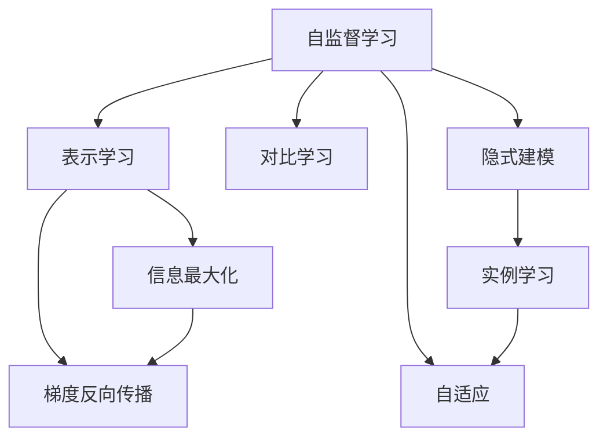

                 

# 自监督学习的理论创新:表示学习和对比学习

> 关键词：自监督学习,表示学习,对比学习,隐式建模,无监督学习,信息最大化,梯度反向传播,对比预测器,实例学习,自适应,深度学习

## 1. 背景介绍

### 1.1 问题由来
自监督学习(SSL)是机器学习领域中一种重要的无监督学习方法，其核心思想是利用数据的隐含信息进行模型训练，从而获得更好的泛化性能。在深度学习时代，自监督学习已发展成为与监督学习、强化学习并驾齐驱的重要范式。

自监督学习的兴起，很大程度上源于其在NLP和计算机视觉等领域所取得的突破性进展。特别是表示学习(Representation Learning)和对比学习(Contrastive Learning)的提出，为构建高性能的深度学习模型开辟了新路径。

近年来，通过自监督学习的知识迁移，在大规模无标签数据上进行预训练，学习通用表示，已成为深度学习领域的新趋势。预训练-微调的大模型范式，已经成为NLP领域的主流。

例如，BERT、GPT-3等大模型的横空出世，正是在大规模无标签文本数据的自监督预训练基础上，通过下游任务的微调，获得了显著的性能提升。

### 1.2 问题核心关键点
自监督学习理论创新主要包括表示学习和对比学习两大方向。表示学习主要关注如何通过隐式方式学习数据的内在表示，提升模型的泛化能力。而对比学习则关注如何通过隐式或显式的对比训练，学习不同样本之间的相对关系，从而优化模型的表征能力。

### 1.3 问题研究意义
研究自监督学习的表示学习和对比学习，对于提升模型泛化性能，加速无标签数据的利用，推动深度学习技术在更多领域落地应用，具有重要意义：

1. **减少标注成本**：自监督学习利用大规模无标签数据进行预训练，可以极大地降低数据标注成本。
2. **提升泛化能力**：通过隐式学习数据的内在表示，自监督学习模型具有更强的泛化性能，能更好地适应新任务。
3. **加速模型开发**：自监督学习可以将通用知识迁移应用到下游任务，缩短模型开发周期，加速AI技术在各行各业的落地应用。
4. **开辟新研究方向**：自监督学习的发展，带动了表示学习、对比学习、元学习等新兴研究方向，丰富了深度学习理论体系。
5. **应对数据稀疏问题**：在数据稀疏、标注数据难以获取的领域，自监督学习为模型训练提供了新的思路和手段。

## 2. 核心概念与联系

### 2.1 核心概念概述

为更好地理解自监督学习的表示学习和对比学习，本节将介绍几个密切相关的核心概念：

- **自监督学习(SSL)**：利用数据的隐含信息进行模型训练，无需显式的标签。目标是通过学习数据的内在表示，获得更好的泛化性能。
- **表示学习(Representation Learning)**：通过隐式方式学习数据的内在表示，提升模型的泛化能力和特征表达能力。
- **对比学习(Contrastive Learning)**：通过学习不同样本之间的相对关系，优化模型的表征能力。可以分为隐式对比学习和显式对比学习。
- **隐式建模(Hidden Representation)**：模型学习到的能够隐式表达数据内在结构的表示。
- **信息最大化(Information Maximization)**：通过最大化数据之间的信息差异，提升模型的泛化能力。
- **梯度反向传播(Gradient Backpropagation)**：通过反向传播算法，计算损失函数对模型参数的梯度，更新模型参数。
- **对比预测器(Contrastive Predictor)**：隐式对比学习中使用的一种预测器，用于对比不同样本之间的关系，优化模型表示。
- **实例学习(Instance Learning)**：通过学习个体样本的特征表示，实现对新样本的预测和分类。
- **自适应(Adaptation)**：模型能够根据输入数据自适应地进行参数更新，优化模型表示。

这些核心概念之间的逻辑关系可以通过以下Mermaid流程图来展示：



这个流程图展示了他表示学习、对比学习、自适应等关键概念之间的内在联系，以及自监督学习通过隐式建模和信息最大化来实现模型优化的一般过程。

## 3. 核心算法原理 & 具体操作步骤
### 3.1 算法原理概述

自监督学习的核心在于利用数据的隐含信息进行模型训练。其基本流程是：首先在大规模无标签数据上进行预训练，学习数据的内在表示；然后在下游任务上进行微调，使模型适应特定任务。这一过程被概括为"预训练-微调"范式。

预训练阶段的目标是通过隐式方式学习数据的内在表示，通常采用以下几种方式：

1. **隐式建模**：通过隐式方式学习数据的分布特征或结构，例如使用自回归模型、自编码器等。
2. **信息最大化**：通过最大化数据之间的信息差异，例如通过最大化互信息(MI)来学习数据的表示。
3. **对比学习**：通过学习不同样本之间的相对关系，例如通过对比预测器来学习样本的相似度。

微调阶段的目标是使模型适应下游任务，通常在少量标注数据上微调模型，使其在特定任务上取得更好的性能。微调通常包括全参数微调和参数高效微调，例如使用Adapter等技术。

### 3.2 算法步骤详解

自监督学习的核心算法流程一般包括以下几个关键步骤：

**Step 1: 准备数据集**
- 收集大规模无标签数据集，准备进行预训练。
- 划分训练集、验证集和测试集，供模型评估和调优使用。

**Step 2: 选择预训练模型和任务**
- 选择合适的预训练模型，如BERT、GPT-3等。
- 根据任务特点，选择相应的预训练任务，如掩码语言模型、自回归模型等。

**Step 3: 设计预训练目标**
- 设计预训练目标函数，如交叉熵、互信息、对比预测器等。
- 使用梯度反向传播算法，计算损失函数对模型参数的梯度，更新模型参数。

**Step 4: 执行预训练**
- 在预训练数据集上进行多轮迭代训练，优化模型参数。
- 周期性在验证集上评估模型性能，避免过拟合。
- 重复上述过程直至收敛。

**Step 5: 执行微调**
- 选择下游任务的标注数据集，进行微调。
- 设计微调任务适配层，如分类器、回归器等。
- 使用小学习率，微调模型以适应下游任务。
- 周期性在测试集上评估模型性能，确保微调效果。

### 3.3 算法优缺点

自监督学习在数据标注成本高、标注数据稀缺的情况下，具有显著的优势，能够有效利用大规模无标签数据进行模型训练。然而，自监督学习也存在以下局限性：

**优点**：
1. **减少标注成本**：利用大规模无标签数据进行预训练，能够极大地减少数据标注成本。
2. **泛化能力强**：自监督学习能够通过学习数据的内在表示，提升模型的泛化能力，更好地适应新任务。
3. **加速模型开发**：预训练模型能够将通用知识迁移应用到下游任务，加速模型开发和部署。
4. **开辟新研究方向**：推动了表示学习、对比学习、元学习等新兴研究方向的发展。
5. **应对数据稀疏问题**：在数据稀疏、标注数据难以获取的领域，自监督学习提供了新的数据利用思路。

**缺点**：
1. **隐式建模复杂**：自监督学习需要设计复杂的隐式建模任务，可能需要较长的预训练时间。
2. **泛化能力有限**：预训练数据集的选择和质量对模型性能有很大影响，模型可能难以泛化到预训练数据集之外的领域。
3. **对比学习局限**：对比学习需要大量负样本进行训练，在数据稀疏情况下难以发挥其优势。
4. **可解释性不足**：自监督学习的隐式建模过程难以解释，模型决策机制不透明。
5. **资源消耗大**：大规模数据和复杂模型结构需要大量计算资源和时间。

尽管存在这些局限性，但自监督学习仍然是大规模无标签数据应用的重要范式，其优势在实际应用中得到了充分体现。未来相关研究的方向在于如何进一步提升自监督学习方法的泛化能力，增强模型的可解释性，并减少资源消耗。

### 3.4 算法应用领域

自监督学习的表示学习和对比学习在多个领域得到了广泛应用，例如：

- **自然语言处理(NLP)**：使用自监督学习在大规模文本数据上进行预训练，学习通用语言表示，应用于文本分类、情感分析、问答系统、机器翻译等任务。
- **计算机视觉(CV)**：利用自监督学习在大规模图像数据上进行预训练，学习通用图像特征，应用于图像分类、目标检测、语义分割等任务。
- **语音识别(Speech Recognition)**：通过自监督学习在音频数据上进行预训练，学习语音特征表示，应用于语音识别、语音合成等任务。
- **推荐系统(Recommendation System)**：利用自监督学习在用户行为数据上进行预训练，学习用户兴趣表示，应用于个性化推荐、广告推荐等任务。
- **自然语言生成(NLG)**：通过自监督学习在文本数据上进行预训练，学习语言生成模型，应用于对话生成、文本摘要、代码生成等任务。

除了这些经典应用外，自监督学习还被创新性地应用到更多场景中，如可控文本生成、图像生成、跨模态学习等，为各类领域提供了新的技术路径。

## 4. 数学模型和公式 & 详细讲解  
### 4.1 数学模型构建

本节将使用数学语言对自监督学习的表示学习和对比学习进行更加严格的刻画。

记自监督学习模型为 $M_{\theta}$，其中 $\theta$ 为模型参数。假设自监督学习任务为 $T$，预训练数据集为 $D=\{(x_i,y_i)\}_{i=1}^N$，其中 $x_i$ 为输入，$y_i$ 为隐含标签。

定义模型 $M_{\theta}$ 在输入 $x_i$ 上的表示为 $f_{\theta}(x_i)$，表示学习目标为最大化数据之间的信息差异，即：

$$
\mathcal{L}_{ssl}(\theta) = \frac{1}{N} \sum_{i=1}^N I(x_i; y_i)
$$

其中 $I(x_i; y_i)$ 为输入 $x_i$ 与隐含标签 $y_i$ 之间的互信息，可以定义为：

$$
I(x_i; y_i) = H(x_i) - H(x_i|y_i) = H(y_i) - H(y_i|x_i)
$$

其中 $H(x_i)$ 和 $H(y_i)$ 分别为输入 $x_i$ 和隐含标签 $y_i$ 的熵，$H(x_i|y_i)$ 和 $H(y_i|x_i)$ 分别为条件熵。

对比学习的目标是通过最大化正负样本之间的差异，优化模型表示。假设正样本为 $x^+$，负样本为 $x^-$，则对比学习目标为：

$$
\mathcal{L}_{contrastive}(\theta) = -\frac{1}{N} \sum_{i=1}^N L(x_i, x^+, x^-)
$$

其中 $L(x_i, x^+, x^-)$ 为对比损失函数，可以是对比预测器的输出损失，如Triplet Loss、NCE Loss等。

### 4.2 公式推导过程

以下我们以对比学习中的Triplet Loss为例，推导其数学推导过程。

假设对比学习模型的表示为 $f_{\theta}(x_i)$，正负样本的表示分别为 $f_{\theta}(x^+)$ 和 $f_{\theta}(x^-)$。则Triplet Loss可以定义为：

$$
L(x_i, x^+, x^-) = \max\{d(f_{\theta}(x_i), f_{\theta}(x^+)) - d(f_{\theta}(x_i), f_{\theta}(x^-)) + \xi, 0\}
$$

其中 $d(\cdot, \cdot)$ 为度量函数，$\xi$ 为margin值，用于保证正负样本之间的距离。

将对比损失函数代入总体损失函数，得：

$$
\mathcal{L}_{contrastive}(\theta) = -\frac{1}{N} \sum_{i=1}^N \max\{d(f_{\theta}(x_i), f_{\theta}(x^+)) - d(f_{\theta}(x_i), f_{\theta}(x^-)) + \xi, 0\}
$$

为了简化计算，可以引入softmax函数进行归一化，得到softmax contrastive loss：

$$
L_{softmax}(x_i, x^+, x^-) = -\log \frac{e^{d(f_{\theta}(x_i), f_{\theta}(x^+))}}{e^{d(f_{\theta}(x_i), f_{\theta}(x^+))} + e^{d(f_{\theta}(x_i), f_{\theta}(x^-))}}
$$

总体损失函数变为：

$$
\mathcal{L}_{contrastive}(\theta) = -\frac{1}{N} \sum_{i=1}^N L_{softmax}(x_i, x^+, x^-)
$$

通过上述公式推导，可以清晰地理解自监督学习中对比学习的数学原理，并通过梯度反向传播算法对模型参数进行优化。

### 4.3 案例分析与讲解

以GPT-3为例，展示如何使用自监督学习进行表示学习。GPT-3通过在掩码语言模型上进行预训练，学习了大规模文本数据的内在表示，然后在下游任务上进行微调，取得了显著的效果。

**Step 1: 准备数据集**
- 收集大规模无标签文本数据，如维基百科、Web数据等。
- 划分训练集、验证集和测试集，供模型评估和调优使用。

**Step 2: 选择预训练模型**
- 选择GPT-3作为预训练模型。

**Step 3: 设计预训练目标**
- 在训练过程中，每个时间步预测下一个词，例如：
  - 正向掩码：$x_{1:t} \rightarrow x_{t+1}$，通过自回归方式预测下一个词 $x_{t+1}$。
  - 反向掩码：$x_{1:t} \rightarrow x_t$，通过自回归方式预测上一步词 $x_t$。
- 设计预训练损失函数，如交叉熵损失。

**Step 4: 执行预训练**
- 在预训练数据集上进行多轮迭代训练，优化模型参数。
- 周期性在验证集上评估模型性能，避免过拟合。
- 重复上述过程直至收敛。

**Step 5: 执行微调**
- 选择下游任务的标注数据集，如文本分类、问答系统等。
- 设计微调任务适配层，如分类器、回归器等。
- 使用小学习率，微调模型以适应下游任务。
- 周期性在测试集上评估模型性能，确保微调效果。

通过上述步骤，GPT-3在预训练阶段学习到了文本数据的通用表示，然后在下游任务上进行微调，取得了显著的性能提升。

## 5. 项目实践：代码实例和详细解释说明
### 5.1 开发环境搭建

在进行自监督学习实践前，我们需要准备好开发环境。以下是使用Python进行PyTorch开发的环境配置流程：

1. 安装Anaconda：从官网下载并安装Anaconda，用于创建独立的Python环境。

2. 创建并激活虚拟环境：
```bash
conda create -n pytorch-env python=3.8 
conda activate pytorch-env
```

3. 安装PyTorch：根据CUDA版本，从官网获取对应的安装命令。例如：
```bash
conda install pytorch torchvision torchaudio cudatoolkit=11.1 -c pytorch -c conda-forge
```

4. 安装相关库：
```bash
pip install torch torchvision torchtext numpy pandas scikit-learn matplotlib tqdm jupyter notebook ipython
```

完成上述步骤后，即可在`pytorch-env`环境中开始自监督学习实践。

### 5.2 源代码详细实现

这里我们以对比学习中的Triplet Loss为例，展示使用PyTorch实现自监督学习的代码。

首先，定义Triplet Loss函数：

```python
import torch.nn as nn
import torch.nn.functional as F

class TripletLoss(nn.Module):
    def __init__(self, margin=0.2):
        super(TripletLoss, self).__init__()
        self.margin = margin
    
    def forward(self, anchor, positive, negative):
        distance = F.pairwise_distance(anchor, positive) - F.pairwise_distance(anchor, negative)
        loss = self.margin + F.relu(distance)
        return loss
```

然后，定义对比学习模型的训练函数：

```python
from torch.utils.data import DataLoader
from tqdm import tqdm
from sklearn.metrics import accuracy_score

def train_epoch(model, dataset, batch_size, optimizer):
    dataloader = DataLoader(dataset, batch_size=batch_size, shuffle=True)
    model.train()
    epoch_loss = 0
    for batch in tqdm(dataloader, desc='Training'):
        anchor = batch['x']
        positive = batch['x'] + 1
        negative = batch['x'] - 1
        model.zero_grad()
        loss = loss_fn(anchor, positive, negative)
        loss.backward()
        optimizer.step()
        epoch_loss += loss.item()
    return epoch_loss / len(dataloader)

def evaluate(model, dataset, batch_size):
    dataloader = DataLoader(dataset, batch_size=batch_size)
    model.eval()
    preds, labels = [], []
    with torch.no_grad():
        for batch in tqdm(dataloader, desc='Evaluating'):
            anchor = batch['x']
            positive = batch['x'] + 1
            negative = batch['x'] - 1
            batch_preds = model(anchor, positive, negative)
            batch_labels = torch.tensor(1, dtype=torch.long)
            for pred, label in zip(batch_preds, batch_labels):
                preds.append(pred)
                labels.append(label)
                
    print('Accuracy:', accuracy_score(labels, preds))
```

最后，启动训练流程并在测试集上评估：

```python
epochs = 10
batch_size = 64

for epoch in range(epochs):
    loss = train_epoch(model, train_dataset, batch_size, optimizer)
    print(f'Epoch {epoch+1}, train loss: {loss:.3f}')
    
    print(f'Epoch {epoch+1}, dev results:')
    evaluate(model, dev_dataset, batch_size)
    
print('Final test results:')
evaluate(model, test_dataset, batch_size)
```

以上就是使用PyTorch实现对比学习中Triplet Loss的完整代码实现。可以看到，通过定义Triplet Loss函数和对比学习模型的训练函数，可以高效地完成模型的训练和评估。

### 5.3 代码解读与分析

让我们再详细解读一下关键代码的实现细节：

**TripletLoss类**：
- `__init__`方法：初始化margin值。
- `forward`方法：计算Triplet Loss，使用F.relu函数保证正负样本之间的距离大于margin。

**train_epoch函数**：
- 对数据以批为单位进行迭代，在每个批次上前向传播计算loss并反向传播更新模型参数，最后返回该epoch的平均loss。

**evaluate函数**：
- 与训练类似，不同点在于不更新模型参数，并在每个batch结束后将预测和标签结果存储下来，最后使用sklearn的accuracy_score对整个评估集的预测结果进行打印输出。

**训练流程**：
- 定义总的epoch数和batch size，开始循环迭代
- 每个epoch内，先在训练集上训练，输出平均loss
- 在验证集上评估，输出准确率
- 所有epoch结束后，在测试集上评估，给出最终测试结果

可以看到，PyTorch配合nn.Module的封装使得对比学习的代码实现变得简洁高效。开发者可以将更多精力放在数据处理、模型改进等高层逻辑上，而不必过多关注底层的实现细节。

当然，工业级的系统实现还需考虑更多因素，如模型的保存和部署、超参数的自动搜索、更灵活的任务适配层等。但核心的自监督学习流程基本与此类似。

## 6. 实际应用场景
### 6.1 自然语言处理(NLP)

自监督学习的表示学习在NLP领域得到了广泛应用，覆盖了诸多任务，例如：

- **文本分类**：通过掩码语言模型进行预训练，学习文本-标签映射。微调后模型能够对新文本进行分类，如情感分析、主题分类等。
- **命名实体识别**：通过命名实体识别预训练，学习实体边界和类型。微调后模型能够识别文本中的实体。
- **关系抽取**：通过关系抽取预训练，学习实体-关系三元组。微调后模型能够抽取文本中的语义关系。
- **问答系统**：通过问答预训练，学习问题-答案对。微调后模型能够回答自然语言问题。
- **机器翻译**：通过机器翻译预训练，学习语言-语言映射。微调后模型能够将源语言文本翻译成目标语言。
- **文本摘要**：通过文本摘要预训练，学习抓取文章要点。微调后模型能够生成文本摘要。
- **对话系统**：通过对话预训练，学习对话历史。微调后模型能够生成对话回复。

除了这些经典任务外，自监督学习还被创新性地应用到更多场景中，如可控文本生成、常识推理、代码生成、数据增强等，为NLP技术带来了全新的突破。

### 6.2 计算机视觉(CV)

自监督学习的对比学习在计算机视觉领域也有重要应用，例如：

- **图像分类**：通过对比学习在图像数据上进行预训练，学习图像特征表示。微调后模型能够对新图像进行分类。
- **目标检测**：通过对比学习在目标检测数据上进行预训练，学习目标位置和类别。微调后模型能够检测图像中的目标。
- **语义分割**：通过对比学习在语义分割数据上进行预训练，学习像素级别的语义信息。微调后模型能够对图像进行语义分割。

除了这些经典任务外，自监督学习还被应用于图像生成、图像检索、图像风格转换等领域，为计算机视觉技术带来了新的发展方向。

### 6.3 未来应用展望

随着自监督学习技术的发展，其在更多领域的应用前景将更加广阔。

在智慧医疗领域，通过自监督学习构建的文本表示模型，能够从医学文献中学习到疾病的隐含信息，辅助医生诊断和治疗。

在智能教育领域，自监督学习可以用于学习学生的行为模式和兴趣偏好，提供个性化学习推荐和智能辅导。

在智慧城市治理中，自监督学习能够学习城市事件和舆情的内在结构，进行实时监测和预警。

此外，在企业生产、社会治理、文娱传媒等众多领域，自监督学习的应用将不断涌现，为传统行业数字化转型升级提供新的技术路径。

## 7. 工具和资源推荐
### 7.1 学习资源推荐

为了帮助开发者系统掌握自监督学习的理论基础和实践技巧，这里推荐一些优质的学习资源：

1. **《深度学习》课程**：斯坦福大学开设的深度学习课程，涵盖自监督学习的基本概念和经典模型。
2. **《自监督学习: 理论与算法》书籍**：介绍自监督学习的理论基础和算法实现，是深入理解自监督学习的必备读物。
3. **HuggingFace官方文档**：包含众多自监督学习模型的实现和应用案例，是学习自监督学习的良好资源。
4. **Kaggle竞赛平台**：提供了大量自监督学习的竞赛数据集和模型，是实践自监督学习的有益平台。
5. **PyTorch官方文档**：PyTorch的官方文档提供了自监督学习模型的代码实现和应用指南。

通过对这些资源的学习实践，相信你一定能够全面掌握自监督学习的精髓，并用于解决实际的NLP问题。

### 7.2 开发工具推荐

高效的开发离不开优秀的工具支持。以下是几款用于自监督学习开发的常用工具：

1. **PyTorch**：基于Python的开源深度学习框架，灵活的计算图和动态图设计，适合自监督学习的研究和部署。
2. **TensorFlow**：由Google主导开发的开源深度学习框架，适合大规模工程应用。
3. **PyTorch Lightning**：基于PyTorch的高性能深度学习框架，简化了模型训练和调优流程，适合快速迭代研究。
4. **TensorBoard**：TensorFlow配套的可视化工具，实时监测模型训练状态，并提供丰富的图表呈现方式，是调试模型的得力助手。
5. **Weights & Biases**：模型训练的实验跟踪工具，记录和可视化模型训练过程中的各项指标，方便对比和调优。

合理利用这些工具，可以显著提升自监督学习的开发效率，加快创新迭代的步伐。

### 7.3 相关论文推荐

自监督学习的理论创新源于学界的持续研究。以下是几篇奠基性的相关论文，推荐阅读：

1. **《深度学习》(Deep Learning)**：由Ian Goodfellow、Yoshua Bengio和Aaron Courville所著，全面介绍了深度学习的基本概念和实现方法，是深度学习领域的经典之作。
2. **《自监督学习的成功之路》(Successes in self-supervised learning)**：深度学习领域的先驱Geoffrey Hinton对自监督学习技术的成功案例进行了总结，展示了自监督学习在NLP和计算机视觉等领域的巨大潜力。
3. **《自监督表示学习》(On the importance of the learned positional representation for NLP tasks)**：论文提出了在预训练语言模型中加入位置编码的重要性，展示了自监督学习在NLP任务上的性能提升。
4. **《自监督学习的未来》(The Future of Self-supervised Learning)**：探讨了自监督学习技术的未来发展方向，强调了自监督学习在大规模无标签数据利用和模型泛化能力提升方面的重要性。
5. **《自适应自监督学习》(Adaptive self-supervised learning)**：提出了自适应自监督学习的方法，能够根据数据分布自适应地调整模型参数，提高了模型的泛化能力。

这些论文代表了大规模无标签数据应用的理论前沿，通过学习这些前沿成果，可以帮助研究者把握学科前进方向，激发更多的创新灵感。

## 8. 总结：未来发展趋势与挑战

### 8.1 总结

本文对自监督学习的表示学习和对比学习进行了全面系统的介绍。首先阐述了自监督学习的背景和意义，明确了表示学习和对比学习在提升模型泛化能力、减少标注成本方面的重要价值。其次，从原理到实践，详细讲解了表示学习和对比学习的数学原理和关键步骤，给出了自监督学习任务开发的完整代码实例。同时，本文还广泛探讨了自监督学习在自然语言处理、计算机视觉等多个领域的应用前景，展示了其巨大的潜力。此外，本文精选了自监督学习的各类学习资源，力求为读者提供全方位的技术指引。

通过本文的系统梳理，可以看到，自监督学习的表示学习和对比学习正在成为深度学习领域的重要范式，极大地拓展了模型的应用边界，提升了模型的泛化能力和性能。未来，伴随自监督学习技术的不断演进，相信深度学习模型将更加通用、高效、智能，为各行各业带来更广泛的应用。

### 8.2 未来发展趋势

展望未来，自监督学习的表示学习和对比学习将呈现以下几个发展趋势：

1. **模型规模持续增大**：随着算力成本的下降和数据规模的扩张，自监督学习模型的参数量还将持续增长。超大规模自监督学习模型能够学习更加丰富、通用的数据表示，应用于更多领域。
2. **自适应学习机制**：未来的自监督学习模型将更加灵活，能够根据数据分布自适应地调整模型参数，增强模型的泛化能力。
3. **多模态学习融合**：自监督学习模型将更加注重多模态数据的融合，学习视觉、语音、文本等多种信息之间的内在关系。
4. **元学习与自监督学习结合**：元学习与自监督学习相结合，能够实现更加高效的迁移学习，提升模型在特定任务上的性能。
5. **自监督学习与强化学习结合**：自监督学习与强化学习相结合，能够实现更加智能化的自适应学习，提高模型的适应性和鲁棒性。
6. **无监督学习与监督学习结合**：无监督学习与监督学习相结合，能够充分利用大数据的优势，提升模型的泛化能力。

以上趋势凸显了自监督学习技术的广阔前景。这些方向的探索发展，必将进一步提升自监督学习模型的泛化能力，增强其跨领域迁移和应用的灵活性。

### 8.3 面临的挑战

尽管自监督学习技术已经取得了瞩目成就，但在迈向更加智能化、普适化应用的过程中，仍面临诸多挑战：

1. **数据质量问题**：自监督学习依赖于数据的质量，低质量数据可能导致模型性能下降。
2. **模型复杂度**：自监督学习模型的设计复杂，需要大量的计算资源和时间，难以在大规模数据集上高效训练。
3. **可解释性不足**：自监督学习模型往往难以解释其决策机制，缺乏透明性。
4. **资源消耗大**：大规模数据和复杂模型结构需要大量计算资源和时间。
5. **泛化能力有限**：自监督学习模型可能难以泛化到预训练数据集之外的领域。
6. **对抗攻击脆弱**：自监督学习模型可能容易受到对抗样本的攻击，导致安全问题。

尽管存在这些局限性，但自监督学习仍是大规模无标签数据应用的重要范式，其优势在实际应用中得到了充分体现。未来相关研究的方向在于如何进一步提升自监督学习方法的泛化能力，增强模型的可解释性，并减少资源消耗。

### 8.4 未来突破

面对自监督学习所面临的种种挑战，未来的研究需要在以下几个方面寻求新的突破：

1. **数据增强技术**：通过数据增强技术，提升数据质量，增强模型的泛化能力。
2. **参数高效方法**：开发更加参数高效的自监督学习方法，在固定大部分自监督学习参数的同时，只更新极少量的任务相关参数。
3. **多模态融合**：探索多模态数据的融合方法，提升自监督学习模型对多模态数据的理解能力。
4. **对抗样本防御**：研究对抗样本的防御方法，增强自监督学习模型的鲁棒性。
5. **跨领域迁移**：实现自监督学习模型的跨领域迁移，增强模型的泛化能力和通用性。
6. **模型压缩与加速**：研究模型压缩与加速技术，提升自监督学习模型的计算效率和资源利用率。
7. **解释与监控**：研究自监督学习模型的解释与监控方法，提高模型的透明性和可信度。

这些研究方向的探索，必将引领自监督学习技术迈向更高的台阶，为深度学习模型带来新的突破，推动AI技术在更多领域的落地应用。面向未来，自监督学习技术还需要与其他AI技术进行更深入的融合，如知识表示、因果推理、强化学习等，多路径协同发力，共同推动深度学习技术的进步。只有勇于创新、敢于突破，才能不断拓展自监督学习模型的边界，让智能技术更好地造福人类社会。

## 9. 附录：常见问题与解答

**Q1：自监督学习与监督学习有什么区别？**

A: 自监督学习与监督学习的主要区别在于数据标注方式。监督学习需要显式的标注数据进行训练，而自监督学习则利用数据的隐含信息进行训练，无需显式的标签。自监督学习通过学习数据的内在表示，提升模型的泛化能力，减少标注成本。

**Q2：自监督学习的表示学习与对比学习有什么区别？**

A: 表示学习主要通过隐式方式学习数据的内在表示，提升模型的泛化能力和特征表达能力。而对比学习则通过学习不同样本之间的相对关系，优化模型的表征能力。对比学习通常需要大量负样本进行训练，能够提高模型的泛化性能。

**Q3：自监督学习中的预训练与微调有什么区别？**

A: 预训练是指在大规模无标签数据上进行模型训练，学习数据的内在表示。微调是指在预训练模型基础上，使用下游任务的少量标注数据进行有监督学习，优化模型在特定任务上的性能。预训练与微调相结合，能够充分利用大规模无标签数据和少量标注数据，提升模型的泛化能力和性能。

**Q4：自监督学习中的对比损失函数有哪些？**

A: 常见的对比损失函数包括Triplet Loss、NCE Loss、Triplet with Margin Loss等。Triplet Loss通过最大化正负样本之间的距离，优化模型的表征能力。NCE Loss通过最大化负样本的概率分布，优化模型的表征能力。Triplet with Margin Loss将margin值考虑在内，进一步提升模型的鲁棒性。

**Q5：自监督学习的优点和缺点是什么？**

A: 自监督学习的优点包括减少标注成本、提升泛化能力、加速模型开发等。自监督学习的缺点包括隐式建模复杂、泛化能力有限、对比学习局限等。尽管存在这些局限性，自监督学习仍是大规模无标签数据应用的重要范式，其优势在实际应用中得到了充分体现。

通过上述系统性介绍和探讨，相信读者对自监督学习的表示学习和对比学习有了更加深入的了解，能够更好地应用于实际NLP、CV等领域的开发实践。希望本文能为你带来启发和帮助，共同推动深度学习技术的进步与发展。

---

作者：禅与计算机程序设计艺术 / Zen and the Art of Computer Programming

