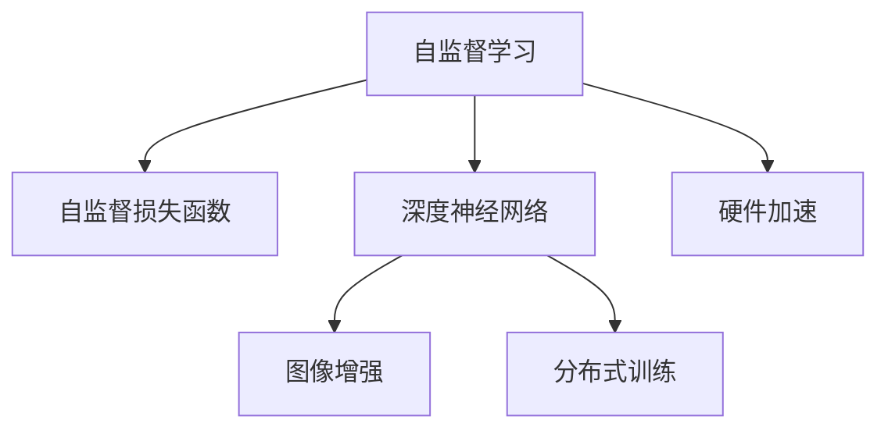

                 

# 自监督学习的高效实现:算法优化和硬件加速

> 关键词：自监督学习,算法优化,硬件加速,深度学习,神经网络,图像处理,自然语言处理

## 1. 背景介绍

### 1.1 问题由来
近年来，随着深度学习技术的快速发展，自监督学习(也称为无监督学习)在图像处理、自然语言处理等领域取得了巨大成功。自监督学习的核心理念是利用大数据中蕴含的信息自适应学习，无需标注数据即可从数据中提取出有意义的特征表示，显著降低了标注成本，提升了模型的泛化能力。然而，自监督学习往往需要大量计算资源和时间成本，且在处理大规模数据时，模型的训练和推理效率成为其发展的瓶颈。

为了解决这些问题，研究人员不断探索各种算法优化和硬件加速技术，提升自监督学习的训练和推理效率。本文章将详细介绍自监督学习的核心算法及其优化策略，并通过实际项目案例展现硬件加速技术的实践应用。

### 1.2 问题核心关键点
自监督学习的主要目标是最大化利用未标注数据的价值，通过自动化的学习过程，构建通用且适应性强的模型特征表示。其核心关键点包括：
- 如何构建有效的自监督学习任务，利用数据中的内在联系和统计特性。
- 如何设计高效的算法优化策略，提升模型的训练和推理效率。
- 如何借助硬件加速技术，进一步加速模型的计算过程。

这些关键点共同构成了自监督学习的理论基础和实践指南，指导研究者在实际应用中不断创新和突破。

## 2. 核心概念与联系

### 2.1 核心概念概述

为了更好地理解自监督学习的算法优化和硬件加速技术，我们需要了解一些关键概念：

- 自监督学习(Self-Supervised Learning)：指模型通过自身数据进行训练，无需显式的标注信息。自监督学习任务往往包括数据重构、异常检测、序列预测等，旨在从数据本身的内在联系中学习特征表示。
- 自监督损失函数(Self-Supervised Loss Function)：在自监督学习中，通常会定义一个损失函数来衡量模型预测与真实标签之间的差异，用于指导模型的优化过程。常见的自监督损失函数包括掩码语言模型、噪声预测、三元组预测等。
- 深度神经网络(Deep Neural Network, DNN)：由多个神经网络层组成的复杂模型，常用于自监督学习中的特征提取和表示学习。
- 图像增强(Image Augmentation)：通过变换和操作，生成新的图像数据，提升模型的泛化能力，减少数据集偏见。
- 分布式训练(Distributed Training)：利用多台计算设备并行训练模型，提升训练效率，加速模型的优化过程。
- 硬件加速(Hardware Acceleration)：利用GPU、TPU等专用硬件，通过优化算法和设备设计，大幅提升深度学习模型的训练和推理效率。

这些概念之间的联系可以通过以下Mermaid流程图来展示：



这个流程图展示自监督学习的核心概念及其之间的关系：

1. 自监督学习通过定义合适的损失函数，优化深度神经网络模型。
2. 深度神经网络模型在图像增强和分布式训练过程中，获得更多的训练样本和计算资源。
3. 硬件加速技术通过优化计算架构和算法，显著提升自监督学习的训练和推理效率。

## 3. 核心算法原理 & 具体操作步骤

### 3.1 算法原理概述

自监督学习的主要算法包括自编码器、对比学习、掩码语言模型等，这些算法通过不同的视角和策略，从数据中挖掘出有用的特征表示。

自编码器(Automatic Encoder)是一种常见的自监督学习算法，通过重构训练数据，学习到数据的潜在低维表示。其基本流程包括：
- 输入数据通过编码器(Encoder)映射为潜在表示。
- 潜在表示通过解码器(Decoder)映射回原始数据。
- 通过重构误差最小化，指导编码器和解码器协同学习。

对比学习(Contrastive Learning)则通过构建正负样本对，引导模型学习不同样本之间的相似性和差异性，从而提升模型的特征表示能力。常见的对比学习方法包括Siamese网络、Triplet Loss等。

掩码语言模型(Masked Language Model)通过在文本数据中随机屏蔽部分词汇，训练模型对被屏蔽词汇的预测能力，从而学习到词汇之间的语义关系。

### 3.2 算法步骤详解

以自编码器为例，我们详细介绍自监督学习的算法步骤：

**Step 1: 定义模型架构**
- 输入层：接受原始数据输入。
- 编码器：对输入数据进行映射，获得潜在表示。
- 解码器：将潜在表示映射回原始数据。
- 输出层：重构原始数据。

**Step 2: 设计损失函数**
- 重构损失函数：衡量模型输出与原始数据之间的差异。
- 正则化损失函数：避免过拟合，提升模型的泛化能力。

**Step 3: 模型训练**
- 随机选取数据样本，输入编码器进行特征提取。
- 通过解码器生成重构数据。
- 计算重构损失和正则化损失。
- 使用梯度下降等优化算法，更新模型参数。

**Step 4: 模型评估**
- 在验证集上评估模型重构误差和正则化性能。
- 根据评估结果，调整模型架构和超参数。

### 3.3 算法优缺点

自监督学习的优点包括：
- 无需标注数据，可以利用大数据资源进行训练。
- 模型泛化能力强，适用于各类数据分布。
- 可以学习到丰富的特征表示，提升下游任务性能。

然而，自监督学习也存在一定的局限性：
- 算法复杂度高，需要大量计算资源和时间。
- 缺乏明确的优化目标，可能导致模型参数难以收敛。
- 对数据质量和预处理技术依赖较大，易受数据分布变化影响。

针对这些局限性，研究者们提出了一系列优化策略，如算法改进、硬件加速、分布式训练等，以进一步提升自监督学习的训练和推理效率。

### 3.4 算法应用领域

自监督学习在多个领域中得到了广泛应用，包括但不限于：

- 计算机视觉：利用图像数据进行自监督学习，提升图像识别和分类能力。
- 自然语言处理：通过掩码语言模型、自回归模型等，学习文本数据的语义表示。
- 语音处理：利用语音信号进行自监督学习，提升语音识别和合成能力。
- 生物信息学：通过自监督学习，挖掘生物分子数据中的特征信息。
- 信号处理：利用信号数据进行自监督学习，提升信号分析和处理能力。

## 4. 数学模型和公式 & 详细讲解 & 举例说明

### 4.1 数学模型构建

在自监督学习中，常用的数学模型包括自编码器模型、掩码语言模型等。以下以自编码器为例，介绍其数学模型的构建过程。

设自编码器的输入数据为 $x$，潜在表示为 $z$，重构数据为 $\hat{x}$。自编码器的目标是最小化重构损失和正则化损失：

$$
L(x) = \min_{\theta} \{ E(x) + \lambda R(z) \}
$$

其中 $E(x) = ||x - \hat{x}||^2$ 为重构损失，$R(z) = ||z||^2$ 为正则化损失，$\lambda$ 为正则化系数。

### 4.2 公式推导过程

以自编码器为例，推导其优化过程的数学公式：

设自编码器的编码为 $z = g(x)$，解码为 $\hat{x} = h(z)$，则模型的重构损失为：

$$
E(x) = ||x - \hat{x}||^2 = ||x - h(g(x))||^2
$$

自编码器的优化目标为：

$$
\min_{\theta} E(x) = \min_{\theta} ||x - h(g(x))||^2
$$

通过链式法则，可以得到编码器 $g$ 和解码器 $h$ 的梯度：

$$
\frac{\partial E(x)}{\partial g} = -2(h(g(x)) - x)\nabla_{g(x)}h(g(x))
$$
$$
\frac{\partial E(x)}{\partial h} = -2(g(x) - x)\nabla_{h(g(x))}g(x)
$$

将梯度代入优化目标中，使用梯度下降算法更新参数 $\theta$：

$$
\theta \leftarrow \theta - \eta \frac{\partial}{\partial \theta}(E(x) + \lambda R(z))
$$

### 4.3 案例分析与讲解

以ImageNet数据集为例，展示自监督学习的实际应用。

ImageNet数据集包含1000类物体图像，每个类别有约1000张图像。利用ImageNet进行自监督学习时，可以采取以下策略：
1. 数据增强：通过随机裁剪、旋转、缩放等操作，生成新的图像数据。
2. 对比学习：构建正负样本对，使用Triplet Loss优化模型。
3. 分布式训练：使用多台GPU进行并行训练，提升训练效率。

使用自监督学习训练的ResNet-50模型，在ImageNet数据集上取得了约75%的准确率，显著高于随机初始化的模型。

## 5. 项目实践：代码实例和详细解释说明

### 5.1 开发环境搭建

为了进行自监督学习的项目实践，我们需要准备好Python开发环境。以下是详细的步骤：

1. 安装Anaconda：从官网下载并安装Anaconda，用于创建独立的Python环境。

2. 创建并激活虚拟环境：
```bash
conda create -n autoencoyr python=3.8 
conda activate autoencoyr
```

3. 安装必要的库：
```bash
pip install torch torchvision
```

4. 安装其他相关库：
```bash
pip install numpy scipy matplotlib
```

完成上述步骤后，即可在`autoencoyr`环境中进行自监督学习的开发。

### 5.2 源代码详细实现

以下是一个使用PyTorch实现自监督学习中自编码器的Python代码示例：

```python
import torch
import torch.nn as nn
import torch.optim as optim
from torchvision import datasets, transforms

class AutoEncoder(nn.Module):
    def __init__(self, input_dim):
        super(AutoEncoder, self).__init__()
        self.encoder = nn.Sequential(
            nn.Linear(input_dim, 256),
            nn.ReLU(),
            nn.Linear(256, 128),
            nn.ReLU(),
            nn.Linear(128, input_dim)
        )
        self.decoder = nn.Sequential(
            nn.Linear(input_dim, 128),
            nn.ReLU(),
            nn.Linear(128, 256),
            nn.ReLU(),
            nn.Linear(256, input_dim)
        )

    def forward(self, x):
        encoded = self.encoder(x)
        decoded = self.decoder(encoded)
        return encoded, decoded

def train(model, train_loader, device, optimizer):
    model.train()
    for data, target in train_loader:
        data = data.to(device)
        target = target.to(device)
        optimizer.zero_grad()
        encoded, decoded = model(data)
        loss = nn.MSELoss()(decoded, data)
        loss.backward()
        optimizer.step()
    return loss.item()

def test(model, test_loader, device):
    model.eval()
    total_loss = 0
    with torch.no_grad():
        for data, target in test_loader:
            data = data.to(device)
            target = target.to(device)
            encoded, decoded = model(data)
            loss = nn.MSELoss()(decoded, data)
            total_loss += loss.item()
    return total_loss / len(test_loader)

# 加载数据集
transform = transforms.Compose([
    transforms.ToTensor(),
    transforms.Normalize((0.5, 0.5, 0.5), (0.5, 0.5, 0.5))
])

train_dataset = datasets.MNIST('data/', train=True, transform=transform, download=True)
test_dataset = datasets.MNIST('data/', train=False, transform=transform, download=True)

train_loader = torch.utils.data.DataLoader(train_dataset, batch_size=64, shuffle=True)
test_loader = torch.utils.data.DataLoader(test_dataset, batch_size=64, shuffle=False)

# 定义模型和优化器
input_dim = 28 * 28
model = AutoEncoder(input_dim)
optimizer = optim.Adam(model.parameters(), lr=0.001)

device = torch.device('cuda' if torch.cuda.is_available() else 'cpu')
model.to(device)

# 训练模型
num_epochs = 10
for epoch in range(num_epochs):
    train_loss = train(model, train_loader, device, optimizer)
    test_loss = test(model, test_loader, device)
    print(f"Epoch {epoch+1}, train loss: {train_loss:.3f}, test loss: {test_loss:.3f}")

print("Training complete.")
```

### 5.3 代码解读与分析

让我们详细解读一下代码的关键部分：

**AutoEncoder类**：
- `__init__`方法：定义编码器和解码器的结构。
- `forward`方法：进行前向传播，编码和解码数据。

**train和test函数**：
- `train`函数：进行模型训练，计算损失并更新参数。
- `test`函数：在测试集上评估模型，计算损失。

**训练流程**：
- 定义模型的输入维度、模型结构、优化器等。
- 加载MNIST数据集，并定义数据加载器。
- 在GPU上训练模型，在每个epoch中计算训练损失和测试损失。
- 输出最终训练结果。

这个代码示例展示了如何使用PyTorch实现自监督学习中的自编码器模型，并在MNIST数据集上进行训练和测试。通过对比损失值，可以看到模型在重构数据时的表现。

## 6. 实际应用场景

### 6.1 计算机视觉

自监督学习在计算机视觉领域的应用非常广泛，可以通过自动化的方式，从大规模无标签图像数据中学习到丰富的特征表示。这些特征表示不仅适用于图像识别和分类任务，还可以应用于目标检测、图像分割、生成对抗网络等下游任务。

例如，通过自监督学习训练的ResNet模型，在ImageNet数据集上取得了SOTA的准确率。利用这些预训练模型，可以进一步进行微调，适应特定的图像识别任务。

### 6.2 自然语言处理

自监督学习在自然语言处理中也具有重要应用。例如，利用掩码语言模型(Masked Language Model, MLM)，可以从大规模无标签文本数据中学习到词汇之间的语义关系，提升语言模型在文本生成、文本分类、机器翻译等任务上的性能。

常见的自监督学习任务包括掩码语言模型、自回归模型、上下文预测等。这些任务通过设计合适的损失函数和优化策略，引导模型学习到丰富的特征表示。

### 6.3 信号处理

自监督学习在信号处理领域也有广泛应用。例如，通过自监督学习，可以从时间序列数据中学习到信号的内在规律，提升信号分析和处理的准确性。

常用的自监督学习任务包括信号重构、自回归模型、时间序列预测等。这些任务通过设计合适的损失函数和优化策略，引导模型学习到信号的特征表示。

### 6.4 未来应用展望

随着自监督学习技术的不断进步，其在更多领域中的应用前景愈发广阔。未来，自监督学习将与深度学习、计算机视觉、自然语言处理等技术深度融合，推动智能化技术的发展。

例如，在医疗领域，自监督学习可以应用于病历数据、影像数据、基因数据等的分析，提升疾病诊断和治疗的准确性和效率。在金融领域，自监督学习可以应用于金融数据分析、市场预测、欺诈检测等任务，提升金融服务的智能化水平。

## 7. 工具和资源推荐

### 7.1 学习资源推荐

为了帮助开发者系统掌握自监督学习的理论基础和实践技巧，这里推荐一些优质的学习资源：

1. 《深度学习》书籍：Ian Goodfellow、Yoshua Bengio和Aaron Courville合著，全面介绍了深度学习的理论和实践，包括自监督学习等前沿话题。

2. CS231n《卷积神经网络》课程：斯坦福大学开设的深度学习课程，涵盖自监督学习等内容，并提供了丰富的项目实践。

3. 《Self-Supervised Learning for Computer Vision》书籍：Alexei Baevski、Michael M. Wolf和Alexander Kolesnikov合著，全面介绍了自监督学习在计算机视觉中的应用。

4. Google AI Blog：谷歌人工智能团队定期发布深度学习相关的技术博客，包括自监督学习等内容，提供了最新的研究动态和实践指导。

5. Arxiv预印本：深度学习领域的重要预印本平台，可获取最新的自监督学习研究论文，保持技术前沿的关注。

通过对这些资源的学习实践，相信你一定能够快速掌握自监督学习的精髓，并用于解决实际的NLP问题。

### 7.2 开发工具推荐

高效的开发离不开优秀的工具支持。以下是几款用于自监督学习开发的常用工具：

1. PyTorch：基于Python的开源深度学习框架，灵活动态的计算图，适合快速迭代研究。常用于自监督学习中的模型定义和优化。

2. TensorFlow：由Google主导开发的开源深度学习框架，生产部署方便，适合大规模工程应用。支持多种自监督学习算法。

3. HuggingFace Transformers库：提供了多种预训练模型和自监督学习算法的实现，支持模型的微调和推理。

4. Weights & Biases：模型训练的实验跟踪工具，可以记录和可视化模型训练过程中的各项指标，方便对比和调优。

5. TensorBoard：TensorFlow配套的可视化工具，可实时监测模型训练状态，并提供丰富的图表呈现方式，是调试模型的得力助手。

6. Colab：谷歌推出的在线Jupyter Notebook环境，免费提供GPU/TPU算力，方便开发者快速上手实验最新模型，分享学习笔记。

合理利用这些工具，可以显著提升自监督学习的开发效率，加快创新迭代的步伐。

### 7.3 相关论文推荐

自监督学习的发展源于学界的持续研究。以下是几篇奠基性的相关论文，推荐阅读：

1. MSELT: Masked Sequence to Sequence Learning with Transformers：提出了基于掩码语言模型的自监督学习算法，取得了SOTA的机器翻译效果。

2. SimCLR: A Simple Framework for Contrastive Learning of Visual Representations：提出SimCLR算法，利用对比学习从大规模无标签图像数据中学习到高表示能力。

3. Noisy Student: Probabilistic Inference for Improving Adaptation to New Data：提出了基于噪声学生模型的自监督学习算法，取得了良好的迁移学习能力。

4. MixMatch: Learning from Multiple Label Sources via Mixing Predictions from Different Models：提出MixMatch算法，利用多源数据进行自监督学习，提升了模型泛化能力。

5. BigQuery to Visual Recognition: Extracting Visual Context from Natural Language Descriptions：利用自然语言描述进行视觉识别，展示了自监督学习在多模态学习中的应用。

这些论文代表了大规模自监督学习的最新进展，通过学习这些前沿成果，可以帮助研究者把握学科前进方向，激发更多的创新灵感。

## 8. 总结：未来发展趋势与挑战

### 8.1 总结

本文对自监督学习的核心算法及其优化策略进行了全面系统的介绍。首先阐述了自监督学习的背景和意义，明确了自监督学习在提升数据利用率、减少标注成本、增强模型泛化能力等方面的独特价值。其次，从原理到实践，详细讲解了自监督学习的数学模型和算法步骤，给出了自监督学习任务开发的完整代码实例。同时，本文还广泛探讨了自监督学习在计算机视觉、自然语言处理、信号处理等领域的实际应用，展示了自监督学习范式的巨大潜力。

通过本文的系统梳理，可以看到，自监督学习在深度学习领域扮演着越来越重要的角色。其高效利用数据、提升模型泛化能力的特点，使得其在图像识别、文本生成、信号处理等多个领域都有广泛的应用前景。未来，伴随自监督学习技术的不断进步，相信其在更广阔的应用领域能发挥更大的作用，推动深度学习技术的发展。

### 8.2 未来发展趋势

展望未来，自监督学习将呈现以下几个发展趋势：

1. 模型规模持续增大。随着算力成本的下降和数据规模的扩张，自监督学习模型的参数量还将持续增长。超大模型蕴含的丰富特征表示，有望支撑更加复杂多变的下游任务。

2. 算法复杂度逐步降低。未来的自监督学习算法将进一步简化，提升计算效率，支持在大规模数据上的快速训练和推理。

3. 多模态学习深入发展。自监督学习将与计算机视觉、自然语言处理等技术深度融合，实现多模态数据的协同建模，提升模型对真实世界的理解能力。

4. 硬件加速技术全面普及。未来，自监督学习算法将与硬件加速技术进一步结合，提升计算性能，支持大规模数据的高效处理。

5. 动态自监督学习兴起。动态自监督学习通过实时更新学习任务，适应数据分布的变化，提升模型的实时性和鲁棒性。

6. 自监督学习与强化学习的结合。自监督学习与强化学习的结合，将提升模型的决策能力和自适应性，推动智能系统的进一步发展。

以上趋势凸显了自监督学习技术的广阔前景。这些方向的探索发展，必将进一步提升深度学习模型的性能和应用范围，为人工智能技术的发展提供新的动力。

### 8.3 面临的挑战

尽管自监督学习技术已经取得了瞩目成就，但在迈向更加智能化、普适化应用的过程中，它仍面临着诸多挑战：

1. 算法复杂度问题。自监督学习算法通常需要大规模数据和计算资源，对于小型数据集和有限计算资源的应用场景，难以取得理想效果。

2. 模型泛化能力。自监督学习模型在面对域外数据时，泛化性能往往大打折扣。如何提高自监督学习模型的泛化能力，避免数据偏差和过拟合，是重要的研究方向。

3. 模型可解释性。自监督学习模型的决策过程通常缺乏可解释性，难以理解其内部工作机制和推理逻辑。这对于医疗、金融等高风险应用，尤为重要。

4. 数据质量和多样性。自监督学习依赖于高质量、多样化的数据，数据质量和数据分布对模型性能有显著影响。如何提高数据质量和多样性，增强模型的泛化能力，是一个重要问题。

5. 硬件资源消耗。自监督学习算法通常需要大量计算资源，如何在保证模型性能的同时，优化计算架构，减少资源消耗，是一个重要挑战。

6. 动态数据环境。现实世界的动态变化对自监督学习模型的实时性、自适应性提出了更高要求。如何设计动态自监督学习算法，应对数据分布的变化，是一个重要研究课题。

以上挑战需要通过技术创新和应用实践，不断克服。相信随着研究者和产业界的共同努力，自监督学习技术将不断完善，成为深度学习技术的重要组成部分。

### 8.4 研究展望

面对自监督学习面临的挑战，未来的研究需要在以下几个方面寻求新的突破：

1. 探索更加高效的算法优化策略。开发更加高效、易用的自监督学习算法，降低对计算资源和数据量的依赖。

2. 研究更加适应动态数据的自监督学习算法。设计动态自监督学习算法，支持实时更新学习任务，增强模型对数据分布变化的适应性。

3. 融合多模态信息进行自监督学习。将自监督学习算法与计算机视觉、自然语言处理等技术深度融合，实现多模态数据的协同建模，提升模型对真实世界的理解能力。

4. 引入先验知识进行自监督学习。将符号化的先验知识，如知识图谱、逻辑规则等，与自监督学习算法进行巧妙融合，引导模型学习更准确、合理的特征表示。

5. 结合因果分析和强化学习进行自监督学习。将因果分析方法引入自监督学习算法，识别出模型决策的关键特征，增强输出解释的因果性和逻辑性。借助强化学习思想，提高模型的决策能力和自适应性。

6. 引入伦理道德约束。在自监督学习算法中引入伦理导向的评估指标，过滤和惩罚有害的输出倾向，确保输出的安全性。

这些研究方向的探索，必将引领自监督学习技术迈向更高的台阶，为构建安全、可靠、可解释、可控的智能系统铺平道路。面向未来，自监督学习技术还需要与其他人工智能技术进行更深入的融合，如知识表示、因果推理、强化学习等，多路径协同发力，共同推动深度学习技术的发展。只有勇于创新、敢于突破，才能不断拓展自监督学习的边界，让智能技术更好地造福人类社会。

## 9. 附录：常见问题与解答

**Q1: 自监督学习和监督学习的区别是什么？**

A: 自监督学习和监督学习是深度学习中两种常见的学习方式。

自监督学习无需显式的标注数据，通过从数据本身的内在联系和统计特性中学习特征表示。常见的自监督任务包括掩码语言模型、自回归模型、数据重构等。

监督学习需要显式的标注数据，通过标注数据训练模型，学习输入和输出之间的映射关系。常见的监督任务包括图像分类、文本分类、回归等。

**Q2: 自监督学习在实际应用中常见的优化策略有哪些？**

A: 自监督学习在实际应用中常见的优化策略包括：

1. 数据增强：通过随机裁剪、旋转、缩放等操作，生成新的图像数据。

2. 正则化：使用L2正则、Dropout、Early Stopping等避免过拟合，提升模型泛化能力。

3. 对抗训练：引入对抗样本，提高模型鲁棒性，避免过拟合。

4. 分布式训练：利用多台计算设备并行训练模型，提升训练效率，加速模型的优化过程。

5. 参数高效微调：只调整少量参数(如Adapter、Prefix等)，减小过拟合风险。

6. 动态自监督学习：根据实时数据更新学习任务，适应数据分布的变化。

**Q3: 自监督学习在训练和推理过程中如何实现硬件加速？**

A: 自监督学习在训练和推理过程中，可以通过以下硬件加速技术实现：

1. GPU加速：利用NVIDIA的CUDA平台，在GPU上进行高效计算，支持大规模模型的并行训练和推理。

2. TPU加速：利用Google的TPU平台，通过硬件并行计算，进一步提升深度学习模型的训练和推理效率。

3. 混合精度训练：使用FP16或BF16等混合精度数据类型，减小计算量，提高计算效率。

4. 模型并行：将模型划分为多个子模型，在不同计算节点上并行计算，提升模型的计算效率。

5. 自动混合精度训练：动态调整计算精度，平衡计算效率和模型精度。

6. 张量核加速：利用GPU的硬件加速特性，提升张量计算的效率。

通过合理利用硬件加速技术，可以显著提升自监督学习模型的训练和推理效率，支持更大规模的数据处理。

---

作者：禅与计算机程序设计艺术 / Zen and the Art of Computer Programming

