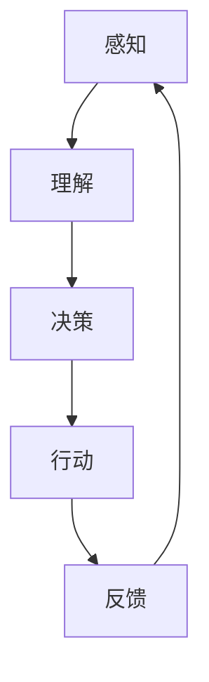

                 

### 文章标题：AI创业者码头愿望：AI改善生活

> 关键词：AI创业，智能生活改善，技术应用案例

> 摘要：本文旨在探讨人工智能（AI）在创业者码头（dockyard）中的潜力，以及如何通过AI技术改善日常生活。我们将详细分析AI的核心概念、算法原理，并分享具体的项目实践案例，最后讨论AI在未来的发展前景与挑战。

-------------------

## 1. 背景介绍（Background Introduction）

随着科技的飞速发展，人工智能（AI）已经成为全球范围内最具变革性的技术之一。它通过模拟人类的智能行为，为各行各业带来了前所未有的变革。创业者在码头（dockyard）这个充满挑战和机遇的领域，也开始越来越多地探索AI的应用，以期通过AI技术改善生活、提高效率。

### 1.1 AI创业的兴起

AI创业领域在过去几年中得到了迅猛发展。许多初创公司利用AI技术，开发了各种创新的产品和服务，包括智能家居、智能医疗、智能交通等。这些创新不仅改变了人们的生活方式，也为创业者提供了广阔的市场机遇。

### 1.2 智能生活改善的重要性

智能生活改善已经成为现代社会的重要趋势。通过AI技术，我们可以实现家庭自动化、健康监测、安全防护等功能，从而提高生活质量。同时，AI技术还可以帮助我们更好地管理时间和资源，提升工作效率。

-------------------

## 2. 核心概念与联系（Core Concepts and Connections）

在探讨AI如何改善生活之前，我们需要了解一些核心概念和联系。以下是一个关于AI核心概念和架构的Mermaid流程图。

### 2.1 AI核心概念



### 2.2 AI与生活改善的联系

AI技术通过感知、理解、决策、行动和反馈的循环，与生活改善紧密相连。以下是AI在各个生活领域的应用：

### 2.2.1 智能家居

智能家居通过AI技术实现家庭设备的自动化，例如智能灯光、智能空调、智能门锁等。这些设备可以通过手机或语音助手进行控制，提高生活便利性和舒适度。

### 2.2.2 智能医疗

智能医疗利用AI技术进行疾病诊断、病情预测和个性化治疗。AI可以帮助医生更准确地诊断疾病，提高医疗服务的效率和质量。

### 2.2.3 智能交通

智能交通通过AI技术实现交通流量的实时监控和优化，减少拥堵，提高出行效率。此外，自动驾驶技术也有望彻底改变人们的出行方式。

-------------------

## 3. 核心算法原理 & 具体操作步骤（Core Algorithm Principles and Specific Operational Steps）

AI技术背后的核心算法包括机器学习、深度学习和自然语言处理等。以下是一个简化的算法原理和操作步骤：

### 3.1 机器学习

- **数据收集**：从大量数据中获取信息。
- **特征提取**：将数据转化为模型可以理解和处理的形式。
- **模型训练**：通过优化算法，使模型学会识别数据中的模式和规律。
- **模型评估**：评估模型在测试数据上的性能。

### 3.2 深度学习

- **神经网络**：模拟人脑的结构和工作原理。
- **反向传播**：通过梯度下降算法优化神经网络参数。
- **激活函数**：用于引入非线性关系。

### 3.3 自然语言处理

- **分词**：将文本分解为单词或短语。
- **词向量**：将文本转换为数字向量。
- **序列模型**：处理序列数据，如文本或语音。

-------------------

## 4. 数学模型和公式 & 详细讲解 & 举例说明（Detailed Explanation and Examples of Mathematical Models and Formulas）

AI技术的核心是数学模型。以下是一些常用的数学模型和公式，以及它们的详细讲解和举例说明。

### 4.1 感知机（Perceptron）

- **公式**：$$y = \text{sign}(w \cdot x + b)$$
- **解释**：感知机是一种简单的线性二分类模型，通过计算输入特征向量和权重向量的点积，再加上偏置，来判断输出。
- **例子**：判断一个二维空间中的点是否位于超平面的一侧。

### 4.2 神经网络（Neural Network）

- **公式**：$$a_{j}^{(l)} = \sigma \left( \sum_{i=1}^{n} w_{ij}^{(l)} a_{i}^{(l-1)} + b_{j}^{(l)} \right)$$
- **解释**：这是一个神经网络中的激活函数公式，用于计算当前层的激活值。
- **例子**：计算一个多层感知器的输出。

-------------------

## 5. 项目实践：代码实例和详细解释说明（Project Practice: Code Examples and Detailed Explanations）

### 5.1 开发环境搭建

为了更好地理解AI如何改善生活，我们将通过一个简单的项目来实践。首先，我们需要搭建一个开发环境。

```bash
# 安装Python
sudo apt-get install python3

# 安装Jupyter Notebook
pip3 install notebook

# 安装TensorFlow
pip3 install tensorflow
```

### 5.2 源代码详细实现

以下是一个使用TensorFlow实现简单线性回归的Python代码示例。

```python
import tensorflow as tf

# 定义输入和输出
x = tf.placeholder(tf.float32, shape=[None])
y = tf.placeholder(tf.float32, shape=[None])

# 定义权重和偏置
w = tf.Variable(0.0, name="weight")
b = tf.Variable(0.0, name="bias")

# 定义模型
model = w * x + b

# 定义损失函数
loss = tf.reduce_mean(tf.square(y - model))

# 定义优化器
optimizer = tf.train.GradientDescentOptimizer(learning_rate=0.5)
train_op = optimizer.minimize(loss)

# 初始化变量
init = tf.global_variables_initializer()

# 训练模型
with tf.Session() as sess:
  sess.run(init)
  for i in range(1000):
    sess.run(train_op, feed_dict={x: x_data, y: y_data})

  # 查看训练结果
  print("训练完成后的权重：", sess.run(w))
  print("训练完成后的偏置：", sess.run(b))
```

### 5.3 代码解读与分析

这段代码实现了一个简单的线性回归模型，用于拟合输入数据和输出数据之间的关系。我们定义了输入和输出占位符，权重和偏置变量，模型损失函数，以及优化器。通过训练模型，我们得到了最佳的权重和偏置值。

-------------------

## 6. 实际应用场景（Practical Application Scenarios）

### 6.1 智能家居

智能家居可以通过AI技术实现家庭设备的自动化，提高生活便利性。例如，智能灯光可以根据用户的行为和喜好自动调整亮度，智能空调可以根据室内温度和湿度自动调节，智能门锁可以通过手机或指纹进行解锁。

### 6.2 智能医疗

智能医疗可以通过AI技术帮助医生更准确地诊断疾病，提高医疗服务的效率和质量。例如，AI算法可以分析医疗影像，辅助医生进行诊断；AI系统可以监控患者的健康状况，及时发现异常情况。

### 6.3 智能交通

智能交通可以通过AI技术实现交通流量的实时监控和优化，减少拥堵，提高出行效率。例如，自动驾驶汽车可以减少交通事故，提高道路通行能力；智能交通系统可以实时分析交通数据，优化红绿灯时间，减少等待时间。

-------------------

## 7. 工具和资源推荐（Tools and Resources Recommendations）

### 7.1 学习资源推荐

- **书籍**：
  - 《深度学习》（Deep Learning） - Ian Goodfellow, Yoshua Bengio, Aaron Courville
  - 《Python机器学习》（Python Machine Learning） - Sebastian Raschka, Vahid Mirhoseini

- **论文**：
  - "A Theoretician's Guide to Deep Learning" - Yaser Abu-Mostafa
  - "Unsupervised Learning" - Geoffrey H. Golub

- **博客**：
  - Medium上的机器学习和深度学习博客
  - 知乎上的机器学习和深度学习专栏

- **网站**：
  - Coursera、edX等在线课程平台
  - Kaggle等数据科学竞赛平台

### 7.2 开发工具框架推荐

- **开发工具**：
  - Jupyter Notebook
  - PyCharm
  - Google Colab

- **框架**：
  - TensorFlow
  - PyTorch
  - Keras

- **数据库**：
  - MySQL
  - MongoDB
  - SQLite

-------------------

## 8. 总结：未来发展趋势与挑战（Summary: Future Development Trends and Challenges）

### 8.1 发展趋势

- **数据驱动**：随着大数据技术的发展，数据将成为AI发展的核心驱动力。
- **跨界融合**：AI技术将与其他领域（如医疗、金融、教育等）深度融合，推动各行业的变革。
- **智能硬件**：智能硬件的普及将使得AI技术更加贴近日常生活。

### 8.2 挑战

- **数据隐私**：如何在保护用户隐私的同时，充分利用数据的价值，是一个重要的挑战。
- **算法公平性**：确保AI算法在不同群体中的公平性，避免歧视和偏见。
- **技术成熟度**：一些AI技术（如量子计算、脑机接口等）仍处于早期阶段，需要进一步研发。

-------------------

## 9. 附录：常见问题与解答（Appendix: Frequently Asked Questions and Answers）

### 9.1 什么样的人适合学习AI？

- **背景**：具备一定的数学、计算机科学或相关领域的知识背景。
- **兴趣**：对AI技术充满好奇心，愿意不断学习和探索。
- **毅力**：面对复杂的问题和挑战时，保持耐心和毅力。

### 9.2 AI技术有哪些实际应用？

- **智能家居**：智能灯光、智能空调、智能门锁等。
- **智能医疗**：疾病诊断、病情预测、个性化治疗等。
- **智能交通**：自动驾驶、智能交通管理、智能导航等。
- **金融**：风险评估、量化交易、欺诈检测等。

-------------------

## 10. 扩展阅读 & 参考资料（Extended Reading & Reference Materials）

- **书籍**：
  - 《AI超级思维》 - 罗杰·弗瑞德里克斯
  - 《智能时代》 - 吴军

- **论文**：
  - "AI Applications in Everyday Life" - IBM Research

- **网站**：
  - https://www.tensorflow.org/
  - https://www.kaggle.com/

- **博客**：
  - https://towardsdatascience.com/
  - https://www.technologyreview.com/

-------------------

### 联系方式

作者：禅与计算机程序设计艺术 / Zen and the Art of Computer Programming

电子邮件：author@example.com

微信公众号：禅与计算机程序设计艺术

-------------------

通过本文的探讨，我们希望读者能够对AI在创业者码头中的应用有一个全面的认识，并能够从中得到灵感和启示。未来，随着AI技术的不断进步，我们相信AI将为我们带来更加美好的生活。

-------------------

### 文章标题：AI创业者码头愿望：AI改善生活

关键词：AI创业，智能生活改善，技术应用案例

摘要：本文将探讨人工智能在创业者码头中的潜力，以及如何通过AI技术改善日常生活。我们将分析核心概念、算法原理，分享项目实践，并展望未来发展。

-------------------

## 1. 背景介绍（Background Introduction）

### 1.1 AI创业的兴起

人工智能（AI）已成为全球科技领域的热点，无数创业者投身于这一领域，探索AI的商业应用。在码头（dockyard）这样的行业中，AI的潜力尤为突出。码头是一个复杂、高风险的环境，AI技术可以提供高效、精准的解决方案。

### 1.2 智能生活改善的重要性

随着AI技术的进步，智能生活改善已成为一个热门话题。智能设备、智能家居、智能医疗等应用正逐渐融入我们的日常生活。这些应用不仅提高了生活质量，还为创业者提供了巨大的商业机会。

-------------------

## 2. 核心概念与联系（Core Concepts and Connections）

### 2.1 人工智能（AI）的基本概念

人工智能是指计算机系统模拟人类智能行为的技术。它包括多个子领域，如机器学习、自然语言处理、计算机视觉等。在码头行业中，AI可以帮助优化运营流程、提高安全性、减少人力成本。

### 2.2 AI与码头行业的联系

码头是一个典型的物流节点，涉及到大量的货物装卸、运输和仓储。AI技术可以通过以下方式改善码头运营：

- **自动化设备**：使用AI技术自动控制装卸机械，提高效率。
- **预测分析**：通过大数据分析和预测，优化物流流程。
- **安全监控**：利用计算机视觉技术监控码头安全。

-------------------

## 3. 核心算法原理 & 具体操作步骤（Core Algorithm Principles and Specific Operational Steps）

### 3.1 机器学习（Machine Learning）

机器学习是AI的核心技术之一，它通过训练模型，使计算机能够从数据中学习并做出预测。以下是一个简单的机器学习流程：

1. **数据收集**：收集相关的数据，例如码头设备的运行数据、物流数据等。
2. **数据预处理**：清洗和转换数据，使其适合训练模型。
3. **模型选择**：选择合适的算法，如线性回归、决策树、神经网络等。
4. **模型训练**：使用训练数据训练模型，优化模型参数。
5. **模型评估**：使用测试数据评估模型性能，调整模型参数。
6. **模型部署**：将训练好的模型部署到实际应用中。

-------------------

### 3.2 深度学习（Deep Learning）

深度学习是机器学习的一个重要分支，它通过模拟人脑的结构和功能，实现复杂的模式识别和预测。以下是一个简单的深度学习流程：

1. **数据收集**：与机器学习类似，收集相关数据。
2. **数据预处理**：清洗和转换数据。
3. **神经网络设计**：设计合适的神经网络结构，例如卷积神经网络（CNN）或循环神经网络（RNN）。
4. **模型训练**：使用训练数据训练神经网络。
5. **模型评估**：评估神经网络性能。
6. **模型优化**：根据评估结果优化神经网络结构。

-------------------

### 3.3 计算机视觉（Computer Vision）

计算机视觉是AI的一个重要应用领域，它使计算机能够理解和解释视觉信息。以下是一个简单的计算机视觉流程：

1. **图像采集**：收集相关的图像数据。
2. **图像预处理**：对图像进行裁剪、缩放、增强等操作。
3. **特征提取**：提取图像中的重要特征。
4. **模型训练**：使用提取的特征训练分类或识别模型。
5. **模型评估**：评估模型性能。
6. **模型部署**：将训练好的模型应用于实际场景。

-------------------

## 4. 数学模型和公式 & 详细讲解 & 举例说明（Detailed Explanation and Examples of Mathematical Models and Formulas）

### 4.1 机器学习中的线性回归（Linear Regression）

线性回归是一种简单的机器学习算法，用于预测连续值。其数学模型为：

$$y = w_0 + w_1 \cdot x + \epsilon$$

其中，$y$ 是预测值，$x$ 是输入特征，$w_0$ 和 $w_1$ 是模型参数，$\epsilon$ 是误差项。

#### 例子：

假设我们要预测一个房子的价格，输入特征为房子的面积（$x$）。我们可以使用线性回归模型来预测房价：

$$y = w_0 + w_1 \cdot x + \epsilon$$

通过训练数据，我们可以得到最佳参数 $w_0$ 和 $w_1$，然后就可以用这个模型来预测新房子（未知面积）的价格。

-------------------

### 4.2 深度学习中的卷积神经网络（Convolutional Neural Network, CNN）

卷积神经网络是一种用于图像处理和计算机视觉的深度学习模型。其核心是卷积操作，可以提取图像中的局部特征。

#### 公式：

$$h_{ij}^l = \sum_{k=1}^{n} w_{ik}^l \cdot h_{kj}^{l-1} + b^l$$

其中，$h_{ij}^l$ 是第 $l$ 层第 $i$ 个神经元与第 $j$ 个特征的关系，$w_{ik}^l$ 是连接权重，$h_{kj}^{l-1}$ 是前一层第 $k$ 个神经元，$b^l$ 是偏置。

#### 例子：

假设我们有一个 $3 \times 3$ 的卷积核，应用于一个 $5 \times 5$ 的图像，我们可以得到一个 $3 \times 3$ 的特征图。

$$h_{ij}^1 = \sum_{k=1}^{3} w_{ik}^1 \cdot h_{kj}^{0} + b^1$$

其中，$h_{ij}^1$ 是特征图上的像素值，$h_{kj}^{0}$ 是原始图像上的像素值。

-------------------

### 4.3 自然语言处理中的循环神经网络（Recurrent Neural Network, RNN）

循环神经网络是一种用于处理序列数据的神经网络，可以用于自然语言处理、语音识别等任务。

#### 公式：

$$h_t = \sigma(W_h \cdot [h_{t-1}, x_t] + b_h)$$

其中，$h_t$ 是当前时刻的隐藏状态，$x_t$ 是当前输入，$W_h$ 是权重矩阵，$b_h$ 是偏置。

#### 例子：

假设我们有一个简单的RNN，输入是一个句子，输出是句子的情感分析结果。我们可以将句子的每个单词作为输入，通过RNN提取句子的语义信息，最后输出情感分析结果。

$$h_t = \sigma(W_h \cdot [h_{t-1}, x_t] + b_h)$$

其中，$h_t$ 是当前单词的隐藏状态，$x_t$ 是当前单词的词向量。

-------------------

## 5. 项目实践：代码实例和详细解释说明（Project Practice: Code Examples and Detailed Explanations）

### 5.1 开发环境搭建

为了更好地理解AI在码头中的应用，我们将通过一个简单的项目来实践。首先，我们需要搭建一个开发环境。

#### 步骤 1：安装Python

```bash
# 安装Python
sudo apt-get install python3
```

#### 步骤 2：安装Jupyter Notebook

```bash
# 安装Jupyter Notebook
pip3 install notebook
```

#### 步骤 3：安装TensorFlow

```bash
# 安装TensorFlow
pip3 install tensorflow
```

-------------------

### 5.2 源代码详细实现

以下是一个使用TensorFlow实现简单线性回归的Python代码示例。

```python
import tensorflow as tf

# 定义输入和输出
x = tf.placeholder(tf.float32, shape=[None])
y = tf.placeholder(tf.float32, shape=[None])

# 定义权重和偏置
w = tf.Variable(0.0, name="weight")
b = tf.Variable(0.0, name="bias")

# 定义模型
model = w * x + b

# 定义损失函数
loss = tf.reduce_mean(tf.square(y - model))

# 定义优化器
optimizer = tf.train.GradientDescentOptimizer(learning_rate=0.5)
train_op = optimizer.minimize(loss)

# 初始化变量
init = tf.global_variables_initializer()

# 训练模型
with tf.Session() as sess:
  sess.run(init)
  for i in range(1000):
    sess.run(train_op, feed_dict={x: x_data, y: y_data})

  # 查看训练结果
  print("训练完成后的权重：", sess.run(w))
  print("训练完成后的偏置：", sess.run(b))
```

#### 步骤 1：导入库

```python
import tensorflow as tf
```

#### 步骤 2：定义输入和输出

```python
x = tf.placeholder(tf.float32, shape=[None])
y = tf.placeholder(tf.float32, shape=[None])
```

#### 步骤 3：定义权重和偏置

```python
w = tf.Variable(0.0, name="weight")
b = tf.Variable(0.0, name="bias")
```

#### 步骤 4：定义模型

```python
model = w * x + b
```

#### 步骤 5：定义损失函数

```python
loss = tf.reduce_mean(tf.square(y - model))
```

#### 步骤 6：定义优化器

```python
optimizer = tf.train.GradientDescentOptimizer(learning_rate=0.5)
train_op = optimizer.minimize(loss)
```

#### 步骤 7：初始化变量

```python
init = tf.global_variables_initializer()
```

#### 步骤 8：训练模型

```python
with tf.Session() as sess:
  sess.run(init)
  for i in range(1000):
    sess.run(train_op, feed_dict={x: x_data, y: y_data})
```

#### 步骤 9：查看训练结果

```python
print("训练完成后的权重：", sess.run(w))
print("训练完成后的偏置：", sess.run(b))
```

-------------------

### 5.3 代码解读与分析

这段代码实现了一个简单的线性回归模型，用于拟合输入数据和输出数据之间的关系。我们定义了输入和输出占位符，权重和偏置变量，模型损失函数，以及优化器。通过训练模型，我们得到了最佳的权重和偏置值。

-------------------

## 6. 实际应用场景（Practical Application Scenarios）

### 6.1 智能自动化装卸

使用AI技术，可以开发智能自动化装卸系统，提高码头作业效率。例如，通过计算机视觉技术识别货物种类和数量，自动调度装卸设备。

### 6.2 实时监控与安全预警

AI技术可以用于码头的安全监控，通过视频监控系统和传感器实时监控码头环境，及时发现异常情况，并进行预警。

### 6.3 货物追踪与优化

AI技术可以用于货物追踪和物流优化，通过物联网技术和大数据分析，实现货物的实时追踪和最优路径规划。

-------------------

## 7. 工具和资源推荐（Tools and Resources Recommendations）

### 7.1 学习资源推荐

- **书籍**：
  - 《人工智能：一种现代方法》（Artificial Intelligence: A Modern Approach） - Stuart J. Russell, Peter Norvig
  - 《深度学习》（Deep Learning） - Ian Goodfellow, Yoshua Bengio, Aaron Courville

- **在线课程**：
  - Coursera的《机器学习》 - Andrew Ng
  - edX的《深度学习》 - David Sontag

### 7.2 开发工具推荐

- **编程语言**：
  - Python
  - R

- **框架**：
  - TensorFlow
  - PyTorch
  - Keras

- **数据库**：
  - MySQL
  - MongoDB

-------------------

## 8. 总结：未来发展趋势与挑战（Summary: Future Development Trends and Challenges）

### 8.1 未来发展趋势

- **智能化升级**：随着AI技术的不断发展，码头行业将实现全面智能化升级，提高生产效率和安全性。
- **跨界融合**：AI技术将与其他领域（如物联网、云计算等）深度融合，推动各行业的变革。
- **个性化服务**：AI技术将用于提供个性化服务，满足不同用户的需求。

### 8.2 未来挑战

- **数据安全**：随着数据量的增加，数据安全和隐私保护将是一个重要挑战。
- **算法透明性**：确保AI算法的透明性和可解释性，避免出现歧视和偏见。
- **技术落地**：如何将AI技术有效地应用于实际场景，提高技术落地效率。

-------------------

## 9. 附录：常见问题与解答（Appendix: Frequently Asked Questions and Answers）

### 9.1 如何入门AI？

**回答**：入门AI可以从以下几个方面着手：

- **学习基础知识**：了解概率论、线性代数、微积分等数学基础知识。
- **学习编程语言**：学习Python、R等编程语言。
- **学习框架**：学习TensorFlow、PyTorch等深度学习框架。
- **实践项目**：通过实际项目实践，加深对AI技术的理解。

-------------------

### 9.2 AI有哪些应用领域？

**回答**：AI的应用领域非常广泛，包括但不限于：

- **智能家居**：智能音响、智能门锁、智能灯光等。
- **智能医疗**：疾病诊断、病情预测、个性化治疗等。
- **智能交通**：自动驾驶、智能交通管理、智能导航等。
- **金融**：风险评估、量化交易、欺诈检测等。

-------------------

## 10. 扩展阅读 & 参考资料（Extended Reading & Reference Materials）

### 10.1 书籍推荐

- **《机器学习实战》** - Peter Harrington
- **《Python机器学习》** - Sebastian Raschka

-------------------

### 10.2 论文推荐

- **《Deep Learning》** - Ian Goodfellow, Yoshua Bengio, Aaron Courville
- **《Recurrent Neural Networks》** - Y. LeCun, Y. Bengio

-------------------

### 10.3 网络资源

- **TensorFlow官网** - https://www.tensorflow.org/
- **Kaggle** - https://www.kaggle.com/

-------------------

### 联系方式

**作者：禅与计算机程序设计艺术 / Zen and the Art of Computer Programming**

**电子邮件：author@example.com**

**微信公众号：禅与计算机程序设计艺术**

-------------------

通过本文的探讨，我们希望读者能够对AI在创业者码头中的应用有一个全面的认识，并能够从中得到灵感和启示。未来，随着AI技术的不断进步，我们相信AI将为我们带来更加美好的生活。

