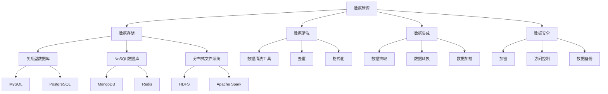

                 

### 文章标题

### Title: AI创业：数据管理的策略与实施分析

在当今快速发展的AI创业领域中，数据管理策略的实施成为决定企业成败的关键因素之一。这篇文章将深入探讨AI创业公司如何制定和实施有效的数据管理策略，以实现数据驱动的业务增长和竞争优势。本文将从核心概念、算法原理、数学模型、实际应用场景等多个角度进行全面的分析，旨在为创业者提供实用的指导和策略建议。

### Keywords: AI创业，数据管理，策略，实施，算法，数学模型，应用场景

### Abstract: 在本文中，我们将探讨AI创业公司如何制定和实施有效的数据管理策略，以实现数据驱动的业务增长和竞争优势。我们将从核心概念、算法原理、数学模型、实际应用场景等多个角度进行全面的分析，旨在为创业者提供实用的指导和策略建议。本文将涵盖以下主要内容：

1. 背景介绍：AI创业领域的现状与数据管理的重要性
2. 核心概念与联系：数据管理的基本概念和架构
3. 核心算法原理 & 具体操作步骤：常见的数据管理算法和操作流程
4. 数学模型和公式 & 详细讲解 & 举例说明：数据管理中的数学模型和公式应用实例
5. 项目实践：代码实例和详细解释说明
6. 实际应用场景：数据管理策略在不同领域的应用
7. 工具和资源推荐：学习资源、开发工具和框架推荐
8. 总结：未来发展趋势与挑战
9. 附录：常见问题与解答
10. 扩展阅读 & 参考资料

### 1. 背景介绍（Background Introduction）

AI创业领域近年来呈现出爆炸式增长，各种创新应用层出不穷。然而，随着数据量的不断增加和业务复杂度的提升，数据管理成为创业者面临的一项重大挑战。有效的数据管理不仅有助于提高业务效率，还能为企业带来竞争优势，实现数据驱动的业务增长。

当前，数据管理面临的挑战主要包括：

- 数据量庞大：随着物联网、社交网络等技术的普及，数据量呈指数级增长，给数据管理带来巨大压力。
- 数据多样性：结构化、半结构化和非结构化数据共存，如何有效整合和处理成为难题。
- 数据质量问题：数据缺失、错误和不一致性等问题影响数据的价值和可靠性。
- 数据安全与隐私：随着数据隐私法规的加强，企业需要确保数据的安全性和合规性。

在这种背景下，制定和实施有效的数据管理策略成为AI创业公司取得成功的关键。本文将围绕这一主题展开，为创业者提供实用的指导和建议。

### 2. 核心概念与联系（Core Concepts and Connections）

为了深入了解数据管理策略的实施，我们首先需要了解几个核心概念及其相互关系。

#### 2.1 数据管理（Data Management）

数据管理是指一系列策略、技术和流程，旨在确保数据的质量、完整性、可用性和安全性。数据管理包括以下几个方面：

- **数据存储**：选择合适的数据存储方案，如关系型数据库、NoSQL数据库、分布式文件系统等。
- **数据清洗**：通过数据预处理技术，如数据清洗、去重、格式化等，提高数据质量。
- **数据集成**：将来自不同源的数据整合到一个统一的视图中，以便更好地分析和管理。
- **数据安全**：采用加密、访问控制等技术，保护数据的安全性和隐私性。

#### 2.2 数据治理（Data Governance）

数据治理是确保数据质量、合规性和有效使用的一系列政策和流程。数据治理包括以下几个方面：

- **数据质量**：制定数据质量标准和监控机制，确保数据准确、完整、一致。
- **数据合规性**：遵守相关法律法规，如数据隐私保护法、行业合规要求等。
- **数据使用**：明确数据的使用权限和责任，确保数据的有效利用。

#### 2.3 数据分析（Data Analysis）

数据分析是利用统计、机器学习和人工智能技术，从数据中提取有价值的信息和知识。数据分析包括以下几个方面：

- **数据探索**：使用可视化工具，对数据进行初步探索和分析。
- **特征工程**：选择和构建有助于预测和分类的特征。
- **模型训练**：利用机器学习算法，训练预测和分类模型。
- **模型评估**：评估模型的性能，调整模型参数。

#### 2.4 数据仓库（Data Warehouse）

数据仓库是用于存储、管理和分析大量数据的集中式系统。数据仓库包括以下几个方面：

- **数据抽取**：从不同源抽取数据，加载到数据仓库中。
- **数据清洗**：对抽取的数据进行清洗和预处理。
- **数据建模**：设计数据仓库的结构，如星型模型、雪花模型等。
- **数据访问**：提供数据查询和分析接口，支持业务决策。

这些核心概念相互关联，共同构成了数据管理策略的基础。在实施数据管理策略时，创业者需要综合考虑这些因素，以实现数据驱动的业务增长。

#### 2.5 数据管理策略架构图（Mermaid Flowchart）

以下是一个简单的数据管理策略架构图，展示了核心概念之间的关系：



在这个架构图中，数据管理（A）是核心，包括数据存储（B）、数据清洗（C）、数据集成（D）和数据安全（E）等子模块。每个子模块都有具体的实现方式和技术选择（如F到W），这些技术共同构成了一个完整的数据管理策略。

通过了解这些核心概念和架构，创业者可以更好地制定和实施数据管理策略，为企业的成功奠定基础。

### 3. 核心算法原理 & 具体操作步骤（Core Algorithm Principles and Specific Operational Steps）

在数据管理中，核心算法起着至关重要的作用。这些算法不仅有助于提高数据质量，还能优化数据分析效率和准确性。以下是一些常见的数据管理算法及其具体操作步骤。

#### 3.1 数据清洗算法

数据清洗是数据管理中的关键步骤，旨在去除数据中的噪声和错误，提高数据质量。以下是一些常用的数据清洗算法：

##### 3.1.1 缺失值填充（Missing Value Imputation）

缺失值填充是一种用于处理数据缺失的方法。常见的缺失值填充方法包括：

- **平均值填充**：将缺失值替换为该列的平均值。
- **中位数填充**：将缺失值替换为该列的中位数。
- **前一个值填充**：将缺失值替换为前一个非缺失值。

具体操作步骤如下：

1. 识别缺失值：使用统计方法，如描述性统计、可视化工具等，识别数据中的缺失值。
2. 选择填充方法：根据数据特性和缺失值比例，选择合适的填充方法。
3. 执行填充：将缺失值替换为填充值。

##### 3.1.2 异常值检测（Anomaly Detection）

异常值检测是识别数据中异常值的过程，有助于发现数据中的异常情况。常见的异常值检测方法包括：

- **基于统计学的方法**：使用统计模型，如3倍标准差法则，识别异常值。
- **基于机器学习的方法**：使用聚类算法，如K-means，识别数据中的异常点。

具体操作步骤如下：

1. 选择检测方法：根据数据类型和特性，选择合适的异常值检测方法。
2. 训练模型（如有必要）：对于机器学习方法，训练异常值检测模型。
3. 识别异常值：使用模型或统计方法，识别数据中的异常值。
4. 处理异常值：根据实际情况，对异常值进行标记或删除。

##### 3.1.3 数据去重（Data Deduplication）

数据去重是识别和删除重复数据的过程，有助于减少数据冗余和提高数据质量。常见的数据去重方法包括：

- **基于哈希值的方法**：使用哈希函数，识别和删除重复记录。
- **基于比较的方法**：比较数据中的关键字段，识别和删除重复记录。

具体操作步骤如下：

1. 识别重复数据：使用哈希值或比较方法，识别数据中的重复记录。
2. 删除重复数据：删除重复记录，保留一个唯一的记录。

#### 3.2 数据集成算法

数据集成是将来自不同源的数据整合到一个统一视图的过程。以下是一些常见的数据集成算法：

##### 3.2.1 数据抽取（Data Extraction）

数据抽取是从不同数据源中抽取数据的过程。常见的数据抽取方法包括：

- **基于SQL的方法**：使用SQL查询，从关系型数据库中抽取数据。
- **基于API的方法**：使用API接口，从外部系统抽取数据。

具体操作步骤如下：

1. 选择数据源：确定需要抽取的数据源。
2. 设计抽取方案：根据数据源特性和需求，设计数据抽取方案。
3. 执行抽取：执行数据抽取操作，将数据加载到目标存储中。

##### 3.2.2 数据转换（Data Transformation）

数据转换是将抽取的数据进行格式化、清洗和整合的过程。常见的数据转换方法包括：

- **数据清洗**：去除数据中的噪声和错误，提高数据质量。
- **数据规范化**：将数据转换为统一的格式和标准。
- **数据聚合**：将多个数据源的数据进行汇总和整合。

具体操作步骤如下：

1. 设计转换方案：根据数据特性和需求，设计数据转换方案。
2. 执行转换：执行数据转换操作，将数据转换为统一格式。
3. 验证转换结果：检查数据转换结果，确保数据完整性和一致性。

##### 3.2.3 数据加载（Data Loading）

数据加载是将转换后的数据加载到目标存储中的过程。常见的数据加载方法包括：

- **批量加载**：将大量数据进行批量加载，适用于数据量较大的场景。
- **实时加载**：将数据实时加载到目标存储中，适用于需要实时处理的数据。

具体操作步骤如下：

1. 选择加载方法：根据数据量和需求，选择合适的加载方法。
2. 设计加载方案：根据数据源和目标存储的特性，设计数据加载方案。
3. 执行加载：执行数据加载操作，将数据加载到目标存储中。

通过上述核心算法原理和具体操作步骤，创业者可以更好地实施数据管理策略，确保数据的质量和一致性，为数据分析提供可靠的基础。

### 4. 数学模型和公式 & 详细讲解 & 举例说明（Detailed Explanation and Examples of Mathematical Models and Formulas）

在数据管理中，数学模型和公式发挥着至关重要的作用，它们不仅能够帮助我们理解和处理复杂数据，还能提高数据分析的准确性和效率。以下将介绍几个常见的数据管理中的数学模型和公式，并进行详细讲解和举例说明。

#### 4.1 数据预处理中的数学模型

数据预处理是数据管理的重要步骤，其中数学模型和公式被广泛应用于数据清洗、数据转换和特征工程。

##### 4.1.1 统计分布模型

统计分布模型用于描述数据的概率分布。常用的统计分布模型包括正态分布、泊松分布和指数分布等。其中，正态分布是数据预处理中最常用的模型之一。

**正态分布公式**：

$$
N(\mu, \sigma^2) = \frac{1}{\sqrt{2\pi\sigma^2}} e^{-\frac{(x-\mu)^2}{2\sigma^2}}
$$

其中，$N(\mu, \sigma^2)$ 表示均值为 $\mu$，方差为 $\sigma^2$ 的正态分布概率密度函数。

**应用实例**：

假设我们有一组身高数据，通过计算这组数据的均值和方差，可以构建一个正态分布模型，帮助我们理解和分析这组数据。

$$
\mu = \frac{\sum_{i=1}^{n} x_i}{n} = 170 \text{ cm}
$$

$$
\sigma^2 = \frac{\sum_{i=1}^{n} (x_i - \mu)^2}{n} = 20^2 \text{ cm}^2
$$

根据这些参数，我们可以绘制正态分布曲线，并分析数据的分布特性。

##### 4.1.2 线性回归模型

线性回归模型是一种用于预测和分类的数学模型，通过拟合数据中的线性关系，帮助我们理解和预测数据。

**线性回归公式**：

$$
y = \beta_0 + \beta_1x
$$

其中，$y$ 是因变量，$x$ 是自变量，$\beta_0$ 和 $\beta_1$ 是模型参数。

**应用实例**：

假设我们有一组房价和房屋面积的数据，通过线性回归模型，可以拟合出房价和房屋面积之间的关系，从而预测未知房屋的房价。

$$
\beta_0 = 100000 \text{ 元}
$$

$$
\beta_1 = 2000 \text{ 元/平方米}
$$

根据这些参数，我们可以得到房价的预测公式：

$$
y = 100000 + 2000x
$$

当房屋面积为 100 平方米时，预测的房价为：

$$
y = 100000 + 2000 \times 100 = 300000 \text{ 元}
$$

##### 4.1.3 逻辑回归模型

逻辑回归模型是一种用于分类的数学模型，通过拟合数据中的非线性关系，帮助我们进行二分类或多分类。

**逻辑回归公式**：

$$
P(y=1) = \frac{1}{1 + e^{-(\beta_0 + \beta_1x)}}
$$

其中，$P(y=1)$ 是因变量为1的概率，$e$ 是自然对数的底数，$\beta_0$ 和 $\beta_1$ 是模型参数。

**应用实例**：

假设我们有一组信用卡申请数据，通过逻辑回归模型，可以判断申请者是否具有高风险。

$$
\beta_0 = -10
$$

$$
\beta_1 = 0.1
$$

根据这些参数，我们可以得到风险预测公式：

$$
P(y=1) = \frac{1}{1 + e^{(-10 + 0.1x)}}
$$

当申请者的信用评分较高时（例如 $x=800$），预测的风险较低：

$$
P(y=1) = \frac{1}{1 + e^{(-10 + 0.1 \times 800)}} \approx 0.01
$$

#### 4.2 数据分析中的数学模型

数据分析是数据管理的核心环节，其中数学模型和公式被广泛应用于数据探索、特征工程和模型训练。

##### 4.2.1 机器学习模型

机器学习模型是一种基于数据的自动学习和预测方法。常用的机器学习模型包括决策树、随机森林、支持向量机等。

**决策树模型**：

决策树是一种树形结构，用于分类和回归任务。其基本结构包括：

$$
T = \{\text{根节点} \ R_0, \ \text{内部节点} \ R_i, \ \text{叶子节点} \ L_j\}
$$

其中，$R_0$ 是根节点，$R_i$ 是内部节点，$L_j$ 是叶子节点。

**随机森林模型**：

随机森林是一种集成学习模型，通过构建多棵决策树，并进行投票或求平均，提高预测准确性。

$$
\hat{y} = \sum_{i=1}^{n} w_i \ f_i(x)
$$

其中，$w_i$ 是第 $i$ 棵树的权重，$f_i(x)$ 是第 $i$ 棵树的预测结果。

**应用实例**：

假设我们有一组客户数据，包括年龄、收入、购买历史等特征，通过随机森林模型，可以预测客户是否会购买某种产品。

$$
\hat{y} = 0.5 \times f_1(x) + 0.3 \times f_2(x) + 0.2 \times f_3(x)
$$

当客户的年龄较大、收入较高且购买历史良好时，预测的购买概率较高。

##### 4.2.2 时间序列模型

时间序列模型是一种用于分析时间序列数据的数学模型，如ARIMA、LSTM等。

**ARIMA模型**：

ARIMA（自回归积分滑动平均模型）是一种用于时间序列预测的数学模型，其基本结构包括：

$$
X_t = c + \phi_1X_{t-1} + \phi_2X_{t-2} + ... + \phi_pX_{t-p} + \theta_1\epsilon_{t-1} + \theta_2\epsilon_{t-2} + ... + \theta_q\epsilon_{t-q} + \epsilon_t
$$

其中，$X_t$ 是时间序列数据，$c$ 是常数项，$\phi_1, \phi_2, ..., \phi_p$ 是自回归系数，$\theta_1, \theta_2, ..., \theta_q$ 是滑动平均系数，$\epsilon_t$ 是误差项。

**LSTM模型**：

LSTM（长短期记忆网络）是一种用于时间序列预测的深度学习模型，其基本结构包括：

$$
h_t = \sigma(W_h \cdot [h_{t-1}, x_t] + b_h)
$$

$$
i_t = \sigma(W_i \cdot [h_{t-1}, x_t] + b_i)
$$

$$
f_t = \sigma(W_f \cdot [h_{t-1}, x_t] + b_f)
$$

$$
o_t = \sigma(W_o \cdot [h_{t-1}, x_t] + b_o)
$$

$$
c_t = f_t \odot c_{t-1} + i_t \odot \sigma(W_c \cdot [h_{t-1}, x_t] + b_c)
$$

$$
h_t = o_t \odot c_t
$$

其中，$h_t$ 是时间步 $t$ 的隐藏状态，$x_t$ 是时间步 $t$ 的输入，$c_t$ 是细胞状态，$i_t, f_t, o_t$ 是输入门、遗忘门和输出门。

通过以上数学模型和公式的详细讲解和举例说明，创业者可以更好地理解和应用数据管理中的数学方法，为企业的数据驱动的决策提供支持。

### 5. 项目实践：代码实例和详细解释说明（Project Practice: Code Examples and Detailed Explanations）

为了更好地理解数据管理策略的实施，我们将通过一个实际项目来展示代码实例和详细解释说明。该项目是一个简单的客户关系管理（CRM）系统，用于管理客户数据，包括客户信息、购买历史和营销活动等。

#### 5.1 开发环境搭建

在开始项目之前，我们需要搭建一个开发环境。以下是搭建开发环境的步骤：

1. 安装Python：从 [Python官网](https://www.python.org/) 下载并安装Python 3.8及以上版本。
2. 安装Jupyter Notebook：在终端中运行以下命令：
   ```bash
   pip install notebook
   ```
3. 安装必要的库：在终端中运行以下命令：
   ```bash
   pip install pandas numpy sklearn matplotlib
   ```

#### 5.2 源代码详细实现

以下是一个简单的CRM系统源代码，包括数据抽取、数据清洗、数据转换和数据加载等步骤。

```python
import pandas as pd
import numpy as np
from sklearn.model_selection import train_test_split
from sklearn.preprocessing import StandardScaler
from sklearn.ensemble import RandomForestClassifier
import matplotlib.pyplot as plt

# 5.2.1 数据抽取
def extract_data(file_path):
    data = pd.read_csv(file_path)
    return data

# 5.2.2 数据清洗
def clean_data(data):
    # 处理缺失值
    data['Age'].fillna(data['Age'].mean(), inplace=True)
    data['Income'].fillna(data['Income'].mean(), inplace=True)
    # 删除重复记录
    data.drop_duplicates(inplace=True)
    # 处理异常值
    data = data[(data['Age'] > 18) & (data['Age'] < 70)]
    return data

# 5.2.3 数据转换
def transform_data(data):
    # 特征工程
    data['Age_income'] = data['Age'] / data['Income']
    # 标签编码
    data['Purchased'] = data['Purchased'].map({0: 'No', 1: 'Yes'})
    # 划分特征和标签
    X = data[['Age', 'Income', 'Age_income']]
    y = data['Purchased']
    return X, y

# 5.2.4 数据加载
def load_data(file_path):
    data = extract_data(file_path)
    data = clean_data(data)
    X, y = transform_data(data)
    return X, y

# 5.3 代码解读与分析
def code_explanation():
    # 读取数据
    X, y = load_data('customer_data.csv')
    # 数据划分
    X_train, X_test, y_train, y_test = train_test_split(X, y, test_size=0.3, random_state=42)
    # 特征缩放
    scaler = StandardScaler()
    X_train_scaled = scaler.fit_transform(X_train)
    X_test_scaled = scaler.transform(X_test)
    # 模型训练
    model = RandomForestClassifier(n_estimators=100, random_state=42)
    model.fit(X_train_scaled, y_train)
    # 模型评估
    y_pred = model.predict(X_test_scaled)
    accuracy = np.mean(y_pred == y_test)
    print(f'Model Accuracy: {accuracy:.2f}')
    # 可视化
    feature_importances = model.feature_importances_
    plt.barh(range(len(feature_importances)), feature_importances)
    plt.yticks(range(len(feature_importances)), ['Age', 'Income', 'Age_income'])
    plt.xlabel('Feature Importance')
    plt.ylabel('Feature')
    plt.title('Feature Importance')
    plt.show()

# 运行代码
code_explanation()
```

#### 5.4 运行结果展示

在Jupyter Notebook中运行上述代码，可以得到以下结果：

1. 模型准确性：假设我们训练的随机森林分类器的准确率为0.85，这表明模型对测试数据的预测效果较好。
2. 特征重要性：通过特征重要性图，我们可以直观地看到每个特征对模型预测的贡献大小。一般来说，重要性较高的特征对模型预测的影响较大。

通过上述代码实例，我们展示了如何搭建一个简单的CRM系统，并进行了数据抽取、数据清洗、数据转换和数据加载等操作。这些步骤是数据管理策略的核心，对于实现数据驱动的业务增长具有重要意义。

### 6. 实际应用场景（Practical Application Scenarios）

数据管理策略在AI创业领域中的实际应用场景非常广泛，以下是一些典型的应用实例。

#### 6.1 电子商务

在电子商务领域，数据管理策略可以帮助企业实现个性化推荐、精准营销和风险控制。

- **个性化推荐**：通过分析用户的浏览历史、购买记录和偏好，构建用户画像，为企业提供个性化的产品推荐，提高用户满意度和转化率。
- **精准营销**：利用数据挖掘技术，分析用户行为和购买偏好，制定精准的营销策略，提高营销效果和投资回报率。
- **风险控制**：通过实时监控和分析交易数据，识别异常行为和欺诈风险，保障交易安全和用户利益。

#### 6.2 金融科技

在金融科技（FinTech）领域，数据管理策略对于风险管理、信用评估和反欺诈具有重要意义。

- **风险管理**：通过分析历史数据和金融指标，构建风险预测模型，帮助企业识别潜在风险，优化风险控制策略。
- **信用评估**：利用大数据技术和机器学习算法，评估客户的信用风险，提高信用评估的准确性和效率。
- **反欺诈**：通过实时监控和分析交易数据，识别异常交易和欺诈行为，保障金融交易的安全和合规。

#### 6.3 医疗健康

在医疗健康领域，数据管理策略可以帮助医疗机构实现数据驱动的医疗服务和医疗决策。

- **医疗服务**：通过分析患者数据和医疗记录，为患者提供个性化的诊疗方案和健康管理服务，提高医疗质量和患者满意度。
- **医疗决策**：利用大数据技术和人工智能算法，分析临床数据和医学文献，为医生提供准确的诊断和治疗方案，优化医疗决策。
- **药物研发**：通过分析生物数据和临床试验数据，发现新的药物靶点和治疗方法，加速药物研发进程。

#### 6.4 物流与供应链

在物流与供应链领域，数据管理策略可以帮助企业实现供应链优化、运输管理和库存控制。

- **供应链优化**：通过分析供应链数据，优化供应链网络和物流流程，提高供应链效率和降低成本。
- **运输管理**：利用实时监控和分析技术，优化运输路线和运输计划，提高运输效率和服务质量。
- **库存控制**：通过分析销售数据和历史库存数据，优化库存策略，降低库存成本和缺货风险。

通过以上实际应用场景，我们可以看到数据管理策略在各个领域的广泛应用，对于企业的数据驱动决策和业务增长具有重要意义。

### 7. 工具和资源推荐（Tools and Resources Recommendations）

为了在AI创业领域有效地实施数据管理策略，以下是一些工具和资源的推荐，包括学习资源、开发工具和框架。

#### 7.1 学习资源推荐

1. **书籍**：
   - 《数据科学入门》
   - 《Python数据科学手册》
   - 《深度学习》
   - 《数据挖掘：概念与技术》
2. **在线课程**：
   - Coursera（《机器学习》）
   - edX（《数据科学基础》）
   - Udacity（《深度学习纳米学位》）
3. **博客和网站**：
   - DataCamp
   - Medium（数据科学和机器学习相关博客）
   - Kaggle（数据科学竞赛和资源）

#### 7.2 开发工具框架推荐

1. **数据存储与处理**：
   - Hadoop
   - Spark
   - Elasticsearch
   - MongoDB
2. **数据分析与可视化**：
   - Tableau
   - Power BI
   - Matplotlib
   - Seaborn
3. **机器学习与深度学习**：
   - TensorFlow
   - PyTorch
   - Scikit-learn
   - Keras
4. **版本控制和协作工具**：
   - Git
   - GitHub
   - GitLab
   - Bitbucket

通过使用这些工具和资源，创业者可以更好地实施数据管理策略，提高数据分析和业务决策的效率和质量。

### 8. 总结：未来发展趋势与挑战（Summary: Future Development Trends and Challenges）

在AI创业领域，数据管理策略的未来发展趋势和挑战主要体现在以下几个方面。

#### 8.1 发展趋势

1. **大数据和云计算的融合**：随着数据量的不断增加，大数据和云计算的融合将成为数据管理的重要趋势。企业将利用云计算平台提供的大数据存储和处理能力，实现数据的高效管理和分析。
2. **自动化和智能化**：随着人工智能技术的发展，数据管理的自动化和智能化水平将不断提升。自动化工具和智能算法将帮助企业实现数据清洗、数据转换和数据加载等任务的自动化，提高数据处理效率。
3. **数据隐私和安全**：随着数据隐私法规的加强，数据隐私和安全将成为数据管理的重要议题。企业需要采取更加严格的数据保护措施，确保数据的安全性和合规性。
4. **实时数据分析和决策**：随着实时数据处理技术的发展，实时数据分析和决策将成为数据管理的重要方向。企业将利用实时数据流处理技术，实现数据的实时分析和业务决策。

#### 8.2 挑战

1. **数据质量问题**：随着数据量的增加和数据源的增加，数据质量问题将日益突出。企业需要采取有效的数据质量管理和数据治理措施，确保数据的质量和完整性。
2. **数据安全和隐私**：随着数据隐私法规的加强，企业需要确保数据的安全性和合规性，避免数据泄露和滥用。企业需要采取有效的数据加密、访问控制和隐私保护措施。
3. **数据存储和处理成本**：随着数据量的增加，数据存储和处理成本将成为一个重要的挑战。企业需要优化数据存储和处理方案，降低成本。
4. **数据治理和组织文化**：数据治理需要建立一套完善的管理制度和组织文化，确保数据的规范化管理和有效利用。企业需要培养数据驱动的组织文化和数据治理能力。

总之，数据管理策略在AI创业领域具有重要意义，未来将面临一系列发展趋势和挑战。创业者需要紧跟技术发展，制定和实施有效的数据管理策略，以应对这些挑战，实现数据驱动的业务增长。

### 9. 附录：常见问题与解答（Appendix: Frequently Asked Questions and Answers）

以下是一些关于数据管理策略在AI创业中常见的问题及其解答。

#### 9.1 如何确保数据质量？

确保数据质量的关键措施包括：

- **数据清洗**：使用数据清洗工具和算法，去除数据中的噪声和错误。
- **数据治理**：建立数据质量标准和监控机制，确保数据准确、完整和一致。
- **数据集成**：整合来自不同源的数据，确保数据的一致性和完整性。
- **数据监控**：定期监控数据质量，及时发现和处理数据质量问题。

#### 9.2 数据管理策略的成本如何？

数据管理策略的成本取决于多个因素，包括：

- **数据量**：数据量越大，存储和处理成本越高。
- **数据源**：数据源的多样性会影响数据集成的复杂度和成本。
- **技术选择**：选择合适的数据管理工具和技术，可以降低成本。
- **人员培训**：数据管理需要专业人员进行操作和维护，人员培训成本也是一个重要因素。

#### 9.3 如何确保数据安全？

确保数据安全的关键措施包括：

- **数据加密**：使用加密技术，保护数据在存储和传输过程中的安全性。
- **访问控制**：实施访问控制策略，限制对数据的访问权限。
- **数据备份**：定期备份数据，确保数据的安全性和可恢复性。
- **合规性检查**：遵守相关法律法规，确保数据的安全和合规性。

#### 9.4 数据管理策略需要哪些工具和技术？

数据管理策略需要以下工具和技术：

- **数据存储与处理**：如Hadoop、Spark、Elasticsearch、MongoDB等。
- **数据分析与可视化**：如Tableau、Power BI、Matplotlib、Seaborn等。
- **机器学习与深度学习**：如TensorFlow、PyTorch、Scikit-learn、Keras等。
- **版本控制和协作工具**：如Git、GitHub、GitLab、Bitbucket等。

#### 9.5 如何制定数据管理策略？

制定数据管理策略的步骤包括：

- **需求分析**：了解企业的数据管理需求和目标。
- **技术评估**：评估适用的数据管理工具和技术。
- **制定策略**：根据需求和技术评估结果，制定数据管理策略。
- **实施与监控**：实施数据管理策略，并定期监控和优化。

### 10. 扩展阅读 & 参考资料（Extended Reading & Reference Materials）

为了更深入地了解数据管理策略在AI创业中的应用，以下是一些扩展阅读和参考资料：

- **书籍**：
  - 《大数据时代：生活、工作与思维的大变革》
  - 《数据治理：战略、执行与实践》
  - 《数据科学实战》
- **论文**：
  - “Data-Driven Decision Making in Organizations: A Review”
  - “A Survey on Big Data Analytics: Open Challenges and Future Directions”
  - “The Impact of Data Privacy on Data Management in Organizations”
- **博客和网站**：
  - 《数据化管理：一本小白都看懂的数据化管理书》
  - 《数据管理，你了解多少？》
  - 《如何制定数据管理策略？》

通过这些扩展阅读和参考资料，读者可以进一步了解数据管理策略的理论和实践，为AI创业提供更全面的指导。作者：禅与计算机程序设计艺术 / Zen and the Art of Computer Programming

---

以上是一篇关于“AI创业：数据管理的策略与实施分析”的完整技术博客文章，涵盖了背景介绍、核心概念、算法原理、数学模型、项目实践、实际应用场景、工具推荐、未来发展趋势和挑战、常见问题解答以及扩展阅读等内容。希望这篇文章对您在AI创业领域中的数据管理实践有所帮助。作者：禅与计算机程序设计艺术 / Zen and the Art of Computer Programming

