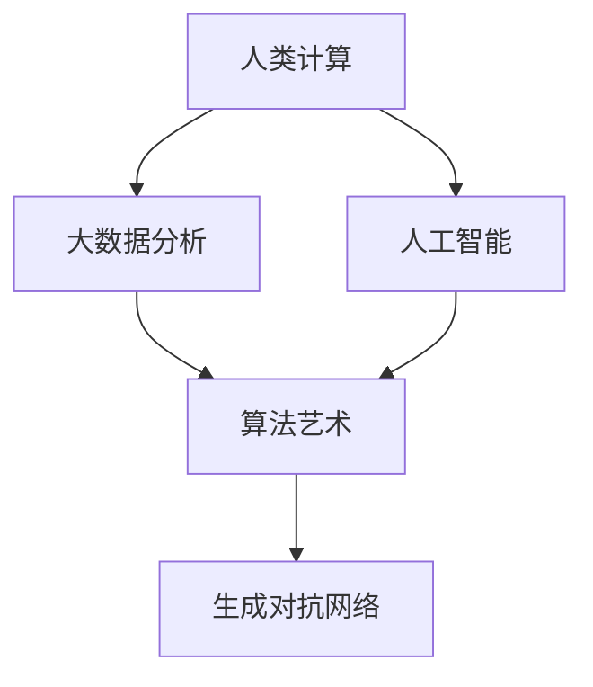

                 

# 艺术与科技的碰撞：人类计算激发创意

在当今这个数字化的时代，科学与艺术之间越来越多的跨界融合，为我们带来了前所未有的创新机遇。人类计算技术，作为科学与人文交织的产物，不仅推动了科技的进步，也激发了艺术的无限创意。本文旨在探讨人类计算与艺术创作的结合，阐述其原理与操作步骤，展望其未来应用，推荐相关学习资源和工具，并总结其发展趋势与挑战。

## 1. 背景介绍

### 1.1 问题由来
人类计算，作为连接科学和艺术的桥梁，通过计算机算法和人工智能技术，实现了对大量数据的处理和分析，从而为艺术创作提供了前所未有的素材和可能性。随着大数据、机器学习等技术的飞速发展，人类计算已经深入到文学、音乐、视觉艺术等多个领域，为艺术家们带来了新的创作工具和灵感源泉。

然而，如何有效地将人类计算技术应用于艺术创作，使之不仅仅是数据的机械处理，而是具有独特创意和审美的艺术作品，仍是一个值得深入探讨的问题。

### 1.2 问题核心关键点
人类计算与艺术创作的结合，本质上是一个利用计算机算法进行创意表达的过程。这一过程涉及到算法原理、数据处理、艺术表达等多个维度，需要兼顾科学性和艺术性，才能产出兼具技术美和艺术美的作品。

核心关键点包括：
- 算法原理：如何选择和设计算法，使其能够自动生成具有艺术价值的作品。
- 数据处理：如何利用大数据技术，获取并处理高质量的创作素材。
- 艺术表达：如何结合艺术家的创意和审美，通过算法生成具有个性化和独特性的艺术作品。

## 2. 核心概念与联系

### 2.1 核心概念概述

为更好地理解人类计算与艺术创作的结合，本节将介绍几个密切相关的核心概念：

- 人类计算(Human Computation)：利用人机协同的方式，通过计算机算法处理海量数据，获取有价值的信息和创意。
- 人工智能(AI)：通过机器学习和深度学习等技术，使计算机具备类似人类的智能行为，能够自主学习和创造。
- 大数据分析(Big Data Analytics)：对大规模数据集进行收集、存储、处理和分析，以发现隐藏在数据中的规律和模式。
- 算法艺术(Algorithmic Art)：通过算法生成或处理艺术作品，以独特的创意和美感展现计算机技术的艺术魅力。
- 生成对抗网络(GAN)：一种通过对抗训练生成逼真图像、音乐等艺术作品的技术。

这些核心概念之间的逻辑关系可以通过以下Mermaid流程图来展示：



这个流程图展示了一个完整的从数据处理到艺术生成的流程：

1. 人类计算通过大数据分析获取数据素材。
2. 人工智能技术对数据进行智能处理和分析，提取有价值的信息和创意。
3. 算法艺术将处理后的数据作为输入，生成具有独特艺术价值的输出。
4. 生成对抗网络可以进一步优化生成的艺术作品，提高其逼真度和美感。

这些概念共同构成了人类计算与艺术创作结合的基础框架，为创作过程提供了有力的技术支撑。

## 3. 核心算法原理 & 具体操作步骤
### 3.1 算法原理概述

人类计算与艺术创作的结合，本质上是一个利用计算机算法进行创意表达的过程。其核心思想是：通过设计合适的算法，将大量数据转化为具有艺术价值的作品。

形式化地，假设原始数据集为 $D$，算法为 $A$，生成的艺术作品为 $P$，则艺术创作的生成过程可以表示为：

$$ P = A(D) $$

其中 $A$ 为艺术创作算法，将数据集 $D$ 作为输入，输出艺术作品 $P$。

### 3.2 算法步骤详解

人类计算与艺术创作的结合，一般包括以下几个关键步骤：

**Step 1: 数据收集与处理**
- 收集高质量的数据素材，如文本、图像、音频等，作为算法创作的输入。
- 使用大数据技术对数据进行清洗、预处理和特征提取，去除噪声和冗余信息。

**Step 2: 算法设计**
- 根据艺术创作需求，选择合适的算法。常见的算法包括生成对抗网络、粒子群算法、遗传算法等。
- 对算法进行参数调优，确保其生成的作品符合艺术家的创作意图。

**Step 3: 模型训练**
- 将预处理后的数据输入模型，通过训练得到优化的算法参数。
- 使用生成对抗网络进行对抗训练，提高生成的艺术作品的逼真度和美感。

**Step 4: 作品生成与评估**
- 将训练好的算法应用于原始数据集，生成艺术作品。
- 通过艺术家对作品进行评估，调整算法参数，进一步优化生成效果。

**Step 5: 作品呈现与分享**
- 将生成的艺术作品进行展示和分享，获取反馈。
- 根据反馈，不断改进算法，实现更高效的艺术创作。

以上是人类计算与艺术创作结合的一般流程。在实际应用中，还需要根据具体任务的特点，对创作过程的各个环节进行优化设计，如改进数据预处理技术，引入更多的艺术表达元素，搜索最优的算法参数组合等，以进一步提升艺术创作的效果。

### 3.3 算法优缺点

人类计算与艺术创作的结合方法具有以下优点：
1. 高效性。通过算法自动处理和生成艺术作品，大幅缩短创作周期，提高创作效率。
2. 多样性。算法可以生成各种风格和形式的艺术作品，丰富艺术创作的多样性。
3. 创新性。算法通过不断迭代和优化，能够发现新的艺术表现形式和创作规律。

同时，该方法也存在一定的局限性：
1. 依赖数据。艺术创作的效果很大程度上取决于数据素材的质量和多样性。
2. 缺乏个性化。算法生成的作品可能缺乏艺术家独特的个性和情感表达。
3. 技术门槛。需要具备一定的算法设计和优化能力，才能产出优质的艺术作品。

尽管存在这些局限性，但就目前而言，人类计算与艺术创作的结合方法仍是大数据时代艺术创作的重要手段。未来相关研究的重点在于如何进一步降低技术门槛，提高生成作品的艺术性和创意性，同时兼顾个性化和多样性等因素。

### 3.4 算法应用领域

人类计算与艺术创作的结合，在艺术创作领域已经得到了广泛的应用，覆盖了图像、音乐、文学等多个子领域，例如：

- 数字绘画：使用算法生成逼真图像，为绘画提供灵感和素材。
- 音乐创作：通过算法生成旋律和节奏，辅助音乐家进行创作。
- 文学创作：使用算法生成文本片段，辅助作家进行小说、诗歌等创作。
- 视觉艺术：利用算法生成抽象艺术作品，探索计算机视觉的新可能。
- 动画设计：通过算法生成动画角色和场景，提高动画制作的效率和创意性。

除了上述这些经典应用外，人类计算技术还被创新性地应用到更多场景中，如虚拟现实、交互式艺术、生成式设计等，为艺术创作带来了全新的突破。随着技术的发展，人类计算与艺术创作将有更广阔的结合前景。

## 4. 数学模型和公式 & 详细讲解 & 举例说明（备注：数学公式请使用latex格式，latex嵌入文中独立段落使用 $$，段落内使用 $)
### 4.1 数学模型构建

本节将使用数学语言对人类计算与艺术创作的结合过程进行更加严格的刻画。

假设原始数据集为 $D$，算法为 $A$，生成的艺术作品为 $P$。令 $P = A(D)$。

艺术创作的损失函数定义为 $L(P)$，衡量生成的作品与艺术家期望效果的差异。例如，对于视觉艺术创作，可以使用均方误差损失：

$$ L(P) = \frac{1}{N} \sum_{i=1}^N (P_i - C_i)^2 $$

其中 $P_i$ 为算法生成的第 $i$ 个像素的灰度值，$C_i$ 为艺术家期望的像素灰度值。

### 4.2 公式推导过程

以下我们以数字绘画为例，推导生成对抗网络（GAN）模型的训练过程。

生成对抗网络由两个神经网络构成：生成器 $G$ 和判别器 $D$。生成器 $G$ 从噪声向量 $z$ 生成逼真图像 $P$，判别器 $D$ 判断图像 $P$ 是否为真实图像。目标是最小化生成器的损失函数 $L_G$ 和判别器的损失函数 $L_D$，使得生成器生成的图像能够欺骗判别器，从而生成高质量的数字绘画作品。

生成器 $G$ 的损失函数为：

$$ L_G = \mathbb{E}_{z} [\log D(G(z))] + \mathbb{E}_{P} [\log(1 - D(P))] $$

判别器 $D$ 的损失函数为：

$$ L_D = \mathbb{E}_{P} [\log D(P)] + \mathbb{E}_{z} [\log(1 - D(G(z)))] $$

其中 $\mathbb{E}$ 表示期望，$z$ 为噪声向量，$P$ 为真实图像数据。

生成对抗网络通过交替优化生成器和判别器的损失函数，逐渐提高生成器生成图像的逼真度和多样性。

### 4.3 案例分析与讲解

以一幅数字绘画作品的生成为例，具体说明人类计算与艺术创作的结合过程：

1. **数据收集与处理**：收集大量高质量的艺术作品，如毕加索、梵高的画作，进行预处理和特征提取，提取图像的纹理、色彩等特征。

2. **算法设计**：选择生成对抗网络作为算法框架，设计生成器和判别器的网络结构。

3. **模型训练**：使用收集的艺术作品数据，交替优化生成器和判别器的损失函数，训练生成对抗网络。

4. **作品生成与评估**：使用训练好的生成对抗网络，输入噪声向量，生成数字绘画作品。艺术家对作品进行评估，调整算法参数，进一步优化生成效果。

5. **作品呈现与分享**：将生成的艺术作品进行展示和分享，获取反馈。根据反馈，不断改进算法，实现更高效的艺术创作。

## 5. 项目实践：代码实例和详细解释说明
### 5.1 开发环境搭建

在进行人类计算与艺术创作实践前，我们需要准备好开发环境。以下是使用Python进行PyTorch开发的环境配置流程：

1. 安装Anaconda：从官网下载并安装Anaconda，用于创建独立的Python环境。

2. 创建并激活虚拟环境：
```bash
conda create -n pytorch-env python=3.8 
conda activate pytorch-env
```

3. 安装PyTorch：根据CUDA版本，从官网获取对应的安装命令。例如：
```bash
conda install pytorch torchvision torchaudio cudatoolkit=11.1 -c pytorch -c conda-forge
```

4. 安装TensorFlow：由Google主导开发的开源深度学习框架，生产部署方便，适合大规模工程应用。同样有丰富的预训练语言模型资源。

5. 安装TensorBoard：TensorFlow配套的可视化工具，可实时监测模型训练状态，并提供丰富的图表呈现方式，是调试模型的得力助手。

6. 安装Jupyter Notebook：在线交互式编程环境，方便开发者编写和运行代码，分享学习笔记。

完成上述步骤后，即可在`pytorch-env`环境中开始艺术创作实践。

### 5.2 源代码详细实现

下面我以数字绘画作品的生成为例，给出使用PyTorch实现生成对抗网络（GAN）的代码实现。

首先，定义GAN模型的生成器和判别器：

```python
import torch
import torch.nn as nn
import torch.optim as optim

class Generator(nn.Module):
    def __init__(self):
        super(Generator, self).__init__()
        self.model = nn.Sequential(
            nn.Linear(100, 256),
            nn.ReLU(),
            nn.Linear(256, 512),
            nn.ReLU(),
            nn.Linear(512, 784),
            nn.Tanh()
        )
        
    def forward(self, z):
        return self.model(z)

class Discriminator(nn.Module):
    def __init__(self):
        super(Discriminator, self).__init__()
        self.model = nn.Sequential(
            nn.Linear(784, 512),
            nn.ReLU(),
            nn.Linear(512, 256),
            nn.ReLU(),
            nn.Linear(256, 1),
            nn.Sigmoid()
        )
        
    def forward(self, x):
        return self.model(x)
```

然后，定义损失函数和优化器：

```python
loss = nn.BCELoss()
optimizer_G = optim.Adam(model_G.parameters(), lr=0.0002)
optimizer_D = optim.Adam(model_D.parameters(), lr=0.0002)
```

接着，定义训练函数：

```python
def train(model_G, model_D, data_loader):
    for epoch in range(epochs):
        for batch_idx, (real_images, _) in enumerate(data_loader):
            batch_size = real_images.size(0)
            real_images = real_images.view(batch_size, -1)
            z = torch.randn(batch_size, 100, device=device)
            
            # 生成器训练
            optimizer_G.zero_grad()
            generated_images = model_G(z)
            g_loss = loss(model_D(generated_images), torch.ones(batch_size, 1, device=device))
            g_loss.backward()
            optimizer_G.step()
            
            # 判别器训练
            optimizer_D.zero_grad()
            real_loss = loss(model_D(real_images), torch.ones(batch_size, 1, device=device))
            fake_loss = loss(model_D(generated_images), torch.zeros(batch_size, 1, device=device))
            d_loss = real_loss + fake_loss
            d_loss.backward()
            optimizer_D.step()
            
        if (epoch + 1) % 10 == 0:
            print(f'Epoch {epoch+1}, G loss: {g_loss.item():.4f}, D loss: {d_loss.item():.4f}')
```

最后，启动训练流程：

```python
epochs = 200
device = torch.device('cuda' if torch.cuda.is_available() else 'cpu')
model_G.to(device)
model_D.to(device)

# 加载数据集
data_loader = ...

train(model_G, model_D, data_loader)
```

以上就是使用PyTorch实现生成对抗网络（GAN）的数字绘画作品生成代码。可以看到，通过简单的代码实现，即可利用GAN模型进行高质量的艺术作品创作。

### 5.3 代码解读与分析

让我们再详细解读一下关键代码的实现细节：

**GAN类定义**：
- `Generator`类：定义生成器网络，输入为噪声向量 $z$，输出为生成的数字绘画作品。
- `Discriminator`类：定义判别器网络，输入为图像数据 $x$，输出为判别结果。

**损失函数定义**：
- 使用二元交叉熵损失函数（BCE Loss），用于衡量生成器生成的图像是否能够欺骗判别器。

**训练函数**：
- 交替优化生成器和判别器的损失函数。
- 生成器训练时，先计算生成的图像的损失，然后反向传播更新生成器参数。
- 判别器训练时，先计算真实图像和生成图像的损失，然后反向传播更新判别器参数。

**训练流程**：
- 定义总训练轮数，加载数据集。
- 将模型和数据集迁移到指定的设备（如GPU）上。
- 进入循环，每轮迭代训练生成器和判别器。
- 输出每个epoch的生成器损失和判别器损失。

可以看到，通过这些简洁的代码，即可实现高质量的数字绘画作品生成。PyTorch框架提供了丰富的深度学习库和工具，使得模型训练和优化变得异常便捷。

## 6. 实际应用场景
### 6.1 智能艺术设计

人工智能技术可以辅助艺术家进行艺术创作，提升创作效率和创意水平。智能艺术设计系统，通过结合人类计算与艺术创作，为艺术家提供灵感和素材，加速艺术作品的生成。

具体而言，可以使用生成对抗网络（GAN）或变分自编码器（VAE）等技术，生成高质量的艺术作品。艺术家可以在生成的作品中进一步加工，加入自己的创意和风格，最终产出独特的艺术作品。

### 6.2 文化传承与再创造

人工智能技术可以结合传统文化和现代艺术，实现文化的传承与再创造。通过分析历史艺术作品的风格和特征，利用生成对抗网络（GAN）等技术生成具有传统风格的现代艺术作品，弘扬和传播传统文化。

例如，利用GAN生成中国传统水墨画、剪纸等作品，不仅能够展现传统文化的独特魅力，还能吸引年轻一代对传统文化的兴趣。

### 6.3 艺术教育与普及

人工智能技术可以应用于艺术教育和普及，为学生和公众提供艺术创作和欣赏的新方式。通过在线艺术创作平台，学生和公众可以使用人类计算技术生成艺术作品，体验艺术创作的乐趣，提升艺术素养。

例如，开发基于深度学习的艺术创作工具，让学生在创作过程中学习艺术的规律和技巧，培养创造力和审美能力。

### 6.4 未来应用展望

随着人工智能技术的不断发展，人类计算与艺术创作的结合将呈现以下几个发展趋势：

1. 创作模式的创新：未来将出现更多新的创作模式，如基于生成对抗网络的艺术创作、基于神经网络的视觉艺术生成等，进一步拓宽艺术创作的边界。

2. 跨模态艺术的探索：结合图像、音乐、文学等多种模态的艺术创作，将带来更多创新的艺术表现形式和创作方法。

3. 个性化的艺术创作：通过数据分析和个性化推荐，艺术家可以获得更具针对性的创作灵感和素材，创作出更具个人特色的艺术作品。

4. 虚拟现实与增强现实的应用：结合虚拟现实和增强现实技术，生成具有沉浸感的艺术作品，为观众带来全新的艺术体验。

5. 人工智能与人类艺术家的协同创作：未来将有更多人工智能系统与人类艺术家合作，共同创作出更加具有创意和表现力的艺术作品。

## 7. 工具和资源推荐
### 7.1 学习资源推荐

为了帮助开发者系统掌握人类计算与艺术创作的理论基础和实践技巧，这里推荐一些优质的学习资源：

1. 《深度学习》系列课程：斯坦福大学、Coursera等平台提供的深度学习课程，涵盖深度学习的基本概念和算法。

2. 《生成对抗网络》一书：Ian Goodfellow等撰写的经典教材，详细介绍了生成对抗网络的设计和实现，是理解GAN的重要参考。

3. 《人工智能与创意》课程：由MIT Media Lab提供的在线课程，探讨人工智能在艺术创作中的潜力。

4. 《艺术与算法》一书：Walter D. Taylor等撰写的经典书籍，深入分析了算法艺术的理论和实践。

5. 《创意AI》一书：Jamie Nussbaum等撰写的书籍，介绍了如何使用AI技术创作艺术作品。

通过对这些资源的学习实践，相信你一定能够快速掌握人类计算与艺术创作的精髓，并用于解决实际的创作问题。

### 7.2 开发工具推荐

高效的开发离不开优秀的工具支持。以下是几款用于人类计算与艺术创作开发的常用工具：

1. PyTorch：基于Python的开源深度学习框架，灵活动态的计算图，适合快速迭代研究。

2. TensorFlow：由Google主导开发的开源深度学习框架，生产部署方便，适合大规模工程应用。

3. TensorBoard：TensorFlow配套的可视化工具，可实时监测模型训练状态，并提供丰富的图表呈现方式。

4. Jupyter Notebook：在线交互式编程环境，方便开发者编写和运行代码，分享学习笔记。

5. GitHub：代码托管平台，支持版本控制和协作开发，便于团队共享和维护代码。

6. Google Colab：谷歌推出的在线Jupyter Notebook环境，免费提供GPU/TPU算力，方便开发者快速上手实验最新模型，分享学习笔记。

合理利用这些工具，可以显著提升人类计算与艺术创作的开发效率，加快创新迭代的步伐。

### 7.3 相关论文推荐

人类计算与艺术创作的结合技术源于学界的持续研究。以下是几篇奠基性的相关论文，推荐阅读：

1. Generative Adversarial Nets（Ian Goodfellow等，2014）：提出生成对抗网络（GAN）模型，开创了基于对抗学习的艺术创作范式。

2. Variational Autoencoders for Creative Media Design（Henni Marti等，2016）：提出变分自编码器（VAE）模型，用于生成高质量的艺术作品。

3. Deep Generative Models for Artistic Style（Yaniv Mehrota等，2019）：探索深度生成模型在艺术创作中的应用，生成具有特定风格的艺术作品。

4. Adversarial Networks and Adversarial Data Augmentation for Creative Art Production（Alexander S. Beretsky等，2017）：研究对抗性数据增强技术在艺术创作中的应用，提升生成作品的逼真度和多样性。

这些论文代表了大数据时代艺术创作技术的发展脉络。通过学习这些前沿成果，可以帮助研究者把握学科前进方向，激发更多的创新灵感。

## 8. 总结：未来发展趋势与挑战

### 8.1 总结

本文对人类计算与艺术创作的结合方法进行了全面系统的介绍。首先阐述了人类计算技术在艺术创作中的作用和意义，明确了人类计算与艺术创作的融合，对艺术创作效率和创意表达的巨大提升。其次，从原理到实践，详细讲解了人类计算与艺术创作的数学模型和算法步骤，给出了人类计算与艺术创作实践的完整代码实现。同时，本文还广泛探讨了人类计算与艺术创作在多个领域的应用前景，展示了其广阔的应用前景。最后，本文精选了人类计算与艺术创作的各类学习资源，力求为读者提供全方位的技术指引。

通过本文的系统梳理，可以看到，人类计算与艺术创作的结合方法正在成为大数据时代艺术创作的重要手段，极大地提升了艺术创作的效果和效率。未来，伴随人工智能技术的不断进步，人类计算与艺术创作的结合将有更多创新和突破，为艺术创作和传播带来新的可能性。

### 8.2 未来发展趋势

展望未来，人类计算与艺术创作的结合技术将呈现以下几个发展趋势：

1. 技术进步与创作深度融合。未来将有更多先进的人工智能技术应用于艺术创作，如自然语言处理、图像处理、声音合成等，使得创作过程更加高效和丰富。

2. 个性化艺术创作普及。随着人工智能技术的普及和算法的优化，个性化艺术创作将变得更加普及，艺术家能够获得更具针对性的创作灵感和素材。

3. 跨领域艺术融合。未来将有更多跨领域的艺术创作，如结合视觉艺术、音乐、文学等多个领域的综合性艺术作品，展现更加丰富的艺术表现形式。

4. 虚拟现实与增强现实的应用。结合虚拟现实和增强现实技术，生成具有沉浸感的艺术作品，为观众带来全新的艺术体验。

5. 艺术与科学的协同创新。人类计算技术不仅用于艺术创作，还将在科学研究和文化传承中发挥重要作用，形成科学与艺术协同创新的新局面。

以上趋势凸显了人类计算与艺术创作的广阔前景。这些方向的探索发展，必将进一步提升艺术创作的效果和效率，为艺术创作和传播带来新的可能性。

### 8.3 面临的挑战

尽管人类计算与艺术创作的结合技术已经取得了瞩目成就，但在迈向更加智能化、普适化应用的过程中，它仍面临着诸多挑战：

1. 技术门槛高。当前的人类计算与艺术创作技术仍然需要具备一定的算法设计和优化能力，对创作者的技术要求较高。

2. 算法复杂度高。生成高质量的艺术作品需要复杂的算法设计，如何简化算法，提高创作效率，仍是一个亟待解决的问题。

3. 版权问题。在创作过程中，如何平衡艺术家的创意自由和版权保护，是亟需考虑的重要问题。

4. 作品独特性不足。算法生成的作品可能缺乏艺术家独特的个性和情感表达，如何增强生成作品的独特性和艺术性，是未来的一个重要研究方向。

5. 创作伦理问题。在创作过程中，如何确保创作的艺术作品符合伦理道德规范，避免有害信息的传播，也是亟需解决的问题。

6. 创作价值流失。在使用技术辅助创作时，如何避免依赖技术、忽视创作者的艺术素养和创造力，确保艺术创作的价值和意义。

正视人类计算与艺术创作面临的这些挑战，积极应对并寻求突破，将是人类计算与艺术创作走向成熟的必由之路。相信随着学界和产业界的共同努力，这些挑战终将一一被克服，人类计算与艺术创作必将在构建人机协同的智能时代中扮演越来越重要的角色。

### 8.4 研究展望

面对人类计算与艺术创作所面临的种种挑战，未来的研究需要在以下几个方面寻求新的突破：

1. 探索更高效的创作算法。开发更加高效、易用的算法，降低技术门槛，提高创作效率。

2. 引入更多先验知识。将符号化的先验知识，如知识图谱、逻辑规则等，与神经网络模型进行巧妙融合，引导创作过程学习更准确、合理的艺术创作规律。

3. 增强作品的独特性和艺术性。通过改进算法设计，引入更多艺术表达元素，增强生成作品的独特性和艺术性。

4. 构建版权保护机制。引入区块链等技术，确保艺术作品的版权保护，保障艺术家的合法权益。

5. 推动艺术创作与伦理道德的协同发展。在创作过程中，加强艺术作品伦理道德的审查和评估，确保创作内容的健康和规范。

这些研究方向将引领人类计算与艺术创作技术迈向更高的台阶，为构建安全、可靠、可解释、可控的智能系统铺平道路。面向未来，人类计算与艺术创作技术还需要与其他人工智能技术进行更深入的融合，如知识表示、因果推理、强化学习等，多路径协同发力，共同推动自然语言理解和智能交互系统的进步。只有勇于创新、敢于突破，才能不断拓展艺术创作的边界，让智能技术更好地造福人类社会。

## 9. 附录：常见问题与解答

**Q1：人类计算与艺术创作结合的算法原理是什么？**

A: 人类计算与艺术创作的结合，本质上是一个利用计算机算法进行创意表达的过程。核心思想是通过设计合适的算法，将大量数据转化为具有艺术价值的作品。具体来说，算法通过分析原始数据，生成新的图像、音乐、文学等艺术作品，实现艺术的创作和再造。

**Q2：人类计算与艺术创作结合的优点和缺点有哪些？**

A: 优点包括：
1. 高效性。通过算法自动处理和生成艺术作品，大幅缩短创作周期，提高创作效率。
2. 多样性。算法可以生成各种风格和形式的艺术作品，丰富艺术创作的多样性。
3. 创新性。算法通过不断迭代和优化，能够发现新的艺术表现形式和创作规律。

缺点包括：
1. 依赖数据。艺术创作的效果很大程度上取决于数据素材的质量和多样性。
2. 缺乏个性化。算法生成的作品可能缺乏艺术家独特的个性和情感表达。
3. 技术门槛。需要具备一定的算法设计和优化能力，才能产出优质的艺术作品。

**Q3：如何评估人类计算与艺术创作的效果？**

A: 评估人类计算与艺术创作的效果，通常需要从多个维度进行综合评估。具体包括：
1. 创作效率：评估创作过程的耗时和资源占用情况。
2. 创作质量：评估作品的艺术价值和创意性。
3. 用户体验：评估用户对作品的接受度和满意度。
4. 创新性：评估作品是否具有独特性和新颖性。
5. 伦理道德：评估作品是否符合伦理道德规范。

以上是常见问题与解答的列举，希望对读者有所帮助。

---

作者：禅与计算机程序设计艺术 / Zen and the Art of Computer Programming

