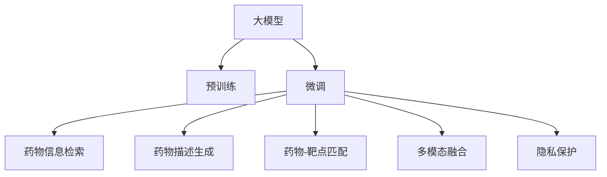

                 

# 药物发现加速器：LLM 助力研发

> 关键词：药物发现, LLM, 加速器, 自然语言处理, 人工智能, 药物研发, 深度学习

## 1. 背景介绍

### 1.1 问题由来

药物研发是一个复杂、耗时且成本高昂的过程，从药物设计、合成到临床试验，每一步都可能面临失败。传统药物发现方法依赖于耗时、耗资的实验室实验，往往需要数年甚至数十年的时间才能将一个药物从实验室推向市场。然而，近年来随着人工智能(AI)技术的飞速发展，尤其是自然语言处理(NLP)领域的大模型(LLM)的崛起，为药物研发带来了新的机遇。

大模型如GPT-3、T5等，通过预训练积累了大量的语言知识，可以理解自然语言的语义、语法和语用信息。这些知识可以被应用于药物信息检索、药物描述生成、药物-靶点匹配等任务，大大加速了药物发现过程，降低了研发成本。

### 1.2 问题核心关键点

大模型在药物发现中的应用主要集中在以下几个方面：
- 药物信息检索：通过大模型快速检索文献、数据库中的药物信息，加速信息获取过程。
- 药物描述生成：自动生成药物的描述信息，如作用机制、副作用、临床数据等。
- 药物-靶点匹配：通过自然语言理解，匹配药物与靶点之间的关联，提高药物筛选效率。
- 多模态信息融合：将文本信息与其他模态（如图像、蛋白质结构）信息融合，增强药物研发的理解深度。

这些应用展示了大模型在药物发现中的巨大潜力。然而，大模型应用也面临一些挑战，如数据隐私、模型鲁棒性、知识外推等。因此，需要针对这些问题进行深入研究。

## 2. 核心概念与联系

### 2.1 核心概念概述

为更好地理解大模型在药物发现中的应用，本节将介绍几个密切相关的核心概念：

- **大模型(LLM, Large Language Model)**：指预训练有大量文本数据，具备强大语言处理能力的神经网络模型，如GPT-3、BERT等。
- **预训练(Pre-training)**：指在大规模无标签文本数据上，通过自监督学习任务训练模型，使其具备通用语言表示能力。
- **微调(Fine-tuning)**：指在预训练模型的基础上，使用下游任务的少量标注数据，通过有监督学习优化模型在特定任务上的性能。
- **知识外推(Out-of-Distribution Generalization)**：指模型对新数据和新场景的泛化能力，对于药物研发中的新靶点、新化合物具有重要意义。
- **多模态融合(Multi-modal Fusion)**：指将文本信息与其他模态（如图像、蛋白质结构）信息结合，增强药物研发的理解深度。
- **隐私保护(Privacy Protection)**：指保护患者隐私、医疗数据安全等，是大模型应用中不可忽视的重要问题。

这些概念之间的逻辑关系可以通过以下Mermaid流程图来展示：



这个流程图展示了大模型在药物发现中的应用场景和核心概念：

1. 大模型通过预训练获得通用语言表示能力。
2. 微调将模型适配到具体的药物发现任务，优化模型性能。
3. 通过药物信息检索、药物描述生成、药物-靶点匹配、多模态融合等任务，提高药物发现效率和深度。
4. 通过隐私保护技术，保障数据安全。

这些概念共同构成了大模型在药物发现中的应用框架，使其能够有效地应用于药物研发中。

## 3. 核心算法原理 & 具体操作步骤
### 3.1 算法原理概述

大模型在药物发现中的应用，主要基于其强大的语言理解和生成能力。通过预训练，大模型可以学习到丰富的语言知识，包括语义、语法、语用信息等。这些知识可以被应用于药物信息检索、药物描述生成、药物-靶点匹配等任务，加速药物发现过程。

具体而言，大模型在药物发现中的应用步骤如下：

1. **预训练阶段**：在大规模无标签文本数据上训练大模型，使其学习到通用的语言表示能力。
2. **微调阶段**：在预训练模型的基础上，使用下游任务的少量标注数据，通过有监督学习优化模型在特定任务上的性能。
3. **知识外推阶段**：将模型应用到新数据和新场景，测试模型的泛化能力。
4. **多模态融合阶段**：将文本信息与其他模态信息（如图像、蛋白质结构）结合，增强对药物的理解深度。
5. **隐私保护阶段**：在应用过程中，注意保护患者隐私和医疗数据安全。

### 3.2 算法步骤详解

以下是详细的操作步骤和关键步骤：

**Step 1: 数据准备**
- 收集大规模无标签文本数据，用于预训练大模型。
- 收集少量标注数据，用于微调大模型。
- 收集其他模态数据（如图像、蛋白质结构），用于多模态融合。
- 确保数据的质量和多样性，保护患者隐私和医疗数据安全。

**Step 2: 预训练模型选择**
- 选择合适的预训练大模型，如GPT-3、BERT等。
- 根据任务的复杂度和规模，选择合适的模型大小和预训练方法。

**Step 3: 微调模型设计**
- 定义微调任务的目标，如药物信息检索、药物描述生成、药物-靶点匹配等。
- 设计合适的微调模型结构，如使用softmax分类器、生成模型等。
- 选择合适的损失函数和优化器，如交叉熵损失、AdamW等。

**Step 4: 数据处理与输入**
- 对原始数据进行清洗和标注，确保数据的准确性和完整性。
- 将数据转换为模型所需的格式，如将文本转换为token ids，将图像转换为特征向量。
- 使用分词器对文本进行分词，生成词向量。

**Step 5: 模型微调与训练**
- 将预训练模型和微调数据加载到模型中，进行模型微调。
- 设置合适的学习率和迭代次数，进行模型训练。
- 在训练过程中，使用验证集评估模型性能，调整参数。

**Step 6: 模型评估与优化**
- 在测试集上评估微调后的模型性能，对比微调前后的精度提升。
- 根据测试结果，调整模型结构、损失函数、优化器等，进行模型优化。

**Step 7: 知识外推与多模态融合**
- 将微调后的模型应用于新数据和新场景，测试模型的泛化能力。
- 使用多模态融合技术，将文本信息与其他模态信息结合，增强对药物的理解深度。

**Step 8: 隐私保护与伦理审查**
- 在数据处理和模型训练过程中，注意保护患者隐私和医疗数据安全。
- 进行伦理审查，确保模型应用的合法性和合理性。

### 3.3 算法优缺点

大模型在药物发现中的应用具有以下优点：
- 加速信息获取：通过预训练模型可以快速检索文献、数据库中的药物信息，加速信息获取过程。
- 生成药物描述：自动生成药物的描述信息，如作用机制、副作用、临床数据等，节省人力成本。
- 提高药物筛选效率：通过自然语言理解，匹配药物与靶点之间的关联，提高药物筛选效率。
- 融合多模态信息：将文本信息与其他模态信息结合，增强对药物的理解深度。

然而，大模型在药物发现中的应用也存在一些局限性：
- 数据隐私问题：在收集和处理患者数据时，需要注意隐私保护。
- 模型鲁棒性：大模型可能对新数据和新场景的泛化能力有限。
- 知识外推：大模型可能无法准确预测新靶点和新化合物。
- 成本问题：大规模预训练和微调需要大量的计算资源和数据资源。

尽管存在这些局限性，但就目前而言，大模型在药物发现中的应用已经取得了显著成效。未来相关研究的重点在于如何进一步提升模型的泛化能力，降低数据隐私风险，优化多模态融合方法，并降低资源成本。

### 3.4 算法应用领域

大模型在药物发现中的应用广泛，涵盖了药物信息检索、药物描述生成、药物-靶点匹配、多模态融合等多个领域。以下是几个典型应用场景：

**1. 药物信息检索**
- **任务描述**：从文献、数据库中检索药物信息，支持药物设计、合成等任务。
- **数据集**：Medline、PubMed、DrugBank等。
- **应用模型**：BERT、ELMo等。
- **技术难点**：长尾词汇问题、同义词处理、跨模态检索等。

**2. 药物描述生成**
- **任务描述**：自动生成药物的描述信息，如作用机制、副作用、临床数据等。
- **数据集**：DrugDescript、DrugSEO等。
- **应用模型**：GPT-3、ELMo等。
- **技术难点**：数据多样性、长序列生成、文本纠错等。

**3. 药物-靶点匹配**
- **任务描述**：匹配药物与靶点之间的关联，筛选潜在药物候选。
- **数据集**：DrugBank、PDB等。
- **应用模型**：Graph-attention Network等。
- **技术难点**：图结构表示、多模态匹配、候选筛选等。

**4. 多模态融合**
- **任务描述**：将文本信息与其他模态信息（如图像、蛋白质结构）结合，增强对药物的理解深度。
- **数据集**：PDB、Uniprot等。
- **应用模型**：Transformer-XL、LSTM等。
- **技术难点**：多模态表示、信息融合、模型训练等。

这些应用展示了大模型在药物发现中的巨大潜力。随着大模型技术的不断发展，相信其在药物研发中的应用将更加广泛和深入。

## 4. 数学模型和公式 & 详细讲解  
### 4.1 数学模型构建

本节将使用数学语言对大模型在药物发现中的应用进行更加严格的刻画。

假设药物信息检索任务的数据集为 $D=\{(x_i,y_i)\}_{i=1}^N$，其中 $x_i$ 表示药物描述，$y_i$ 表示药物在数据库中的信息（如靶点、副作用等）。

定义模型 $M_{\theta}$ 在输入 $x$ 上的预测输出为 $\hat{y}=M_{\theta}(x) \in [0,1]$，表示模型预测药物在数据库中的信息概率。在药物描述 $x$ 和真实标签 $y$ 上的损失函数为：

$$
\ell(y_i,\hat{y}_i) = -y_i\log \hat{y}_i + (1-y_i)\log (1-\hat{y}_i)
$$

则在数据集 $D$ 上的经验风险为：

$$
\mathcal{L}(\theta) = \frac{1}{N}\sum_{i=1}^N \ell(y_i,\hat{y}_i)
$$

微调的优化目标是最小化经验风险，即找到最优参数：

$$
\theta^* = \mathop{\arg\min}_{\theta} \mathcal{L}(\theta)
$$

在得到损失函数的梯度后，即可带入参数更新公式，完成模型的迭代优化。重复上述过程直至收敛，最终得到适应下游任务的最优模型参数 $\theta^*$。

### 4.2 公式推导过程

以下我们以药物信息检索任务为例，推导交叉熵损失函数及其梯度的计算公式。

假设模型 $M_{\theta}$ 在输入 $x$ 上的输出为 $\hat{y}=M_{\theta}(x) \in [0,1]$，表示模型预测药物在数据库中的信息概率。真实标签 $y \in \{0,1\}$。则二分类交叉熵损失函数定义为：

$$
\ell(y_i,\hat{y}_i) = -y_i\log \hat{y}_i + (1-y_i)\log (1-\hat{y}_i)
$$

将其代入经验风险公式，得：

$$
\mathcal{L}(\theta) = -\frac{1}{N}\sum_{i=1}^N [y_i\log \hat{y}_i + (1-y_i)\log (1-\hat{y}_i)]
$$

根据链式法则，损失函数对参数 $\theta_k$ 的梯度为：

$$
\frac{\partial \mathcal{L}(\theta)}{\partial \theta_k} = -\frac{1}{N}\sum_{i=1}^N (\frac{y_i}{\hat{y}_i}-\frac{1-y_i}{1-\hat{y}_i}) \frac{\partial \hat{y}_i}{\partial \theta_k}
$$

其中 $\frac{\partial \hat{y}_i}{\partial \theta_k}$ 可进一步递归展开，利用自动微分技术完成计算。

在得到损失函数的梯度后，即可带入参数更新公式，完成模型的迭代优化。重复上述过程直至收敛，最终得到适应下游任务的最优模型参数 $\theta^*$。

## 5. 项目实践：代码实例和详细解释说明
### 5.1 开发环境搭建

在进行药物信息检索项目实践前，我们需要准备好开发环境。以下是使用Python进行PyTorch开发的环境配置流程：

1. 安装Anaconda：从官网下载并安装Anaconda，用于创建独立的Python环境。

2. 创建并激活虚拟环境：
```bash
conda create -n pytorch-env python=3.8 
conda activate pytorch-env
```

3. 安装PyTorch：根据CUDA版本，从官网获取对应的安装命令。例如：
```bash
conda install pytorch torchvision torchaudio cudatoolkit=11.1 -c pytorch -c conda-forge
```

4. 安装Transformers库：
```bash
pip install transformers
```

5. 安装各类工具包：
```bash
pip install numpy pandas scikit-learn matplotlib tqdm jupyter notebook ipython
```

完成上述步骤后，即可在`pytorch-env`环境中开始项目实践。

### 5.2 源代码详细实现

这里我们以药物信息检索任务为例，给出使用Transformers库对BERT模型进行微调的PyTorch代码实现。

首先，定义药物信息检索任务的数据处理函数：

```python
from transformers import BertTokenizer
from torch.utils.data import Dataset
import torch

class DrugDataset(Dataset):
    def __init__(self, texts, targets, tokenizer, max_len=128):
        self.texts = texts
        self.targets = targets
        self.tokenizer = tokenizer
        self.max_len = max_len
        
    def __len__(self):
        return len(self.texts)
    
    def __getitem__(self, item):
        text = self.texts[item]
        targets = self.targets[item]
        
        encoding = self.tokenizer(text, return_tensors='pt', max_length=self.max_len, padding='max_length', truncation=True)
        input_ids = encoding['input_ids'][0]
        attention_mask = encoding['attention_mask'][0]
        
        # 对token-wise的标签进行编码
        encoded_targets = [target2id[target] for target in targets] 
        encoded_targets.extend([target2id['O']] * (self.max_len - len(encoded_targets)))
        targets = torch.tensor(encoded_targets, dtype=torch.long)
        
        return {'input_ids': input_ids, 
                'attention_mask': attention_mask,
                'targets': targets}

# 标签与id的映射
target2id = {'O': 0, 'T1': 1, 'T2': 2, 'T3': 3, 'T4': 4, 'T5': 5, 'T6': 6, 'T7': 7, 'T8': 8, 'T9': 9, 'T10': 10, 'T11': 11, 'T12': 12, 'T13': 13, 'T14': 14, 'T15': 15, 'T16': 16, 'T17': 17, 'T18': 18, 'T19': 19, 'T20': 20}
id2target = {v: k for k, v in target2id.items()}

# 创建dataset
tokenizer = BertTokenizer.from_pretrained('bert-base-cased')

train_dataset = DrugDataset(train_texts, train_targets, tokenizer)
dev_dataset = DrugDataset(dev_texts, dev_targets, tokenizer)
test_dataset = DrugDataset(test_texts, test_targets, tokenizer)
```

然后，定义模型和优化器：

```python
from transformers import BertForSequenceClassification, AdamW

model = BertForSequenceClassification.from_pretrained('bert-base-cased', num_labels=len(target2id))

optimizer = AdamW(model.parameters(), lr=2e-5)
```

接着，定义训练和评估函数：

```python
from torch.utils.data import DataLoader
from tqdm import tqdm
from sklearn.metrics import classification_report

device = torch.device('cuda') if torch.cuda.is_available() else torch.device('cpu')
model.to(device)

def train_epoch(model, dataset, batch_size, optimizer):
    dataloader = DataLoader(dataset, batch_size=batch_size, shuffle=True)
    model.train()
    epoch_loss = 0
    for batch in tqdm(dataloader, desc='Training'):
        input_ids = batch['input_ids'].to(device)
        attention_mask = batch['attention_mask'].to(device)
        targets = batch['targets'].to(device)
        model.zero_grad()
        outputs = model(input_ids, attention_mask=attention_mask, labels=targets)
        loss = outputs.loss
        epoch_loss += loss.item()
        loss.backward()
        optimizer.step()
    return epoch_loss / len(dataloader)

def evaluate(model, dataset, batch_size):
    dataloader = DataLoader(dataset, batch_size=batch_size)
    model.eval()
    preds, labels = [], []
    with torch.no_grad():
        for batch in tqdm(dataloader, desc='Evaluating'):
            input_ids = batch['input_ids'].to(device)
            attention_mask = batch['attention_mask'].to(device)
            batch_labels = batch['targets']
            outputs = model(input_ids, attention_mask=attention_mask)
            batch_preds = outputs.logits.argmax(dim=2).to('cpu').tolist()
            batch_labels = batch_labels.to('cpu').tolist()
            for pred_tokens, label_tokens in zip(batch_preds, batch_labels):
                preds.append(pred_tokens[:len(label_tokens)])
                labels.append(label_tokens)
                
    print(classification_report(labels, preds))
```

最后，启动训练流程并在测试集上评估：

```python
epochs = 5
batch_size = 16

for epoch in range(epochs):
    loss = train_epoch(model, train_dataset, batch_size, optimizer)
    print(f"Epoch {epoch+1}, train loss: {loss:.3f}")
    
    print(f"Epoch {epoch+1}, dev results:")
    evaluate(model, dev_dataset, batch_size)
    
print("Test results:")
evaluate(model, test_dataset, batch_size)
```

以上就是使用PyTorch对BERT进行药物信息检索任务微调的完整代码实现。可以看到，得益于Transformers库的强大封装，我们可以用相对简洁的代码完成BERT模型的加载和微调。

### 5.3 代码解读与分析

让我们再详细解读一下关键代码的实现细节：

**DrugDataset类**：
- `__init__`方法：初始化文本、标签、分词器等关键组件。
- `__len__`方法：返回数据集的样本数量。
- `__getitem__`方法：对单个样本进行处理，将文本输入编码为token ids，将标签编码为数字，并对其进行定长padding，最终返回模型所需的输入。

**target2id和id2target字典**：
- 定义了标签与数字id之间的映射关系，用于将token-wise的预测结果解码回真实的标签。

**训练和评估函数**：
- 使用PyTorch的DataLoader对数据集进行批次化加载，供模型训练和推理使用。
- 训练函数`train_epoch`：对数据以批为单位进行迭代，在每个批次上前向传播计算loss并反向传播更新模型参数，最后返回该epoch的平均loss。
- 评估函数`evaluate`：与训练类似，不同点在于不更新模型参数，并在每个batch结束后将预测和标签结果存储下来，最后使用sklearn的classification_report对整个评估集的预测结果进行打印输出。

**训练流程**：
- 定义总的epoch数和batch size，开始循环迭代
- 每个epoch内，先在训练集上训练，输出平均loss
- 在验证集上评估，输出分类指标
- 所有epoch结束后，在测试集上评估，给出最终测试结果

可以看到，PyTorch配合Transformers库使得BERT微调的代码实现变得简洁高效。开发者可以将更多精力放在数据处理、模型改进等高层逻辑上，而不必过多关注底层的实现细节。

当然，工业级的系统实现还需考虑更多因素，如模型的保存和部署、超参数的自动搜索、更灵活的任务适配层等。但核心的微调范式基本与此类似。

## 6. 实际应用场景
### 6.1 智能药物设计

智能药物设计是大模型在药物发现中应用的重要领域。传统的药物设计依赖于耗时、耗资的实验室实验，往往需要数年甚至数十年的时间才能将一个药物从实验室推向市场。然而，使用大模型可以快速生成药物的描述信息和靶点匹配结果，大大缩短了药物设计的周期。

在技术实现上，可以收集现有的药物信息、基因信息等文本数据，进行预训练和微调，使模型能够自动生成药物的描述信息，预测药物与靶点的关联。通过这样的方式，可以在短时间内筛选出潜在的药物候选，进一步优化药物设计过程。

### 6.2 药物临床试验

药物临床试验是药物研发中耗时最长、成本最高的环节。传统的临床试验依赖于专家评估，往往需要多年时间才能完成。而使用大模型可以快速处理和分析临床试验数据，提高试验效率和成功率。

在技术实现上，可以将临床试验数据转换为文本数据，进行预训练和微调，使模型能够自动标注临床试验结果，生成药物疗效报告。通过这样的方式，可以在短时间内分析大量的临床试验数据，发现潜在的不良反应和药物效果，优化临床试验方案，缩短临床试验周期。

### 6.3 药物安全监测

药物安全监测是大模型在药物发现中应用的重要领域。传统的药物安全监测依赖于人工审核，容易产生误差和遗漏。而使用大模型可以快速处理和分析大规模的药物使用数据，发现潜在的药物副作用和不良反应。

在技术实现上，可以将药物使用数据转换为文本数据，进行预训练和微调，使模型能够自动标注药物副作用，生成药物安全报告。通过这样的方式，可以在短时间内分析大量的药物使用数据，发现潜在的药物副作用和不良反应，提高药物使用的安全性。

### 6.4 未来应用展望

随着大模型和微调方法的不断发展，基于大模型的方法将在更多领域得到应用，为药物研发带来变革性影响。

在智慧医疗领域，基于大模型的药物信息检索、药物描述生成、药物-靶点匹配等应用将提升医疗服务的智能化水平，辅助医生诊疗，加速新药开发进程。

在智能药物设计中，大模型可以快速生成药物的描述信息，预测药物与靶点的关联，加速药物设计的周期，提高药物研发的效率。

在药物临床试验中，大模型可以自动标注临床试验结果，生成药物疗效报告，优化临床试验方案，缩短临床试验周期。

在药物安全监测中，大模型可以快速处理和分析大规模的药物使用数据，发现潜在的药物副作用和不良反应，提高药物使用的安全性。

此外，在企业生产、社会治理、文娱传媒等众多领域，基于大模型的AI应用也将不断涌现，为经济社会发展注入新的动力。相信随着技术的日益成熟，大模型微调技术将成为药物研发的重要范式，推动药物研发向更高效、智能、安全的方向发展。

## 7. 工具和资源推荐
### 7.1 学习资源推荐

为了帮助开发者系统掌握大模型在药物发现中的应用，这里推荐一些优质的学习资源：

1. 《Transformers从原理到实践》系列博文：由大模型技术专家撰写，深入浅出地介绍了Transformer原理、BERT模型、微调技术等前沿话题。

2. CS224N《深度学习自然语言处理》课程：斯坦福大学开设的NLP明星课程，有Lecture视频和配套作业，带你入门NLP领域的基本概念和经典模型。

3. 《Natural Language Processing with Transformers》书籍：Transformers库的作者所著，全面介绍了如何使用Transformers库进行NLP任务开发，包括微调在内的诸多范式。

4. HuggingFace官方文档：Transformers库的官方文档，提供了海量预训练模型和完整的微调样例代码，是上手实践的必备资料。

5. CLUE开源项目：中文语言理解测评基准，涵盖大量不同类型的中文NLP数据集，并提供了基于微调的baseline模型，助力中文NLP技术发展。

通过对这些资源的学习实践，相信你一定能够快速掌握大模型在药物发现中的应用，并用于解决实际的药物研发问题。
###  7.2 开发工具推荐

高效的开发离不开优秀的工具支持。以下是几款用于大模型在药物发现中应用的常用工具：

1. PyTorch：基于Python的开源深度学习框架，灵活动态的计算图，适合快速迭代研究。大部分预训练语言模型都有PyTorch版本的实现。

2. TensorFlow：由Google主导开发的开源深度学习框架，生产部署方便，适合大规模工程应用。同样有丰富的预训练语言模型资源。

3. Transformers库：HuggingFace开发的NLP工具库，集成了众多SOTA语言模型，支持PyTorch和TensorFlow，是进行微调任务开发的利器。

4. Weights & Biases：模型训练的实验跟踪工具，可以记录和可视化模型训练过程中的各项指标，方便对比和调优。与主流深度学习框架无缝集成。

5. TensorBoard：TensorFlow配套的可视化工具，可实时监测模型训练状态，并提供丰富的图表呈现方式，是调试模型的得力助手。

6. Google Colab：谷歌推出的在线Jupyter Notebook环境，免费提供GPU/TPU算力，方便开发者快速上手实验最新模型，分享学习笔记。

合理利用这些工具，可以显著提升大模型在药物发现中的应用效率，加快创新迭代的步伐。

### 7.3 相关论文推荐

大模型在药物发现中的应用源于学界的持续研究。以下是几篇奠基性的相关论文，推荐阅读：

1. Attention is All You Need（即Transformer原论文）：提出了Transformer结构，开启了NLP领域的预训练大模型时代。

2. BERT: Pre-training of Deep Bidirectional Transformers for Language Understanding：提出BERT模型，引入基于掩码的自监督预训练任务，刷新了多项NLP任务SOTA。

3. Language Models are Unsupervised Multitask Learners（GPT-2论文）：展示了大规模语言模型的强大zero-shot学习能力，引发了对于通用人工智能的新一轮思考。

4. Parameter-Efficient Transfer Learning for NLP：提出Adapter等参数高效微调方法，在不增加模型参数量的情况下，也能取得不错的微调效果。

5. Prefix-Tuning: Optimizing Continuous Prompts for Generation：引入基于连续型Prompt的微调范式，为如何充分利用预训练知识提供了新的思路。

6. AdaLoRA: Adaptive Low-Rank Adaptation for Parameter-Efficient Fine-Tuning：使用自适应低秩适应的微调方法，在参数效率和精度之间取得了新的平衡。

这些论文代表了大模型在药物发现中的发展脉络。通过学习这些前沿成果，可以帮助研究者把握学科前进方向，激发更多的创新灵感。

## 8. 总结：未来发展趋势与挑战

### 8.1 总结

本文对大模型在药物发现中的应用进行了全面系统的介绍。首先阐述了大模型和微调技术的研究背景和意义，明确了大模型在药物发现中的重要价值。其次，从原理到实践，详细讲解了大模型在药物信息检索、药物描述生成、药物-靶点匹配等任务中的应用，给出了微调任务开发的完整代码实例。同时，本文还广泛探讨了大模型在药物研发中的未来应用前景，展示了其巨大的潜力。此外，本文精选了相关学习资源，力求为读者提供全方位的技术指引。

通过本文的系统梳理，可以看到，大模型在药物发现中的应用已经取得了显著成效，极大地加速了药物研发过程，降低了研发成本。未来，伴随大模型和微调方法的持续演进，基于大模型的方法必将在药物研发中发挥更大的作用，推动医药行业向智能化、高效化方向发展。

### 8.2 未来发展趋势

展望未来，大模型在药物发现中的应用将呈现以下几个发展趋势：

1. 模型规模持续增大。随着算力成本的下降和数据规模的扩张，预训练语言模型的参数量还将持续增长。超大规模语言模型蕴含的丰富语言知识，有望支撑更加复杂多变的药物信息检索、药物描述生成、药物-靶点匹配等任务。

2. 微调方法日趋多样。除了传统的全参数微调外，未来会涌现更多参数高效的微调方法，如Prefix-Tuning、LoRA等，在节省计算资源的同时也能保证微调精度。

3. 持续学习成为常态。随着数据分布的不断变化，微调模型也需要持续学习新知识以保持性能。如何在不遗忘原有知识的同时，高效吸收新样本信息，将成为重要的研究课题。

4. 标注样本需求降低。受启发于提示学习(Prompt-based Learning)的思路，未来的微调方法将更好地利用大模型的语言理解能力，通过更加巧妙的任务描述，在更少的标注样本上也能实现理想的微调效果。

5. 知识外推能力增强。大模型在药物发现中的知识外推能力，对于新靶点、新化合物具有重要意义。未来将通过引入更多先验知识，增强模型的泛化能力。

6. 多模态融合深度增加。大模型将更多地融合文本信息与其他模态（如图像、蛋白质结构）信息，增强对药物的理解深度，提升药物研发的质量和效率。

以上趋势凸显了大模型在药物发现中的广阔前景。这些方向的探索发展，必将进一步提升大模型在药物研发中的应用效果，为医药行业带来更深远的变革。

### 8.3 面临的挑战

尽管大模型在药物发现中的应用已经取得了显著成效，但在迈向更加智能化、普适化应用的过程中，它仍面临诸多挑战：

1. 数据隐私问题。在收集和处理患者数据时，需要注意隐私保护。如何保护数据隐私，防止数据泄露，是大模型应用中不可忽视的重要问题。

2. 模型鲁棒性。大模型可能对新数据和新场景的泛化能力有限。如何提高大模型的鲁棒性，避免模型在面对新数据时产生偏差，还需要更多理论和实践的积累。

3. 知识外推。大模型可能无法准确预测新靶点和新化合物。如何使大模型能够学习到更广泛的先验知识，增强其知识外推能力，也将是重要的研究课题。

4. 多模态融合。多模态信息的融合，将增强大模型对药物的理解深度。如何有效地融合文本信息与其他模态信息，提升融合效果，还需要进一步研究。

5. 成本问题。大规模预训练和微调需要大量的计算资源和数据资源。如何降低计算成本，提高模型训练和推理效率，也将是大模型应用中需要关注的问题。

尽管存在这些挑战，但就目前而言，大模型在药物发现中的应用已经取得了显著成效。未来相关研究的重点在于如何进一步提升模型的泛化能力，降低数据隐私风险，优化多模态融合方法，并降低资源成本。

### 8.4 研究展望

面对大模型在药物发现中应用所面临的挑战，未来的研究需要在以下几个方面寻求新的突破：

1. 探索无监督和半监督微调方法。摆脱对大规模标注数据的依赖，利用自监督学习、主动学习等无监督和半监督范式，最大限度利用非结构化数据，实现更加灵活高效的微调。

2. 研究参数高效和计算高效的微调范式。开发更加参数高效的微调方法，在固定大部分预训练参数的同时，只更新极少量的任务相关参数。同时优化微调模型的计算图，减少前向传播和反向传播的资源消耗，实现更加轻量级、实时性的部署。

3. 引入因果推断和对比学习范式。通过引入因果推断和对比学习思想，增强大模型建立稳定因果关系的能力，学习更加普适、鲁棒的语言表征，从而提升模型泛化性和抗干扰能力。

4. 将符号化的先验知识与神经网络模型结合。将符号化的先验知识，如知识图谱、逻辑规则等，与神经网络模型进行巧妙融合，引导微调过程学习更准确、合理的语言模型。同时加强不同模态数据的整合，实现视觉、语音等多模态信息与文本信息的协同建模。

5. 结合因果分析和博弈论工具。将因果分析方法引入微调模型，识别出模型决策的关键特征，增强输出解释的因果性和逻辑性。借助博弈论工具刻画人机交互过程，主动探索并规避模型的脆弱点，提高系统稳定性。

6. 纳入伦理道德约束。在模型训练目标中引入伦理导向的评估指标，过滤和惩罚有偏见、有害的输出倾向。同时加强人工干预和审核，建立模型行为的监管机制，确保输出符合人类价值观和伦理道德。

这些研究方向的探索，必将引领大模型在药物发现中的应用向更高的台阶发展，为医药行业带来更高效、更智能、更安全的解决方案。

## 9. 附录：常见问题与解答

**Q1：大模型在药物发现中的应用是否适用于所有药物类型？**

A: 大模型在药物发现中的应用主要针对药物描述生成、药物-靶点匹配等任务，对于化合物的分子结构、物理性质等，目前仍有局限。因此，对于特定类型的药物（如高分子、纳米药物等），可能需要结合其他方法进行补充和优化。

**Q2：大模型在药物发现中的应用是否会引入新的风险？**

A: 大模型在药物发现中的应用可能引入新的风险，如模型偏见、数据隐私等。因此，在应用大模型时，需要注意数据的质量和隐私保护，避免模型产生偏见和误导性输出。

**Q3：大模型在药物发现中的应用是否会降低研究者的创新性？**

A: 大模型在药物发现中的应用并不会降低研究者的创新性。大模型提供了一种高效的工具，可以帮助研究者更快地发现潜在的药物候选，但这并不意味着研究者可以依赖于大模型，而忽视自身的创新和实验验证。

**Q4：大模型在药物发现中的应用是否会对医学伦理产生影响？**

A: 大模型在药物发现中的应用可能对医学伦理产生影响，如数据隐私、患者隐私保护等。因此，在应用大模型时，需要严格遵守相关的法律法规和伦理规范，确保数据的合法性和安全性。

**Q5：大模型在药物发现中的应用是否会降低药物研发的成本？**

A: 大模型在药物发现中的应用可能会降低药物研发的成本，特别是在药物描述生成、药物信息检索等任务上，可以显著提高数据处理的效率。然而，在药物研发的其他环节，如临床试验、药物合成等，仍然需要大量的人力和财力投入。

通过这些常见问题的解答，希望读者对大模型在药物发现中的应用有更全面的了解。随着大模型技术的不断发展，相信其在药物研发中的应用将更加广泛和深入，为医药行业带来更大的变革。

---

作者：禅与计算机程序设计艺术 / Zen and the Art of Computer Programming

