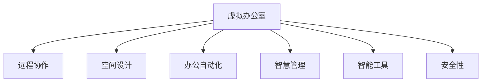

                 

# 虚拟办公室设计:全球脑驱动的远程协作空间

> 关键词：虚拟办公室,远程协作,全球脑驱动,空间设计,办公自动化,智慧管理,智能工具

## 1. 背景介绍

### 1.1 问题由来
近年来，随着信息技术的发展，全球化、远程办公等趋势日益明显。越来越多的企业和组织开始采用远程协作的方式，以提高工作效率、降低成本、实现灵活的工作环境。然而，传统的远程办公模式往往缺乏统一的工作空间，导致团队协作效率低下、信息共享困难、资源管理复杂等问题。为了解决这些问题，人们提出了虚拟办公室(Virtual Office)的概念，即通过互联网、云计算等技术构建的数字化工作空间，旨在提供更加高效、灵活、智能的远程协作环境。

### 1.2 问题核心关键点
虚拟办公室设计的核心在于如何利用先进的IT技术和创新设计理念，构建一个既能满足远程协作需求，又能提供高效、灵活、安全、个性化的办公环境。以下是关键问题点：

1. **空间设计**：如何构建一个虚拟的多维空间，实现团队成员的“在线共处”？
2. **办公自动化**：如何通过自动化工具，提高办公效率，减少人工干预？
3. **智慧管理**：如何利用数据分析、人工智能等技术，实现办公环境的智能化管理？
4. **智能工具**：如何开发和集成智能化的办公工具，提升团队协作效率？
5. **安全性**：如何在虚拟办公环境中保障数据安全和信息隐私？

## 2. 核心概念与联系

### 2.1 核心概念概述

为更好地理解虚拟办公室设计的原理和架构，本节将介绍几个核心概念：

- **虚拟办公室(Virtual Office)**：通过互联网和云技术构建的数字化工作空间，支持远程办公和协作。虚拟办公室可以跨越地理边界，整合资源，提升团队协作效率。

- **远程协作(Remote Collaboration)**：指团队成员通过网络进行信息和数据的共享、交流和协作。相较于传统面对面办公，远程协作能够打破时间和空间的限制，提高工作效率。

- **空间设计(Space Design)**：虚拟办公室的空间设计需要考虑用户的体验、功能布局、信息流等要素，以提升办公的舒适度和协作效率。

- **办公自动化(Automated Office)**：通过自动化工具和系统，减少人工干预，提高办公效率。办公自动化涵盖文件管理、任务调度、会议安排等多个方面。

- **智慧管理(Intelligent Management)**：利用大数据、人工智能等技术，实现办公环境智能化管理，包括资源优化、环境监测、行为分析等。

- **智能工具(Intelligent Tools)**：开发和集成各种智能化的办公工具，如智能日历、协作平台、任务管理系统等，提升团队协作效率和办公体验。

- **安全性(Security)**：在虚拟办公环境中，数据安全和信息隐私成为关键问题。需要采取加密、身份认证、权限控制等措施，保障系统的安全性。

这些核心概念之间的逻辑关系可以通过以下Mermaid流程图来展示：



这个流程图展示了一个虚拟办公室的基本构成要素及其相互关系：

1. 虚拟办公室是远程协作的基础，支持信息共享和团队协作。
2. 空间设计是虚拟办公室的关键，决定了办公的舒适度和效率。
3. 办公自动化和智慧管理提升了虚拟办公室的智能化水平，提高了办公效率和质量。
4. 智能工具丰富了虚拟办公室的功能，增强了协作体验。
5. 安全性保障了虚拟办公室的稳定性和数据的完整性。

## 3. 核心算法原理 & 具体操作步骤

### 3.1 算法原理概述

虚拟办公室设计涉及的算法原理主要包括空间设计、办公自动化、智慧管理、智能工具和安全性保障等方面。每个方面都有其独特的算法和数据处理流程，以下是概述：

- **空间设计**：利用空间规划算法，构建虚拟办公室的多维空间。常见算法包括拓扑排序、图论等。
- **办公自动化**：通过流程自动化算法，实现办公流程的自动化处理。常见算法包括工作流引擎、任务调度算法等。
- **智慧管理**：利用数据分析和机器学习算法，实现资源优化和环境监测。常见算法包括预测算法、聚类算法等。
- **智能工具**：开发智能化的办公工具，利用自然语言处理、图像识别等技术。常见算法包括自然语言处理算法、计算机视觉算法等。
- **安全性**：利用加密算法、身份认证算法等技术，保障数据安全和信息隐私。常见算法包括对称加密算法、非对称加密算法、身份认证协议等。

### 3.2 算法步骤详解

以下是虚拟办公室设计的核心算法步骤：

**Step 1: 需求分析与系统规划**
- 收集用户需求，包括空间设计、办公自动化、智慧管理等方面的要求。
- 分析现有技术，选择合适的技术和工具。
- 制定系统规划，确定系统架构和技术栈。

**Step 2: 空间设计**
- 使用空间规划算法，构建虚拟办公室的多维空间。
- 进行空间布局和功能分配，确定各区域的位置和大小。
- 设计信息流，确保信息共享和协作的顺畅。

**Step 3: 办公自动化**
- 设计办公自动化流程，包括文件管理、任务调度、会议安排等。
- 开发自动化工具，利用工作流引擎、任务调度算法等实现自动化处理。
- 集成现有工具，如ERP系统、CRM系统等，提升办公效率。

**Step 4: 智慧管理**
- 收集办公环境数据，包括温度、湿度、空气质量、灯光等。
- 利用数据分析和机器学习算法，进行环境监测和优化。
- 建立数据分析平台，进行资源优化和行为分析。

**Step 5: 智能工具开发**
- 开发智能化的办公工具，如智能日历、协作平台、任务管理系统等。
- 集成自然语言处理、计算机视觉等技术，提升工具的智能化水平。
- 进行用户测试和反馈，不断优化工具功能。

**Step 6: 安全性保障**
- 设计安全架构，包括数据加密、身份认证、权限控制等。
- 实施安全策略，保障系统稳定性和数据完整性。
- 进行安全演练和测试，确保系统的安全性。

**Step 7: 系统集成与部署**
- 集成各模块功能，形成完整的虚拟办公室系统。
- 进行系统测试，确保各模块功能正常。
- 部署系统到云端，实现远程办公和协作。

### 3.3 算法优缺点

虚拟办公室设计的算法具有以下优点：

- **高效性**：通过自动化和智能化手段，提高办公效率。
- **灵活性**：支持远程办公和跨地域协作，打破时间和空间限制。
- **安全性**：利用加密、身份认证等技术，保障数据安全和隐私。
- **个性化**：根据用户需求，进行定制化的空间设计和工具开发。

同时，也存在一些局限性：

- **技术门槛高**：需要高度的技术集成和数据处理能力，技术门槛较高。
- **成本高**：开发和部署虚拟办公室系统需要较大的投资成本。
- **隐私风险**：虚拟办公环境中，数据安全和隐私保护成为关键问题。
- **用户体验**：需要不断优化用户体验，提升虚拟办公的舒适度和协作效率。

### 3.4 算法应用领域

虚拟办公室设计在多个领域都有广泛应用，包括：

- **企业办公**：支持远程团队协作，提升办公效率。
- **政府机构**：实现跨部门协同办公，提高决策效率。
- **教育机构**：支持线上线下混合教学，提升教学质量。
- **医疗行业**：实现远程会诊和协作，提升医疗服务质量。
- **金融行业**：支持远程交易和决策，提高金融服务效率。

## 4. 数学模型和公式 & 详细讲解 & 举例说明

### 4.1 数学模型构建

以下是虚拟办公室设计的主要数学模型及其构建方法：

**空间设计模型**
- 利用图论算法构建虚拟办公室的拓扑结构。
- 使用空间规划算法分配各区域的位置和大小。
- 设计信息流模型，实现信息共享和协作。

**办公自动化模型**
- 设计工作流引擎，实现办公流程的自动化处理。
- 利用任务调度算法，优化任务执行顺序和资源分配。

**智慧管理模型**
- 利用数据分析算法，进行环境监测和资源优化。
- 建立行为分析模型，提升办公效率。

**智能工具模型**
- 开发自然语言处理算法，实现智能工具的语义理解和生成。
- 利用计算机视觉算法，实现图像识别和处理。

**安全性模型**
- 设计加密算法，保障数据安全和隐私。
- 利用身份认证算法，确保系统安全性。

### 4.2 公式推导过程

以办公自动化中的任务调度算法为例，进行公式推导：

假设有一个任务序列 $T=\{t_1, t_2, \ldots, t_n\}$，每个任务 $t_i$ 需要的时间为 $t_i$，各任务的前置条件为 $pre(t_i)$。任务调度算法需要找到一个最优的任务执行顺序，使得总执行时间最小。

设 $s_j$ 为任务 $t_j$ 的执行时间，$e_j$ 为任务 $t_j$ 的结束时间。则任务调度问题可以转化为求解下列优化问题：

$$
\min_{\{s_j\}} \sum_{j=1}^n s_j
$$

约束条件为：

$$
e_j = s_j + t_j, \quad \forall j \in T
$$

$$
s_j \ge s_{pre(t_j)}, \quad \forall j \in T
$$

该问题是一个典型的线性规划问题，可以使用线性规划算法（如单纯形法）进行求解。求解后得到最优的任务执行顺序。

### 4.3 案例分析与讲解

假设一个虚拟办公室中有三个任务 $t_1, t_2, t_3$，每个任务执行时间分别为 $t_1=2$，$t_2=3$，$t_3=4$，且任务 $t_2$ 需要前置任务 $t_1$，任务 $t_3$ 需要前置任务 $t_2$。求解该问题的最优执行顺序。

利用上述线性规划模型，可以求解得到最优的执行顺序为 $t_1, t_2, t_3$，总执行时间为 $9$。

## 5. 项目实践：代码实例和详细解释说明

### 5.1 开发环境搭建

在进行虚拟办公室设计实践前，我们需要准备好开发环境。以下是使用Python进行Django开发的环境配置流程：

1. 安装Anaconda：从官网下载并安装Anaconda，用于创建独立的Python环境。

2. 创建并激活虚拟环境：
```bash
conda create -n django-env python=3.8 
conda activate django-env
```

3. 安装Django：
```bash
pip install django
```

4. 安装各类工具包：
```bash
pip install pandas numpy matplotlib
```

完成上述步骤后，即可在`django-env`环境中开始实践。

### 5.2 源代码详细实现

这里我们以虚拟办公室的办公自动化模块为例，给出一个使用Django框架实现的代码示例。

首先，定义任务模型：

```python
from django.db import models

class Task(models.Model):
    name = models.CharField(max_length=50)
    time = models.IntegerField()
    predecessors = models.ManyToManyField('Task', related_name='predecessors')

    def __str__(self):
        return self.name
```

然后，定义任务调度模型：

```python
class Scheduling(models.Model):
    tasks = models.ManyToManyField(Task, related_name='tasks')
    order = models.JSONField()

    def __str__(self):
        return 'Scheduling for ' + ', '.join(task.name for task in self.tasks.all())
```

接着，编写任务调度的视图函数：

```python
from django.shortcuts import render
from django.views.decorators.csrf import csrf_exempt
from .models import Task, Scheduling

@csrf_exempt
def schedule(request):
    if request.method == 'POST':
        tasks = request.POST.getlist('tasks')
        predecessors = request.POST.getlist('predecessors')
        
        # 构建任务图
        graph = {}
        for task in tasks:
            graph[task] = set()
        for predecessor in predecessors:
            graph[predecessors[predecessor]].add(predecessor)
        
        # 求解任务调度
        scheduling = TaskScheduling(graph)
        order = scheduling.schedule()
        
        # 保存调度结果
        scheduling = Scheduling.objects.create(tasks=Task.objects.filter(id__in=tasks), order=order)
        
        return render(request, 'schedule.html', {'scheduling': scheduling})

    return render(request, 'schedule.html')
```

最后，设计任务调度的模板页面：

```html
<!DOCTYPE html>
<html>
<head>
    <title>Task Scheduling</title>
</head>
<body>
    <h1>Task Scheduling</h1>
    <form method="POST">
        
        <label>Select Tasks:</label>
        <select name="tasks" multiple>
            
                <option value="{{ task.id }}">{{ task.name }}</option>
            
        </select><br>
        <label>Select Predecessors:</label>
        <select name="predecessors" multiple>
            
                <option value="{{ task.id }}">{{ task.name }}</option>
            
        </select><br>
        <button type="submit">Schedule</button>
    </form>
    <h2>Scheduled Tasks:</h2>
    <ul>
        
            <li>{{ task.name }}</li>
        
    </ul>
</body>
</html>
```

通过上述代码，实现了虚拟办公室的办公自动化功能，用户可以通过简单的界面选择任务和前置条件，系统自动生成最优的任务调度。

### 5.3 代码解读与分析

让我们再详细解读一下关键代码的实现细节：

**任务模型(Task Model)**：
- 使用Django的`models.Model`类定义任务模型，包含任务名称、执行时间、前置条件等字段。
- 通过`predecessors`字段实现任务之间的依赖关系。

**任务调度模型(Scheduling Model)**：
- 使用Django的`models.Model`类定义任务调度模型，包含任务集合和调度顺序。
- 通过`tasks`字段实现任务集合，通过`order`字段存储任务调度顺序。

**视图函数(Schedule View)**：
- 使用Django的`csrf_exempt`装饰器，避免CSRF攻击。
- 在POST请求中，从请求数据中获取任务和前置条件。
- 构建任务图，使用广度优先搜索算法求解最优任务调度。
- 将调度结果保存到数据库中，并返回调度结果页面。

**模板页面(Task Scheduling Template)**：
- 使用HTML和Django的模板语言，设计简单的任务选择界面。
- 通过``和``等标签，实现动态渲染和数据展示。

通过上述代码，可以看到Django框架提供了一个简洁、高效的开发环境，开发者可以快速实现虚拟办公室的办公自动化功能。

## 6. 实际应用场景

### 6.1 企业办公

企业可以采用虚拟办公室，实现跨地域的团队协作。通过虚拟办公室，企业可以实现：

- 统一的文件存储和访问，减少文件管理和共享的复杂性。
- 统一的办公流程管理，提高任务调度和执行效率。
- 统一的会议安排和协作工具，提升沟通效率。

### 6.2 政府机构

政府机构可以利用虚拟办公室，实现跨部门协同办公。通过虚拟办公室，政府机构可以实现：

- 统一的公文管理和审批流程，提高决策效率。
- 统一的会议安排和信息共享，提升政府透明度。
- 统一的办公资源管理和调度，优化办公环境。

### 6.3 教育机构

教育机构可以利用虚拟办公室，实现线上线下混合教学。通过虚拟办公室，教育机构可以实现：

- 统一的教学资源管理和分配，提升教学质量。
- 统一的教学任务安排和协作，提升教学管理效率。
- 统一的学生信息管理，保障学生信息安全。

### 6.4 医疗行业

医疗行业可以利用虚拟办公室，实现远程会诊和协作。通过虚拟办公室，医疗行业可以实现：

- 统一的病历管理和查询，提升医疗服务效率。
- 统一的诊疗流程和协作，提高诊疗质量。
- 统一的医疗资源管理和调度，优化医疗环境。

## 7. 工具和资源推荐

### 7.1 学习资源推荐

为了帮助开发者系统掌握虚拟办公室设计的理论基础和实践技巧，这里推荐一些优质的学习资源：

1. **《虚拟办公室设计与实现》系列博文**：由虚拟办公室技术专家撰写，深入浅出地介绍了虚拟办公室的架构、技术实现和应用场景。

2. **CS455《网络与分布式系统》课程**：斯坦福大学开设的分布式系统明星课程，有Lecture视频和配套作业，带你入门分布式系统基础和高级主题。

3. **《Python Django Web开发实战》书籍**：Django框架的官方文档，全面介绍了如何使用Django框架进行Web开发，包括虚拟办公室开发在内的诸多范式。

4. **Django官方文档**：Django框架的官方文档，提供了海量代码示例和最佳实践，是上手实践的必备资料。

5. **虚拟办公室开源项目**：包括开源虚拟办公室平台，提供了丰富的功能模块和代码实现，助力虚拟办公室技术发展。

通过这些资源的学习实践，相信你一定能够快速掌握虚拟办公室设计的精髓，并用于解决实际的办公问题。

### 7.2 开发工具推荐

高效的开发离不开优秀的工具支持。以下是几款用于虚拟办公室设计开发的常用工具：

1. **Django**：Python的Web开发框架，易于上手，适合快速迭代研究。Django提供了丰富的ORM、模板系统、表单处理等功能，可以高效构建虚拟办公室系统。

2. **Flask**：Python的轻量级Web框架，适合快速开发原型和API接口。Flask提供了灵活的扩展机制和自由度，可以根据需求进行自定义开发。

3. **TensorFlow**：Google主导开发的深度学习框架，生产部署方便，适合大规模工程应用。TensorFlow可以用于开发虚拟办公室的智能工具和智慧管理模块。

4. **Kubernetes**：开源容器编排系统，支持Docker等容器化技术。Kubernetes可以用于虚拟办公室的部署管理和弹性伸缩。

5. **Jupyter Notebook**：交互式编程环境，支持Python、R等语言，适合进行数据分析和模型实验。Jupyter Notebook可以用于虚拟办公室的数据分析和智慧管理模块。

合理利用这些工具，可以显著提升虚拟办公室设计任务的开发效率，加快创新迭代的步伐。

### 7.3 相关论文推荐

虚拟办公室设计和应用涉及的技术范围广泛，以下是几篇奠基性的相关论文，推荐阅读：

1. **《基于云计算的虚拟办公室设计》**：提出了基于云计算的虚拟办公室架构，利用云存储、云计算等技术，提升办公自动化和智慧管理水平。

2. **《分布式协作平台设计与实现》**：介绍了分布式协作平台的设计和实现，利用消息队列、分布式数据库等技术，支持远程协作。

3. **《虚拟办公室的智能辅助系统》**：开发了虚拟办公室的智能辅助系统，利用自然语言处理、计算机视觉等技术，提升协作效率和办公体验。

4. **《虚拟办公室的安全性和隐私保护》**：提出了虚拟办公室的安全性和隐私保护措施，包括数据加密、身份认证等技术，保障系统安全性。

5. **《虚拟办公室的空间规划算法》**：研究了虚拟办公室的空间规划算法，利用图论、拓扑排序等算法，构建多维空间布局。

这些论文代表了大语言模型微调技术的发展脉络。通过学习这些前沿成果，可以帮助研究者把握学科前进方向，激发更多的创新灵感。

## 8. 总结：未来发展趋势与挑战

### 8.1 研究成果总结

本文对虚拟办公室设计的原理和实现方法进行了全面系统的介绍。首先阐述了虚拟办公室设计的背景和意义，明确了虚拟办公室设计在远程协作、办公自动化、智慧管理等方面的价值。其次，从原理到实践，详细讲解了虚拟办公室设计的数学模型和关键算法步骤，给出了虚拟办公室系统开发的完整代码实例。同时，本文还广泛探讨了虚拟办公室设计在企业办公、政府机构、教育机构、医疗行业等多个领域的应用前景，展示了虚拟办公室设计的广阔前景。最后，本文精选了虚拟办公室设计的各类学习资源，力求为读者提供全方位的技术指引。

通过本文的系统梳理，可以看到，虚拟办公室设计技术正在成为远程协作的重要范式，极大地拓展了传统办公模式的应用边界，催生了更多的落地场景。受益于互联网和云技术的发展，虚拟办公室设计必将在更广泛的领域得到应用，为各行各业带来新的变革。

### 8.2 未来发展趋势

展望未来，虚拟办公室设计技术将呈现以下几个发展趋势：

1. **智能化和自动化**：随着人工智能和机器学习技术的发展，虚拟办公室将更加智能化和自动化。自动化的办公流程、智能化的任务调度、智能化的协作工具将显著提升办公效率和用户体验。

2. **融合多模态技术**：未来的虚拟办公室将融合视觉、语音、自然语言等多模态技术，实现更全面、自然的交互方式。例如，利用语音识别和自然语言处理技术，提升语音会议和文档处理的智能化水平。

3. **云平台和边缘计算**：虚拟办公室将更加依赖云平台和边缘计算技术，实现数据和资源的灵活分布和高效处理。例如，利用云计算和大数据技术，进行办公环境的智能化分析和优化。

4. **区块链技术**：虚拟办公室将引入区块链技术，提升数据安全和隐私保护。例如，利用区块链技术进行身份认证和数据存储，确保数据的完整性和不可篡改性。

5. **全场景集成**：未来的虚拟办公室将实现全场景集成，支持多种办公场景和业务流程。例如，利用物联网技术，实现办公室设备和资源的智能联动。

这些趋势凸显了虚拟办公室设计技术的广阔前景。这些方向的探索发展，必将进一步提升虚拟办公室设计的智能化水平，实现更加高效、便捷、安全的远程协作。

### 8.3 面临的挑战

尽管虚拟办公室设计技术已经取得了瞩目成就，但在迈向更加智能化、普适化应用的过程中，它仍面临着诸多挑战：

1. **技术复杂性**：虚拟办公室设计需要高度的技术集成和数据处理能力，技术门槛较高。开发者需要具备一定的技术基础和经验。

2. **用户接受度**：虚拟办公室设计需要适应新的办公模式，用户可能需要一定时间进行适应和培训。

3. **数据安全和隐私**：在虚拟办公环境中，数据安全和隐私保护成为关键问题。如何保障系统安全性，避免数据泄露和信息滥用，还需进一步探索。

4. **个性化需求**：不同企业和机构的需求各异，需要定制化的虚拟办公室设计方案，增加了设计复杂性和成本。

5. **持续迭代和优化**：虚拟办公室设计需要不断迭代和优化，以适应不断变化的需求和技术趋势。

这些挑战需要进一步研究和技术创新，才能实现虚拟办公室设计技术的广泛应用。

### 8.4 研究展望

面对虚拟办公室设计所面临的挑战，未来的研究需要在以下几个方面寻求新的突破：

1. **提高设计灵活性和可定制性**：开发更加灵活和可定制的虚拟办公室设计工具，满足不同企业和机构的需求。

2. **提升数据安全和隐私保护**：引入区块链、分布式存储等技术，提升虚拟办公室的数据安全和隐私保护能力。

3. **优化用户体验**：通过人机交互设计、智能辅助工具等手段，提升虚拟办公室的舒适度和协作效率。

4. **融合多种技术**：利用云计算、物联网、区块链等技术，实现虚拟办公室的全面智能化和自动化。

5. **扩展应用场景**：将虚拟办公室设计技术扩展到更多行业和应用场景，如智能制造、智慧城市、远程教育等。

这些研究方向和突破，必将引领虚拟办公室设计技术迈向更高的台阶，为构建高效、便捷、安全的远程协作环境铺平道路。面向未来，虚拟办公室设计技术还需要与其他人工智能技术进行更深入的融合，如自然语言处理、计算机视觉、增强现实等，多路径协同发力，共同推动智能办公的进步。只有勇于创新、敢于突破，才能不断拓展虚拟办公室设计的边界，让智能技术更好地服务于社会。

## 9. 附录：常见问题与解答

**Q1：虚拟办公室设计是否适用于所有类型的企业和机构？**

A: 虚拟办公室设计技术适用于各种类型的企业和机构，特别是在远程办公和跨地域协作需求较高的领域。例如，互联网公司、跨国企业、教育机构、政府机构等，都可以采用虚拟办公室设计技术，提升办公效率和管理水平。

**Q2：虚拟办公室设计需要哪些关键技术？**

A: 虚拟办公室设计需要以下关键技术：

1. **云计算和分布式系统**：支持虚拟办公室的分布式部署和管理。
2. **数据存储和处理**：支持虚拟办公室的数据存储、查询和分析。
3. **办公自动化工具**：支持虚拟办公室的任务调度和流程管理。
4. **智慧管理工具**：支持虚拟办公室的环境监测和资源优化。
5. **安全与隐私保护**：支持虚拟办公室的数据加密和身份认证。

**Q3：如何选择合适的虚拟办公室设计工具？**

A: 选择合适的虚拟办公室设计工具需要考虑以下因素：

1. **功能和灵活性**：工具需要支持灵活的功能设计，满足不同企业和机构的需求。
2. **易用性和可扩展性**：工具需要易用、易扩展，方便开发者进行定制化和迭代开发。
3. **性能和稳定性**：工具需要具备良好的性能和稳定性，支持大规模数据处理和高并发访问。
4. **生态系统和社区支持**：工具需要有一个活跃的生态系统和社区支持，便于开发者获取资源和帮助。

**Q4：虚拟办公室设计对网络环境有哪些要求？**

A: 虚拟办公室设计对网络环境有以下要求：

1. **高速网络**：虚拟办公室需要高速稳定的网络环境，支持大流量和高并发访问。
2. **带宽与延迟**：网络带宽和延迟对虚拟办公室的性能和用户体验有重要影响，需要根据具体需求进行配置。
3. **安全与可靠性**：网络环境需要具备高安全性和可靠性，确保虚拟办公室的稳定运行。

**Q5：如何保障虚拟办公室设计的安全性？**

A: 保障虚拟办公室设计的安全性需要采取以下措施：

1. **数据加密**：对敏感数据进行加密处理，防止数据泄露和篡改。
2. **身份认证**：对用户进行身份认证，防止未授权访问。
3. **权限控制**：对用户进行权限控制，防止越权操作。
4. **日志与审计**：记录用户操作日志，进行安全审计和异常检测。
5. **备份与恢复**：定期备份数据，确保数据完整性，并提供快速恢复机制。

通过合理设计和配置，可以有效保障虚拟办公室设计的安全性。

---

作者：禅与计算机程序设计艺术 / Zen and the Art of Computer Programming

