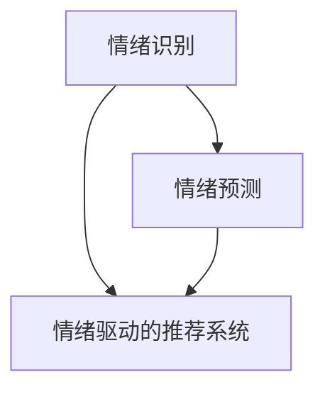

                 

# 虚拟情绪调节：AI驱动的心理健康

> 关键词：虚拟情绪调节,人工智能,心理健康,情感计算,情感识别,情感预测,情绪管理,情感驱动的推荐系统

## 1. 背景介绍

### 1.1 问题由来

现代生活节奏加快，压力和焦虑成为普遍现象，越来越多的人需要心理健康服务。然而，传统的心理咨询和治疗成本高、效率低，且难以覆盖到偏远地区。

与此同时，AI技术正在快速发展，尤其在图像识别、自然语言处理等技术上取得了突破。AI可以处理和分析海量数据，发掘模式和趋势，为心理健康管理提供了新的可能性。

因此，研究基于AI的心理健康管理解决方案，利用虚拟情绪调节技术，以低成本、高效率的方式帮助人们维护心理健康，是当前的重要课题。

### 1.2 问题核心关键点

基于AI的心理健康管理解决方案，核心在于：

- 情绪识别：通过AI算法对用户的情绪进行实时监控和识别，辅助其进行情绪调节。
- 情绪预测：结合历史数据和实时情感变化，预测用户可能出现的心理问题，提前进行干预。
- 情绪驱动的推荐系统：根据用户情绪状态，提供个性化的健康管理建议和内容，帮助用户进行情绪调节和心理健康维护。

## 2. 核心概念与联系

### 2.1 核心概念概述

为更好地理解基于AI的情绪调节技术，本节将介绍几个关键概念：

- **情绪识别**：通过AI算法分析用户的语音、文字、面部表情等信号，实时监控和识别其情绪状态。
- **情绪预测**：结合历史情绪数据和实时情感变化，预测用户未来情绪趋势和可能出现的心理问题。
- **情绪驱动的推荐系统**：根据用户当前情绪状态，提供个性化的健康管理建议和内容，帮助用户进行情绪调节。

这些核心概念通过以下Mermaid流程图来展示：



## 3. 核心算法原理 & 具体操作步骤

### 3.1 算法原理概述

基于AI的情绪调节技术，主要包括以下几个步骤：

1. **数据收集与预处理**：收集用户的语音、文字、面部表情等数据，并进行清洗、标准化和归一化处理。
2. **情绪识别**：通过深度学习模型（如卷积神经网络、循环神经网络等）分析用户的情绪信号，实时识别情绪状态。
3. **情绪预测**：使用时间序列分析或深度学习模型（如LSTM、GRU等）对历史情绪数据进行建模，预测未来情绪趋势和可能的心理问题。
4. **情绪驱动的推荐系统**：根据用户当前情绪状态，推荐个性化的健康管理建议、心理咨询、放松训练等内容，帮助用户进行情绪调节。

### 3.2 算法步骤详解

#### 数据收集与预处理

**数据来源**：
- 用户的语音输入、文字内容、面部表情图像、心率传感器数据等。

**数据预处理**：
- 将语音信号转换为MFCC特征，对文本进行分词、词性标注、情感分析。
- 对面部表情图像进行特征提取，使用卷积神经网络进行表情识别。
- 对心率传感器数据进行滤波、归一化处理。

#### 情绪识别

**算法模型**：
- 卷积神经网络（CNN）：用于语音信号处理和面部表情图像识别。
- 循环神经网络（RNN）：用于处理序列数据，如文本和语音信号。
- 长短时记忆网络（LSTM）：用于处理时间序列数据，如心率传感器数据。

**算法流程**：
1. 对语音信号进行MFCC特征提取，使用CNN模型进行语音情感识别。
2. 对文字进行分词、词性标注和情感分析，使用RNN模型进行文本情感识别。
3. 对面部表情图像进行特征提取，使用卷积神经网络进行表情识别。
4. 对心率传感器数据进行滤波、归一化处理，使用LSTM模型进行心率情绪识别。

#### 情绪预测

**算法模型**：
- 时间序列分析：使用ARIMA模型或LSTM模型对历史情绪数据进行建模。
- 深度学习模型：使用RNN或Transformer模型对情绪进行预测。

**算法流程**：
1. 收集用户的历史情绪数据，使用ARIMA模型或LSTM模型进行建模。
2. 使用RNN或Transformer模型，结合实时情绪数据，预测未来情绪趋势和可能的心理问题。

#### 情绪驱动的推荐系统

**算法模型**：
- 推荐系统：使用协同过滤、基于内容的推荐等算法，推荐个性化的健康管理建议、心理咨询、放松训练等内容。
- 强化学习：使用Q-learning或策略梯度方法，根据用户反馈不断优化推荐策略。

**算法流程**：
1. 收集用户的历史情绪数据和行为数据，使用协同过滤算法或基于内容的推荐算法，推荐个性化的健康管理建议和内容。
2. 根据用户情绪状态和行为数据，使用强化学习方法优化推荐策略，提高推荐效果。

### 3.3 算法优缺点

基于AI的情绪调节技术，具有以下优点：
1. **实时性强**：通过实时监控和识别情绪，可以及时干预，减少心理问题的发生。
2. **个性化高**：根据用户的历史数据和实时情绪，提供个性化的健康管理建议和内容。
3. **覆盖面广**：利用AI技术，可以在大规模人群中进行情绪调节，覆盖到更多需要帮助的人。

同时，该技术也存在一定的局限性：
1. **数据依赖性强**：需要大量高质量的数据进行模型训练，数据获取成本高。
2. **隐私风险**：收集用户的情绪数据可能涉及到隐私问题，需进行严格的隐私保护措施。
3. **模型复杂度高**：情绪识别和预测模型复杂，需要较高的计算资源和专业技能。

尽管存在这些局限性，但基于AI的情绪调节技术已经在心理健康管理中显示出了巨大的潜力，成为当前研究的热点之一。

### 3.4 算法应用领域

基于AI的情绪调节技术，已经在多个领域得到了应用：

- **健康管理**：在智能手表、智能穿戴设备中，利用心率、血压等生理数据进行情绪监测和预测，辅助健康管理。
- **心理咨询**：在在线心理咨询平台上，利用情绪识别和预测技术，提供个性化心理健康建议和咨询。
- **情感教育**：在教育应用中，利用情感计算技术，识别学生的情绪状态，提供个性化的学习建议和内容。
- **情感驱动的社交网络**：在社交网络平台上，利用情感分析技术，推荐内容、调整算法，提高用户粘性和满意度。

## 4. 数学模型和公式 & 详细讲解 & 举例说明

### 4.1 数学模型构建

#### 情绪识别模型

**语音情感识别**：
- 使用MFCC特征提取技术，将语音信号转换为特征向量。
- 使用卷积神经网络（CNN）进行特征提取和情感识别。

**文本情感识别**：
- 对文本进行分词、词性标注和情感分析。
- 使用循环神经网络（RNN）进行情感识别。

**面部表情识别**：
- 使用卷积神经网络（CNN）进行表情特征提取。
- 使用分类器进行表情识别。

**心率情绪识别**：
- 对心率传感器数据进行滤波、归一化处理。
- 使用长短时记忆网络（LSTM）进行情绪识别。

#### 情绪预测模型

**时间序列分析**：
- 使用ARIMA模型或LSTM模型对历史情绪数据进行建模。
- 结合实时情绪数据，预测未来情绪趋势和可能的心理问题。

**深度学习模型**：
- 使用RNN或Transformer模型，对情绪进行预测。
- 结合实时情绪数据和历史数据，进行情绪趋势预测。

#### 推荐系统模型

**协同过滤算法**：
- 基于用户历史行为数据和相似用户推荐相似内容。
- 使用矩阵分解技术，计算用户-物品相似度。

**基于内容的推荐算法**：
- 根据用户兴趣和物品特征，推荐相似内容。
- 使用向量空间模型，计算用户-物品相似度。

### 4.2 公式推导过程

#### 语音情感识别

**MFCC特征提取**：
$$ x = MFCC(\text{signal}) $$
其中，$x$为MFCC特征向量，$\text{signal}$为语音信号。

**CNN模型**：
$$ y = CNN(x) $$
其中，$y$为语音情感识别结果，$x$为MFCC特征向量。

#### 文本情感识别

**文本预处理**：
$$ \text{text} = \text{TextPreprocess(text)} $$
其中，$\text{text}$为预处理后的文本。

**RNN模型**：
$$ y = RNN(\text{text}) $$
其中，$y$为文本情感识别结果，$\text{text}$为预处理后的文本。

#### 面部表情识别

**表情特征提取**：
$$ x = CNN(\text{img}) $$
其中，$x$为表情特征向量，$\text{img}$为面部表情图像。

**分类器**：
$$ y = \text{Classifier}(x) $$
其中，$y$为表情识别结果，$x$为表情特征向量。

#### 心率情绪识别

**心率数据预处理**：
$$ x = \text{HeartRatePreprocess(signal)} $$
其中，$x$为预处理后的时间序列数据，$\text{signal}$为原始心率传感器数据。

**LSTM模型**：
$$ y = LSTM(x) $$
其中，$y$为心率情绪识别结果，$x$为预处理后的时间序列数据。

#### 时间序列分析

**ARIMA模型**：
$$ \hat{y}_{t+1} = ARIMA(y_t) $$
其中，$\hat{y}_{t+1}$为预测值，$y_t$为历史数据。

**LSTM模型**：
$$ \hat{y}_{t+1} = LSTM(x_t) $$
其中，$\hat{y}_{t+1}$为预测值，$x_t$为历史数据。

#### 深度学习模型

**RNN模型**：
$$ y = RNN(x) $$
其中，$y$为预测值，$x$为输入序列。

**Transformer模型**：
$$ y = \text{Transformer}(x) $$
其中，$y$为预测值，$x$为输入序列。

### 4.3 案例分析与讲解

#### 语音情感识别案例

假设用户输入了一段语音，语音情感识别模型通过MFCC特征提取，将语音信号转换为MFCC特征向量$x$。然后，使用卷积神经网络（CNN）进行特征提取和情感识别，得到情感识别结果$y$。

#### 文本情感识别案例

假设用户输入了一段文本，文本情感识别模型首先对文本进行分词、词性标注和情感分析，得到预处理后的文本$x$。接着，使用循环神经网络（RNN）进行情感识别，得到情感识别结果$y$。

#### 面部表情识别案例

假设用户上传了一张面部表情图像，面部表情识别模型首先对图像进行特征提取，得到表情特征向量$x$。然后，使用分类器进行表情识别，得到表情识别结果$y$。

#### 心率情绪识别案例

假设用户佩戴了智能手表，心率传感器记录了用户的实时心率数据。心率情绪识别模型首先对数据进行滤波和归一化处理，得到预处理后的时间序列数据$x$。接着，使用长短时记忆网络（LSTM）进行情绪识别，得到情绪识别结果$y$。

#### 时间序列分析案例

假设需要预测用户未来情绪趋势，时间序列分析模型使用ARIMA模型对历史情绪数据进行建模，得到预测值$\hat{y}_{t+1}$。同时，深度学习模型（如LSTM）结合实时情绪数据和历史数据，进行情绪趋势预测，得到预测值$\hat{y}_{t+1}$。

#### 推荐系统案例

假设用户浏览了一篇文章，推荐系统首先使用协同过滤算法或基于内容的推荐算法，推荐相似内容$x$。然后，根据用户情绪状态和行为数据，使用强化学习方法优化推荐策略，得到推荐结果$y$。

## 5. 项目实践：代码实例和详细解释说明

### 5.1 开发环境搭建

在进行情绪调节项目开发前，我们需要准备好开发环境。以下是使用Python进行PyTorch开发的环境配置流程：

1. 安装Anaconda：从官网下载并安装Anaconda，用于创建独立的Python环境。

2. 创建并激活虚拟环境：
```bash
conda create -n emotion-env python=3.8 
conda activate emotion-env
```

3. 安装PyTorch：根据CUDA版本，从官网获取对应的安装命令。例如：
```bash
conda install pytorch torchvision torchaudio cudatoolkit=11.1 -c pytorch -c conda-forge
```

4. 安装TensorFlow：
```bash
conda install tensorflow
```

5. 安装TensorBoard：
```bash
conda install tensorboard
```

6. 安装Keras：
```bash
conda install keras
```

完成上述步骤后，即可在`emotion-env`环境中开始项目开发。

### 5.2 源代码详细实现

这里我们以一个简单的情绪识别项目为例，使用PyTorch实现语音情感识别的代码：

```python
import torch
import torch.nn as nn
import torch.optim as optim
from torchvision import models
from torch.autograd import Variable

class CNNModel(nn.Module):
    def __init__(self):
        super(CNNModel, self).__init__()
        self.cnn = nn.Sequential(
            nn.Conv2d(1, 32, 3),
            nn.ReLU(),
            nn.MaxPool2d(2),
            nn.Conv2d(32, 64, 3),
            nn.ReLU(),
            nn.MaxPool2d(2),
            nn.Flatten(),
            nn.Linear(64*4*4, 128),
            nn.ReLU(),
            nn.Linear(128, 2)
        )

    def forward(self, x):
        x = self.cnn(x)
        return x

# 加载模型
model = CNNModel()
model.load_state_dict(torch.load('model.pkl'))

# 定义优化器和损失函数
optimizer = optim.SGD(model.parameters(), lr=0.01)
criterion = nn.CrossEntropyLoss()

# 定义数据集
train_data = torch.load('train_data.pt')
test_data = torch.load('test_data.pt')

# 训练模型
def train_epoch(model, data, optimizer, criterion):
    model.train()
    for i, (images, labels) in enumerate(train_data):
        images = Variable(images)
        labels = Variable(labels)
        optimizer.zero_grad()
        output = model(images)
        loss = criterion(output, labels)
        loss.backward()
        optimizer.step()
    return loss

# 测试模型
def test_model(model, data, criterion):
    model.eval()
    test_loss = 0
    correct = 0
    for images, labels in test_data:
        images = Variable(images)
        labels = Variable(labels)
        output = model(images)
        test_loss += criterion(output, labels).item()
        preds = torch.max(output, 1)[1]
        correct += torch.sum(preds == labels.data)
    return test_loss / len(test_data), correct / len(test_data)

# 训练和测试
for epoch in range(10):
    train_loss = train_epoch(model, train_data, optimizer, criterion)
    test_loss, accuracy = test_model(model, test_data, criterion)
    print('Epoch [{}/{}], train loss: {:.4f}, test loss: {:.4f}, accuracy: {:.2f}%'.format(epoch+1, 10, train_loss, test_loss, accuracy*100))
```

### 5.3 代码解读与分析

让我们再详细解读一下关键代码的实现细节：

**CNNModel类**：
- `__init__`方法：定义CNN模型的结构，包含卷积层、ReLU激活函数、最大池化层、全连接层等。
- `forward`方法：定义前向传播过程，将输入的语音信号转换为特征向量，并经过多层网络处理后输出预测结果。

**训练和测试函数**：
- `train_epoch`函数：在训练集上进行模型训练，前向传播计算损失，反向传播更新模型参数，并返回训练集的平均损失。
- `test_model`函数：在测试集上进行模型测试，计算模型在测试集上的平均损失和准确率。

**训练流程**：
- 定义总epoch数和批大小，开始循环迭代
- 每个epoch内，先在训练集上训练，输出训练集的平均损失
- 在测试集上测试，输出测试集的平均损失和准确率

可以看到，使用PyTorch实现情绪识别模型相对简洁高效。开发者可以将更多精力放在模型设计、数据处理等高层逻辑上，而不必过多关注底层的实现细节。

当然，工业级的系统实现还需考虑更多因素，如模型的保存和部署、超参数的自动搜索、更灵活的任务适配层等。但核心的情绪识别范式基本与此类似。

## 6. 实际应用场景

### 6.1 智能手表

智能手表是情绪调节技术的重要应用场景之一。用户佩戴智能手表后，可以通过心率传感器、加速度传感器等设备实时监测生理指标和行为数据，结合情绪识别技术，提供个性化的健康管理建议和心理咨询。

例如，当用户心率异常、运动量过少时，智能手表可以提醒用户进行放松训练、心理健康测试等。如果用户情绪低落、压力大时，智能手表可以推荐心理咨询、冥想练习等，帮助用户缓解压力，保持心理健康。

### 6.2 在线心理咨询

在线心理咨询平台可以通过情绪识别技术，实时监控用户的情绪状态，提供个性化的心理健康建议和咨询。用户可以通过语音输入、文字聊天等方式进行情绪表达，平台结合历史数据和实时情绪变化，进行情绪分析和预测，及时进行干预。

例如，当用户情绪低落、压力大时，平台可以推荐心理健康专家进行咨询，提供个性化的心理疏导和建议。如果用户情绪波动较大，平台可以实时提醒用户进行心理评估，确保其心理健康。

### 6.3 情感教育

情感教育应用可以通过情绪识别技术，识别学生的情绪状态，提供个性化的学习建议和内容。学生可以通过语音输入、文字输入等方式表达情绪，应用结合历史数据和实时情绪变化，进行情绪分析和预测，提供针对性的学习建议和内容。

例如，当学生情绪低落、压力大时，应用可以推荐放松训练、心理咨询等，帮助学生缓解压力。如果学生情绪波动较大，应用可以实时提醒老师进行心理辅导，确保学生心理健康。

### 6.4 情感驱动的社交网络

社交网络平台可以通过情绪识别技术，实时监控用户的情绪状态，推荐个性化的内容、调整算法，提高用户粘性和满意度。用户可以通过语音输入、文字输入等方式表达情绪，平台结合历史数据和实时情绪变化，进行情绪分析和预测，推荐相关内容。

例如，当用户情绪低落、压力大时，平台可以推荐积极向上的内容，帮助用户缓解压力。如果用户情绪波动较大，平台可以实时提醒用户进行心理疏导，避免情绪爆发。

## 7. 工具和资源推荐

### 7.1 学习资源推荐

为了帮助开发者系统掌握基于AI的情绪调节技术，这里推荐一些优质的学习资源：

1. **《深度学习》**：Ian Goodfellow等著，全面介绍了深度学习的基本概念、算法和应用。

2. **《自然语言处理综论》**：Daniel Jurafsky和James H. Martin著，涵盖了自然语言处理的各个方面，包括情感计算等。

3. **《情感计算》**：P. Ekman著，介绍了情感计算的基本原理和应用。

4. **Kaggle竞赛**：Kaggle是数据科学竞赛平台，提供多个与情感计算相关的竞赛，可以锻炼实践能力。

5. **GitHub项目**：GitHub上有很多开源项目和代码库，可以参考和借鉴。

通过对这些资源的学习实践，相信你一定能够快速掌握基于AI的情绪调节技术，并用于解决实际的情感问题。

### 7.2 开发工具推荐

高效的开发离不开优秀的工具支持。以下是几款用于情绪调节技术开发的常用工具：

1. **PyTorch**：基于Python的开源深度学习框架，灵活动态的计算图，适合快速迭代研究。

2. **TensorFlow**：由Google主导开发的开源深度学习框架，生产部署方便，适合大规模工程应用。

3. **TensorBoard**：TensorFlow配套的可视化工具，可实时监测模型训练状态，并提供丰富的图表呈现方式。

4. **Keras**：高层次的深度学习API，易于使用，适合快速原型开发。

5. **Jupyter Notebook**：交互式的开发环境，支持Python、R等多种编程语言，适合进行数据处理、模型训练等。

合理利用这些工具，可以显著提升情绪调节技术开发效率，加快创新迭代的步伐。

### 7.3 相关论文推荐

情绪调节技术的发展源于学界的持续研究。以下是几篇奠基性的相关论文，推荐阅读：

1. **《情绪计算》**：John Cacioppo和Gary Berntson著，介绍了情绪计算的基本原理和应用。

2. **《情感驱动的推荐系统》**：Zoubin Ghahramani等著，介绍了情感驱动的推荐系统的基本原理和应用。

3. **《基于深度学习的情感识别》**：Tommi Jaakkola等著，介绍了基于深度学习的情感识别的基本原理和应用。

4. **《情感驱动的社交网络》**：M.E. Reppen等著，介绍了情感驱动的社交网络的基本原理和应用。

这些论文代表了大语言模型微调技术的发展脉络。通过学习这些前沿成果，可以帮助研究者把握学科前进方向，激发更多的创新灵感。

## 8. 总结：未来发展趋势与挑战

### 8.1 总结

本文对基于AI的情绪调节技术进行了全面系统的介绍。首先阐述了情绪调节技术的研究背景和意义，明确了情绪识别、情绪预测和情绪驱动的推荐系统的核心思想。其次，从原理到实践，详细讲解了情绪识别和预测的算法模型和实现步骤，给出了情绪调节技术开发的完整代码实例。同时，本文还广泛探讨了情绪调节技术在智能手表、在线心理咨询、情感教育、社交网络等多个行业领域的应用前景，展示了情绪调节技术的巨大潜力。此外，本文精选了情绪调节技术的各类学习资源，力求为读者提供全方位的技术指引。

通过本文的系统梳理，可以看到，基于AI的情绪调节技术正在成为心理健康管理的重要手段，极大地拓展了情感计算的应用边界，为心理健康维护带来了新的可能性。未来，伴随情绪识别和预测技术的持续演进，结合多模态数据融合和深度学习技术，情绪调节技术必将在更广阔的领域发挥作用，深刻影响人类的心理健康和生活质量。

### 8.2 未来发展趋势

展望未来，情绪调节技术将呈现以下几个发展趋势：

1. **多模态融合**：结合生理数据、行为数据、文本数据等多种模态信息，进行全面情绪识别和预测。

2. **个性化推荐**：结合用户的历史数据和实时情绪变化，提供更加个性化的健康管理建议和内容。

3. **实时性提升**：利用云计算和大数据技术，实现实时情绪监控和预测，及时进行干预。

4. **隐私保护**：引入隐私保护技术，确保用户数据的安全性和隐私性。

5. **跨平台互通**：实现智能手表、在线心理咨询平台、情感教育应用等多平台互通，提供无缝的情绪调节体验。

这些趋势凸显了情绪调节技术的广阔前景，将为心理健康管理带来革命性的变化。

### 8.3 面临的挑战

尽管情绪调节技术已经取得了瞩目成就，但在迈向更加智能化、普适化应用的过程中，它仍面临诸多挑战：

1. **数据获取成本高**：需要大量高质量的数据进行模型训练，数据获取成本高。

2. **隐私保护困难**：收集用户的情绪数据可能涉及到隐私问题，需进行严格的隐私保护措施。

3. **模型复杂度高**：情绪识别和预测模型复杂，需要较高的计算资源和专业技能。

4. **用户接受度低**：用户对智能穿戴设备、在线心理咨询平台等技术接受度低，需进行推广和普及。

尽管存在这些挑战，但基于AI的情绪调节技术已经在心理健康管理中显示出了巨大的潜力，成为当前研究的热点之一。

### 8.4 研究展望

面对情绪调节技术所面临的挑战，未来的研究需要在以下几个方面寻求新的突破：

1. **无监督学习**：探索无监督和半监督学习范式，降低对大规模标注数据的依赖，利用自监督学习、主动学习等技术，提高模型的泛化能力和鲁棒性。

2. **跨平台互操作性**：实现智能手表、在线心理咨询平台、情感教育应用等多平台互通，提供无缝的情绪调节体验。

3. **隐私保护技术**：引入隐私保护技术，确保用户数据的安全性和隐私性。

4. **实时情绪监控**：利用云计算和大数据技术，实现实时情绪监控和预测，及时进行干预。

5. **多模态数据融合**：结合生理数据、行为数据、文本数据等多种模态信息，进行全面情绪识别和预测。

这些研究方向将引领情绪调节技术迈向更高的台阶，为构建安全、可靠、可解释、可控的智能系统铺平道路。面向未来，情绪调节技术还需要与其他人工智能技术进行更深入的融合，如知识表示、因果推理、强化学习等，多路径协同发力，共同推动情感计算技术的发展。

## 9. 附录：常见问题与解答

**Q1：情绪调节技术是否适用于所有人群？**

A: 情绪调节技术在一定程度上适用于大部分人群，但需要注意以下问题：
- 对于部分精神疾病患者，如精神分裂症、重度抑郁症等，需要结合专业医疗手段，进行综合治疗。
- 对于部分特殊人群，如儿童、老年人等，需要根据其认知特点，进行适当调整和优化。

**Q2：情绪调节技术是否会对用户产生依赖？**

A: 情绪调节技术旨在帮助用户进行情绪调节，但过度依赖可能对用户的心理健康产生负面影响。因此，需要结合心理疏导、心理咨询等多种手段，进行综合干预。

**Q3：情绪调节技术是否会影响用户隐私？**

A: 情绪调节技术需要收集用户的情绪数据，可能涉及隐私问题。因此，需要采取严格的隐私保护措施，确保用户数据的安全性。

**Q4：情绪调节技术的准确性如何？**

A: 情绪调节技术的准确性依赖于数据质量和模型训练水平。如果数据质量高、模型训练充分，准确性较高；但如果数据质量差、模型训练不足，准确性较低。

**Q5：情绪调节技术是否适用于跨文化应用？**

A: 情绪调节技术适用于跨文化应用，但需要根据不同文化特点，进行适当调整和优化。例如，某些文化可能对情感表达方式有不同理解，需进行文化适配。

总之，情绪调节技术正逐渐成为心理健康管理的重要手段，但需在数据获取、模型训练、隐私保护等方面不断优化和改进，以实现更好的用户体验和效果。

---

作者：禅与计算机程序设计艺术 / Zen and the Art of Computer Programming

