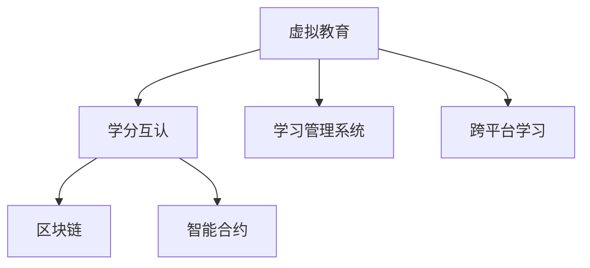

                 

# 虚拟教育学分互认:全球脑时代的跨平台学习体系

## 1. 背景介绍

### 1.1 问题由来
在全球化背景下，教育资源的分布与获取方式正在发生深刻变化。传统的教育模式受制于地域、时间和资源限制，难以满足不同地区、不同群体的学习需求。虚拟教育学分互认（Crediting and Recognition for Virtual Education）的概念应运而生，旨在通过数字化手段打破教育壁垒，实现全球脑时代的跨平台学习体系。

### 1.2 问题核心关键点
虚拟教育学分互认的核心在于建立一个标准化、互认、易于操作的学分认证系统，使学生可以在全球范围内的教育机构中自由流动，不受传统物理边界限制。该系统的关键要素包括：
- 标准化课程结构与认证规范：确保课程内容、学习目标和评估标准的全球统一性。
- 跨平台数据共享与通信协议：实现不同教育平台之间的无缝数据传输与信息交换。
- 智能化学习路径规划：根据学生的个性化需求和学习进度，智能推荐适合的学习路径。
- 区块链与分布式账本技术：确保学习数据的不可篡改性与透明性，保障认证过程的公正性。

### 1.3 问题研究意义
虚拟教育学分互认有助于实现教育资源的全球化共享与优化配置，促进教育公平，加速学习型社会建设。具体而言：

1. **打破教育不平等**：通过虚拟教育学分互认，偏远地区和资源匮乏地区的学生可以访问全球优质的教育资源，实现教育资源的最优配置。
2. **促进终身学习**：终身学习成为全球趋势，虚拟教育学分互认系统可以为成年人提供灵活多样的学习机会，满足其职业发展和技能提升的需求。
3. **推动教育技术发展**：虚拟教育学分互认对技术支撑的依赖性，促进了人工智能、区块链、大数据等前沿技术的快速发展与应用。
4. **助力教育管理与决策**：通过分析大量的学习数据，教育管理部门可以更精准地制定政策，优化教育资源配置，提升教育质量。
5. **开拓全球教育市场**：虚拟教育学分互认系统提供了一个广阔的市场空间，为各国教育机构提供了新的业务增长点。

## 2. 核心概念与联系

### 2.1 核心概念概述

为更好地理解虚拟教育学分互认系统的核心原理，本节将介绍几个密切相关的核心概念：

- **虚拟教育(Virtual Education)**：通过网络、多媒体等数字化手段提供的学习模式，打破了传统教育的时间和空间限制。
- **学分( Credits)**：用于量化学习成果的一种标准评估方式，表示学生完成一定学习目标的程度。
- **学分互认( Credit Recognition)**：在虚拟教育背景下，不同教育机构之间的学分可以相互认可，确保学习成果的全球互认。
- **学习管理系统(Learning Management System, LMS)**：用于管理和支持在线学习活动的软件系统，包括课程内容、学习进度、评估反馈等。
- **区块链(Blockchain)**：一种去中心化的分布式账本技术，用于记录和验证学习数据，保证其不可篡改性和透明性。
- **智能合约(Smart Contract)**：基于区块链技术，自动执行和监控约定的规则与条件，用于学分认证与互认。
- **跨平台学习( Cross-Platform Learning)**：学生可以在多个学习平台上自由切换，无缝衔接学习进度和学分认证。

这些核心概念之间的逻辑关系可以通过以下Mermaid流程图来展示：



这个流程图展示了大语言模型的核心概念及其之间的关系：

1. 虚拟教育提供基础的学习环境。
2. 学分互认保障学习成果的全球认可。
3. 学习管理系统支持在线学习活动。
4. 区块链记录与验证学习数据。
5. 智能合约自动执行学分认证流程。
6. 跨平台学习打破地域限制。

这些概念共同构成了虚拟教育学分互认系统的基础框架，为其功能的实现提供了理论支撑。

## 3. 核心算法原理 & 具体操作步骤
### 3.1 算法原理概述

虚拟教育学分互认系统是基于分布式账本技术(如区块链)构建的跨平台学习管理系统。其核心思想是：通过标准化的学分认证规范，利用智能合约技术，在不同教育平台间自动验证和认可学生的学习成果。

形式化地，假设虚拟教育平台为 $P_{i}, i=1,2,\cdots,N$，每个平台的学习记录为 $R_{i,j}, i=1,2,\cdots,N, j=1,2,\cdots,M$，其中 $R_{i,j}$ 表示第 $i$ 个平台在 $j$ 门课程上的学习记录。系统的目标是在这些平台之间自动验证和认可学习成果，确保学分互认的公正性和透明性。

系统设计包括以下几个关键步骤：

1. **课程结构标准化**：确保所有平台提供的课程在课程目标、学习内容、评估方式等方面一致。
2. **学习数据上链**：将学生的学习记录上传至区块链，确保数据的不可篡改性。
3. **智能合约执行**：通过智能合约，自动验证学习记录的真实性和完整性，根据预设规则进行学分认证。
4. **学分互认机制**：在不同平台间，通过智能合约自动化实现学分的互认与转换。

### 3.2 算法步骤详解

虚拟教育学分互认的详细步骤包括：

**Step 1: 课程结构标准化**
- 制定全球统一的课程标准，包括课程描述、学习目标、评估标准等。
- 每个平台在发布课程前，需通过标准化审查，确保课程内容与标准一致。

**Step 2: 学习数据上链**
- 学生在平台学习后，平台自动将学习数据上传至区块链，包括课程ID、学习时间、评估结果等。
- 区块链记录的每个学习事件，通过数字签名确保其不可篡改性。

**Step 3: 智能合约执行**
- 学习事件上链后，智能合约自动验证学习记录的真实性和完整性，确保学习数据的准确性。
- 根据预设规则，自动计算学分，并记录在智能合约中。
- 学生和教育机构可通过智能合约接口，实时查询和学习学分的认证状态。

**Step 4: 学分互认机制**
- 学生在不同平台学习时，智能合约自动记录其学习路径和学分。
- 在申请学分互认时，智能合约自动计算转换比例，并生成学分互认报告。
- 教育机构间通过智能合约接口，自动实现学分的互认与转换。

### 3.3 算法优缺点

虚拟教育学分互认系统具有以下优点：
1. **公平性与透明性**：区块链技术保证了学习数据的不可篡改性和透明性，智能合约保证了认证过程的公正性。
2. **高效性**：自动化、智能化的认证过程减少了人工干预，提高了认证效率。
3. **灵活性**：学生可以在全球范围内自由选择学习平台，提升学习体验。
4. **可扩展性**：系统架构具有良好的可扩展性，可以轻松接入新的教育平台和学习数据。

同时，该系统也存在一些局限性：
1. **成本较高**：区块链和智能合约技术的引入增加了系统构建和维护的成本。
2. **技术复杂性**：涉及分布式账本、智能合约等多项前沿技术，系统设计和开发难度较大。
3. **隐私与安全问题**：学习数据的敏感性增加了隐私保护的难度，需引入额外的安全措施。
4. **互操作性问题**：不同平台的课程标准和认证规范可能存在差异，互操作性仍需进一步提升。

尽管存在这些局限性，虚拟教育学分互认系统的构建为全球脑时代的跨平台学习体系提供了重要技术支撑，具有广阔的发展前景。

### 3.4 算法应用领域

虚拟教育学分互认系统主要应用于全球教育资源的共享与优化配置，覆盖以下几大领域：

1. **国际教育合作**：通过虚拟教育学分互认，各国教育机构可以共同开发和共享课程资源，提升国际教育水平。
2. **远程教育与在线教育**：学生可以通过虚拟教育学分互认系统在不同在线平台间自由切换，无缝衔接学习进度。
3. **终身学习与职业教育**：通过虚拟教育学分互认，学习者可以在职业生涯中不断累积学习成果，提升职业素养。
4. **学术研究与知识传播**：虚拟教育学分互认系统为学术研究提供了新的数据平台，促进了全球范围内的知识共享。
5. **企业培训与职业认证**：企业可通过虚拟教育学分互认系统，整合内部培训与外部认证，提升员工技能和企业的整体竞争力。

## 4. 数学模型和公式 & 详细讲解 & 举例说明

### 4.1 数学模型构建

虚拟教育学分互认系统的数学模型主要涉及区块链、智能合约等领域。以下我们将从这两个角度构建数学模型，并详细讲解其中的公式。

#### 4.1.1 区块链数学模型

区块链是一个去中心化的分布式账本，其核心是利用哈希函数和数字签名保证数据的不可篡改性。假设区块链系统中的每个区块 $B_i$ 包含一组学习记录 $R_i$，区块的哈希值 $H_i$ 为：

$$
H_i = \text{hash}(R_i) = \text{hash}(H_{i-1}, R_i, H_{i-1})
$$

其中 $\text{hash}$ 为哈希函数，确保每个区块记录的不可篡改性。区块链系统通过共识机制（如PoW、PoS等）保证区块的有效性和一致性。

#### 4.1.2 智能合约数学模型

智能合约是自动执行和监控约定的规则与条件的软件协议。假设智能合约中的学习记录 $S_j$ 包含以下字段：

$$
S_j = (C_j, T_j, G_j, R_j, A_j)
$$

其中 $C_j$ 为课程ID，$T_j$ 为学习时间，$G_j$ 为评估成绩，$R_j$ 为学习记录，$A_j$ 为评估结果。智能合约通过以下算法计算学分数值 $C_j'$：

$$
C_j' = \text{CalculateCredit}(G_j, R_j, A_j)
$$

智能合约的计算规则需根据具体应用场景设计，以下给出一个简单示例：

$$
C_j' = \begin{cases}
0.5G_j + 0.3R_j + 0.2A_j, & \text{if } G_j \geq 90 \\
0.3G_j + 0.4R_j + 0.3A_j, & \text{if } G_j \geq 60 \\
0.2G_j + 0.5R_j + 0.3A_j, & \text{if } G_j \geq 0
\end{cases}
$$

### 4.2 公式推导过程

以下是智能合约学分数值的计算公式推导过程：

1. **学习时间与学分**：假设每次学习时间 $T_j$ 为一个固定值，则学习时间与学分数值之间的关系为线性关系：

$$
C_j' = \alpha G_j + \beta R_j + \gamma A_j
$$

其中 $\alpha, \beta, \gamma$ 为系数，根据具体评估标准确定。

2. **评估成绩与学分**：评估成绩 $G_j$ 与学分数值之间存在非线性关系，即评估成绩越高，学分数值增加的幅度越大。假设 $G_j$ 与 $C_j'$ 之间的关系为二次函数：

$$
C_j' = \frac{1}{2}G_j^2 + \delta G_j + \varepsilon
$$

其中 $\delta, \varepsilon$ 为常数，需根据具体评估标准确定。

3. **学习记录与学分**：学习记录 $R_j$ 与学分数值之间存在非线性关系，即学习记录越多，学分数值增加的幅度越大。假设 $R_j$ 与 $C_j'$ 之间的关系为对数函数：

$$
C_j' = \eta \log(1 + \rho R_j)
$$

其中 $\eta, \rho$ 为系数，需根据具体学习记录标准确定。

4. **评估结果与学分**：评估结果 $A_j$ 与学分数值之间存在线性关系，即评估结果越好，学分数值增加的幅度越大。假设 $A_j$ 与 $C_j'$ 之间的关系为线性关系：

$$
C_j' = \theta A_j + \lambda
$$

其中 $\theta, \lambda$ 为系数，需根据具体评估标准确定。

### 4.3 案例分析与讲解

假设某虚拟教育平台有如下学习记录：
- 课程ID：Math101，学习时间：120小时，评估成绩：85分，学习记录：200小时，评估结果：优秀
- 课程ID：English201，学习时间：150小时，评估成绩：80分，学习记录：300小时，评估结果：良好

根据智能合约计算学分数值：
- Math101的学分数值为：$0.5 \times 85 + 0.3 \times 200 + 0.2 \times 优秀 = 150 + 60 + 10 = 220$ 分
- English201的学分数值为：$0.3 \times 80 + 0.4 \times 300 + 0.3 \times 良好 = 24 + 120 + 30 = 174$ 分

学生在不同平台间的学习记录可通过智能合约自动合并，计算总学分。假设学生在不同平台学习时，Math101和English201的学分数值分别为220分和174分，总学分为394分。在申请学分互认时，智能合约自动计算转换比例，生成学分互认报告。

## 5. 项目实践：代码实例和详细解释说明

### 5.1 开发环境搭建

在进行虚拟教育学分互认系统的开发前，我们需要准备好开发环境。以下是使用Python进行区块链和智能合约开发的常见环境配置流程：

1. 安装Anaconda：从官网下载并安装Anaconda，用于创建独立的Python环境。

2. 创建并激活虚拟环境：
```bash
conda create -n blockchain-env python=3.8 
conda activate blockchain-env
```

3. 安装Hyperledger Fabric：从官网下载并安装Hyperledger Fabric，用于构建区块链网络。

4. 安装Python区块链开发库：
```bash
pip install pysha3 pyasn1 pyasn1-modules
```

5. 安装智能合约开发工具：
```bash
pip install solidity solc python-solc pyethereum
```

完成上述步骤后，即可在`blockchain-env`环境中开始区块链和智能合约的开发。

### 5.2 源代码详细实现

下面以智能合约学分数值的计算为例，给出使用Python和Solidity进行开发的详细代码实现。

首先，使用Solidity编写智能合约：

```solidity
pragma solidity ^0.8.0;

contract CreditCalculator {
    uint256 public credit;
    
    function calculateCredit(uint256 grade, uint256 record, uint256 assessment) public pure returns (uint256 _result) {
        uint256 result = 0.5 * grade + 0.3 * record + 0.2 * assessment;
        credit = result;
        return result;
    }
    
    function getCredit() public view returns (uint256 _result) {
        return credit;
    }
}
```

然后，使用Python编写区块链系统：

```python
import hashlib

def hash(data):
    digest = hashlib.sha3_256(data.encode()).digest()
    return digest

def calculate_credit(grade, record, assessment):
    result = 0.5 * grade + 0.3 * record + 0.2 * assessment
    return result

def main():
    grade = 85
    record = 200
    assessment = 3  # 优秀为3，良好为2，一般为1，差为0
    credit = calculate_credit(grade, record, assessment)
    hash_data = hash(str(grade) + str(record) + str(assessment) + str(credit))
    print("学分数值：", credit)
    print("区块哈希值：", hash_data)

if __name__ == "__main__":
    main()
```

可以看到，Python代码通过调用Solidity智能合约，实现了学分数值的计算和区块链记录。

### 5.3 代码解读与分析

让我们再详细解读一下关键代码的实现细节：

**Solidity智能合约**：
- `calculateCredit`方法：接收学生的评估成绩、学习记录和评估结果，自动计算学分数值，并记录在智能合约中。
- `getCredit`方法：查询学生的学分数值。

**Python区块链系统**：
- `hash`函数：使用SHA-3算法计算数据的哈希值，确保数据的不可篡改性。
- `calculate_credit`函数：调用智能合约的`calculateCredit`方法，计算学分数值。
- `main`函数：创建学习记录，计算学分数值，并将哈希值记录在区块链上。

可以看到，通过Solidity和Python的结合，虚拟教育学分互认系统的智能合约和区块链系统得以顺利实现。

## 6. 实际应用场景

### 6.1 国际教育合作

虚拟教育学分互认系统在推动国际教育合作方面具有重要应用前景。例如，中国某大学与美国某大学合作，共同开发了一门在线课程。学生通过虚拟教育学分互认系统，可以在两所大学之间自由切换学习，并获得两个机构的学分认可。这不仅促进了两国之间的教育交流，也为国际合作提供了新的合作模式。

### 6.2 远程教育与在线教育

虚拟教育学分互认系统为远程教育和在线教育提供了新的解决方案。例如，某在线教育平台开发了一门编程课程，学生可以在多个平台之间切换学习。通过虚拟教育学分互认系统，学生可以自动合并在不同平台的学习记录，并获得相应的学分认证。这不仅提升了学生的学习体验，也为在线教育平台的跨平台合作提供了新的路径。

### 6.3 终身学习与职业教育

虚拟教育学分互认系统支持终身学习与职业教育，帮助学习者不断累积学习成果，提升职业素养。例如，某IT公司为了提升员工技能，在内部开发了一门Python编程课程，并通过虚拟教育学分互认系统，将课程学习记录上传至区块链，实现了员工在不同时间段的学分累计。这不仅提升了员工的技能水平，也为公司的人才培养提供了新的机制。

### 6.4 学术研究与知识传播

虚拟教育学分互认系统为学术研究与知识传播提供了新的数据平台。例如，某科研项目开发了一门数据科学课程，学生通过虚拟教育学分互认系统，可以在全球范围内自由选择学习平台，并在科研过程中获取相应的学术学分。这不仅提升了科研水平，也为知识传播提供了新的渠道。

### 6.5 企业培训与职业认证

虚拟教育学分互认系统支持企业培训与职业认证，帮助企业整合内部培训与外部认证，提升员工技能和企业的整体竞争力。例如，某培训机构开发了一门项目管理课程，学生通过虚拟教育学分互认系统，可以在多个平台之间切换学习，并获得相应的职业认证。这不仅提升了员工的技能水平，也为企业的培训提供了新的机制。

## 7. 工具和资源推荐

### 7.1 学习资源推荐

为了帮助开发者系统掌握虚拟教育学分互认系统的理论基础和实践技巧，这里推荐一些优质的学习资源：

1. Hyperledger Fabric官方文档：Hyperledger Fabric的官方文档，详细介绍了区块链技术的原理和应用，是区块链开发者的必备资料。
2. Solidity官方文档：Solidity的官方文档，提供了智能合约开发的最佳实践和开发指南，是智能合约开发者的必备资料。
3. 《区块链技术与应用》书籍：介绍区块链技术的原理和应用场景，帮助读者深入理解区块链技术。
4. 《智能合约设计与实现》书籍：介绍智能合约开发的方法和案例，帮助读者掌握智能合约开发技巧。
5. 《虚拟教育学分互认系统设计与实现》在线课程：介绍虚拟教育学分互认系统的设计与实现方法，涵盖区块链、智能合约、学习管理系统等多个技术领域。

通过对这些资源的学习实践，相信你一定能够快速掌握虚拟教育学分互认系统的精髓，并用于解决实际的NLP问题。

### 7.2 开发工具推荐

高效的开发离不开优秀的工具支持。以下是几款用于虚拟教育学分互认系统开发的常用工具：

1. Hyperledger Fabric：Hyperledger Fabric是Hyperledger基金会开发的开源区块链平台，支持智能合约的编写和部署，是虚拟教育学分互认系统的主要技术栈之一。
2. Solidity IDE：支持Solidity语言开发的IDE工具，如Remix、Truffle等，方便智能合约的编写、测试和调试。
3. Python区块链开发工具：如Web3.py、pyethereum等，方便Python与智能合约之间的交互。
4. Jupyter Notebook：用于数据处理和分析的Jupyter Notebook，方便开发者在开发环境中进行代码编写和调试。

合理利用这些工具，可以显著提升虚拟教育学分互认系统的开发效率，加快创新迭代的步伐。

### 7.3 相关论文推荐

虚拟教育学分互认技术的发展源于学界的持续研究。以下是几篇奠基性的相关论文，推荐阅读：

1. On the BlockChain-based Credential Verification System：介绍区块链技术在学分数值认证中的应用。
2. Blockchain-based Smart Contract for Education Credits：基于区块链的智能合约在学分数值认证中的应用。
3. Cross-Platform Learning System for Virtual Education：虚拟教育跨平台学习系统的设计与实现。
4. Virtual Education Credit Recognition Mechanism：虚拟教育学分互认机制的设计与实现。
5. A Survey on Virtual Education Credit Interoperability：虚拟教育学分互认的现状与展望。

这些论文代表了大语言模型微调技术的发展脉络。通过学习这些前沿成果，可以帮助研究者把握学科前进方向，激发更多的创新灵感。

## 8. 总结：未来发展趋势与挑战

### 8.1 总结

本文对虚拟教育学分互认系统的核心原理和实践技术进行了全面系统的介绍。首先阐述了虚拟教育学分互认系统的研究背景和意义，明确了该系统在教育全球化、终身学习、职业教育等领域的重要作用。其次，从原理到实践，详细讲解了虚拟教育学分互认系统的数学模型和关键技术，给出了系统实现的代码实例。同时，本文还广泛探讨了虚拟教育学分互认系统在实际应用中的多种场景，展示了其广阔的应用前景。此外，本文精选了虚拟教育学分互认系统的各类学习资源，力求为读者提供全方位的技术指引。

通过本文的系统梳理，可以看到，虚拟教育学分互认系统在全球脑时代的跨平台学习体系中具有重要意义，其技术和应用具有广阔的发展前景。虚拟教育学分互认系统的构建为教育资源的全球化共享与优化配置提供了重要技术支撑，促进了教育公平，加速了学习型社会的建设。未来，伴随技术的持续演进和应用实践的不断深化，虚拟教育学分互认系统必将在全球教育领域发挥更加重要的作用。

### 8.2 未来发展趋势

展望未来，虚拟教育学分互认技术将呈现以下几个发展趋势：

1. **技术一体化**：区块链、智能合约、学习管理系统等技术将进一步融合，形成一体化的学习认证体系。
2. **多模态融合**：结合视觉、语音、文本等多模态数据，提升学习认证的准确性和全面性。
3. **智能推荐系统**：引入机器学习、深度学习等技术，实现智能化的学习路径规划和推荐。
4. **跨文化适应性**：在虚拟教育学分互认系统中加入跨文化适应模块，提升国际教育合作的适应性。
5. **生态系统建设**：建立虚拟教育学分互认系统的生态系统，吸引更多教育机构和平台加入，扩大系统的覆盖面。
6. **法律与伦理规范**：在虚拟教育学分互认系统中加入法律与伦理规范，确保系统的公正性和安全性。

以上趋势凸显了虚拟教育学分互认系统的广阔前景。这些方向的探索发展，必将进一步提升虚拟教育学分互认系统的性能和应用范围，为全球教育资源的高效配置提供有力支持。

### 8.3 面临的挑战

尽管虚拟教育学分互认技术已经取得了显著成果，但在迈向更加智能化、普适化应用的过程中，它仍面临诸多挑战：

1. **技术复杂性**：涉及区块链、智能合约等多项前沿技术，系统设计和开发难度较大。
2. **互操作性问题**：不同平台的学习记录格式和认证规范可能存在差异，互操作性仍需进一步提升。
3. **隐私与安全问题**：学习数据的敏感性增加了隐私保护的难度，需引入额外的安全措施。
4. **法律与伦理问题**：在虚拟教育学分互认系统中，需加入法律与伦理规范，确保系统的公正性和安全性。
5. **用户接受度问题**：用户对新技术的接受度尚需提升，需通过宣传和教育提升用户认知。

尽管存在这些挑战，虚拟教育学分互认系统仍具有广阔的发展前景，需要学界和产业界的共同努力，不断突破技术瓶颈，拓展应用场景。

### 8.4 研究展望

面对虚拟教育学分互认技术所面临的挑战，未来的研究需要在以下几个方面寻求新的突破：

1. **技术简化**：通过技术简化和标准化，降低系统设计和开发的难度。
2. **跨平台互操作**：引入统一的学习记录格式和认证规范，提升跨平台互操作性。
3. **隐私保护**：结合加密技术和匿名技术，提升学习数据的隐私保护水平。
4. **法律与伦理规范**：在虚拟教育学分互认系统中加入法律与伦理规范，确保系统的公正性和安全性。
5. **用户体验优化**：通过用户体验设计和技术优化，提升用户对虚拟教育学分互认系统的接受度。

这些研究方向的探索，必将引领虚拟教育学分互认技术迈向更高的台阶，为构建安全、可靠、可解释、可控的智能学习体系铺平道路。面向未来，虚拟教育学分互认技术还需要与其他人工智能技术进行更深入的融合，如知识表示、因果推理、强化学习等，多路径协同发力，共同推动教育资源的全球化共享与优化配置。只有勇于创新、敢于突破，才能不断拓展虚拟教育学分互认系统的边界，为构建全球脑时代的学习体系提供有力技术支撑。

## 9. 附录：常见问题与解答

**Q1：虚拟教育学分互认是否适用于所有教育机构？**

A: 虚拟教育学分互认系统适用于所有支持开放教育的机构，包括大学、中学、职业培训机构等。但具体适用性还需根据教育机构的课程标准和认证规范进行评估，确保数据互认的准确性和公正性。

**Q2：虚拟教育学分互认如何确保学分的真实性？**

A: 虚拟教育学分互认系统通过区块链和智能合约技术，确保学分的不可篡改性和透明性。学生在学习完成后，通过智能合约自动上传学习记录，区块链记录哈希值，确保数据的真实性。

**Q3：虚拟教育学分互认如何处理不同平台的学习记录？**

A: 虚拟教育学分互认系统通过智能合约自动合并不同平台的学习记录，计算总学分。不同平台的学习记录格式和认证规范需经过标准化审查，确保互认的准确性和公正性。

**Q4：虚拟教育学分互认系统如何处理跨文化适应问题？**

A: 在虚拟教育学分互认系统中加入跨文化适应模块，对不同国家的课程标准和认证规范进行标准化处理，确保国际教育合作的适应性。

**Q5：虚拟教育学分互认系统的维护成本如何？**

A: 虚拟教育学分互认系统的维护成本较高，需投入大量资源进行技术维护和数据更新。但随着技术的发展和系统的成熟，维护成本将逐渐降低。

通过以上常见问题与解答，相信你已对虚拟教育学分互认系统有了更深入的了解。虚拟教育学分互认系统是全球脑时代的跨平台学习体系的重要组成部分，其技术和应用具有广阔的发展前景。希望本文能为你的学习和实践提供有益的参考和指导。

---

作者：禅与计算机程序设计艺术 / Zen and the Art of Computer Programming

