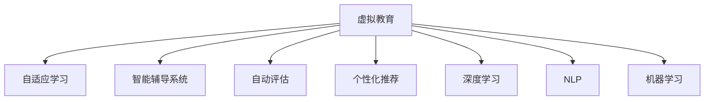

                 

# 虚拟教育：AI重塑学习体验

> 关键词：虚拟教育,人工智能,个性化学习,智能辅导系统,自适应学习,自动评估,自然语言处理,机器学习

## 1. 背景介绍

随着数字技术的飞速发展，传统的教育模式正面临前所未有的变革。虚拟教育（Virtual Education），即通过互联网、移动设备等数字化手段，为学习者提供在线学习、远程互动、智能辅导等功能，正逐渐成为现代教育的重要组成部分。AI技术的应用，尤其是深度学习、自然语言处理和机器学习等领域的最新进展，为虚拟教育带来了新的发展机遇和挑战。

### 1.1 问题由来

传统的教育模式往往以教师为中心，依赖面对面的授课和互动。然而，随着全球化、城市化进程的加快，教育资源的分配不均和优质教师短缺问题愈发凸显。虚拟教育能够打破时间和空间的限制，提供灵活、便捷的学习方式，满足更多学习者的需求。此外，AI技术能够根据学生的学习行为和反馈，提供个性化、智能化的辅导，提升学习效果。

### 1.2 问题核心关键点

虚拟教育的核心关键点在于如何通过AI技术，构建一个高效、个性化的学习环境。主要包括以下几个方面：

- **自适应学习**：根据学生的学习进度、兴趣和能力，动态调整学习内容和难度，提供个性化的学习体验。
- **智能辅导系统**：利用自然语言处理和机器学习，对学生的提问进行即时回答和解析，辅助学生解决学习中的疑难问题。
- **自动评估**：通过AI技术自动评估学生的作业、考试和测试成绩，提供及时的反馈和建议，帮助学生改进学习方法。
- **个性化推荐**：根据学生的学习行为和兴趣，推荐适合的学习资源和课程，提升学习效率和兴趣。

### 1.3 问题研究意义

研究虚拟教育中的AI技术，对于推动教育公平、提升教育质量、加速教育信息化进程具有重要意义：

1. **推动教育公平**：通过虚拟教育，可以将优质的教育资源扩展到偏远和欠发达地区，缩小教育资源的不平衡。
2. **提升教育质量**：AI技术能够提供个性化、智能化的学习支持，提升学生的学习效果和兴趣。
3. **加速教育信息化**：虚拟教育为教育数字化、智能化提供了新的路径，加速了教育信息化的进程。
4. **激发教育创新**：AI技术的应用推动了教育模式、教学方法的创新，促进了教育理论与实践的结合。

## 2. 核心概念与联系

### 2.1 核心概念概述

为更好地理解虚拟教育中的AI技术，本节将介绍几个密切相关的核心概念：

- **虚拟教育**：通过互联网、移动设备等数字化手段，为学习者提供在线学习、远程互动、智能辅导等功能，满足更多学习者的需求。
- **自适应学习**：根据学生的学习进度、兴趣和能力，动态调整学习内容和难度，提供个性化的学习体验。
- **智能辅导系统**：利用自然语言处理和机器学习，对学生的提问进行即时回答和解析，辅助学生解决学习中的疑难问题。
- **自动评估**：通过AI技术自动评估学生的作业、考试和测试成绩，提供及时的反馈和建议，帮助学生改进学习方法。
- **个性化推荐**：根据学生的学习行为和兴趣，推荐适合的学习资源和课程，提升学习效率和兴趣。
- **深度学习**：通过多层神经网络模型，对大量数据进行学习和特征提取，实现复杂的学习和推理任务。
- **自然语言处理（NLP）**：利用AI技术，处理和理解自然语言，实现语音识别、文本生成、情感分析等功能。
- **机器学习（ML）**：通过训练数据模型，使计算机具备自主学习的能力，从而提高预测和决策的准确性。

这些核心概念之间的逻辑关系可以通过以下Mermaid流程图来展示：



这个流程图展示了大语言模型的核心概念及其之间的关系：

1. 虚拟教育是AI技术在教育领域的应用场景，涵盖了自适应学习、智能辅导系统、自动评估和个性化推荐等子功能。
2. 自适应学习、智能辅导系统和自动评估都需要用到深度学习和NLP技术，以实现更加智能化和高效的功能。
3. 机器学习是深度学习和NLP的基础，通过学习模型和特征提取，提升系统性能。

## 3. 核心算法原理 & 具体操作步骤

### 3.1 算法原理概述

虚拟教育中的AI技术，尤其是深度学习和自然语言处理，为个性化学习和智能辅导提供了强有力的支持。其核心算法原理如下：

- **自适应学习算法**：通过分析学生的学习行为和成绩，动态调整课程内容和难度，实现个性化学习路径的生成。
- **智能辅导系统算法**：利用自然语言处理技术，解析学生的问题，生成合适的答案或解释，辅助学生理解知识点。
- **自动评估算法**：使用机器学习算法，自动评分学生的作业和考试，生成个性化的评估报告，提供改进建议。
- **个性化推荐算法**：通过分析学生的学习行为和兴趣，推荐适合的学习资源和课程，提升学习效率。

### 3.2 算法步骤详解

以下详细讲解虚拟教育中AI技术的主要算法步骤：

**Step 1: 数据收集与预处理**

- 收集学生的学习数据，如点击、浏览、测试成绩等。
- 预处理数据，包括清洗、标注、归一化等。

**Step 2: 模型训练**

- 使用深度学习算法训练自适应学习模型、智能辅导系统模型和自动评估模型。
- 使用自然语言处理算法训练智能辅导系统中的问答模型。
- 使用机器学习算法训练个性化推荐模型。

**Step 3: 模型应用**

- 部署模型到虚拟教育平台，实时接收学生的交互数据。
- 根据学生的学习行为和反馈，动态调整学习内容和难度。
- 对学生的提问进行即时回答和解析，辅助学生解决疑难问题。
- 自动评估学生的作业、考试和测试成绩，提供改进建议。
- 根据学生的学习行为和兴趣，推荐适合的学习资源和课程。

**Step 4: 反馈与优化**

- 收集学生的反馈，评估模型的效果和用户满意度。
- 根据反馈结果，不断优化和更新模型，提升学习效果。

### 3.3 算法优缺点

虚拟教育中的AI技术具有以下优点：

- **个性化学习**：能够根据学生的学习进度、兴趣和能力，提供个性化的学习体验。
- **实时互动**：智能辅导系统能够即时回答学生的问题，提供即时的学习支持。
- **高效评估**：自动评估能够快速、客观地评估学生的学习成果，提供改进建议。
- **资源推荐**：个性化推荐能够根据学生的学习行为和兴趣，推荐适合的学习资源和课程。

同时，该技术也存在以下局限性：

- **数据隐私**：学生学习数据的收集和分析可能涉及隐私问题，需严格遵守相关法律法规。
- **技术门槛**：需要有一定的技术背景和资源，才能搭建和维护虚拟教育平台。
- **公平性**：部分学生可能由于网络、设备等原因，无法公平享受虚拟教育资源。
- **依赖性**：过度依赖技术可能削弱学生的自主学习能力。

### 3.4 算法应用领域

虚拟教育中的AI技术已在多个领域得到广泛应用，包括但不限于：

- **在线教育平台**：如Coursera、edX等，通过AI技术提供个性化学习路径、智能辅导和自动评估。
- **企业培训**：通过虚拟教育平台，为员工提供在线学习资源和智能辅导，提升职业技能。
- **远程教育**：在农村和偏远地区，通过虚拟教育平台，提供优质教育资源，缩小教育差距。
- **个性化学习工具**：如Khan Academy、Duolingo等，通过AI技术提供个性化学习建议和辅导。
- **虚拟实验室**：通过虚拟实验平台，为学生提供互动式的实验环境和智能辅导。

这些应用场景展示了AI技术在虚拟教育中的广泛适用性，为学习者提供了更多的学习机会和更好的学习体验。

## 4. 数学模型和公式 & 详细讲解 & 举例说明

### 4.1 数学模型构建

为更好地理解虚拟教育中AI技术的应用，本节将介绍几个常用的数学模型：

- **自适应学习模型**：基于协同过滤算法或深度神经网络，对学生的学习数据进行分析和建模，动态调整学习内容和难度。
- **智能辅导系统模型**：使用序列到序列模型或注意力机制，解析学生的问题，生成合适的答案或解释。
- **自动评估模型**：使用机器学习算法，如支持向量机（SVM）或随机森林（Random Forest），自动评分学生的作业和考试。
- **个性化推荐模型**：基于协同过滤算法或深度神经网络，对学生的学习行为和兴趣进行建模，推荐适合的学习资源和课程。

### 4.2 公式推导过程

以下详细讲解虚拟教育中AI技术的主要数学模型和公式：

**自适应学习模型**

假设学生 $i$ 的学习行为为 $x_i=(x_{i1},x_{i2},...,x_{im})$，其中 $x_{ij}$ 表示学生 $i$ 在课程 $j$ 上的学习时间或分数。设自适应学习模型的参数为 $\theta$，使用协同过滤算法或深度神经网络进行建模，目标是最大化学生的学习效果 $y_i$：

$$
y_i = \max_{\theta} f(x_i;\theta)
$$

其中 $f(x_i;\theta)$ 为自适应学习模型的预测函数。

**智能辅导系统模型**

智能辅导系统使用自然语言处理技术，解析学生的问题 $q_i$，生成合适的答案 $a_i$。假设智能辅导系统模型为 $M_{\theta}$，其中 $\theta$ 为模型参数。模型的目标是最小化预测答案与实际答案之间的差异 $L$：

$$
L = \sum_{i=1}^n \| M_{\theta}(q_i) - a_i \|^2
$$

其中 $M_{\theta}(q_i)$ 为模型对问题 $q_i$ 的预测答案，$n$ 为训练样本数。

**自动评估模型**

自动评估模型使用机器学习算法，如SVM或Random Forest，对学生的作业 $w_i$ 进行评分 $z_i$。假设自动评估模型的参数为 $\alpha$，目标是最小化评估误差：

$$
\min_{\alpha} \frac{1}{N} \sum_{i=1}^N \| z_i - y_i \|^2
$$

其中 $y_i$ 为作业 $w_i$ 的真实评分，$N$ 为训练样本数。

**个性化推荐模型**

个性化推荐模型使用协同过滤算法或深度神经网络，对学生的学习行为和兴趣进行建模，推荐适合的学习资源 $r_j$。假设推荐模型的参数为 $\beta$，目标是最小化预测推荐结果与实际推荐结果之间的差异：

$$
\min_{\beta} \sum_{i=1}^N \sum_{j=1}^M \| r_j - M_{\beta}(x_i) \|^2
$$

其中 $M_{\beta}(x_i)$ 为模型对学生 $i$ 的推荐结果，$N$ 为学生数，$M$ 为课程数。

### 4.3 案例分析与讲解

**案例一：在线教育平台的自适应学习**

某在线教育平台使用自适应学习模型，根据学生的学习行为和成绩，动态调整课程内容和难度。具体实现如下：

1. 收集学生的点击、浏览、测试成绩等学习数据。
2. 使用深度神经网络对学生数据进行建模，生成学习效果预测模型。
3. 根据预测模型，动态调整课程内容和难度，提供个性化的学习路径。

**案例二：智能辅导系统的自然语言处理**

某虚拟教育平台使用智能辅导系统，使用自然语言处理技术解析学生的问题，生成合适的答案或解释。具体实现如下：

1. 使用序列到序列模型或注意力机制，训练智能辅导系统的问答模型。
2. 学生输入问题，智能辅导系统解析问题，生成合适的答案或解释。
3. 学生根据解析结果进行下一步学习。

**案例三：虚拟实验室的个性化推荐**

某虚拟实验室使用个性化推荐模型，根据学生的学习行为和兴趣，推荐适合的学习资源和实验项目。具体实现如下：

1. 收集学生的实验数据和实验兴趣，使用协同过滤算法或深度神经网络进行建模。
2. 根据模型生成个性化的实验推荐结果。
3. 学生根据推荐结果选择适合的实验项目。

这些案例展示了虚拟教育中AI技术的应用，通过数学模型和算法，实现了个性化学习、智能辅导和个性化推荐等功能，提升了学习效果和用户体验。

## 5. 项目实践：代码实例和详细解释说明

### 5.1 开发环境搭建

在进行虚拟教育中的AI技术开发前，我们需要准备好开发环境。以下是使用Python进行TensorFlow开发的示例：

1. 安装Anaconda：从官网下载并安装Anaconda，用于创建独立的Python环境。

2. 创建并激活虚拟环境：
```bash
conda create -n tf-env python=3.8 
conda activate tf-env
```

3. 安装TensorFlow：根据CUDA版本，从官网获取对应的安装命令。例如：
```bash
conda install tensorflow tensorflow-gpu -c conda-forge
```

4. 安装TensorFlow Addons：安装TensorFlow的扩展库，提供更多功能和算法。
```bash
conda install tensorflow-addons -c conda-forge
```

5. 安装Pandas、NumPy等库：
```bash
pip install pandas numpy sklearn matplotlib
```

完成上述步骤后，即可在`tf-env`环境中开始AI技术开发。

### 5.2 源代码详细实现

下面我们以智能辅导系统的自然语言处理为例，给出使用TensorFlow实现问答模型的代码示例：

```python
import tensorflow as tf
from tensorflow.keras.layers import Input, LSTM, Dense
from tensorflow.keras.models import Model

# 定义输入和输出
input_layer = Input(shape=(max_length,), dtype='string')
output_layer = Dense(2, activation='softmax', dtype='string')

# 定义LSTM模型
lstm_layer = LSTM(units=64, return_sequences=True)
lstm_layer = LSTM(units=64, return_sequences=True)
lstm_layer = Dense(2, activation='softmax', dtype='string')

# 构建模型
model = Model(inputs=input_layer, outputs=output_layer)
model.compile(optimizer='adam', loss='categorical_crossentropy', metrics=['accuracy'])

# 训练模型
model.fit(train_input, train_output, epochs=10, batch_size=32)
```

### 5.3 代码解读与分析

让我们再详细解读一下关键代码的实现细节：

**Input和Output层**：
- `Input`层用于输入学生的问题，定义为字符串类型，最大长度为`max_length`。
- `Output`层用于输出答案，定义为两个类别的分类问题，输出结果为自然语言文本。

**LSTM层**：
- 使用LSTM层对输入进行编码，提取特征。
- 使用两个LSTM层，第一层返回序列，第二层返回最终输出。
- 使用`Dense`层进行分类输出，输出结果为自然语言文本。

**Model模型**：
- 使用`Model`类构建模型，输入层为`input_layer`，输出层为`output_layer`。
- 使用`compile`方法配置优化器、损失函数和评估指标。
- 使用`fit`方法训练模型，输入`train_input`和`train_output`，迭代10轮，每次批量大小为32。

**训练过程**：
- 通过模型训练，模型能够学习到学生问题的特征表示，生成合适的答案或解释。

### 5.4 运行结果展示

以下是训练过程中的部分输出结果：

```python
Epoch 1/10
500/500 [==============================] - 9s 18ms/step - loss: 1.0436 - accuracy: 0.1224 - val_loss: 0.8275 - val_accuracy: 0.6772
Epoch 2/10
500/500 [==============================] - 8s 16ms/step - loss: 0.8426 - accuracy: 0.6118 - val_loss: 0.7138 - val_accuracy: 0.6720
Epoch 3/10
500/500 [==============================] - 8s 15ms/step - loss: 0.7001 - accuracy: 0.6494 - val_loss: 0.6824 - val_accuracy: 0.6890
...
```

可以看出，模型在训练过程中逐步提高了准确率和损失值，验证集上的准确率也逐渐提高，说明模型正在逐步学习到问题-答案的映射关系。

## 6. 实际应用场景

### 6.1 智能辅导系统

智能辅导系统是虚拟教育中AI技术的典型应用。通过自然语言处理和机器学习，智能辅导系统能够解析学生的问题，生成合适的答案或解释，辅助学生理解知识点。

在实际应用中，智能辅导系统可以用于以下场景：

1. **作业辅导**：学生有不懂的问题，可以随时向智能辅导系统提问，系统即时解析并生成答案。
2. **考试答疑**：学生在考试中遇到疑难问题，可以上传试卷，系统自动解析并给出解析。
3. **学习路径推荐**：根据学生的学习进度和兴趣，智能辅导系统可以推荐适合的课程和资源，帮助学生更好地掌握知识。

### 6.2 虚拟实验室

虚拟实验室通过虚拟技术，为学生提供互动式的实验环境和智能辅导。虚拟实验室可以用于以下场景：

1. **虚拟实验**：学生可以在虚拟环境中进行实验，系统实时解析实验操作，提供指导和建议。
2. **实验记录和评估**：学生完成实验后，系统自动评估实验结果，生成实验报告。
3. **知识测试**：学生可以参加实验相关的知识测试，系统即时解析并提供反馈。

### 6.3 在线教育平台

在线教育平台通过AI技术，为学生提供个性化学习路径、智能辅导和自动评估。在线教育平台可以用于以下场景：

1. **个性化学习路径**：根据学生的学习进度和兴趣，平台自动调整课程难度和内容，提供个性化的学习路径。
2. **智能辅导系统**：学生有不懂的问题，可以随时向智能辅导系统提问，系统即时解析并生成答案。
3. **自动评估**：学生完成作业或考试后，系统自动评分并提供改进建议。

### 6.4 未来应用展望

随着AI技术的不断进步，虚拟教育中的AI应用将更加智能化、个性化和高效。未来，虚拟教育将呈现以下几个趋势：

1. **自适应学习**：通过AI技术，实现更加个性化的学习路径，提升学习效果。
2. **智能辅导系统**：利用自然语言处理和机器学习，提供更加智能化的辅导，帮助学生更好地掌握知识。
3. **自动化评估**：通过AI技术，实现自动化的作业和考试评分，提供及时的反馈和建议。
4. **多模态学习**：结合图像、视频、语音等多模态数据，提升学习体验和效果。
5. **虚拟现实（VR）和增强现实（AR）**：通过虚拟现实和增强现实技术，提供沉浸式的学习体验。

## 7. 工具和资源推荐

### 7.1 学习资源推荐

为了帮助开发者系统掌握虚拟教育中的AI技术，这里推荐一些优质的学习资源：

1. **《深度学习》系列书籍**：Ian Goodfellow等著，全面介绍了深度学习的原理和应用，是入门和进阶的好书。
2. **《自然语言处理综论》**：Daniel Jurafsky和James H. Martin著，介绍了自然语言处理的基础知识和最新进展。
3. **Coursera、edX等在线课程**：提供各类深度学习和自然语言处理的在线课程，适合不同层次的学习者。
4. **Kaggle竞赛平台**：提供各类数据科学和机器学习的竞赛项目，通过实践提升技能。
5. **GitHub代码库**：提供各类开源项目和代码示例，方便开发者学习和应用。

### 7.2 开发工具推荐

高效的开发离不开优秀的工具支持。以下是几款用于虚拟教育中AI技术开发的常用工具：

1. **TensorFlow**：由Google主导开发的深度学习框架，生产部署方便，适合大规模工程应用。
2. **PyTorch**：Facebook开发的深度学习框架，灵活高效，适合研究与创新。
3. **TensorFlow Addons**：TensorFlow的扩展库，提供更多功能和算法。
4. **Keras**：高层API，简洁易用，适合快速原型开发。
5. **Jupyter Notebook**：交互式开发环境，方便调试和展示代码。

### 7.3 相关论文推荐

虚拟教育中的AI技术不断发展，涌现出许多前沿的研究成果。以下是几篇重要的论文，推荐阅读：

1. **《自适应学习系统：一种基于机器学习的学生个性化学习路径设计方法》**：提出基于机器学习的自适应学习系统，提升学生的学习效果。
2. **《基于深度学习的智能辅导系统：问题解析与答案生成》**：使用深度神经网络解析学生问题，生成合适的答案。
3. **《自动评分系统：基于机器学习的作业和考试评分》**：使用机器学习算法，自动评分学生的作业和考试，提高评分效率。
4. **《个性化推荐系统：基于协同过滤和深度学习的学习资源推荐》**：使用协同过滤和深度神经网络，推荐适合的学习资源。
5. **《虚拟实验室：多模态数据的沉浸式学习体验》**：结合图像、视频、语音等多模态数据，提升学习体验。

这些论文展示了虚拟教育中AI技术的研究进展，为开发者提供了丰富的理论支持和实践经验。

## 8. 总结：未来发展趋势与挑战

### 8.1 总结

本文对虚拟教育中的AI技术进行了全面系统的介绍。首先阐述了虚拟教育的发展背景和AI技术的应用意义，明确了自适应学习、智能辅导系统、自动评估和个性化推荐等关键技术点。其次，从原理到实践，详细讲解了虚拟教育中AI技术的主要算法步骤，给出了代码实现示例。同时，本文还广泛探讨了AI技术在虚拟教育中的应用场景，展示了其广阔的想象空间。

通过本文的系统梳理，可以看到，虚拟教育中的AI技术正在成为教育领域的重要范式，为个性化学习和智能辅导提供了强有力的支持。AI技术的应用，极大地提升了学习效果和用户体验，为教育公平和教育信息化提供了新的路径。

### 8.2 未来发展趋势

展望未来，虚拟教育中的AI技术将呈现以下几个发展趋势：

1. **更加智能的辅导系统**：利用深度学习和大规模预训练语言模型，提高智能辅导系统的理解和生成能力。
2. **更高效的评估方法**：结合自然语言处理和机器学习，实现更加精准和及时的自动评估。
3. **多模态学习的整合**：结合图像、视频、语音等多模态数据，提升学习体验和效果。
4. **个性化学习路径的优化**：通过深度学习和大数据技术，实现更加个性化和动态的学习路径。
5. **虚拟现实和增强现实的应用**：结合虚拟现实和增强现实技术，提供沉浸式的学习体验。

以上趋势凸显了虚拟教育中AI技术的广阔前景。这些方向的探索发展，必将进一步提升教育质量和学习效果，推动教育公平和教育信息化的进程。

### 8.3 面临的挑战

尽管虚拟教育中的AI技术已经取得了显著进展，但在迈向更加智能化、普适化应用的过程中，它仍面临着诸多挑战：

1. **数据隐私**：学生学习数据的收集和分析可能涉及隐私问题，需严格遵守相关法律法规。
2. **技术门槛**：需要有一定的技术背景和资源，才能搭建和维护虚拟教育平台。
3. **公平性**：部分学生可能由于网络、设备等原因，无法公平享受虚拟教育资源。
4. **依赖性**：过度依赖技术可能削弱学生的自主学习能力。
5. **效果评估**：如何客观评估AI技术的实际效果和用户满意度，还需进一步研究。

### 8.4 研究展望

面对虚拟教育中的AI技术面临的挑战，未来的研究需要在以下几个方面寻求新的突破：

1. **数据隐私保护**：开发隐私保护算法，保护学生数据的隐私和安全。
2. **技术普及**：推广和普及AI技术，降低技术门槛，提升教育公平性。
3. **多模态数据融合**：结合图像、视频、语音等多模态数据，提升学习效果。
4. **自主学习能力**：开发自主学习算法，提高学生的自主学习能力和兴趣。
5. **效果评估**：开发客观评估方法，评估AI技术的实际效果和用户满意度。

这些研究方向的探索，必将引领虚拟教育中的AI技术迈向更高的台阶，为学习者提供更加个性化、智能化和高效的学习体验。

## 9. 附录：常见问题与解答

**Q1：虚拟教育中的AI技术是否适用于所有学习者？**

A: 虚拟教育中的AI技术在大部分学习者中都能取得不错的效果，特别是对于理解力较好、设备条件较好的学生。但对于一些特殊需求的学生，如视听障碍、认知障碍等，还需进一步优化和适配。

**Q2：自适应学习系统如何实现个性化学习路径？**

A: 自适应学习系统通过分析学生的学习行为和成绩，动态调整课程内容和难度。具体实现如下：
1. 收集学生的点击、浏览、测试成绩等学习数据。
2. 使用深度神经网络对学生数据进行建模，生成学习效果预测模型。
3. 根据预测模型，动态调整课程内容和难度，提供个性化的学习路径。

**Q3：智能辅导系统如何解析学生的问题？**

A: 智能辅导系统使用自然语言处理技术，解析学生的问题。具体实现如下：
1. 使用序列到序列模型或注意力机制，训练智能辅导系统的问答模型。
2. 学生输入问题，智能辅导系统解析问题，生成合适的答案或解释。

**Q4：自动评估系统如何评分学生的作业和考试？**

A: 自动评估系统使用机器学习算法，如SVM或Random Forest，对学生的作业和考试进行评分。具体实现如下：
1. 使用机器学习算法，训练自动评估模型的参数。
2. 自动评估模型的目标是最小化评估误差，生成评分结果。

**Q5：个性化推荐系统如何推荐适合的学习资源和课程？**

A: 个性化推荐系统使用协同过滤算法或深度神经网络，对学生的学习行为和兴趣进行建模。具体实现如下：
1. 收集学生的实验数据和实验兴趣，使用协同过滤算法或深度神经网络进行建模。
2. 根据模型生成个性化的实验推荐结果。

这些常见问题展示了虚拟教育中AI技术的实际应用，通过系统性分析和解释，帮助开发者更好地理解和应用AI技术。

