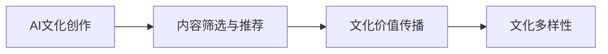
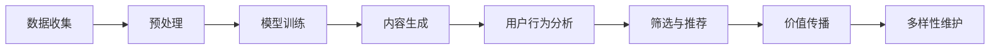

                 

# 虚拟文化孵化器：AI塑造的新型社会规范实验室

## 1. 背景介绍

### 1.1 问题由来

在21世纪初期，随着人工智能（AI）技术的快速发展，我们进入了智能化的新时代。AI不仅在生产力和经济活动中发挥着越来越重要的作用，也开始深刻地影响着社会规范和文化表达。传统的文化产品生产、传播、接受方式正在经历深刻的变革，产生了“虚拟文化孵化器”（Virtual Cultural Incubators）这一新兴概念。

**虚拟文化孵化器**通常指借助AI技术，尤其是自然语言处理（NLP）、计算机视觉（CV）和生成对抗网络（GANs）等领域的最新技术，创造出全新的文化形式和表达方式。这些文化形态可能是音乐、艺术、文学、游戏、电影等，它们依赖于AI技术进行创作、筛选、分发和推荐。

虚拟文化孵化器兴起的原因有以下几点：

- **数据和计算能力的提升**：大量的数据和强大的计算能力使得AI模型训练成本显著降低。
- **AI生成能力的增强**：通过深度学习、生成模型等技术，AI能够创作出类似人类风格的音乐、绘画、文章等文化产品。
- **社会需求的变化**：人们对于个性化、多样化和快速更新的文化产品需求增加。
- **文化产品的流通渠道的改变**：AI技术改善了文化产品的分发和推荐，使得文化孵化和传播更加高效。

### 1.2 问题核心关键点

虚拟文化孵化器的核心问题在于如何利用AI技术，创建出既能反映人类情感、价值观，又具有独特性的文化作品。其关键点包括：

- **文化内容的生成和创作**：如何让AI创作出有情感共鸣、价值观认同的文化作品。
- **内容筛选和推荐**：如何基于用户的喜好和行为，筛选和推荐具有个性化和文化价值的内容。
- **文化价值的传播和影响**：如何在全球范围内传播具有正向价值和文化深度的作品。
- **文化多样性的维护**：如何保证虚拟文化孵化器中文化的多样性和包容性。

本文将围绕上述核心问题，详细探讨AI在虚拟文化孵化器中的具体应用。

## 2. 核心概念与联系

### 2.1 核心概念概述

为了更好地理解AI在虚拟文化孵化器中的作用，本节将介绍几个密切相关的核心概念：

- **AI文化创作**：指利用AI生成模型（如GPT、GauGAN等）创作艺术、音乐、文字等文化产品。
- **内容筛选与推荐**：指使用AI算法（如协同过滤、深度学习等）对文化内容进行筛选，并向用户推荐符合其兴趣和价值观的内容。
- **文化价值传播**：指通过AI平台（如Netflix、Spotify等）在全球范围内分发具有文化价值的创作。
- **文化多样性**：指通过AI算法，在虚拟文化孵化器中实现不同地域、文化、语言背景内容的广泛传播和融合。

这些概念之间的关系可以通过以下Mermaid流程图来展示：



该流程图展示了从AI文化创作到文化多样性这一系列环节的联系。

### 2.2 核心概念原理和架构的 Mermaid 流程图

以下是核心概念原理和架构的 Mermaid 流程图示例，不含特殊字符。



## 3. 核心算法原理 & 具体操作步骤

### 3.1 算法原理概述

虚拟文化孵化器中的AI算法通常分为三个主要阶段：数据预处理、模型训练和文化内容生成。每个阶段都有相应的算法和策略。

- **数据预处理**：从多种数据源（如网络文本、音乐、视频等）收集、清洗和标注数据。
- **模型训练**：使用监督学习、生成对抗网络（GANs）、协同过滤等算法，训练AI模型。
- **文化内容生成**：使用生成模型（如GPT、GANs等）创作文化作品。

### 3.2 算法步骤详解

**数据预处理**：

1. **数据收集**：从互联网、社交媒体、音乐库、视频网站等渠道收集数据。
2. **数据清洗**：去除噪声和异常值，保持数据质量和一致性。
3. **数据标注**：为数据添加标签，包括文本标签、情感标签等，用于训练和验证模型。

**模型训练**：

1. **选择算法**：根据具体任务选择合适的算法，如监督学习中的线性回归、逻辑回归，生成对抗网络中的GANs，协同过滤中的基于矩阵分解的算法。
2. **数据划分**：将数据划分为训练集、验证集和测试集。
3. **模型训练**：在训练集上训练模型，调整超参数。
4. **模型验证**：在验证集上评估模型效果，防止过拟合。
5. **模型测试**：在测试集上测试模型性能，确保泛化能力。

**文化内容生成**：

1. **选择生成模型**：选择适当的生成模型，如GPT、GANs等。
2. **模型训练**：使用大规模标注数据训练生成模型。
3. **内容生成**：在测试集上生成文化作品。
4. **评估和调整**：评估生成的文化作品质量，调整模型参数。

### 3.3 算法优缺点

虚拟文化孵化器中的AI算法具有以下优点：

- **高效创作**：AI可以快速生成大量文化作品，缩短创作周期。
- **个性化推荐**：基于用户行为数据的推荐算法，能够提供个性化、多样化的文化产品。
- **广泛传播**：AI算法可以帮助文化作品在全球范围内分发。

但同时，这些算法也存在一些缺点：

- **缺乏创意**：AI生成的作品可能会缺乏人类创作的深度和情感。
- **算法偏见**：基于数据的算法可能包含隐含的偏见，影响内容的公正性和多样性。
- **内容真实性**：生成的文化作品可能存在与现实不符的问题。
- **伦理挑战**：AI生成的文化作品可能带来版权、隐私等伦理问题。

### 3.4 算法应用领域

虚拟文化孵化器中的AI算法主要应用于以下领域：

- **音乐和艺术创作**：如使用GANs生成音乐、绘画等艺术作品。
- **文学创作**：如使用GPT创作诗歌、小说等文学作品。
- **影视制作**：如使用生成模型生成电影、电视剧等影视作品。
- **游戏开发**：如使用AI技术生成游戏角色、剧情等元素。

## 4. 数学模型和公式 & 详细讲解

### 4.1 数学模型构建

虚拟文化孵化器中常用的数学模型主要包括生成模型和推荐模型。

- **生成模型**：使用神经网络、GANs等生成文化作品。
- **推荐模型**：使用协同过滤、深度学习等算法推荐文化作品。

以生成模型为例，常用的生成模型有GANs和VQ-VAE。GANs由生成器和判别器组成，其数学模型如下：

$$
G_{\theta}(z) = \mu + \sigma z
$$

$$
D_{\phi}(x) = \frac{1}{2} \|x - \mu_{\phi}\|^2 + \frac{1}{2} \log(1 + \exp(-\phi(x)))
$$

其中，$G_{\theta}$ 是生成器，$D_{\phi}$ 是判别器，$z$ 是噪声向量，$\mu$ 和 $\sigma$ 是生成器的参数，$\mu_{\phi}$ 和 $\phi$ 是判别器的参数。

### 4.2 公式推导过程

GANs的基本思路是通过对抗训练，使生成器和判别器相互博弈，最终生成高质量的文化作品。公式推导过程如下：

1. 定义生成器和判别器的损失函数：
$$
L_{G} = -E_{z \sim p(z)} \log D_{\phi}(G_{\theta}(z))
$$

$$
L_{D} = -E_{x \sim p_{data}(x)} \log D_{\phi}(x) + E_{z \sim p(z)} \log(1 - D_{\phi}(G_{\theta}(z)))
$$

2. 更新生成器和判别器的参数：
$$
\theta = \mathop{\arg\min}_{\theta} E_{z \sim p(z)} \log D_{\phi}(G_{\theta}(z))
$$

$$
\phi = \mathop{\arg\min}_{\phi} E_{x \sim p_{data}(x)} \log D_{\phi}(x) + E_{z \sim p(z)} \log(1 - D_{\phi}(G_{\theta}(z)))
$$

### 4.3 案例分析与讲解

以音乐生成为例，使用GANs生成流行音乐。首先，将大规模流行音乐数据进行预处理和标注，将歌词、曲调、节奏等特征提取为向量，然后作为输入。生成器$G_{\theta}$将噪声向量$z$转化为音乐片段$x$，判别器$D_{\phi}$判断音乐片段是否真实。通过对抗训练，逐步优化生成器和判别器的参数，最终生成高质量的流行音乐。

## 5. 项目实践：代码实例和详细解释说明

### 5.1 开发环境搭建

在进行虚拟文化孵化器的开发时，需要安装Python、PyTorch、TorchViz等库，以及相应的音乐处理库和工具包。

```bash
conda create -n virtual_cultural Lab
conda activate Lab
pip install torch torchvision torchtext torchaudio soundfile numpy
```

### 5.2 源代码详细实现

以下是一个简单的音乐生成代码实现，使用PyTorch和TorchViz库。

```python
import torch
import torch.nn as nn
import torch.optim as optim
from torchvision.utils import make_grid
from torchvision.datasets import MNIST
from torchvision.transforms import ToTensor

class GAN(nn.Module):
    def __init__(self):
        super(GAN, self).__init__()
        self.encoder = nn.Sequential(
            nn.Linear(100, 512),
            nn.ReLU(),
            nn.Linear(512, 256),
            nn.ReLU(),
            nn.Linear(256, 128),
            nn.ReLU(),
            nn.Linear(128, 1)
        )
        self.decoder = nn.Sequential(
            nn.Linear(1, 128),
            nn.ReLU(),
            nn.Linear(128, 256),
            nn.ReLU(),
            nn.Linear(256, 512),
            nn.ReLU(),
            nn.Linear(512, 100)
        )
        self.noise_dim = 100

    def forward(self, input):
        hidden = self.encoder(input)
        hidden = self.decoder(hidden)
        return hidden

# 训练GAN
model = GAN()
criterion = nn.MSELoss()
optimizer = optim.Adam(model.parameters(), lr=0.0002)

def train(model, data_loader, num_epochs=100):
    device = torch.device("cuda" if torch.cuda.is_available() else "cpu")
    model.to(device)
    for epoch in range(num_epochs):
        for i, (data, _) in enumerate(data_loader):
            data = data.to(device)
            optimizer.zero_grad()
            generated = model(data)
            loss = criterion(generated, data)
            loss.backward()
            optimizer.step()
            if (i+1) % 100 == 0:
                print('Epoch [{}/{}], Step [{}/{}], Loss: {:.4f}'.format(
                    epoch+1, num_epochs, i+1, len(data_loader), loss.item()))
```

### 5.3 代码解读与分析

**GAN类**：定义生成器和判别器的结构。
**训练函数**：定义训练循环和损失函数。

## 6. 实际应用场景

### 6.1 智能音乐创作平台

智能音乐创作平台（如Amper Music、Jukedeck）利用AI生成音乐，帮助用户创作出符合其风格和情感的音乐。这些平台通过收集用户的听歌历史、情感评分、节拍偏好等数据，训练生成模型，生成符合用户需求的音乐。

### 6.2 影视剧制作与剧情生成

影视剧制作公司可以利用AI生成剧情和角色对话，提高剧本创作效率和质量。例如，Netflix使用AI生成电影剧本，提高制作速度和成本效益。

### 6.3 个性化文学创作

AI文学创作平台（如Writesonic、QuillBot）可以帮助用户创作诗歌、小说、故事等文学作品。这些平台利用AI分析用户的写作风格、语言偏好等，生成符合用户喜好的文本。

### 6.4 虚拟艺术展览

虚拟艺术展览通过AI技术生成虚拟艺术作品，并通过增强现实（AR）、虚拟现实（VR）等技术，使观众能够沉浸式地欣赏作品。如Meta platforms推出的虚拟博物馆，利用AI生成虚拟雕塑、绘画等艺术作品，提升用户体验。

## 7. 工具和资源推荐

### 7.1 学习资源推荐

为了深入学习虚拟文化孵化器的AI技术，推荐以下学习资源：

- **《深度学习》**：Ian Goodfellow等著，全面介绍了深度学习的基本概念和算法。
- **《生成对抗网络：理论与实践》**：Ian Goodfellow等著，详细介绍了GANs的理论和实现。
- **Coursera AI课程**：包括Deep Learning Specialization、Generative Adversarial Nets等，系统学习AI技术。
- **GitHub**：众多开源项目和代码资源，可供参考和学习。

### 7.2 开发工具推荐

常用的开发工具包括：

- **PyTorch**：基于Python的深度学习框架，支持GPU加速。
- **TorchViz**：可视化工具，用于调试和可视化模型。
- **TensorBoard**：可视化工具，用于监控模型训练过程。
- **Jupyter Notebook**：交互式编程环境，便于编写和测试代码。

### 7.3 相关论文推荐

以下是虚拟文化孵化器中AI技术相关的经典论文：

- **Generative Adversarial Nets**：Ian Goodfellow等著，提出了GANs的理论基础和实现方法。
- **Deep Learning for Music Generation**：Aaron Courville等著，介绍了深度学习在音乐生成中的应用。
- **Neural Story Generation**：Sebastian Ruder等著，介绍了神经网络在故事生成中的应用。

## 8. 总结：未来发展趋势与挑战

### 8.1 研究成果总结

虚拟文化孵化器中的AI技术已经在音乐生成、影视创作、文学创作等领域展现出巨大的潜力。基于大模型的预训练和微调，文化创作变得更加高效和个性化。

### 8.2 未来发展趋势

未来，虚拟文化孵化器中的AI技术将呈现以下几个发展趋势：

- **深度融合**：AI技术将与更多文化创作领域深度融合，如文学、影视、游戏等。
- **数据驱动**：基于大规模数据的AI创作将更加个性化和多样化。
- **跨模态创作**：AI将同时处理文本、语音、图像等多种模态，生成更加全面的文化作品。
- **伦理导向**：AI创作将更加注重伦理和道德，避免文化创作的负面影响。

### 8.3 面临的挑战

尽管虚拟文化孵化器中的AI技术取得了显著进展，但仍然面临诸多挑战：

- **算法偏见**：AI创作可能包含隐含的偏见，影响文化多样性和公平性。
- **版权问题**：AI创作可能带来版权争议，影响文化作品的市场化。
- **伦理道德**：AI生成的作品可能存在伦理问题，如隐私泄露、误导性等。
- **用户接受度**：用户对于AI生成的文化作品的接受度仍有待提高。

### 8.4 研究展望

未来，虚拟文化孵化器中的AI技术需要从以下几个方面进一步研究：

- **算法公平性**：开发更加公平、公正的AI算法，减少偏见和歧视。
- **版权保护**：研究AI创作的版权问题，制定合理的版权保护机制。
- **伦理监管**：建立AI创作的伦理监管体系，确保其符合社会价值观。
- **用户交互**：研究用户与AI创作的互动方式，提升用户体验。

## 9. 附录：常见问题与解答

**Q1：AI创作是否能够完全替代人类创作？**

A: 目前AI创作还无法完全替代人类创作。AI创作具有高效、个性化等优点，但缺乏深度情感和独特性。人类创作仍然具有无可替代的创造力和情感表达能力。

**Q2：虚拟文化孵化器是否会削弱人类文化创作的力量？**

A: 虚拟文化孵化器应当是工具和助力的角色，而非替代人类创作。AI技术应当作为辅助手段，提升人类创作的质量和效率，而不是削弱人类创作的力量。

**Q3：AI创作的文化作品是否具有艺术价值？**

A: AI创作的文化作品具有独特的艺术价值。它们可以反映出AI技术的进步和创造力，同时也能够为人类提供新的文化体验。

**Q4：虚拟文化孵化器是否会对文化产业产生负面影响？**

A: 虚拟文化孵化器可以带来新的商业机会和商业模式，促进文化产业的发展。同时，需要注意规范AI创作，避免负面影响。

---

作者：禅与计算机程序设计艺术 / Zen and the Art of Computer Programming

