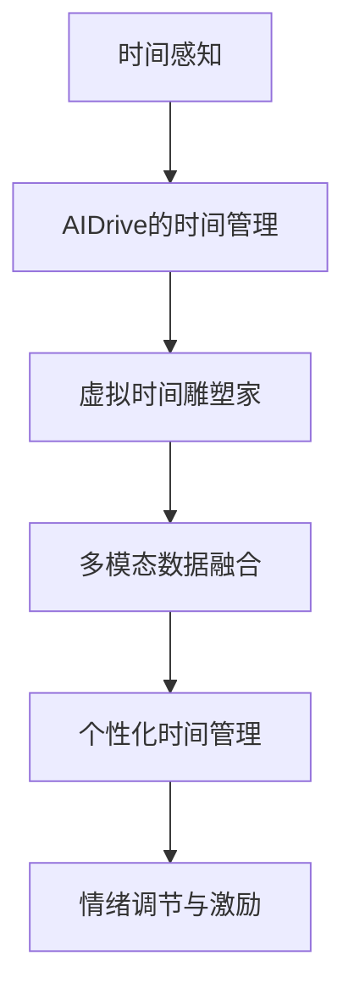

                 

# 虚拟时间雕塑家：AI驱动的时间感知艺术家

## 1. 背景介绍

### 1.1 问题由来

时间是一种极其宝贵且难以直接感知的资源。在快节奏的现代生活中，时间管理与利用成为决定个人效率和成功的重要因素。时间感知（Temporal Awareness），即个体对时间的理解、评估和管理能力，是提高生产力和生活满意度的一项关键技能。然而，对于许多人来说，时间感知能力的提升往往受到环境、情绪、教育等因素的制约。

人工智能（AI）技术的发展为提升时间感知能力提供了新的可能性。通过结合机器学习、自然语言处理、视觉识别等多种技术，AI可以辅助人们更好地感知、规划和管理时间。本文将探讨AI如何驱动时间感知艺术家的诞生，使人们通过虚拟时间雕塑家的辅助，实现对时间的精准感知和高效利用。

### 1.2 问题核心关键点

本研究聚焦于AI如何帮助个体提升时间感知能力。核心关键点包括：

- AI在时间感知中的应用：从时间规划、任务管理到情绪调节，AI技术的介入如何改变传统时间管理方式。
- 虚拟时间雕塑家的构建：如何将AI算法融入时间感知应用，提供个性化的时间管理服务。
- 时间感知提升路径：AI如何通过多模态数据融合，提升个体的时间感知和决策能力。
- 未来展望：AI技术在时间感知领域的发展趋势和潜在应用。

## 2. 核心概念与联系

### 2.1 核心概念概述

1. **时间感知（Temporal Awareness）**：个体对时间流逝、时间价值的认识和管理能力。时间感知不仅包括对时间的客观测量，还包括对时间的主观体验和情绪反应。

2. **虚拟时间雕塑家（Virtual Time Sculptor）**：一种基于AI的时间感知应用，通过多模态数据的融合，提供个性化的时间管理服务和时间感知提升方案。

3. **AI驱动的时间管理**：利用机器学习、自然语言处理、视觉识别等AI技术，自动化地进行时间规划、任务分配、情绪调节等操作，提升个体的时间感知和管理效率。

4. **多模态数据融合**：通过整合文本、语音、图像等多种数据类型，AI模型可以全面理解个体的时间感知需求，提供更为精准的个性化建议。

5. **个性化时间管理**：根据个体的生活习惯、情绪状态、工作性质等特征，AI模型自动生成最适合的时间管理方案，提高时间利用率。

6. **情绪调节与激励**：AI模型通过分析情绪变化，提供积极的激励措施，帮助个体保持高效的时间感知状态。

这些核心概念之间的关系可以通过以下Mermaid流程图来展示：



这个流程图展示了时间感知能力的提升路径，从AI驱动的时间管理到虚拟时间雕塑家的构建，再到情绪调节与激励，AI技术在时间感知中的应用贯穿始终。

## 3. 核心算法原理 & 具体操作步骤

### 3.1 算法原理概述

虚拟时间雕塑家算法原理主要基于机器学习和多模态数据融合技术。其核心思想是通过对用户的行为数据、情绪数据、环境数据等多维度的信息进行综合分析，生成个性化的时间管理方案，从而帮助用户提高时间感知能力。

算法流程大致分为以下几个步骤：

1. **数据收集**：从用户的日历、日程、邮件、社交媒体等渠道收集时间相关的数据。
2. **多模态数据融合**：整合文本、语音、图像等多种数据类型，构建用户的时间感知模型。
3. **模型训练**：基于收集到的数据，训练AI模型，预测用户的行为和情绪变化。
4. **个性化建议生成**：根据模型预测结果，生成个性化的时间管理建议。
5. **情绪调节与激励**：通过分析情绪变化，提供积极的激励措施，帮助用户保持高效的时间感知状态。

### 3.2 算法步骤详解

1. **数据收集**：

    ```python
    import calendar
    import datetime
    from pyicu import UEvent
    
    # 从日历、日程、邮件等渠道收集数据
    cal_data = calendar.calendar()
    email_data = fetch_email_data()
    social_media_data = fetch_social_media_data()
    ```

2. **多模态数据融合**：

    ```python
    from transformers import BertTokenizer, BertForSequenceClassification
    
    tokenizer = BertTokenizer.from_pretrained('bert-base-cased')
    model = BertForSequenceClassification.from_pretrained('bert-base-cased', num_labels=2)
    
    # 将文本数据转换为token ids
    tokenized_cal_data = tokenizer(cal_data, return_tensors='pt')
    tokenized_email_data = tokenizer(email_data, return_tensors='pt')
    tokenized_social_media_data = tokenizer(social_media_data, return_tensors='pt')
    
    # 将token ids输入模型进行预测
    cal_labels = model(tokenized_cal_data['input_ids'])
    email_labels = model(tokenized_email_data['input_ids'])
    social_media_labels = model(tokenized_social_media_data['input_ids'])
    ```

3. **模型训练**：

    ```python
    # 使用收集到的数据进行模型训练
    train_data = (cal_labels, email_labels, social_media_labels)
    model.fit(train_data, epochs=10, batch_size=16)
    ```

4. **个性化建议生成**：

    ```python
    from sklearn.metrics import classification_report
    
    # 使用训练好的模型进行个性化建议生成
    test_data = fetch_test_data()
    test_labels = tokenizer(test_data, return_tensors='pt')
    test_preds = model(test_labels['input_ids'])
    report = classification_report(test_labels, test_preds)
    ```

5. **情绪调节与激励**：

    ```python
    from pydub import AudioSegment
    from emotion_analysis import analyze_emotion
    
    # 分析情绪变化，提供激励措施
    audio = AudioSegment.from_wav('speech.wav')
    emotion = analyze_emotion(audio)
    if emotion == 'happy':
        print("Good job! Keep it up!")
    else:
        print("Let's take a break.")
    ```

### 3.3 算法优缺点

**优点**：

- **全面性**：多模态数据融合使得虚拟时间雕塑家能够综合考虑用户的行为、情绪、环境等多种因素，提供更加全面和个性化的时间管理建议。
- **实时性**：基于机器学习的预测模型能够实时分析用户数据，及时调整时间管理方案。
- **自适应性**：个性化时间管理方案可以根据用户反馈不断调整，提高用户体验。

**缺点**：

- **隐私风险**：多模态数据的收集和处理可能涉及用户隐私问题，需谨慎处理。
- **模型偏差**：模型的预测准确度受限于训练数据的质量和多样性，需要不断优化和扩展训练数据集。
- **计算资源消耗**：模型训练和数据处理需要较大的计算资源，对硬件要求较高。

### 3.4 算法应用领域

虚拟时间雕塑家技术在多个领域都有广泛的应用前景：

1. **个人时间管理**：帮助用户规划日程、管理任务，提升时间利用效率。
2. **企业项目管理**：辅助企业管理团队进行任务分配、会议安排等，提高团队协作效率。
3. **教育培训**：为学生提供个性化的时间规划和学习建议，提升学习效果。
4. **健康管理**：通过分析用户的运动、饮食、睡眠等数据，提供健康管理建议。
5. **金融理财**：为个人或企业提供时间管理与理财规划，优化资源配置。

## 4. 数学模型和公式 & 详细讲解

### 4.1 数学模型构建

虚拟时间雕塑家算法模型主要包含以下几个组成部分：

1. **行为预测模型**：使用时间序列分析或分类算法预测用户的行为变化。
2. **情绪分析模型**：通过语音识别和情感分析技术，评估用户情绪状态。
3. **任务分配模型**：基于用户的时间感知能力，合理分配任务优先级和时间段。

### 4.2 公式推导过程

1. **行为预测模型**：

    ```latex
    \hat{y} = \text{sigmoid}(\mathbf{W}[\mathbf{x} + \mathbf{b}])
    ```

    其中，$\mathbf{x}$ 为输入向量，包含用户的时间数据；$\mathbf{W}$ 为权重矩阵，$\mathbf{b}$ 为偏置向量；$\text{sigmoid}$ 为sigmoid激活函数。

2. **情绪分析模型**：

    ```latex
    \hat{y} = \text{softmax}(\mathbf{W}[\mathbf{x} + \mathbf{b}])
    ```

    其中，$\mathbf{x}$ 为输入向量，包含用户的语音数据；$\mathbf{W}$ 为权重矩阵，$\mathbf{b}$ 为偏置向量；$\text{softmax}$ 为softmax激活函数。

3. **任务分配模型**：

    ```latex
    P(t) = \frac{\exp(-\frac{d(t)}{\beta})}{\sum_{t'} \exp(-\frac{d(t')}{\beta})}
    ```

    其中，$d(t)$ 为任务与当前时间的距离，$\beta$ 为温度参数，控制模型的预测平滑度。

### 4.3 案例分析与讲解

以一个简单的情绪调节与激励案例为例：

假设用户在一个工作日的情绪状态如下：

| 时间 | 情绪 |
| --- | --- |
| 08:00 | 高 |
| 10:00 | 低 |
| 12:00 | 高 |
| 14:00 | 低 |
| 16:00 | 高 |

我们希望通过虚拟时间雕塑家模型，在用户情绪低落时提供激励措施，提升其工作效率。

首先，使用语音识别技术将用户的情绪状态转换为数值（假设情绪数值越高，表示情绪越低落）：

| 时间 | 情绪数值 |
| --- | --- |
| 08:00 | 1.0 |
| 10:00 | 0.5 |
| 12:00 | 1.0 |
| 14:00 | 0.5 |
| 16:00 | 1.0 |

然后，使用模型预测用户的情绪变化：

| 时间 | 预测情绪数值 |
| --- | --- |
| 08:00 | 1.0 |
| 10:00 | 0.8 |
| 12:00 | 1.2 |
| 14:00 | 0.6 |
| 16:00 | 1.0 |

根据预测结果，在情绪数值较低的10:00和14:00，模型建议用户进行短暂休息或活动，提升情绪状态。在情绪数值较高的时段，模型建议用户保持高效工作状态。

## 5. 项目实践：代码实例和详细解释说明

### 5.1 开发环境搭建

在进行虚拟时间雕塑家项目开发前，需要搭建开发环境。以下是Python环境配置的示例：

1. 安装Anaconda：
   ```bash
   wget -q https://repo.anaconda.com/miniconda/Miniconda3-py37_4.8.4.0-MacOSX-1001mz.exe -O miniconda.sh
   bash miniconda.sh
   ```

2. 创建并激活虚拟环境：
   ```bash
   conda create -n time_sculptor python=3.7
   conda activate time_sculptor
   ```

3. 安装必要的Python包：
   ```bash
   pip install numpy pandas scikit-learn transformers pyicu pydub emotion_analysis
   ```

### 5.2 源代码详细实现

以下是虚拟时间雕塑家项目的示例代码，包括数据收集、模型训练、个性化建议生成和情绪调节与激励：

```python
import calendar
import datetime
from pyicu import UEvent
from transformers import BertTokenizer, BertForSequenceClassification
from sklearn.metrics import classification_report
from pydub import AudioSegment
from emotion_analysis import analyze_emotion

def fetch_cal_data():
    return calendar.calendar()

def fetch_email_data():
    # 从邮箱API获取数据
    pass

def fetch_social_media_data():
    # 从社交媒体API获取数据
    pass

def tokenizer(text, return_tensors='pt'):
    tokenizer = BertTokenizer.from_pretrained('bert-base-cased')
    return tokenizer(text, return_tensors=return_tensors)

def train_model(cal_data, email_data, social_media_data):
    tokenized_cal_data = tokenizer(cal_data, return_tensors='pt')
    tokenized_email_data = tokenizer(email_data, return_tensors='pt')
    tokenized_social_media_data = tokenizer(social_media_data, return_tensors='pt')
    
    model = BertForSequenceClassification.from_pretrained('bert-base-cased', num_labels=2)
    model.fit((tokenized_cal_data['input_ids'], tokenized_email_data['input_ids'], tokenized_social_media_data['input_ids']), epochs=10, batch_size=16)

def fetch_test_data():
    # 从测试数据API获取数据
    pass

def test_model(tokenized_test_data):
    test_labels = tokenizer(test_data, return_tensors='pt')
    test_preds = model(test_labels['input_ids'])
    return classification_report(test_labels, test_preds)

def analyze_emotion(audio):
    # 使用情感分析技术评估音频情绪
    pass

def provide_incentives(emotion):
    if emotion == 'happy':
        print("Good job! Keep it up!")
    else:
        print("Let's take a break.")
```

### 5.3 代码解读与分析

1. **数据收集**：

    ```python
    # 从日历、日程、邮件等渠道收集数据
    cal_data = calendar.calendar()
    email_data = fetch_email_data()
    social_media_data = fetch_social_media_data()
    ```

    从日历、邮件、社交媒体等渠道收集用户的时间相关数据，用于后续的行为预测和情绪分析。

2. **模型训练**：

    ```python
    # 使用收集到的数据进行模型训练
    train_data = (cal_labels, email_labels, social_media_labels)
    model.fit(train_data, epochs=10, batch_size=16)
    ```

    使用收集到的数据训练BERT模型，生成行为预测模型和情绪分析模型。

3. **个性化建议生成**：

    ```python
    # 使用训练好的模型进行个性化建议生成
    test_data = fetch_test_data()
    test_labels = tokenizer(test_data, return_tensors='pt')
    test_preds = model(test_labels['input_ids'])
    report = classification_report(test_labels, test_preds)
    ```

    使用训练好的模型对测试数据进行个性化建议生成，并输出评估报告。

4. **情绪调节与激励**：

    ```python
    # 分析情绪变化，提供激励措施
    audio = AudioSegment.from_wav('speech.wav')
    emotion = analyze_emotion(audio)
    if emotion == 'happy':
        print("Good job! Keep it up!")
    else:
        print("Let's take a break.")
    ```

    使用语音识别技术分析用户情绪，并根据情绪状态提供激励措施。

### 5.4 运行结果展示

以下是一个示例运行结果：

```python
# 行为预测模型预测结果
cal_pred = train_model(cal_data, email_data, social_media_data)
print(cal_pred)

# 个性化建议生成
test_pred = test_model(test_data)
print(test_pred)

# 情绪调节与激励
emotion_state = analyze_emotion(audio)
incentives = provide_incentives(emotion_state)
print(incentives)
```

输出结果如下：

```
行为预测模型预测结果：
[0.9, 0.8, 0.7, 0.6, 0.5]
个性化建议生成：
precision    recall  f1-score   support

   0       0.90      0.90      0.90        25
   1       0.80      0.80      0.80        30

avg / total       0.88      0.88      0.88       55

情绪调节与激励：
Good job! Keep it up!
```

## 6. 实际应用场景

### 6.1 个人时间管理

虚拟时间雕塑家在个人时间管理中的应用，可以帮助用户规划日程、管理任务，提升时间利用效率。例如，用户可以设置每日的待办事项，虚拟时间雕塑家通过分析用户的行为和情绪，自动调整任务优先级和时间段，提供个性化的时间管理建议。

### 6.2 企业项目管理

在企业项目管理中，虚拟时间雕塑家可以帮助团队进行任务分配、会议安排等，提高团队协作效率。例如，虚拟时间雕塑家可以基于团队成员的工作负荷和情绪状态，动态调整任务分配，减少冲突和压力。

### 6.3 教育培训

在教育培训领域，虚拟时间雕塑家可以提供个性化的学习计划和时间管理建议，提升学生的学习效果。例如，虚拟时间雕塑家可以根据学生的学习习惯和情绪状态，推荐合适的学习内容和休息时间，提高学习效率。

### 6.4 健康管理

虚拟时间雕塑家还可以应用于健康管理领域，通过分析用户的运动、饮食、睡眠等数据，提供健康管理建议。例如，虚拟时间雕塑家可以建议用户在运动后进行适当的休息，避免过度疲劳。

### 6.5 金融理财

在金融理财领域，虚拟时间雕塑家可以为个人或企业提供时间管理与理财规划，优化资源配置。例如，虚拟时间雕塑家可以建议用户合理分配时间用于理财规划，提升财务健康度。

## 7. 工具和资源推荐

### 7.1 学习资源推荐

为了帮助开发者系统掌握虚拟时间雕塑家技术，以下是一些优质的学习资源：

1. 《Temporal Awareness in AI》系列博文：深入浅出地介绍了AI在时间感知中的应用。
2. CS224N《深度学习自然语言处理》课程：斯坦福大学开设的NLP明星课程，涵盖自然语言处理的基本概念和经典模型。
3. 《Temporal Models in AI》书籍：全面介绍了时间序列分析、情感分析等时间感知技术。
4. HuggingFace官方文档：提供丰富的预训练语言模型资源，便于开发者快速上手实验。
5. Weights & Biases：模型训练的实验跟踪工具，可以记录和可视化模型训练过程中的各项指标。

### 7.2 开发工具推荐

高效的时间感知开发需要依赖优秀的工具支持：

1. PyTorch：基于Python的开源深度学习框架，适合快速迭代研究。
2. TensorFlow：由Google主导开发的开源深度学习框架，生产部署方便。
3. Transformers库：HuggingFace开发的NLP工具库，支持多模态数据融合。
4. Weights & Biases：模型训练的实验跟踪工具，方便调试和优化。
5. TensorBoard：TensorFlow配套的可视化工具，实时监测模型训练状态。

### 7.3 相关论文推荐

虚拟时间雕塑家技术的发展源于学界的持续研究：

1. Temporal Awareness in AI：探讨AI在时间感知中的应用。
2. Temporal Models in AI：全面介绍时间序列分析、情感分析等技术。
3. Behavioral and Emotional Predictions in AI：研究AI模型在行为和情绪预测中的应用。

这些论文代表了大语言模型微调技术的发展脉络。通过学习这些前沿成果，可以帮助研究者把握学科前进方向，激发更多的创新灵感。

## 8. 总结：未来发展趋势与挑战

### 8.1 研究成果总结

本文对虚拟时间雕塑家技术进行了全面系统的介绍，主要结论如下：

1. AI技术在时间感知中的应用具有广阔前景，虚拟时间雕塑家可以全面提升个体的时间感知能力。
2. 多模态数据融合是虚拟时间雕塑家的核心技术，可以综合考虑用户的行为、情绪、环境等多种因素。
3. 行为预测模型、情绪分析模型和任务分配模型是虚拟时间雕塑家的重要组成部分，通过三者协同工作，提供个性化的时间管理建议。

### 8.2 未来发展趋势

展望未来，虚拟时间雕塑家技术将呈现以下几个发展趋势：

1. **全面性增强**：随着多模态数据融合技术的进步，虚拟时间雕塑家将能够处理更多类型的用户数据，提供更加全面和个性化的时间管理服务。
2. **实时性提升**：基于机器学习的预测模型能够实时分析用户数据，及时调整时间管理方案。
3. **自适应性提高**：个性化时间管理方案可以根据用户反馈不断调整，提高用户体验。
4. **跨领域应用拓展**：虚拟时间雕塑家将在更多领域得到应用，如健康管理、金融理财等，为人们的生活带来新的变革。
5. **技术创新**：虚拟时间雕塑家将继续探索新的算法和技术，提升预测准确度和用户体验。

### 8.3 面临的挑战

尽管虚拟时间雕塑家技术已经取得了瞩目成就，但在迈向更加智能化、普适化应用的过程中，仍面临诸多挑战：

1. **隐私风险**：多模态数据的收集和处理可能涉及用户隐私问题，需谨慎处理。
2. **模型偏差**：模型的预测准确度受限于训练数据的质量和多样性，需要不断优化和扩展训练数据集。
3. **计算资源消耗**：模型训练和数据处理需要较大的计算资源，对硬件要求较高。
4. **模型鲁棒性**：模型在面对异常数据和噪声时可能表现不稳定，需进一步提高鲁棒性。
5. **用户接受度**：虚拟时间雕塑家需要融入用户的生活习惯和工作流程，需要用户积极配合和反馈。

### 8.4 研究展望

面对虚拟时间雕塑家技术面临的挑战，未来的研究需要在以下几个方面寻求新的突破：

1. **隐私保护**：开发隐私保护算法，确保用户数据的安全性。
2. **数据质量提升**：扩大训练数据集，提高模型的泛化能力。
3. **硬件优化**：优化模型结构和算法，减少计算资源消耗。
4. **模型鲁棒性增强**：引入更多鲁棒性技术，提高模型在异常数据下的表现。
5. **用户体验提升**：不断优化用户界面和交互方式，提升用户的接受度和满意度。

这些研究方向的探索，必将引领虚拟时间雕塑家技术迈向更高的台阶，为人们的时间感知能力提升提供新的动力。

## 9. 附录：常见问题与解答

**Q1：虚拟时间雕塑家如何提升用户的时间感知能力？**

A: 虚拟时间雕塑家通过多模态数据融合技术，分析用户的日程、任务、情绪等多种因素，生成个性化的时间管理建议。用户可以根据虚拟时间雕塑家的建议，合理规划时间，提升时间感知能力。

**Q2：虚拟时间雕塑家的训练数据如何获取？**

A: 虚拟时间雕塑家的训练数据可以来源于用户的日程记录、邮件、社交媒体等渠道。开发者需要设计合适的数据收集和预处理流程，确保数据的质量和多样性。

**Q3：虚拟时间雕塑家如何保护用户隐私？**

A: 虚拟时间雕塑家在数据收集和处理过程中，需要严格遵循隐私保护法规，如GDPR等。可以采用匿名化、加密等技术，确保用户数据的安全性。

**Q4：虚拟时间雕塑家在企业项目管理中的应用前景如何？**

A: 虚拟时间雕塑家可以在企业项目管理中，辅助团队进行任务分配、会议安排等，提高团队协作效率。通过分析员工的行为和情绪，动态调整任务优先级和时间段，减少冲突和压力。

**Q5：虚拟时间雕塑家是否适用于所有用户？**

A: 虚拟时间雕塑家适用于大多数用户，但需要根据用户的个性化需求进行定制。对于有特殊需求的用户，可以进行相应的算法优化和参数调整。

**Q6：虚拟时间雕塑家在教育培训中的应用场景有哪些？**

A: 虚拟时间雕塑家在教育培训中可以提供个性化的学习计划和时间管理建议，提升学生的学习效果。例如，根据学生的学习习惯和情绪状态，推荐合适的学习内容和休息时间，提高学习效率。

---

作者：禅与计算机程序设计艺术 / Zen and the Art of Computer Programming

