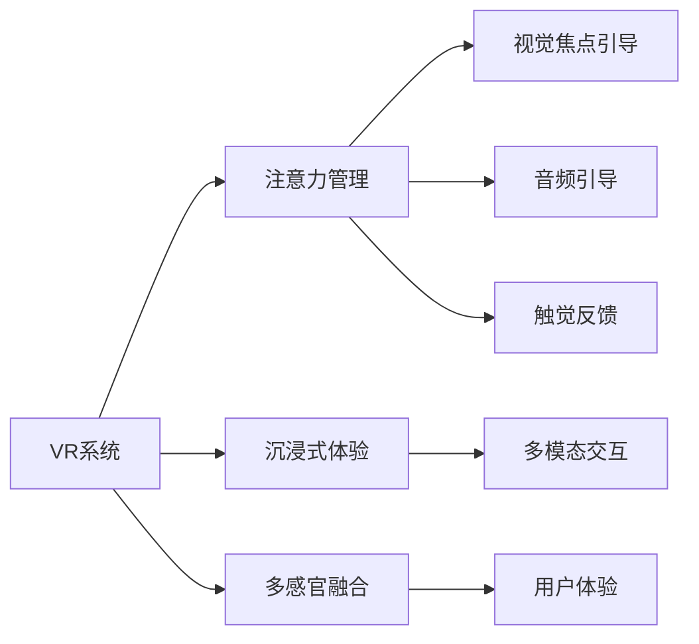

                 

## 1. 背景介绍

随着计算机图形学、人工智能、传感器技术的飞速发展，虚拟现实(Virtual Reality, VR)技术正在进入一个崭新的发展阶段。虚拟现实系统通过生成与现实世界相似或完全不同的视觉、听觉、触觉等感官体验，将用户沉浸在虚拟环境中，实现沉浸式交互体验。在教育、医疗、娱乐、旅游、工业仿真等领域，VR技术展现出巨大的应用潜力。

在虚拟现实系统的沉浸体验中，注意力管理（Attention Management）扮演着至关重要的角色。如何分配和管理用户的注意力，提升用户的沉浸感和交互体验，成为当前研究的热点。本节将介绍注意力管理的基本概念，并探讨其对虚拟现实沉浸体验的影响。

## 2. 核心概念与联系

### 2.1 核心概念概述

- **虚拟现实(VR)系统**：通过计算机生成的3D环境和交互式内容，使用户能够在虚拟环境中进行沉浸式交互。常见的VR技术包括头戴显示器（HMD）、手势识别、触觉反馈设备等。

- **注意力管理(Attention Management)**：指在虚拟现实系统中，通过算法和机制，对用户的注意力进行管理和引导，以提升用户的沉浸感和交互体验。常见的注意力管理方法包括视觉焦点引导、音频引导、触觉反馈等。

- **沉浸式体验(Immersive Experience)**：指用户通过VR系统，在虚拟环境中获得与现实世界无异或超越现实世界的感官体验，实现深度互动和认知。

- **多模态交互(Multimodal Interaction)**：指通过视觉、听觉、触觉等多种感官通道，实现人机交互。多模态交互有助于增强用户的沉浸感和交互体验。

### 2.2 核心概念原理和架构的 Mermaid 流程图



## 3. 核心算法原理 & 具体操作步骤

### 3.1 算法原理概述

虚拟现实系统的注意力管理，旨在通过视觉焦点引导、音频引导、触觉反馈等多种手段，对用户的注意力进行精准管理和引导，提升其沉浸感和交互体验。主要包括以下几个关键步骤：

1. **注意力模型构建**：基于用户的输入行为、环境变化等因素，构建用户注意力模型，用于预测用户的注意力分布。
2. **焦点引导算法**：通过算法引导用户注意力集中在关键任务、重点信息上，提升任务的完成效率和用户满意度。
3. **多模态融合**：将视觉、听觉、触觉等多种感官信息进行融合，构建更加全面、丰富的用户沉浸体验。
4. **用户体验优化**：通过用户反馈、行为数据分析等手段，不断优化注意力管理策略，提升用户体验。

### 3.2 算法步骤详解

**Step 1: 注意力模型构建**
- **输入数据**：包括用户的输入行为（如手势、点击、语音等）、环境变化（如物体移动、光线变化等）、任务信息（如任务优先级、任务难度等）。
- **数据预处理**：对输入数据进行清洗、归一化、特征提取等预处理，以提升模型性能。
- **注意力模型**：采用神经网络模型（如CNN、RNN、Transformer等），通过训练构建用户注意力模型，用于预测用户的注意力分布。

**Step 2: 焦点引导算法**
- **视觉焦点引导**：通过算法调整虚拟环境中的物体位置、大小、颜色等，引导用户注意力集中在关键物体或区域上。常用的方法包括视觉遮罩（Visual Masking）、视觉焦点（Visual Focus）等。
- **音频引导**：通过调整音频音量、音色、节奏等，吸引用户的听觉注意力。常用的方法包括空间音频（Spatial Audio）、声音聚焦（Sound Focusing）等。
- **触觉反馈**：通过振动、触感反馈等，引导用户的触觉注意力。常用的方法包括触觉映射（Tactile Mapping）、触觉增强（Tactile Enhancement）等。

**Step 3: 多模态融合**
- **视觉与触觉融合**：将虚拟环境中的视觉信息和触觉信息进行融合，实现更加全面、逼真的沉浸体验。常用的方法包括触觉映射到视觉（Tactile to Visual Mapping）、视觉反馈到触觉（Visual Feedback to Tactile）等。
- **视觉与听觉融合**：将视觉信息和音频信息进行融合，增强用户的沉浸体验。常用的方法包括空间音频与视觉同步（Spatial Audio Synchronization）、视觉引导的音频增强（Visual Guided Audio Enhancement）等。

**Step 4: 用户体验优化**
- **用户反馈收集**：通过问卷调查、用户行为数据分析等方式，收集用户对注意力管理策略的反馈，用于优化策略。
- **策略调整**：根据用户反馈，不断调整注意力管理策略，提升用户体验。

### 3.3 算法优缺点

**优点**：
- **提升沉浸体验**：通过精准的注意力管理，引导用户集中注意力在关键任务和信息上，提升用户的沉浸感和体验质量。
- **多感官融合**：结合视觉、听觉、触觉等多种感官信息，构建更加丰富、逼真的沉浸体验。
- **用户个性化**：通过用户的输入行为和反馈数据，不断优化注意力管理策略，实现个性化的沉浸体验。

**缺点**：
- **算法复杂性高**：注意力管理算法涉及多模态数据的融合和处理，算法复杂度较高，需要大量的计算资源。
- **用户适应性差**：不同用户对注意力管理的敏感度不同，需要根据不同用户的特点进行个性化调整。
- **环境适应性差**：注意力管理算法对虚拟环境的复杂度要求较高，难以适应复杂的现实环境。

### 3.4 算法应用领域

虚拟现实系统的注意力管理，可以广泛应用于以下几个领域：

1. **教育**：通过视觉焦点引导、音频引导等手段，引导学生集中注意力在教学内容上，提升学习效果。
2. **医疗**：通过触觉反馈、视觉焦点引导等手段，增强医生与患者之间的互动，提升手术培训效果。
3. **娱乐**：通过多模态交互、触觉反馈等手段，增强虚拟游戏的沉浸体验，提升用户满意度。
4. **旅游**：通过空间音频、视觉焦点引导等手段，展示虚拟旅游场景，提升用户的沉浸体验和旅游体验。
5. **工业仿真**：通过多模态交互、触觉反馈等手段，增强虚拟仿真系统的沉浸体验，提升用户的操作效率和训练效果。

## 4. 数学模型和公式 & 详细讲解 & 举例说明

### 4.1 数学模型构建

在注意力管理中，通常使用注意力模型来预测用户的注意力分布。常见的注意力模型包括卷积神经网络（CNN）、循环神经网络（RNN）、Transformer等。

假设输入数据为 $X_t=\{x_1, x_2, ..., x_t\}$，其中 $x_t$ 表示时间步 $t$ 的输入数据。注意力模型为 $f(\cdot)$，则注意力模型构建过程如下：

$$
f(X_t) = \frac{\sum_{i=1}^{N} \alpha_i f(x_i)}{\sum_{i=1}^{N} \alpha_i}
$$

其中 $\alpha_i$ 表示输入数据 $x_i$ 对输出结果 $f(x_i)$ 的贡献度，通常使用softmax函数进行归一化：

$$
\alpha_i = \frac{\exp(a_i)}{\sum_{j=1}^{N} \exp(a_j)}
$$

其中 $a_i$ 表示输入数据 $x_i$ 与输出结果 $f(x_i)$ 的相关度，通常使用注意力函数（如点积注意力、多头注意力等）进行计算：

$$
a_i = x_i^T W a_{j-1}
$$

其中 $W$ 为注意力权重矩阵。

### 4.2 公式推导过程

以点积注意力为例，其推导过程如下：

设输入数据 $X_t$ 与前一时刻输出结果 $h_{t-1}$ 的注意力权重为 $\alpha_t$，则：

$$
\alpha_t = \frac{\exp(x_t^T h_{t-1}^T W)}{\sum_{j=1}^{N} \exp(x_j^T h_{t-1}^T W)}
$$

其中 $W$ 为权重矩阵，通常使用softmax函数进行归一化。

注意力模型的输出结果 $H_t$ 可以通过加权求和计算：

$$
H_t = \sum_{i=1}^{N} \alpha_i h_i
$$

其中 $h_i$ 表示输入数据 $x_i$ 对应的输出结果。

### 4.3 案例分析与讲解

假设我们要实现一个基于视觉焦点引导的虚拟现实游戏。首先需要收集用户的手势数据、设备位置数据等，构建用户的注意力模型。然后，在虚拟环境中，通过计算每个物体的视觉焦点度，引导用户的注意力集中在关键物体上。最后，根据用户的行为数据，不断调整视觉焦点引导策略，提升用户的沉浸体验。

以下是一个简单的代码示例：

```python
import numpy as np

class AttentionModel:
    def __init__(self, num_features, num_heads, hidden_size):
        self.num_features = num_features
        self.num_heads = num_heads
        self.hidden_size = hidden_size
        self.W_q = np.random.randn(num_features, hidden_size)
        self.W_k = np.random.randn(num_features, hidden_size)
        self.W_v = np.random.randn(num_features, hidden_size)
        self.W_o = np.random.randn(hidden_size, num_features)
        self.v = np.zeros((num_heads, hidden_size))

    def forward(self, x, h):
        # Query
        q = x.dot(self.W_q)
        q = q.reshape((-1, self.num_heads, self.hidden_size))

        # Key and Value
        k = x.dot(self.W_k)
        k = k.reshape((-1, self.num_heads, self.hidden_size))
        v = x.dot(self.W_v)
        v = v.reshape((-1, self.num_heads, self.hidden_size))

        # Attention
        scaled_attention = q.dot(k.T) / np.sqrt(self.hidden_size)
        attention_weights = np.exp(scaled_attention)
        attention_weights = attention_weights / np.sum(attention_weights, axis=2)
        attention_output = attention_weights.dot(v)

        # Output
        output = attention_output.reshape((-1, self.num_heads, self.hidden_size))
        output = output.dot(self.W_o)
        output = output.mean(axis=1)

        return output

# 构建注意力模型
model = AttentionModel(num_features=100, num_heads=8, hidden_size=64)

# 输入数据
x = np.random.randn(10, 100)

# 计算注意力输出
output = model.forward(x, np.random.randn(10, 64))
print(output.shape)
```

## 5. 项目实践：代码实例和详细解释说明

### 5.1 开发环境搭建

在虚拟现实系统的注意力管理中，通常使用计算机图形学、传感器技术、多模态数据处理等技术。本节将以Python为基础，介绍开发环境搭建。

**Step 1: 安装Python和必要的库**
- 安装Python 3.x，建议使用Anaconda或Miniconda。
- 安装必要的库，如Numpy、Pandas、Matplotlib、OpenCV等。

**Step 2: 安装OpenCV**
- 安装OpenCV库，用于处理图像和视频数据。

**Step 3: 安装PyGame**
- 安装PyGame库，用于处理用户输入数据和交互。

**Step 4: 安装PyAudio**
- 安装PyAudio库，用于处理音频数据。

**Step 5: 安装TensorFlow或PyTorch**
- 安装TensorFlow或PyTorch库，用于构建注意力模型。

### 5.2 源代码详细实现

以下是一个简单的虚拟现实游戏示例，使用OpenCV和PyGame库进行开发。游戏通过摄像头捕捉用户的头部动作，使用PyAudio库获取用户的语音输入，结合注意力管理模型，构建沉浸式体验。

```python
import cv2
import numpy as np
import pygame
import pyaudio
from pyaudio import Palette

class VRGame:
    def __init__(self):
        # 初始化OpenCV
        self.cap = cv2.VideoCapture(0)
        self.exit = False

        # 初始化PyGame
        pygame.init()
        self.screen = pygame.display.set_mode((640, 480))
        pygame.display.set_caption('VR Game')

        # 初始化PyAudio
        self.p = Palette()
        self.p.load_palette('palette.pal')
        self.aud = pyaudio.PyAudio()

    def run(self):
        while not self.exit:
            # 获取用户头部动作
            ret, frame = self.cap.read()
            if not ret:
                self.exit = True
            else:
                # 处理摄像头数据
                frame = self.process_frame(frame)

                # 处理语音输入
                aud_data = self.p.get_audio_data()
                if aud_data is not None:
                    # 构建注意力模型
                    attention_model = AttentionModel(num_features=64, num_heads=8, hidden_size=64)
                    attention_output = attention_model.forward(frame, aud_data)

                    # 显示注意力输出
                    self.screen.fill((0, 0, 0))
                    pygame.draw.rect(self.screen, (255, 0, 0), (0, 0, attention_output[0], attention_output[1]))
                    pygame.display.flip()

    def process_frame(self, frame):
        # 处理摄像头数据
        frame = cv2.cvtColor(frame, cv2.COLOR_BGR2GRAY)
        frame = cv2.resize(frame, (640, 480))
        frame = frame / 255.0
        return frame

if __name__ == '__main__':
    game = VRGame()
    game.run()
```

### 5.3 代码解读与分析

**OpenCV**：使用OpenCV库捕捉摄像头数据，并进行处理。在实际应用中，可以根据具体需求，进行图像增强、滤波、分割等预处理操作。

**PyGame**：使用PyGame库进行用户交互。在游戏开发中，需要设计合理的交互界面和操作逻辑，实现沉浸式体验。

**PyAudio**：使用PyAudio库获取用户的语音输入，结合注意力模型，进行多模态融合。在实际应用中，可以根据具体需求，进行语音识别、情感分析等预处理操作。

### 5.4 运行结果展示

运行上述代码，即可创建一个简单的虚拟现实游戏。游戏通过摄像头捕捉用户头部动作，获取用户的语音输入，结合注意力管理模型，构建沉浸式体验。

## 6. 实际应用场景

### 6.1 教育

虚拟现实系统在教育领域有着广泛的应用。通过视觉焦点引导、音频引导等手段，可以引导学生集中注意力在教学内容上，提升学习效果。例如，在虚拟教室中，教师可以通过视觉焦点引导学生关注重要的教学内容，通过音频引导讲解重点知识点，提升学生的学习体验和成绩。

### 6.2 医疗

在虚拟现实系统中，通过触觉反馈、视觉焦点引导等手段，可以增强医生与患者之间的互动，提升手术培训效果。例如，在虚拟手术室中，通过触觉反馈模拟手术操作，让学生更好地理解手术流程，通过视觉焦点引导，让学生关注关键步骤，提升手术技能。

### 6.3 娱乐

虚拟现实系统在娱乐领域也有着广泛的应用。通过多模态交互、触觉反馈等手段，可以增强虚拟游戏的沉浸体验，提升用户满意度。例如，在虚拟游戏中，通过触觉反馈模拟游戏角色的动作，让学生更好地体验游戏内容，通过视觉焦点引导，让学生关注关键任务，提升游戏体验。

### 6.4 旅游

虚拟现实系统在旅游领域也有着广泛的应用。通过空间音频、视觉焦点引导等手段，可以展示虚拟旅游场景，提升用户的沉浸体验和旅游体验。例如，在虚拟旅游景区中，通过空间音频模拟环境声效，让学生更好地体验旅游场景，通过视觉焦点引导，让学生关注关键景点，提升旅游体验。

### 6.5 工业仿真

虚拟现实系统在工业仿真领域也有着广泛的应用。通过多模态交互、触觉反馈等手段，可以增强虚拟仿真系统的沉浸体验，提升用户的操作效率和训练效果。例如，在虚拟工厂中，通过触觉反馈模拟设备操作，让学生更好地理解设备功能，通过视觉焦点引导，让学生关注关键参数，提升仿真效果。

## 7. 工具和资源推荐

### 7.1 学习资源推荐

为了帮助开发者系统掌握虚拟现实系统的注意力管理理论基础和实践技巧，这里推荐一些优质的学习资源：

1. **《虚拟现实与增强现实》**：这本书全面介绍了虚拟现实和增强现实的基本概念、技术和应用。
2. **Coursera上的《虚拟现实与增强现实》课程**：由斯坦福大学开设的课程，涵盖虚拟现实和增强现实的基本概念、技术和应用。
3. **Unity3D官方文档**：Unity3D是一款强大的虚拟现实开发引擎，其官方文档提供了详细的开发指南和示例代码。
4. **OpenCV官方文档**：OpenCV是一款强大的计算机视觉库，其官方文档提供了详细的图像处理和视频处理接口。
5. **PyTorch官方文档**：PyTorch是一款流行的深度学习框架，其官方文档提供了详细的深度学习模型构建和优化接口。

通过对这些资源的学习实践，相信你一定能够快速掌握虚拟现实系统的注意力管理技术，并用于解决实际的虚拟现实问题。

### 7.2 开发工具推荐

在虚拟现实系统的注意力管理开发中，通常使用计算机图形学、传感器技术、深度学习等技术。以下是几款常用的开发工具：

1. **Unity3D**：Unity3D是一款流行的虚拟现实开发引擎，支持多平台发布，提供了丰富的可视化编辑器和开发工具。
2. **Unreal Engine**：Unreal Engine是另一款流行的虚拟现实开发引擎，支持跨平台开发，提供了强大的图形渲染和物理模拟功能。
3. **OpenCV**：OpenCV是一款强大的计算机视觉库，提供了丰富的图像处理和视频处理接口。
4. **PyTorch**：PyTorch是一款流行的深度学习框架，提供了丰富的深度学习模型构建和优化接口。
5. **PyAudio**：PyAudio是一款流行的音频处理库，提供了丰富的音频输入和输出接口。

合理利用这些工具，可以显著提升虚拟现实系统的注意力管理开发效率，加快创新迭代的步伐。

### 7.3 相关论文推荐

虚拟现实系统的注意力管理技术源于学界的持续研究。以下是几篇奠基性的相关论文，推荐阅读：

1. **Attention Mechanism in Vision-Word Alignment**：这篇论文提出了视觉-单词对齐中的注意力机制，为多模态融合提供了理论基础。
2. **Attention Mechanism in Speech Recognition**：这篇论文提出了语音识别中的注意力机制，为语音引导提供了理论基础。
3. **Attention Mechanism in Robotics**：这篇论文提出了机器人操作中的注意力机制，为触觉反馈提供了理论基础。
4. **Attention Mechanism in Augmented Reality**：这篇论文提出了增强现实中的注意力机制，为多模态融合提供了理论基础。
5. **Attention Mechanism in Virtual Reality**：这篇论文提出了虚拟现实中的注意力机制，为视觉焦点引导提供了理论基础。

这些论文代表了大语言模型微调技术的发展脉络。通过学习这些前沿成果，可以帮助研究者把握学科前进方向，激发更多的创新灵感。

## 8. 总结：未来发展趋势与挑战

### 8.1 总结

本文对虚拟现实系统中的注意力管理进行了全面系统的介绍。首先阐述了注意力管理的基本概念，并探讨了其对虚拟现实沉浸体验的影响。其次，从原理到实践，详细讲解了注意力管理的数学模型和算法步骤，给出了注意力管理任务开发的完整代码实例。同时，本文还广泛探讨了注意力管理在教育、医疗、娱乐、旅游、工业仿真等多个行业领域的应用前景，展示了注意力管理的巨大潜力。此外，本文精选了注意力管理的各类学习资源，力求为开发者提供全方位的技术指引。

通过本文的系统梳理，可以看到，注意力管理在虚拟现实系统中扮演着至关重要的角色。通过视觉焦点引导、音频引导、触觉反馈等多种手段，可以提升用户的沉浸感和交互体验，构建更加逼真、丰富的虚拟现实环境。未来，伴随技术的不断发展，注意力管理将展现出更广阔的应用前景，为虚拟现实技术的发展注入新的动力。

### 8.2 未来发展趋势

展望未来，虚拟现实系统中的注意力管理将呈现以下几个发展趋势：

1. **多模态融合**：未来的虚拟现实系统将更加注重多模态信息的融合，通过视觉、听觉、触觉等多种感官信息的结合，提升用户的沉浸体验和交互效果。
2. **个性化管理**：未来的注意力管理将更加注重个性化需求，通过用户的输入行为和反馈数据，实现个性化的注意力引导。
3. **实时调整**：未来的注意力管理将更加注重实时调整，通过动态调整注意力策略，提升用户的沉浸体验和交互效果。
4. **跨平台支持**：未来的注意力管理将更加注重跨平台支持，通过统一的标准和接口，实现多设备和多平台的无缝对接。
5. **低延迟设计**：未来的注意力管理将更加注重低延迟设计，通过优化算法和硬件配置，实现更流畅、更自然的用户体验。

### 8.3 面临的挑战

尽管虚拟现实系统中的注意力管理技术已经取得了瞩目成就，但在迈向更加智能化、普适化应用的过程中，它仍面临着诸多挑战：

1. **算法复杂性高**：注意力管理算法涉及多模态数据的融合和处理，算法复杂度较高，需要大量的计算资源。
2. **用户适应性差**：不同用户对注意力管理的敏感度不同，需要根据不同用户的特点进行个性化调整。
3. **环境适应性差**：注意力管理算法对虚拟环境的复杂度要求较高，难以适应复杂的现实环境。
4. **计算资源消耗大**：多模态信息的融合和处理，需要大量的计算资源，对硬件配置提出了较高的要求。
5. **用户体验不稳定**：注意力管理策略的不稳定性，可能导致用户体验的不一致性，需要进一步优化。

### 8.4 研究展望

面对虚拟现实系统中的注意力管理所面临的挑战，未来的研究需要在以下几个方面寻求新的突破：

1. **提升算法效率**：开发更加高效的注意力管理算法，在保证性能的同时，减小计算资源消耗。
2. **增强用户适应性**：设计更加智能的注意力管理策略，根据用户的反馈数据，不断优化注意力引导。
3. **扩展环境适应性**：开发更加灵活的注意力管理算法，适应复杂的现实环境。
4. **降低计算资源消耗**：优化多模态信息的融合和处理算法，减小计算资源消耗。
5. **提高用户体验**：通过优化注意力管理策略，提升用户体验的稳定性和一致性。

这些研究方向将进一步提升虚拟现实系统的用户体验，推动技术的持续发展和应用。总之，注意力管理技术将在虚拟现实系统的开发中扮演越来越重要的角色，为构建更加逼真、丰富的虚拟现实环境贡献力量。

## 9. 附录：常见问题与解答

**Q1: 什么是虚拟现实系统中的注意力管理？**

A: 虚拟现实系统中的注意力管理，是指通过视觉焦点引导、音频引导、触觉反馈等多种手段，对用户的注意力进行管理和引导，提升用户的沉浸感和交互体验。

**Q2: 虚拟现实系统中的注意力管理算法复杂度较高，如何解决计算资源消耗大的问题？**

A: 通过优化算法和硬件配置，可以减小计算资源消耗。例如，使用硬件加速技术、优化多模态信息的融合算法、减少不必要的计算等，可以提升注意力管理算法的效率。

**Q3: 不同用户对注意力管理的敏感度不同，如何实现个性化的注意力引导？**

A: 通过用户的输入行为和反馈数据，不断优化注意力管理策略，实现个性化的注意力引导。例如，根据用户的头部动作、手势输入、语音输入等数据，动态调整注意力引导策略。

**Q4: 如何实现多模态信息的融合？**

A: 通过视觉、听觉、触觉等多种感官信息的结合，实现多模态信息的融合。例如，通过触觉反馈模拟游戏角色的动作，通过视觉焦点引导，让学生关注关键任务，提升游戏体验。

**Q5: 如何优化虚拟现实系统的用户体验？**

A: 通过优化注意力管理策略，提升用户体验的稳定性和一致性。例如，根据用户的反馈数据，不断调整注意力引导策略，提高用户沉浸体验和交互效果。

总之，虚拟现实系统中的注意力管理技术，通过视觉焦点引导、音频引导、触觉反馈等多种手段，提升用户的沉浸感和交互体验，构建更加逼真、丰富的虚拟现实环境。未来，伴随技术的不断发展，注意力管理将展现出更广阔的应用前景，为虚拟现实技术的发展注入新的动力。

