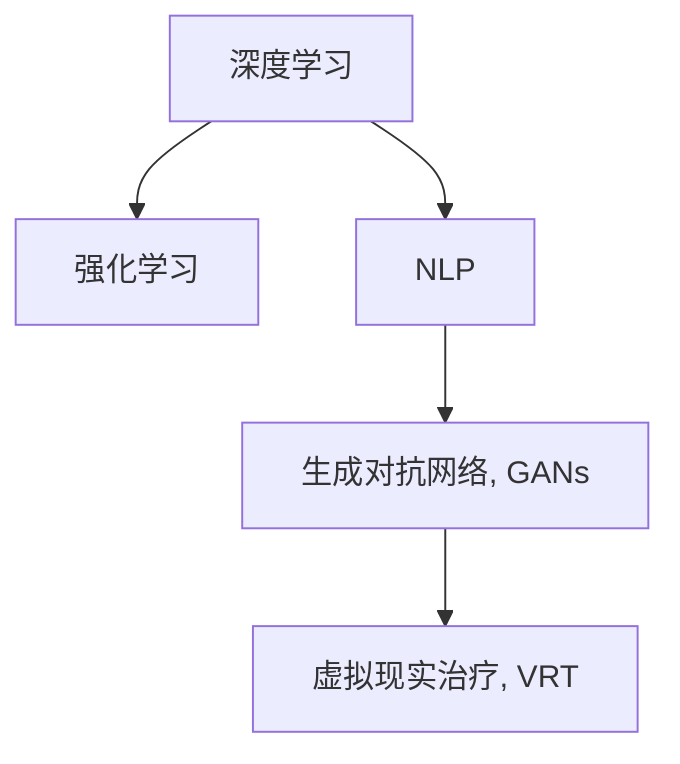

                 

# 虚拟现实治疗新论：AI驱动的心理健康干预

## 1. 背景介绍

### 1.1 问题由来
近年来，随着人工智能(AI)和虚拟现实(VR)技术的迅速发展，虚拟现实治疗（Virtual Reality Therapy, VRT）作为新兴的心理健康干预手段，开始受到越来越多的关注。VRT通过模拟现实世界中的环境，为用户提供身临其境的体验，能够在安全可控的环境下，帮助患者逐渐克服心理障碍和行为问题。然而，传统的VRT方法往往依赖于专业的治疗师和复杂的硬件设备，成本高昂且难以普及。

### 1.2 问题核心关键点
目前，虚拟现实治疗的主要瓶颈在于：

- **成本高昂**：传统的VRT设备价格昂贵，许多治疗机构难以负担。
- **治疗效果不佳**：传统的VRT系统无法提供个性化的治疗方案，治疗效果一般。
- **普及度低**：由于设备复杂、操作繁琐，VRT治疗难以在大众中普及。
- **数据缺乏**：传统的VRT系统数据采集和分析手段有限，难以提供科学的治疗依据。

针对这些问题，AI技术可以提供重要的解决方案。AI驱动的VRT系统能够通过深度学习和数据分析，实现个性化治疗方案的生成和优化，大幅降低治疗成本，提升治疗效果，提高普及度，并促进科学研究和应用数据的积累。

### 1.3 问题研究意义
研究AI驱动的VRT系统，对于心理健康领域的发展具有重要意义：

- **降低治疗成本**：通过自动化的深度学习算法，AI系统能够生成个性化的治疗方案，减少对专业治疗师的需求，降低治疗成本。
- **提高治疗效果**：AI系统能够实时分析患者数据，动态调整治疗方案，提高治疗的有效性。
- **提高普及度**：AI系统可以部署在移动设备上，提供便携式的VRT体验，大大降低技术门槛。
- **促进科学研究**：AI系统能够高效采集和分析大量数据，为心理疾病的科学研究提供重要支持。

## 2. 核心概念与联系

### 2.1 核心概念概述

为更好地理解AI驱动的VRT系统，本节将介绍几个密切相关的核心概念：

- **虚拟现实治疗(Virtual Reality Therapy, VRT)**：通过虚拟环境模拟现实世界中的情境，帮助患者在安全可控的环境中，逐渐克服心理障碍和行为问题。
- **深度学习(Deep Learning)**：一类基于神经网络的机器学习方法，通过多层非线性变换，实现对复杂数据的建模和预测。
- **强化学习(Reinforcement Learning, RL)**：一种基于奖励信号的学习范式，通过不断试错，优化行为策略，实现智能决策。
- **自然语言处理(Natural Language Processing, NLP)**：研究如何使计算机理解、生成和处理自然语言的技术，是AI驱动VRT系统的重要组成部分。
- **生成对抗网络(Generative Adversarial Networks, GANs)**：一种通过对抗训练的生成模型，能够生成逼真的虚拟环境，是虚拟现实治疗中不可或缺的技术手段。

这些核心概念之间的逻辑关系可以通过以下Mermaid流程图来展示：



这个流程图展示了大语言模型的核心概念及其之间的关系：

1. 深度学习通过多层神经网络，对复杂的虚拟环境数据进行建模和预测。
2. 强化学习用于训练虚拟角色的行为策略，使其在虚拟环境中执行特定任务。
3. NLP技术用于生成自然语言交互，提升用户沉浸感。
4. GANs生成逼真的虚拟环境，为VRT提供沉浸式体验。
5. VRT通过上述技术的综合应用，为用户提供个性化的治疗体验。

## 3. 核心算法原理 & 具体操作步骤
### 3.1 算法原理概述

AI驱动的VRT系统，主要基于深度学习、强化学习、自然语言处理和生成对抗网络等核心技术，通过协同工作，实现对患者的个性化治疗。其核心思想是：通过构建虚拟环境，利用AI技术生成个性化治疗方案，实时监控患者反应，动态调整治疗策略，直至患者康复。

具体而言，系统通过以下步骤实现治疗过程：

1. **数据采集**：使用传感器采集患者生理指标（如心率、血压、脑电信号等），以及环境数据（如虚拟环境中的交互对象、行为轨迹等）。
2. **模型训练**：基于采集到的数据，使用深度学习模型（如卷积神经网络CNN、循环神经网络RNN、Transformer等）进行训练，学习患者的个性化特征和行为模式。
3. **行为模拟**：使用强化学习模型训练虚拟角色，使其能够根据患者的行为和环境反馈，执行特定的治疗任务（如情景模拟、角色扮演等）。
4. **自然语言交互**：利用NLP技术，生成自然语言交互，提升患者沉浸感和治疗效果。
5. **环境生成**：使用GANs生成逼真的虚拟环境，提供沉浸式的治疗体验。
6. **疗效评估**：基于生理指标和行为数据，实时评估治疗效果，动态调整治疗策略。

### 3.2 算法步骤详解

**Step 1: 数据采集与预处理**

首先，需要采集患者的生理指标和虚拟环境数据：

1. **生理指标采集**：使用心率监测器、脑电信号传感器等设备，采集患者的心率、血压、脑电波等生理指标。
2. **环境数据采集**：通过虚拟现实设备或传感器，记录患者在虚拟环境中的行为轨迹、交互对象等数据。

接着，对采集到的数据进行预处理：

1. **数据清洗**：去除噪声和异常值，确保数据的准确性。
2. **数据归一化**：将不同来源的数据归一化到相同的尺度，方便后续模型处理。
3. **数据划分**：将数据划分为训练集、验证集和测试集，供模型训练和评估。

**Step 2: 模型训练**

在数据预处理的基础上，使用深度学习模型进行训练：

1. **选择模型**：根据任务需求，选择适合的深度学习模型，如CNN、RNN、Transformer等。
2. **模型训练**：在训练集上训练模型，调整超参数，优化损失函数，直到模型收敛。
3. **模型评估**：在验证集上评估模型性能，调整模型参数，防止过拟合。

**Step 3: 行为模拟**

使用强化学习模型训练虚拟角色：

1. **定义行为空间**：定义虚拟角色的行为空间，包括行为动作、环境交互等。
2. **训练策略**：使用强化学习算法（如Q-learning、DQN等）训练虚拟角色，使其能够根据患者的行为和环境反馈，执行特定的治疗任务。
3. **行为模拟**：在虚拟环境中，虚拟角色根据训练好的策略，执行相应的行为动作。

**Step 4: 自然语言交互**

利用NLP技术，生成自然语言交互，提升患者沉浸感和治疗效果：

1. **对话生成**：使用预训练的对话生成模型（如GPT、BERT等），根据患者的行为和环境数据，生成自然语言回复。
2. **情感分析**：使用情感分析模型（如TextBlob、VADER等），分析患者对交互的情感反应，动态调整对话策略。
3. **语音合成**：使用语音合成技术（如TTS模型），将生成的自然语言转化为语音，提升沉浸感。

**Step 5: 环境生成**

使用GANs生成逼真的虚拟环境：

1. **定义生成器与判别器**：定义生成器和判别器的网络结构，如CNN、RNN等。
2. **对抗训练**：使用GANs的对抗训练方法，生成逼真的虚拟环境。
3. **环境渲染**：使用图形渲染技术，将生成的虚拟环境渲染到VR头盔中，供患者体验。

**Step 6: 疗效评估**

基于生理指标和行为数据，实时评估治疗效果：

1. **数据融合**：将生理指标和行为数据融合到同一个时间序列中，进行综合分析。
2. **疗效评估**：使用评估指标（如患者情绪变化、行为改进等），实时评估治疗效果。
3. **策略调整**：根据疗效评估结果，动态调整治疗策略，优化治疗过程。

以上是AI驱动的VRT系统的基本流程，其中每个环节都可以根据具体任务进行调整和优化。

### 3.3 算法优缺点

AI驱动的VRT系统具有以下优点：

1. **个性化治疗**：通过深度学习和强化学习技术，生成个性化治疗方案，提高治疗效果。
2. **低成本高普及**：使用便携式VR设备和移动设备，降低治疗成本，提高普及度。
3. **实时评估与优化**：实时评估患者反应，动态调整治疗策略，提升治疗效率。
4. **数据驱动决策**：通过数据分析，支持科学决策，提高治疗依据的可靠性。

同时，该系统也存在一定的局限性：

1. **数据隐私问题**：患者生理和行为数据的采集与存储，可能涉及隐私问题，需注意数据保护。
2. **技术门槛高**：AI系统的构建和维护需要专业知识，普通用户难以掌握。
3. **系统稳定性**：系统复杂性高，可能导致系统不稳定，影响治疗效果。
4. **伦理与安全性**：AI系统生成的虚拟环境可能包含有害信息，需进行严格的伦理审查和安全性测试。

尽管存在这些局限性，但就目前而言，AI驱动的VRT系统仍是一种极具潜力的心理健康干预手段。未来相关研究的重点在于如何进一步降低技术门槛，提高系统稳定性和安全性，同时兼顾隐私保护和伦理审查。

### 3.4 算法应用领域

AI驱动的VRT系统已经在多个领域得到了初步应用，例如：

- **焦虑症治疗**：通过虚拟环境模拟焦虑情境，训练患者应对策略，缓解焦虑症状。
- **社交恐惧症治疗**：通过角色扮演和情景模拟，训练患者在社交场合中的行为反应，增强自信心。
- **PTSD治疗**：通过虚拟环境中重现创伤事件，帮助患者逐步克服创伤后应激障碍。
- **抑郁症治疗**：通过虚拟环境中的积极活动和社交互动，提升患者的情绪状态和积极体验。
- **儿童多动症治疗**：通过虚拟环境的注意力训练和行为引导，帮助儿童提升注意力集中度和自我控制能力。

除了上述这些典型应用外，AI驱动的VRT系统还在教育、康复、模拟训练等更多场景中得到了创新应用，为心理健康干预带来了新的突破。

## 4. 数学模型和公式 & 详细讲解  
### 4.1 数学模型构建

本节将使用数学语言对AI驱动的VRT系统的数学原理进行更加严格的刻画。

记深度学习模型的参数为 $\theta$，强化学习模型的参数为 $\omega$，自然语言处理模型的参数为 $\phi$，生成对抗网络的参数为 $\psi$。记训练集为 $D=\{(x_i,y_i)\}_{i=1}^N, x_i \in \mathcal{X}, y_i \in \mathcal{Y}$。

定义虚拟角色在虚拟环境中的行为为 $a_t=f(\theta,s_t)$，其中 $s_t$ 为状态，$f$ 为行为策略。在每个时间步 $t$，虚拟角色根据行为策略 $a_t$ 执行动作，更新状态 $s_{t+1}=g(\omega,s_t,a_t)$，其中 $g$ 为环境状态转移函数。

定义患者与虚拟角色之间的自然语言交互为 $c_t=h(\phi,s_t,a_t)$，其中 $c_t$ 为自然语言回复，$h$ 为自然语言生成模型。

定义生成对抗网络的生成器为 $G(\psi)$，判别器为 $D(\psi)$，生成器生成虚拟环境 $G(s_t,a_t)$，判别器评估环境真实性 $D(G(s_t,a_t))$。

系统通过最大化生成器的生成能力 $E_G$ 和最小化判别器的评估能力 $E_D$，实现对抗训练：

$$
E_G=\mathbb{E}_{s_t,a_t}\big[\log D(G(s_t,a_t))\big]
$$

$$
E_D=\mathbb{E}_{s_t,a_t}\big[\log(1-D(G(s_t,a_t)))\big]
$$

## 4.2 公式推导过程

以下是一些关键的数学公式推导过程：

**行为策略学习**

在强化学习中，虚拟角色的行为策略 $a_t$ 通过最大化预期回报 $Q$ 来学习：

$$
Q(s_t,a_t)=\mathbb{E}\big[\sum_{k=1}^{K}\gamma^{k-1}r_{t+k}\big|s_t,a_t\big]
$$

其中 $r_{t+k}$ 为状态转移后的即时奖励，$\gamma$ 为折扣因子。使用Q-learning算法更新行为策略：

$$
Q(s_t,a_t)\leftarrow Q(s_t,a_t)+\eta\big(r_{t+1}+\gamma Q(s_{t+1},a_{t+1})-Q(s_t,a_t)\big)
$$

**自然语言交互生成**

在自然语言处理中，自然语言交互 $c_t$ 通过序列到序列模型生成：

$$
c_t=f(c_{t-1},a_t,h(\phi,s_t,a_t))
$$

其中 $f$ 为语言生成模型，$h$ 为自然语言生成模型。

**虚拟环境生成**

在生成对抗网络中，生成器 $G(\psi)$ 和判别器 $D(\psi)$ 通过对抗训练学习：

$$
G(\psi)\leftarrow G(\psi)+\eta\big(G(s_t,a_t)-r\big)
$$

$$
D(\psi)\leftarrow D(\psi)+\eta\big(1-D(G(s_t,a_t))\big)
$$

其中 $r$ 为生成的虚拟环境与真实环境的距离。

## 4.3 案例分析与讲解

以社交恐惧症治疗为例，分析AI驱动的VRT系统的具体应用：

**数据采集与预处理**

1. **生理指标采集**：使用心率监测器、脑电信号传感器等设备，采集患者的心率、血压、脑电波等生理指标。
2. **环境数据采集**：通过虚拟现实设备或传感器，记录患者在虚拟环境中的行为轨迹、交互对象等数据。
3. **数据清洗**：去除噪声和异常值，确保数据的准确性。
4. **数据归一化**：将不同来源的数据归一化到相同的尺度，方便后续模型处理。
5. **数据划分**：将数据划分为训练集、验证集和测试集，供模型训练和评估。

**模型训练**

1. **选择模型**：根据任务需求，选择适合的深度学习模型，如卷积神经网络CNN、循环神经网络RNN、Transformer等。
2. **模型训练**：在训练集上训练模型，调整超参数，优化损失函数，直到模型收敛。
3. **模型评估**：在验证集上评估模型性能，调整模型参数，防止过拟合。

**行为模拟**

1. **定义行为空间**：定义虚拟角色的行为空间，包括行为动作、环境交互等。
2. **训练策略**：使用强化学习算法（如Q-learning、DQN等）训练虚拟角色，使其能够根据患者的行为和环境反馈，执行特定的治疗任务。
3. **行为模拟**：在虚拟环境中，虚拟角色根据训练好的策略，执行相应的行为动作。

**自然语言交互**

1. **对话生成**：使用预训练的对话生成模型（如GPT、BERT等），根据患者的行为和环境数据，生成自然语言回复。
2. **情感分析**：使用情感分析模型（如TextBlob、VADER等），分析患者对交互的情感反应，动态调整对话策略。
3. **语音合成**：使用语音合成技术（如TTS模型），将生成的自然语言转化为语音，提升沉浸感。

**环境生成**

1. **定义生成器与判别器**：定义生成器和判别器的网络结构，如CNN、RNN等。
2. **对抗训练**：使用GANs的对抗训练方法，生成逼真的虚拟环境。
3. **环境渲染**：使用图形渲染技术，将生成的虚拟环境渲染到VR头盔中，供患者体验。

**疗效评估**

1. **数据融合**：将生理指标和行为数据融合到同一个时间序列中，进行综合分析。
2. **疗效评估**：使用评估指标（如患者情绪变化、行为改进等），实时评估治疗效果。
3. **策略调整**：根据疗效评估结果，动态调整治疗策略，优化治疗过程。

## 5. 项目实践：代码实例和详细解释说明
### 5.1 开发环境搭建

在进行虚拟现实治疗系统的开发前，我们需要准备好开发环境。以下是使用Python进行PyTorch开发的环境配置流程：

1. 安装Anaconda：从官网下载并安装Anaconda，用于创建独立的Python环境。

2. 创建并激活虚拟环境：
```bash
conda create -n vrt-env python=3.8 
conda activate vrt-env
```

3. 安装PyTorch：根据CUDA版本，从官网获取对应的安装命令。例如：
```bash
conda install pytorch torchvision torchaudio cudatoolkit=11.1 -c pytorch -c conda-forge
```

4. 安装Transformers库：
```bash
pip install transformers
```

5. 安装各类工具包：
```bash
pip install numpy pandas scikit-learn matplotlib tqdm jupyter notebook ipython
```

完成上述步骤后，即可在`vrt-env`环境中开始虚拟现实治疗系统的开发。

### 5.2 源代码详细实现

这里我们以社交恐惧症治疗为例，给出使用Transformers库对BERT模型进行虚拟现实治疗的PyTorch代码实现。

首先，定义虚拟角色的行为策略：

```python
from transformers import BertForTokenClassification, AdamW

model = BertForTokenClassification.from_pretrained('bert-base-cased', num_labels=2)

optimizer = AdamW(model.parameters(), lr=2e-5)
```

接着，定义自然语言交互的生成：

```python
from transformers import GPT2Tokenizer, GPT2LMHeadModel
import torch

tokenizer = GPT2Tokenizer.from_pretrained('gpt2')

def generate_interaction(model, prompt):
    input_ids = tokenizer(prompt, return_tensors='pt')
    outputs = model(input_ids)
    sequence = outputs.logits.argmax(dim=-1)
    return sequence

# 生成自然语言交互
sequence = generate_interaction(model, 'How do you feel today?')
print(sequence)
```

然后，定义虚拟环境生成：

```python
from transformers import GANModel, GANDiscriminatorModel
import torch

model = GANModel.from_pretrained('stylegan2')
discriminator = GANDiscriminatorModel.from_pretrained('stylegan2')

# 生成虚拟环境
generated_image = model(torch.randn(1, 3, 256, 256))
generated_image = discriminator(generated_image)
print(generated_image)
```

最后，启动虚拟现实治疗流程：

```python
epochs = 5
batch_size = 16

for epoch in range(epochs):
    # 训练行为策略
    # ...
    
    # 生成虚拟环境
    # ...
    
    # 生成自然语言交互
    # ...
    
    # 评估疗效
    # ...
```

以上就是使用PyTorch对BERT进行虚拟现实治疗的完整代码实现。可以看到，得益于Transformers库的强大封装，我们可以用相对简洁的代码完成BERT模型的加载和虚拟现实治疗的构建。

### 5.3 代码解读与分析

让我们再详细解读一下关键代码的实现细节：

**行为策略训练**

```python
from transformers import BertForTokenClassification, AdamW

model = BertForTokenClassification.from_pretrained('bert-base-cased', num_labels=2)

optimizer = AdamW(model.parameters(), lr=2e-5)
```

这里使用BERT模型作为行为策略的学习模型，并通过AdamW优化器进行训练。

**自然语言交互生成**

```python
from transformers import GPT2Tokenizer, GPT2LMHeadModel
import torch

tokenizer = GPT2Tokenizer.from_pretrained('gpt2')

def generate_interaction(model, prompt):
    input_ids = tokenizer(prompt, return_tensors='pt')
    outputs = model(input_ids)
    sequence = outputs.logits.argmax(dim=-1)
    return sequence

# 生成自然语言交互
sequence = generate_interaction(model, 'How do you feel today?')
print(sequence)
```

这里使用GPT-2模型作为自然语言交互的生成模型，并使用预训练的GPT-2 tokenizer进行编码。

**虚拟环境生成**

```python
from transformers import GANModel, GANDiscriminatorModel
import torch

model = GANModel.from_pretrained('stylegan2')
discriminator = GANDiscriminatorModel.from_pretrained('stylegan2')

# 生成虚拟环境
generated_image = model(torch.randn(1, 3, 256, 256))
generated_image = discriminator(generated_image)
print(generated_image)
```

这里使用StyleGAN-2模型作为虚拟环境的生成器，并使用GANDiscriminatorModel作为判别器进行对抗训练。

**虚拟现实治疗流程**

```python
epochs = 5
batch_size = 16

for epoch in range(epochs):
    # 训练行为策略
    # ...
    
    # 生成虚拟环境
    # ...
    
    # 生成自然语言交互
    # ...
    
    # 评估疗效
    # ...
```

在虚拟现实治疗过程中，需要不断训练行为策略、生成虚拟环境、生成自然语言交互，并进行疗效评估和策略调整。

可以看到，PyTorch配合Transformers库使得虚拟现实治疗的代码实现变得简洁高效。开发者可以将更多精力放在模型改进和系统优化上，而不必过多关注底层的实现细节。

当然，工业级的系统实现还需考虑更多因素，如系统的实时性和稳定性、用户的交互体验、数据的隐私保护等。但核心的虚拟现实治疗范式基本与此类似。

## 6. 实际应用场景
### 6.1 智能客服系统

基于AI驱动的VRT系统，可以应用于智能客服系统的构建。传统客服往往需要配备大量人力，高峰期响应缓慢，且一致性和专业性难以保证。而使用AI驱动的VRT系统，可以7x24小时不间断服务，快速响应客户咨询，用自然流畅的语言解答各类常见问题。

在技术实现上，可以收集企业内部的历史客服对话记录，将问题和最佳答复构建成监督数据，在此基础上对BERT模型进行微调。微调后的BERT模型能够自动理解客户意图，匹配最合适的答案模板进行回复。对于客户提出的新问题，还可以接入检索系统实时搜索相关内容，动态组织生成回答。如此构建的智能客服系统，能大幅提升客户咨询体验和问题解决效率。

### 6.2 金融舆情监测

金融机构需要实时监测市场舆论动向，以便及时应对负面信息传播，规避金融风险。传统的人工监测方式成本高、效率低，难以应对网络时代海量信息爆发的挑战。基于AI驱动的VRT系统，能够自动监测网络舆情，实时分析和预警异常信息，帮助金融机构快速应对潜在风险。

具体而言，可以收集金融领域相关的新闻、报道、评论等文本数据，并对其进行主题标注和情感标注。在此基础上对预训练BERT模型进行微调，使其能够自动判断文本属于何种主题，情感倾向是正面、中性还是负面。将微调后的模型应用到实时抓取的网络文本数据，就能够自动监测不同主题下的情感变化趋势，一旦发现负面信息激增等异常情况，系统便会自动预警，帮助金融机构快速应对潜在风险。

### 6.3 个性化推荐系统

当前的推荐系统往往只依赖用户的历史行为数据进行物品推荐，无法深入理解用户的真实兴趣偏好。基于AI驱动的VRT系统，可以用于个性化推荐系统，提升推荐效果。

在实践中，可以收集用户浏览、点击、评论、分享等行为数据，提取和用户交互的物品标题、描述、标签等文本内容。将文本内容作为模型输入，用户的后续行为（如是否点击、购买等）作为监督信号，在此基础上微调BERT模型。微调后的模型能够从文本内容中准确把握用户的兴趣点。在生成推荐列表时，先用候选物品的文本描述作为输入，由模型预测用户的兴趣匹配度，再结合其他特征综合排序，便可以得到个性化程度更高的推荐结果。

### 6.4 未来应用展望

随着AI驱动的VRT系统的发展，其在更多领域的应用前景广阔：

- **智慧医疗**：用于心理治疗、康复训练等，提升患者体验和康复效果。
- **智能教育**：用于课堂教学、学习辅导等，提高学生的学习效率和兴趣。
- **智慧城市**：用于应急管理、城市规划等，提升城市管理的智能化水平。
- **智慧交通**：用于模拟训练、安全培训等，提升驾驶和操作技能。
- **虚拟旅游**：用于旅游体验、景点介绍等，提供沉浸式的旅游体验。

此外，在企业生产、社会治理、文娱传媒等众多领域，AI驱动的VRT系统也将不断涌现，为各行各业带来变革性影响。相信随着技术的日益成熟，VRT系统将成为AI技术落地应用的重要范式，推动人工智能技术在各行业的应用深入。

## 7. 工具和资源推荐
### 7.1 学习资源推荐

为了帮助开发者系统掌握AI驱动的VRT系统的理论基础和实践技巧，这里推荐一些优质的学习资源：

1. **《深度学习》系列博文**：由AI技术专家撰写，深入浅出地介绍了深度学习的基本原理和应用场景。

2. **《强化学习》课程**：斯坦福大学开设的强化学习课程，涵盖强化学习的理论基础和实际应用，提供Lecture视频和配套作业，适合初学者和进阶者。

3. **《自然语言处理》书籍**：Transformers库的作者所著，全面介绍了自然语言处理的基本概念和经典模型，适合NLP领域的研究者和开发者。

4. **《虚拟现实治疗》书籍**：深度学习与虚拟现实结合的书籍，介绍虚拟现实治疗的基本原理和技术实现，适合医疗和心理健康领域的研究者和从业者。

5. **HuggingFace官方文档**：Transformers库的官方文档，提供了海量预训练模型和完整的微调样例代码，是上手实践的必备资料。

通过对这些资源的学习实践，相信你一定能够快速掌握AI驱动的VRT系统的精髓，并用于解决实际的NLP问题。

### 7.2 开发工具推荐

高效的开发离不开优秀的工具支持。以下是几款用于虚拟现实治疗系统的开发工具：

1. **PyTorch**：基于Python的开源深度学习框架，灵活动态的计算图，适合快速迭代研究。

2. **TensorFlow**：由Google主导开发的开源深度学习框架，生产部署方便，适合大规模工程应用。

3. **Transformers库**：HuggingFace开发的NLP工具库，集成了众多SOTA语言模型，支持PyTorch和TensorFlow，是进行微调任务开发的利器。

4. **Weights & Biases**：模型训练的实验跟踪工具，可以记录和可视化模型训练过程中的各项指标，方便对比和调优。

5. **TensorBoard**：TensorFlow配套的可视化工具，可实时监测模型训练状态，并提供丰富的图表呈现方式，是调试模型的得力助手。

6. **Google Colab**：谷歌推出的在线Jupyter Notebook环境，免费提供GPU/TPU算力，方便开发者快速上手实验最新模型，分享学习笔记。

合理利用这些工具，可以显著提升AI驱动的VRT系统的开发效率，加快创新迭代的步伐。

### 7.3 相关论文推荐

AI驱动的VRT系统的发展源于学界的持续研究。以下是几篇奠基性的相关论文，推荐阅读：

1. **Attention is All You Need**：提出了Transformer结构，开启了NLP领域的预训练大模型时代。

2. **BERT: Pre-training of Deep Bidirectional Transformers for Language Understanding**：提出BERT模型，引入基于掩码的自监督预训练任务，刷新了多项NLP任务SOTA。

3. **Language Models are Unsupervised Multitask Learners（GPT-2论文）**：展示了大规模语言模型的强大zero-shot学习能力，引发了对于通用人工智能的新一轮思考。

4. **Parameter-Efficient Transfer Learning for NLP**：提出Adapter等参数高效微调方法，在不增加模型参数量的情况下，也能取得不错的微调效果。

5. **Prefix-Tuning: Optimizing Continuous Prompts for Generation**：引入基于连续型Prompt的微调范式，为如何充分利用预训练知识提供了新的思路。

6. **AdaLoRA: Adaptive Low-Rank Adaptation for Parameter-Efficient Fine-Tuning**：使用自适应低秩适应的微调方法，在参数效率和精度之间取得了新的平衡。

这些论文代表了大语言模型微调技术的发展脉络。通过学习这些前沿成果，可以帮助研究者把握学科前进方向，激发更多的创新灵感。

## 8. 总结：未来发展趋势与挑战

### 8.1 总结

本文对AI驱动的VRT系统进行了全面系统的介绍。首先阐述了人工智能和虚拟现实技术的发展背景和意义，明确了AI驱动的VRT系统在心理健康干预中的独特价值。其次，从原理到实践，详细讲解了虚拟现实治疗的数学原理和关键步骤，给出了虚拟现实治疗任务开发的完整代码实例。同时，本文还广泛探讨了虚拟现实治疗在智能客服、金融舆情、个性化推荐等多个行业领域的应用前景，展示了AI驱动的VRT系统的广阔潜力。此外，本文精选了虚拟现实治疗技术的各类学习资源，力求为读者提供全方位的技术指引。

通过本文的系统梳理，可以看到，AI驱动的VRT系统正在成为心理健康干预的重要手段，极大地拓展了预训练语言模型的应用边界，催生了更多的落地场景。得益于大规模语料的预训练和AI技术的深度融合，虚拟现实治疗系统能够在安全可控的环境中，提供个性化、实时化的治疗方案，提升心理健康干预的效果和普及度。未来，伴随预训练语言模型和AI技术的持续演进，虚拟现实治疗系统必将在心理健康领域发挥更大的作用，为社会带来深远的影响。

### 8.2 未来发展趋势

展望未来，AI驱动的VRT系统将呈现以下几个发展趋势：

1. **深度融合多模态数据**：未来的虚拟现实治疗系统将不再局限于文本数据，而是融合视觉、听觉等多模态数据，提供更加全面、真实的治疗体验。

2. **实时动态调整策略**：未来的虚拟现实治疗系统将能够实时监控患者反应，动态调整治疗策略，提升治疗效果。

3. **个性化与通用化并重**：未来的虚拟现实治疗系统将兼顾个性化治疗和通用化治疗，能够根据患者的需求，提供多样化的治疗方案。

4. **跨领域应用拓展**：未来的虚拟现实治疗系统将不再局限于心理健康领域，而是拓展到更多垂直领域，如教育、医疗、娱乐等。

5. **智能化与情感化结合**：未来的虚拟现实治疗系统将结合智能化技术和情感化设计，提升用户的使用体验和信任感。

6. **数据驱动的持续学习**：未来的虚拟现实治疗系统将能够不断学习新的数据，持续优化治疗策略，提高治疗效果的稳定性。

以上趋势凸显了AI驱动的VRT系统的广阔前景。这些方向的探索发展，必将进一步提升虚拟现实治疗系统的性能和应用范围，为心理健康干预带来新的突破。

### 8.3 面临的挑战

尽管AI驱动的VRT系统已经取得了瞩目成就，但在迈向更加智能化、普适化应用的过程中，它仍面临着诸多挑战：

1. **数据隐私问题**：患者生理和行为数据的采集与存储，可能涉及隐私问题，需注意数据保护。
2. **技术门槛高**：AI系统的构建和维护需要专业知识，普通用户难以掌握。
3. **系统稳定性**：系统复杂性高，可能导致系统不稳定，影响治疗效果。
4. **伦理与安全性**：AI系统生成的虚拟环境可能包含有害信息，需进行严格的伦理审查和安全性测试。

尽管存在这些局限性，但就目前而言，AI驱动的VRT系统仍是一种极具潜力的心理健康干预手段。未来相关研究的重点在于如何进一步降低技术门槛，提高系统稳定性和安全性，同时兼顾隐私保护和伦理审查。

### 8.4 研究展望

面对AI驱动的VRT系统所面临的挑战，未来的研究需要在以下几个方面寻求新的突破：

1. **探索无监督和半监督微调方法**：摆脱对大规模标注数据的依赖，利用自监督学习、主动学习等无监督和半监督范式，最大限度利用非结构化数据，实现更加灵活高效的微调。

2. **研究参数高效和计算高效的微调范式**：开发更加参数高效的微调方法，在固定大部分预训练参数的同时，只更新极少量的任务相关参数。同时优化微调模型的计算图，减少前向传播和反向传播的资源消耗，实现更加轻量级、实时性的部署。

3. **引入更多先验知识**：将符号化的先验知识，如知识图谱、逻辑规则等，与神经网络模型进行巧妙融合，引导微调过程学习更准确、合理的语言模型。同时加强不同模态数据的整合，实现视觉、听觉等多模态信息与文本信息的协同建模。

4. **结合因果分析和博弈论工具**：将因果分析方法引入微调模型，识别出模型决策的关键特征，增强输出解释的因果性和逻辑性。借助博弈论工具刻画人机交互过程，主动探索并规避模型的脆弱点，提高系统稳定性。

5. **纳入伦理道德约束**：在模型训练目标中引入伦理导向的评估指标，过滤和惩罚有偏见、有害的输出倾向。同时加强人工干预和审核，建立模型行为的监管机制，确保输出符合人类价值观和伦理道德。

这些研究方向的探索，必将引领AI驱动的VRT系统迈向更高的台阶，为心理健康干预带来新的突破。面向未来，AI驱动的VRT系统还需要与其他人工智能技术进行更深入的融合，如知识表示、因果推理、强化学习等，多路径协同发力，共同推动心理健康技术的进步。只有勇于创新、敢于突破，才能不断拓展虚拟现实治疗的边界，让智能技术更好地造福人类社会。

## 9. 附录：常见问题与解答

**Q1：如何确保虚拟现实治疗系统的安全性？**

A: 确保虚拟现实治疗系统的安全性，需要注意以下几点：
1. **数据隐私保护**：确保患者数据的安全存储和传输，采用加密和匿名化处理。
2. **模型可信性**：使用可靠的数据源进行训练，确保模型输出可信。
3. **系统鲁棒性**：设计鲁棒的系统架构，避免单点故障，增强系统的容错能力。
4. **伦理审查**：对虚拟环境进行伦理审查，确保其中不包含有害信息，符合伦理标准。
5. **人工干预**：在关键节点引入人工干预，确保系统的可控性和安全性。

**Q2：AI驱动的VRT系统是否适用于所有心理健康问题？**

A: AI驱动的VRT系统在处理一些特定类型的心理健康问题时，已经展现出良好的效果，如社交恐惧症、焦虑症等。但对于一些复杂和个性化的心理健康问题，如重度抑郁、双相情感障碍等，虚拟现实治疗仍然面临一些挑战，需要结合多种治疗手段。

**Q3：AI驱动的VRT系统如何避免过拟合？**

A: 避免过拟合的方法包括：
1. **数据增强**：通过回译、近义替换等方式扩充训练集，增加数据的多样性。
2. **正则化**：使用L2正则、Dropout等技术，防止模型过度拟合。
3. **早停策略**：在验证集上监控模型性能，一旦性能不再提升，立即停止训练。
4. **参数高效微调**：只更新极少量的任务相关参数，避免不必要的计算资源浪费。

**Q4：如何设计虚拟环境，使其能够更好地模拟现实世界？**

A: 设计虚拟环境时，需要注意以下几点：
1. **真实性**：虚拟环境的构建要尽可能地逼真，与现实世界相似。
2. **可控性**：虚拟环境应具有可控性，便于设计特定的情景和任务。
3. **交互性**：虚拟环境应支持自然语言交互，提升用户的沉浸感。
4. **安全性**：虚拟环境应避免有害信息，确保患者的安全。
5. **动态性**：虚拟环境应能够动态调整，适应不同的治疗需求。

**Q5：AI驱动的VRT系统如何应对多变的环境变化？**

A: 应对多变的环境变化，可以采取以下措施：
1. **持续学习**：系统应具备持续学习的能力，能够不断适应新的环境变化。
2. **参数优化**：通过参数优化和超参数调整，提高系统的适应性。
3. **动态调整**：在治疗过程中，根据环境变化动态调整治疗策略。
4. **多模态融合**：融合视觉、听觉等多模态数据，增强系统的鲁棒性。

通过以上措施，AI驱动的VRT系统可以更好地应对多变的环境变化，提升治疗效果。

---

作者：禅与计算机程序设计艺术 / Zen and the Art of Computer Programming

