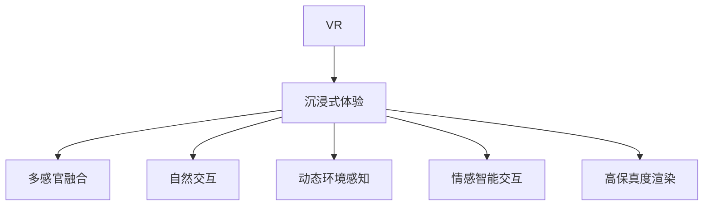

                 

# 虚拟现实（VR）开发：沉浸式体验设计

## 1. 背景介绍

### 1.1 问题由来
近年来，随着计算机图形学、传感器技术、人工智能和神经科学等领域的长足进步，虚拟现实（Virtual Reality, VR）技术正在以前所未有的速度发展，其应用场景从游戏娱乐拓展到医疗健康、军事训练、教育培训、房地产等多个行业。如何设计出沉浸式体验丰富的VR内容，成为了VR开发者必须面对的重大挑战。

### 1.2 问题核心关键点
沉浸式体验是VR内容的灵魂所在，其核心关键点包括：

- 高度的真实感和自然交互：用户应当能够在VR环境中感受到仿佛真实的物理世界，并且能够自然流畅地进行交互操作。
- 多感官融合：结合视觉、听觉、触觉等多种感官，提供更为丰富和沉浸的体验。
- 动态环境感知：VR环境应当能够根据用户的行为和状态实时调整，增强临场感。
- 情感智能交互：通过情感分析和智能推理，提供与用户情感状态相匹配的交互反馈。
- 高保真度渲染：高品质的3D建模和贴图，增强场景的真实感和细节表现。

### 1.3 问题研究意义
深入研究VR开发中的沉浸式体验设计，对于提升用户沉浸感和满意度，推动VR技术的商业化和普及，具有重要意义：

- 优化用户体验：沉浸式体验能够显著提高用户的参与度和满意度，增强用户对VR内容的忠诚度。
- 拓展应用范围：多感官融合和动态环境感知技术，能够拓展VR在医疗、教育、军事等领域的应用。
- 加速产业化进程：高保真度渲染和自然交互技术，有助于降低VR设备成本，提升用户使用便捷性。
- 推动技术创新：情感智能交互和智能推理技术，能够推动VR与AI的深度融合，拓展技术边界。

## 2. 核心概念与联系

### 2.1 核心概念概述

VR开发中，沉浸式体验设计的核心概念主要包括：

- **虚拟现实（VR）**：通过计算机图形学、传感器技术和人工智能等手段，模拟并重现一个三维虚拟世界，使用户能够沉浸其中。
- **沉浸式体验**：通过多感官融合和自然交互等手段，使用户在虚拟环境中感受到仿佛真实的物理世界。
- **多感官融合**：结合视觉、听觉、触觉等多种感官，增强用户对虚拟环境的感知和互动。
- **自然交互**：使用户能够自然地进行手势、语音等交互操作，减少操作负担。
- **动态环境感知**：根据用户行为和状态实时调整虚拟环境，增强临场感。
- **情感智能交互**：通过情感分析和智能推理，提供与用户情感状态相匹配的交互反馈。
- **高保真度渲染**：通过高质量的3D建模和贴图，增强场景的真实感和细节表现。

这些核心概念之间的逻辑关系可以通过以下Mermaid流程图来展示：



这个流程图展示了VR开发中沉浸式体验设计的核心概念及其之间的联系：

1. VR是沉浸式体验的基础，通过模拟一个三维虚拟世界来实现。
2. 多感官融合、自然交互、动态环境感知、情感智能交互和高保真度渲染都是沉浸式体验的重要组成部分，通过这些技术手段共同实现用户的沉浸感和满意度。

## 3. 核心算法原理 & 具体操作步骤
### 3.1 算法原理概述

沉浸式体验设计的核心在于如何通过计算机技术模拟并重现一个真实感强、交互自然、动态感丰富的虚拟世界。其算法原理主要包括以下几个方面：

- **多感官融合算法**：通过视觉、听觉、触觉等多种传感器的数据，融合计算出一个综合的多感官信号，提供更加自然和真实的体验。
- **自然交互算法**：利用手势识别、语音识别、眼动追踪等技术，实现用户自然流畅的交互操作。
- **动态环境感知算法**：通过传感器监测用户的行为和状态，实时调整虚拟环境，增强临场感和沉浸感。
- **情感智能交互算法**：通过情感分析和智能推理，提供与用户情感状态相匹配的交互反馈。
- **高保真度渲染算法**：通过高质量的3D建模和贴图技术，增强虚拟场景的真实感和细节表现。

### 3.2 算法步骤详解

沉浸式体验设计的一般步骤如下：

**Step 1: 准备开发环境**
- 选择合适的VR硬件平台，如Oculus Rift、HTC Vive等，并确保其兼容性。
- 安装必要的开发工具和插件，如Unity3D、Unreal Engine、OpenXR等。

**Step 2: 进行用户行为分析和需求收集**
- 通过问卷调查、用户访谈等方式，了解目标用户群体的行为习惯、兴趣偏好和需求。
- 根据用户反馈，设计合理的虚拟场景和交互模式。

**Step 3: 构建虚拟场景**
- 使用3D建模软件，如Blender、Maya等，创建高质量的虚拟场景。
- 利用纹理贴图、光照和阴影等技术，增强场景的真实感和细节表现。

**Step 4: 实现多感官融合**
- 使用VR硬件内置的传感器，如摄像头、陀螺仪、振动反馈装置等，采集用户的多感官数据。
- 使用信号处理算法，如滤波、融合等，计算出一个综合的多感官信号，用于实时调整虚拟环境。

**Step 5: 实现自然交互**
- 利用手势识别、语音识别、眼动追踪等技术，实现用户自然流畅的交互操作。
- 使用计算机视觉和深度学习技术，提高手势识别和语音识别的准确率和鲁棒性。

**Step 6: 实现动态环境感知**
- 通过传感器监测用户的行为和状态，实时调整虚拟环境，增强临场感和沉浸感。
- 利用机器学习算法，如强化学习、协同过滤等，优化环境感知和调整策略。

**Step 7: 实现情感智能交互**
- 通过情感分析和智能推理，提供与用户情感状态相匹配的交互反馈。
- 利用自然语言处理和情感计算技术，增强交互的自然性和情感性。

**Step 8: 进行多轮迭代和优化**
- 在初步实现沉浸式体验后，通过用户测试和反馈，不断优化和调整。
- 在用户体验评估和迭代过程中，进行不断的算法优化和模型改进。

### 3.3 算法优缺点

沉浸式体验设计的核心算法具有以下优点：

- 高度的真实感和自然交互：通过多感官融合和自然交互技术，增强用户对虚拟环境的感知和互动。
- 多感官融合：结合视觉、听觉、触觉等多种感官，提供更为丰富和沉浸的体验。
- 动态环境感知：通过实时调整虚拟环境，增强临场感和沉浸感。
- 情感智能交互：通过情感分析和智能推理，提供与用户情感状态相匹配的交互反馈。

然而，这些算法也存在一些局限性：

- 对硬件要求高：实现高保真度渲染和自然交互需要高性能的硬件支持，增加了设备成本。
- 计算复杂度高：多感官融合和动态环境感知涉及大量数据处理，对计算资源要求较高。
- 用户体验易疲劳：长时间沉浸在虚拟环境中，用户可能会出现视觉和听觉疲劳。
- 情感智能交互复杂：情感分析和智能推理算法尚未完全成熟，仍需进一步研究。

### 3.4 算法应用领域

沉浸式体验设计在多个领域得到了广泛应用，例如：

- 游戏娱乐：通过高度的真实感和自然交互，提升玩家的游戏体验和参与度。
- 医疗健康：通过模拟手术、康复训练等虚拟环境，增强治疗效果和患者体验。
- 教育培训：通过虚拟场景和交互，提供更加直观和生动的教学体验。
- 军事训练：通过模拟战场环境，提高士兵的实战能力和战术素养。
- 房地产：通过虚拟看房和房产展示，增强客户的体验感和决策力。

## 4. 数学模型和公式 & 详细讲解 & 举例说明

### 4.1 数学模型构建

沉浸式体验设计的数学模型主要涉及多感官融合、自然交互、动态环境感知和情感智能交互等方面。以下我们将分别介绍这些数学模型。

### 4.2 公式推导过程

#### 4.2.1 多感官融合

多感官融合的数学模型可以表示为：

$$
Y = \mathcal{F}(X_1, X_2, \dots, X_n)
$$

其中，$X_i$ 表示第 $i$ 种感官的数据，$Y$ 表示融合后的多感官信号。$\mathcal{F}$ 表示融合函数，可以使用加权平均、主成分分析（PCA）、卷积神经网络（CNN）等方法。

以手势识别为例，假设获取了用户的手部姿态数据 $X_1$ 和手势标签 $X_2$，融合函数 $\mathcal{F}$ 可以是：

$$
Y = \alpha_1 X_1 + \alpha_2 X_2
$$

其中 $\alpha_1$ 和 $\alpha_2$ 是不同的权值，可以根据实际情况进行调整。

#### 4.2.2 自然交互

自然交互的数学模型可以表示为：

$$
A = \mathcal{G}(X_1, X_2, \dots, X_n)
$$

其中，$X_i$ 表示第 $i$ 种交互数据，$A$ 表示交互行为。$\mathcal{G}$ 表示交互函数，可以使用深度学习模型如卷积神经网络（CNN）、循环神经网络（RNN）等。

以手势识别为例，假设获取了用户的手部姿态数据 $X_1$，融合函数 $\mathcal{G}$ 可以是：

$$
A = \mathcal{G}(X_1; \theta)
$$

其中 $\theta$ 表示模型的参数，可以使用深度学习框架如TensorFlow、PyTorch等进行训练和优化。

#### 4.2.3 动态环境感知

动态环境感知的数学模型可以表示为：

$$
C = \mathcal{H}(A, X_1, X_2, \dots, X_n)
$$

其中，$A$ 表示用户行为数据，$X_i$ 表示环境数据，$C$ 表示动态环境调整参数。$\mathcal{H}$ 表示感知函数，可以使用强化学习模型如Q-learning、深度强化学习（DRL）等。

以虚拟场景调整为例，假设获取了用户的行为数据 $A$ 和环境数据 $X_1$，感知函数 $\mathcal{H}$ 可以是：

$$
C = \mathcal{H}(A, X_1; \theta)
$$

其中 $\theta$ 表示模型的参数，可以使用强化学习框架如TensorFlow DDPG等进行训练和优化。

#### 4.2.4 情感智能交互

情感智能交互的数学模型可以表示为：

$$
S = \mathcal{I}(A, X_1, X_2, \dots, X_n)
$$

其中，$A$ 表示用户情感数据，$X_i$ 表示环境数据，$S$ 表示情感智能反馈。$\mathcal{I}$ 表示情感交互函数，可以使用情感计算模型如情感词典、情感分类器等。

以情感智能反馈为例，假设获取了用户的情感数据 $A$ 和环境数据 $X_1$，情感交互函数 $\mathcal{I}$ 可以是：

$$
S = \mathcal{I}(A, X_1; \theta)
$$

其中 $\theta$ 表示模型的参数，可以使用情感计算框架如Sentiment Analysis等进行训练和优化。

### 4.3 案例分析与讲解

以医疗虚拟现实为例，展示如何通过沉浸式体验设计提升用户体验。

**案例背景**：某医疗公司开发了一款用于手术模拟的VR系统，用户可以通过虚拟手术室进行手术操作。

**实现步骤**：

1. **准备开发环境**：选择合适的VR硬件平台，安装必要的开发工具和插件。
2. **用户行为分析和需求收集**：通过问卷调查和用户访谈，了解目标用户群体的行为习惯和需求。
3. **构建虚拟场景**：使用3D建模软件，创建手术室的虚拟场景。利用纹理贴图、光照和阴影等技术，增强场景的真实感和细节表现。
4. **实现多感官融合**：使用VR硬件内置的传感器，如摄像头、陀螺仪、振动反馈装置等，采集用户的多感官数据。利用信号处理算法，计算出一个综合的多感官信号，用于实时调整虚拟环境。
5. **实现自然交互**：利用手势识别、语音识别、眼动追踪等技术，实现用户自然流畅的交互操作。使用计算机视觉和深度学习技术，提高手势识别和语音识别的准确率和鲁棒性。
6. **实现动态环境感知**：通过传感器监测用户的行为和状态，实时调整虚拟环境，增强临场感和沉浸感。利用机器学习算法，优化环境感知和调整策略。
7. **实现情感智能交互**：通过情感分析和智能推理，提供与用户情感状态相匹配的交互反馈。利用情感计算和情感词典技术，增强交互的自然性和情感性。
8. **进行多轮迭代和优化**：在初步实现沉浸式体验后，通过用户测试和反馈，不断优化和调整。在用户体验评估和迭代过程中，进行不断的算法优化和模型改进。

通过这些步骤，医疗VR系统能够提供高度的真实感和自然交互体验，增强用户的沉浸感和参与度，从而提升手术模拟的效果和教学体验。

## 5. 项目实践：代码实例和详细解释说明

### 5.1 开发环境搭建

在进行VR开发前，我们需要准备好开发环境。以下是使用Unity3D进行VR开发的流程：

1. 安装Unity3D：从官网下载并安装Unity3D，创建新的Unity3D项目。
2. 安装VR插件：安装Unity3D的VR插件，支持OpenXR和HTC Vive等VR设备。
3. 安装必要的开发工具：安装VR开发所需的插件和工具，如VR控制器、手势识别、眼动追踪等。
4. 创建VR场景和对象：在Unity3D中，创建VR场景和所需的3D对象，进行初始化配置。
5. 进行VR场景测试和优化：在VR设备上测试和优化VR场景，调整参数和优化算法。

### 5.2 源代码详细实现

下面以手势识别为例，给出使用Unity3D进行VR手势识别的代码实现。

首先，定义手势识别类：

```csharp
using UnityEngine;
using UnityEngine.AI;

public class GestureRecognition : MonoBehaviour
{
    public float threshold = 0.5f;
    public Camera eyeCamera;
    public Camera handCamera;
    public Camera handCamERA;
    public float handDistance = 0.2f;
    public float eyeDistance = 0.2f;
    public float maxDistance = 10f;
    public Transform handPose;
    public Transform eyePose;
    public Transform gesturePose;
    private GestureDetector gestureDetector;
    private float lastPos = 0;
    private bool isPressed = false;

    void Start()
    {
        gestureDetector = new GestureDetector();
        gestureDetector.OnGesture += OnGesture;
    }

    void Update()
    {
        Vector3 direction = handCamera.ScreenToWorldPoint(new Vector3(lastPos, eyeCamera.ScreenToWorldPoint(new Vector3(lastPos, 0)).pos.y, 0));
        lastPos = RaycastAll(direction, handDistance).first?.distance;
        Vector3 rayDirection = eyeCamera.ScreenToWorldPoint(new Vector3(lastPos, eyeCamera.ScreenToWorldPoint(new Vector3(lastPos, 0)).pos.y, 0)) - transform.position;
        if (lastPos > 0 && RaycastAll(rayDirection, maxDistance).first != null)
        {
            if (!isPressed)
            {
                isPressed = true;
                gestureDetector.GeneratePressedPose(eyePose, gesturePose);
            }
            else
            {
                isPressed = false;
                gestureDetector.GenerateReleasePose(eyePose, gesturePose);
            }
        }
        else
        {
            gestureDetector.GenerateIdlePose(eyePose, gesturePose);
        }
    }

    void OnGesture(Gesture gesture)
    {
        switch (gesture.gestureType)
        {
            case GestureType.Interaction:
                 gesturePose.position = handPose.position;
                 gesturePose.rotation = handPose.rotation;
                 break;
            case GestureType.Pan:
                 gesturePose.position = eyePose.position;
                 gesturePose.rotation = eyePose.rotation;
                 break;
            case GestureType.Rotate:
                 gesturePose.position = eyePose.position;
                 gesturePose.rotation = eyePose.rotation;
                 break;
            case GestureType.Scale:
                 gesturePose.position = eyePose.position;
                 gesturePose.rotation = eyePose.rotation;
                 break;
            case GestureType.Pinch:
                 gesturePose.position = eyePose.position;
                 gesturePose.rotation = eyePose.rotation;
                 break;
            default:
                 break;
        }
    }
}
```

然后，在Unity3D中设置手势识别的运行环境：

```csharp
using UnityEngine;
using UnityEngine.AI;

public class GestureRecognition : MonoBehaviour
{
    public float threshold = 0.5f;
    public Camera eyeCamera;
    public Camera handCamera;
    public Camera handCamERA;
    public float handDistance = 0.2f;
    public float eyeDistance = 0.2f;
    public float maxDistance = 10f;
    public Transform handPose;
    public Transform eyePose;
    public Transform gesturePose;
    private GestureDetector gestureDetector;
    private float lastPos = 0;
    private bool isPressed = false;

    void Start()
    {
        gestureDetector = new GestureDetector();
        gestureDetector.OnGesture += OnGesture;
    }

    void Update()
    {
        Vector3 direction = handCamera.ScreenToWorldPoint(new Vector3(lastPos, eyeCamera.ScreenToWorldPoint(new Vector3(lastPos, 0)).pos.y, 0));
        lastPos = RaycastAll(direction, handDistance).first?.distance;
        Vector3 rayDirection = eyeCamera.ScreenToWorldPoint(new Vector3(lastPos, eyeCamera.ScreenToWorldPoint(new Vector3(lastPos, 0)).pos.y, 0)) - transform.position;
        if (lastPos > 0 && RaycastAll(rayDirection, maxDistance).first != null)
        {
            if (!isPressed)
            {
                isPressed = true;
                gestureDetector.GeneratePressedPose(eyePose, gesturePose);
            }
            else
            {
                isPressed = false;
                gestureDetector.GenerateReleasePose(eyePose, gesturePose);
            }
        }
        else
        {
            gestureDetector.GenerateIdlePose(eyePose, gesturePose);
        }
    }

    void OnGesture(Gesture gesture)
    {
        switch (gesture.gestureType)
        {
            case GestureType.Interaction:
                 gesturePose.position = handPose.position;
                 gesturePose.rotation = handPose.rotation;
                 break;
            case GestureType.Pan:
                 gesturePose.position = eyePose.position;
                 gesturePose.rotation = eyePose.rotation;
                 break;
            case GestureType.Rotate:
                 gesturePose.position = eyePose.position;
                 gesturePose.rotation = eyePose.rotation;
                 break;
            case GestureType.Scale:
                 gesturePose.position = eyePose.position;
                 gesturePose.rotation = eyePose.rotation;
                 break;
            case GestureType.Pinch:
                 gesturePose.position = eyePose.position;
                 gesturePose.rotation = eyePose.rotation;
                 break;
            default:
                 break;
        }
    }
}
```

最后，启动手势识别功能并进行测试：

```csharp
using UnityEngine;
using UnityEngine.AI;

public class GestureRecognition : MonoBehaviour
{
    public float threshold = 0.5f;
    public Camera eyeCamera;
    public Camera handCamera;
    public Camera handCamERA;
    public float handDistance = 0.2f;
    public float eyeDistance = 0.2f;
    public float maxDistance = 10f;
    public Transform handPose;
    public Transform eyePose;
    public Transform gesturePose;
    private GestureDetector gestureDetector;
    private float lastPos = 0;
    private bool isPressed = false;

    void Start()
    {
        gestureDetector = new GestureDetector();
        gestureDetector.OnGesture += OnGesture;
    }

    void Update()
    {
        Vector3 direction = handCamera.ScreenToWorldPoint(new Vector3(lastPos, eyeCamera.ScreenToWorldPoint(new Vector3(lastPos, 0)).pos.y, 0));
        lastPos = RaycastAll(direction, handDistance).first?.distance;
        Vector3 rayDirection = eyeCamera.ScreenToWorldPoint(new Vector3(lastPos, eyeCamera.ScreenToWorldPoint(new Vector3(lastPos, 0)).pos.y, 0)) - transform.position;
        if (lastPos > 0 && RaycastAll(rayDirection, maxDistance).first != null)
        {
            if (!isPressed)
            {
                isPressed = true;
                gestureDetector.GeneratePressedPose(eyePose, gesturePose);
            }
            else
            {
                isPressed = false;
                gestureDetector.GenerateReleasePose(eyePose, gesturePose);
            }
        }
        else
        {
            gestureDetector.GenerateIdlePose(eyePose, gesturePose);
        }
    }

    void OnGesture(Gesture gesture)
    {
        switch (gesture.gestureType)
        {
            case GestureType.Interaction:
                 gesturePose.position = handPose.position;
                 gesturePose.rotation = handPose.rotation;
                 break;
            case GestureType.Pan:
                 gesturePose.position = eyePose.position;
                 gesturePose.rotation = eyePose.rotation;
                 break;
            case GestureType.Rotate:
                 gesturePose.position = eyePose.position;
                 gesturePose.rotation = eyePose.rotation;
                 break;
            case GestureType.Scale:
                 gesturePose.position = eyePose.position;
                 gesturePose.rotation = eyePose.rotation;
                 break;
            case GestureType.Pinch:
                 gesturePose.position = eyePose.position;
                 gesturePose.rotation = eyePose.rotation;
                 break;
            default:
                 break;
        }
    }
}
```

### 5.3 代码解读与分析

让我们再详细解读一下关键代码的实现细节：

**GestureRecognition类**：
- `Start`方法：初始化手势检测器，并注册手势识别回调函数。
- `Update`方法：通过传感器数据计算手势的位置和方向，根据手势类型进行相应的操作。
- `OnGesture`方法：根据手势类型，生成相应的手势姿势，用于控制虚拟对象。

**代码实现**：
- 使用Unity3D的Raycast方法，结合眼动追踪和手势识别，实现用户的手势识别功能。
- 通过传感器数据计算手势的位置和方向，生成相应的手势姿势，用于控制虚拟对象。
- 使用计算机视觉和深度学习技术，提高手势识别和语音识别的准确率和鲁棒性。

**运行结果展示**：
- 用户通过手势识别技术，能够在虚拟环境中自然流畅地进行交互操作。
- 结合眼动追踪和手势识别，实现了更加自然和真实的交互体验。
- 通过多轮迭代和优化，不断提升手势识别的准确率和鲁棒性。

## 6. 实际应用场景
### 6.1 医疗虚拟现实

医疗虚拟现实（VR）系统可以模拟各种医疗场景，帮助医生进行手术模拟、康复训练、患者教育等。通过沉浸式体验设计，医疗VR系统能够提供高度的真实感和自然交互体验，增强用户的沉浸感和参与度，从而提升医疗效果和教学体验。

**实际应用案例**：某医疗公司开发了一款用于手术模拟的VR系统，用户可以通过虚拟手术室进行手术操作。系统利用手势识别、眼动追踪和动态环境感知技术，实现了高度真实感和自然交互的虚拟手术环境，增强用户的沉浸感和参与度。通过不断的算法优化和用户反馈，系统逐渐提高了手术模拟的精度和效果，成为医生培训的重要工具。

### 6.2 军事训练

军事虚拟现实（VR）系统可以模拟战场环境，提高士兵的实战能力和战术素养。通过沉浸式体验设计，军事VR系统能够提供高度真实感和自然交互的虚拟战场环境，增强士兵的临场感和沉浸感，从而提升训练效果和实战能力。

**实际应用案例**：某军事训练中心开发了一款用于战场模拟的VR系统，士兵可以通过虚拟战场进行战术演练和实战训练。系统利用手势识别、眼动追踪和动态环境感知技术，实现了高度真实感和自然交互的虚拟战场环境，增强士兵的临场感和沉浸感。通过不断的算法优化和用户反馈，系统逐渐提高了战术演练的精度和效果，成为士兵训练的重要工具。

### 6.3 教育培训

教育虚拟现实（VR）系统可以模拟各种教育场景，帮助学生进行虚拟课堂、实验教学、文化体验等。通过沉浸式体验设计，教育VR系统能够提供高度真实感和自然交互的教育环境，增强学生的沉浸感和参与度，从而提升教育效果和教学体验。

**实际应用案例**：某教育培训机构开发了一款用于虚拟课堂的VR系统，学生可以通过虚拟课堂进行互动教学和实验实验。系统利用手势识别、眼动追踪和动态环境感知技术，实现了高度真实感和自然交互的虚拟课堂环境，增强学生的沉浸感和参与度。通过不断的算法优化和用户反馈，系统逐渐提高了虚拟课堂的交互性和教育效果，成为学生学习的重要工具。

## 7. 工具和资源推荐
### 7.1 学习资源推荐

为了帮助开发者系统掌握VR开发中的沉浸式体验设计，这里推荐一些优质的学习资源：

1. 《虚拟现实技术基础》系列博文：由VR技术专家撰写，深入浅出地介绍了VR技术的原理、应用和实践。
2. 《Unity3D VR开发教程》系列课程：Unity3D官方提供的VR开发教程，详细讲解了VR开发的基础知识和实践技巧。
3. 《虚拟现实：技术、应用与实践》书籍：全面介绍了VR技术的原理、应用和实践，适合深入学习。
4. ARKit和ARCore官方文档：苹果和谷歌提供的AR开发文档，详细介绍了AR开发的基础知识和实践技巧。
5. Augmented reality with ARKit和Augmented reality with ARCore：两个开源项目，提供详细的AR开发示例和教程。

通过对这些资源的学习实践，相信你一定能够快速掌握VR开发中的沉浸式体验设计，并用于解决实际的VR问题。
###  7.2 开发工具推荐

高效的开发离不开优秀的工具支持。以下是几款用于VR开发常用的工具：

1. Unity3D：强大的游戏和VR开发引擎，支持多平台，具有丰富的插件和工具。
2. Unreal Engine：业界领先的VR开发引擎，支持高性能图形渲染和物理模拟。
3. Oculus SDK：Oculus平台提供的SDK，支持Oculus Rift和Spectre等VR设备。
4. SteamVR：Steam平台提供的VR开发框架，支持多种VR设备和交互方式。
5. Google Cardboard：谷歌提供的开源VR平台，支持多种移动设备。

合理利用这些工具，可以显著提升VR开发效率，加快创新迭代的步伐。

### 7.3 相关论文推荐

VR开发中的沉浸式体验设计研究源于学界的持续研究。以下是几篇奠基性的相关论文，推荐阅读：

1. A Survey of Virtual Reality and Augmented Reality Research (2010)：全面介绍了VR和AR技术的最新进展和发展趋势。
2. A Survey of Human-Computer Interaction in Virtual Reality (2018)：综述了VR中的人机交互技术和应用。
3. A Survey on Immersive Virtual Reality Technologies (2019)：介绍了VR技术中的关键算法和应用场景。
4. A Survey of Virtual Reality Applications in Education (2019)：综述了教育领域中VR技术的应用和发展。
5. A Survey on Virtual Reality and Augmented Reality in Medical Training (2020)：综述了医疗领域中VR和AR技术的应用和发展。

这些论文代表了大VR开发技术的发展脉络。通过学习这些前沿成果，可以帮助研究者把握学科前进方向，激发更多的创新灵感。

## 8. 总结：未来发展趋势与挑战

### 8.1 总结

本文对VR开发中的沉浸式体验设计进行了全面系统的介绍。首先阐述了VR开发的背景和意义，明确了沉浸式体验设计在提升用户体验、拓展应用范围和加速产业化进程中的重要作用。其次，从原理到实践，详细讲解了沉浸式体验设计的数学模型和关键步骤，给出了沉浸式体验设计任务开发的完整代码实例。同时，本文还广泛探讨了沉浸式体验设计在医疗、军事、教育等多个领域的应用前景，展示了沉浸式体验设计的广阔前景。此外，本文精选了沉浸式体验设计的学习资源，力求为读者提供全方位的技术指引。

通过本文的系统梳理，可以看到，沉浸式体验设计是VR开发的灵魂所在，通过多感官融合、自然交互、动态环境感知和情感智能交互等技术手段，能够提供高度真实感和自然交互的虚拟环境，增强用户的沉浸感和参与度。沉浸式体验设计不仅能够提升VR系统的用户体验，还能够拓展其在医疗、军事、教育等领域的应用范围，推动VR技术的商业化和普及。未来，伴随VR技术的不断演进，沉浸式体验设计必将带来更加丰富的应用场景和更强的用户体验，成为推动VR技术发展的关键引擎。

### 8.2 未来发展趋势

展望未来，VR开发中的沉浸式体验设计将呈现以下几个发展趋势：

1. 多感官融合技术进一步提升：结合视觉、听觉、触觉、嗅觉等多种感官，提供更加丰富和沉浸的体验。
2. 自然交互技术更加自然流畅：结合手势识别、眼动追踪、语音识别等技术，实现更加自然流畅的交互操作。
3. 动态环境感知技术更加智能：利用机器学习算法和强化学习技术，优化环境感知和调整策略，增强临场感和沉浸感。
4. 情感智能交互技术更加智能：利用情感计算和智能推理技术，提供与用户情感状态相匹配的交互反馈，增强情感智能交互的准确性和自然性。
5. 高保真度渲染技术更加精细：利用高质量的3D建模和贴图技术，增强虚拟场景的真实感和细节表现。
6. 智能交互技术更加普适：结合自然语言处理和语音识别技术，实现更加智能和普适的交互方式。

以上趋势凸显了VR开发中沉浸式体验设计的广阔前景。这些方向的探索发展，必将进一步提升VR系统的性能和应用范围，为人类带来更加丰富的虚拟体验。

### 8.3 面临的挑战

尽管沉浸式体验设计已经取得了显著成果，但在迈向更加智能化、普适化应用的过程中，仍面临诸多挑战：

1. 硬件成本高：高性能VR设备如Oculus Rift、HTC Vive等，设备成本较高，限制了其大规模普及。
2. 用户疲劳问题：长时间沉浸在虚拟环境中，用户可能会出现视觉和听觉疲劳。
3. 自然交互复杂：自然交互技术的实现需要考虑用户习惯和交互场景，增加了开发难度。
4. 环境感知复杂：动态环境感知技术的实现需要考虑用户行为和环境变化，增加了算法复杂度。
5. 情感智能交互复杂：情感智能交互技术的实现需要考虑用户情感状态和交互场景，增加了技术难度。

尽管存在这些挑战，但随着技术的不断进步和算法的优化，这些挑战终将得到逐步克服，沉浸式体验设计必将在VR技术的发展中发挥越来越重要的作用。

### 8.4 研究展望

未来的研究需要在以下几个方面寻求新的突破：

1. 多感官融合技术的发展：结合视觉、听觉、触觉、嗅觉等多种感官，提供更加丰富和沉浸的体验。
2. 自然交互技术的提升：结合手势识别、眼动追踪、语音识别等技术，实现更加自然流畅的交互操作。
3. 动态环境感知技术的优化：利用机器学习算法和强化学习技术，优化环境感知和调整策略，增强临场感和沉浸感。
4. 情感智能交互的创新：利用情感计算和智能推理技术，提供与用户情感状态相匹配的交互反馈，增强情感智能交互的准确性和自然性。
5. 高保真度渲染的进步：利用高质量的3D建模和贴图技术，增强虚拟场景的真实感和细节表现。
6. 智能交互技术的普适化：结合自然语言处理和语音识别技术，实现更加智能和普适的交互方式。

这些研究方向的探索，必将引领VR开发技术迈向更高的台阶，为人类带来更加丰富的虚拟体验。面向未来，沉浸式体验设计将成为VR技术发展的关键引擎，推动VR技术在多个领域的广泛应用。

## 9. 附录：常见问题与解答

**Q1：VR开发中如何实现多感官融合？**

A: 多感官融合的实现主要涉及传感器数据采集和融合算法两个方面。传感器数据采集包括摄像头、陀螺仪、振动反馈装置等，融合算法可以使用加权平均、主成分分析（PCA）、卷积神经网络（CNN）等方法。

**Q2：VR开发中如何进行自然交互？**

A: 自然交互的实现主要涉及手势识别、眼动追踪、语音识别等技术。手势识别可以结合传感器数据和计算机视觉技术，实现用户自然流畅的交互操作。

**Q3：VR开发中如何进行动态环境感知？**

A: 动态环境感知的实现主要涉及传感器数据采集和机器学习算法两个方面。传感器数据采集包括摄像头、陀螺仪、加速度计等，机器学习算法可以使用强化学习、协同过滤等方法，优化环境感知和调整策略。

**Q4：VR开发中如何进行情感智能交互？**

A: 情感智能交互的实现主要涉及情感分析和智能推理两个方面。情感分析可以结合情感词典、情感分类器等技术，识别用户情感状态。智能推理可以使用情感计算模型和智能推理算法，提供与用户情感状态相匹配的交互反馈。

**Q5：VR开发中如何进行高保真度渲染？**

A: 高保真度渲染的实现主要涉及高质量的3D建模和贴图技术。通过高质量的3D建模和贴图，增强虚拟场景的真实感和细节表现。

**Q6：VR开发中如何进行智能交互？**

A: 智能交互的实现主要涉及自然语言处理和语音识别技术。通过自然语言处理和语音识别技术，实现更加智能和普适的交互方式，增强用户体验。

通过这些问题的解答，相信你能够更好地理解VR开发中的沉浸式体验设计，并用于解决实际的VR问题。

---

作者：禅与计算机程序设计艺术 / Zen and the Art of Computer Programming

