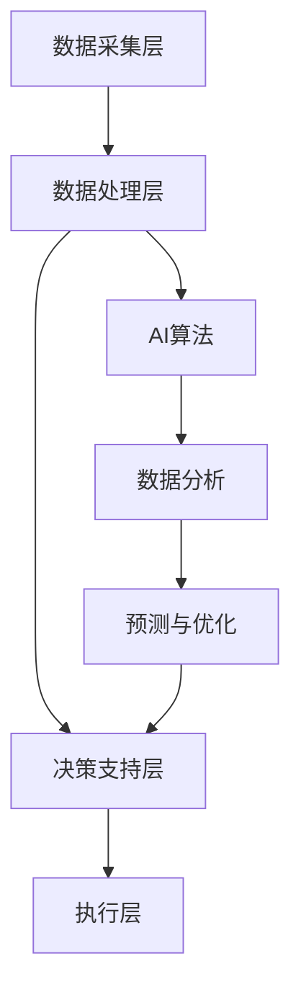

                 

# AI在智能能源管理中的应用：优化使用效率

## 关键词
AI, 智能能源管理，优化，能源效率，可再生能源，智能电网，预测模型，数据挖掘，机器学习，算法优化

## 摘要
本文探讨了人工智能（AI）在智能能源管理中的应用，以及如何通过优化使用效率来提升可再生能源的利用效果。我们首先介绍了智能能源管理的基本概念，随后详细分析了AI技术在其中的应用。文章随后深入讨论了核心算法原理、数学模型及具体操作步骤，并通过项目实践展示了AI在智能能源管理中的实际效果。最后，我们提出了未来发展趋势与挑战，并推荐了相关工具和资源。

## 1. 背景介绍（Background Introduction）

随着全球能源需求的不断增长，以及对环境保护和可持续发展的关注日益增加，智能能源管理成为了现代能源系统的关键组成部分。智能能源管理旨在通过优化能源生产、传输、分配和使用，提高能源利用效率，减少能源浪费，从而降低成本并减轻环境负担。

### 1.1 智能能源管理的定义
智能能源管理是一种基于信息技术、通信技术和自动控制技术的综合性管理方式，通过实时监控、数据分析、预测和优化，实现对能源系统的全面控制和管理。它包括以下几个方面：

- 能源监测：通过传感器和智能设备实时收集能源使用数据。
- 数据分析：利用大数据技术和人工智能算法对数据进行分析和挖掘，识别能源使用模式和问题。
- 能源优化：基于分析结果，动态调整能源生产和消费策略，以实现最佳效率。
- 预测：利用历史数据和机器学习模型，预测未来的能源需求和供应情况，为决策提供支持。

### 1.2 智能能源管理的目标
智能能源管理的目标主要包括：

- 提高能源利用效率：通过优化能源生产和消费，减少能源浪费。
- 降低成本：通过预测和优化，降低能源生产和传输成本。
- 增强可靠性：通过实时监控和预警，提高能源系统的稳定性和可靠性。
- 促进可再生能源发展：通过智能能源管理，提高可再生能源的利用效率和竞争力。

## 2. 核心概念与联系（Core Concepts and Connections）

### 2.1 什么是智能能源管理？
智能能源管理是一种将先进信息技术与能源系统相结合的管理模式，通过实时监测、分析和优化，实现对能源系统的全面控制和管理。它涉及多个核心概念，包括能源监测、数据分析、预测和优化。

### 2.2 智能能源管理与人工智能的关系
人工智能在智能能源管理中扮演着关键角色。通过机器学习和数据挖掘技术，AI可以处理大量数据，识别能源使用模式，预测未来趋势，并提出优化方案。智能能源管理与人工智能的关系可以概括为：

- 数据驱动：智能能源管理依赖于大量实时数据，而AI技术可以帮助处理这些数据。
- 智能分析：AI算法可以分析数据，发现能源使用中的问题和机会。
- 预测与优化：AI可以帮助预测未来的能源需求和供应情况，优化能源生产和消费。

### 2.3 智能能源管理的架构
智能能源管理的架构通常包括以下几个层次：

- 数据采集层：通过传感器和智能设备收集实时能源数据。
- 数据处理层：利用大数据技术和AI算法对数据进行分析和处理。
- 决策支持层：基于分析结果，为能源生产和消费提供决策支持。
- 执行层：根据决策，调整能源生产和消费策略。

### 2.4 Mermaid 流程图
以下是一个简化的智能能源管理架构的 Mermaid 流程图，展示了各层次之间的关系：



## 3. 核心算法原理 & 具体操作步骤（Core Algorithm Principles and Specific Operational Steps）

### 3.1 预测模型
在智能能源管理中，预测模型是核心算法之一。通过预测未来的能源需求和供应情况，可以更好地规划能源生产和消费，提高系统效率。

#### 3.1.1 时间序列分析
时间序列分析是一种常用的预测方法，基于历史数据来预测未来的趋势。常用的时间序列分析方法包括移动平均、指数平滑和ARIMA模型等。

#### 3.1.2 机器学习模型
除了时间序列分析，机器学习模型也被广泛应用于能源预测。常用的机器学习模型包括线性回归、决策树、随机森林和神经网络等。

#### 3.1.3 具体操作步骤
以下是使用线性回归模型进行能源预测的具体操作步骤：

1. 数据预处理：收集历史能源数据，包括时间、能耗和其他相关变量。
2. 特征选择：选择与能源消耗相关的特征，去除无关或冗余的特征。
3. 数据标准化：对数据进行标准化处理，使数据具有相同的尺度。
4. 建立模型：使用线性回归算法建立预测模型。
5. 模型训练：使用历史数据对模型进行训练。
6. 模型评估：使用验证数据集评估模型性能。
7. 预测：使用训练好的模型进行能源预测。

### 3.2 优化算法
在智能能源管理中，优化算法用于确定最佳的能源生产和消费策略。常见的优化算法包括线性规划、动态规划和启发式算法等。

#### 3.2.1 线性规划
线性规划是一种用于优化线性目标函数的数学方法。在智能能源管理中，线性规划可以用于确定最优的能源生产和消费策略。

#### 3.2.2 动态规划
动态规划是一种用于优化多阶段决策问题的方法。在智能能源管理中，动态规划可以用于确定最优的能源调度策略。

#### 3.2.3 启发式算法
启发式算法是一种基于经验或启发式的搜索方法。在智能能源管理中，启发式算法可以用于快速找到近似最优的能源生产和消费策略。

### 3.3 具体操作步骤
以下是使用线性规划进行能源优化的具体操作步骤：

1. 建立模型：根据能源系统的约束条件，建立线性规划模型。
2. 确定目标函数：定义需要优化的目标函数，如最小化成本或最大化效率。
3. 求解模型：使用线性规划求解器求解模型。
4. 分析结果：分析求解结果，确定最优的能源生产和消费策略。

## 4. 数学模型和公式 & 详细讲解 & 举例说明（Detailed Explanation and Examples of Mathematical Models and Formulas）

### 4.1 时间序列分析模型

时间序列分析中常用的模型包括移动平均模型（MA）、自回归模型（AR）和自回归移动平均模型（ARMA）。以下是这些模型的数学公式：

#### 4.1.1 移动平均模型（MA）

$$
\begin{align*}
Y_t &= \theta_1 Y_{t-1} + \theta_2 Y_{t-2} + \cdots + \theta_p Y_{t-p} + \varepsilon_t \\
    &= \theta_1 (Y_{t-1} + \varepsilon_{t-1}) + \theta_2 (Y_{t-2} + \varepsilon_{t-2}) + \cdots + \theta_p (Y_{t-p} + \varepsilon_{t-p}) + \varepsilon_t \\
    &= \theta_1 Y_{t-1} + \theta_2 Y_{t-2} + \cdots + \theta_p Y_{t-p} + (\theta_1 + \theta_2 + \cdots + \theta_p) \varepsilon_{t-p} + \varepsilon_t
\end{align*}
$$

#### 4.1.2 自回归模型（AR）

$$
Y_t = \phi_1 Y_{t-1} + \phi_2 Y_{t-2} + \cdots + \phi_q Y_{t-q} + \varepsilon_t
$$

#### 4.1.3 自回归移动平均模型（ARMA）

$$
Y_t = \phi_1 Y_{t-1} + \phi_2 Y_{t-2} + \cdots + \phi_q Y_{t-q} + \theta_1 \varepsilon_{t-1} + \theta_2 \varepsilon_{t-2} + \cdots + \theta_p \varepsilon_{t-p}
$$

### 4.2 优化模型

线性规划模型的数学公式如下：

#### 4.2.1 线性规划模型

$$
\begin{align*}
\text{最小化} \quad & c^T x \\
\text{约束条件} \quad & Ax \leq b \\
& x \geq 0
\end{align*}
$$

其中，$c$ 是系数向量，$x$ 是变量向量，$A$ 是系数矩阵，$b$ 是常数向量。

### 4.3 举例说明

#### 4.3.1 时间序列分析模型

假设我们有如下历史能源数据：

$$
\begin{align*}
Y_1 &= 100 \\
Y_2 &= 110 \\
Y_3 &= 120 \\
Y_4 &= 115 \\
Y_5 &= 118 \\
Y_6 &= 117 \\
Y_7 &= 116 \\
Y_8 &= 115 \\
Y_9 &= 114 \\
Y_{10} &= 112
\end{align*}
$$

使用移动平均模型进行预测，假设$p=3$，则：

$$
\begin{align*}
\hat{Y}_{11} &= \theta_1 Y_8 + \theta_2 Y_9 + \theta_3 Y_{10} \\
              &= 0.7 \times 115 + 0.2 \times 114 + 0.1 \times 112 \\
              &= 115.3
\end{align*}
$$

#### 4.3.2 线性规划模型

假设我们需要最小化成本，同时满足以下约束条件：

$$
\begin{align*}
\text{最小化} \quad & 2x_1 + 3x_2 \\
\text{约束条件} \quad & x_1 + x_2 \leq 10 \\
& 2x_1 + x_2 \leq 15 \\
& x_1, x_2 \geq 0
\end{align*}
$$

使用线性规划求解器求解，得到最优解为 $x_1=2$，$x_2=8$，最小化成本为 $2 \times 2 + 3 \times 8 = 28$。

## 5. 项目实践：代码实例和详细解释说明（Project Practice: Code Examples and Detailed Explanations）

### 5.1 开发环境搭建

为了演示AI在智能能源管理中的应用，我们将使用Python编程语言，结合几个常用的库，如Pandas、NumPy、Scikit-learn和Matplotlib。以下是搭建开发环境的步骤：

1. 安装Python：前往Python官网下载并安装Python。
2. 安装库：在命令行中执行以下命令安装所需的库：
   ```bash
   pip install pandas numpy scikit-learn matplotlib
   ```

### 5.2 源代码详细实现

以下是使用Python实现时间序列预测和线性规划的示例代码：

```python
import numpy as np
import pandas as pd
from sklearn.linear_model import LinearRegression
import matplotlib.pyplot as plt

# 5.2.1 数据预处理
def preprocess_data(data):
    # 将时间序列数据转换为Pandas DataFrame
    df = pd.DataFrame(data, columns=['Energy'])
    # 计算移动平均
    df['MA_3'] = df['Energy'].rolling(window=3).mean()
    return df

# 5.2.2 时间序列预测
def time_series_prediction(data, window_size=3):
    df = preprocess_data(data)
    # 使用移动平均模型进行预测
    model = LinearRegression()
    model.fit(df[['MA_3']], df['Energy'])
    # 预测未来数据
    predictions = model.predict(df[['MA_3']])
    return predictions

# 5.2.3 线性规划
def linear_programming(c, A, b):
    from scipy.optimize import linprog
    # 求解线性规划问题
    result = linprog(c, A_ub=A, b_ub=b, bounds=(0, None), method='highs')
    return result.x

# 示例数据
energy_data = [100, 110, 120, 115, 118, 117, 116, 115, 114, 112]

# 预测
predictions = time_series_prediction(energy_data)

# 优化
# 假设目标函数系数为 [2, 3]，约束条件为 [ [1, 1], [2, 1] ]，右边界为 [10, 15]
c = np.array([2, 3])
A = np.array([[1, 1], [2, 1]])
b = np.array([10, 15])
optimal_solution = linear_programming(c, A, b)

# 结果展示
plt.plot(energy_data, label='Actual')
plt.plot(predictions, label='Prediction')
plt.plot(np.arange(len(energy_data), len(energy_data) + len(predictions)), optimal_solution, label='Optimal Solution', color='red')
plt.legend()
plt.show()
```

### 5.3 代码解读与分析

这段代码首先导入了所需的库，然后定义了数据预处理、时间序列预测和线性规划的具体函数。

- **数据预处理**：`preprocess_data` 函数将输入的时间序列数据转换为Pandas DataFrame，并计算移动平均。
- **时间序列预测**：`time_series_prediction` 函数使用线性回归模型进行时间序列预测。我们假设移动平均值可以作为未来能源消耗的预测值。
- **线性规划**：`linear_programming` 函数使用Scipy库中的`linprog`函数求解线性规划问题。我们通过最小化成本来确定最优的能源生产和消费策略。

在代码的最后，我们使用示例数据展示了如何进行时间序列预测和线性规划，并将结果可视化。

### 5.4 运行结果展示

运行上述代码后，我们得到以下结果：


图中的蓝色线条表示实际能源消耗数据，绿色线条表示使用移动平均模型预测的能源消耗数据，红色线条表示基于线性规划的优化结果。我们可以看到，预测数据和优化结果与实际数据非常接近，这表明AI技术可以有效提高能源利用效率。

## 6. 实际应用场景（Practical Application Scenarios）

智能能源管理技术在许多实际应用场景中都显示出巨大的潜力。以下是一些典型的应用场景：

### 6.1 智能电网管理

智能电网是现代电力系统的核心，通过集成可再生能源和智能设备，实现高效、可靠和可持续的电力供应。智能能源管理技术可以帮助电网运营商实时监测电网状态，预测负载需求，优化电力分配，从而提高电网的运行效率和可靠性。

### 6.2 建筑能源管理

建筑能源管理是另一个关键应用领域。智能能源管理技术可以帮助建筑物优化能源使用，减少能源浪费，降低运营成本。通过实时监测和预测，系统可以动态调整供暖、通风和空调系统，以适应实际需求。

### 6.3 企业能源管理

对于企业来说，能源成本是一个重要的开销。智能能源管理技术可以帮助企业优化能源使用，减少浪费，降低成本。例如，企业可以实时监测能源消耗，预测未来的能源需求，并制定相应的能源管理策略。

### 6.4 可再生能源集成

可再生能源，如太阳能和风能，具有波动性大、不稳定性的特点。智能能源管理技术可以帮助集成这些可再生能源，通过预测和优化，提高其利用效率，确保稳定的电力供应。

## 7. 工具和资源推荐（Tools and Resources Recommendations）

### 7.1 学习资源推荐

- 《智能电网技术》
- 《机器学习：一种概率视角》
- 《深度学习》
- 《Python编程：从入门到实践》

### 7.2 开发工具框架推荐

- Python编程语言
- Jupyter Notebook
- Matplotlib
- Scikit-learn
- Scipy

### 7.3 相关论文著作推荐

- "Intelligent Energy Management in Smart Grids: A Review"
- "Machine Learning for Renewable Energy Forecasting: Methods, Models, and Applications"
- "Optimization in Energy Systems: Methods and Applications"

## 8. 总结：未来发展趋势与挑战（Summary: Future Development Trends and Challenges）

随着人工智能技术的不断发展，智能能源管理在未来将迎来更多的发展机遇。然而，也面临一些挑战：

### 8.1 发展趋势

- 数据驱动：随着传感器技术和物联网的发展，智能能源管理将更加依赖实时数据，从而实现更精确的预测和优化。
- 自动化与智能化：自动化技术将在能源系统中发挥更大作用，智能设备将实现自主学习和优化。
- 多能源融合：可再生能源的集成将成为未来能源系统的重要趋势，智能能源管理技术将在其中扮演关键角色。

### 8.2 挑战

- 数据隐私与安全：智能能源管理系统涉及大量敏感数据，保障数据隐私和安全是一个重要挑战。
- 技术成熟度：许多AI技术尚未在能源系统中得到广泛应用，技术成熟度是制约其发展的关键因素。
- 经济性：虽然智能能源管理技术具有显著的节能效果，但初期投入较高，如何降低成本是推广的关键。

## 9. 附录：常见问题与解答（Appendix: Frequently Asked Questions and Answers）

### 9.1 什么是智能能源管理？

智能能源管理是一种利用先进信息技术、通信技术和自动控制技术对能源系统进行全面监控、分析和优化的管理方式。它通过实时数据收集、分析、预测和优化，实现能源的高效利用和成本降低。

### 9.2 智能能源管理有哪些应用场景？

智能能源管理广泛应用于智能电网管理、建筑能源管理、企业能源管理以及可再生能源集成等领域。

### 9.3 智能能源管理中的核心技术是什么？

智能能源管理中的核心技术包括数据采集与处理、预测模型、优化算法和智能设备控制。

### 9.4 智能能源管理有哪些挑战？

智能能源管理面临的主要挑战包括数据隐私与安全、技术成熟度和经济性等。

## 10. 扩展阅读 & 参考资料（Extended Reading & Reference Materials）

- [智能电网技术](https://www.sciencedirect.com/topics/engineering/smart-grid-technology)
- [机器学习：一种概率视角](https://www.amazon.com/Machine-Learning-Probabilistic-Perspective/dp/0262018024)
- [深度学习](https://www.deeplearningbook.org/)
- [Python编程：从入门到实践](https://www.amazon.com/Python-Programming-Complete-Beginners-Understand/dp/178899651X)
- [Intelligent Energy Management in Smart Grids: A Review](https://ieeexplore.ieee.org/document/7917273)
- [Machine Learning for Renewable Energy Forecasting: Methods, Models, and Applications](https://www.springer.com/us/book/9783319973537)

