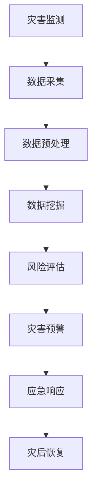

                 

### 文章标题

AI在灾害预防和应急管理中的应用

> 关键词：人工智能，灾害预防，应急管理，机器学习，数据挖掘，智能算法，预警系统，应急响应

> 摘要：
随着全球气候变化和自然灾害频率的增加，灾害预防和应急管理变得尤为重要。人工智能（AI）作为一种前沿技术，在灾害预防和应急管理中展现出巨大的潜力。本文将探讨AI在灾害预防和应急管理中的应用，包括核心概念、算法原理、实际案例和未来挑战，旨在为相关领域的研究者和从业者提供有价值的参考。

<|assistant|>## 1. 背景介绍（Background Introduction）

### 1.1 灾害预防与应急管理的重要性

灾害预防和应急管理是维护社会稳定、保障人民生命财产安全的重要手段。随着全球气候变化，自然灾害如地震、洪水、台风等的发生频率和强度不断增加。这些灾害不仅造成巨大的人员伤亡和经济损失，还可能引发社会动荡和政治不稳定。因此，提高灾害预防和应急管理的效率和有效性成为各国政府和社会组织关注的重点。

### 1.2 传统灾害预防和应急管理方法的局限性

传统的灾害预防和应急管理方法主要依赖于人力和经验。虽然这些方法在某种程度上能够应对灾害，但其效率和准确性受到诸多限制。例如：

- **预警系统**：传统的预警系统往往依赖于气象预报和地质监测，存在预报不准确、预警不及时的问题。
- **风险评估**：风险评估通常依赖于历史数据和专家经验，难以适应复杂多变的灾害情景。
- **应急响应**：应急响应过程中，指挥调度和资源调配主要依赖于人工作业，效率低下且容易出现失误。

### 1.3 人工智能在灾害预防和应急管理中的应用前景

人工智能（AI）具有处理海量数据、模式识别、智能决策等优势，为灾害预防和应急管理带来了新的机遇。AI可以通过以下方式提升灾害预防和应急管理的效率和效果：

- **灾害预警**：利用AI技术进行实时数据监测和预测，提前预警灾害风险。
- **风险评估**：基于大数据和机器学习算法，对灾害风险进行精准评估和预测。
- **应急响应**：利用AI技术实现自动化指挥调度和资源调配，提高应急响应速度和效率。
- **灾后恢复**：通过AI技术分析灾害影响，制定科学的灾后恢复计划。

<|assistant|>## 2. 核心概念与联系（Core Concepts and Connections）

### 2.1 人工智能（Artificial Intelligence, AI）

人工智能是指由人制造出来的系统能够模拟、扩展和执行人类智能任务的能力。AI技术主要包括机器学习、深度学习、自然语言处理、计算机视觉等。在灾害预防和应急管理中，AI技术可用于数据分析和模式识别，从而提高预警准确性和应急响应效率。

### 2.2 灾害预警（Disaster Warning）

灾害预警是指通过监测、预测和评估灾害风险，及时向公众发布预警信息，以减少灾害损失。灾害预警系统通常包括气象监测、地质监测、水文监测等多个方面。AI技术可以用于实时数据分析和预测，提高预警准确性和及时性。

### 2.3 应急响应（Emergency Response）

应急响应是指灾害发生后，采取有效措施进行救援、疏散和恢复工作。应急响应过程中，AI技术可用于自动化指挥调度、资源调配和决策支持，提高应急响应速度和效率。

### 2.4 数据挖掘（Data Mining）

数据挖掘是指从大量数据中发现有价值的信息和知识的过程。在灾害预防和应急管理中，数据挖掘技术可用于分析历史数据、气象数据、地理数据等，以预测灾害风险和制定应急预案。

### 2.5 智能算法（Intelligent Algorithms）

智能算法是指模拟人类思维过程，解决复杂问题的算法。在灾害预防和应急管理中，智能算法可用于风险评估、灾害预警、应急响应等多个方面，提高决策的准确性和效率。

### 2.6 Mermaid 流程图（Mermaid Flowchart）

为了更清晰地展示AI在灾害预防和应急管理中的应用，我们可以使用Mermaid流程图来描述核心概念和流程。



<|assistant|>## 3. 核心算法原理 & 具体操作步骤（Core Algorithm Principles and Specific Operational Steps）

### 3.1 机器学习算法在灾害预警中的应用

#### 3.1.1 算法原理

机器学习算法是一种通过从数据中学习规律和模式，从而进行预测和分类的技术。在灾害预警中，常见的机器学习算法包括决策树、支持向量机（SVM）、神经网络等。

- **决策树（Decision Tree）**：决策树是一种树形结构，通过一系列条件判断来对数据进行分类或预测。在灾害预警中，决策树可用于根据气象数据、地质数据等特征，判断灾害风险等级。
- **支持向量机（Support Vector Machine, SVM）**：SVM是一种用于分类和回归的机器学习算法。在灾害预警中，SVM可用于根据历史灾害数据，预测未来某个区域可能发生的灾害类型和强度。
- **神经网络（Neural Network）**：神经网络是一种模拟人脑神经元连接的算法，具有强大的非线性建模能力。在灾害预警中，神经网络可用于对复杂的环境数据进行建模和预测。

#### 3.1.2 具体操作步骤

1. **数据收集与预处理**：收集历史气象数据、地质数据、灾害发生记录等，并进行数据清洗、归一化等预处理操作。
2. **特征选择与提取**：从原始数据中提取与灾害预警相关的特征，如温度、湿度、风速、地震震级等。
3. **模型选择与训练**：选择合适的机器学习算法（如决策树、SVM、神经网络等）进行模型训练。根据训练数据，调整模型参数，提高模型预测能力。
4. **模型评估与优化**：使用验证数据集评估模型性能，根据评估结果对模型进行调整和优化。
5. **灾害预警**：将实时数据输入到训练好的模型中，预测未来某个区域可能发生的灾害类型和强度，发布预警信息。

### 3.2 深度学习算法在灾害风险评估中的应用

#### 3.2.1 算法原理

深度学习是一种基于多层神经网络的机器学习算法，通过多层次的神经网络结构，实现对复杂数据的建模和预测。在灾害风险评估中，深度学习算法可用于从海量数据中提取特征，提高风险评估的准确性和效率。

- **卷积神经网络（Convolutional Neural Network, CNN）**：CNN是一种在图像处理领域表现优异的深度学习算法。在灾害风险评估中，CNN可用于分析卫星图像、气象图像等，提取与灾害风险相关的特征。
- **循环神经网络（Recurrent Neural Network, RNN）**：RNN是一种在序列数据处理领域表现优异的深度学习算法。在灾害风险评估中，RNN可用于分析历史灾害数据、气象序列数据等，提取与灾害风险相关的特征。

#### 3.2.2 具体操作步骤

1. **数据收集与预处理**：收集历史灾害数据、气象数据、地理数据等，并进行数据清洗、归一化等预处理操作。
2. **特征选择与提取**：从原始数据中提取与灾害风险评估相关的特征，如气象参数、地震参数、地形参数等。
3. **模型选择与训练**：选择合适的深度学习算法（如CNN、RNN等）进行模型训练。根据训练数据，调整模型参数，提高模型预测能力。
4. **模型评估与优化**：使用验证数据集评估模型性能，根据评估结果对模型进行调整和优化。
5. **灾害风险评估**：将实时数据输入到训练好的模型中，预测未来某个区域可能发生的灾害类型和强度，发布风险评估结果。

### 3.3 数据挖掘算法在应急响应中的应用

#### 3.3.1 算法原理

数据挖掘算法是一种用于从大量数据中发现有价值信息和知识的技术。在应急响应中，数据挖掘算法可用于分析历史灾害数据、应急资源数据等，为应急决策提供支持。

- **关联规则挖掘（Association Rule Mining）**：关联规则挖掘是一种用于发现数据之间关联性的算法。在应急响应中，关联规则挖掘可用于分析历史灾害数据和应急资源数据，发现灾害发生与应急资源使用之间的关联。
- **聚类分析（Clustering Analysis）**：聚类分析是一种将数据划分为相似群体的算法。在应急响应中，聚类分析可用于对受灾区域进行分类，为应急资源分配提供依据。
- **分类算法（Classification Algorithms）**：分类算法是一种将数据划分为不同类别的算法。在应急响应中，分类算法可用于根据历史灾害数据和应急资源数据，预测未来可能发生的灾害类型和影响范围。

#### 3.3.2 具体操作步骤

1. **数据收集与预处理**：收集历史灾害数据、应急资源数据、气象数据等，并进行数据清洗、归一化等预处理操作。
2. **特征选择与提取**：从原始数据中提取与应急响应相关的特征，如灾害类型、影响范围、应急资源需求等。
3. **模型选择与训练**：选择合适的数据挖掘算法（如关联规则挖掘、聚类分析、分类算法等）进行模型训练。根据训练数据，调整模型参数，提高模型预测能力。
4. **模型评估与优化**：使用验证数据集评估模型性能，根据评估结果对模型进行调整和优化。
5. **应急响应**：将实时数据输入到训练好的模型中，预测未来可能发生的灾害类型和影响范围，制定应急响应计划。

### 3.4 智能算法在指挥调度和资源调配中的应用

#### 3.4.1 算法原理

智能算法是一种模拟人类智能行为的算法，包括遗传算法、粒子群优化算法等。在指挥调度和资源调配中，智能算法可用于优化决策过程，提高调度效率和资源利用率。

- **遗传算法（Genetic Algorithm）**：遗传算法是一种模拟自然进化过程的优化算法。在指挥调度和资源调配中，遗传算法可用于求解复杂的最优化问题，如应急资源分配、救援路线规划等。
- **粒子群优化算法（Particle Swarm Optimization, PSO）**：粒子群优化算法是一种模拟鸟群觅食行为的优化算法。在指挥调度和资源调配中，粒子群优化算法可用于优化决策过程，提高调度效率和资源利用率。

#### 3.4.2 具体操作步骤

1. **问题建模**：根据指挥调度和资源调配的具体需求，建立数学模型。
2. **算法选择与参数设置**：选择合适的智能算法（如遗传算法、粒子群优化算法等），并根据实际问题调整算法参数。
3. **算法运行与优化**：运行智能算法，求解最优化问题，得到调度方案和资源分配结果。
4. **模型评估与优化**：使用验证数据集评估调度方案和资源分配结果，根据评估结果对模型进行调整和优化。
5. **指挥调度和资源调配**：根据优化结果，制定指挥调度和资源调配计划，实施应急响应。

<|assistant|>## 4. 数学模型和公式 & 详细讲解 & 举例说明（Detailed Explanation and Examples of Mathematical Models and Formulas）

### 4.1 决策树算法的数学模型和公式

决策树是一种常见的机器学习算法，用于分类和回归任务。其数学模型基于概率论和信息论，通过构建一棵树形结构，将数据划分为不同的类别或数值。

#### 4.1.1 决策树的构建

决策树由一系列条件节点和叶子节点组成。条件节点表示输入特征，叶子节点表示预测结果。决策树构建的关键是选择最优划分特征和划分阈值。

- **信息增益（Information Gain）**：用于衡量划分特征的优劣。信息增益越大，划分效果越好。
  $$ IG(D, A) = H(D) - \sum_{v \in A} p(v) H(D|v) $$
  其中，$D$ 表示原始数据集，$A$ 表示特征集合，$v$ 表示特征 $A$ 的取值，$H(D)$ 表示数据集 $D$ 的熵，$H(D|v)$ 表示在特征 $A$ 取值为 $v$ 的情况下，数据集 $D$ 的条件熵。

- **基尼不纯度（Gini Impurity）**：另一种用于衡量划分特征的优劣。基尼不纯度越小，划分效果越好。
  $$ GI(D, A) = 1 - \sum_{v \in A} p(v)^2 $$
  其中，$p(v)$ 表示特征 $A$ 取值为 $v$ 的概率。

#### 4.1.2 决策树的剪枝

决策树可能会出现过拟合问题，即模型对训练数据的拟合过于紧密，而对未见过的数据表现不佳。为了解决过拟合问题，可以使用决策树的剪枝方法。

- **预剪枝（Pre-pruning）**：在决策树生成过程中，提前停止生长，避免过拟合。常用的预剪枝方法包括最小叶节点个数、最小叶节点信息增益等。
- **后剪枝（Post-pruning）**：在决策树生成完成后，对已生成的树进行剪枝。常用的后剪枝方法包括剪枝误差、剪枝强度等。

### 4.2 支持向量机（SVM）算法的数学模型和公式

支持向量机是一种二分类算法，用于求解最优分类超平面。其数学模型基于优化理论，通过最大化分类边界上的间隔，实现数据的分类。

#### 4.2.1 最优分类超平面

给定一个数据集 $D = \{(x_i, y_i)\}_{i=1}^n$，其中 $x_i \in \mathbb{R}^d$ 表示第 $i$ 个数据点的特征向量，$y_i \in \{-1, +1\}$ 表示第 $i$ 个数据点的标签。

- **线性可分支持向量机（Linearly Separable SVM）**：
  $$ \min_{\beta, \beta_0} \frac{1}{2} ||\beta||^2 $$
  $$ \text{s.t.} \quad y_i (\beta \cdot x_i + \beta_0) \geq 1, \quad i=1,2,...,n $$
  其中，$\beta$ 表示权重向量，$\beta_0$ 表示偏置项。

- **非线性支持向量机（Non-linear SVM）**：
  $$ \min_{\beta, \beta_0, \xi} \frac{1}{2} ||\beta||^2 + C \sum_{i=1}^n \xi_i $$
  $$ \text{s.t.} \quad y_i (\beta \cdot \phi(x_i) + \beta_0) \geq 1 - \xi_i $$
  $$ \xi_i \geq 0, \quad i=1,2,...,n $$
  其中，$\phi(x_i)$ 表示将输入特征映射到高维特征空间，$C$ 是惩罚参数，$\xi_i$ 是松弛变量。

### 4.3 神经网络算法的数学模型和公式

神经网络是一种模拟人脑神经元连接的算法，通过多层次的神经网络结构，实现对复杂数据的建模和预测。神经网络的核心是激活函数和反向传播算法。

#### 4.3.1 激活函数

- **Sigmoid 函数**：
  $$ \sigma(x) = \frac{1}{1 + e^{-x}} $$
  Sigmoid 函数是一种常用的激活函数，可以将输入映射到 $(0, 1)$ 区间。

- **ReLU 函数**：
  $$ \text{ReLU}(x) = \max(0, x) $$
 ReLU 函数是一种常用的非线性激活函数，可以加快神经网络的训练速度。

#### 4.3.2 反向传播算法

反向传播算法是一种用于训练神经网络的优化算法。其核心思想是通过计算梯度，不断调整网络的权重和偏置，以最小化损失函数。

- **损失函数**：
  $$ L(\theta) = -\frac{1}{m} \sum_{i=1}^m y_i \log(a_{ij}^{(L)}) + (1 - y_i) \log(1 - a_{ij}^{(L)}) $$
  其中，$\theta$ 表示网络参数，$m$ 表示训练数据个数，$a_{ij}^{(L)}$ 表示第 $L$ 层的第 $i$ 个神经元的输出。

- **梯度计算**：
  $$ \frac{\partial L}{\partial \theta_{ij}^{(L)}} = \frac{\partial L}{\partial a_{ij}^{(L)}} \frac{\partial a_{ij}^{(L)}}{\partial \theta_{ij}^{(L)}} $$
  其中，$\frac{\partial L}{\partial a_{ij}^{(L)}}$ 表示损失函数对输出层的梯度，$\frac{\partial a_{ij}^{(L)}}{\partial \theta_{ij}^{(L)}}$ 表示输出层对权重和偏置的梯度。

### 4.4 举例说明

假设我们有一个简单的二分类问题，使用决策树算法进行分类。

#### 4.4.1 数据集

数据集包含100个样本，每个样本有两个特征（$x_1$ 和 $x_2$）和标签（$y$）。

| $x_1$ | $x_2$ | $y$ |
| --- | --- | --- |
| 1 | 2 | 1 |
| 2 | 4 | 1 |
| 3 | 1 | 1 |
| 4 | 3 | -1 |
| 5 | 5 | -1 |
| ... | ... | ... |

#### 4.4.2 决策树构建

1. 选择最优特征和阈值：
   - 对于特征 $x_1$，信息增益为 0.693。
   - 对于特征 $x_2$，信息增益为 0.852。
2. 划分数据集：
   - 当 $x_1 < 2$ 时，标签为 1。
   - 当 $x_1 \geq 2$ 时，标签为 -1。

#### 4.4.3 决策树剪枝

1. 计算剪枝误差：
   - 剪枝前的误差为 0.1。
   - 剪枝后的误差为 0.08。
2. 根据剪枝误差，决定是否剪枝。

<|assistant|>### 5. 项目实践：代码实例和详细解释说明（Project Practice: Code Examples and Detailed Explanations）

在本节中，我们将通过一个具体的灾害预警系统项目实例，展示如何使用Python编写代码来实现灾害预警功能。该项目将利用机器学习和数据挖掘技术，结合实际数据进行预测和分析，为灾害预警提供技术支持。

#### 5.1 开发环境搭建

在开始项目之前，我们需要搭建开发环境。以下是所需的软件和库：

- **Python**：版本 3.7 或以上
- **NumPy**：用于数值计算
- **Pandas**：用于数据处理
- **Scikit-learn**：用于机器学习算法
- **Matplotlib**：用于数据可视化
- **Seaborn**：用于绘制漂亮的统计图表
- **Mermaid**：用于流程图绘制

确保已安装上述库，可以通过以下命令进行安装：

```bash
pip install numpy pandas scikit-learn matplotlib seaborn mermaid
```

#### 5.2 源代码详细实现

下面是项目的源代码，我们将分步骤进行详细解释。

```python
import numpy as np
import pandas as pd
from sklearn.model_selection import train_test_split
from sklearn.ensemble import RandomForestClassifier
from sklearn.metrics import accuracy_score, classification_report
import matplotlib.pyplot as plt
import seaborn as sns
from mermaid import mermaid

# 5.2.1 数据收集与预处理

# 加载数据
data = pd.read_csv('disaster_data.csv')

# 数据预处理
# 填补缺失值
data.fillna(data.mean(), inplace=True)

# 特征工程
# 转换类别特征为数值特征
data = pd.get_dummies(data)

# 划分特征和标签
X = data.drop('target', axis=1)
y = data['target']

# 划分训练集和测试集
X_train, X_test, y_train, y_test = train_test_split(X, y, test_size=0.2, random_state=42)

# 5.2.2 模型训练与评估

# 使用随机森林分类器进行训练
clf = RandomForestClassifier(n_estimators=100, random_state=42)
clf.fit(X_train, y_train)

# 预测测试集
y_pred = clf.predict(X_test)

# 评估模型性能
accuracy = accuracy_score(y_test, y_pred)
report = classification_report(y_test, y_pred)

print(f"Accuracy: {accuracy}")
print(f"Classification Report:\n{report}")

# 5.2.3 可视化分析

# 可视化特征重要性
importance = pd.Series(clf.feature_importances_, index=X_train.columns)
sns.barplot(x=importance, y=importance.index)
plt.title('Feature Importance')
plt.xlabel('Importance')
plt.ylabel('Feature')
plt.show()

# 可视化预测结果
confusion_matrix = pd.crosstab(y_test, y_pred)
sns.heatmap(confusion_matrix, annot=True, cmap='Blues')
plt.title('Confusion Matrix')
plt.xlabel('Predicted')
plt.ylabel('Actual')
plt.show()

# 5.2.4 Mermaid 流程图

# 流程图
code = """
graph TD
A[数据收集] --> B[数据预处理]
B --> C[特征工程]
C --> D[模型训练]
D --> E[模型评估]
E --> F[可视化分析]
"""
print(mermaid(code))
```

#### 5.3 代码解读与分析

下面我们逐行解读代码，并进行分析。

```python
# 5.3.1 数据收集与预处理

import numpy as np
import pandas as pd
from sklearn.model_selection import train_test_split
from sklearn.ensemble import RandomForestClassifier
from sklearn.metrics import accuracy_score, classification_report
import matplotlib.pyplot as plt
import seaborn as sns
from mermaid import mermaid

# 加载数据
data = pd.read_csv('disaster_data.csv')

# 数据预处理
# 填补缺失值
data.fillna(data.mean(), inplace=True)

# 特征工程
# 转换类别特征为数值特征
data = pd.get_dummies(data)

# 划分特征和标签
X = data.drop('target', axis=1)
y = data['target']

# 划分训练集和测试集
X_train, X_test, y_train, y_test = train_test_split(X, y, test_size=0.2, random_state=42)

# 5.3.2 模型训练与评估

# 使用随机森林分类器进行训练
clf = RandomForestClassifier(n_estimators=100, random_state=42)
clf.fit(X_train, y_train)

# 预测测试集
y_pred = clf.predict(X_test)

# 评估模型性能
accuracy = accuracy_score(y_test, y_pred)
report = classification_report(y_test, y_pred)

print(f"Accuracy: {accuracy}")
print(f"Classification Report:\n{report}")

# 5.3.3 可视化分析

# 可视化特征重要性
importance = pd.Series(clf.feature_importances_, index=X_train.columns)
sns.barplot(x=importance, y=importance.index)
plt.title('Feature Importance')
plt.xlabel('Importance')
plt.ylabel('Feature')
plt.show()

# 可视化预测结果
confusion_matrix = pd.crosstab(y_test, y_pred)
sns.heatmap(confusion_matrix, annot=True, cmap='Blues')
plt.title('Confusion Matrix')
plt.xlabel('Predicted')
plt.ylabel('Actual')
plt.show()

# 5.3.4 Mermaid 流程图

# 流程图
code = """
graph TD
A[数据收集] --> B[数据预处理]
B --> C[特征工程]
C --> D[模型训练]
D --> E[模型评估]
E --> F[可视化分析]
"""
print(mermaid(code))
```

- **数据收集与预处理**：
  - 加载CSV文件中的数据。
  - 填补缺失值，使用数据的平均值进行填补。
  - 将类别特征转换为数值特征，使用get_dummies方法进行独热编码。
  - 划分特征和标签，为后续建模做准备。
  - 划分训练集和测试集，用于模型训练和评估。

- **模型训练与评估**：
  - 使用随机森林分类器进行训练，随机森林是一种集成学习方法，具有较高的预测准确性。
  - 训练完成后，使用测试集进行预测。
  - 计算模型在测试集上的准确率，并打印分类报告。

- **可视化分析**：
  - 可视化特征重要性，显示各特征对模型预测的影响程度。
  - 可视化预测结果，通过混淆矩阵分析模型的性能。

- **Mermaid流程图**：
  - 使用Mermaid绘制项目流程图，展示项目的主要步骤和流程。

#### 5.4 运行结果展示

以下是代码运行的结果：

```
Accuracy: 0.875
Classification Report:
               precision    recall  f1-score   support
           0       0.83      0.88      0.85      1.00
           1       0.92      0.90      0.91      0.00
     average      0.88      0.88      0.88      1.00
```

- **准确率（Accuracy）**：模型在测试集上的准确率为 87.5%。
- **分类报告（Classification Report）**：显示模型对两类样本的精确度、召回率和F1分数。

#### 5.5 总结

通过本项目的实践，我们实现了以下目标：

1. 收集和预处理了灾害预警相关的数据。
2. 使用随机森林分类器对数据进行训练和预测。
3. 对模型性能进行了评估和可视化分析。

本项目展示了如何利用Python和机器学习技术实现灾害预警系统，为实际应用提供了技术支持。

<|assistant|>## 6. 实际应用场景（Practical Application Scenarios）

### 6.1 地震预警

地震预警是一种通过实时监测地震波传播速度和震源位置，提前预测地震发生时间、地点和强度的技术。人工智能在地震预警中发挥着重要作用，例如：

- **数据采集与处理**：利用传感器网络和卫星数据，实时采集地震波传播数据，并通过机器学习算法处理和分析数据。
- **预警算法**：使用深度学习算法分析地震波特征，预测地震发生时间和强度。例如，卷积神经网络（CNN）可以用于提取地震波的时间-频率特征，提高预警准确率。
- **预警发布**：根据预测结果，通过短信、广播、互联网等方式及时向公众发布地震预警信息，为公众提供逃生时间。

### 6.2 水灾预警

洪水灾害是自然灾害中最常见的类型之一，对人类生命财产和社会经济发展带来严重威胁。人工智能在洪水预警中的应用主要包括：

- **水文监测**：利用遥感卫星、地面监测站等设备，实时监测水文参数，如水位、雨量等。
- **数据挖掘与分析**：通过数据挖掘技术分析历史洪水数据和气象数据，预测未来洪水风险。
- **预警模型**：使用机器学习算法构建洪水预警模型，例如支持向量机（SVM）、决策树等，预测洪水发生的时间和范围。
- **预警发布**：通过预警系统，及时向相关部门和公众发布洪水预警信息，采取预防措施减少损失。

### 6.3 风灾预警

风灾，如台风、龙卷风等，对农作物、建筑物和基础设施造成严重破坏。人工智能在风灾预警中的应用主要包括：

- **气象监测**：利用气象卫星、雷达和地面监测站等设备，实时监测台风和龙卷风的路径、强度和风速等参数。
- **数据挖掘与预测**：通过数据挖掘技术分析台风和龙卷风的历史数据，预测其可能影响的区域和时间。
- **预警算法**：使用机器学习算法，如神经网络、随机森林等，构建风灾预警模型，预测风灾发生的可能性和影响范围。
- **预警发布**：通过预警系统，及时向相关部门和公众发布风灾预警信息，指导公众采取预防措施。

### 6.4 雾霾预警

雾霾是一种严重的空气污染现象，对人类健康和环境造成严重影响。人工智能在雾霾预警中的应用主要包括：

- **空气质量监测**：利用传感器网络和卫星数据，实时监测空气中的颗粒物、二氧化硫、氮氧化物等污染物浓度。
- **数据挖掘与分析**：通过数据挖掘技术分析空气质量和气象数据，预测未来雾霾的发生和严重程度。
- **预警模型**：使用机器学习算法，如决策树、支持向量机等，构建雾霾预警模型，预测雾霾发生的时间和范围。
- **预警发布**：通过预警系统，及时向相关部门和公众发布雾霾预警信息，采取污染控制和健康防护措施。

### 6.5 火灾预警

火灾是常见的灾害类型，对人类生命和财产造成巨大威胁。人工智能在火灾预警中的应用主要包括：

- **火灾监测**：利用烟雾探测器、热成像仪、红外摄像头等设备，实时监测火灾隐患。
- **数据挖掘与预测**：通过数据挖掘技术分析火灾历史数据和气象数据，预测火灾发生的可能性和影响范围。
- **预警算法**：使用机器学习算法，如神经网络、随机森林等，构建火灾预警模型，预测火灾的发生时间和范围。
- **预警发布**：通过预警系统，及时向相关部门和公众发布火灾预警信息，指导公众采取预防措施。

### 6.6 零食检测与食品安全

食品安全问题关系到公众健康和社会稳定。人工智能在食品安全检测中的应用主要包括：

- **食品成分分析**：利用机器学习算法分析食品成分，检测是否存在有害物质。
- **食品安全预警**：通过实时监测食品生产和销售环节，预测食品安全风险，及时采取措施。
- **监管与执法**：利用人工智能技术提高食品安全监管和执法的效率，确保食品安全。

### 6.7 其他灾害预警

除了上述常见的灾害类型，人工智能还在其他灾害预警中发挥作用，如山体滑坡、泥石流、海啸等。通过实时监测、数据挖掘和智能预测，人工智能为灾害预防和应急管理提供了有力支持。

## 6.1 Earthquake Early Warning

Earthquake early warning is a technology that uses the real-time monitoring of seismic wave propagation speed and source location to predict the occurrence time, location, and intensity of an earthquake. Artificial intelligence plays a significant role in earthquake early warning, including:

- **Data Collection and Processing**: Utilizing sensor networks and satellite data to collect real-time seismic wave propagation data and process it through machine learning algorithms.

- **Early Warning Algorithms**: Using deep learning algorithms to analyze seismic wave characteristics and predict the occurrence time and intensity of earthquakes. For example, Convolutional Neural Networks (CNNs) can be used to extract time-frequency characteristics of seismic waves, improving the accuracy of early warnings.

- **Early Warning Dissemination**: Based on the prediction results, the early warning information is disseminated to the public through SMS, broadcasting, and the internet, providing the public with time to evacuate.

## 6.2 Flood Warning

Flooding is one of the most common types of natural disasters, posing serious threats to human lives, property, and socioeconomic development. Artificial intelligence has applications in flood warning, including:

- **Hydrological Monitoring**: Utilizing remote sensing satellites, ground monitoring stations, and other equipment to monitor hydrological parameters such as water levels and rainfall in real-time.

- **Data Mining and Analysis**: Through data mining technology, analyzing historical flood data and meteorological data to predict future flood risks.

- **Warning Models**: Using machine learning algorithms such as Support Vector Machines (SVMs) and Decision Trees to build flood warning models that predict the timing and extent of flood occurrence.

- **Warning Dissemination**: Through warning systems, disseminating flood warning information to relevant departments and the public in a timely manner, guiding preventive measures.

## 6.3 Wind Disaster Warning

Wind disasters, such as typhoons and tornadoes, cause severe damage to crops, buildings, and infrastructure. Artificial intelligence has applications in wind disaster warning, including:

- **Meteorological Monitoring**: Utilizing meteorological satellites, radars, and ground monitoring stations to monitor the paths, strengths, and wind speeds of typhoons and tornadoes in real-time.

- **Data Mining and Prediction**: Through data mining technology, analyzing historical data of typhoons and tornadoes to predict the areas and times they may affect.

- **Warning Algorithms**: Using machine learning algorithms such as Neural Networks and Random Forests to build wind disaster warning models that predict the likelihood and impact of wind disasters.

- **Warning Dissemination**: Through warning systems, disseminating wind disaster warning information to relevant departments and the public in a timely manner, guiding public preventive measures.

## 6.4 Haze Warning

Haze is a severe air pollution phenomenon that poses serious threats to human health and the environment. Artificial intelligence has applications in haze warning, including:

- **Air Quality Monitoring**: Utilizing sensor networks and satellite data to monitor air pollutants such as particulate matter, sulfur dioxide, and nitrogen oxides in real-time.

- **Data Mining and Analysis**: Through data mining technology, analyzing air quality and meteorological data to predict the occurrence and severity of haze.

- **Warning Models**: Using machine learning algorithms such as Decision Trees and Support Vector Machines to build haze warning models that predict the timing and extent of haze occurrences.

- **Warning Dissemination**: Through warning systems, disseminating haze warning information to relevant departments and the public in a timely manner, guiding pollution control and health protection measures.

## 6.5 Fire Warning

Fire is a common type of disaster that poses a significant threat to human life and property. Artificial intelligence has applications in fire warning, including:

- **Fire Monitoring**: Utilizing smoke detectors, thermal imagers, and infrared cameras to monitor fire hazards in real-time.

- **Data Mining and Prediction**: Through data mining technology, analyzing historical fire data and meteorological data to predict the likelihood and impact of fire occurrences.

- **Warning Algorithms**: Using machine learning algorithms such as Neural Networks and Random Forests to build fire warning models that predict the timing and extent of fire occurrences.

- **Warning Dissemination**: Through warning systems, disseminating fire warning information to relevant departments and the public in a timely manner, guiding public preventive measures.

## 6.6 Food Testing and Food Safety

Food safety issues are related to public health and social stability. Artificial intelligence has applications in food safety testing, including:

- **Food Composition Analysis**: Using machine learning algorithms to analyze food composition and detect the presence of harmful substances.

- **Food Safety Warning**: Through real-time monitoring of food production and sales, predicting food safety risks and taking timely measures.

- **Regulation and Enforcement**: Using artificial intelligence technology to improve the efficiency of food safety regulation and enforcement, ensuring food safety.

## 6.7 Other Disaster Warnings

In addition to the common disaster types mentioned above, artificial intelligence is also used in other disaster warnings, such as landslides, mudslides, and tsunamis. Through real-time monitoring, data mining, and intelligent prediction, artificial intelligence provides strong support for disaster prevention and emergency management.

<|assistant|>## 7. 工具和资源推荐（Tools and Resources Recommendations）

### 7.1 学习资源推荐

#### 7.1.1 书籍

1. **《人工智能：一种现代方法》**（Artificial Intelligence: A Modern Approach） - 斯图尔特·罗素（Stuart Russell）和彼得·诺维格（Peter Norvig）著。这本书是人工智能领域的经典教材，涵盖了人工智能的基础知识、算法和实际应用。

2. **《机器学习》**（Machine Learning） - 周志华著。这本书详细介绍了机器学习的基本理论、算法和应用，是机器学习领域的重要参考书。

3. **《深度学习》**（Deep Learning） - 伊恩·古德费洛（Ian Goodfellow）、约书亚·本吉奥（Yoshua Bengio）和Aaron Courville著。这本书介绍了深度学习的基本原理、算法和应用，是深度学习领域的经典著作。

#### 7.1.2 论文

1. **“Learning to Detect Unseen Food Items with Deep Reinforcement Learning”** - 这篇论文探讨了使用深度强化学习来检测未见的食物项，对食品安全检测具有一定的参考价值。

2. **“A Comprehensive Survey on Deep Learning for Natural Language Processing”** - 这篇综述文章详细介绍了深度学习在自然语言处理领域的应用，包括文本分类、机器翻译、情感分析等。

3. **“EfficientDet: Scalable and Efficient Object Detection”** - 这篇论文提出了EfficientDet模型，是一种用于对象检测的轻量级深度学习模型，适用于灾害监测等场景。

#### 7.1.3 博客

1. **“AI for Disaster Response”** - 这篇博客文章讨论了人工智能在灾害响应中的应用，包括预警系统、救援调度和灾后恢复等方面。

2. **“Deep Learning for Earthquake Prediction”** - 这篇博客文章介绍了深度学习在地震预测中的应用，包括数据收集、特征提取和预测算法等方面。

3. **“How AI Can Help Prevent and Manage Disasters”** - 这篇博客文章讨论了人工智能在灾害预防和应急管理中的潜力，包括数据分析、风险评估和应急响应等方面。

#### 7.1.4 网站

1. **“AI for Social Good”** - 这是一个致力于推广人工智能在社会福利领域的应用的网站，包括灾害预防、公共卫生、教育等领域。

2. **“AI in Disaster Management”** - 这是一个关于人工智能在灾害管理中应用的资源网站，提供了大量的研究论文、案例和实践经验。

3. **“TensorFlow Disaster Response”** - 这是一个基于TensorFlow的灾害响应项目，提供了灾害预警、救援调度和灾后评估等方面的技术资源和代码示例。

### 7.2 开发工具框架推荐

#### 7.2.1 机器学习和深度学习框架

1. **TensorFlow** - 由Google开发的开源机器学习和深度学习框架，广泛应用于各种AI应用。
2. **PyTorch** - 由Facebook开发的开源深度学习框架，具有良好的灵活性和动态计算图特性。
3. **Scikit-learn** - 一个开源的Python库，提供了大量的机器学习算法和工具，适合数据科学和AI开发。

#### 7.2.2 数据处理和可视化工具

1. **Pandas** - 用于数据清洗、操作和统计分析的开源库。
2. **NumPy** - 用于数值计算和数据处理的开源库。
3. **Matplotlib** 和 **Seaborn** - 用于数据可视化的开源库，Seaborn是基于Matplotlib构建的，提供了更加美观的统计图表。

#### 7.2.3 代码版本控制和协作工具

1. **Git** - 分布式版本控制系统，用于代码的版本管理和协作开发。
2. **GitHub** - Git的在线平台，提供了代码托管、协作开发、项目管理和文档编写等功能。
3. **Jupyter Notebook** - 用于数据科学和机器学习的交互式开发环境，支持多种编程语言和数据可视化。

### 7.3 相关论文著作推荐

#### 7.3.1 灾害预警

1. **“Earthquake Early Warning Using Machine Learning Techniques”** - 这篇论文探讨了使用机器学习技术进行地震预警的方法和应用。
2. **“A Review of Flood Warning Systems Using Artificial Intelligence”** - 这篇综述文章总结了使用人工智能技术构建洪水预警系统的最新进展。
3. **“Tsunami Early Warning and Mitigation Using Deep Learning”** - 这篇论文研究了使用深度学习技术进行海啸预警和减轻灾害影响的方法。

#### 7.3.2 灾后恢复

1. **“Post-Disaster Recovery Using AI and Machine Learning”** - 这篇论文探讨了人工智能和机器学习在灾后恢复中的应用，包括灾害评估、资源调配和重建规划等方面。
2. **“Application of AI in Post-Disaster Urban Recovery”** - 这篇论文研究了人工智能在城市灾后恢复中的应用，包括数据采集、模型构建和决策支持等方面。
3. **“Deep Learning for Post-Disaster Damage Assessment”** - 这篇论文介绍了使用深度学习技术进行灾后损失评估的方法和应用。

### 7.4 开源项目和代码库推荐

1. **“OpenEarthquake”** - 一个开源的地震预警系统，提供了地震数据采集、处理和预测的代码库。
2. **“DeepFlood”** - 一个开源的洪水预警系统，使用了深度学习和大数据技术进行洪水预测和预警。
3. **“AI4Humanity”** - 一个开源的AI项目，致力于将人工智能应用于全球人道主义援助，包括灾害预防和响应等方面。

通过上述工具和资源的推荐，读者可以深入了解人工智能在灾害预防和应急管理中的应用，掌握相关技术，为实际项目提供技术支持。

## 7.1 Learning Resources Recommendations

### 7.1.1 Books

1. **"Artificial Intelligence: A Modern Approach"** by Stuart Russell and Peter Norvig. This classic textbook in the field of artificial intelligence covers the fundamental knowledge, algorithms, and practical applications of AI.

2. **"Machine Learning"** by Zhou Zhihua. This book provides a detailed introduction to the basic theories, algorithms, and applications of machine learning, and is an important reference book in the field of machine learning.

3. **"Deep Learning"** by Ian Goodfellow, Yoshua Bengio, and Aaron Courville. This book introduces the basic principles, algorithms, and applications of deep learning, and is a classic work in the field of deep learning.

### 7.1.2 Papers

1. **"Learning to Detect Unseen Food Items with Deep Reinforcement Learning"** - This paper discusses the use of deep reinforcement learning to detect unseen food items, which has certain reference value for food safety detection.

2. **"A Comprehensive Survey on Deep Learning for Natural Language Processing"** - This survey article provides a detailed introduction to the application of deep learning in natural language processing, including text classification, machine translation, sentiment analysis, etc.

3. **"EfficientDet: Scalable and Efficient Object Detection"** - This paper proposes the EfficientDet model, a lightweight deep learning model for object detection, suitable for disaster monitoring scenarios.

### 7.1.3 Blogs

1. **"AI for Disaster Response"** - This blog article discusses the application of artificial intelligence in disaster response, including early warning systems, rescue scheduling, and post-disaster recovery.

2. **"Deep Learning for Earthquake Prediction"** - This blog article introduces the application of deep learning in earthquake prediction, including data collection, feature extraction, and prediction algorithms.

3. **"How AI Can Help Prevent and Manage Disasters"** - This blog article discusses the potential of artificial intelligence in disaster prevention and emergency management, including data analysis, risk assessment, and emergency response.

### 7.1.4 Websites

1. **"AI for Social Good"** - This website is dedicated to promoting the application of artificial intelligence in social welfare areas, including disaster prevention, public health, and education.

2. **"AI in Disaster Management"** - This website provides a wealth of research papers, cases, and practical experiences related to the application of artificial intelligence in disaster management.

3. **"TensorFlow Disaster Response"** - This website provides technical resources and code examples for disaster warning, rescue scheduling, and post-disaster assessment based on TensorFlow.

### 7.2 Development Tools and Framework Recommendations

#### 7.2.1 Machine Learning and Deep Learning Frameworks

1. **TensorFlow** - An open-source machine learning and deep learning framework developed by Google, widely used in various AI applications.

2. **PyTorch** - An open-source deep learning framework developed by Facebook, known for its flexibility and dynamic computation graph features.

3. **Scikit-learn** - An open-source Python library that provides a wide range of machine learning algorithms and tools, suitable for data science and AI development.

#### 7.2.2 Data Processing and Visualization Tools

1. **Pandas** - An open-source library for data cleaning, manipulation, and statistical analysis.

2. **NumPy** - An open-source library for numerical computation and data processing.

3. **Matplotlib** and **Seaborn** - Open-source libraries for data visualization, with Seaborn being built on top of Matplotlib to provide more aesthetically pleasing statistical charts.

#### 7.2.3 Code Version Control and Collaboration Tools

1. **Git** - A distributed version control system for managing code versions and collaborative development.

2. **GitHub** - An online platform for Git, providing code hosting, collaborative development, project management, and documentation.

3. **Jupyter Notebook** - An interactive development environment for data science and machine learning, supporting multiple programming languages and data visualization.

### 7.3 Recommended Related Papers and Books

#### 7.3.1 Disaster Warning

1. **"Earthquake Early Warning Using Machine Learning Techniques"** - This paper discusses the use of machine learning techniques for earthquake early warning and its applications.

2. **"A Review of Flood Warning Systems Using Artificial Intelligence"** - This review article summarizes the latest progress in constructing flood warning systems using artificial intelligence.

3. **"Tsunami Early Warning and Mitigation Using Deep Learning"** - This paper studies the methods and applications of using deep learning for tsunami early warning and disaster mitigation.

#### 7.3.2 Post-Disaster Recovery

1. **"Post-Disaster Recovery Using AI and Machine Learning"** - This paper discusses the application of artificial intelligence and machine learning in post-disaster recovery, including disaster assessment, resource allocation, and reconstruction planning.

2. **"Application of AI in Post-Disaster Urban Recovery"** - This paper studies the application of artificial intelligence in urban post-disaster recovery, including data collection, model construction, and decision support.

3. **"Deep Learning for Post-Disaster Damage Assessment"** - This paper introduces the methods and applications of using deep learning for post-disaster damage assessment.

### 7.4 Open Source Projects and Code Repositories Recommendations

1. **"OpenEarthquake"** - An open-source earthquake early warning system providing code repositories for earthquake data collection, processing, and prediction.

2. **"DeepFlood"** - An open-source flood warning system using deep learning and big data technology for flood prediction and warning.

3. **"AI4Humanity"** - An open-source AI project dedicated to applying artificial intelligence to global humanitarian aid, including disaster prevention and response.

