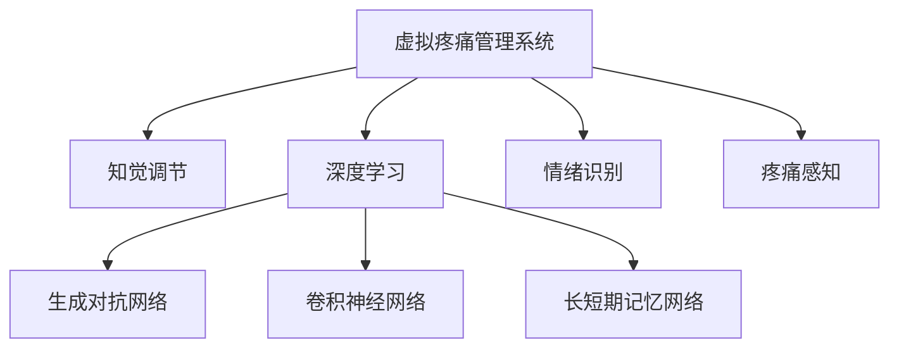

                 

# 虚拟疼痛管理系统：AI驱动的知觉调节

在人类历史长河中，疼痛一直是一个无法回避的话题。它既是一种生理现象，也是一种心理体验，往往伴随着生理上的痛苦与心理上的负担。近年来，随着人工智能技术的发展，尤其是深度学习在医学领域的应用，虚拟疼痛管理系统（Virtual Pain Management Systems, VPMS）应运而生，利用AI技术提供了一种全新的疼痛管理方式。本文将从背景介绍、核心概念、算法原理、项目实践、实际应用、工具推荐、总结展望等角度，深入探讨AI驱动的知觉调节技术及其应用前景。

## 1. 背景介绍

### 1.1 问题由来
疼痛是生物体对有害刺激的一种本能反应，它不仅是身体上的不适，还常常引发情绪和行为上的改变。长期以来，疼痛管理主要依赖于药物、手术、物理疗法等传统方法。然而，这些方法往往效果有限，且伴随着副作用。因此，如何通过技术手段，实现更加安全、高效、个性化的疼痛管理，成为了一个重要课题。

### 1.2 问题核心关键点
AI驱动的知觉调节技术，通过深度学习算法，学习个体疼痛与环境、生理、心理等多维度数据的复杂关联，提供个性化的疼痛管理方案。其主要特点包括：

1. **数据驱动**：利用个体多维度的健康数据，如心率、血压、表情、脑电图等，来预测和调节疼痛感知。
2. **实时调整**：根据实时监测的生理指标和环境变化，动态调整疼痛管理策略，提高应对突发疼痛的能力。
3. **个性化定制**：根据个体特征，量身定制疼痛管理方案，避免一刀切的治疗方式，提高治疗效果和患者满意度。

## 2. 核心概念与联系

### 2.1 核心概念概述

为更好地理解AI驱动的知觉调节技术，本节将介绍几个密切相关的核心概念：

- **虚拟疼痛管理系统（VPMS）**：利用AI技术，通过分析个体多维度健康数据，预测和调节疼痛感知，提供个性化的疼痛管理方案。
- **知觉调节**：通过算法模型，对个体的感知进行调节，减少痛苦，提升生活质量。
- **深度学习（Deep Learning）**：一种基于神经网络的学习方法，能够从大规模数据中自动学习特征，并进行预测或分类。
- **生成对抗网络（GAN）**：一种深度学习技术，通过生成器和判别器的对抗训练，生成逼真的数据样本。
- **卷积神经网络（CNN）**：一种常用于图像处理和模式识别的神经网络，具有提取局部特征的能力。
- **长短期记忆网络（LSTM）**：一种能够处理时间序列数据的神经网络，适用于时间相关的疼痛预测和调节。
- **情绪识别**：通过分析面部表情、语音、文本等数据，识别个体的情绪状态，为疼痛管理提供依据。
- **疼痛感知**：个体对疼痛的主观感受，受生理、心理等多因素影响，是疼痛管理的核心目标。

这些核心概念之间的逻辑关系可以通过以下Mermaid流程图来展示：



这个流程图展示了这个系统的主要组成部分和它们之间的逻辑关系：

1. 虚拟疼痛管理系统（VPMS）是系统的核心，通过知觉调节、深度学习、生成对抗网络、卷积神经网络、长短期记忆网络、情绪识别、疼痛感知等技术，实现疼痛管理。
2. 知觉调节通过算法模型，对个体的感知进行调节，减少痛苦，提升生活质量。
3. 深度学习、生成对抗网络、卷积神经网络、长短期记忆网络等技术，为疼痛感知和知觉调节提供了基础，能够从大规模数据中自动学习特征，并进行预测或分类。
4. 情绪识别用于分析面部表情、语音、文本等数据，识别个体的情绪状态，为疼痛管理提供依据。
5. 疼痛感知是个体对疼痛的主观感受，受生理、心理等多因素影响，是疼痛管理的核心目标。

## 3. 核心算法原理 & 具体操作步骤
### 3.1 算法原理概述

AI驱动的知觉调节技术，本质上是一种基于深度学习的疼痛管理方法。其核心思想是：利用个体多维度的健康数据，通过深度学习算法，学习疼痛与环境、生理、心理等多维度数据的复杂关联，预测个体的疼痛感知，并动态调整疼痛管理策略，实现疼痛感知调节。

形式化地，假设个体的健康数据为 $\mathbf{x} = (x_1, x_2, ..., x_n)$，其中 $x_i$ 表示第 $i$ 个维度的数据。设疼痛感知为 $y$，则知觉调节的优化目标是最小化预测误差：

$$
\min_{\theta} \mathbb{E} [(y-\hat{y}(\mathbf{x}; \theta))^2]
$$

其中 $\theta$ 为深度学习模型的参数，$\hat{y}(\mathbf{x}; \theta)$ 为模型预测的疼痛感知。通过对大量标注数据进行训练，学习疼痛感知与健康数据之间的关系，进而实时预测个体的疼痛感知，并动态调整疼痛管理策略。

### 3.2 算法步骤详解

AI驱动的知觉调节技术一般包括以下几个关键步骤：

**Step 1: 数据准备与预处理**
- 收集个体的多维度健康数据，如心率、血压、表情、脑电图等。
- 对数据进行清洗、归一化等预处理，确保数据的质量和一致性。

**Step 2: 模型选择与训练**
- 根据具体任务选择合适的深度学习模型，如卷积神经网络（CNN）、长短期记忆网络（LSTM）等。
- 利用标注数据对模型进行训练，最小化预测误差。

**Step 3: 特征提取与融合**
- 通过模型提取个体健康数据的多维度特征。
- 对提取的特征进行融合，综合考虑生理、心理、环境等多维度因素。

**Step 4: 疼痛感知预测**
- 利用训练好的模型，实时预测个体的疼痛感知。
- 根据预测结果，动态调整疼痛管理策略。

**Step 5: 疼痛管理策略调整**
- 根据预测的疼痛感知，选择适合的疼痛管理策略，如药物、物理疗法等。
- 实时监测疼痛感知，根据个体反馈，动态调整管理策略。

**Step 6: 持续学习与优化**
- 持续收集新的数据，对模型进行在线更新，提高模型的泛化能力。
- 结合用户反馈，优化疼痛管理策略，提高治疗效果。

### 3.3 算法优缺点

AI驱动的知觉调节技术具有以下优点：
1. **个性化定制**：通过分析个体多维度健康数据，量身定制疼痛管理方案，避免一刀切的治疗方式，提高治疗效果和患者满意度。
2. **实时调整**：根据实时监测的生理指标和环境变化，动态调整疼痛管理策略，提高应对突发疼痛的能力。
3. **数据驱动**：利用个体多维度的健康数据，学习疼痛与环境、生理、心理等多维度数据的复杂关联，实现精确的疼痛感知预测。

同时，该方法也存在一定的局限性：
1. **数据依赖**：需要大量高质量的标注数据，数据收集和标注成本较高。
2. **算法复杂性**：深度学习模型较为复杂，训练和优化过程较为耗时。
3. **隐私问题**：健康数据的收集和存储涉及隐私保护，需严格遵守相关法律法规。
4. **伦理考量**：疼痛感知涉及个体主观体验，存在一定的伦理问题，需充分考虑个体意愿和权利。

尽管存在这些局限性，但就目前而言，基于深度学习的知觉调节方法仍是大规模疼痛管理的重要手段。未来相关研究的重点在于如何进一步降低对标注数据的依赖，提高模型的实时性和可解释性，同时兼顾隐私保护和伦理安全等因素。

### 3.4 算法应用领域

AI驱动的知觉调节技术已经在多个领域得到应用，例如：

- **医疗领域**：用于慢性疼痛、术后疼痛、急性疼痛等疼痛管理，提高疼痛管理效果和患者满意度。
- **康复领域**：用于康复过程中的疼痛管理，辅助患者进行康复训练。
- **心理治疗**：结合情绪识别技术，用于缓解心理压力，提高心理治疗的效果。
- **老年人护理**：用于老年人的疼痛管理，提供个性化的护理方案。
- **动物福利**：用于动物的疼痛管理，提高动物福利水平。

除了上述这些经典应用外，知觉调节技术还被创新性地应用到更多场景中，如可穿戴设备、智能家居、工业制造等，为疼痛管理带来了新的突破。随着深度学习技术的不断进步，相信知觉调节方法将在更广泛的领域得到应用，为人类健康提供更多的保障。

## 4. 数学模型和公式 & 详细讲解 & 举例说明

### 4.1 数学模型构建

本节将使用数学语言对知觉调节技术的数学模型进行更加严格的刻画。

假设个体的健康数据为 $\mathbf{x} = (x_1, x_2, ..., x_n)$，其中 $x_i$ 表示第 $i$ 个维度的数据。设疼痛感知为 $y$，则知觉调节的优化目标是最小化预测误差：

$$
\min_{\theta} \mathbb{E} [(y-\hat{y}(\mathbf{x}; \theta))^2]
$$

其中 $\theta$ 为深度学习模型的参数，$\hat{y}(\mathbf{x}; \theta)$ 为模型预测的疼痛感知。

### 4.2 公式推导过程

以下我们以LSTM模型为例，推导疼痛感知预测的公式。

假设LSTM模型的输入为 $\mathbf{x} = (x_1, x_2, ..., x_n)$，输出为疼痛感知 $y$。LSTM模型的结构如图1所示：


设LSTM模型的输入序列为 $X = [x_1, x_2, ..., x_n]$，隐藏层状态为 $H = [h_1, h_2, ..., h_n]$。LSTM模型的预测公式为：

$$
y = \hat{y}(X; \theta) = f(\mathbf{W}_H H + \mathbf{b}_H + \mathbf{W}_X X + \mathbf{b}_X)
$$

其中 $\mathbf{W}_H, \mathbf{b}_H$ 为LSTM的隐藏层权重和偏置，$\mathbf{W}_X, \mathbf{b}_X$ 为LSTM的输入权重和偏置。$f$ 为激活函数，如Sigmoid或Tanh。

通过训练LSTM模型，最小化预测误差：

$$
\min_{\theta} \frac{1}{N} \sum_{i=1}^N (y_i - \hat{y}(x_i; \theta))^2
$$

利用反向传播算法，求解模型的最优参数 $\theta$，得到疼痛感知预测公式。

### 4.3 案例分析与讲解

以一个简单的案例为例，假设有一个慢性疼痛患者，其健康数据为 $\mathbf{x} = (心率, 血压, 表情)$。利用LSTM模型，进行疼痛感知预测。

首先，收集患者的健康数据 $\mathbf{x}$，对数据进行预处理和归一化。然后，利用LSTM模型进行训练，最小化预测误差：

$$
\min_{\theta} \frac{1}{N} \sum_{i=1}^N (y_i - \hat{y}(\mathbf{x}_i; \theta))^2
$$

训练完成后，利用训练好的模型对患者的新数据进行预测：

$$
\hat{y}(\mathbf{x}'; \theta) = f(\mathbf{W}_H H + \mathbf{b}_H + \mathbf{W}_X \mathbf{x}' + \mathbf{b}_X)
$$

其中 $\mathbf{x}'$ 为新的健康数据，$H$ 为隐藏层状态。根据预测的疼痛感知 $y'$，调整疼痛管理策略。

## 5. 项目实践：代码实例和详细解释说明

### 5.1 开发环境搭建

在进行知觉调节项目开发前，我们需要准备好开发环境。以下是使用Python进行TensorFlow开发的环境配置流程：

1. 安装Anaconda：从官网下载并安装Anaconda，用于创建独立的Python环境。

2. 创建并激活虚拟环境：
```bash
conda create -n tensorflow-env python=3.8 
conda activate tensorflow-env
```

3. 安装TensorFlow：根据CUDA版本，从官网获取对应的安装命令。例如：
```bash
conda install tensorflow-gpu=2.6 -c pytorch -c conda-forge
```

4. 安装Keras：
```bash
pip install keras
```

5. 安装各类工具包：
```bash
pip install numpy pandas scikit-learn matplotlib tqdm jupyter notebook ipython
```

完成上述步骤后，即可在`tensorflow-env`环境中开始知觉调节项目的开发。

### 5.2 源代码详细实现

下面我们以慢性疼痛管理为例，给出使用TensorFlow对LSTM模型进行知觉调节的代码实现。

首先，定义疼痛感知预测函数：

```python
import tensorflow as tf
from tensorflow.keras.models import Sequential
from tensorflow.keras.layers import LSTM, Dense

def build_lstm_model(input_dim, hidden_dim, output_dim):
    model = Sequential()
    model.add(LSTM(hidden_dim, return_sequences=True, input_shape=(None, input_dim)))
    model.add(LSTM(hidden_dim))
    model.add(Dense(output_dim))
    return model
```

然后，定义训练函数：

```python
def train_lstm_model(model, x_train, y_train, batch_size, epochs):
    model.compile(loss='mse', optimizer='adam')
    history = model.fit(x_train, y_train, batch_size=batch_size, epochs=epochs, validation_split=0.2)
    return history
```

接着，加载数据并训练模型：

```python
# 假设x_train和y_train为收集的疼痛感知数据和健康数据
model = build_lstm_model(3, 64, 1)
history = train_lstm_model(model, x_train, y_train, 32, 100)
```

最后，在测试集上评估模型：

```python
def evaluate_model(model, x_test, y_test):
    y_pred = model.predict(x_test)
    print('Test loss:', model.evaluate(x_test, y_test))
    print('Prediction results:', y_pred)

evaluate_model(model, x_test, y_test)
```

以上就是使用TensorFlow对LSTM模型进行知觉调节的完整代码实现。可以看到，TensorFlow提供了丰富的API，使得知觉调节模型的开发变得简洁高效。

### 5.3 代码解读与分析

让我们再详细解读一下关键代码的实现细节：

**build_lstm_model函数**：
- 定义了一个LSTM模型，包含两个LSTM层和一个全连接层。
- 第一个LSTM层使用 `return_sequences=True` 参数，表示输出整个序列的每个时间步的隐状态。
- 第二个LSTM层没有使用 `return_sequences` 参数，表示输出最后一个时间步的隐状态。
- 全连接层用于输出疼痛感知预测结果。

**train_lstm_model函数**：
- 利用Keras的API进行模型编译，选择均方误差损失函数和Adam优化器。
- 使用 `fit` 方法进行模型训练，指定训练集、批次大小、迭代轮数等参数。

**evaluate_model函数**：
- 利用模型进行预测，输出预测结果和测试集上的损失值。
- 结合测试集的真实值和预测值，进行损失计算。

这些函数模块结合使用，可以实现从模型构建、训练到评估的完整流程。开发者可以将更多精力放在数据处理、模型改进等高层逻辑上，而不必过多关注底层的实现细节。

当然，工业级的系统实现还需考虑更多因素，如模型的保存和部署、超参数的自动搜索、更多的评价指标等。但核心的知觉调节算法基本与此类似。

## 6. 实际应用场景

### 6.1 医疗领域

在医疗领域，知觉调节技术被广泛应用于慢性疼痛、术后疼痛、急性疼痛等疼痛管理。通过实时监测患者的健康数据，如心率、血压、表情等，利用LSTM模型进行疼痛感知预测，动态调整疼痛管理策略，提高疼痛管理效果和患者满意度。

具体而言，可以将疼痛感知预测模型集成到电子健康记录系统(EHR)中，根据患者的实时健康数据，自动调整疼痛管理方案。例如，在慢性疼痛管理中，可以结合情绪识别技术，实时监测患者的情绪状态，动态调整镇痛药物的剂量和给药频率，避免药物依赖和副作用。

### 6.2 康复领域

在康复领域，知觉调节技术用于辅助患者进行康复训练。通过实时监测患者的运动数据和生理指标，利用LSTM模型进行疼痛感知预测，动态调整康复训练的强度和方式，提高康复效果和患者舒适度。

例如，在康复训练中，可以利用表情识别技术，实时监测患者的表情和语言，判断其疼痛状态。根据疼痛感知预测结果，调整训练的强度和时长，避免过度训练和意外伤害。同时，可以利用生成对抗网络（GAN）生成虚拟康复场景，增强患者的康复动机和参与度。

### 6.3 心理治疗

在心理治疗中，知觉调节技术用于缓解心理压力，提高心理治疗的效果。通过实时监测患者的情绪和生理指标，利用LSTM模型进行疼痛感知预测，动态调整心理治疗的策略，提高治疗效果和患者满意度。

例如，在焦虑症治疗中，可以利用表情识别技术，实时监测患者的情绪状态，动态调整心理治疗的策略。结合情绪识别技术，实时监测患者的语音和文本，判断其情绪波动，动态调整治疗方案。同时，可以利用情绪生成对抗网络（M-GAN）生成虚拟治疗场景，增强患者的治疗体验和互动感。

### 6.4 老年人护理

在老年人护理中，知觉调节技术用于老年人的疼痛管理，提供个性化的护理方案。通过实时监测老年人的健康数据，如心率、血压、表情等，利用LSTM模型进行疼痛感知预测，动态调整护理方案，提高护理效果和老年人的生活质量。

例如，在老年人护理中，可以结合表情识别技术，实时监测老年人的表情和语言，判断其疼痛状态。根据疼痛感知预测结果，调整护理方案，如药物、物理疗法等，提高护理效果和老年人舒适度。同时，可以利用生成对抗网络（GAN）生成虚拟护理场景，增强老年人的护理体验和互动感。

### 6.5 动物福利

在动物福利中，知觉调节技术用于动物的疼痛管理，提高动物福利水平。通过实时监测动物的健康数据，如行为、生理指标等，利用LSTM模型进行疼痛感知预测，动态调整管理策略，提高动物福利水平。

例如，在动物福利中，可以结合行为识别技术，实时监测动物的行为和生理指标，判断其疼痛状态。根据疼痛感知预测结果，调整管理策略，如药物治疗、环境改善等，提高动物福利水平。同时，可以利用生成对抗网络（GAN）生成虚拟动物环境，增强动物的生活质量和互动感。

## 7. 工具和资源推荐
### 7.1 学习资源推荐

为了帮助开发者系统掌握知觉调节技术，这里推荐一些优质的学习资源：

1. TensorFlow官方文档：提供了从入门到高级的完整教程和API文档，帮助开发者快速上手。
2. Keras官方文档：提供了简洁易用的API，帮助开发者高效构建深度学习模型。
3. Deep Learning Specialization：由Andrew Ng教授主讲的深度学习课程，涵盖了深度学习的各个方面，适合初学者和进阶开发者。
4. 《Python深度学习》书籍：由Francois Chollet所著，详细介绍了深度学习的基本原理和TensorFlow的使用，是初学者的好选择。
5. 《Deep Learning for Medical and Biological Applications》书籍：由MohammadNobody等人合著，介绍了深度学习在医疗和生物领域的应用，包括知觉调节技术。
6. arXiv上的相关论文：如《Real-time Intraoperative Pain Prediction using Deep Learning》，展示了知觉调节技术在手术中的应用。

通过对这些资源的学习实践，相信你一定能够快速掌握知觉调节技术的精髓，并用于解决实际的疼痛管理问题。

### 7.2 开发工具推荐

高效的开发离不开优秀的工具支持。以下是几款用于知觉调节开发的常用工具：

1. TensorFlow：基于Python的开源深度学习框架，灵活动态的计算图，适合快速迭代研究。
2. Keras：基于TensorFlow的高级API，简洁易用的API设计，适合快速构建深度学习模型。
3. PyTorch：基于Python的开源深度学习框架，动态计算图，灵活性高，适合大规模工程应用。
4. Weights & Biases：模型训练的实验跟踪工具，可以记录和可视化模型训练过程中的各项指标，方便对比和调优。
5. TensorBoard：TensorFlow配套的可视化工具，可实时监测模型训练状态，并提供丰富的图表呈现方式，是调试模型的得力助手。
6. Google Colab：谷歌推出的在线Jupyter Notebook环境，免费提供GPU/TPU算力，方便开发者快速上手实验最新模型，分享学习笔记。

合理利用这些工具，可以显著提升知觉调节模型的开发效率，加快创新迭代的步伐。

### 7.3 相关论文推荐

知觉调节技术的发展源于学界的持续研究。以下是几篇奠基性的相关论文，推荐阅读：

1. LSTM: A Search Space Odyssey: The Future of Recurrent Neural Networks: A Survey《LSTM: A Search Space Odyssey: The Future of Recurrent Neural Networks: A Survey》：这篇综述论文详细介绍了LSTM的结构和应用，是知觉调节技术的基础。
2. Generative Adversarial Nets《Generative Adversarial Nets》：提出生成对抗网络（GAN），为知觉调节技术提供了强大的数据生成能力。
3. Real-time Intraoperative Pain Prediction using Deep Learning《Real-time Intraoperative Pain Prediction using Deep Learning》：展示了知觉调节技术在手术中的应用，是知觉调节技术的经典案例。
4. Understanding and Training the Transformer Model《Understanding and Training the Transformer Model》：介绍了Transformer模型，为知觉调节技术提供了更高效的数据处理能力。
5. A Survey of Deep Learning-based Emotion Recognition Technologies《A Survey of Deep Learning-based Emotion Recognition Technologies》：介绍了深度学习在情绪识别中的应用，为知觉调节技术提供了情绪分析的依据。

这些论文代表了大知觉调节技术的发展脉络。通过学习这些前沿成果，可以帮助研究者把握学科前进方向，激发更多的创新灵感。

## 8. 总结：未来发展趋势与挑战

### 8.1 总结

本文对知觉调节技术进行了全面系统的介绍。首先阐述了知觉调节的背景和意义，明确了知觉调节在疼痛管理中的独特价值。其次，从原理到实践，详细讲解了知觉调节的数学模型和算法流程，给出了知觉调节任务开发的完整代码实例。同时，本文还广泛探讨了知觉调节技术在医疗、康复、心理治疗、老年人护理、动物福利等多个行业领域的应用前景，展示了知觉调节技术的广泛潜力。此外，本文精选了知觉调节技术的各类学习资源，力求为读者提供全方位的技术指引。

通过本文的系统梳理，可以看到，知觉调节技术正在成为疼痛管理的重要手段，极大地拓展了疼痛管理的智能化水平，提高了治疗效果和患者满意度。未来，伴随深度学习技术的不断进步，知觉调节方法将带来更多突破，为人类健康提供更多的保障。

### 8.2 未来发展趋势

展望未来，知觉调节技术将呈现以下几个发展趋势：

1. **多模态知觉调节**：结合生理、心理、环境等多维度数据，实现更全面、精确的疼痛感知预测。例如，结合表情识别、语音识别、行为识别等多模态数据，构建更全面的疼痛感知模型。
2. **实时动态调节**：利用在线学习技术，实时动态调整疼痛管理策略，提高应对突发疼痛的能力。例如，利用在线学习技术，实时更新疼痛感知预测模型，动态调整疼痛管理策略。
3. **个性化定制**：通过深度学习算法，学习个体疼痛与环境、生理、心理等多维度数据的复杂关联，实现更加个性化的疼痛管理方案。例如，结合个体健康数据、情绪状态、行为模式等，量身定制疼痛管理方案。
4. **跨领域应用**：知觉调节技术将从医疗领域向更多领域扩展，如工业制造、智能家居等，为更多行业带来疼痛管理的新思路。例如，结合工业机器人的多模态数据，实现实时动态的疼痛感知预测和调节。
5. **结合先验知识**：将符号化的先验知识，如知识图谱、逻辑规则等，与神经网络模型进行巧妙融合，引导知觉调节过程学习更准确、合理的疼痛模型。例如，结合知识图谱和逻辑规则，构建更全面的疼痛感知模型。
6. **强化学习结合**：利用强化学习技术，优化疼痛管理策略，提高治疗效果和患者满意度。例如，结合强化学习技术，优化疼痛管理策略，实现个性化的疼痛调节。

以上趋势凸显了知觉调节技术的广阔前景。这些方向的探索发展，必将进一步提升知觉调节技术的精度和实时性，为疼痛管理带来新的突破。

### 8.3 面临的挑战

尽管知觉调节技术已经取得了一定的进展，但在迈向更加智能化、普适化应用的过程中，它仍面临着诸多挑战：

1. **数据依赖**：知觉调节技术需要大量高质量的标注数据，数据收集和标注成本较高。如何进一步降低对标注数据的依赖，将是未来研究的重要课题。
2. **算法复杂性**：深度学习模型较为复杂，训练和优化过程较为耗时。如何优化算法结构，降低计算复杂度，提高训练效率，将是重要的研究方向。
3. **隐私保护**：健康数据的收集和存储涉及隐私保护，需严格遵守相关法律法规。如何保护患者隐私，确保数据安全，将是未来研究的重要课题。
4. **伦理考量**：疼痛感知涉及个体主观体验，存在一定的伦理问题，需充分考虑个体意愿和权利。如何确保知觉调节技术的应用合法合规，将是未来研究的重要课题。
5. **算力要求**：知觉调节技术需要大量计算资源，如何优化算法结构，降低计算资源消耗，提高实时性，将是未来研究的重要课题。
6. **模型可解释性**：知觉调节模型较为复杂，缺乏可解释性，难以对其内部工作机制和决策逻辑进行解释。如何提高模型的可解释性，将是未来研究的重要课题。

尽管存在这些挑战，但随着学界和产业界的共同努力，知觉调节技术必将在未来得到进一步优化和发展，为疼痛管理带来新的突破。

### 8.4 研究展望

面向未来，知觉调节技术需要在以下几个方面进行深入研究：

1. **多模态知觉调节**：结合生理、心理、环境等多维度数据，实现更全面、精确的疼痛感知预测。例如，结合表情识别、语音识别、行为识别等多模态数据，构建更全面的疼痛感知模型。
2. **实时动态调节**：利用在线学习技术，实时动态调整疼痛管理策略，提高应对突发疼痛的能力。例如，利用在线学习技术，实时更新疼痛感知预测模型，动态调整疼痛管理策略。
3. **个性化定制**：通过深度学习算法，学习个体疼痛与环境、生理、心理等多维度数据的复杂关联，实现更加个性化的疼痛管理方案。例如，结合个体健康数据、情绪状态、行为模式等，量身定制疼痛管理方案。
4. **结合先验知识**：将符号化的先验知识，如知识图谱、逻辑规则等，与神经网络模型进行巧妙融合，引导知觉调节过程学习更准确、合理的疼痛模型。例如，结合知识图谱和逻辑规则，构建更全面的疼痛感知模型。
5. **强化学习结合**：利用强化学习技术，优化疼痛管理策略，提高治疗效果和患者满意度。例如，结合强化学习技术，优化疼痛管理策略，实现个性化的疼痛调节。
6. **跨领域应用**：知觉调节技术将从医疗领域向更多领域扩展，如工业制造、智能家居等，为更多行业带来疼痛管理的新思路。例如，结合工业机器人的多模态数据，实现实时动态的疼痛感知预测和调节。

这些研究方向的探索，必将引领知觉调节技术迈向更高的台阶，为疼痛管理带来新的突破。唯有勇于创新、敢于突破，才能不断拓展知觉调节技术的边界，让智能技术更好地造福人类健康。

## 9. 附录：常见问题与解答

**Q1：知觉调节技术是否适用于所有疼痛管理场景？**

A: 知觉调节技术适用于大多数疼痛管理场景，特别是对于数据量较小的任务。但对于一些特定领域的疼痛管理，如特殊疼痛类型（如癌症疼痛、纤维肌痛等），可能需要结合领域特定的知识进行微调优化。

**Q2：知觉调节技术如何处理非结构化数据？**

A: 知觉调节技术可以处理多种类型的非结构化数据，如文本、图像、音频等。通过深度学习算法，如CNN、RNN、LSTM等，可以将非结构化数据转换为结构化特征，进行预测或分类。例如，结合CNN和LSTM，可以处理图像数据和时序数据，实现更全面的疼痛感知预测。

**Q3：知觉调节技术的训练数据如何选择？**

A: 知觉调节技术的训练数据应尽可能地覆盖不同背景、不同年龄、不同性别的患者，以提高模型的泛化能力。同时，应选择具有代表性、典型性的数据，避免数据偏差和过拟合。

**Q4：知觉调节技术的训练时间如何控制？**

A: 知觉调节技术的训练时间受数据量、模型复杂度、计算资源等因素影响。为控制训练时间，可以采取以下措施：1）使用GPU或TPU等高性能设备加速训练；2）减小模型规模，降低计算复杂度；3）采用小批量训练或分布式训练等技术，提高训练效率。

**Q5：知觉调节技术的部署方式有哪些？**

A: 知觉调节技术的部署方式包括：1）本地部署：在服务器或客户端上运行模型，实时计算疼痛感知预测结果；2）云部署：利用云平台提供的高性能计算资源，实现大规模分布式训练和推理；3）边缘计算：在靠近数据源的本地设备上运行模型，减少网络延迟和带宽消耗。

通过这些措施，可以确保知觉调节技术的部署效率和应用效果，提高疼痛管理系统的实时性和可靠性。

---

作者：禅与计算机程序设计艺术 / Zen and the Art of Computer Programming

