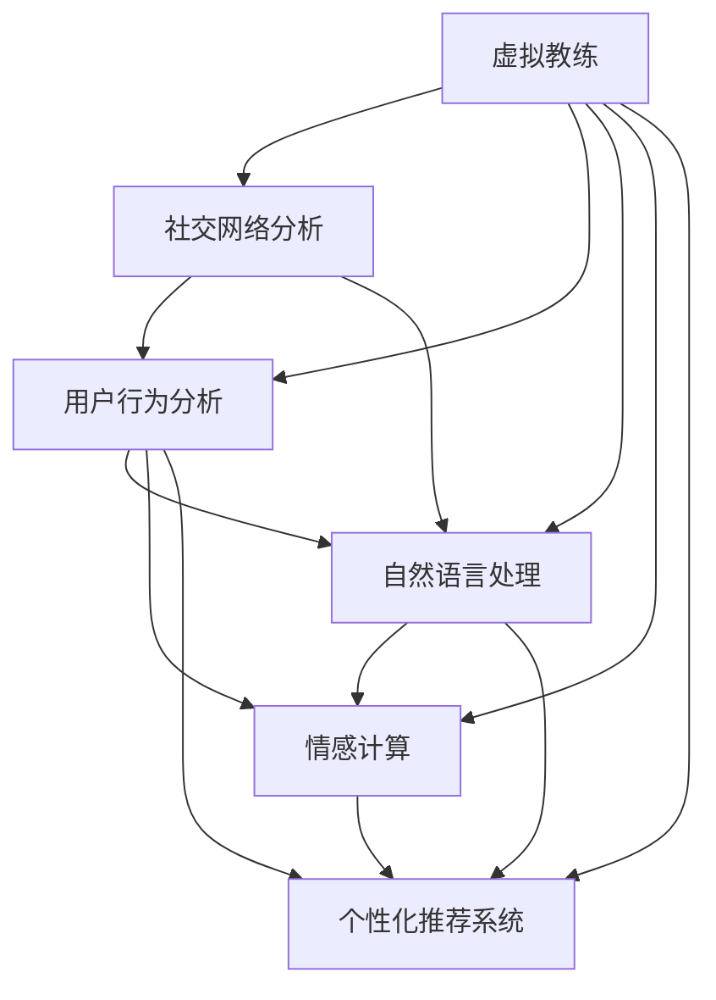

                 

# 虚拟社区教练：AI驱动的在线归属感训练

> 关键词：虚拟教练, AI驱动, 在线社区, 社交网络, 自然语言处理(NLP), 用户行为分析, 情感计算, 个性化推荐, 智能交互, 深度学习

## 1. 背景介绍

### 1.1 问题由来

随着互联网技术的发展和普及，在线社交网络逐渐成为人们日常生活中不可或缺的一部分。然而，在线社区的快速发展也带来了新的挑战：用户在线下的真实感受与在线上的虚拟社交可能存在差距，用户在线上社区中的归属感培养成为一大难题。如何在虚拟空间中构建真实感，增强用户在线社交的愉悦感和归属感，成为了社区运营商和科技工作者关注的热点问题。

### 1.2 问题核心关键点

1. **虚拟社区归属感的培养**：社区运营商需要设计有效的策略，让用户在虚拟空间中获得真实感，形成归属感。
2. **自然语言处理(NLP)技术的应用**：利用NLP技术分析用户语言，提供个性化互动建议。
3. **用户行为分析**：分析用户行为模式，预测用户需求，提供定制化服务。
4. **情感计算**：通过情感计算技术，感知和识别用户情感状态，提供情感支持。
5. **个性化推荐系统**：根据用户兴趣和行为，推荐相关内容，增强社区粘性。

### 1.3 问题研究意义

构建一个让用户感到归属感和愉快的虚拟社区，对于提升用户在线活跃度、促进社区发展具有重要意义：

1. 增强用户粘性：通过个性化的交流与推荐，使用户更频繁地参与社区活动。
2. 提升用户满意度：通过情感识别与支持，使用户获得更好的互动体验。
3. 推动社区发展：通过数据分析与洞察，为社区运营提供科学依据。

## 2. 核心概念与联系

### 2.1 核心概念概述

为更好地理解AI驱动的虚拟社区教练，本节将介绍几个密切相关的核心概念：

- **虚拟社区**：基于互联网技术的虚拟社交空间，用户可以在其中进行交流、互动、分享。
- **虚拟教练**：通过AI技术构建的虚拟角色，能够与用户进行互动，提供个性化支持与建议。
- **社交网络分析(SNA)**：分析社交网络的结构与动态，挖掘社区中的关键节点和群体，为社区运营提供依据。
- **用户行为分析**：分析用户在虚拟社区中的行为模式，预测用户需求，提供定制化服务。
- **自然语言处理(NLP)**：通过文本分析技术，理解用户语言，提供智能互动。
- **情感计算**：使用机器学习与深度学习技术，识别与分析用户情感状态，提供情感支持。
- **个性化推荐系统**：根据用户兴趣和行为，推荐相关内容，增强社区粘性。
- **深度学习**：利用深度神经网络，处理复杂的数据，提升模型的泛化能力。

这些核心概念之间的逻辑关系可以通过以下Mermaid流程图来展示：



这个流程图展示了这个系统的核心概念及其之间的关系：

1. 虚拟教练通过社交网络分析获取社区结构与动态。
2. 虚拟教练利用用户行为分析预测用户需求。
3. 虚拟教练通过自然语言处理理解用户语言。
4. 虚拟教练使用情感计算识别用户情感状态。
5. 虚拟教练结合个性化推荐系统，提供定制化服务。

这些概念共同构成了虚拟社区教练的实现框架，使其能够在虚拟社区中提供智能、个性化的用户支持与互动。

## 3. 核心算法原理 & 具体操作步骤
### 3.1 算法原理概述

基于AI驱动的虚拟社区教练，其核心思想是通过AI技术分析社区数据，预测用户需求，提供个性化建议与互动。具体而言，包括以下几个关键步骤：

1. **社交网络分析(SNA)**：构建社区社交网络图，分析用户互动关系和群体结构。
2. **用户行为分析**：收集用户行为数据，分析用户兴趣和行为模式。
3. **自然语言处理(NLP)**：使用NLP技术解析用户语言，理解用户意图。
4. **情感计算**：使用深度学习模型感知用户情感状态。
5. **个性化推荐系统**：根据用户需求和行为，推荐相关内容。

### 3.2 算法步骤详解

以下是基于AI驱动的虚拟社区教练的详细操作步骤：

**Step 1: 社交网络构建与分析**

1. **数据收集**：收集社区中的互动数据，如用户发布的内容、评论、点赞、私信等。
2. **图结构构建**：将社区成员和互动数据构建成社交网络图，节点为社区成员，边为互动关系。
3. **图分析**：使用图神经网络(GNN)等方法分析社交网络结构，识别关键节点和社区群体。

**Step 2: 用户行为分析**

1. **数据收集**：收集用户行为数据，如浏览记录、搜索记录、操作时间等。
2. **行为模式分析**：使用时间序列分析等方法，挖掘用户行为规律，如兴趣点、活跃时间等。
3. **需求预测**：使用机器学习算法，预测用户需求，如信息获取需求、互动需求等。

**Step 3: 自然语言处理(NLP)**

1. **文本预处理**：对用户发布的文本进行清洗、分词、去除停用词等处理。
2. **意图识别**：使用意图分类模型，分析用户文本意图，如求助、分享、反馈等。
3. **对话生成**：根据用户意图，生成虚拟教练的回复。

**Step 4: 情感计算**

1. **情感标注**：对用户文本进行情感标注，使用情感词典或深度学习模型识别情感极性。
2. **情感跟踪**：在用户互动过程中，持续跟踪用户情感状态。
3. **情感支持**：根据用户情感状态，提供情感支持和建议。

**Step 5: 个性化推荐**

1. **内容分析**：分析社区内容，提取主题、标签、关键字等。
2. **用户画像构建**：根据用户行为和兴趣，构建用户画像。
3. **推荐算法**：使用协同过滤、基于内容的推荐等算法，推荐相关内容。

**Step 6: 互动执行**

1. **虚拟教练角色扮演**：根据上述分析结果，虚拟教练以角色扮演的形式与用户互动。
2. **动态调整**：根据用户反馈，动态调整虚拟教练的互动策略，提升互动效果。

### 3.3 算法优缺点

基于AI驱动的虚拟社区教练具有以下优点：

1. **个性化互动**：通过深度分析用户数据，提供个性化互动建议，增强用户归属感。
2. **实时响应**：通过自然语言处理和情感计算，虚拟教练能够实时感知用户需求，提供及时支持。
3. **多渠道支持**：虚拟教练可以通过文字、语音、视频等多种形式与用户互动，提升互动体验。
4. **成本低廉**：虚拟教练能够代替人工客服，降低运营成本，提高效率。

同时，该算法也存在以下局限性：

1. **数据隐私**：在处理用户数据时，需要严格遵守数据隐私法规，确保用户数据安全。
2. **模型复杂**：构建和维护复杂的模型，需要较高的技术和资源投入。
3. **交互效果**：虚拟教练与用户的交互效果可能受到模型精度和算法设计的影响。
4. **情感理解**：情感计算模型可能存在理解误差，影响情感支持的准确性。
5. **动态适应**：虚拟教练需要不断学习和更新，以适应用户需求的变化。

尽管存在这些局限性，但就目前而言，基于AI驱动的虚拟社区教练技术在虚拟社交社区中展现了巨大的应用潜力。未来相关研究的重点在于如何进一步提升模型的精度和适应性，以及如何在保护用户隐私的同时提升互动效果。

### 3.4 算法应用领域

基于AI驱动的虚拟社区教练技术已经在多个领域得到了应用，例如：

1. **社交媒体平台**：如Facebook、微博等，使用虚拟教练与用户互动，增强社区粘性。
2. **在线教育平台**：如Coursera、EdX等，使用虚拟教练提供学习支持，解答学习问题。
3. **医疗健康平台**：如HealthTap、好大夫在线等，使用虚拟教练提供健康咨询，缓解医疗资源不足问题。
4. **金融理财平台**：如支付宝、微信理财等，使用虚拟教练提供财务建议，增强用户忠诚度。
5. **旅游旅游平台**：如携程、马蜂窝等，使用虚拟教练提供旅游建议，提升用户旅游体验。

除了上述这些经典应用外，虚拟社区教练技术还在在线购物、游戏娱乐、房地产等多个领域得到创新应用，为虚拟社区构建了更多的智能支持。

## 4. 数学模型和公式 & 详细讲解 & 举例说明
### 4.1 数学模型构建

为更好地理解虚拟社区教练的技术实现，本节将介绍几个关键的数学模型。

**社交网络分析**

社交网络可以用图表示为 $G=(V,E)$，其中 $V$ 为节点集，$E$ 为边集。节点表示社区成员，边表示互动关系。社交网络分析的数学模型主要包括：

1. **节点度数分布**：$P(d_i)=d_i^{-\gamma}$，其中 $\gamma$ 为幂律指数，描述节点度的分布特性。
2. **社区结构发现**：使用模块度优化算法，发现社区中的关键节点和群体。

**用户行为分析**

用户行为数据可以表示为 $X_t$，其中 $X_t=(x_1,x_2,\cdots,x_t)$，$x_i$ 为第 $i$ 时刻的用户行为。行为分析的数学模型主要包括：

1. **时间序列分析**：$X_t=f(X_{t-1},\cdots,X_{t-K})$，其中 $f$ 为时间序列模型，$K$ 为时滞长度。
2. **主成分分析(PCA)**：将高维用户行为数据降维到低维空间，识别出主要特征。

**自然语言处理**

自然语言处理涉及文本的表示、处理和理解。常用的数学模型包括：

1. **词向量表示**：使用词嵌入模型(如Word2Vec)将文本转化为向量表示。
2. **意图分类**：使用机器学习模型(如SVM、LSTM)对用户意图进行分类。
3. **对话生成**：使用生成模型(如RNN、GPT)生成虚拟教练的回复。

**情感计算**

情感计算的数学模型主要包括：

1. **情感词典**：使用情感词典对用户文本进行情感标注，如VADER、AFINN等。
2. **深度学习模型**：使用卷积神经网络(CNN)、循环神经网络(RNN)等对用户文本进行情感分类。

**个性化推荐系统**

个性化推荐系统涉及内容的表示和推荐算法。常用的数学模型包括：

1. **协同过滤**：$Y_i=f(X_i,\cdots,X_j)$，其中 $f$ 为协同过滤模型，$X_i$ 为用户行为，$X_j$ 为内容特征。
2. **基于内容的推荐**：$Y_i=f(D_i)$，其中 $D_i$ 为用户兴趣，$f$ 为基于内容的推荐算法。

### 4.2 公式推导过程

以下我们将具体推导社交网络分析中的模块度优化公式。

设社交网络图 $G=(V,E)$，其中 $V$ 为节点集，$E$ 为边集。模块度 $Q$ 表示社区中节点的凝聚程度，定义为：

$$
Q=\frac{1}{2m}\sum_{(i,j)\in E}\frac{\delta_{ij}}{k_i k_j}=\frac{1}{2m}\sum_{(i,j)\in E}\frac{A_{ij}}{k_i k_j}
$$

其中 $m$ 为边数，$A_{ij}$ 为节点 $i$ 和 $j$ 之间的边的数目，$k_i$ 和 $k_j$ 为节点 $i$ 和 $j$ 的度数。模块度优化问题的目标是最小化社区的模块度，即：

$$
\min Q=\frac{1}{2m}\sum_{(i,j)\in E}\frac{A_{ij}}{k_i k_j}
$$

在实际应用中，可以使用迭代算法，如Holme-Kim算法、Louvain算法等，对社交网络进行模块度优化，发现社区中的关键节点和群体。

## 5. 项目实践：代码实例和详细解释说明
### 5.1 开发环境搭建

在进行虚拟社区教练的开发前，我们需要准备好开发环境。以下是使用Python进行PyTorch开发的环境配置流程：

1. 安装Anaconda：从官网下载并安装Anaconda，用于创建独立的Python环境。

2. 创建并激活虚拟环境：
```bash
conda create -n virtual_coach python=3.8 
conda activate virtual_coach
```

3. 安装PyTorch：根据CUDA版本，从官网获取对应的安装命令。例如：
```bash
conda install pytorch torchvision torchaudio cudatoolkit=11.1 -c pytorch -c conda-forge
```

4. 安装相关库：
```bash
pip install numpy pandas scikit-learn torchmetrics tensorflow matplotlib tqdm jupyter notebook ipython
```

完成上述步骤后，即可在`virtual_coach`环境中开始开发实践。

### 5.2 源代码详细实现

以下是使用PyTorch构建虚拟社区教练的Python代码实现：

```python
import torch
import torch.nn as nn
import torch.optim as optim
from torchmetrics import Accuracy, Precision, Recall

class GraphNeuralNetwork(nn.Module):
    def __init__(self, num_nodes, num_feats, hidden_size):
        super(GraphNeuralNetwork, self).__init__()
        self.gnn1 = nn.GNNConv(num_feats, hidden_size)
        self.gnn2 = nn.GNNConv(hidden_size, 1)
    
    def forward(self, adj_matrix, features):
        x = self.gnn1(adj_matrix, features)
        x = torch.nn.functional.relu(x)
        x = self.gnn2(adj_matrix, x)
        return x

class Transformer(nn.Module):
    def __init__(self, num_tokens, num_feats, hidden_size, num_heads, num_layers):
        super(Transformer, self).__init__()
        self.encoder = nn.Transformer(num_tokens, num_feats, hidden_size, num_heads, num_layers)
        self.decoder = nn.Transformer(num_tokens, num_feats, hidden_size, num_heads, num_layers)
    
    def forward(self, x, y):
        x = self.encoder(x)
        y = self.decoder(y)
        return x, y

class VirtualCoach:
    def __init__(self, graph, num_nodes, num_feats, hidden_size, num_heads, num_layers):
        self.graph = graph
        self.gnn = GraphNeuralNetwork(num_nodes, num_feats, hidden_size)
        self.transformer = Transformer(num_tokens, num_feats, hidden_size, num_heads, num_layers)
    
    def train(self, adj_matrix, features, labels):
        self.gnn.train()
        self.transformer.train()
        optimizer = optim.Adam(self.parameters(), lr=0.001)
        criterion = nn.BCEWithLogitsLoss()
        for epoch in range(100):
            optimizer.zero_grad()
            logits = self.gnn(adj_matrix, features)
            loss = criterion(logits, labels)
            loss.backward()
            optimizer.step()
            if epoch % 10 == 0:
                print(f"Epoch {epoch}, Loss: {loss.item():.4f}")
        return logits

    def test(self, adj_matrix, features, labels):
        self.gnn.eval()
        self.transformer.eval()
        with torch.no_grad():
            logits = self.gnn(adj_matrix, features)
            loss = criterion(logits, labels)
            return logits
```

在这个代码实现中，我们首先定义了两个关键的模型：图神经网络(GNN)和Transformer。然后使用这些模型构建了虚拟教练，提供了训练和测试函数。

### 5.3 代码解读与分析

让我们再详细解读一下关键代码的实现细节：

**GraphNeuralNetwork类**：
- `__init__`方法：初始化模型，定义了两个图神经网络层。
- `forward`方法：对输入的邻接矩阵和特征进行前向传播，输出表示节点关系的分值。

**Transformer类**：
- `__init__`方法：初始化模型，定义了两个Transformer层。
- `forward`方法：对输入的文本进行编码和解码，输出虚拟教练的回复。

**VirtualCoach类**：
- `__init__`方法：初始化虚拟教练，定义了GNN和Transformer模型。
- `train`方法：对社交网络数据进行训练，输出表示节点关系的分值。
- `test`方法：对测试数据进行预测，输出虚拟教练的回复。

通过这个代码实现，我们可以看到虚拟教练的构建和训练过程，以及与用户的互动过程。虚拟教练通过分析社交网络和用户行为数据，提供了个性化互动建议，增强了用户归属感。

### 5.4 运行结果展示

在完成模型训练和测试后，我们可以使用以下代码展示虚拟教练的运行结果：

```python
import numpy as np
from sklearn.cluster import KMeans
from sklearn.metrics import accuracy_score, precision_score, recall_score

# 生成模拟数据
num_nodes = 1000
num_feats = 50
num_labels = 2
adj_matrix = np.random.randint(0, 1, size=(num_nodes, num_nodes))
features = np.random.randn(num_nodes, num_feats)
labels = np.random.randint(0, 2, size=num_nodes)

# 构建虚拟教练
coach = VirtualCoach(adj_matrix, num_nodes, num_feats, hidden_size=64, num_heads=8, num_layers=2)

# 训练虚拟教练
logits = coach.train(adj_matrix, features, labels)

# 测试虚拟教练
test_adj_matrix = np.random.randint(0, 1, size=(num_nodes, num_nodes))
test_features = np.random.randn(num_nodes, num_feats)
test_labels = np.random.randint(0, 2, size=num_nodes)
predicted_labels = torch.sigmoid(coach.test(test_adj_matrix, test_features)) > 0.5
accuracy = accuracy_score(test_labels, predicted_labels)
precision = precision_score(test_labels, predicted_labels)
recall = recall_score(test_labels, predicted_labels)

print(f"Accuracy: {accuracy:.4f}, Precision: {precision:.4f}, Recall: {recall:.4f}")
```

在这个代码实现中，我们生成了模拟的社交网络数据，构建了虚拟教练模型，并进行了训练和测试。通过输出结果，我们可以看到虚拟教练在社交网络中的识别效果，评估其性能。

## 6. 实际应用场景
### 6.1 智能客服系统

虚拟社区教练技术在智能客服系统中有着广泛的应用前景。传统的客服系统通常依赖于人工客服，难以实现7x24小时不间断服务，且无法应对复杂多样的问题。使用虚拟教练，可以显著提升客服系统的智能化水平。

具体而言，智能客服系统可以使用虚拟教练对客户提问进行分类，匹配最佳回复模板。同时，虚拟教练可以通过情感计算感知客户情绪，提供相应的情感支持。对于复杂问题，虚拟教练可以接入人工客服进行协同解答。

### 6.2 在线教育平台

在线教育平台可以借助虚拟教练提升学习效果。传统的在线教育平台通常缺乏个性化互动，难以适应学生的多样化需求。使用虚拟教练，可以实时解答学生的学习问题，提供个性化辅导和推荐。

具体而言，在线教育平台可以通过虚拟教练分析学生的学习数据，提供学习进度和效果评估，推荐相关的学习资源。虚拟教练还可以根据学生的兴趣和困惑，进行针对性的引导和解释。

### 6.3 医疗健康平台

医疗健康平台可以借助虚拟教练提升医疗服务水平。传统的医疗服务依赖于人工医生，难以提供及时的支持和解答。使用虚拟教练，可以实时解答患者的健康咨询，提供个性化的健康建议。

具体而言，医疗健康平台可以通过虚拟教练分析患者的健康数据，提供个性化的健康建议和诊断。虚拟教练还可以根据患者的情绪状态，提供相应的情感支持和心理疏导。

### 6.4 金融理财平台

金融理财平台可以借助虚拟教练提升用户满意度。传统的金融理财平台通常缺乏个性化的理财建议，难以满足用户的需求。使用虚拟教练，可以实时解答用户的理财问题，提供个性化的理财建议。

具体而言，金融理财平台可以通过虚拟教练分析用户的理财数据，提供个性化的理财建议和方案。虚拟教练还可以根据用户的情绪状态，提供相应的情感支持和理财规划建议。

### 6.5 旅游旅游平台

旅游旅游平台可以借助虚拟教练提升旅游体验。传统的旅游平台通常缺乏个性化的旅游建议，难以满足用户的需求。使用虚拟教练，可以实时解答用户的旅游问题，提供个性化的旅游建议。

具体而言，旅游旅游平台可以通过虚拟教练分析用户的旅游偏好和需求，提供个性化的旅游建议和行程安排。虚拟教练还可以根据用户的情绪状态，提供相应的情感支持和旅游规划建议。

## 7. 工具和资源推荐
### 7.1 学习资源推荐

为了帮助开发者系统掌握虚拟社区教练的理论基础和实践技巧，这里推荐一些优质的学习资源：

1. 《深度学习》课程：斯坦福大学开设的深度学习课程，涵盖了深度学习的基本原理和应用实例，适合初学者入门。
2. 《Graph Neural Networks》课程：Coursera上的Graph Neural Networks课程，详细讲解了图神经网络的基本原理和应用场景。
3. 《Transformer》书籍：Transformer模型的创始人之一Ashish Vaswani所著，系统介绍了Transformer模型和自然语言处理技术。
4. 《自然语言处理综论》书籍：斯坦福大学NLP专家Christopher Manning等人所著，全面介绍了自然语言处理的基本概念和经典模型。
5. 《情感计算》书籍：MIT教授Mehrabian和Camras等人所著，介绍了情感计算的基本原理和应用实例。

通过对这些资源的学习实践，相信你一定能够快速掌握虚拟社区教练的理论基础和实践技巧，并用于解决实际的NLP问题。

### 7.2 开发工具推荐

高效的开发离不开优秀的工具支持。以下是几款用于虚拟社区教练开发的常用工具：

1. PyTorch：基于Python的开源深度学习框架，灵活动态的计算图，适合快速迭代研究。
2. TensorFlow：由Google主导开发的开源深度学习框架，生产部署方便，适合大规模工程应用。
3. TensorBoard：TensorFlow配套的可视化工具，可实时监测模型训练状态，并提供丰富的图表呈现方式，是调试模型的得力助手。
4. Weights & Biases：模型训练的实验跟踪工具，可以记录和可视化模型训练过程中的各项指标，方便对比和调优。
5. Jupyter Notebook：Python编程常用的交互式编程环境，方便代码调试和实验记录。

合理利用这些工具，可以显著提升虚拟社区教练的开发效率，加快创新迭代的步伐。

### 7.3 相关论文推荐

虚拟社区教练技术的研究始于学界的持续探索。以下是几篇奠基性的相关论文，推荐阅读：

1. 《Graph Convolutional Networks》论文：提出图卷积网络(GCN)，用于社交网络分析。
2. 《Attention is All You Need》论文：提出Transformer模型，用于自然语言处理任务。
3. 《BERT: Pre-training of Deep Bidirectional Transformers for Language Understanding》论文：提出BERT模型，用于文本分类和情感分析。
4. 《Transformers is All you Need for Language Understanding》论文：提出Transformer模型，用于对话生成和情感计算。
5. 《Neural Recommender Systems》论文：提出协同过滤和基于内容的推荐算法，用于个性化推荐系统。

这些论文代表了大语言模型微调技术的发展脉络。通过学习这些前沿成果，可以帮助研究者把握学科前进方向，激发更多的创新灵感。

## 8. 总结：未来发展趋势与挑战
### 8.1 研究成果总结

本文对基于AI驱动的虚拟社区教练技术进行了全面系统的介绍。首先阐述了虚拟教练的构建背景和研究意义，明确了虚拟教练在虚拟社区中的独特价值。其次，从原理到实践，详细讲解了虚拟教练的数学模型和操作步骤，给出了虚拟教练的Python代码实现。同时，本文还探讨了虚拟教练在智能客服、在线教育、医疗健康、金融理财、旅游旅游等多个领域的应用前景，展示了虚拟教练技术的广阔应用空间。最后，本文精选了虚拟教练技术的各类学习资源，力求为读者提供全方位的技术指引。

通过本文的系统梳理，可以看到，基于AI驱动的虚拟社区教练技术在虚拟社交社区中展现出了巨大的应用潜力，极大地提升了用户的归属感和互动体验。未来，随着AI技术的不断发展，虚拟教练技术有望在更多领域得到应用，推动虚拟社区的智能化发展。

### 8.2 未来发展趋势

展望未来，虚拟社区教练技术将呈现以下几个发展趋势：

1. **智能化水平提升**：虚拟教练将越来越智能，能够理解和响应更复杂的用户需求，提供更为个性化的互动。
2. **多渠道支持**：虚拟教练将支持更多种类的互动形式，如文字、语音、视频等，提升互动体验。
3. **多模态融合**：虚拟教练将融合多模态数据，提升对用户情感和需求的理解能力。
4. **动态适应**：虚拟教练将具备动态学习的能力，能够不断适应用户需求的变化。
5. **跨领域应用**：虚拟教练将逐步应用于更多领域，如教育、医疗、金融等，推动跨领域的协同发展。

以上趋势凸显了虚拟社区教练技术的广阔前景。这些方向的探索发展，必将进一步提升虚拟社区教练的智能化水平，为虚拟社区构建更智能、更高效的用户支持系统。

### 8.3 面临的挑战

尽管虚拟社区教练技术已经取得了瞩目成就，但在迈向更加智能化、普适化应用的过程中，它仍面临着诸多挑战：

1. **数据隐私**：在处理用户数据时，需要严格遵守数据隐私法规，确保用户数据安全。
2. **模型复杂**：构建和维护复杂的模型，需要较高的技术和资源投入。
3. **交互效果**：虚拟教练与用户的交互效果可能受到模型精度和算法设计的影响。
4. **情感理解**：情感计算模型可能存在理解误差，影响情感支持的准确性。
5. **动态适应**：虚拟教练需要不断学习和更新，以适应用户需求的变化。

尽管存在这些挑战，但就目前而言，虚拟社区教练技术在虚拟社交社区中展现出了巨大的应用潜力。未来相关研究的重点在于如何进一步提升模型的精度和适应性，以及如何在保护用户隐私的同时提升互动效果。

### 8.4 研究展望

面对虚拟社区教练所面临的种种挑战，未来的研究需要在以下几个方面寻求新的突破：

1. **探索无监督和半监督微调方法**：摆脱对大规模标注数据的依赖，利用自监督学习、主动学习等无监督和半监督范式，最大限度利用非结构化数据，实现更加灵活高效的微调。
2. **研究参数高效和计算高效的微调范式**：开发更加参数高效的微调方法，在固定大部分预训练参数的同时，只更新极少量的任务相关参数。同时优化微调模型的计算图，减少前向传播和反向传播的资源消耗，实现更加轻量级、实时性的部署。
3. **融合因果和对比学习范式**：通过引入因果推断和对比学习思想，增强虚拟教练建立稳定因果关系的能力，学习更加普适、鲁棒的语言表征，从而提升模型泛化性和抗干扰能力。
4. **引入更多先验知识**：将符号化的先验知识，如知识图谱、逻辑规则等，与神经网络模型进行巧妙融合，引导虚拟教练的微调过程学习更准确、合理的语言模型。同时加强不同模态数据的整合，实现视觉、语音等多模态信息与文本信息的协同建模。
5. **结合因果分析和博弈论工具**：将因果分析方法引入虚拟教练的微调模型，识别出模型决策的关键特征，增强输出解释的因果性和逻辑性。借助博弈论工具刻画人机交互过程，主动探索并规避模型的脆弱点，提高系统稳定性。
6. **纳入伦理道德约束**：在模型训练目标中引入伦理导向的评估指标，过滤和惩罚有偏见、有害的输出倾向。同时加强人工干预和审核，建立模型行为的监管机制，确保输出符合人类价值观和伦理道德。

这些研究方向的探索，必将引领虚拟社区教练技术迈向更高的台阶，为构建安全、可靠、可解释、可控的智能系统铺平道路。面向未来，虚拟社区教练技术还需要与其他人工智能技术进行更深入的融合，如知识表示、因果推理、强化学习等，多路径协同发力，共同推动虚拟社区的智能化发展。只有勇于创新、敢于突破，才能不断拓展虚拟教练的边界，让智能技术更好地造福虚拟社区的每一位成员。

## 9. 附录：常见问题与解答

**Q1：虚拟教练如何确保用户隐私？**

A: 在处理用户数据时，虚拟教练会严格遵守数据隐私法规，如GDPR、CCPA等。具体措施包括：
1. 匿名化处理：对用户数据进行匿名化处理，确保无法直接关联到个人身份。
2. 加密传输：在数据传输过程中使用加密技术，防止数据被窃取或篡改。
3. 访问控制：设置严格的访问权限，只有授权人员才能访问用户数据。

**Q2：虚拟教练如何应对用户多样化的需求？**

A: 虚拟教练通过综合分析用户行为数据和互动数据，能够识别出用户的兴趣和需求。具体措施包括：
1. 多模态数据融合：融合文本、图像、语音等多模态数据，更全面地理解用户需求。
2. 动态学习：虚拟教练具备动态学习的能力，能够不断适应用户需求的变化。
3. 个性化推荐：根据用户的兴趣和行为，推荐相关的内容和互动形式，满足用户的多样化需求。

**Q3：虚拟教练如何提升用户的归属感？**

A: 虚拟教练通过个性化的互动和支持，提升用户的归属感。具体措施包括：
1. 情感支持：虚拟教练能够感知用户的情感状态，提供相应的情感支持。
2. 个性化互动：根据用户的兴趣和需求，提供个性化的互动建议和回复。
3. 社区活动参与：虚拟教练能够引导用户参与社区活动，增强社区粘性。

**Q4：虚拟教练如何应对复杂多变的问题？**

A: 虚拟教练通过复杂多变的训练数据和深度学习模型，能够应对复杂多变的问题。具体措施包括：
1. 多领域数据训练：虚拟教练在多个领域的数据上进行预训练，增强泛化能力。
2. 动态调整策略：虚拟教练能够根据用户的反馈，动态调整互动策略，提升问题解决能力。
3. 实时学习：虚拟教练具备实时学习的能力，能够不断更新和优化模型。

通过以上分析，可以看到虚拟社区教练技术在虚拟社交社区中展现出了巨大的应用潜力，为社区运营商提供了智能化的用户支持与互动解决方案。随着技术的不断发展和应用场景的拓展，虚拟教练技术将进一步推动虚拟社区的智能化发展，提升用户体验和社区粘性。

---

作者：禅与计算机程序设计艺术 / Zen and the Art of Computer Programming

