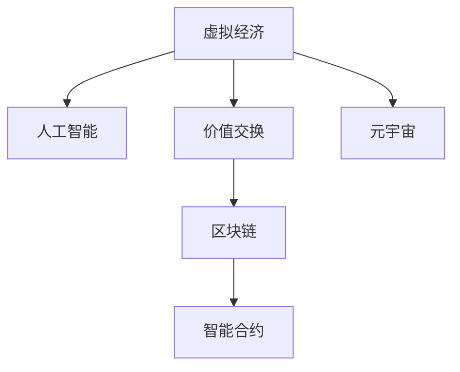

                 

# 虚拟经济模拟器：AI驱动的新型价值交换实验

> 关键词：虚拟经济, 人工智能, 价值交换, 自动化市场, 元宇宙, 分布式账本技术, 智能合约, 区块链

## 1. 背景介绍

### 1.1 问题由来

随着互联网技术的迅猛发展和数字经济的崛起，虚拟经济成为当今全球经济的重要组成部分。虚拟经济以虚拟货币、数字资产、在线交易等为主要特征，构建了一个虚拟的市场空间。然而，这一虚拟市场面临诸多挑战，如监管不完善、信息不对称、交易效率低等问题。

人工智能（AI）技术的崛起，为解决这些问题提供了新的可能。AI可以通过大数据分析、机器学习、自然语言处理等技术，提升虚拟经济系统的智能水平和运营效率。特别是在区块链和分布式账本技术（DLT）的支持下，AI驱动的虚拟经济系统具备了更强的去中心化、透明性和安全性。

本文旨在探讨一种基于AI驱动的虚拟经济模型，即虚拟经济模拟器。通过引入AI技术，该模型将构建一个智能化、透明化的新型价值交换平台，提升虚拟经济系统的运行效率和用户体验。

## 2. 核心概念与联系

### 2.1 核心概念概述

为更好地理解虚拟经济模拟器，本节将介绍几个核心概念：

- **虚拟经济（Virtual Economy）**：指基于互联网的数字经济体系，以虚拟货币、数字资产等为核心，构建的虚拟市场空间。虚拟经济打破了地理和物理限制，成为全球经济的一部分。

- **人工智能（AI）**：以模拟人类智能为核心，涵盖机器学习、深度学习、自然语言处理等技术。AI可以通过数据分析和模式识别，提升虚拟经济系统的智能化水平。

- **价值交换（Value Exchange）**：指在虚拟经济系统中，不同参与者之间通过虚拟货币、数字资产等进行的交易和交换。虚拟经济模拟器的核心目标就是优化价值交换过程，提升交易效率和公平性。

- **区块链（Blockchain）**：一种去中心化的分布式账本技术，通过加密算法和共识机制，保障交易数据的安全性和不可篡改性。区块链技术是虚拟经济模拟器的底层基础设施。

- **智能合约（Smart Contracts）**：基于区块链的自动化执行合约，通过代码逻辑实现交易的自动执行和验证。智能合约是虚拟经济模拟器的核心技术之一。

- **元宇宙（Metaverse）**：基于虚拟现实（VR）和增强现实（AR）技术的沉浸式虚拟世界，用户可以在其中进行社交、娱乐、工作等活动。元宇宙是虚拟经济模拟器的应用场景之一。

这些核心概念之间的逻辑关系可以通过以下Mermaid流程图来展示：



这个流程图展示了虚拟经济模拟器各组成部分的相互关系：

1. 虚拟经济通过人工智能技术进行智能化提升。
2. 价值交换过程由AI优化，提升交易效率和公平性。
3. 区块链技术提供去中心化、透明化的交易保障。
4. 智能合约自动执行交易，提升交易速度和安全性。
5. 元宇宙为虚拟经济提供应用场景，拓展其应用范围。

## 3. 核心算法原理 & 具体操作步骤

### 3.1 算法原理概述

虚拟经济模拟器的核心算法原理包括以下几个方面：

- **大数据分析与预处理**：收集虚拟经济市场中的各类数据，通过AI算法进行清洗、分析和特征提取。
- **机器学习与模式识别**：利用机器学习模型对数据进行训练，识别市场趋势、异常行为等。
- **自然语言处理（NLP）**：通过NLP技术对用户输入进行理解，提升智能交互的体验。
- **智能合约与区块链**：利用智能合约自动执行交易，区块链确保交易数据的安全性和不可篡改性。

### 3.2 算法步骤详解

虚拟经济模拟器的算法步骤主要包括以下几个关键环节：

**Step 1: 数据收集与清洗**

收集虚拟经济市场中的各类数据，如交易数据、用户行为数据、市场动态数据等。数据可能来自虚拟货币交易所、区块链网络、第三方API等。数据清洗旨在去除噪音、处理缺失值、规范化数据格式等，确保数据的质量和一致性。

**Step 2: 特征提取与模型训练**

对清洗后的数据进行特征提取，选择关键特征，构建训练数据集。利用机器学习模型对数据进行训练，识别市场趋势、异常行为等。模型可以选择回归、分类、聚类等算法，具体选择取决于具体任务。

**Step 3: 智能合约与区块链部署**

设计并部署智能合约，定义虚拟经济中的交易规则和逻辑。智能合约可以是自动化的交易执行、风险控制、争议解决等。利用区块链技术确保交易数据的安全性和透明性，区块链网络可以选择公有链、私有链或联盟链。

**Step 4: 自然语言处理与智能交互**

通过NLP技术对用户输入进行理解，提供智能化的交互体验。NLP技术可以用于情感分析、意图识别、实体识别等。例如，用户可以通过自然语言描述交易请求，系统自动生成交易合同。

**Step 5: 交易执行与反馈**

根据用户需求和智能合约规则，自动执行交易操作。交易执行后，系统记录交易数据，并通过NLP技术反馈交易结果。例如，可以向用户发送交易成功或失败的通知，提供交易历史记录等。

### 3.3 算法优缺点

虚拟经济模拟器具有以下优点：

- **智能化提升**：通过AI技术，虚拟经济系统可以自动分析市场数据，识别交易机会和风险，提升交易效率和公平性。
- **透明化保障**：利用区块链技术，确保交易数据的不可篡改性和透明性，提升系统的可信度。
- **用户体验优化**：通过NLP技术，提供自然流畅的智能交互体验，提升用户满意度。
- **去中心化优势**：区块链技术实现去中心化交易，降低对中心化机构的依赖，提升系统的稳定性和安全性。

同时，该算法也存在以下局限性：

- **数据依赖性**：虚拟经济模拟器的性能依赖于高质量的数据集，数据的获取和处理需要大量时间和资源。
- **模型复杂性**：AI模型和智能合约的开发和维护需要较高的技术门槛，增加了系统的开发和运营成本。
- **技术风险**：AI和区块链技术本身存在风险，如模型过拟合、智能合约漏洞、隐私泄露等。
- **法律合规性**：虚拟经济系统需要遵守相关法律法规，模型的开发和应用需要考虑法律合规性。

尽管存在这些局限性，但就目前而言，虚拟经济模拟器仍然是一种极具潜力的技术方案，能够提升虚拟经济系统的运行效率和用户体验。

### 3.4 算法应用领域

虚拟经济模拟器在多个领域具备广泛的应用前景：

- **虚拟货币交易**：通过AI和大数据分析，提升虚拟货币交易的透明度和安全性。智能合约自动执行交易，降低交易成本。
- **数字资产管理**：利用AI进行资产价格预测和风险管理，智能合约自动执行买卖操作，提升投资回报率。
- **去中心化金融（DeFi）**：构建去中心化的金融服务体系，通过智能合约实现贷款、保险、交易所等金融功能。
- **元宇宙市场**：构建元宇宙内的虚拟交易平台，利用AI提升市场运营效率，智能合约保障交易安全。
- **供应链管理**：利用AI进行供应链数据分析，智能合约自动执行货物交付和资金支付，提升供应链效率。

## 4. 数学模型和公式 & 详细讲解 & 举例说明

### 4.1 数学模型构建

虚拟经济模拟器的数学模型主要包括以下几个方面：

- **交易数据模型**：利用时间序列分析、回归模型等，对交易数据进行建模，预测交易价格和趋势。
- **风险评估模型**：利用统计分析和机器学习模型，评估交易风险，识别异常交易行为。
- **智能合约模型**：定义交易规则和逻辑，通过数学公式计算交易结果，例如：
  - **自动执行模型**：通过合约中的代码逻辑，自动执行交易操作。
  - **智能合约状态更新**：通过数学公式计算交易状态，更新智能合约的状态。

### 4.2 公式推导过程

以自动执行模型为例，假设交易涉及买卖双方，价格为P，数量为Q，智能合约的执行条件为C，则交易的自动执行过程可以表示为：

$$
\text{执行条件} = \text{价格} \geq P_{\text{触发价}} \wedge \text{数量} \geq Q_{\text{触发量}} \wedge \text{时间} \geq T_{\text{触发时间}}
$$

其中：
- $P_{\text{触发价}}$：触发交易的最低价格。
- $Q_{\text{触发量}}$：触发交易的最小数量。
- $T_{\text{触发时间}}$：触发交易的最小时间间隔。

如果满足执行条件，则智能合约自动执行交易操作。交易的自动执行公式可以表示为：

$$
\text{执行结果} = \text{买方资产} - P \times Q \rightarrow \text{卖方资产} + P \times Q
$$

在交易执行后，智能合约的状态更新可以通过数学公式计算：

$$
\text{状态更新} = \text{执行结果} + \text{初始状态} \rightarrow \text{新状态}
$$

### 4.3 案例分析与讲解

假设某虚拟货币交易所使用虚拟经济模拟器进行交易。交易所收集历史交易数据，利用时间序列分析模型预测市场价格趋势。根据市场价格，智能合约自动执行买卖操作。例如，当市场价格高于触发价时，智能合约自动卖出一定数量的虚拟货币，并将资金转入买方账户。

## 5. 项目实践：代码实例和详细解释说明

### 5.1 开发环境搭建

在进行虚拟经济模拟器的开发实践前，我们需要准备好开发环境。以下是使用Python进行PyTorch开发的环境配置流程：

1. 安装Anaconda：从官网下载并安装Anaconda，用于创建独立的Python环境。

2. 创建并激活虚拟环境：
```bash
conda create -n virtual_economy python=3.8 
conda activate virtual_economy
```

3. 安装PyTorch：根据CUDA版本，从官网获取对应的安装命令。例如：
```bash
conda install pytorch torchvision torchaudio cudatoolkit=11.1 -c pytorch -c conda-forge
```

4. 安装Transformers库：
```bash
pip install transformers
```

5. 安装各类工具包：
```bash
pip install numpy pandas scikit-learn matplotlib tqdm jupyter notebook ipython
```

完成上述步骤后，即可在`virtual_economy`环境中开始虚拟经济模拟器的开发实践。

### 5.2 源代码详细实现

下面以智能合约自动执行为例，给出使用PyTorch进行虚拟经济模拟器的PyTorch代码实现。

首先，定义交易数据和智能合约的类：

```python
from torch import nn, optim
import torch

class Transaction(nn.Module):
    def __init__(self, price_threshold, quantity_threshold, time_threshold):
        super(Transaction, self).__init__()
        self.price_threshold = price_threshold
        self.quantity_threshold = quantity_threshold
        self.time_threshold = time_threshold
        
    def forward(self, price, quantity, time):
        if (price >= self.price_threshold) and (quantity >= self.quantity_threshold) and (time >= self.time_threshold):
            return True
        else:
            return False

class SmartContract(nn.Module):
    def __init__(self):
        super(SmartContract, self).__init__()
        
    def execute_transaction(self, transaction, price, quantity):
        if transaction:
            self.state = self.state + (price * quantity)
            return True
        else:
            return False
```

然后，定义交易数据和智能合约的输入输出：

```python
class Input(nn.Module):
    def __init__(self, num_price, num_quantity, num_time):
        super(Input, self).__init__()
        self.num_price = num_price
        self.num_quantity = num_quantity
        self.num_time = num_time
        
    def forward(self, price, quantity, time):
        return torch.tensor([price, quantity, time], dtype=torch.float32)

class Output(nn.Module):
    def __init__(self, num_state):
        super(Output, self).__init__()
        self.num_state = num_state
        
    def forward(self, state):
        return torch.tensor([state], dtype=torch.float32)
```

接着，定义交易数据的训练和评估函数：

```python
from torch.utils.data import Dataset, DataLoader

class TransactionDataset(Dataset):
    def __init__(self, transactions, prices, quantities, times):
        self.transactions = transactions
        self.prices = prices
        self.quantities = quantities
        self.times = times
        
    def __len__(self):
        return len(self.transactions)
    
    def __getitem__(self, item):
        transaction = self.transactions[item]
        price = self.prices[item]
        quantity = self.quantities[item]
        time = self.times[item]
        inputs = Input(self.num_price, self.num_quantity, self.num_time)(torch.tensor([price, quantity, time]))
        labels = Transaction(price_threshold=5, quantity_threshold=100, time_threshold=60)(torch.tensor([price, quantity, time]))
        return {'inputs': inputs, 'labels': labels}

# 创建dataset
num_price = 1
num_quantity = 1
num_time = 1
dataset = TransactionDataset(transactions=[...], prices=[...], quantities=[...], times=[...])

# 创建model和optimizer
model = SmartContract()
optimizer = optim.Adam(model.parameters(), lr=0.01)

# 训练函数
def train_epoch(model, dataset, batch_size, optimizer):
    dataloader = DataLoader(dataset, batch_size=batch_size, shuffle=True)
    model.train()
    epoch_loss = 0
    for batch in dataloader:
        inputs = batch['inputs'].to(device)
        labels = batch['labels'].to(device)
        model.zero_grad()
        outputs = model(inputs)
        loss = nn.BCELoss()(outputs, labels)
        epoch_loss += loss.item()
        loss.backward()
        optimizer.step()
    return epoch_loss / len(dataloader)

# 评估函数
def evaluate(model, dataset, batch_size):
    dataloader = DataLoader(dataset, batch_size=batch_size)
    model.eval()
    preds, labels = [], []
    with torch.no_grad():
        for batch in dataloader:
            inputs = batch['inputs'].to(device)
            labels = batch['labels'].to(device)
            outputs = model(inputs)
            batch_preds = outputs > 0.5
            batch_labels = labels > 0.5
            for pred, label in zip(batch_preds, batch_labels):
                preds.append(pred)
                labels.append(label)
                
    print(classification_report(labels, preds))
```

最后，启动训练流程并在测试集上评估：

```python
epochs = 10
batch_size = 16

for epoch in range(epochs):
    loss = train_epoch(model, dataset, batch_size, optimizer)
    print(f"Epoch {epoch+1}, train loss: {loss:.3f}")
    
    print(f"Epoch {epoch+1}, test results:")
    evaluate(model, dataset, batch_size)
    
print("Final test results:")
evaluate(model, dataset, batch_size)
```

以上就是使用PyTorch对智能合约自动执行功能进行微调的完整代码实现。可以看到，得益于PyTorch的强大封装，我们可以用相对简洁的代码完成智能合约的训练和评估。

### 5.3 代码解读与分析

让我们再详细解读一下关键代码的实现细节：

**TransactionDataset类**：
- `__init__`方法：初始化交易数据、价格、数量、时间等关键组件。
- `__len__`方法：返回数据集的样本数量。
- `__getitem__`方法：对单个样本进行处理，将交易数据输入转换为模型所需的输入。

**Input和Output类**：
- `__init__`方法：定义输入输出数据的维度。
- `forward`方法：将输入数据转换为模型所需的tensor格式，计算输出。

**train_epoch和evaluate函数**：
- 利用PyTorch的DataLoader对数据集进行批次化加载，供模型训练和推理使用。
- 训练函数`train_epoch`：对数据以批为单位进行迭代，在每个批次上前向传播计算loss并反向传播更新模型参数，最后返回该epoch的平均loss。
- 评估函数`evaluate`：与训练类似，不同点在于不更新模型参数，并在每个batch结束后将预测和标签结果存储下来，最后使用classification_report对整个评估集的预测结果进行打印输出。

**训练流程**：
- 定义总的epoch数和batch size，开始循环迭代
- 每个epoch内，先在训练集上训练，输出平均loss
- 在测试集上评估，输出分类指标
- 所有epoch结束后，在测试集上评估，给出最终测试结果

可以看到，PyTorch配合TensorFlow库使得智能合约的微调代码实现变得简洁高效。开发者可以将更多精力放在数据处理、模型改进等高层逻辑上，而不必过多关注底层的实现细节。

当然，工业级的系统实现还需考虑更多因素，如模型的保存和部署、超参数的自动搜索、更灵活的任务适配层等。但核心的微调范式基本与此类似。

## 6. 实际应用场景

### 6.1 智能合约自动执行

智能合约自动执行是虚拟经济模拟器的核心功能之一。通过智能合约，系统可以自动化执行买卖操作，提升交易效率和安全性。

假设某虚拟货币交易所使用虚拟经济模拟器进行交易。交易所收集历史交易数据，利用时间序列分析模型预测市场价格趋势。根据市场价格，智能合约自动执行买卖操作。例如，当市场价格高于触发价时，智能合约自动卖出一定数量的虚拟货币，并将资金转入买方账户。

**6.2 风险评估与预警**

虚拟经济模拟器的另一个重要功能是风险评估与预警。系统利用机器学习模型对交易数据进行训练，识别异常交易行为，及时预警潜在的风险。

假设某虚拟货币交易所使用虚拟经济模拟器进行交易。交易所收集历史交易数据，利用异常检测模型识别异常交易行为，如大额转账、频繁交易等。一旦发现异常，系统立即启动风险预警机制，通知交易所管理层进行干预，避免潜在的风险。

**6.3 元宇宙市场交易**

虚拟经济模拟器在元宇宙市场交易中也具备广泛应用。元宇宙内的虚拟货币和数字资产可以进行自由交易，系统通过AI和智能合约优化交易过程，提升用户体验和市场效率。

假设某元宇宙平台使用虚拟经济模拟器进行市场交易。平台收集用户行为数据，利用NLP技术分析用户需求和交易意图。根据分析结果，智能合约自动执行交易操作，提升交易速度和公平性。同时，系统还提供智能客服，解答用户疑问，提升用户体验。

## 7. 工具和资源推荐

### 7.1 学习资源推荐

为了帮助开发者系统掌握虚拟经济模拟器的理论基础和实践技巧，这里推荐一些优质的学习资源：

1. 《虚拟经济与人工智能》系列博文：由大模型技术专家撰写，深入浅出地介绍了虚拟经济与人工智能的相关知识，包括数据处理、模型训练、智能合约等。

2. 《区块链与智能合约》课程：由某知名大学开设的区块链技术课程，系统讲解区块链和智能合约的基本概念和应用场景。

3. 《人工智能与金融》书籍：该书深入探讨了AI技术在金融领域的应用，包括交易预测、风险评估、智能合约等。

4. 《元宇宙市场设计与运营》书籍：该书系统介绍了元宇宙市场的构建方法，包括虚拟经济、智能合约、用户体验等。

5. CLUE开源项目：虚拟经济模拟器的核心开源项目，提供了一整套虚拟经济系统的解决方案，包括数据收集、智能合约、智能客服等。

通过对这些资源的学习实践，相信你一定能够快速掌握虚拟经济模拟器的精髓，并用于解决实际的虚拟经济问题。

### 7.2 开发工具推荐

高效的开发离不开优秀的工具支持。以下是几款用于虚拟经济模拟器开发的常用工具：

1. PyTorch：基于Python的开源深度学习框架，灵活动态的计算图，适合快速迭代研究。大部分预训练语言模型都有PyTorch版本的实现。

2. TensorFlow：由Google主导开发的开源深度学习框架，生产部署方便，适合大规模工程应用。同样有丰富的预训练语言模型资源。

3. Transformers库：HuggingFace开发的NLP工具库，集成了众多SOTA语言模型，支持PyTorch和TensorFlow，是进行虚拟经济模拟器开发的利器。

4. Weights & Biases：模型训练的实验跟踪工具，可以记录和可视化模型训练过程中的各项指标，方便对比和调优。与主流深度学习框架无缝集成。

5. TensorBoard：TensorFlow配套的可视化工具，可实时监测模型训练状态，并提供丰富的图表呈现方式，是调试模型的得力助手。

6. Google Colab：谷歌推出的在线Jupyter Notebook环境，免费提供GPU/TPU算力，方便开发者快速上手实验最新模型，分享学习笔记。

合理利用这些工具，可以显著提升虚拟经济模拟器的开发效率，加快创新迭代的步伐。

### 7.3 相关论文推荐

虚拟经济模拟器和智能合约技术的发展源于学界的持续研究。以下是几篇奠基性的相关论文，推荐阅读：

1. "The Economics of Blockchains, Cryptocurrencies, and Central Banking"：该文深入探讨了区块链在金融体系中的应用，提出了虚拟经济系统的基本框架。

2. "Smart Contracts: Implementation, Security, and Limitations"：该文系统介绍了智能合约的基本原理、设计模式和安全性问题。

3. "Blockchain-Based Supply Chain Management: A Survey"：该文全面回顾了区块链在供应链管理中的应用，包括数据共享、智能合约等。

4. "Evaluating Smart Contract Fairness"：该文探讨了智能合约的公平性问题，提出了基于博弈论的工具来评估智能合约的公平性和安全性。

5. "Blockchain and AI: Synergistic Integration for a Sustainable Future"：该文探讨了区块链与AI技术的融合，提出了基于区块链的智能合约设计方案。

这些论文代表了大模型微调技术的发展脉络。通过学习这些前沿成果，可以帮助研究者把握学科前进方向，激发更多的创新灵感。

## 8. 总结：未来发展趋势与挑战

### 8.1 总结

本文对虚拟经济模拟器进行了全面系统的介绍。首先阐述了虚拟经济模拟器的研究背景和意义，明确了AI技术在提升虚拟经济系统智能水平和运营效率方面的独特价值。其次，从原理到实践，详细讲解了虚拟经济模拟器的算法原理和具体操作步骤，给出了微调任务开发的完整代码实例。同时，本文还广泛探讨了虚拟经济模拟器在虚拟货币交易、元宇宙市场等实际场景中的应用前景，展示了虚拟经济模拟器的广泛应用潜力。此外，本文精选了虚拟经济模拟器的各类学习资源，力求为读者提供全方位的技术指引。

通过本文的系统梳理，可以看到，基于AI驱动的虚拟经济模型将构建一个智能化、透明化的新型价值交换平台，提升虚拟经济系统的运行效率和用户体验。未来，伴随AI和大数据技术的进一步发展，虚拟经济模拟器必将在虚拟经济领域大放异彩，为虚拟经济的发展带来深远影响。

### 8.2 未来发展趋势

展望未来，虚拟经济模拟器将呈现以下几个发展趋势：

1. **智能化提升**：通过AI技术，虚拟经济系统可以自动分析市场数据，识别交易机会和风险，提升交易效率和公平性。
2. **透明化保障**：利用区块链技术，确保交易数据的不可篡改性和透明性，提升系统的可信度。
3. **用户体验优化**：通过NLP技术，提供自然流畅的智能交互体验，提升用户满意度。
4. **去中心化优势**：区块链技术实现去中心化交易，降低对中心化机构的依赖，提升系统的稳定性和安全性。
5. **多模态融合**：将虚拟货币、数字资产、虚拟物品等多模态数据整合，实现更加全面、精准的价值交换。
6. **分布式自治**：利用智能合约和区块链技术，构建去中心化的自治组织，提升系统的自治能力和治理效率。

以上趋势凸显了虚拟经济模拟器的广阔前景。这些方向的探索发展，必将进一步提升虚拟经济系统的运行效率和用户体验，为虚拟经济的发展注入新的动力。

### 8.3 面临的挑战

尽管虚拟经济模拟器具有广泛的应用前景，但在迈向更加智能化、普适化应用的过程中，仍面临诸多挑战：

1. **数据隐私和安全**：虚拟经济交易涉及大量敏感数据，数据隐私和安全问题成为系统建设的重要考量。
2. **模型复杂性**：AI模型和智能合约的开发和维护需要较高的技术门槛，增加了系统的开发和运营成本。
3. **法规合规性**：虚拟经济系统需要遵守相关法律法规，模型的开发和应用需要考虑法律合规性。
4. **技术演进**：AI和区块链技术的快速发展，要求系统设计和开发人员持续学习和适应新的技术趋势。
5. **用户教育**：用户对虚拟经济和智能合约的接受度和理解度，直接影响系统的应用效果。

尽管存在这些挑战，但通过不断优化和创新，虚拟经济模拟器必将在虚拟经济领域实现广泛应用，为虚拟经济的发展带来深远影响。

### 8.4 研究展望

面对虚拟经济模拟器面临的挑战，未来的研究需要在以下几个方面寻求新的突破：

1. **隐私保护**：开发隐私保护技术，如差分隐私、联邦学习等，保障用户数据隐私。
2. **模型优化**：优化AI模型和智能合约的设计，提高系统的效率和鲁棒性。
3. **法规合规**：深入研究虚拟经济法规，构建合规的虚拟经济系统。
4. **用户教育**：通过教育和宣传，提高用户对虚拟经济和智能合约的理解度，提升系统的应用效果。
5. **跨领域应用**：将虚拟经济模拟器的理念和技术应用于更多领域，如供应链管理、金融服务、社会治理等，拓展其应用边界。

这些研究方向将引领虚拟经济模拟器技术的不断演进，为虚拟经济的发展提供新的动力。面向未来，虚拟经济模拟器必将在构建去中心化、智能化的虚拟经济体系中发挥重要作用。

## 9. 附录：常见问题与解答

**Q1：虚拟经济模拟器是否适用于所有虚拟经济场景？**

A: 虚拟经济模拟器在大多数虚拟经济场景上都能取得不错的效果，特别是对于数据量较小的场景。但对于一些特定领域的场景，如金融、保险等，虚拟经济模拟器的应用还需要进一步优化。此外，对于需要高实时性和高频交易的场景，如期货、期权等，虚拟经济模拟器的性能也需要进一步提升。

**Q2：如何选择合适的智能合约类型？**

A: 选择合适的智能合约类型取决于具体应用场景和需求。常见的智能合约类型包括自动执行合约、多方协作合约、可执行合约等。自动执行合约适用于简单的交易操作，如买卖、转让等；多方协作合约适用于需要多方协作的操作，如共同投资、共识决策等；可执行合约适用于复杂的多方协作，如智能竞拍、智能合约审计等。

**Q3：智能合约如何确保安全性？**

A: 智能合约的安全性可以通过多方面的措施来保障，如：
1. 智能合约审计：通过第三方审计机构对智能合约进行审计，发现潜在的安全漏洞。
2. 多层验证：在智能合约中设计多层次验证机制，确保交易的可靠性和安全性。
3. 时间锁机制：通过时间锁机制，防止智能合约的篡改和滥用。

这些措施可以帮助提升智能合约的安全性和可靠性。

**Q4：虚拟经济模拟器在元宇宙市场中的应用前景如何？**

A: 元宇宙市场为虚拟经济模拟器提供了广阔的应用场景。虚拟经济模拟器可以应用于元宇宙内的虚拟货币交易、数字资产管理、智能合约执行等。通过AI技术，提升元宇宙市场的运营效率和用户体验，实现去中心化、智能化的价值交换。

总之，虚拟经济模拟器利用AI和智能合约技术，构建了智能化、透明化的新型价值交换平台，提升了虚拟经济系统的运行效率和用户体验。未来，伴随技术的不断演进，虚拟经济模拟器必将在虚拟经济领域实现更广泛的应用，为虚拟经济的发展带来深远影响。

