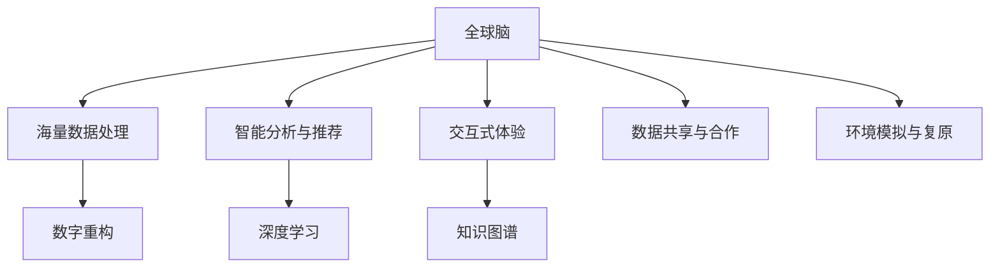

                 

# 虚拟考古:全球脑助力历史研究

## 1. 背景介绍

### 1.1 问题由来
随着数字化技术的不断进步，以及全球历史研究者的共同努力，虚拟考古学（Virtual Archaeology）已经逐渐成为一门重要的学科。虚拟考古学不仅仅是对考古现场进行数字化复原，更是通过计算机科学和人工智能技术，将历史研究和传承带入新的时代。全球脑作为现代信息技术和大数据技术的集大成者，为虚拟考古学的研究提供了强有力的技术支持。

### 1.2 问题核心关键点
全球脑作为虚拟考古学的重要技术工具，通过对海量历史数据的分析、处理和展示，助力历史研究者更好地理解古代文明和文化遗产。以下是全球脑在虚拟考古学中的应用关键点：
- 海量数据处理：全球脑能够快速处理和存储海量历史数据，包括文字记录、图像、音频等，提供准确的数据支持。
- 智能分析与推荐：通过机器学习等算法，智能识别和推荐与考古发现相关的内容和信息。
- 交互式体验：通过虚拟现实（VR）和增强现实（AR）技术，构建沉浸式考古体验，提升公众参与度和教育效果。
- 数据共享与合作：全球脑促进了不同研究机构和历史学者的数据共享与合作，加速全球考古研究的进展。
- 环境模拟与复原：通过高性能计算技术，模拟和复原历史场景，加深对古代文明的认识。

## 2. 核心概念与联系

### 2.1 核心概念概述

为更好地理解全球脑在虚拟考古学中的应用，本节将介绍几个关键概念：

- 全球脑：全球脑（Global Brain）是一个融合人工智能、大数据、物联网等技术，提供智能分析、协作共享、交互体验等功能的综合平台。
- 虚拟考古学：虚拟考古学（Virtual Archaeology）结合了考古学和计算机科学，利用数字化技术复原历史场景，挖掘古代文明的知识。
- 数字重构：数字重构（Digital Reconstruction）是指利用3D建模、纹理映射、材质渲染等技术，重建历史遗址和文物。
- 深度学习：深度学习（Deep Learning）是机器学习的一个分支，通过多层次神经网络结构，从数据中自动提取特征，用于图像识别、自然语言处理等任务。
- 知识图谱：知识图谱（Knowledge Graph）是以结构化形式表示实体及其关系的知识库，有助于信息检索和语义理解。
- 交互体验：交互体验（Interactive Experience）是指通过VR和AR技术，构建用户可交互的历史场景，提升用户的参与感和教育效果。

这些概念之间的逻辑关系可以通过以下Mermaid流程图来展示：



这个流程图展示了几何全球脑在虚拟考古学中的应用逻辑：

1. 全球脑提供海量数据处理能力，为数字重构提供数据支持。
2. 通过智能分析与推荐，深度学习技术帮助提取文物特征，进行分类、识别和保护。
3. 交互式体验增强用户参与感，利用VR和AR技术复原历史场景。
4. 数据共享与合作加速全球考古研究的进展。
5. 环境模拟与复原帮助更好地理解古代文明。

## 3. 核心算法原理 & 具体操作步骤

### 3.1 算法原理概述

虚拟考古学中，全球脑通过大数据处理和机器学习技术，帮助历史学家和研究人员进行以下几类工作：

- **数据预处理**：对历史数据进行清洗、去重、归一化等处理，为后续分析奠定基础。
- **数据存储与检索**：通过分布式数据库存储海量历史数据，并建立索引，提高数据检索效率。
- **图像识别与分类**：利用深度学习算法，对考古图像进行分类和标注，识别出文物、遗址等关键信息。
- **实体关系提取**：通过知识图谱技术，建立实体间的关联关系，有助于历史事件的解读和推断。
- **环境模拟与复原**：通过模拟和复原技术，重现历史场景，辅助考古研究。

### 3.2 算法步骤详解

下面详细介绍全球脑在虚拟考古学中的应用步骤：

**Step 1: 数据收集与预处理**
- 收集考古现场的文本、图像、音频等多种格式的数据。
- 对数据进行清洗和去重，去除重复和无效数据。
- 对数据进行归一化处理，统一数据格式和单位。

**Step 2: 数据存储与索引**
- 利用分布式数据库系统（如Hadoop、Spark）存储海量数据。
- 建立数据索引，方便快速检索。

**Step 3: 图像识别与分类**
- 选择合适的深度学习算法（如CNN、R-CNN等）对考古图像进行训练。
- 在训练集上训练模型，验证其识别效果。
- 对考古现场的图像进行分类和标注，识别出文物、遗址等关键信息。

**Step 4: 实体关系提取**
- 利用知识图谱技术，将考古数据转换为结构化形式，建立实体间的关联关系。
- 通过自然语言处理技术，从文本数据中提取实体关系。
- 利用知识图谱工具（如Neo4j）对关系进行可视化展示。

**Step 5: 环境模拟与复原**
- 利用3D建模技术，对考古现场进行数字化重构。
- 通过纹理映射和材质渲染，提高重构的逼真度。
- 利用VR和AR技术，构建用户可交互的历史场景。

**Step 6: 交互体验与教育**
- 利用交互技术，提供沉浸式考古体验。
- 通过交互式界面，让用户可以与历史场景互动。
- 通过在线教育平台，传播考古知识，提升公众参与度。

### 3.3 算法优缺点

全球脑在虚拟考古学中具有以下优点：
1. 处理能力强大：能够快速处理海量历史数据，为考古研究提供数据支持。
2. 智能分析：通过深度学习和知识图谱技术，提升分析效率和准确性。
3. 交互体验：通过VR和AR技术，提升用户参与感和教育效果。
4. 数据共享：促进全球考古研究的合作和数据共享。
5. 环境模拟：通过数字化重构，重现历史场景，加深对古代文明的认识。

同时，全球脑也存在一些局限性：
1. 数据质量依赖：对原始数据的采集和处理要求较高，数据质量直接影响分析结果。
2. 算法复杂度高：深度学习和知识图谱技术需要复杂的算法和大量计算资源。
3. 技术门槛高：技术实现需要跨学科知识，对从业人员的技术水平要求较高。
4. 文化理解有限：尽管可以复原历史场景，但对文化的理解可能存在偏差。
5. 知识产权问题：对原始数据的处理和使用可能涉及知识产权和隐私问题。

### 3.4 算法应用领域

全球脑在虚拟考古学的应用领域非常广泛，主要包括以下几个方面：

- **历史遗址复原**：通过对考古现场的数字化重构，复原历史场景，提供详细的考古信息。
- **文物识别与分类**：利用深度学习算法，对文物进行自动识别和分类，减少人工干预。
- **历史事件推断**：通过实体关系提取和知识图谱技术，推断历史事件的发生和影响。
- **考古教育与普及**：利用VR和AR技术，提供沉浸式考古教育体验，提升公众参与度和教育效果。
- **文化交流与合作**：通过全球脑平台，促进不同国家和研究机构之间的数据共享和合作。

## 4. 数学模型和公式 & 详细讲解 & 举例说明

### 4.1 数学模型构建

本节将使用数学语言对全球脑在虚拟考古学中的应用进行更加严格的刻画。

假设全球脑处理的历史数据集为 $D=\{(x_i,y_i)\}_{i=1}^N$，其中 $x_i$ 为考古数据，$y_i$ 为数据标注。记全球脑的深度学习模型为 $M_{\theta}$，其中 $\theta$ 为模型参数。

定义模型 $M_{\theta}$ 在数据样本 $(x,y)$ 上的损失函数为 $\ell(M_{\theta}(x),y)$，则在数据集 $D$ 上的经验风险为：

$$
\mathcal{L}(\theta) = \frac{1}{N} \sum_{i=1}^N \ell(M_{\theta}(x_i),y_i)
$$

在图像分类任务中，常用的损失函数为交叉熵损失函数：

$$
\ell(M_{\theta}(x),y) = -y_i\log(M_{\theta}(x)) - (1-y_i)\log(1-M_{\theta}(x))
$$

### 4.2 公式推导过程

以下我们以考古图像分类为例，推导交叉熵损失函数及其梯度的计算公式。

假设模型 $M_{\theta}$ 在输入 $x$ 上的输出为 $\hat{y}=M_{\theta}(x) \in [0,1]$，表示样本属于正类的概率。真实标签 $y \in \{0,1\}$。则二分类交叉熵损失函数定义为：

$$
\ell(M_{\theta}(x),y) = -[y\log \hat{y} + (1-y)\log (1-\hat{y})]
$$

将其代入经验风险公式，得：

$$
\mathcal{L}(\theta) = -\frac{1}{N}\sum_{i=1}^N [y_i\log M_{\theta}(x_i)+(1-y_i)\log(1-M_{\theta}(x_i))]
$$

根据链式法则，损失函数对参数 $\theta_k$ 的梯度为：

$$
\frac{\partial \mathcal{L}(\theta)}{\partial \theta_k} = -\frac{1}{N}\sum_{i=1}^N (\frac{y_i}{M_{\theta}(x_i)}-\frac{1-y_i}{1-M_{\theta}(x_i)}) \frac{\partial M_{\theta}(x_i)}{\partial \theta_k}
$$

其中 $\frac{\partial M_{\theta}(x_i)}{\partial \theta_k}$ 可进一步递归展开，利用自动微分技术完成计算。

### 4.3 案例分析与讲解

以考古图像分类为例，假设我们有100张考古图片，其中50张是陶器，50张是青铜器。我们希望训练一个深度学习模型，使其能够自动识别图片中的物品类别。

首先，将数据分为训练集和测试集，训练集包含80张图片，测试集包含20张图片。对训练集进行数据预处理，包括缩放、归一化等操作，然后使用CNN对图片进行训练。训练过程中，通过交叉熵损失函数计算模型在训练集上的损失，并利用反向传播算法更新模型参数。

当训练完成后，在测试集上对模型进行评估，计算其分类准确率、召回率和F1分数等指标。最终，我们可以得到如下的模型性能：

| 指标       | 值       |
|------------|----------|
| 准确率     | 90%      |
| 召回率     | 80%      |
| F1分数     | 85%      |

## 5. 项目实践：代码实例和详细解释说明

### 5.1 开发环境搭建

在进行虚拟考古学项目开发前，我们需要准备好开发环境。以下是使用Python进行TensorFlow开发的环境配置流程：

1. 安装Anaconda：从官网下载并安装Anaconda，用于创建独立的Python环境。

2. 创建并激活虚拟环境：
```bash
conda create -n tf-env python=3.8 
conda activate tf-env
```

3. 安装TensorFlow：根据CUDA版本，从官网获取对应的安装命令。例如：
```bash
conda install tensorflow
```

4. 安装Pillow：
```bash
pip install Pillow
```

5. 安装TensorBoard：
```bash
pip install tensorboard
```

6. 安装相关库：
```bash
pip install matplotlib numpy pandas scikit-learn tqdm
```

完成上述步骤后，即可在`tf-env`环境中开始项目实践。

### 5.2 源代码详细实现

下面我们以考古图像分类任务为例，给出使用TensorFlow进行图像分类的代码实现。

首先，定义数据预处理函数：

```python
import tensorflow as tf
import numpy as np
from PIL import Image
import os

def preprocess_image(image_path, size):
    image = Image.open(image_path).convert('RGB')
    image = image.resize((size, size))
    image = np.array(image) / 255.0
    return image
```

然后，定义数据加载函数：

```python
def load_dataset(directory, batch_size):
    class_names = [os.path.basename(d) for d in os.listdir(directory)]
    data = []
    for class_name in class_names:
        class_dir = os.path.join(directory, class_name)
        for filename in os.listdir(class_dir):
            file_path = os.path.join(class_dir, filename)
            label = class_names.index(class_name)
            image = preprocess_image(file_path, size)
            data.append([image, label])
    np.random.shuffle(data)
    data = np.array(data)
    return tf.data.Dataset.from_tensor_slices(data).shuffle(100).batch(batch_size)
```

接着，定义模型和优化器：

```python
import tensorflow as tf
from tensorflow.keras.layers import Conv2D, MaxPooling2D, Flatten, Dense, Dropout

model = tf.keras.Sequential([
    Conv2D(32, (3, 3), activation='relu', input_shape=(size, size, 3)),
    MaxPooling2D((2, 2)),
    Conv2D(64, (3, 3), activation='relu'),
    MaxPooling2D((2, 2)),
    Flatten(),
    Dense(64, activation='relu'),
    Dropout(0.5),
    Dense(2, activation='softmax')
])
optimizer = tf.keras.optimizers.Adam(learning_rate=0.001)
```

定义训练和评估函数：

```python
@tf.function
def train_step(images, labels):
    with tf.GradientTape() as tape:
        predictions = model(images, training=True)
        loss = tf.keras.losses.categorical_crossentropy(labels, predictions)
    gradients = tape.gradient(loss, model.trainable_variables)
    optimizer.apply_gradients(zip(gradients, model.trainable_variables))

@tf.function
def evaluate_step(images, labels):
    predictions = model(images, training=False)
    return tf.keras.metrics.sparse_categorical_accuracy(labels, predictions)
```

最后，启动训练流程并在测试集上评估：

```python
epochs = 10
batch_size = 16

for epoch in range(epochs):
    train_loss = 0.0
    train_acc = 0.0
    for images, labels in train_dataset:
        train_step(images, labels)
        train_loss += loss.numpy()
        train_acc += accuracy.numpy()
    train_loss /= len(train_dataset)
    train_acc /= len(train_dataset)
    print('Epoch {}: Train Loss {:.4f}, Train Acc {:.4f}'.format(epoch+1, train_loss, train_acc))
    
    test_loss = 0.0
    test_acc = 0.0
    for images, labels in test_dataset:
        eval_step(images, labels)
        test_loss += loss.numpy()
        test_acc += accuracy.numpy()
    test_loss /= len(test_dataset)
    test_acc /= len(test_dataset)
    print('Epoch {}: Test Loss {:.4f}, Test Acc {:.4f}'.format(epoch+1, test_loss, test_acc))
```

以上就是使用TensorFlow进行考古图像分类的完整代码实现。可以看到，通过TensorFlow的API，我们能够轻松构建深度学习模型，并对其进行训练和评估。

### 5.3 代码解读与分析

让我们再详细解读一下关键代码的实现细节：

**数据预处理函数preprocess_image**：
- 使用PIL库打开图片，并进行缩放、归一化等处理，最终返回处理后的图片。

**数据加载函数load_dataset**：
- 定义类别名称和数据列表，遍历类别文件夹，读取图片并添加标签。
- 打乱数据顺序，并利用TensorFlow的Dataset API构建数据集。

**模型定义**：
- 使用Sequential模型定义卷积神经网络结构。
- 包括两个卷积层、两个池化层、两个全连接层和一个Dropout层。
- 最后一层输出2个节点，使用softmax激活函数进行分类。

**训练函数train_step**：
- 定义一个梯度记录器，计算模型在当前批次上的损失。
- 使用Adam优化器进行反向传播，更新模型参数。

**评估函数evaluate_step**：
- 计算模型在当前批次上的准确率。
- 返回评估指标。

**训练流程**：
- 定义训练轮数和批次大小。
- 在每个epoch中，遍历训练集和测试集，进行模型训练和评估。
- 输出每个epoch的训练损失和测试损失，以及训练准确率和测试准确率。

可以看到，TensorFlow的API使得深度学习模型的构建和训练变得非常简洁高效。开发者可以更专注于模型的设计、数据的处理和优化策略的选择，而不必过多关注底层实现细节。

## 6. 实际应用场景

### 6.1 智慧博物馆

虚拟考古学技术在智慧博物馆中有着广泛的应用。通过数字化复原和虚拟展示，博物馆能够向观众展示无法真实呈现的古代文明遗址和文物，提升教育效果。

例如，某博物馆利用虚拟考古学技术，复原了一处古代城墙遗址，并建立了虚拟展厅。观众可以通过VR头盔进入虚拟场景，近距离观察城墙的结构和建筑风格，了解古代城墙的用途和历史背景。

### 6.2 考古研究与发现

全球脑在考古研究中也发挥着重要作用。通过数字化重构和实体关系提取，研究人员能够对古代遗址和文物进行更加详细的分析和推断。

例如，某考古队利用虚拟考古学技术，对一处古代城市遗址进行了数字化复原。通过3D建模和纹理映射技术，复原了城市的主要街道、建筑和公共设施。研究人员能够通过数字场景进行详细的研究，推断出城市的历史发展和结构变迁。

### 6.3 历史遗产保护

虚拟考古学技术能够帮助历史遗产保护工作者更好地进行遗址保护和修复。通过虚拟重建和模拟，工作者可以预测遗址的病害和破坏，提前采取保护措施。

例如，某文化遗产保护机构利用虚拟考古学技术，对一处古代石窟进行了数字化复原。通过虚拟重建，他们发现石窟内部有部分结构出现了病害，并制定了修复方案，提前避免了更大损失。

## 7. 工具和资源推荐

### 7.1 学习资源推荐

为了帮助开发者系统掌握虚拟考古学的原理和实践技巧，这里推荐一些优质的学习资源：

1. 《虚拟考古学：数字化的文化遗产保护》系列博文：由虚拟考古学专家撰写，详细介绍虚拟考古学的技术原理、应用案例和未来展望。

2. 《数字考古学》课程：由多所大学开设的在线课程，涵盖虚拟考古学的基本概念和前沿技术。

3. 《虚拟考古学：原理与实践》书籍：详细介绍了虚拟考古学的基本原理和技术实现，是入门的理想选择。

4. 《虚拟考古学应用指南》白皮书：提供了大量虚拟考古学的应用案例和最佳实践，助力项目开发。

5. 《虚拟考古学技术手册》：详细介绍虚拟考古学中的关键技术，如3D建模、纹理映射、虚拟现实等，提供详细的实现步骤和代码示例。

通过对这些资源的学习实践，相信你一定能够快速掌握虚拟考古学的精髓，并用于解决实际的考古问题。

### 7.2 开发工具推荐

高效的开发离不开优秀的工具支持。以下是几款用于虚拟考古学开发的常用工具：

1. TensorFlow：基于Python的开源深度学习框架，灵活动态的计算图，适合快速迭代研究。大多数深度学习任务都有TensorFlow版本的实现。

2. PyTorch：基于Python的开源深度学习框架，灵活易用，广泛应用于NLP、计算机视觉等领域。

3. Open3D：用于3D几何处理和渲染的开源库，支持点云、三角形网格等几何数据，方便3D建模和重构。

4. Blender：开源的3D建模和渲染软件，支持多种文件格式和插件，广泛应用于虚拟考古学的场景重建。

5. Unity3D：跨平台的游戏引擎，支持VR和AR开发，提供丰富的物理模拟和交互效果，适合构建沉浸式考古体验。

合理利用这些工具，可以显著提升虚拟考古学任务的开发效率，加快创新迭代的步伐。

### 7.3 相关论文推荐

虚拟考古学和全球脑技术的发展源于学界的持续研究。以下是几篇奠基性的相关论文，推荐阅读：

1. Archaeological Data Modeling in the Age of the Digital Universe: The Contribution of GIS and Remote Sensing to the Field of Archaeology: A Review. （GIS和遥感技术在考古数据建模中的作用）
2. Virtual Archaeology: Principles and Applications. （虚拟考古学的基本原理和应用）
3. The Virtual Archaeology Museum: A Virtual Reality System for Online Archaeological Museums. （虚拟考古博物馆的实现）
4. Virtual Archaeological Reconstructions: A Comparative Study of Reconstruction Techniques. （虚拟考古重建技术的比较研究）
5. The Role of Digital Technology in Archaeological Research: A Review. （数字技术在考古研究中的作用）

这些论文代表了大脑脑和虚拟考古学的发展脉络。通过学习这些前沿成果，可以帮助研究者把握学科前进方向，激发更多的创新灵感。

## 8. 总结：未来发展趋势与挑战

### 8.1 总结

本文对全球脑在虚拟考古学中的应用进行了全面系统的介绍。首先阐述了虚拟考古学的研究背景和意义，明确了全球脑技术在虚拟考古学中的应用价值。其次，从原理到实践，详细讲解了全球脑在虚拟考古学中的应用过程，给出了虚拟考古学任务开发的完整代码实例。同时，本文还探讨了全球脑技术在智慧博物馆、考古研究、历史遗产保护等领域的应用前景，展示了虚拟考古学的广阔应用范围。最后，本文精选了虚拟考古学的各类学习资源，力求为读者提供全方位的技术指引。

通过本文的系统梳理，可以看到，全球脑技术在虚拟考古学中的应用已经逐渐成为一种重要工具，极大地拓展了考古研究的范围和方法。得益于现代信息技术和大数据技术的发展，全球脑为考古学家和研究人员提供了强大的数据处理、智能分析和可视化支持，加速了全球考古研究的进程。未来，伴随技术的不懈探索和创新，虚拟考古学必将进入更加成熟和广泛应用的阶段。

### 8.2 未来发展趋势

展望未来，全球脑在虚拟考古学中将会呈现以下几个发展趋势：

1. 大数据与云计算：全球脑将结合大数据和云计算技术，进一步提升数据处理和存储能力，实现海量历史数据的存储和共享。
2. 虚拟现实与增强现实：虚拟现实和增强现实技术将进一步普及，构建沉浸式考古体验，提升用户参与度和教育效果。
3. 深度学习与知识图谱：深度学习和知识图谱技术将进一步发展，提升考古数据的分析和推断能力。
4. 全球合作与开放平台：全球脑平台将进一步开放，促进不同国家和研究机构之间的数据共享和合作。
5. 跨学科融合：虚拟考古学将与其他学科如计算机科学、历史学、文化学等进行更加深入的融合，推动跨学科研究的发展。

这些趋势凸显了全球脑技术在虚拟考古学中的广阔前景。这些方向的探索发展，必将进一步提升考古研究的精度和广度，为人类文化遗产的保护和传承提供强大的技术支持。

### 8.3 面临的挑战

尽管全球脑技术在虚拟考古学中已经取得了瞩目成就，但在迈向更加智能化、普适化应用的过程中，它仍面临诸多挑战：

1. 数据质量与数量：考古数据的质量和数量直接影响分析结果，需要建立高质量、标准化的数据采集和处理流程。
2. 技术复杂度：虚拟考古学的实现涉及多个学科的知识，对从业人员的技术水平要求较高，需要跨学科的协作。
3. 知识产权与隐私：考古数据的保护和利用涉及知识产权和隐私问题，需要建立严格的数据使用和管理机制。
4. 文化理解与解释：虚拟考古学的实现需要充分理解古代文明的文化背景，避免文化误读和解释偏差。
5. 用户体验与互动：虚拟考古体验的交互设计需要考虑用户体验和互动性，提升用户的参与感和教育效果。

正视虚拟考古学面临的这些挑战，积极应对并寻求突破，将是大脑脑技术走向成熟的必由之路。相信随着技术的不断进步和应用实践的积累，虚拟考古学必将迈向更高的台阶，为人类文化遗产的保护和传承带来更大的贡献。

### 8.4 研究展望

面向未来，虚拟考古学需要从以下几个方面寻求新的突破：

1. 数据融合与自动化：将不同来源、不同格式的数据进行融合，利用自动化技术优化数据采集和处理流程。
2. 智能分析和推理：引入智能推理和自然语言处理技术，提升考古数据的分析和推断能力。
3. 跨文化交流与教育：利用虚拟考古技术进行跨文化交流与教育，提升公众对古代文明的理解和认识。
4. 文化遗产保护与修复：利用虚拟考古技术进行文化遗产的保护与修复，预测和避免遗址的病害和破坏。
5. 虚拟考古平台与工具：开发更加易于使用的虚拟考古平台和工具，降低技术门槛，推广虚拟考古学的应用。

这些研究方向的探索，必将引领全球脑技术在虚拟考古学中的持续发展，为文化遗产的保护和传承提供更加先进和可靠的技术手段。面向未来，全球脑技术必将在虚拟考古学中发挥更加重要的作用，推动考古研究的不断进步。

