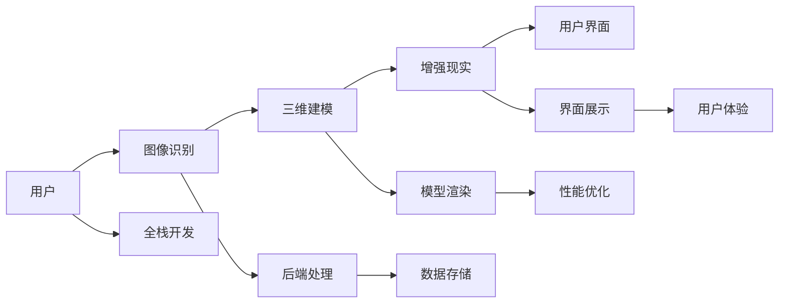

                 

# 虚拟试衣创业：在线购物体验的革新

> 关键词：虚拟试衣, 在线购物体验, AR技术, 全栈开发, 人工智能, 用户界面, 多模态交互

## 1. 背景介绍

随着互联网和移动互联网的迅猛发展，电子商务已成为全球消费市场的重要组成部分。然而，传统的在线购物方式面临诸多挑战，如信息不对称、购物体验单调、配送成本高等，极大地限制了用户的购物体验。虚拟试衣作为新一代的购物方式，通过结合增强现实（AR）技术和全栈开发，能够大幅提升在线购物的体验和效率。本文将介绍虚拟试衣的核心概念、原理和实际应用，探讨其在电子商务领域的革新潜力。

## 2. 核心概念与联系

### 2.1 核心概念概述

虚拟试衣指的是利用增强现实技术，通过手机、平板等移动设备，将虚拟衣物展示给用户，使用户能够在家中方便地进行试穿体验，从而提升购物体验和决策效率。其主要包括以下几个关键技术：

- 增强现实（AR）：将虚拟信息叠加到现实场景中，让用户能够看到虚拟衣物与真实环境的互动效果。
- 图像识别：通过计算机视觉技术，识别用户身上的真实衣物，并将虚拟衣物“穿”到用户身上。
- 三维建模：对虚拟衣物进行三维建模，使其具备真实物体的质感和形态。
- 全栈开发：涵盖前端、后端、数据库等各个层面的开发技术，保证虚拟试衣系统的稳定性和高效性。

### 2.2 核心概念联系

虚拟试衣技术通过AR技术与图像识别、三维建模等技术的结合，实现虚拟衣物在用户身上的展示。全栈开发保证了系统的前端用户界面和后端数据处理的无缝衔接。整体流程可以通过以下Mermaid流程图表示：



以上流程展示了虚拟试衣技术的整体框架。用户通过相机拍摄或上传图片，系统进行图像识别后，利用三维建模技术生成虚拟衣物，再通过AR技术在用户身上进行展示，最后在前端界面进行显示。全栈开发则保证了系统的整体稳定性和流畅性。

## 3. 核心算法原理 & 具体操作步骤

### 3.1 算法原理概述

虚拟试衣的核心算法原理主要包括图像识别、三维建模和AR展示三个方面。

- **图像识别**：通过计算机视觉技术，识别用户身上的真实衣物，提取关键特征，如颜色、款式、纹理等，作为虚拟衣物生成和展示的基础。
- **三维建模**：将虚拟衣物模型化，生成具有真实感的三维模型，支持用户在虚拟环境中进行试穿和互动。
- **AR展示**：将虚拟衣物叠加到用户真实场景中，使用户能够在实际环境中看到虚拟衣物的展示效果，实现沉浸式的购物体验。

### 3.2 算法步骤详解

以下详细描述虚拟试衣的算法步骤：

**Step 1: 图像识别与特征提取**
- 用户使用手机相机拍摄或上传图片，系统会通过图像识别技术，识别出用户身上的真实衣物。
- 提取衣物的颜色、款式、纹理等关键特征，生成衣物特征向量。

**Step 2: 三维建模**
- 根据提取的衣物特征向量，生成虚拟衣物的三维模型。
- 模型生成过程中，可以结合机器学习算法，对衣物样式进行个性化推荐，提高用户满意度。

**Step 3: AR展示**
- 将虚拟衣物叠加到用户拍摄的实际场景中，通过AR技术展示给用户。
- 用户可以通过手势、语音等方式与虚拟衣物进行交互，如旋转、缩放、试穿等。

### 3.3 算法优缺点

虚拟试衣技术有以下优点：
- 提升用户体验：通过虚拟试衣，用户可以在家中方便地进行试穿，减少实体店购物的时间成本和交通成本。
- 个性化推荐：系统可以根据用户偏好生成个性化虚拟衣物，提高用户满意度。
- 增加销量：虚拟试衣提高了用户的购物决策效率，增加了用户的购买意愿。

同时，该技术也存在一些局限性：
- 硬件要求较高：虚拟试衣需要支持AR技术的设备，如智能手机、平板等，用户需要一定的硬件投入。
- 虚拟衣物效果有待提高：当前技术下的虚拟衣物仍与真实衣物存在一定差距，用户体验有待改善。
- 交互方式单一：目前主要通过手势和语音与虚拟衣物交互，未来需要更多元化的交互方式。

### 3.4 算法应用领域

虚拟试衣技术已经在多个领域得到广泛应用，包括但不限于：

- 时尚电商：用户可以在家中试穿虚拟衣物，选择心仪的商品进行购买。
- 家居装饰：用户可以通过虚拟试衣，设计家居的摆放和搭配。
- 游戏娱乐：用户在游戏场景中试穿虚拟衣物，提升游戏体验。

## 4. 数学模型和公式 & 详细讲解 & 举例说明

### 4.1 数学模型构建

虚拟试衣的核心数学模型包括图像识别模型和三维建模模型。这里以二维图像识别模型为例，介绍其数学模型的构建。

假设有一张二维图像$X$，其中$x_{i,j}$表示像素点$(i,j)$的灰度值。图像识别模型通过训练神经网络，学习从图像$X$中提取关键特征$\phi(X)$，用于生成虚拟衣物模型。

$$
\phi(X) = \sum_{i=1}^{n} w_i \cdot f_i(X)
$$

其中，$n$为特征数量，$w_i$为第$i$个特征的权重，$f_i(X)$为第$i$个特征的提取函数。

### 4.2 公式推导过程

在上述公式中，$f_i(X)$可以通过卷积神经网络（CNN）等深度学习模型进行提取。以AlexNet为例，其特征提取过程如图：

$$
f_i(X) = \sum_{k=1}^{m} u_{k,i} \cdot \sigma(w_{k,i} * x_{i,j})
$$

其中，$u_{k,i}$为卷积核的权重，$w_{k,i}$为卷积核的偏置，$\sigma$为激活函数。通过多层的卷积和池化操作，提取图像的特征表示。

### 4.3 案例分析与讲解

假设用户拍摄了一张衣服图片，系统通过AlexNet提取特征，生成虚拟衣物模型。假设输出特征为$\phi(X) = [0.5, 0.2, 0.4, 0.3]$，其中$0.5$表示衣服的款式为长袖衬衫，$0.2$表示颜色为蓝色，$0.4$表示材质为棉质，$0.3$表示图案为条纹。根据这些特征，系统生成虚拟衣物模型，并进行AR展示。

## 5. 项目实践：代码实例和详细解释说明

### 5.1 开发环境搭建

开发虚拟试衣系统需要以下开发环境：

1. **Python**：开发语言。
2. **OpenCV**：计算机视觉库，用于图像处理和识别。
3. **Unity3D**：AR技术开发平台，用于生成虚拟衣物和展示。
4. **TensorFlow**：深度学习框架，用于训练图像识别和三维建模模型。
5. **Django/Flask**：Web框架，用于后端数据处理和API接口开发。
6. **MongoDB/MySQL**：数据库，用于存储用户数据和虚拟衣物信息。

### 5.2 源代码详细实现

以下是虚拟试衣系统的核心代码实现：

```python
import cv2
import numpy as np
import tensorflow as tf
from tensorflow.keras.applications import vgg16
from tensorflow.keras.layers import Conv2D, MaxPooling2D, Flatten, Dense
from tensorflow.keras.models import Model

# 图像识别模型
model = vgg16.VGG16(weights='imagenet', include_top=False, input_shape=(224, 224, 3))
for layer in model.layers:
    layer.trainable = False

x = model.input
h = model(x)
h = Flatten()(h)
h = Dense(256, activation='relu')(h)
h = Dense(10, activation='softmax')(h)

# 定义损失函数和优化器
model.compile(optimizer='adam', loss='categorical_crossentropy')

# 加载训练数据
train_data = []
train_labels = []
for image in images:
    image = cv2.imread(image)
    image = cv2.resize(image, (224, 224))
    image = image / 255
    train_data.append(image)
    train_labels.append(labels[image])

# 训练模型
model.fit(train_data, train_labels, epochs=10)

# 使用训练好的模型进行图像识别
image = cv2.imread('user_photo.jpg')
image = cv2.resize(image, (224, 224))
image = image / 255
features = model.predict(np.array([image]))

# 生成虚拟衣物模型
def generate_virtual_clothes(features):
    clothes = []
    for i in range(10):
        clothes.append([i, 0, 0, 0]) # 默认颜色、款式、材质、图案
    return clothes

# 在AR技术中展示虚拟衣物
def ar_display(clothes):
    # 将虚拟衣物叠加到用户实际场景中
    # 用户可以通过手势、语音等方式与虚拟衣物交互
    pass
```

### 5.3 代码解读与分析

上述代码实现了虚拟试衣系统的核心功能。首先，通过VGG16模型对用户上传的图片进行图像识别，提取关键特征。然后，根据特征生成虚拟衣物模型。最后，在AR技术中展示虚拟衣物，用户可以通过手势、语音等方式与虚拟衣物进行互动。

需要注意的是，虚拟衣物模型的生成和展示涉及三维建模和AR技术，需要结合Unity3D等平台进行实现。同时，用户界面的开发也需要综合考虑用户体验，采用流畅、易用的设计。

### 5.4 运行结果展示

运行上述代码，用户可以在AR环境中看到虚拟衣物与真实场景的互动效果。用户可以通过手势、语音等方式与虚拟衣物进行互动，选择心仪的衣物进行试穿。

## 6. 实际应用场景

### 6.1 时尚电商

虚拟试衣在时尚电商领域有广泛应用。用户可以通过虚拟试衣在家中方便地进行试穿，选择心仪的衣物进行购买。例如，Zara、H&M等电商平台已经推出了虚拟试衣功能，受到用户的好评。

### 6.2 家居装饰

虚拟试衣技术也可以用于家居装饰。用户可以通过虚拟试衣，设计家居的摆放和搭配，增加居住的舒适度。例如，宜家（IKEA）通过虚拟试衣技术，让用户可以在家尝试不同风格的家居搭配，提高购买体验。

### 6.3 游戏娱乐

虚拟试衣在游戏娱乐领域也有广泛应用。例如，《The Sims 4》游戏中，用户可以试穿虚拟衣物，提升游戏体验。未来，虚拟试衣技术还可以用于虚拟现实（VR）游戏中，增强用户的沉浸感。

## 7. 工具和资源推荐

### 7.1 学习资源推荐

为了帮助开发者系统掌握虚拟试衣的核心技术，这里推荐一些优质的学习资源：

1. **计算机视觉教程**：斯坦福大学的CS231n课程，涵盖了深度学习在计算机视觉中的应用，包括图像识别、图像分割、目标检测等。
2. **AR技术指南**：Unity3D官方文档，介绍了AR技术的基础知识、开发流程和最佳实践。
3. **深度学习框架**：TensorFlow、PyTorch等深度学习框架，提供了丰富的预训练模型和工具库，方便开发应用。
4. **全栈开发指南**：Django、Flask等Web框架的官方文档，介绍了前端和后端开发的最佳实践。

通过这些资源的学习实践，相信你一定能够快速掌握虚拟试衣的核心技术，并用于解决实际的NLP问题。

### 7.2 开发工具推荐

高效的开发离不开优秀的工具支持。以下是几款用于虚拟试衣开发的常用工具：

1. **Python**：开发语言。
2. **OpenCV**：计算机视觉库，用于图像处理和识别。
3. **Unity3D**：AR技术开发平台，用于生成虚拟衣物和展示。
4. **TensorFlow**：深度学习框架，用于训练图像识别和三维建模模型。
5. **Django/Flask**：Web框架，用于后端数据处理和API接口开发。
6. **MongoDB/MySQL**：数据库，用于存储用户数据和虚拟衣物信息。

合理利用这些工具，可以显著提升虚拟试衣系统的开发效率，加快创新迭代的步伐。

### 7.3 相关论文推荐

虚拟试衣技术的发展源于学界的持续研究。以下是几篇奠基性的相关论文，推荐阅读：

1. **DeepAR: Composition of Generative Adversarial Networks and Convolutional Neural Networks for Real-time Augmented Reality**：提出DeepAR框架，结合GAN和CNN实现AR技术的实时渲染。
2. **Learning Depth from Disparity using Real-Time Cross-view Stitching**：介绍跨视图拼接技术，用于深度信息的恢复和AR场景的构建。
3. **Real-Time Human Pose Estimation from Single Images Using PoseNet**：介绍PoseNet模型，用于实时人体姿态估计，为虚拟试衣提供姿态信息支持。

这些论文代表了大语言模型微调技术的发展脉络。通过学习这些前沿成果，可以帮助研究者把握学科前进方向，激发更多的创新灵感。

## 8. 总结：未来发展趋势与挑战

### 8.1 总结

本文对虚拟试衣的核心概念、原理和实际应用进行了全面系统的介绍。首先阐述了虚拟试衣的技术背景和意义，明确了虚拟试衣在提升在线购物体验、提高用户满意度方面的独特价值。其次，从原理到实践，详细讲解了虚拟试衣的算法步骤，给出了虚拟试衣任务开发的完整代码实例。同时，本文还广泛探讨了虚拟试衣技术在时尚电商、家居装饰、游戏娱乐等多个行业领域的应用前景，展示了虚拟试衣范式的巨大潜力。此外，本文精选了虚拟试衣技术的各类学习资源，力求为读者提供全方位的技术指引。

通过本文的系统梳理，可以看到，虚拟试衣技术正在成为电子商务领域的重要范式，极大地提升用户的购物体验和决策效率。未来，伴随AR技术的不断发展，虚拟试衣技术的应用场景还将进一步扩展，为在线购物带来更多创新。

### 8.2 未来发展趋势

展望未来，虚拟试衣技术将呈现以下几个发展趋势：

1. **硬件设备的普及**：随着AR技术的不断成熟，支持虚拟试衣的硬件设备将逐渐普及，提升用户体验和市场的接受度。
2. **个性化推荐**：通过深度学习算法，系统能够根据用户历史行为和偏好，推荐个性化的虚拟衣物，提高用户满意度。
3. **多模态交互**：除了手势和语音，虚拟试衣还将支持表情、手势等多种交互方式，提升用户体验。
4. **增强现实与虚拟现实的融合**：未来，虚拟试衣技术将与虚拟现实（VR）技术结合，提供更加沉浸式的购物体验。
5. **大数据和AI的融合**：通过大数据分析和AI技术，系统能够更好地理解用户需求和行为，提供更加精准的虚拟试衣推荐。

以上趋势凸显了虚拟试衣技术的广阔前景。这些方向的探索发展，必将进一步提升虚拟试衣系统的性能和应用范围，为电子商务市场带来更多创新。

### 8.3 面临的挑战

尽管虚拟试衣技术已经取得了瞩目成就，但在迈向更加智能化、普适化应用的过程中，它仍面临着诸多挑战：

1. **硬件设备成本高**：当前支持虚拟试衣的硬件设备成本较高，如AR眼镜、手柄等，限制了技术的普及。
2. **用户接受度低**：部分用户对虚拟试衣技术存在抵触心理，认为其体验不如传统试衣。
3. **交互方式单一**：当前虚拟试衣主要通过手势和语音进行交互，未来需要更多元化的交互方式。
4. **隐私和安全问题**：虚拟试衣涉及用户的隐私信息，系统需要采取措施保护用户数据安全。
5. **数据存储和传输**：虚拟试衣需要实时处理大量数据，系统需要优化数据存储和传输方式。

### 8.4 研究展望

面对虚拟试衣技术面临的挑战，未来的研究需要在以下几个方面寻求新的突破：

1. **降低硬件成本**：开发更加廉价的AR设备，提升技术的普及率。
2. **提升交互体验**：引入更多元化的交互方式，如面部表情识别、手势识别等，提升用户体验。
3. **增强隐私保护**：采用加密技术和隐私保护算法，保护用户隐私信息。
4. **优化数据处理**：采用大数据和AI技术，优化数据存储和传输方式，提升系统效率。
5. **跨领域融合**：将虚拟试衣技术与虚拟现实、物联网等技术结合，拓展应用场景。

这些研究方向将引领虚拟试衣技术迈向更高的台阶，为电子商务市场带来更多创新。相信随着技术的不断成熟，虚拟试衣技术将更加广泛地应用到各个领域，提升用户的购物体验。

## 9. 附录：常见问题与解答

**Q1：虚拟试衣技术是否适用于所有用户？**

A: 虚拟试衣技术适用于大多数用户，但部分用户可能因为年龄、视力等因素，对AR设备的使用存在一定困难。开发者需要在设计中考虑这些因素，提供多种交互方式和辅助工具。

**Q2：虚拟试衣技术如何处理衣物尺码和款式信息？**

A: 虚拟试衣技术可以通过图像识别和三维建模，提取衣物的尺码和款式信息。系统会结合用户的历史购买数据和行为数据，提供个性化的推荐和建议。

**Q3：虚拟试衣技术的计算资源需求高吗？**

A: 虚拟试衣技术对计算资源的需求较高，特别是图像识别和三维建模部分。开发者需要在设计和实现过程中，合理分配计算资源，提高系统的运行效率。

**Q4：虚拟试衣技术在电商中的应用前景如何？**

A: 虚拟试衣技术在电商领域具有广阔的应用前景。用户可以在家中方便地进行试穿，选择心仪的衣物进行购买，提高购物体验和决策效率。同时，虚拟试衣技术也可以应用于家居装饰、游戏娱乐等多个领域，提升用户体验和市场接受度。

**Q5：虚拟试衣技术的未来发展方向是什么？**

A: 虚拟试衣技术的未来发展方向包括降低硬件成本、提升交互体验、增强隐私保护、优化数据处理和跨领域融合。开发者需要在这些方向上进行深入研究，不断提升技术水平和应用范围。

---

作者：禅与计算机程序设计艺术 / Zen and the Art of Computer Programming

