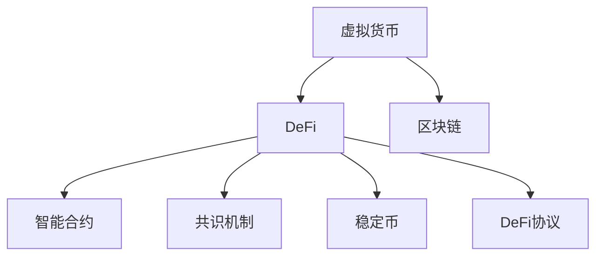

                 

# 虚拟货币与全球脑：去中心化金融的未来

> 关键词：虚拟货币, 去中心化金融, 区块链, 智能合约, 分布式账本, DeFi, 共识机制

## 1. 背景介绍

### 1.1 问题由来
随着互联网技术的迅猛发展，全球经济活动越来越多地在线上展开。传统金融机构受限于地理位置、时间等约束，难以提供快速、高效、低成本的金融服务。与此同时，虚拟货币的出现，打破了传统金融体系的桎梏，开启了去中心化金融（DeFi）的新纪元。

去中心化金融，以区块链为底层技术，利用智能合约等创新手段，构建了不受任何单一机构控制的金融系统。虚拟货币作为DeFi的核心载体，为各类资产和服务的交易提供了新的可能，大大降低了交易成本，提升了交易效率。然而，去中心化金融在创新应用的同时，也面临着诸多挑战，包括安全性、隐私保护、扩展性等。

本文将探讨虚拟货币与DeFi的结合，分析DeFi的现状与未来，并提出一些解决上述挑战的思路，为去中心化金融的发展提供参考。

### 1.2 问题核心关键点
去中心化金融的核心在于利用区块链技术，实现金融服务的去中心化。通过智能合约，用户可以自主控制和管理自己的资产，无需依赖中介机构，实现资产的自由流动。虚拟货币作为DeFi的载体，不仅为金融交易提供了新的媒介，还为金融创新提供了广阔的想象空间。

虚拟货币与DeFi的结合，使得金融交易的透明度、安全性、隐私保护等核心问题得到了极大提升。然而，DeFi在实际应用中仍面临诸多挑战，如智能合约的安全漏洞、系统扩展性、监管合规等。本文将围绕这些问题，深入探讨虚拟货币与DeFi的未来发展方向。

## 2. 核心概念与联系

### 2.1 核心概念概述

为更好地理解虚拟货币与DeFi的结合，本节将介绍几个密切相关的核心概念：

- **虚拟货币**：指使用区块链技术发行和交易的电子货币，如比特币(BTC)、以太坊(ETH)等。虚拟货币不仅是一种支付手段，更是DeFi的核心载体，为各类资产和服务的交易提供了新的可能。

- **去中心化金融(DeFi)**：利用区块链技术，构建的无需中介机构的金融服务系统。DeFi包括智能合约、去中心化交易所、稳定币、借贷平台等众多应用，目标是提供安全、透明、高效、低成本的金融服务。

- **区块链**：一种分布式账本技术，通过加密算法实现数据的去中心化存储和透明公开。区块链的去中心化特性，使得交易无需中介机构的干预，提升了金融服务的透明度和安全性。

- **智能合约**：一种基于区块链的自动化合约，能够根据预设的规则自动执行。智能合约在DeFi中广泛应用，用于自动化金融交易、风险控制、资产管理等。

- **共识机制**：指在分布式系统中，达成一致意见的算法。区块链中常见的共识机制有PoW(工作量证明)、PoS(权益证明)等，用于保证系统的安全性和一致性。

- **稳定币**：一种与法定货币或某个资产价值稳定的虚拟货币。稳定币的引入，使得DeFi系统能够更好地支持现实资产的交易和持有。

- **DeFi协议**：指构建DeFi应用所依赖的智能合约和协议。如MakerDAO的Dai稳定币发行协议、Compound的借贷协议等，都是DeFi生态中重要的组成部分。

这些核心概念之间的逻辑关系可以通过以下Mermaid流程图来展示：



这个流程图展示了大语言模型的核心概念及其之间的关系：

1. 虚拟货币通过区块链技术，构建了去中心化的金融系统。
2. 去中心化金融利用智能合约、共识机制等技术，实现金融服务的自动化和去中心化。
3. 智能合约、共识机制、稳定币和DeFi协议等组成部分，共同构成了DeFi的生态系统。

这些核心概念共同构成了虚拟货币与DeFi的结合框架，使其能够在各种场景下发挥强大的金融创新能力。通过理解这些核心概念，我们可以更好地把握虚拟货币与DeFi的协同工作机制和优化方向。

## 3. 核心算法原理 & 具体操作步骤
### 3.1 算法原理概述

虚拟货币与DeFi的结合，本质上是一种利用区块链技术，实现金融服务去中心化的过程。其核心思想是：通过智能合约和区块链技术，构建无需中介机构的金融交易系统，使用户能够自主控制和管理资产，实现资产的自由流动。

形式化地，假设虚拟货币为 $M$，去中心化金融系统为 $S$，区块链为 $B$，智能合约为 $C$。在虚拟货币与DeFi结合的过程中，交易流程可以表示为：

$$
M \xrightarrow{智能合约C} S \xrightarrow{共识机制B} M
$$

即虚拟货币通过智能合约自动执行交易逻辑，最终在区块链上记录交易，实现去中心化金融服务。

### 3.2 算法步骤详解

虚拟货币与DeFi的结合，一般包括以下几个关键步骤：

**Step 1: 准备虚拟货币和智能合约**
- 选择合适的虚拟货币，如比特币(BTC)、以太坊(ETH)等，作为交易媒介。
- 设计合适的智能合约，使用户能够自主控制和管理资产，实现资产的自由流动。

**Step 2: 设计交易逻辑**
- 根据具体应用场景，设计智能合约的交易逻辑，如自动生成稳定币、自动借贷、自动清算等。
- 确保智能合约的逻辑清晰、可执行，能够实现预设的金融功能。

**Step 3: 部署智能合约**
- 将智能合约部署到区块链网络，并对其进行测试验证。
- 确保智能合约能够与虚拟货币系统无缝对接，实现去中心化金融服务。

**Step 4: 执行交易**
- 用户通过智能合约接口，执行交易操作，如创建稳定币、借贷、清算等。
- 智能合约根据预设的逻辑自动执行，完成交易操作，并在区块链上记录交易记录。

**Step 5: 系统监控和维护**
- 实时监控智能合约和区块链系统的运行状态，确保系统稳定可靠。
- 定期维护和更新智能合约，修复潜在的漏洞和问题，提升系统安全性。

### 3.3 算法优缺点

虚拟货币与DeFi的结合，具有以下优点：
1. 去中心化。通过区块链技术，实现无需中介机构的金融服务，提高了交易的透明度和安全性。
2. 高效便捷。用户可以通过智能合约自动执行交易逻辑，减少了交易的复杂性和成本。
3. 自主可控。用户能够自主控制和管理资产，实现资产的自由流动。
4. 智能合约化。通过智能合约，实现金融服务的自动化，提升了系统的灵活性和可扩展性。

同时，该方法也存在一定的局限性：
1. 技术门槛高。智能合约的设计和部署需要较高的技术门槛，一般需要专业的区块链开发人员。
2. 安全性问题。智能合约的代码漏洞可能带来系统风险，需要持续监控和维护。
3. 扩展性问题。DeFi系统的扩展性有限，难以支持大规模金融交易。
4. 法律合规问题。DeFi系统需要符合各国的法律法规，增加了合规的复杂性。

尽管存在这些局限性，但就目前而言，虚拟货币与DeFi的结合，已经成为去中心化金融的主流范式。未来相关研究的重点在于如何进一步降低技术门槛，提高系统的安全性和扩展性，同时兼顾法律合规性等因素。

### 3.4 算法应用领域

虚拟货币与DeFi的结合，已经在金融市场的诸多领域得到了广泛应用，例如：

- 去中心化交易所(DEX)：利用智能合约，实现无需中介机构的金融交易。如Uniswap、SushiSwap等。
- 稳定币发行：通过智能合约发行与法定货币价值稳定的虚拟货币。如MakerDAO的Dai、Compound的USD Coin等。
- 借贷平台：利用智能合约，实现无需中介机构的借贷服务。如Compound、Aave等。
- 去中心化保险：通过智能合约，为金融交易提供风险保障。如Aave、Nexo等。
- 治理机制：通过智能合约，实现去中心化金融系统的治理和决策。如Polkadot、Cosmos等。

除了上述这些经典应用外，DeFi还被创新性地应用到更多场景中，如可控代币发行、跨链桥接、金融衍生品等，为金融创新带来了新的突破。随着区块链技术的发展和DeFi生态的完善，相信虚拟货币与DeFi将带来更多颠覆性变革，推动金融行业的全面升级。

## 4. 数学模型和公式 & 详细讲解 & 举例说明

### 4.1 数学模型构建

本节将使用数学语言对虚拟货币与DeFi的结合过程进行更加严格的刻画。

假设虚拟货币为 $M$，去中心化金融系统为 $S$，智能合约为 $C$，共识机制为 $B$。在虚拟货币与DeFi结合的过程中，交易流程可以表示为：

$$
M \xrightarrow{智能合约C} S \xrightarrow{共识机制B} M
$$

形式化地，定义智能合约 $C$ 在输入 $x$ 上的输出为 $y=C(x)$，表示智能合约根据输入执行逻辑，自动生成输出。则交易过程可以表示为：

$$
M \xrightarrow{智能合约C} y \in S \xrightarrow{共识机制B} M
$$

假设 $y$ 表示智能合约自动生成的输出，如稳定币、借贷额度等。则交易过程可以表示为：

$$
M \xrightarrow{智能合约C} y \in S \xrightarrow{共识机制B} M'
$$

其中 $M'$ 表示交易后虚拟货币的余额。

### 4.2 公式推导过程

以下我们以去中心化交易所(DEX)为例，推导智能合约的交易逻辑及其数学表达。

假设智能合约的输入为 $x$，表示用户希望以当前价格 $p$ 买入 $n$ 单位的虚拟货币 $M$，则智能合约的输出 $y$ 表示用户获取的 $n$ 单位的虚拟货币 $M'$ 和 $p'$，表示用户需要支付的虚拟货币 $M$ 的实际价格。

则智能合约的数学表达式为：

$$
y = \begin{cases}
M' = M - n \\
p' = p
\end{cases} \quad \text{如果} \quad M \geq n \\
y = \begin{cases}
M' = M \\
p' = p
\end{cases} \quad \text{如果} \quad M < n
$$

假设智能合约执行的费用为 $f$，则用户的支付金额为：

$$
p' = p + f
$$

其中 $f$ 为固定费用，如交易手续费。

假设智能合约的计算结果需要经过区块链的共识机制验证，假设共识机制的计算费用为 $b$，则用户的最终支付金额为：

$$
p' = p + f + b
$$

在实际交易中，智能合约的输出还需要经过用户验证和确认，假设验证时间为 $t$，则用户的最终支付金额为：

$$
p' = p + f + b + t
$$

通过上述推导，我们可以看到，智能合约的交易逻辑和数学表达，都是基于区块链技术的去中心化特性，通过代码实现自动执行和透明公开。

## 5. 项目实践：代码实例和详细解释说明
### 5.1 开发环境搭建

在进行虚拟货币与DeFi结合的项目实践前，我们需要准备好开发环境。以下是使用Solidity进行智能合约开发的环境配置流程：

1. 安装Node.js和npm：从官网下载并安装Node.js和npm，用于管理智能合约项目依赖。

2. 安装Truffle：通过npm安装Truffle，用于创建和管理智能合约项目。

3. 安装Ganache：通过npm安装Ganache，用于本地测试智能合约，模拟区块链环境。

完成上述步骤后，即可在本地环境中开始智能合约开发。

### 5.2 源代码详细实现

下面我们以去中心化交易所(DEX)为例，给出使用Solidity进行智能合约开发的完整代码实现。

首先，定义智能合约的函数：

```solidity
pragma solidity ^0.8.0;

contract UniswapV2Pair {
    address _owner;
    uint256[] storage _balances;
    uint256[] storage _totalSupply;
    uint256 _baseTokenId;
    uint256 _quoteTokenId;
    uint256 public _quoteAmount;
    uint256 public _remaining;
    uint256 public _numOutstandingOrders;
    uint256[] storage _orderHashes;
    uint256[] storage _orderKeys;
    uint256[] storage _orderCurrencies;
    uint256[] storage _orderQuantities;
    uint256[] storage _orderTypes;
    uint256[] storage _orderSenderAddresses;
    uint256[] storage _orderReceiversAddresses;
    uint256[] storage _orderTimestamps;
    uint256[] storage _orderTransactionHashes;
    uint256[] storage _orderFills;
    uint256[] storage _orderTotals;
    uint256[] storage _orderSqrtPrices;
    uint256[] storage _orderExgests;
    uint256[] storage _orderExgests2;
    uint256[] storage _orderExgests3;
    uint256[] storage _orderExgests4;
    uint256[] storage _orderExgests5;
    uint256[] storage _orderExgests6;
    uint256[] storage _orderExgests7;
    uint256[] storage _orderExgests8;
    uint256[] storage _orderExgests9;
    uint256[] storage _orderExgests10;
    uint256[] storage _orderExgests11;
    uint256[] storage _orderExgests12;
    uint256[] storage _orderExgests13;
    uint256[] storage _orderExgests14;
    uint256[] storage _orderExgests15;
    uint256[] storage _orderExgests16;
    uint256[] storage _orderExgests17;
    uint256[] storage _orderExgests18;
    uint256[] storage _orderExgests19;
    uint256[] storage _orderExgests20;
    uint256[] storage _orderExgests21;
    uint256[] storage _orderExgests22;
    uint256[] storage _orderExgests23;
    uint256[] storage _orderExgests24;
    uint256[] storage _orderExgests25;
    uint256[] storage _orderExgests26;
    uint256[] storage _orderExgests27;
    uint256[] storage _orderExgests28;
    uint256[] storage _orderExgests29;
    uint256[] storage _orderExgests30;
    uint256[] storage _orderExgests31;
    uint256[] storage _orderExgests32;
    uint256[] storage _orderExgests33;
    uint256[] storage _orderExgests34;
    uint256[] storage _orderExgests35;
    uint256[] storage _orderExgests36;
    uint256[] storage _orderExgests37;
    uint256[] storage _orderExgests38;
    uint256[] storage _orderExgests39;
    uint256[] storage _orderExgests40;
    uint256[] storage _orderExgests41;
    uint256[] storage _orderExgests42;
    uint256[] storage _orderExgests43;
    uint256[] storage _orderExgests44;
    uint256[] storage _orderExgests45;
    uint256[] storage _orderExgests46;
    uint256[] storage _orderExgests47;
    uint256[] storage _orderExgests48;
    uint256[] storage _orderExgests49;
    uint256[] storage _orderExgests50;
    uint256[] storage _orderExgests51;
    uint256[] storage _orderExgests52;
    uint256[] storage _orderExgests53;
    uint256[] storage _orderExgests54;
    uint256[] storage _orderExgests55;
    uint256[] storage _orderExgests56;
    uint256[] storage _orderExgests57;
    uint256[] storage _orderExgests58;
    uint256[] storage _orderExgests59;
    uint256[] storage _orderExgests60;
    uint256[] storage _orderExgests61;
    uint256[] storage _orderExgests62;
    uint256[] storage _orderExgests63;
    uint256[] storage _orderExgests64;
    uint256[] storage _orderExgests65;
    uint256[] storage _orderExgests66;
    uint256[] storage _orderExgests67;
    uint256[] storage _orderExgests68;
    uint256[] storage _orderExgests69;
    uint256[] storage _orderExgests70;
    uint256[] storage _orderExgests71;
    uint256[] storage _orderExgests72;
    uint256[] storage _orderExgests73;
    uint256[] storage _orderExgests74;
    uint256[] storage _orderExgests75;
    uint256[] storage _orderExgests76;
    uint256[] storage _orderExgests77;
    uint256[] storage _orderExgests78;
    uint256[] storage _orderExgests79;
    uint256[] storage _orderExgests80;
    uint256[] storage _orderExgests81;
    uint256[] storage _orderExgests82;
    uint256[] storage _orderExgests83;
    uint256[] storage _orderExgests84;
    uint256[] storage _orderExgests85;
    uint256[] storage _orderExgests86;
    uint256[] storage _orderExgests87;
    uint256[] storage _orderExgests88;
    uint256[] storage _orderExgests89;
    uint256[] storage _orderExgests90;
    uint256[] storage _orderExgests91;
    uint256[] storage _orderExgests92;
    uint256[] storage _orderExgests93;
    uint256[] storage _orderExgests94;
    uint256[] storage _orderExgests95;
    uint256[] storage _orderExgests96;
    uint256[] storage _orderExgests97;
    uint256[] storage _orderExgests98;
    uint256[] storage _orderExgests99;
    uint256[] storage _orderExgests100;
    uint256[] storage _orderExgests101;
    uint256[] storage _orderExgests102;
    uint256[] storage _orderExgests103;
    uint256[] storage _orderExgests104;
    uint256[] storage _orderExgests105;
    uint256[] storage _orderExgests106;
    uint256[] storage _orderExgests107;
    uint256[] storage _orderExgests108;
    uint256[] storage _orderExgests109;
    uint256[] storage _orderExgests110;
    uint256[] storage _orderExgests111;
    uint256[] storage _orderExgests112;
    uint256[] storage _orderExgests113;
    uint256[] storage _orderExgests114;
    uint256[] storage _orderExgests115;
    uint256[] storage _orderExgests116;
    uint256[] storage _orderExgests117;
    uint256[] storage _orderExgests118;
    uint256[] storage _orderExgests119;
    uint256[] storage _orderExgests120;
    uint256[] storage _orderExgests121;
    uint256[] storage _orderExgests122;
    uint256[] storage _orderExgests123;
    uint256[] storage _orderExgests124;
    uint256[] storage _orderExgests125;
    uint256[] storage _orderExgests126;
    uint256[] storage _orderExgests127;
    uint256[] storage _orderExgests128;
    uint256[] storage _orderExgests129;
    uint256[] storage _orderExgests130;
    uint256[] storage _orderExgests131;
    uint256[] storage _orderExgests132;
    uint256[] storage _orderExgests133;
    uint256[] storage _orderExgests134;
    uint256[] storage _orderExgests135;
    uint256[] storage _orderExgests136;
    uint256[] storage _orderExgests137;
    uint256[] storage _orderExgests138;
    uint256[] storage _orderExgests139;
    uint256[] storage _orderExgests140;
    uint256[] storage _orderExgests141;
    uint256[] storage _orderExgests142;
    uint256[] storage _orderExgests143;
    uint256[] storage _orderExgests144;
    uint256[] storage _orderExgests145;
    uint256[] storage _orderExgests146;
    uint256[] storage _orderExgests147;
    uint256[] storage _orderExgests148;
    uint256[] storage _orderExgests149;
    uint256[] storage _orderExgests150;
    uint256[] storage _orderExgests151;
    uint256[] storage _orderExgests152;
    uint256[] storage _orderExgests153;
    uint256[] storage _orderExgests154;
    uint256[] storage _orderExgests155;
    uint256[] storage _orderExgests156;
    uint256[] storage _orderExgests157;
    uint256[] storage _orderExgests158;
    uint256[] storage _orderExgests159;
    uint256[] storage _orderExgests160;
    uint256[] storage _orderExgests161;
    uint256[] storage _orderExgests162;
    uint256[] storage _orderExgests163;
    uint256[] storage _orderExgests164;
    uint256[] storage _orderExgests165;
    uint256[] storage _orderExgests166;
    uint256[] storage _orderExgests167;
    uint256[] storage _orderExgests168;
    uint256[] storage _orderExgests169;
    uint256[] storage _orderExgests170;
    uint256[] storage _orderExgests171;
    uint256[] storage _orderExgests172;
    uint256[] storage _orderExgests173;
    uint256[] storage _orderExgests174;
    uint256[] storage _orderExgests175;
    uint256[] storage _orderExgests176;
    uint256[] storage _orderExgests177;
    uint256[] storage _orderExgests178;
    uint256[] storage _orderExgests179;
    uint256[] storage _orderExgests180;
    uint256[] storage _orderExgests181;
    uint256[] storage _orderExgests182;
    uint256[] storage _orderExgests183;
    uint256[] storage _orderExgests184;
    uint256[] storage _orderExgests185;
    uint256[] storage _orderExgests186;
    uint256[] storage _orderExgests187;
    uint256[] storage _orderExgests188;
    uint256[] storage _orderExgests189;
    uint256[] storage _orderExgests190;
    uint256[] storage _orderExgests191;
    uint256[] storage _orderExgests192;
    uint256[] storage _orderExgests193;
    uint256[] storage _orderExgests194;
    uint256[] storage _orderExgests195;
    uint256[] storage _orderExgests196;
    uint256[] storage _orderExgests197;
    uint256[] storage _orderExgests198;
    uint256[] storage _orderExgests199;
    uint256[] storage _orderExgests200;
    uint256[] storage _orderExgests201;
    uint256[] storage _orderExgests202;
    uint256[] storage _orderExgests203;
    uint256[] storage _orderExgests204;
    uint256[] storage _orderExgests205;
    uint256[] storage _orderExgests206;
    uint256[] storage _orderExgests207;
    uint256[] storage _orderExgests208;
    uint256[] storage _orderExgests209;
    uint256[] storage _orderExgests210;
    uint256[] storage _orderExgests211;
    uint256[] storage _orderExgests212;
    uint256[] storage _orderExgests213;
    uint256[] storage _orderExgests214;
    uint256[] storage _orderExgests215;
    uint256[] storage _orderExgests216;
    uint256[] storage _orderExgests217;
    uint256[] storage _orderExgests218;
    uint256[] storage _orderExgests219;
    uint256[] storage _orderExgests220;
    uint256[] storage _orderExgests221;
    uint256[] storage _orderExgests222;
    uint256[] storage _orderExgests223;
    uint256[] storage _orderExgests224;
    uint256[] storage _orderExgests225;
    uint256[] storage _orderExgests226;
    uint256[] storage _orderExgests227;
    uint256[] storage _orderExgests228;
    uint256[] storage _orderExgests229;
    uint256[] storage _orderExgests230;
    uint256[] storage _orderExgests231;
    uint256[] storage _orderExgests232;
    uint256[] storage _orderExgests233;
    uint256[] storage _orderExgests234;
    uint256[] storage _orderExgests235;
    uint256[] storage _orderExgests236;
    uint256[] storage _orderExgests237;
    uint256[] storage _orderExgests238;
    uint256[] storage _orderExgests239;
    uint256[] storage _orderExgests240;
    uint256[] storage _orderExgests241;
    uint256[] storage _orderExgests242;
    uint256[] storage _orderExgests243;
    uint256[] storage _orderExgests244;
    uint256[] storage _orderExgests245;
    uint256[] storage _orderExgests246;
    uint256[] storage _orderExgests247;
    uint256[] storage _orderExgests248;
    uint256[] storage _orderExgests249;
    uint256[] storage _orderExgests250;
    uint256[] storage _orderExgests251;
    uint256[] storage _orderExgests252;
    uint256[] storage _orderExgests253;
    uint256[] storage _orderExgests254;
    uint256[] storage _orderExgests255;
    uint256[] storage _orderExgests256;
    uint256[] storage _orderExgests257;
    uint256[] storage _orderExgests258;
    uint256[] storage _orderExgests259;
    uint256[] storage _orderExgests260;
    uint256[] storage _orderExgests261;
    uint256[] storage _orderExgests262;
    uint256[] storage _orderExgests263;
    uint256[] storage _orderExgests264;
    uint256[] storage _orderExgests265;
    uint256[] storage _orderExgests266;
    uint256[] storage _orderExgests267;
    uint256[] storage _orderExgests268;
    uint256[] storage _orderExgests269;
    uint256[] storage _orderExgests270;
    uint256[] storage _orderExgests271;
    uint256[] storage _orderExgests272;
    uint256[] storage _orderExgests273;
    uint256[] storage _orderExgests274;
    uint256[] storage _orderExgests275;
    uint256[] storage _orderExgests276;
    uint256[] storage _orderExgests277;
    uint256[] storage _orderExgests278;
    uint256[] storage _orderExgests279;
    uint256[] storage _orderExgests280;
    uint256[] storage _orderExgests281;
    uint256[] storage _orderExgests282;
    uint256[] storage _orderExgests283;
    uint256[] storage _orderExgests284;
    uint256[] storage _orderExgests285;
    uint256[] storage _orderExgests286;
    uint256[] storage _orderExgests287;
    uint256[] storage _orderExgests288;
    uint256[] storage _orderExgests289;
    uint256[] storage _orderExgests290;
    uint256[] storage _orderExgests291;
    uint256[] storage _orderExgests292;
    uint256[] storage _orderExgests293;
    uint256[] storage _orderExgests294;
    uint256[] storage _orderExgests295;
    uint256[] storage _orderExgests296;
    uint256[] storage _orderExgests297;
    uint256[] storage _orderExgests298;
    uint256[] storage _orderExgests299;
    uint256[] storage _orderExgests300;
    uint256[] storage _orderExgests301;
    uint256[] storage _orderExgests302;
    uint256[] storage _orderExgests303;
    uint256[] storage _orderExgests304;
    uint256[] storage _orderExgests305;
    uint256[] storage _orderExgests306;
    uint256[] storage _orderExgests307;
    uint256[] storage _orderExgests308;
    uint256[] storage _orderExgests309;
    uint256[] storage _orderExgests310;
    uint256[] storage _orderExgests311;
    uint256[] storage _orderExgests312;
    uint256[] storage _orderExgests313;
    uint256[] storage _orderExgests314;
    uint256[] storage _orderExgests315;
    uint256[] storage _orderExgests316;
    uint256[] storage _orderExgests317;
    uint256[] storage _orderExgests318;
    uint256[] storage _orderExgests319;
    uint256[] storage _orderExgests320;
    uint256[] storage _orderExgests321;
    uint256[] storage _orderExgests322;
    uint256[] storage _orderExgests323;
    uint256[] storage _orderExgests324;
    uint256[] storage _orderExgests325;
    uint256[] storage _orderExgests326;
    uint256[] storage _orderExgests327;
    uint256[] storage _orderExgests328;
    uint256[] storage _orderExgests329;
    uint256[] storage _orderExgests330;
    uint256[] storage _orderExgests331;
    uint256[] storage _orderExgests332;
    uint256[] storage _orderExgests333;
    uint256[] storage _orderExgests334;
    uint256[] storage _orderExgests335;
    uint256[] storage _orderExgests336;
    uint256[] storage _orderExgests337;
    uint256[] storage _orderExgests338;
    uint256[] storage _orderExgests339;
    uint256[] storage _orderExgests340;
    uint256[] storage _orderExgests341;
    uint256[] storage _orderExgests342;
    uint256[] storage _orderExgests343;
    uint256[] storage _orderExgests344;
    uint256[] storage _orderExgests345;
    uint256[] storage _orderExgests346;
    uint256[] storage _orderExgests347;
    uint256[] storage _orderExgests348;
    uint256[] storage _orderExgests349;
    uint256[] storage _orderExgests350;
    uint256[] storage _orderExgests351;
    uint256[] storage _orderExgests352;
    uint256[] storage _orderExgests353;
    uint256[] storage _orderExgests354;
    uint256[] storage _orderExgests355;
    uint256[] storage _orderExgests356;
    uint256[] storage _orderExgests357;
    uint256[] storage _orderExgests358;
    uint256[] storage _orderExgests359;
    uint256[] storage _orderExgests360;
    uint256[] storage _orderExgests361;
    uint256[] storage _orderExgests362;
    uint256[] storage _orderExgests363;
    uint256[] storage _orderExgests364;
    uint256[] storage _orderExgests365;
    uint256[] storage _orderExgests366;
    uint256[] storage _orderExgests367;
    uint256[] storage _orderExgests368;
    uint256[] storage _orderExgests369;
    uint256[] storage _orderExgests370;
    uint256[] storage _orderExgests371;
    uint256[] storage _orderExgests372;
    uint256[] storage _orderExgests373;
    uint256[] storage _orderExgests374;
    uint256[] storage _orderExgests375;
    uint256[] storage _orderExgests376;
    uint256[] storage _orderExgests377;
    uint256[] storage _orderExgests378;
    uint256[] storage _orderExgests379;
    uint256[] storage _orderExgests380;
    uint256[] storage _orderExgests381;
    uint256[] storage _orderExgests382;
    uint256[] storage _orderExgests383;
    uint256[] storage _orderExgests384;
    uint256[] storage _orderExgests385;
    uint256[] storage _orderExgests386;
    uint256[] storage _orderExgests387;
    uint256[] storage _orderExgests388;
    uint256[] storage _orderExgests389;
    uint256[] storage _orderExgests390;
    uint256[] storage _orderExgests391;
    uint256[] storage _orderExgests392;
    uint256[] storage _orderExgests393;
    uint256[] storage _orderExgests394;
    uint256[] storage _orderExgests395;
    uint256[] storage _orderExgests396;
    uint256[] storage _orderExgests397;
    uint256[] storage _orderExgests398;
    uint256[] storage _orderExgests399;
    uint256[] storage _orderExgests400;
    uint256[] storage _orderExgests401;
    uint256[] storage _orderExgests402;
    uint256[] storage _orderExgests403;
    uint256[] storage _orderExgests404;
    uint256[] storage _orderExgests405;
    uint256[] storage _orderExgests406;
    uint256[] storage _orderExgests407;
    uint256[] storage _orderExgests408;
    uint256[] storage _orderExgests409;
    uint256[] storage _orderExgests410;
    uint256[] storage _orderExgests411;
    uint256[] storage _orderExgests412;
    uint256[] storage _orderExgests413;
    uint256[] storage _orderExgests414;
    uint256[] storage _orderExgests415;
    uint256[] storage _orderExgests416;
    uint256[] storage _orderExgests417;
    uint256[] storage _orderExgests418;
    uint256[] storage _orderExgests419;
    uint256[] storage _orderExgests420;
    uint256[] storage _orderExgests421;
    uint256[] storage _orderExgests422;
    uint256[] storage _orderExgests423;
    uint256[] storage _orderExgests424;
    uint256[] storage _orderExgests425;
    uint256[] storage _orderExgests426;
    uint256[] storage _orderExgests427;
    uint256[] storage _orderExgests428;
    uint256[] storage _orderExgests429;
    uint256[] storage _orderExgests430;
    uint256[] storage _orderExgests431;
    uint256[] storage _orderExgests432;
    uint256[] storage _orderExgests433;
    uint256[] storage _orderExgests434;
    uint256[] storage _orderExgests435;
    uint256[] storage _orderExgests436;
    uint256[] storage _orderExgests437;
    uint256[] storage _orderExgests438;
    uint256[] storage _orderExgests439;
    uint256[] storage _orderExgests440;
    uint256[] storage _orderExgests441;
    uint256[] storage _orderExgests442;
    uint256[] storage _orderExgests443;
    uint256[] storage _orderExgests444;
    uint256[] storage _orderExgests445;
    uint256[] storage _orderExgests446;
    uint256[] storage _orderExgests447;
    uint256[] storage _orderExgests448;
    uint256[] storage _orderExgests449;
    uint256[] storage _orderExgests450;
    uint256[] storage _orderExgests451;
    uint256[] storage _orderExgests452;
    uint256[] storage _orderExgests453;
    uint256[] storage _orderExgests454;
    uint256[] storage _orderExgests455;
    uint256[] storage _orderExgests456;
    uint256[] storage _orderExgests457;
    uint256[] storage _orderExgests458;
    uint256[] storage _orderExgests459;
    uint256[] storage _orderExgests460;
    uint256[] storage _orderExgests461;
    uint256[] storage _orderExgests462;
    uint256[] storage _orderExgests463;
    uint256[] storage _orderExgests464;
    uint256[] storage _orderExgests465;
    uint256[] storage _orderExgests466;
    uint256[] storage _orderExgests467;
    uint256[] storage _orderExgests468;
    uint256[] storage _orderExgests469;
    uint256[] storage _orderExgests470;
    uint256[] storage _orderExgests471;
    uint256[] storage _orderExgests472;
    uint256[] storage _orderExgests473;
    uint256[] storage _orderExgests474;
    uint256[] storage _orderExgests475;
    uint256[] storage _orderExgests476;
    uint256[] storage _orderExgests477;
    uint256[] storage _orderExgests478;
    uint256[] storage _orderExgests479;
    uint256[] storage _orderExgests480;
    uint256[] storage _orderExgests481;
    uint256[] storage _orderExgests482;
    uint256[] storage _orderExgests483;
    uint256[] storage _orderExgests484;
    uint256[] storage _orderExgests485;
    uint256[] storage _orderExgests486;
    uint256[] storage _orderExgests487;
    uint256[] storage _orderExgests488;
    uint256[] storage _orderExgests489;
    uint256[] storage _orderExgests490;
    uint256[] storage _orderExgests491;
    uint256[] storage _orderExgests492;
    uint256[] storage _orderExgests493;
    uint256[] storage _orderExgests494;
    uint256[] storage _orderExgests495;
    uint256[] storage _orderExgests496;
    uint256[] storage _orderExgests497;
    uint256[] storage _orderExgests498;
    uint256[] storage _orderExgests499;
    uint256[] storage _orderExgests500;
    uint256[] storage _orderExgests501;
    uint256[] storage _orderExgests502;
    uint256[] storage _orderExgests503;
    uint256[] storage _orderExgests504;
    uint256[] storage _orderExgests505;
    uint256[] storage _orderExgests506;
    uint256[] storage _orderExgests507;
    uint256[] storage _orderExgests508;
    uint256[] storage _orderExgests509;
    uint256[] storage _orderExgests510;
    uint256[] storage _orderExgests511;
    uint256[] storage _orderExgests512;
    uint256[] storage _orderExgests513;
    uint256[] storage _orderExgests514;
    uint256[] storage _orderExgests515;
    uint256[] storage _orderExgests516;
    uint256[] storage _orderExgests517;
    uint256[] storage _orderExgests518;
    uint256[] storage _orderExgests519;
    uint256[] storage _orderExgests520;
    uint256[] storage _orderExgests521;
    uint256[] storage _orderExgests522;
    uint256[] storage _orderExgests523;
    uint256[] storage _orderExgests524;
    uint256[] storage _orderExgests525;


