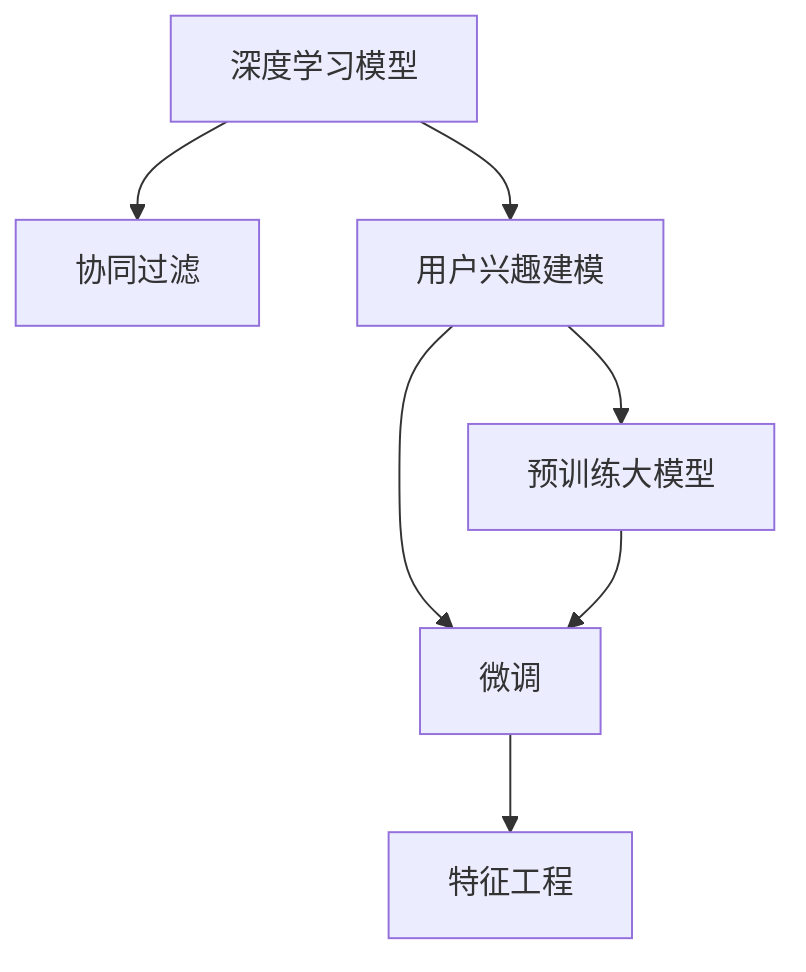

                 

# 融合AI大模型的用户兴趣建模技术

> 关键词：AI大模型, 用户兴趣建模, 协同过滤, 深度学习, 特征工程, 超参数优化, 精准推荐

## 1. 背景介绍

### 1.1 问题由来

随着电子商务和互联网技术的发展，个性化推荐系统成为了提升用户体验、增加用户粘性和商业收益的重要手段。然而，传统的协同过滤和基于内容的推荐算法，面临着数据稀疏、特征单一等问题，难以满足大规模用户和商品数据的需求。近年来，深度学习和人工智能大模型的崛起，为推荐系统带来了新的突破，使其能够更准确地捕捉用户行为和偏好。

特别是随着预训练大模型的广泛应用，研究人员发现，通过在推荐任务上进行微调，可以充分利用大模型的泛化能力，显著提升推荐系统的效果。然而，当前大模型在推荐系统中的应用主要局限于特征提取和相似度计算等环节，对于用户兴趣建模的直接贡献较少。如何充分发挥大模型的潜力，将深度学习和协同过滤相结合，设计出更高效、精准的用户兴趣建模技术，成为了当前推荐系统研究的热点之一。

## 2. 核心概念与联系

### 2.1 核心概念概述

为更好地理解融合AI大模型的用户兴趣建模技术，本节将介绍几个密切相关的核心概念：

- 深度学习模型：基于神经网络的机器学习模型，通过多层次的非线性特征提取，实现复杂的模式识别和预测任务。
- 协同过滤：基于用户和商品之间的历史交互数据，通过挖掘相似用户或商品的方法，实现个性化的推荐。
- 用户兴趣建模：通过多种方式获取用户偏好信息，构建用户兴趣表示向量，用于推荐系统中的预测和评估。
- 预训练大模型：如BERT、GPT-3等，通过在大规模无标签数据上进行预训练，学习到通用的语言或图像表示。
- 微调（Fine-Tuning）：在预训练模型的基础上，使用特定任务的数据进行优化，以提高模型在该任务上的性能。
- 特征工程：选择、提取、构造、变换特征，以提高模型的拟合能力和泛化能力。

这些核心概念之间的逻辑关系可以通过以下Mermaid流程图来展示：



这个流程图展示了大模型用户兴趣建模技术的核心概念及其之间的关系：

1. 深度学习模型和协同过滤结合，通过多种方式获取用户和商品特征。
2. 预训练大模型通过在海量数据上学习泛化能力，用于初始化用户兴趣建模和协同过滤的参数。
3. 微调技术进一步优化模型，使其更适应推荐系统任务。
4. 特征工程对模型输入的特征进行提升，优化模型表现。

这些核心概念共同构成了深度学习在推荐系统中的应用框架，使其能够高效地进行用户兴趣建模和个性化推荐。

## 3. 核心算法原理 & 具体操作步骤
### 3.1 算法原理概述

融合AI大模型的用户兴趣建模技术，本质上是将深度学习与协同过滤结合，通过在预训练大模型上进行微调，提升用户和商品的表示，用于推荐系统中的个性化推荐。其核心思想是：通过深度学习模型学习用户的高级特征表示，同时保留协同过滤中的隐式反馈信息，以实现更加准确、全面的用户兴趣建模。

具体而言，该方法分为以下几个关键步骤：

1. **用户商品编码**：使用深度学习模型对用户和商品特征进行编码，得到高维向量表示。
2. **相似度计算**：使用协同过滤中的相似度计算方法，如余弦相似度或点积相似度，计算用户和商品之间的相似度。
3. **评分预测**：根据用户和商品之间的相似度，通过深度学习模型预测用户对商品的评分，用于推荐排序。
4. **模型微调**：在用户商品编码和评分预测模型上，使用推荐数据集进行微调，优化模型参数。

通过深度学习和协同过滤的结合，该方法能够充分利用大规模数据和大模型的能力，实现更加精准和高效的个性化推荐。

### 3.2 算法步骤详解

基于深度学习的大模型用户兴趣建模技术，主要包括以下几个关键步骤：

**Step 1: 准备数据集**

- 收集用户行为数据，如浏览、点击、购买等行为，以及商品属性、用户属性等特征。
- 对用户行为数据进行整理和标准化，生成用户商品交互矩阵。
- 使用数据增强技术，扩充训练集的多样性，减少过拟合风险。

**Step 2: 用户商品编码**

- 使用预训练大模型对用户和商品特征进行编码，得到高维向量表示。
- 通过微调调整大模型参数，使其适应推荐系统任务。
- 使用特征选择和构造方法，提高用户和商品的特征表达能力。

**Step 3: 相似度计算**

- 使用协同过滤中的相似度计算方法，计算用户和商品之间的相似度。
- 根据相似度排序，构建候选推荐列表。

**Step 4: 评分预测**

- 使用微调后的评分预测模型，预测用户对候选商品的评分。
- 根据评分排序，选择推荐的商品列表。

**Step 5: 模型微调**

- 使用推荐数据集对用户商品编码和评分预测模型进行微调，优化模型参数。
- 使用交叉验证和超参数优化技术，选择最优的模型配置。

**Step 6: 部署和评估**

- 将微调后的模型部署到推荐系统中，进行实时推荐。
- 使用A/B测试等方法评估推荐效果，监控系统性能指标。

以上是基于深度学习的大模型用户兴趣建模技术的一般流程。在实际应用中，还需要针对具体任务和数据特点，对各步骤进行优化设计，如改进用户商品编码方法，引入更多协同过滤技术等，以进一步提升推荐效果。

### 3.3 算法优缺点

基于深度学习的大模型用户兴趣建模技术具有以下优点：

1. **高效性**：深度学习模型能够高效地处理大规模数据，实现快速的特征提取和表示学习。
2. **准确性**：利用预训练大模型的泛化能力，可以更准确地捕捉用户和商品的高级特征表示。
3. **可扩展性**：大模型可以适应不同规模和类型的推荐系统，支持多样化的应用场景。

同时，该方法也存在一定的局限性：

1. **计算成本高**：深度学习模型的训练和推理需要大量的计算资源，成本较高。
2. **模型复杂性高**：深度学习模型参数量巨大，难以解释模型的内部机制。
3. **数据依赖性强**：模型的性能高度依赖于数据质量和标注信息，标注成本较高。
4. **过拟合风险**：深度学习模型容易出现过拟合现象，需要合理设计正则化技术。

尽管存在这些局限性，但就目前而言，基于深度学习的大模型用户兴趣建模技术仍然是大规模推荐系统中最具前景的方法之一。未来相关研究的重点在于如何进一步降低计算成本，提高模型的可解释性和鲁棒性，同时兼顾高效性和准确性。

### 3.4 算法应用领域

基于深度学习的大模型用户兴趣建模技术，已经在多个推荐系统中得到了广泛的应用，包括但不限于以下领域：

- 电商推荐：通过微调大模型，为电商用户推荐商品，提升销售转化率。
- 视频推荐：使用深度学习模型对用户观看历史进行编码，推荐相关视频内容。
- 音乐推荐：对用户听歌历史和评分进行编码，推荐个性化音乐播放列表。
- 新闻推荐：基于用户阅读历史和兴趣标签，推荐相关新闻文章。

除了这些典型应用外，深度学习和大模型技术还在游戏推荐、社交媒体推荐、广告推荐等多个领域得到了创新性的应用，为推荐系统的智能化升级提供了新的思路。

## 4. 数学模型和公式 & 详细讲解 & 举例说明
### 4.1 数学模型构建

本节将使用数学语言对基于深度学习的大模型用户兴趣建模技术进行更加严格的刻画。

记用户和商品的原始特征表示为 $x_u \in \mathbb{R}^{d_u}$ 和 $x_i \in \mathbb{R}^{d_i}$，其中 $d_u$ 和 $d_i$ 分别为用户和商品的特征维度。记用户商品编码后的高维向量表示为 $\hat{x_u} \in \mathbb{R}^{d_h}$ 和 $\hat{x_i} \in \mathbb{R}^{d_h}$，其中 $d_h$ 为高维向量表示的维度。

设用户 $u$ 对商品 $i$ 的评分向量为 $y_{u,i} \in \mathbb{R}^k$，其中 $k$ 为评分的维度。使用预训练大模型对用户和商品进行编码，得到的用户和商品编码向量分别记为 $h_u \in \mathbb{R}^{d_h}$ 和 $h_i \in \mathbb{R}^{d_h}$。假设用户和商品的编码向量经过线性变换后，分别得到用户兴趣向量 $z_u \in \mathbb{R}^{d_h}$ 和商品特征向量 $z_i \in \mathbb{R}^{d_h}$。则用户和商品的相似度可以通过余弦相似度或点积相似度计算：

$$
s_{u,i} = \cos(\theta) = \frac{z_u^Tz_i}{\|z_u\|\|z_i\|}
$$

其中 $\theta$ 为用户和商品编码向量之间的夹角。

在得到用户和商品的相似度后，可以使用深度学习模型预测用户对商品的评分，模型输出为 $y_{u,i} \in \mathbb{R}^k$。模型损失函数为均方误差损失（MSE）或交叉熵损失（CE），具体形式如下：

$$
\mathcal{L} = \frac{1}{N} \sum_{i=1}^N \|y_{u,i} - \hat{y}_{u,i}\|^2
$$

其中 $N$ 为训练样本数量，$\hat{y}_{u,i}$ 为模型预测的评分向量。

### 4.2 公式推导过程

以一个简单的深度学习模型为例，进行评分预测的数学推导。

设用户和商品的高维编码向量分别为 $h_u$ 和 $h_i$，使用全连接神经网络对用户兴趣向量 $z_u$ 和商品特征向量 $z_i$ 进行编码，得到用户和商品的评分预测向量 $\hat{y}_{u,i}$。假设模型包含 $L$ 层神经网络，每一层的输出分别为 $o_1, o_2, ..., o_L$，最终输出为 $\hat{y}_{u,i} = o_L$。模型参数为 $\theta = \{W_1, b_1, W_2, b_2, ..., W_L, b_L\}$，其中 $W_l$ 和 $b_l$ 分别为第 $l$ 层的权重和偏置。

模型的前向传播过程可以表示为：

$$
\begin{aligned}
o_1 &= \sigma(W_1h_u + b_1) \\
o_2 &= \sigma(W_2o_1 + b_2) \\
& \vdots \\
o_L &= \sigma(W_Lo_{L-1} + b_L)
\end{aligned}
$$

其中 $\sigma$ 为激活函数，如ReLU、sigmoid等。

模型的评分预测输出为：

$$
\hat{y}_{u,i} = o_L
$$

模型的损失函数为均方误差损失（MSE）或交叉熵损失（CE），具体形式如下：

$$
\mathcal{L} = \frac{1}{N} \sum_{i=1}^N \|y_{u,i} - o_L\|^2
$$

模型参数的更新公式为：

$$
\theta \leftarrow \theta - \eta \nabla_{\theta}\mathcal{L}
$$

其中 $\eta$ 为学习率，$\nabla_{\theta}\mathcal{L}$ 为损失函数对模型参数的梯度。

在得到评分预测模型后，可以通过微调进一步优化模型参数，使其更适应推荐系统任务。微调过程同样遵循梯度下降等优化算法，具体步骤与普通深度学习模型的微调方法相同。

### 4.3 案例分析与讲解

以电商推荐系统为例，展示基于深度学习的大模型用户兴趣建模技术的应用。

假设电商平台的商品数据集为 $D=\{(x_i, y_i)\}_{i=1}^N$，其中 $x_i$ 为商品的属性特征，$y_i$ 为用户对商品 $i$ 的评分。使用BERT模型对用户和商品进行编码，得到高维向量表示 $\hat{x_u}$ 和 $\hat{x_i}$。使用深度学习模型对用户兴趣向量 $z_u$ 和商品特征向量 $z_i$ 进行编码，得到评分预测向量 $\hat{y}_{u,i}$。模型使用均方误差损失（MSE）进行训练，目标是最小化模型损失函数：

$$
\mathcal{L} = \frac{1}{N} \sum_{i=1}^N \|y_{u,i} - \hat{y}_{u,i}\|^2
$$

模型参数的更新公式为：

$$
\theta \leftarrow \theta - \eta \nabla_{\theta}\mathcal{L}
$$

微调过程可以使用AdamW等优化算法，逐步更新模型参数。在微调完成后，可以将模型部署到推荐系统中，使用余弦相似度或点积相似度计算用户和商品的相似度，并根据评分预测向量进行排序，推荐商品列表。

## 5. 项目实践：代码实例和详细解释说明
### 5.1 开发环境搭建

在进行大模型用户兴趣建模技术实践前，我们需要准备好开发环境。以下是使用Python进行PyTorch开发的环境配置流程：

1. 安装Anaconda：从官网下载并安装Anaconda，用于创建独立的Python环境。

2. 创建并激活虚拟环境：
```bash
conda create -n pytorch-env python=3.8 
conda activate pytorch-env
```

3. 安装PyTorch：根据CUDA版本，从官网获取对应的安装命令。例如：
```bash
conda install pytorch torchvision torchaudio cudatoolkit=11.1 -c pytorch -c conda-forge
```

4. 安装Transformer库：
```bash
pip install transformers
```

5. 安装各类工具包：
```bash
pip install numpy pandas scikit-learn matplotlib tqdm jupyter notebook ipython
```

完成上述步骤后，即可在`pytorch-env`环境中开始项目实践。

### 5.2 源代码详细实现

下面我们以电商推荐系统为例，给出使用PyTorch实现基于深度学习的大模型用户兴趣建模的代码。

首先，定义评分预测模型的数据处理函数：

```python
from transformers import BertTokenizer
from torch.utils.data import Dataset
import torch

class RecommendationDataset(Dataset):
    def __init__(self, items, ratings, tokenizer, max_len=128):
        self.items = items
        self.ratings = ratings
        self.tokenizer = tokenizer
        self.max_len = max_len
        
    def __len__(self):
        return len(self.items)
    
    def __getitem__(self, item):
        item = self.items[item]
        rating = self.ratings[item]
        
        encoding = self.tokenizer(item, return_tensors='pt', max_length=self.max_len, padding='max_length', truncation=True)
        input_ids = encoding['input_ids'][0]
        attention_mask = encoding['attention_mask'][0]
        
        # 将评分向量转换为one-hot向量
        rating = torch.tensor([rating], dtype=torch.long)
        
        return {'input_ids': input_ids, 
                'attention_mask': attention_mask,
                'rating': rating}
```

然后，定义评分预测模型和优化器：

```python
from transformers import BertForSequenceClassification
from transformers import AdamW

model = BertForSequenceClassification.from_pretrained('bert-base-cased', num_labels=1)

optimizer = AdamW(model.parameters(), lr=2e-5)
```

接着，定义训练和评估函数：

```python
from torch.utils.data import DataLoader
from tqdm import tqdm
from sklearn.metrics import mean_squared_error

device = torch.device('cuda') if torch.cuda.is_available() else torch.device('cpu')
model.to(device)

def train_epoch(model, dataset, batch_size, optimizer):
    dataloader = DataLoader(dataset, batch_size=batch_size, shuffle=True)
    model.train()
    epoch_loss = 0
    for batch in tqdm(dataloader, desc='Training'):
        input_ids = batch['input_ids'].to(device)
        attention_mask = batch['attention_mask'].to(device)
        rating = batch['rating'].to(device)
        model.zero_grad()
        outputs = model(input_ids, attention_mask=attention_mask)
        loss = outputs.loss
        epoch_loss += loss.item()
        loss.backward()
        optimizer.step()
    return epoch_loss / len(dataloader)

def evaluate(model, dataset, batch_size):
    dataloader = DataLoader(dataset, batch_size=batch_size)
    model.eval()
    preds, labels = [], []
    with torch.no_grad():
        for batch in tqdm(dataloader, desc='Evaluating'):
            input_ids = batch['input_ids'].to(device)
            attention_mask = batch['attention_mask'].to(device)
            batch_labels = batch['rating'].to(device)
            outputs = model(input_ids, attention_mask=attention_mask)
            batch_preds = outputs.logits.flatten().tolist()
            batch_labels = batch_labels.to('cpu').tolist()
            for pred, label in zip(batch_preds, batch_labels):
                preds.append(pred)
                labels.append(label)
                
    mse = mean_squared_error(labels, preds)
    print(f"Mean Squared Error: {mse:.3f}")
```

最后，启动训练流程并在测试集上评估：

```python
epochs = 5
batch_size = 16

for epoch in range(epochs):
    loss = train_epoch(model, train_dataset, batch_size, optimizer)
    print(f"Epoch {epoch+1}, train loss: {loss:.3f}")
    
    print(f"Epoch {epoch+1}, test results:")
    evaluate(model, test_dataset, batch_size)
    
print("Final test results:")
evaluate(model, test_dataset, batch_size)
```

以上就是使用PyTorch对BERT进行电商推荐系统用户兴趣建模的完整代码实现。可以看到，得益于Transformers库的强大封装，我们可以用相对简洁的代码完成BERT模型的加载和微调。

### 5.3 代码解读与分析

让我们再详细解读一下关键代码的实现细节：

**RecommendationDataset类**：
- `__init__`方法：初始化商品和评分数据、分词器等关键组件。
- `__len__`方法：返回数据集的样本数量。
- `__getitem__`方法：对单个样本进行处理，将商品输入编码为token ids，将评分转换为one-hot向量，并对其进行定长padding，最终返回模型所需的输入。

**模型定义**：
- `BertForSequenceClassification`类：从Transformers库中导入，用于构建评分预测模型。
- `AdamW`类：从Transformers库中导入，用于构建优化器。

**训练和评估函数**：
- 使用PyTorch的DataLoader对数据集进行批次化加载，供模型训练和推理使用。
- 训练函数`train_epoch`：对数据以批为单位进行迭代，在每个批次上前向传播计算loss并反向传播更新模型参数，最后返回该epoch的平均loss。
- 评估函数`evaluate`：与训练类似，不同点在于不更新模型参数，并在每个batch结束后将预测和标签结果存储下来，最后使用sklearn的mean_squared_error函数对整个评估集的预测结果进行打印输出。

**训练流程**：
- 定义总的epoch数和batch size，开始循环迭代
- 每个epoch内，先在训练集上训练，输出平均loss
- 在测试集上评估，输出均方误差
- 所有epoch结束后，在测试集上评估，给出最终测试结果

可以看到，PyTorch配合Transformers库使得BERT微调的代码实现变得简洁高效。开发者可以将更多精力放在数据处理、模型改进等高层逻辑上，而不必过多关注底层的实现细节。

当然，工业级的系统实现还需考虑更多因素，如模型的保存和部署、超参数的自动搜索、更灵活的任务适配层等。但核心的微调范式基本与此类似。

## 6. 实际应用场景
### 6.1 智能推荐系统

基于深度学习的大模型用户兴趣建模技术，可以广泛应用于智能推荐系统的构建。推荐系统在电商、新闻、视频等众多领域中有着广泛的应用，通过深度学习和协同过滤的结合，可以更加高效、准确地为用户推荐感兴趣的商品、新闻、视频等内容。

在技术实现上，可以收集用户历史行为数据，如浏览、点击、购买等行为，以及商品属性、用户属性等特征。将用户行为数据和商品数据构建成训练集，使用深度学习模型对用户和商品进行编码，得到高维向量表示。在编码向量上进行相似度计算和评分预测，构建候选推荐列表。最终，根据评分排序，推荐商品列表。

### 6.2 个性化广告投放

个性化广告投放是广告行业的核心需求之一，通过深度学习和协同过滤的结合，可以更好地把握用户兴趣和行为，提升广告投放的精准度和效果。

具体而言，可以收集用户的历史广告点击和浏览记录，以及广告内容特征。使用深度学习模型对用户和广告进行编码，得到高维向量表示。在编码向量上进行相似度计算和评分预测，构建候选广告列表。最终，根据评分排序，推荐广告列表。

### 6.3 内容推荐系统

内容推荐系统是新闻、视频等媒体平台的核心功能，通过深度学习和协同过滤的结合，可以更加高效、准确地为用户推荐相关内容。

具体而言，可以收集用户的历史浏览和观看记录，以及视频、文章等内容的特征。使用深度学习模型对用户和内容进行编码，得到高维向量表示。在编码向量上进行相似度计算和评分预测，构建候选内容列表。最终，根据评分排序，推荐内容列表。

### 6.4 未来应用展望

随着深度学习和大模型技术的不断发展，基于深度学习的大模型用户兴趣建模技术将呈现以下几个发展趋势：

1. **模型规模持续增大**：随着算力成本的下降和数据规模的扩张，深度学习模型的参数量还将持续增长。超大规模模型蕴含的丰富知识，有望支撑更加复杂多变的推荐系统任务。

2. **微调技术日趋多样**：未来将涌现更多参数高效的微调方法，如Prefix-Tuning、LoRA等，在节省计算资源的同时也能保证微调精度。

3. **用户兴趣建模更加精细**：通过深度学习模型学习用户的高级特征表示，能够更全面、准确地建模用户兴趣。

4. **多模态信息整合**：推荐系统将更多地整合视觉、语音等多模态信息，提升推荐效果。

5. **推荐算法更加协同**：深度学习和大模型技术将更多地与协同过滤算法结合，提升推荐系统的智能化水平。

6. **推荐系统更加个性化**：通过深度学习模型学习用户的个性化特征，实现更加个性化的推荐。

以上趋势凸显了深度学习在大规模推荐系统中的应用前景。这些方向的探索发展，必将进一步提升推荐系统的效果和智能化水平，为推荐系统的应用场景提供新的突破。

## 7. 工具和资源推荐
### 7.1 学习资源推荐

为了帮助开发者系统掌握基于深度学习的大模型用户兴趣建模技术，这里推荐一些优质的学习资源：

1. 《深度学习推荐系统》书籍：深入介绍推荐系统的原理、算法和实现，适合初学者入门和深入理解。

2. 《Python深度学习》书籍：讲解深度学习在推荐系统中的应用，包含多种推荐算法的实现代码和案例分析。

3. 《Transformers应用指南》博文系列：由大模型技术专家撰写，详细介绍Transformer在大模型推荐系统中的应用。

4. CS229《机器学习》课程：斯坦福大学开设的经典机器学习课程，涵盖多种推荐算法和深度学习模型，适合深度学习入门。

5. Kaggle竞赛：Kaggle上的推荐系统竞赛，可以学习最新的推荐算法和大模型技术，提升实战能力。

通过对这些资源的学习实践，相信你一定能够快速掌握基于深度学习的大模型用户兴趣建模技术的精髓，并用于解决实际的推荐系统问题。
### 7.2 开发工具推荐

高效的开发离不开优秀的工具支持。以下是几款用于大模型用户兴趣建模开发的常用工具：

1. PyTorch：基于Python的开源深度学习框架，灵活动态的计算图，适合快速迭代研究。大部分预训练语言模型都有PyTorch版本的实现。

2. TensorFlow：由Google主导开发的开源深度学习框架，生产部署方便，适合大规模工程应用。同样有丰富的预训练语言模型资源。

3. Transformers库：HuggingFace开发的NLP工具库，集成了多种预训练语言模型，支持PyTorch和TensorFlow，是进行深度学习模型微调的重要工具。

4. Weights & Biases：模型训练的实验跟踪工具，可以记录和可视化模型训练过程中的各项指标，方便对比和调优。与主流深度学习框架无缝集成。

5. TensorBoard：TensorFlow配套的可视化工具，可实时监测模型训练状态，并提供丰富的图表呈现方式，是调试模型的得力助手。

6. Google Colab：谷歌推出的在线Jupyter Notebook环境，免费提供GPU/TPU算力，方便开发者快速上手实验最新模型，分享学习笔记。

合理利用这些工具，可以显著提升深度学习和大模型用户兴趣建模任务的开发效率，加快创新迭代的步伐。

### 7.3 相关论文推荐

深度学习和大模型技术的发展源于学界的持续研究。以下是几篇奠基性的相关论文，推荐阅读：

1. Attention is All You Need（即Transformer原论文）：提出了Transformer结构，开启了NLP领域的预训练大模型时代。

2. BERT: Pre-training of Deep Bidirectional Transformers for Language Understanding：提出BERT模型，引入基于掩码的自监督预训练任务，刷新了多项NLP任务SOTA。

3. Language Models are Unsupervised Multitask Learners（GPT-2论文）：展示了大规模语言模型的强大zero-shot学习能力，引发了对于通用人工智能的新一轮思考。

4. Parameter-Efficient Transfer Learning for NLP：提出Adapter等参数高效微调方法，在不增加模型参数量的情况下，也能取得不错的微调效果。

5. Sequence Transduction with Recurrent Neural Networks（RNN论文）：提出RNN结构，为深度学习在推荐系统中的应用提供了基础。

这些论文代表了大模型用户兴趣建模技术的发展脉络。通过学习这些前沿成果，可以帮助研究者把握学科前进方向，激发更多的创新灵感。

## 8. 总结：未来发展趋势与挑战

### 8.1 总结

本文对基于深度学习的大模型用户兴趣建模技术进行了全面系统的介绍。首先阐述了深度学习在推荐系统中的应用背景和重要性，明确了深度学习与协同过滤相结合的推荐范式。其次，从原理到实践，详细讲解了深度学习模型在推荐系统中的编码、相似度计算、评分预测等关键步骤，给出了用户兴趣建模技术的完整代码实例。同时，本文还广泛探讨了深度学习在推荐系统中的多种应用场景，展示了其在电商、广告、内容推荐等多个领域的潜力。

通过本文的系统梳理，可以看到，基于深度学习的大模型用户兴趣建模技术正在成为推荐系统中最具前景的方法之一，极大地拓展了推荐系统的智能化边界，推动了推荐系统技术的发展。未来，伴随深度学习和大模型技术的不断演进，推荐系统必将在更多领域中发挥重要作用，深刻影响人类的生产生活方式。

### 8.2 未来发展趋势

展望未来，基于深度学习的大模型用户兴趣建模技术将呈现以下几个发展趋势：

1. **深度学习模型更加高效**：未来将涌现更多高效、轻量级的深度学习模型，如MobileNet、EfficientNet等，用于推荐系统的特征提取和表示学习。

2. **协同过滤更加多样**：未来将出现更多协同过滤算法，如基于图结构的协同过滤、基于矩阵分解的协同过滤等，用于推荐系统的用户兴趣建模。

3. **多模态信息整合**：推荐系统将更多地整合视觉、语音等多模态信息，提升推荐效果。

4. **推荐算法更加协同**：深度学习和大模型技术将更多地与协同过滤算法结合，提升推荐系统的智能化水平。

5. **推荐系统更加个性化**：通过深度学习模型学习用户的个性化特征，实现更加个性化的推荐。

6. **推荐系统更加智能化**：通过深度学习模型学习用户和商品的高级特征表示，提升推荐系统的智能化水平。

以上趋势凸显了深度学习在大规模推荐系统中的应用前景。这些方向的探索发展，必将进一步提升推荐系统的效果和智能化水平，为推荐系统的应用场景提供新的突破。

### 8.3 面临的挑战

尽管基于深度学习的大模型用户兴趣建模技术已经取得了瞩目成就，但在迈向更加智能化、普适化应用的过程中，它仍面临着诸多挑战：

1. **计算成本高**：深度学习模型的训练和推理需要大量的计算资源，成本较高。

2. **模型复杂性高**：深度学习模型参数量巨大，难以解释模型的内部机制。

3. **数据依赖性强**：模型的性能高度依赖于数据质量和标注信息，标注成本较高。

4. **过拟合风险**：深度学习模型容易出现过拟合现象，需要合理设计正则化技术。

5. **可解释性不足**：当前深度学习模型的决策过程缺乏可解释性，难以对其推理逻辑进行分析和调试。

6. **安全性和鲁棒性**：模型容易学习到有害信息和偏见，需要加强模型鲁棒性和安全性。

尽管存在这些挑战，但就目前而言，基于深度学习的大模型用户兴趣建模技术仍然是大规模推荐系统中最具前景的方法之一。未来相关研究的重点在于如何进一步降低计算成本，提高模型的可解释性和鲁棒性，同时兼顾高效性和准确性。

### 8.4 研究展望

面对大模型用户兴趣建模所面临的种种挑战，未来的研究需要在以下几个方面寻求新的突破：

1. **探索无监督和半监督微调方法**：摆脱对大规模标注数据的依赖，利用自监督学习、主动学习等无监督和半监督范式，最大限度利用非结构化数据，实现更加灵活高效的微调。

2. **研究参数高效和计算高效的微调范式**：开发更加参数高效的微调方法，在固定大部分预训练参数的同时，只更新极少量的任务相关参数。同时优化微调模型的计算图，减少前向传播和反向传播的资源消耗，实现更加轻量级、实时性的部署。

3. **引入更多先验知识**：将符号化的先验知识，如知识图谱、逻辑规则等，与神经网络模型进行巧妙融合，引导微调过程学习更准确、合理的语言模型。同时加强不同模态数据的整合，实现视觉、语音等多模态信息与文本信息的协同建模。

4. **结合因果分析和博弈论工具**：将因果分析方法引入微调模型，识别出模型决策的关键特征，增强输出解释的因果性和逻辑性。借助博弈论工具刻画人机交互过程，主动探索并规避模型的脆弱点，提高系统稳定性。

5. **纳入伦理道德约束**：在模型训练目标中引入伦理导向的评估指标，过滤和惩罚有偏见、有害的输出倾向。同时加强人工干预和审核，建立模型行为的监管机制，确保输出符合人类价值观和伦理道德。

这些研究方向的探索，必将引领深度学习在大规模推荐系统中的应用迈向更高的台阶，为推荐系统的应用场景提供新的突破。面向未来，深度学习和大模型技术需要与其他人工智能技术进行更深入的融合，如知识表示、因果推理、强化学习等，多路径协同发力，共同推动推荐系统的进步。只有勇于创新、敢于突破，才能不断拓展深度学习在推荐系统中的应用边界，让推荐系统更好地服务人类。

## 9. 附录：常见问题与解答

**Q1：深度学习模型与协同过滤结合时，需要注意哪些问题？**

A: 深度学习模型与协同过滤结合时，需要注意以下几点：
1. 模型计算成本高：深度学习模型的训练和推理需要大量的计算资源，成本较高。可以通过模型压缩、稀疏化存储等方法进行优化。
2. 模型复杂性高：深度学习模型参数量巨大，难以解释模型的内部机制。可以通过特征选择、降维等方法简化模型。
3. 数据依赖性强：模型的性能高度依赖于数据质量和标注信息，标注成本较高。可以通过数据增强、主动学习等方法提高数据利用率。
4. 过拟合风险：深度学习模型容易出现过拟合现象，需要合理设计正则化技术。可以通过dropout、early stopping等方法缓解过拟合。
5. 可解释性不足：当前深度学习模型的决策过程缺乏可解释性，难以对其推理逻辑进行分析和调试。可以通过模型可视化、可解释性研究等方法提高模型可解释性。

**Q2：如何在推荐系统中高效使用深度学习模型？**

A: 在推荐系统中高效使用深度学习模型，可以从以下几个方面入手：
1. 选择合适的模型结构：选择适合推荐系统任务的深度学习模型，如BERT、GPT等，用于用户和商品的编码。
2. 优化模型参数：通过模型压缩、参数共享等方法，减少模型参数量，提升推理速度。
3. 设计合理的特征工程：选择合适的特征，构造有意义的特征组合，提高模型拟合能力。
4. 合理设计超参数：通过网格搜索、贝叶斯优化等方法，选择合适的超参数配置，优化模型性能。
5. 应用模型优化技术：使用梯度下降、AdamW等优化算法，加速模型训练过程。
6. 合理设计正则化技术：使用L2正则、Dropout等技术，防止模型过拟合，提高模型泛化能力。

通过以上措施，可以有效提升深度学习模型在推荐系统中的应用效果，提升推荐系统的效果和智能化水平。

**Q3：如何在推荐系统中实现多模态信息整合？**

A: 在推荐系统中实现多模态信息整合，可以采取以下策略：
1. 选择适合的模型结构：选择适合多模态数据融合的深度学习模型，如多模态注意力机制、深度融合网络等。
2. 设计合适的特征工程：选择合适的特征，构造有意义的特征组合，提高模型对多模态数据的利用率。
3. 合理设计模型融合方式：使用多模态融合技术，如特征加权、特征拼接等，提高模型的多模态融合能力。
4. 应用模型优化技术：使用梯度下降、AdamW等优化算法，加速模型训练过程。
5. 合理设计正则化技术：使用L2正则、Dropout等技术，防止模型过拟合，提高模型泛化能力。

通过以上措施，可以有效提升推荐系统中多模态信息整合的效果，提高推荐系统的效果和智能化水平。

**Q4：如何在推荐系统中确保模型安全性？**

A: 在推荐系统中确保模型安全性，可以采取以下策略：
1. 模型鲁棒性设计：使用对抗训练、噪声注入等技术，提高模型的鲁棒性，防止模型被攻击。
2. 模型公平性设计：在模型训练目标中引入公平性导向的评估指标，过滤和惩罚有偏见、有害的输出倾向。
3. 模型可解释性设计：使用可解释性研究、模型可视化等技术，提高模型的可解释性，增强用户信任。
4. 模型监管机制设计：建立模型的监管机制，对模型的行为进行监控和审计，确保模型符合伦理道德要求。

通过以上措施，可以有效提升推荐系统中模型的安全性，增强用户信任，确保推荐系统的公平性和可靠性。

---

作者：禅与计算机程序设计艺术 / Zen and the Art of Computer Programming

