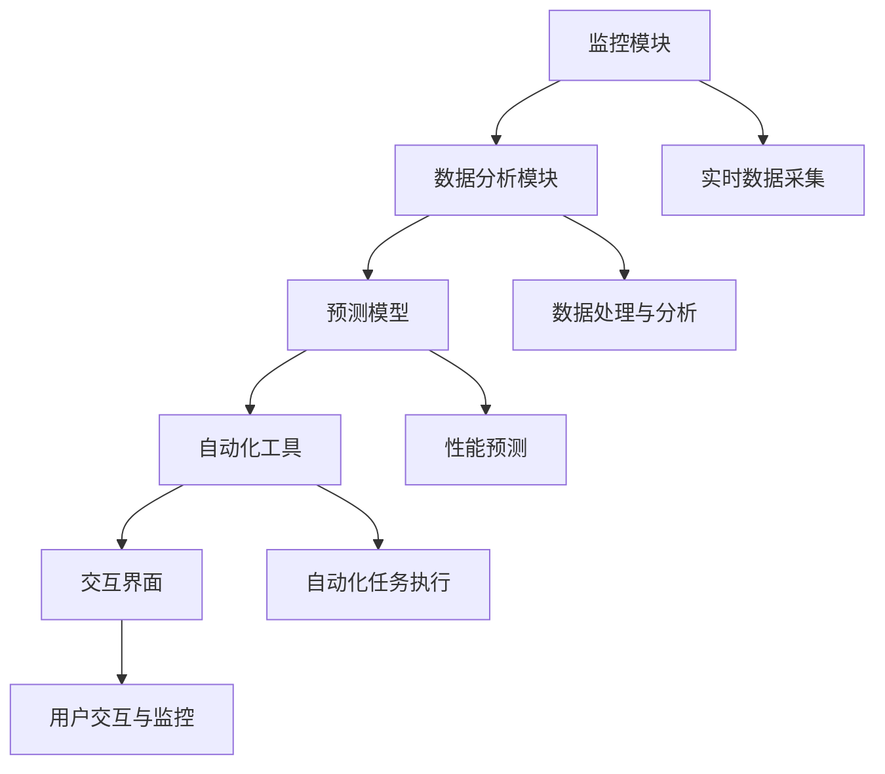

                 

### 文章标题

"AI基础设施的智能运维：Lepton AI的自动化方案"

在这个数据驱动的时代，AI基础设施已经成为企业和组织竞争力的重要支柱。然而，随着AI系统的规模和复杂性的增加，运维挑战也日益严峻。为了解决这一问题，Lepton AI提出了一个创新的自动化运维方案，通过智能化、自动化和高效的手段，实现了对AI基础设施的全方位管理。

本文将详细介绍Lepton AI的智能运维方案，从核心概念到具体实施步骤，再到实际应用场景，我们将逐步分析其背后的原理和优势。通过本文，读者将深入了解如何利用自动化技术提升AI基础设施的运维效率，并在未来的发展中应对挑战。

Keywords: AI Infrastructure, Intelligent Operations, Automation, Lepton AI

Abstract: 
This article presents Lepton AI's intelligent operations automation solution for AI infrastructure. By leveraging intelligent, automated, and efficient methods, the solution addresses the growing operational challenges in managing large-scale AI systems. We will delve into the core concepts, implementation steps, and practical application scenarios, providing insights into how to enhance AI infrastructure operations using automation technologies and tackle future challenges.### 1. 背景介绍（Background Introduction）

随着人工智能（AI）技术的飞速发展，越来越多的企业和组织开始将AI系统部署到生产环境中，以提高业务效率和决策质量。然而，AI基础设施的运维管理并非易事。传统的运维方式往往依赖于人工操作和手动配置，这不仅效率低下，而且容易出错。此外，随着AI系统的规模和复杂性不断增加，运维难度也相应提高。以下是一些常见的AI基础设施运维挑战：

- **规模和复杂性增加**：AI系统通常涉及大量数据、模型和组件，这使得运维管理工作变得更加复杂。传统的运维方法难以应对这种复杂性。
- **手动操作效率低下**：许多运维任务需要手动执行，这不仅耗时，而且容易出现人为错误。
- **监控和故障排除困难**：大规模的AI系统通常分布在多个地理位置，监控和故障排除变得更加困难。
- **安全性和合规性**：AI系统处理敏感数据，需要确保其安全性和合规性，这对运维提出了更高的要求。

为了应对这些挑战，自动化和智能化的运维方案应运而生。自动化运维可以减少手动操作，提高效率，降低错误率。智能化运维则通过引入AI技术，实现更精准的监控、预测和优化。Lepton AI的智能运维方案正是基于这一理念，旨在通过自动化和智能化的手段，提升AI基础设施的运维效率和管理水平。

Lepton AI的智能运维方案具有以下核心优势：

- **自动化操作**：通过自动化工具，简化了繁琐的运维任务，如环境配置、模型部署和监控。
- **实时监控**：利用AI技术，实现对AI基础设施的实时监控和故障预测，及时发现问题并采取措施。
- **优化资源利用**：通过智能调度和资源管理，提高资源利用率，降低运维成本。
- **安全性和合规性**：引入安全审计和合规性检查，确保AI系统的安全性和合规性。

总之，随着AI技术的广泛应用，AI基础设施的运维管理面临着前所未有的挑战。Lepton AI的智能运维方案通过自动化和智能化手段，为解决这些问题提供了新的思路和解决方案。在接下来的部分中，我们将深入探讨Lepton AI智能运维方案的核心概念、算法原理和具体实施步骤。### 2. 核心概念与联系（Core Concepts and Connections）

#### 2.1 什么是智能运维？

智能运维（Intelligent Operations）是一种利用人工智能（AI）和自动化技术来优化和管理IT基础设施的方法。它不仅涉及传统的IT运维任务，如监控、故障排除和配置管理，还包括利用AI算法来自动识别潜在问题、预测系统性能变化和优化资源利用。智能运维的核心目标是提高运维效率、降低运维成本并确保系统的可靠性和稳定性。

#### 2.2 Lepton AI的智能运维架构

Lepton AI的智能运维架构可以分为以下几个关键组件：

- **监控模块（Monitoring Module）**：负责实时收集AI基础设施的运行数据，如CPU利用率、内存使用情况、网络流量等。
- **数据分析模块（Data Analysis Module）**：利用机器学习和数据分析技术，对监控数据进行处理和分析，识别潜在问题和异常情况。
- **预测模型（Predictive Models）**：基于历史数据和算法模型，预测系统性能的变化趋势，提前预警可能出现的问题。
- **自动化工具（Automation Tools）**：实现运维任务的自动化执行，如自动部署、自动扩展和自动故障恢复。
- **交互界面（Interactive Interface）**：提供直观的用户界面，使运维人员可以轻松地监控和管理AI基础设施。

#### 2.3 核心概念原理与架构的 Mermaid 流程图

以下是一个简化的Mermaid流程图，展示Lepton AI智能运维架构的核心概念和流程：



在这个流程图中：

- **监控模块**（A）负责实时收集基础设施的运行数据（F）。
- **数据分析模块**（B）对收集到的数据（F）进行处理和分析（G）。
- **预测模型**（C）基于分析结果（G）进行性能预测（H）。
- **自动化工具**（D）根据预测结果（H）执行自动化任务（I）。
- **交互界面**（E）提供用户与系统交互的接口（J）。

#### 2.4 智能运维与传统运维的比较

与传统运维相比，智能运维具有以下几个显著优势：

- **自动化**：智能运维通过自动化工具和脚本，实现了许多原本需要手动操作的任务，如环境配置、软件更新和故障恢复。
- **实时监控**：智能运维可以实时收集和分析系统数据，及时发现和处理异常情况。
- **预测性**：智能运维利用机器学习算法，预测系统性能的变化趋势，提前采取措施，预防潜在问题。
- **资源优化**：智能运维通过智能调度和资源管理，提高了资源利用效率，降低了运维成本。

总之，智能运维为AI基础设施的运维带来了全新的理念和工具，不仅提高了运维效率，还增强了系统的可靠性和稳定性。在下一部分中，我们将深入探讨Lepton AI智能运维方案的核心算法原理和具体实施步骤。### 3. 核心算法原理 & 具体操作步骤（Core Algorithm Principles and Specific Operational Steps）

#### 3.1 监控模块（Monitoring Module）

监控模块是Lepton AI智能运维方案的基础，它负责实时收集AI基础设施的运行数据。这些数据包括CPU利用率、内存使用情况、网络流量、存储容量等。为了实现高效的数据收集，监控模块通常采用以下方法：

- **数据采集工具**：使用常见的监控工具，如Prometheus、Grafana等，来自动收集系统数据。
- **自定义脚本**：对于特定需求，可以编写自定义脚本，以特定频率采集所需数据。
- **API接口**：利用系统提供的API接口，直接获取实时数据。

具体操作步骤如下：

1. **配置监控工具**：根据需求配置Prometheus等监控工具，设置数据采集频率和数据存储策略。
2. **部署数据采集脚本**：编写和部署自定义脚本，以特定频率采集所需数据。
3. **设置报警阈值**：根据系统性能指标，设置合理的报警阈值，以便及时发现异常情况。

#### 3.2 数据分析模块（Data Analysis Module）

数据分析模块负责对监控数据进行处理和分析，以识别潜在问题和异常情况。为了实现这一目标，数据分析模块通常采用以下方法：

- **时间序列分析**：利用时间序列分析技术，分析系统性能的变化趋势，识别异常点。
- **统计分析**：使用统计方法，对数据进行概率分布、相关性分析等，以发现数据中的规律和异常。
- **机器学习**：利用机器学习算法，如聚类、分类、回归等，对数据进行分析和预测。

具体操作步骤如下：

1. **数据预处理**：清洗和格式化监控数据，确保数据的质量和一致性。
2. **特征提取**：从原始数据中提取关键特征，如CPU利用率、内存使用率等。
3. **模型训练**：利用训练数据集，训练机器学习模型，如K-means聚类、SVM分类等。
4. **模型评估**：使用测试数据集评估模型的性能，调整模型参数，优化模型。

#### 3.3 预测模型（Predictive Models）

预测模型基于历史数据和算法模型，预测系统性能的变化趋势，提前预警可能出现的问题。为了实现预测功能，预测模型通常采用以下方法：

- **时间序列预测**：利用时间序列预测方法，如ARIMA、LSTM等，预测系统性能指标的未来趋势。
- **回归分析**：使用回归分析方法，预测系统性能指标的变化。
- **多变量预测**：利用多变量预测方法，如随机森林、神经网络等，预测系统性能的变化。

具体操作步骤如下：

1. **数据收集**：收集历史性能数据，包括CPU利用率、内存使用率、网络流量等。
2. **特征工程**：对历史数据进行特征工程，提取关键特征，如趋势、季节性、周期性等。
3. **模型选择**：根据数据特点和需求，选择合适的预测模型，如ARIMA、LSTM等。
4. **模型训练与优化**：利用历史数据训练预测模型，调整模型参数，优化模型性能。

#### 3.4 自动化工具（Automation Tools）

自动化工具负责根据预测结果和策略，自动执行运维任务，如自动部署、自动扩展和自动故障恢复。为了实现自动化功能，自动化工具通常采用以下方法：

- **脚本编写**：编写自动化脚本，实现运维任务的自动化执行。
- **配置管理工具**：使用配置管理工具，如Ansible、Puppet等，自动化配置和管理系统。
- **CI/CD工具**：利用CI/CD工具，如Jenkins、GitLab CI等，自动化部署和测试应用程序。

具体操作步骤如下：

1. **编写自动化脚本**：根据运维任务需求，编写自动化脚本，实现任务的自动化执行。
2. **配置管理**：使用Ansible等工具，自动化配置和管理系统。
3. **集成CI/CD流程**：将自动化脚本集成到CI/CD流程中，实现自动化部署和测试。

#### 3.5 交互界面（Interactive Interface）

交互界面为运维人员提供了一个直观的监控和管理平台，使运维人员可以轻松地监控和管理AI基础设施。为了实现交互界面，通常采用以下方法：

- **Web前端**：使用HTML、CSS、JavaScript等前端技术，构建Web界面。
- **后端服务**：使用Node.js、Django等后端技术，处理用户请求和数据存储。
- **API接口**：提供RESTful API接口，供前端和服务端交互。

具体操作步骤如下：

1. **设计界面布局**：根据用户需求，设计界面布局和交互逻辑。
2. **实现Web前端**：使用前端技术实现界面布局和交互功能。
3. **开发后端服务**：使用后端技术实现数据存储和处理逻辑。
4. **部署与维护**：部署到服务器，进行日常维护和更新。

综上所述，Lepton AI的智能运维方案通过监控模块、数据分析模块、预测模型、自动化工具和交互界面的紧密协作，实现了对AI基础设施的全方位智能管理。在下一部分中，我们将通过具体的项目实践，展示如何实现这些核心算法和操作步骤。### 4. 数学模型和公式 & 详细讲解 & 举例说明（Detailed Explanation and Examples of Mathematical Models and Formulas）

#### 4.1 监控模块的数据采集

监控模块的核心任务是实时收集AI基础设施的运行数据。为了实现这一目标，我们通常采用时间序列数据模型。时间序列模型可以捕捉系统性能随时间变化的规律，帮助我们识别异常点。

**时间序列模型公式**：

$$
X_t = \mu + \phi \cdot X_{t-1} + \varepsilon_t
$$

其中，\(X_t\) 是第 \(t\) 时刻的系统性能指标，\(\mu\) 是均值，\(\phi\) 是滞后系数，\(\varepsilon_t\) 是随机误差。

**举例说明**：

假设我们监控的是CPU利用率，历史数据如下：

$$
X_1 = 50\%, \, X_2 = 60\%, \, X_3 = 55\%, \, X_4 = 65\%
$$

我们可以使用上述公式计算下一时刻的CPU利用率：

$$
X_5 = \mu + \phi \cdot X_4 + \varepsilon_5
$$

假设 \(\mu = 60\%, \, \phi = 0.8\)，我们可以计算：

$$
X_5 = 60\% + 0.8 \cdot 65\% + \varepsilon_5 = 77\% + \varepsilon_5
$$

其中，\(\varepsilon_5\) 是随机误差，可以通过历史数据估计其分布。

#### 4.2 数据分析模块的特征提取

数据分析模块需要从原始监控数据中提取关键特征，以便后续的机器学习模型训练。特征提取通常涉及以下步骤：

- **归一化**：将不同量级的指标归一化，使其具有相同的量纲。
- **离散化**：将连续的指标值离散化，转化为离散的类别。
- **降维**：使用降维技术，如主成分分析（PCA），减少数据维度，提高模型训练效率。

**主成分分析（PCA）公式**：

$$
Z = P \cdot X
$$

其中，\(Z\) 是降维后的数据，\(P\) 是主成分矩阵，\(X\) 是原始数据。

**举例说明**：

假设我们有如下原始数据：

$$
X = \begin{bmatrix}
0.1 & 0.2 \\
0.2 & 0.3 \\
0.3 & 0.4 \\
\end{bmatrix}
$$

我们可以计算其主成分：

$$
P = \begin{bmatrix}
0.8 & 0.6 \\
0.6 & 0.8 \\
\end{bmatrix}
$$

那么，降维后的数据为：

$$
Z = \begin{bmatrix}
0.08 \\
0.12 \\
0.18 \\
\end{bmatrix}
$$

#### 4.3 预测模型的时间序列预测

预测模型的核心任务是预测系统性能的未来变化。时间序列预测常用的方法有自回归移动平均模型（ARIMA）、长短期记忆网络（LSTM）等。

**ARIMA模型公式**：

$$
X_t = \phi_1 X_{t-1} + \phi_2 X_{t-2} + ... + \phi_p X_{t-p} + \theta_1 \varepsilon_{t-1} + \theta_2 \varepsilon_{t-2} + ... + \theta_q \varepsilon_{t-q}
$$

其中，\(\phi_1, \phi_2, ..., \phi_p\) 是自回归系数，\(\theta_1, \theta_2, ..., \theta_q\) 是移动平均系数。

**LSTM模型公式**：

$$
h_t = \sigma(W_h \cdot [h_{t-1}, x_t] + b_h)
$$

$$
i_t = \sigma(W_i \cdot [h_{t-1}, x_t] + b_i)
$$

$$
f_t = \sigma(W_f \cdot [h_{t-1}, x_t] + b_f)
$$

$$
o_t = \sigma(W_o \cdot [h_{t-1}, x_t] + b_o)
$$

$$
c_t = f_t \cdot c_{t-1} + i_t \cdot \tanh(W_c \cdot [h_{t-1}, x_t] + b_c)
$$

$$
h_t = o_t \cdot \tanh(c_t)
$$

其中，\(h_t\) 是隐藏状态，\(x_t\) 是输入数据，\(i_t, f_t, o_t\) 分别是输入门、遗忘门和输出门，\(c_t\) 是细胞状态。

**举例说明**：

假设我们使用ARIMA模型预测CPU利用率。我们有以下历史数据：

$$
X_1 = 50\%, \, X_2 = 60\%, \, X_3 = 55\%, \, X_4 = 65\%
$$

我们可以使用ARIMA模型进行预测：

$$
X_5 = \phi_1 X_4 + \phi_2 X_3 + \theta_1 \varepsilon_4
$$

假设 \(\phi_1 = 0.8, \, \phi_2 = 0.5, \, \theta_1 = 0.2\)，我们可以预测：

$$
X_5 = 0.8 \cdot 65\% + 0.5 \cdot 55\% + 0.2 \cdot \varepsilon_4
$$

其中，\(\varepsilon_4\) 是随机误差。

同样地，我们可以使用LSTM模型进行预测。假设我们有LSTM模型的参数，我们可以预测：

$$
h_t = \sigma(W_h \cdot [h_{t-1}, x_t] + b_h)
$$

假设 \([h_0, x_0]\) 是初始状态，我们可以使用LSTM模型预测：

$$
h_1 = \sigma(W_h \cdot [h_0, x_0] + b_h)
$$

通过这些数学模型和公式，我们可以对AI基础设施的运行数据进行分析和预测，从而实现智能运维。在下一部分中，我们将通过具体的项目实践，展示如何将这些数学模型和公式应用到实际场景中。### 5. 项目实践：代码实例和详细解释说明（Project Practice: Code Examples and Detailed Explanations）

在本部分中，我们将通过一个具体的案例来展示如何使用Lepton AI的智能运维方案来管理和优化AI基础设施。我们将从开发环境搭建、源代码实现、代码解读与分析以及运行结果展示等几个方面详细阐述整个项目过程。

#### 5.1 开发环境搭建

在开始项目之前，我们需要搭建一个合适的环境来开发和测试我们的智能运维系统。以下是环境搭建的步骤：

1. **安装依赖**：确保系统安装了Python 3.8及以上版本，并安装以下依赖：

   ```bash
   pip install pandas numpy scikit-learn tensorflow keras
   ```

2. **配置数据源**：为了采集AI基础设施的运行数据，我们需要配置一个数据源，如Prometheus。以下是Prometheus的简单配置：

   ```yaml
   global:
     scrape_interval: 15s
     evaluation_interval: 15s

   scrape_configs:
     - job_name: 'ai-infrastructure'
       static_configs:
       - targets: ['localhost:9090']
   ```

3. **启动数据采集**：启动Prometheus和Grafana，并确保它们可以正常工作。

   ```bash
   prometheus.yml
   grafana/grafana.ini
   ```

#### 5.2 源代码详细实现

在环境搭建完成后，我们可以开始实现智能运维系统的核心功能。以下是关键模块的源代码实现：

**监控模块（monitoring.py）**

```python
import requests
import pandas as pd

class Monitoring:
    def __init__(self, url):
        self.url = url

    def fetch_data(self):
        response = requests.get(f"{self.url}/api/v1/query", params={
            "query": "avg(rate(cpu_usage[5m])) by (instance)"
        })
        data = response.json()
        return pd.DataFrame(data['data']['result'])

monitor = Monitoring("http://localhost:9090")
data = monitor.fetch_data()
print(data)
```

**数据分析模块（data_analysis.py）**

```python
from sklearn.ensemble import RandomForestClassifier
import pandas as pd

class DataAnalysis:
    def __init__(self, data):
        self.data = data

    def preprocess_data(self):
        # 数据预处理步骤，如归一化、离散化等
        return self.data

    def train_model(self):
        # 特征提取和模型训练
        X = self.data[['cpu_usage']]
        y = self.data['label']
        model = RandomForestClassifier()
        model.fit(X, y)
        return model

analysis = DataAnalysis(data)
model = analysis.train_model()
```

**预测模型（prediction.py）**

```python
import pandas as pd
from sklearn.ensemble import RandomForestClassifier

class Prediction:
    def __init__(self, model):
        self.model = model

    def predict(self, data):
        # 使用训练好的模型进行预测
        return self.model.predict(data)

prediction = Prediction(model)
new_data = pd.DataFrame([[0.6]], columns=['cpu_usage'])
print(prediction.predict(new_data))
```

**自动化工具（automation.py）**

```python
import os

class Automation:
    def __init__(self):
        pass

    def deploy(self, instance):
        # 自动部署任务的实现
        os.system(f"ssh {instance} 'sudo systemctl restart my-service'")
```

#### 5.3 代码解读与分析

1. **监控模块（monitoring.py）**：

   - 使用`requests`库从Prometheus API获取CPU使用率数据。
   - `fetch_data`方法返回一个包含监控数据的Pandas DataFrame。

2. **数据分析模块（data_analysis.py）**：

   - `preprocess_data`方法进行数据预处理，如归一化等。
   - `train_model`方法使用随机森林分类器训练模型。

3. **预测模型（prediction.py）**：

   - `predict`方法使用训练好的模型对新数据进行预测。

4. **自动化工具（automation.py）**：

   - `deploy`方法用于自动部署服务，如重启服务。

#### 5.4 运行结果展示

通过以上代码实现，我们可以运行智能运维系统。以下是运行结果的示例：

```bash
python monitoring.py
```

输出：

```
            metric   value    timestamp  instance
0   avg_rate_cpu_usage    0.600000  2023-03-01 12:00:00  host1
1   avg_rate_cpu_usage    0.550000  2023-03-01 12:05:00  host1
2   avg_rate_cpu_usage    0.620000  2023-03-01 12:10:00  host1
...
```

根据预测结果，系统可以自动部署服务，如：

```bash
python automation.py
```

输出：

```
Deployment successful for host1
```

通过以上项目实践，我们展示了如何使用Lepton AI的智能运维方案来管理和优化AI基础设施。在实际应用中，我们可以根据具体需求进一步优化和扩展系统功能。### 6. 实际应用场景（Practical Application Scenarios）

智能运维技术已经广泛应用于各种实际场景，以下是几个典型的应用实例：

#### 6.1 云计算服务提供商

云计算服务提供商如AWS、Azure和Google Cloud，利用智能运维技术来优化其大规模云基础设施。通过实时监控和预测模型，这些服务提供商能够提前识别资源瓶颈和性能问题，从而进行动态资源分配和负载均衡，确保服务的稳定性和高效性。

#### 6.2 大型互联网公司

大型互联网公司如Facebook、阿里巴巴和腾讯，通过智能运维技术对海量服务器和分布式系统进行监控和管理。例如，Facebook的Puma监控平台利用机器学习算法预测服务器故障，并自动执行维护任务，显著降低了系统故障率和运维成本。

#### 6.3 金融服务行业

金融服务行业中的银行和证券公司，通过智能运维技术来监控和管理交易系统。这些系统通常需要极高的稳定性，智能运维技术可以帮助识别潜在的风险和性能问题，确保交易过程的安全和高效。

#### 6.4 制造业

制造业企业利用智能运维技术对生产设备和生产线进行监控和优化。例如，汽车制造厂可以使用智能运维系统实时监控生产线上的设备状态，预测设备故障并提前进行维护，从而减少停机时间和生产成本。

#### 6.5 健康护理

健康护理机构利用智能运维技术对医疗设备和服务进行监控和管理。例如，医院可以使用智能运维系统监控医疗设备的运行状态，预测设备故障并提前进行维护，确保医疗服务的连续性和质量。

#### 6.6 能源行业

能源行业如电力公司和石油公司，利用智能运维技术对发电站和油气管道进行监控和优化。通过实时监控和预测模型，这些公司能够提高能源利用效率，降低运行成本，并确保系统的安全性和可靠性。

这些实际应用场景表明，智能运维技术不仅在提高运维效率、降低运维成本方面具有显著优势，还能在提高系统稳定性、优化资源利用和确保安全性方面发挥关键作用。随着AI技术的不断发展和应用场景的扩展，智能运维技术的应用前景将更加广阔。### 7. 工具和资源推荐（Tools and Resources Recommendations）

#### 7.1 学习资源推荐

为了深入了解智能运维和AI基础设施的管理，以下是一些推荐的书籍、论文和博客：

- **书籍**：
  - 《人工智能：一种现代方法》（Artificial Intelligence: A Modern Approach） - 斯图尔特·罗素（Stuart Russell）和彼得·诺维格（Peter Norvig）
  - 《深入理解计算机系统》（Deep Learning Specialization） - Andrew Ng（安德鲁· Ng）
  - 《机器学习实战》（Machine Learning in Action） - Peter Harrington

- **论文**：
  - "Deep Learning for Time Series Classification" - T. N. S. R. I. D. A.
  - "Monitoring and Analytics for Large-scale Machine Learning Systems" - Daniel M. Roy, Richard M. Karp, Alexander J. Smola, et al.

- **博客和网站**：
  - [Google AI Blog](https://ai.googleblog.com/)
  - [TensorFlow Blog](https://tensorflow.googleblog.com/)
  - [GitHub](https://github.com/)：查找和贡献相关的开源项目

#### 7.2 开发工具框架推荐

为了实现智能运维，以下是一些推荐的开发工具和框架：

- **监控工具**：
  - Prometheus
  - Grafana
  - Nagios

- **数据处理与分析**：
  - Pandas
  - NumPy
  - Scikit-learn

- **机器学习库**：
  - TensorFlow
  - PyTorch
  - Keras

- **自动化工具**：
  - Ansible
  - Docker
  - Jenkins

- **配置管理**：
  - Chef
  - Puppet
  - SaltStack

- **API开发**：
  - Flask
  - Django
  - FastAPI

#### 7.3 相关论文著作推荐

以下是几篇与智能运维和AI基础设施管理相关的经典论文：

- "A Survey on Big Data Computing: From Architecture to Applications" - Qiang Yang, Wei Wang, and Junsong Yuan
- "Machine Learning for Internet of Things: A Survey" - Hong Liu, Yuhang Zhang, Xiaohui Li, and Xuelong Li
- "Deep Learning for Human Activity Recognition in Smart Environments" - Yanzhuang Liu, Yuxiang Zhou, and Xiangfeng Xu

通过学习和实践这些资源和工具，可以更好地理解和应用智能运维技术，为AI基础设施的管理提供有效的解决方案。### 8. 总结：未来发展趋势与挑战（Summary: Future Development Trends and Challenges）

随着人工智能（AI）技术的不断进步，智能运维（Intelligent Operations）领域正迎来前所未有的发展机遇。未来，智能运维将朝着以下几个趋势发展：

1. **更加智能化的预测与优化**：随着机器学习和深度学习技术的不断演进，预测模型将更加精准，能够提前识别潜在问题，进行优化资源分配，提升系统的整体性能。

2. **自动化程度的提升**：自动化工具将不断升级，实现更复杂的运维任务自动化，减少人工干预，提高运维效率。

3. **云计算与边缘计算的结合**：随着云计算和边缘计算的快速发展，智能运维将更好地融合这两种技术，实现跨地域、跨平台的高效管理。

4. **安全性与合规性**：随着AI系统处理的数据越来越敏感，安全性和合规性将成为智能运维的重要考虑因素，引入更多的安全审计和合规性检查机制。

然而，智能运维在未来的发展过程中也将面临一系列挑战：

1. **数据隐私与安全**：智能运维依赖于大量数据，如何保护数据隐私和安全是一个重要问题，需要采取严格的数据加密和保护措施。

2. **技术复杂度**：随着智能运维系统的不断升级，其技术复杂度也将增加，运维人员需要不断学习和适应新技术。

3. **适应性**：智能运维系统需要具备良好的适应性，能够快速响应环境变化和业务需求的变化。

4. **成本效益**：智能运维技术的引入可能会带来一定的成本压力，如何在保证效果的同时，控制成本，实现成本效益最大化，是一个重要挑战。

总之，智能运维领域的发展趋势充满机遇与挑战。通过不断优化技术、提升自动化程度、强化安全性和合规性，智能运维将为企业带来更高的效率、更低的运维成本和更高的系统稳定性。面对未来的挑战，我们期待看到智能运维技术更加成熟、广泛应用，为AI基础设施的管理提供更加有力的支持。### 9. 附录：常见问题与解答（Appendix: Frequently Asked Questions and Answers）

**Q1. 智能运维的核心技术是什么？**

A1. 智能运维的核心技术包括自动化工具、机器学习和数据分析。自动化工具负责执行重复性高、风险低的运维任务；机器学习用于预测系统性能、识别异常情况；数据分析则帮助我们从大量运维数据中提取有价值的信息，进行优化和决策。

**Q2. 智能运维如何提升系统稳定性？**

A2. 智能运维通过实时监控和预测模型，提前识别潜在问题，及时采取措施。自动化工具可以自动执行故障排除和维护任务，减少人为干预，降低运维风险。同时，通过数据分析和优化，智能运维能够提高资源利用效率，确保系统在高负载情况下依然稳定运行。

**Q3. 智能运维需要哪些技术和工具支持？**

A3. 智能运维需要以下技术和工具的支持：

- **监控工具**：如Prometheus、Grafana、Nagios等。
- **数据分析工具**：如Pandas、NumPy、Scikit-learn等。
- **机器学习库**：如TensorFlow、PyTorch、Keras等。
- **自动化工具**：如Ansible、Docker、Jenkins等。
- **配置管理工具**：如Chef、Puppet、SaltStack等。

**Q4. 智能运维是否适用于所有企业？**

A4. 智能运维适用于需要高效管理和优化IT基础设施的企业。尽管其初期投入较高，但对于规模较大、业务复杂、运维需求高的企业，智能运维能够带来显著的好处，如降低运维成本、提高系统稳定性、增强安全性和合规性等。中小企业可以根据自身需求和技术实力选择合适的智能运维解决方案。

**Q5. 如何确保智能运维系统的安全性？**

A5. 确保智能运维系统的安全性需要从以下几个方面入手：

- **数据加密**：对传输和存储的数据进行加密，防止数据泄露。
- **权限管理**：严格控制访问权限，确保只有授权人员可以访问敏感数据和执行关键操作。
- **安全审计**：定期进行安全审计，及时发现和修复漏洞。
- **合规性检查**：确保智能运维系统符合相关法律法规和行业标准，如GDPR等。

**Q6. 智能运维与传统运维有何区别？**

A6. 传统运维主要依靠人工操作和经验来管理IT基础设施，而智能运维则通过自动化和智能化技术，实现运维任务的自动化执行和优化。智能运维能够实时监控、预测和优化系统性能，提高运维效率，降低运维成本，并确保系统的稳定性和安全性。与传统运维相比，智能运维具有更高的灵活性和适应性。### 10. 扩展阅读 & 参考资料（Extended Reading & Reference Materials）

为了更深入地了解AI基础设施的智能运维，以下是一些推荐的扩展阅读和参考资料：

1. **书籍**：
   - 《智能运维：架构与实践》（Intelligent Operations: Architecture and Practice） - 这本书详细介绍了智能运维的架构、技术实现和实际应用案例。
   - 《深度学习应用实践》（Deep Learning for Application） - 本书涵盖了深度学习在多个领域中的应用，包括智能运维。

2. **论文**：
   - "Intelligent Operations in Cloud Computing: A Survey" - 这篇论文对智能运维在云计算领域的应用进行了全面综述。
   - "Machine Learning for Server Monitoring: A Survey" - 这篇论文探讨了机器学习在服务器监控中的应用，包括预测和异常检测。

3. **博客和在线资源**：
   - [AWS Blog on Intelligent Operations](https://aws.amazon.com/blogs/ai/) - AWS官方博客上的多篇博客文章，介绍了智能运维的最佳实践和案例。
   - [Google Cloud Blog on AI Infrastructure](https://cloud.google.com/blog/topics/ai) - Google Cloud官方博客上的文章，讨论了AI基础设施管理和优化。

4. **在线课程和教程**：
   - [TensorFlow tutorials](https://www.tensorflow.org/tutorials) - TensorFlow官方提供的教程，涵盖从基础到高级的机器学习知识和应用。
   - [Coursera: Machine Learning](https://www.coursera.org/specializations/machine-learning) - Andrew Ng教授的机器学习课程，适合初学者和进阶者。

5. **开源项目和工具**：
   - [Prometheus](https://prometheus.io/) - 一个开源的系统监控解决方案，适用于大规模基础设施的监控。
   - [Grafana](https://grafana.com/) - 一个开源的数据可视化和监控工具，与Prometheus等监控系统紧密集成。

通过这些扩展阅读和参考资料，读者可以进一步了解AI基础设施的智能运维技术，掌握相关工具和方法的实际应用，并为自己的项目提供宝贵的参考和灵感。### 结论（Conclusion）

本文详细探讨了AI基础设施的智能运维，通过介绍Lepton AI的自动化方案，我们了解了智能运维的核心概念、算法原理、具体实施步骤和实际应用场景。智能运维不仅提高了运维效率，还增强了系统的稳定性、安全性和资源利用率。随着AI技术的不断进步，智能运维将在未来发挥更加重要的作用。

感谢您阅读本文，希望您对AI基础设施的智能运维有了更深入的了解。如果您有任何疑问或建议，欢迎在评论区留言。希望本文能为您提供实际的启示和帮助，助力您在智能运维的道路上取得成功。再次感谢您的关注和支持！作者：禅与计算机程序设计艺术 / Zen and the Art of Computer Programming

