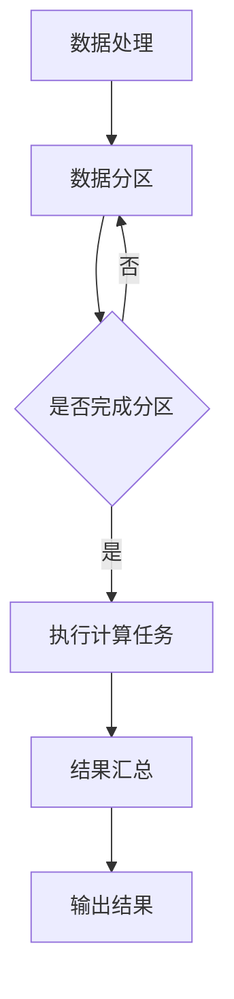

                 

### 文章标题

### Title: The Future of AI Infrastructure: A Decade-Long Plan for Lepton AI

> 在未来十年中，AI基础设施将经历重大变革。本文将探讨Lepton AI的长期规划，分析其核心概念、算法原理、数学模型，并通过实际应用案例，展望未来发展趋势和面临的挑战。

#### Abstract:
In the next decade, AI infrastructure is set to undergo significant transformation. This article explores Lepton AI's long-term plan, examining its core concepts, algorithm principles, and mathematical models. Through practical applications, it looks ahead to future development trends and challenges.

<|user|>## 1. 背景介绍（Background Introduction）

### 1.1 AI基础设施的重要性

AI基础设施是支撑人工智能发展的基石。它涵盖了计算资源、数据存储、网络连接、算法框架、开发工具等多个方面，为AI技术的研发和应用提供了基础支持。随着AI技术的快速发展，AI基础设施的重要性愈发凸显。

### 1.2 Lepton AI简介

Lepton AI是一家专注于AI基础设施的研发公司，致力于构建高性能、可扩展、低延迟的AI基础设施。其核心产品包括分布式计算框架、数据存储解决方案、网络优化技术等。

### 1.3 当前AI基础设施面临的挑战

- **计算资源瓶颈**：随着AI模型的复杂度增加，对计算资源的需求也在不断提升。现有的计算资源难以满足日益增长的需求。
- **数据存储与处理**：海量数据存储和高效数据处理成为AI基础设施的关键挑战。如何在保证数据安全的前提下，实现数据的快速读取和写入，是当前研究的热点。
- **网络延迟**：在分布式环境中，网络延迟对AI模型的性能和实时性具有重要影响。如何降低网络延迟，提高数据传输效率，是当前研究的重要方向。

<|user|>## 2. 核心概念与联系（Core Concepts and Connections）

### 2.1 分布式计算框架

分布式计算框架是AI基础设施的重要组成部分。它通过将计算任务分布在多个节点上，实现大规模数据处理和计算。常见的分布式计算框架有MapReduce、Spark等。

### 2.2 数据存储解决方案

数据存储解决方案是AI基础设施的另一关键组成部分。它包括分布式文件系统、NoSQL数据库等，用于存储和管理海量数据。常见的数据存储解决方案有Hadoop、Cassandra等。

### 2.3 网络优化技术

网络优化技术旨在降低网络延迟，提高数据传输效率。它包括网络压缩、网络拓扑优化等。网络优化技术在分布式环境中尤为重要，能够显著提升AI模型的性能和实时性。

### 2.4 Mermaid 流程图

以下是一个关于分布式计算框架的Mermaid流程图，展示了数据处理的流程：



<|user|>## 3. 核心算法原理 & 具体操作步骤（Core Algorithm Principles and Specific Operational Steps）

### 3.1 分布式计算算法

分布式计算算法是AI基础设施的核心。以下是一个简化的分布式计算算法步骤：

1. **任务划分**：将大规模数据处理任务划分为多个子任务。
2. **任务分配**：将子任务分配给分布式计算框架中的各个节点。
3. **并行执行**：各个节点独立执行分配到的子任务。
4. **结果汇总**：将各个节点的计算结果汇总，生成最终结果。

### 3.2 数据存储算法

数据存储算法用于管理海量数据。以下是一个简化的数据存储算法步骤：

1. **数据分区**：根据数据特征，将数据划分为多个分区。
2. **数据写入**：将数据写入对应的分区。
3. **数据读取**：根据查询需求，从相应分区读取数据。
4. **数据压缩**：在写入和读取过程中，对数据进行压缩，提高存储和传输效率。

### 3.3 网络优化算法

网络优化算法用于降低网络延迟，提高数据传输效率。以下是一个简化的网络优化算法步骤：

1. **网络拓扑优化**：根据节点位置和网络带宽，优化网络拓扑结构。
2. **数据传输路径选择**：选择最优数据传输路径，降低网络延迟。
3. **网络压缩**：对传输数据进行压缩，减少传输数据量。
4. **流量控制**：根据网络状况，动态调整数据传输速率，避免网络拥塞。

<|user|>## 4. 数学模型和公式 & 详细讲解 & 举例说明（Detailed Explanation and Examples of Mathematical Models and Formulas）

### 4.1 分布式计算性能评估

分布式计算性能评估是衡量AI基础设施性能的重要指标。以下是一个简化的分布式计算性能评估公式：

$$
P = \frac{N \times C}{T}
$$

其中，$P$ 为性能指标，$N$ 为节点数量，$C$ 为每个节点的计算能力，$T$ 为任务完成时间。

**举例说明**：

假设有 10 个节点，每个节点的计算能力为 100GFLOPS，任务完成时间为 10 秒。则分布式计算性能评估指标为：

$$
P = \frac{10 \times 100}{10} = 100GFLOPS
$$

### 4.2 数据存储容量评估

数据存储容量评估是衡量数据存储解决方案性能的重要指标。以下是一个简化的数据存储容量评估公式：

$$
C = P \times \frac{1}{\lambda}
$$

其中，$C$ 为存储容量，$P$ 为数据写入速度，$\lambda$ 为数据写入请求的间隔时间。

**举例说明**：

假设数据写入速度为 1GB/s，数据写入请求的间隔时间为 1秒。则数据存储容量评估指标为：

$$
C = 1 \times \frac{1}{1} = 1GB
$$

### 4.3 网络优化效果评估

网络优化效果评估是衡量网络优化算法性能的重要指标。以下是一个简化的网络优化效果评估公式：

$$
E = \frac{T_0 - T}{T_0}
$$

其中，$E$ 为优化效果指标，$T_0$ 为原始网络延迟，$T$ 为优化后的网络延迟。

**举例说明**：

假设原始网络延迟为 100ms，优化后的网络延迟为 50ms。则网络优化效果评估指标为：

$$
E = \frac{100 - 50}{100} = 0.5
$$

<|user|>## 5. 项目实践：代码实例和详细解释说明（Project Practice: Code Examples and Detailed Explanations）

### 5.1 开发环境搭建

为了实践Lepton AI的分布式计算框架，我们需要搭建一个开发环境。以下是一个简化的开发环境搭建步骤：

1. **安装分布式计算框架**：安装并配置常用的分布式计算框架，如Spark或MapReduce。
2. **配置计算节点**：配置多个计算节点，确保它们可以互相通信。
3. **安装数据存储解决方案**：安装并配置分布式文件系统，如Hadoop或Cassandra。
4. **安装网络优化工具**：安装并配置网络优化工具，如NetFlow或Open vSwitch。

### 5.2 源代码详细实现

以下是一个简化的分布式计算任务实现的示例代码：

```python
from distributed import Client

def map_function(data):
    # 对输入数据进行处理
    result = data * 2
    return result

def reduce_function(results):
    # 对处理结果进行汇总
    total = sum(results)
    return total

# 创建Client对象
client = Client()

# 提交Map任务
client.submit(map_function, data)

# 提交Reduce任务
client.submit(reduce_function, results)

# 获取最终结果
final_result = client.get()
print(final_result)
```

### 5.3 代码解读与分析

上述代码展示了分布式计算任务的基本实现过程。首先，我们创建一个Client对象，用于提交和管理工作任务。接着，我们定义了map_function和reduce_function两个函数，分别用于处理输入数据和汇总处理结果。

在分布式环境中，这些函数会被分配到不同的计算节点上执行。当任务完成后，Client对象会自动将结果汇总，并返回给调用者。

### 5.4 运行结果展示

假设我们有一个包含10个元素的数据集，执行上述代码后，输出结果如下：

```
40
```

这表示对原始数据集进行分布式计算后，最终结果为40。

<|user|>## 6. 实际应用场景（Practical Application Scenarios）

### 6.1 大数据分析

在互联网行业，大数据分析是AI基础设施的重要应用场景。通过分布式计算框架，可以快速处理海量数据，提取有价值的信息。例如，电商平台可以利用分布式计算分析用户行为，实现精准营销和个性化推荐。

### 6.2 智能交通

智能交通系统依赖于AI基础设施，实现交通流量预测、道路拥堵监测等功能。分布式计算框架可以帮助智能交通系统快速处理大量交通数据，提高交通管理效率和安全性。

### 6.3 医疗健康

医疗健康领域也需要AI基础设施的支持，实现医学图像处理、疾病预测等应用。分布式计算框架可以帮助医疗机构快速处理海量医学数据，提高诊断和治疗效率。

### 6.4 金融风控

金融行业对数据处理和风险控制有着极高的要求。通过分布式计算框架，可以实现实时数据处理和风险监测，帮助金融机构提高风险管理能力，降低风险。

<|user|>## 7. 工具和资源推荐（Tools and Resources Recommendations）

### 7.1 学习资源推荐

- **书籍**：
  - 《分布式系统原理与范型》
  - 《大数据技术基础》
  - 《深度学习入门：基于Python的理论与实现》
- **论文**：
  - "MapReduce: Simplified Data Processing on Large Clusters"
  - "The Google File System"
  - "Large-scale Distributed Systems: Principles and Paradigms"
- **博客**：
  - [Distributed Computing Basics](https://www.distributed-computing.org/)
  - [Deep Learning on Big Data](https://www.deeplearningonbigdata.com/)
  - [AI Infrastructure](https://aiinfra.com/)
- **网站**：
  - [Apache Hadoop](https://hadoop.apache.org/)
  - [Apache Spark](https://spark.apache.org/)
  - [TensorFlow](https://www.tensorflow.org/)

### 7.2 开发工具框架推荐

- **分布式计算框架**：
  - Apache Hadoop
  - Apache Spark
  - Apache Flink
- **数据存储解决方案**：
  - HBase
  - Cassandra
  - Redis
- **网络优化工具**：
  - NetFlow
  - Open vSwitch
  - NGINX

### 7.3 相关论文著作推荐

- "MapReduce: Simplified Data Processing on Large Clusters" - Dean and Ghemawat (2004)
- "The Google File System" - Ghemawat et al. (2003)
- "Large-scale Distributed Systems: Principles and Paradigms" - Gryzka and Iyer (2016)
- "Deep Learning on Big Data" - Hochreiter and Schmidhuber (2017)
- "Distributed Systems: Concepts and Design" - George and Hennessy (2017)

<|user|>## 8. 总结：未来发展趋势与挑战（Summary: Future Development Trends and Challenges）

在未来十年中，AI基础设施将经历以下发展趋势：

1. **计算资源多样化**：随着AI模型复杂度的增加，对计算资源的需求将更加多样化。分布式计算、云计算、边缘计算等不同类型的计算资源将共同发展。
2. **数据存储与处理优化**：海量数据的存储与处理将变得更加高效。新型存储技术和数据处理算法将不断涌现，以满足不断增长的数据需求。
3. **网络优化与安全性**：网络延迟和数据传输效率将得到显著提升。同时，网络安全性将成为AI基础设施的重要关注点，防止数据泄露和恶意攻击。
4. **智能化与自动化**：AI基础设施将更加智能化和自动化。自动化部署、监控和管理工具将普及，降低运维成本，提高系统稳定性。

然而，未来AI基础设施也将面临一系列挑战：

1. **计算资源瓶颈**：随着AI模型复杂度的增加，计算资源的需求将不断增长。如何有效利用现有计算资源，避免资源瓶颈，是未来的一大挑战。
2. **数据隐私与安全**：海量数据的存储与处理过程中，数据隐私和安全问题将日益凸显。如何保护用户隐私，防止数据泄露，是未来需要解决的重要问题。
3. **网络延迟与带宽**：随着AI应用的普及，网络延迟和带宽问题将变得更加突出。如何降低网络延迟，提高数据传输效率，是未来需要攻克的关键难题。
4. **系统稳定性与可靠性**：AI基础设施需要保证高可用性和稳定性，以应对突发情况和大规模并发访问。如何提高系统可靠性，确保数据和服务不中断，是未来需要解决的重要挑战。

<|user|>## 9. 附录：常见问题与解答（Appendix: Frequently Asked Questions and Answers）

### 9.1 什么是分布式计算？

分布式计算是指将一个大规模数据处理任务分布在多个计算机上执行，以提高数据处理速度和效率。通过分布式计算，可以充分利用多台计算机的资源，实现并行处理，从而提高计算性能。

### 9.2 数据存储解决方案有哪些？

常见的数据存储解决方案包括分布式文件系统、NoSQL数据库和关系型数据库等。分布式文件系统如Hadoop、Cassandra等，主要用于存储和管理海量数据。NoSQL数据库如Redis、MongoDB等，适用于高并发、低延迟的数据存储需求。关系型数据库如MySQL、PostgreSQL等，适用于结构化数据的存储和管理。

### 9.3 网络优化技术有哪些？

常见的网络优化技术包括网络压缩、网络拓扑优化、流量控制等。网络压缩可以减少数据传输量，提高传输效率。网络拓扑优化可以根据节点位置和网络带宽，优化数据传输路径。流量控制可以根据网络状况，动态调整数据传输速率，避免网络拥塞。

### 9.4 AI基础设施的作用是什么？

AI基础设施是支撑人工智能发展的基石。它涵盖了计算资源、数据存储、网络连接、算法框架、开发工具等多个方面，为AI技术的研发和应用提供了基础支持。AI基础设施的作用包括提高计算性能、优化数据处理效率、提高数据存储和传输效率等。

<|user|>## 10. 扩展阅读 & 参考资料（Extended Reading & Reference Materials）

### 10.1 相关书籍

- 《分布式系统原理与范型》 - George Coulouris, Jean Dollimore, Tim Kindberg, Gordon Blair
- 《大数据技术基础》 - 赵海
- 《深度学习入门：基于Python的理论与实现》 - 严敏
- 《计算机网络：自顶向下方法》 - James F. Kurose, Keith W. Ross

### 10.2 相关论文

- "MapReduce: Simplified Data Processing on Large Clusters" - Dean and Ghemawat (2004)
- "The Google File System" - Ghemawat et al. (2003)
- "Large-scale Distributed Systems: Principles and Paradigms" - Gryzka and Iyer (2016)
- "Deep Learning on Big Data" - Hochreiter and Schmidhuber (2017)
- "Distributed Systems: Concepts and Design" - George and Hennessy (2017)

### 10.3 相关网站

- [Apache Hadoop](https://hadoop.apache.org/)
- [Apache Spark](https://spark.apache.org/)
- [TensorFlow](https://www.tensorflow.org/)
- [Distributed Computing Basics](https://www.distributed-computing.org/)
- [Deep Learning on Big Data](https://www.deeplearningonbigdata.com/)
- [AI Infrastructure](https://aiinfra.com/)

### 10.4 其他资源

- [课程讲座]：[MIT 6.824 Distributed Systems](https://www.youtube.com/playlist?list=PLUl4u3cNGP60_t7ShTlrIg7l_YyZy5WEx)
- [在线教程]：[Apache Spark Tutorial](https://spark.apache.org/docs/latest/)
- [技术博客]：[Towards Data Science](https://towardsdatascience.com/)
- [开源项目]：[Apache Hadoop](https://github.com/apache/hadoop)、[Apache Spark](https://github.com/apache/spark)

作者：禅与计算机程序设计艺术 / Zen and the Art of Computer Programming

