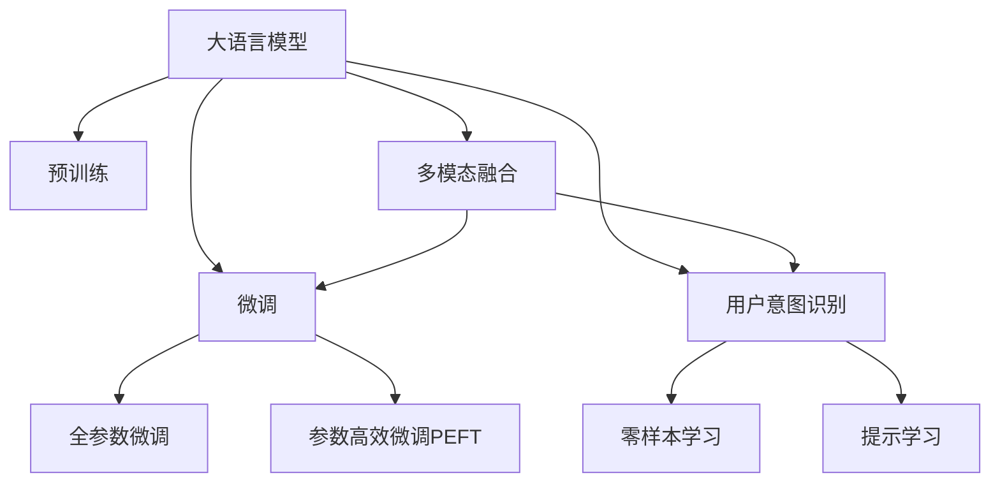

                 

# 融合AI大模型的用户意图识别技术

## 1. 背景介绍

### 1.1 问题由来
在当今数字化时代，人工智能(AI)大模型的应用范围日益广泛，涵盖了智能客服、自然语言处理、推荐系统等多个领域。随着数据量的爆炸式增长，用户生成内容的用户意图识别(U Intent Recognition)成为了一个重要的研究方向。

用户意图识别是指通过自然语言理解技术，从用户的输入中提取用户真实的意图，并据此提供相应的服务或输出。这一技术不仅能提升用户体验，还能有效减少误操作和资源浪费，降低企业的运营成本。

例如，在智能客服场景中，通过识别用户咨询意图，能够更快速地提供个性化服务，提高客户满意度。在推荐系统中，用户意图的识别能够帮助算法理解用户的兴趣和需求，从而生成更加精准的推荐内容。

然而，尽管大模型在许多NLP任务上表现出色，但在用户意图识别领域，其性能和效率仍存在一定的不足。现有的大模型通常是以通用的语言模型为基础进行训练，缺乏针对特定领域或任务的设计，导致在用户意图识别任务中，模型的表现并不尽如人意。

### 1.2 问题核心关键点
大语言模型在用户意图识别中的关键问题包括：
- **泛化能力不足**：现有的预训练模型在特定领域的泛化能力有限，难以准确理解用户意图。
- **任务适配不足**：通用的预训练模型难以适应特定的业务场景和需求。
- **计算资源浪费**：由于全参数微调，大量的计算资源被消耗在无关的层上。
- **模型可解释性不足**：大模型的决策过程难以解释，难以满足监管合规和用户需求。

为了克服这些挑战，研究者们提出了一系列的改进方法，如参数高效微调、零样本学习、提示学习等。这些方法通过在大模型上微调特定任务相关的层，显著提高了模型的效果和效率，同时保留了预训练模型的通用知识。

## 2. 核心概念与联系

### 2.1 核心概念概述

为更好地理解融合AI大模型的用户意图识别技术，本节将介绍几个核心概念：

- **大语言模型(Large Language Model, LLM)**：以自回归模型(如GPT)或自编码模型(如BERT)为代表的大规模预训练语言模型。通过在大规模无标签文本语料上进行预训练，学习到语言的通用表示。

- **用户意图识别(U Intent Recognition)**：自然语言处理领域的一个关键任务，旨在从用户的输入中识别出用户真实的意图，并提供相应的服务或回答。

- **全参数微调(Full-Parameter Fine-Tuning, FPFT)**：通过更新模型全部参数，使模型在特定任务上进行优化。虽然效果好，但计算资源消耗较大。

- **参数高效微调(Parameter-Efficient Fine-Tuning, PEFT)**：通过仅更新部分模型参数，保留大部分预训练权重，减小计算资源消耗，提高模型效率。

- **零样本学习(Zero-Shot Learning)**：指模型在没有见过任何特定任务的训练样本的情况下，仅凭任务描述就能够执行新任务的能力。

- **提示学习(Prompt Learning)**：通过在输入文本中添加提示模板，引导大语言模型进行特定任务的推理和生成。

- **多模态融合**：将文本以外的信息，如图像、语音等，与文本信息结合，提升模型的综合能力。

这些核心概念之间的逻辑关系可以通过以下Mermaid流程图来展示：



这个流程图展示了大语言模型在用户意图识别中的核心概念及其之间的关系：

1. 大语言模型通过预训练获得基础能力。
2. 微调是对预训练模型进行任务特定的优化，可以分为全参数微调和参数高效微调。
3. 提示学习是一种不更新模型参数的方法，可以实现零样本和少样本学习。
4. 多模态融合将文本以外的信息与文本信息结合，提升模型的综合能力。

这些概念共同构成了融合AI大模型的用户意图识别技术的基本框架，使其能够在各种场景下发挥强大的自然语言理解能力。通过理解这些核心概念，我们可以更好地把握技术的精髓，并应用于实际应用中。

## 3. 核心算法原理 & 具体操作步骤
### 3.1 算法原理概述

融合AI大模型的用户意图识别，其核心思想是利用大语言模型的预训练知识，通过微调针对特定任务，提升模型在识别用户意图上的性能。

具体来说，我们首先利用预训练语言模型获取文本的语义表示，然后通过微调获得特定任务上的参数优化，最终实现对用户意图的准确识别。该过程可以概括为以下几个步骤：

1. **预训练模型选择与预训练**：选择合适的预训练语言模型，并在大规模无标签文本上预训练，学习通用的语言知识。
2. **任务适配层设计**：根据用户意图识别的具体任务，设计适配的输出层和损失函数。
3. **微调优化**：通过在标注数据上微调，调整模型参数以匹配任务的特定需求。
4. **意图识别**：使用微调后的模型对用户输入进行推理，提取用户意图。

### 3.2 算法步骤详解

基于融合AI大模型的用户意图识别方法一般包括以下关键步骤：

**Step 1: 准备预训练模型和数据集**
- 选择合适的预训练语言模型 $M_{\theta}$，如BERT、GPT等。
- 准备用户意图识别的训练集 $D=\{(x_i, y_i)\}_{i=1}^N$，其中 $x_i$ 为输入文本，$y_i$ 为意图标签。

**Step 2: 添加任务适配层**
- 设计适配的输出层，通常使用多层感知器(MLP)或注意力机制(Attention)。
- 设计损失函数，如交叉熵损失、多标签分类损失等。

**Step 3: 设置微调超参数**
- 选择合适的优化算法及其参数，如AdamW、SGD等，设置学习率、批大小、迭代轮数等。
- 设置正则化技术及强度，包括权重衰减、Dropout、Early Stopping等。

**Step 4: 执行梯度训练**
- 将训练集数据分批次输入模型，前向传播计算损失函数。
- 反向传播计算参数梯度，根据设定的优化算法和学习率更新模型参数。
- 周期性在验证集上评估模型性能，根据性能指标决定是否触发 Early Stopping。
- 重复上述步骤直到满足预设的迭代轮数或 Early Stopping 条件。

**Step 5: 意图识别**
- 使用微调后的模型对用户输入进行推理，提取用户意图。
- 对于多意图识别任务，可以使用注意力机制对不同意图的得分进行加权。

### 3.3 算法优缺点

融合AI大模型的用户意图识别方法具有以下优点：
1. **高效**：通过参数高效微调方法，只更新少量参数，保留了大部分预训练权重，减少了计算资源消耗。
2. **泛化能力强**：利用预训练语言模型的通用知识，提升了模型在特定任务上的泛化能力。
3. **灵活性高**：适配层设计灵活，可以根据具体任务进行定制化设计。
4. **可解释性强**：保留了预训练模型的可解释性，便于模型的调试和优化。

同时，该方法也存在以下局限性：
1. **依赖高质量标注数据**：模型效果很大程度上取决于标注数据的质量和数量，获取高质量标注数据的成本较高。
2. **泛化到新领域能力有限**：模型的泛化能力受到预训练数据集的限制，难以在新领域任务上表现优异。
3. **微调代价**：尽管参数高效，但仍然需要一定的微调成本。
4. **对抗攻击脆弱**：模型可能受到对抗样本的攻击，导致识别错误。

尽管存在这些局限性，但基于大模型的用户意图识别方法依然是目前最有效的解决方案之一，广泛应用于智能客服、推荐系统等多个场景。

### 3.4 算法应用领域

融合AI大模型的用户意图识别技术，在NLP领域已经得到了广泛的应用，涵盖了多个常见任务，例如：

- **智能客服系统**：通过意图识别，智能客服系统能够更快速、准确地理解用户意图，提供个性化服务。
- **推荐系统**：识别用户的查询意图，生成更加精准的推荐内容。
- **智能助理**：根据用户的指令，智能助理能够进行复杂的多轮对话。
- **情感分析**：识别用户的情感倾向，辅助企业进行市场分析。
- **信息检索**：识别用户的搜索意图，提供更加相关的内容推荐。

这些任务涵盖了从通用对话到专业服务多个领域，体现了融合AI大模型在用户意图识别上的强大应用能力。

## 4. 数学模型和公式 & 详细讲解  
### 4.1 数学模型构建

本节将使用数学语言对融合AI大模型的用户意图识别过程进行更加严格的刻画。

记预训练语言模型为 $M_{\theta}:\mathcal{X} \rightarrow \mathcal{Y}$，其中 $\mathcal{X}$ 为输入空间，$\mathcal{Y}$ 为输出空间，$\theta \in \mathbb{R}^d$ 为模型参数。假设用户意图识别的训练集为 $D=\{(x_i, y_i)\}_{i=1}^N$，其中 $x_i$ 为输入文本，$y_i$ 为意图标签。

定义模型 $M_{\theta}$ 在输入 $x$ 上的输出为 $\hat{y}=M_{\theta}(x) \in \mathcal{Y}$。在用户意图识别的任务中，通常采用多标签分类损失函数，如二元交叉熵损失：

$$
\ell(M_{\theta}(x),y) = -\sum_{k=1}^K \ell_k(M_{\theta}(x),y_k)
$$

其中 $K$ 为意图的个数，$y_k$ 为第 $k$ 个意图的标签。对于多意图识别任务，可以采用以下多标签分类损失函数：

$$
\mathcal{L}(\theta) = -\frac{1}{N}\sum_{i=1}^N \sum_{k=1}^K \ell_k(M_{\theta}(x_i),y_i^k)
$$

其中 $\ell_k$ 为第 $k$ 个意图的损失函数。

### 4.2 公式推导过程

以下我们以二分类任务为例，推导多标签分类损失函数及其梯度的计算公式。

假设模型 $M_{\theta}$ 在输入 $x$ 上的输出为 $\hat{y}=M_{\theta}(x) \in [0,1]$，表示样本属于正类的概率。真实标签 $y \in \{0,1\}$。则二元交叉熵损失函数定义为：

$$
\ell(M_{\theta}(x),y) = -y\log \hat{y} - (1-y)\log (1-\hat{y})
$$

将其代入多标签分类损失函数，得：

$$
\mathcal{L}(\theta) = -\frac{1}{N}\sum_{i=1}^N \sum_{k=1}^K \ell_k(M_{\theta}(x_i),y_i^k)
$$

根据链式法则，损失函数对参数 $\theta_k$ 的梯度为：

$$
\frac{\partial \mathcal{L}(\theta)}{\partial \theta_k} = -\frac{1}{N}\sum_{i=1}^N \sum_{k=1}^K \frac{\partial \ell_k}{\partial \theta_k} \frac{\partial M_{\theta}(x_i)}{\partial \theta_k}
$$

其中 $\frac{\partial M_{\theta}(x_i)}{\partial \theta_k}$ 可进一步递归展开，利用自动微分技术完成计算。

在得到损失函数的梯度后，即可带入参数更新公式，完成模型的迭代优化。重复上述过程直至收敛，最终得到适应下游任务的最优模型参数 $\theta^*$。

## 5. 项目实践：代码实例和详细解释说明
### 5.1 开发环境搭建

在进行用户意图识别实践前，我们需要准备好开发环境。以下是使用Python进行PyTorch开发的环境配置流程：

1. 安装Anaconda：从官网下载并安装Anaconda，用于创建独立的Python环境。

2. 创建并激活虚拟环境：
```bash
conda create -n pytorch-env python=3.8 
conda activate pytorch-env
```

3. 安装PyTorch：根据CUDA版本，从官网获取对应的安装命令。例如：
```bash
conda install pytorch torchvision torchaudio cudatoolkit=11.1 -c pytorch -c conda-forge
```

4. 安装Transformers库：
```bash
pip install transformers
```

5. 安装各类工具包：
```bash
pip install numpy pandas scikit-learn matplotlib tqdm jupyter notebook ipython
```

完成上述步骤后，即可在`pytorch-env`环境中开始用户意图识别的实践。

### 5.2 源代码详细实现

这里我们以多意图识别任务为例，给出使用Transformers库对BERT模型进行用户意图识别的PyTorch代码实现。

首先，定义多意图识别的数据处理函数：

```python
from transformers import BertTokenizer
from torch.utils.data import Dataset
import torch

class IntentDataset(Dataset):
    def __init__(self, texts, intents, tokenizer, max_len=128):
        self.texts = texts
        self.intents = intents
        self.tokenizer = tokenizer
        self.max_len = max_len
        
    def __len__(self):
        return len(self.texts)
    
    def __getitem__(self, item):
        text = self.texts[item]
        intent = self.intents[item]
        
        encoding = self.tokenizer(text, return_tensors='pt', max_length=self.max_len, padding='max_length', truncation=True)
        input_ids = encoding['input_ids'][0]
        attention_mask = encoding['attention_mask'][0]
        
        # 对意图进行编码
        intents = [0] * len(intent)
        for k, v in intent.items():
            intents[k] = tag2id[v] if v in tag2id else 0
        
        labels = torch.tensor(intents, dtype=torch.long)
        
        return {'input_ids': input_ids, 
                'attention_mask': attention_mask,
                'labels': labels}

# 标签与id的映射
tag2id = {'negative': 0, 'positive': 1}

# 创建dataset
tokenizer = BertTokenizer.from_pretrained('bert-base-cased')

train_dataset = IntentDataset(train_texts, train_intents, tokenizer)
dev_dataset = IntentDataset(dev_texts, dev_intents, tokenizer)
test_dataset = IntentDataset(test_texts, test_intents, tokenizer)
```

然后，定义模型和优化器：

```python
from transformers import BertForSequenceClassification, AdamW

model = BertForSequenceClassification.from_pretrained('bert-base-cased', num_labels=len(tag2id))

optimizer = AdamW(model.parameters(), lr=2e-5)
```

接着，定义训练和评估函数：

```python
from torch.utils.data import DataLoader
from tqdm import tqdm
from sklearn.metrics import classification_report

device = torch.device('cuda') if torch.cuda.is_available() else torch.device('cpu')
model.to(device)

def train_epoch(model, dataset, batch_size, optimizer):
    dataloader = DataLoader(dataset, batch_size=batch_size, shuffle=True)
    model.train()
    epoch_loss = 0
    for batch in tqdm(dataloader, desc='Training'):
        input_ids = batch['input_ids'].to(device)
        attention_mask = batch['attention_mask'].to(device)
        labels = batch['labels'].to(device)
        model.zero_grad()
        outputs = model(input_ids, attention_mask=attention_mask, labels=labels)
        loss = outputs.loss
        epoch_loss += loss.item()
        loss.backward()
        optimizer.step()
    return epoch_loss / len(dataloader)

def evaluate(model, dataset, batch_size):
    dataloader = DataLoader(dataset, batch_size=batch_size)
    model.eval()
    preds, labels = [], []
    with torch.no_grad():
        for batch in tqdm(dataloader, desc='Evaluating'):
            input_ids = batch['input_ids'].to(device)
            attention_mask = batch['attention_mask'].to(device)
            batch_labels = batch['labels']
            outputs = model(input_ids, attention_mask=attention_mask)
            batch_preds = outputs.logits.argmax(dim=2).to('cpu').tolist()
            batch_labels = batch_labels.to('cpu').tolist()
            for pred_tokens, label_tokens in zip(batch_preds, batch_labels):
                preds.append(pred_tokens[:len(label_tokens)])
                labels.append(label_tokens)
                
    print(classification_report(labels, preds))
```

最后，启动训练流程并在测试集上评估：

```python
epochs = 5
batch_size = 16

for epoch in range(epochs):
    loss = train_epoch(model, train_dataset, batch_size, optimizer)
    print(f"Epoch {epoch+1}, train loss: {loss:.3f}")
    
    print(f"Epoch {epoch+1}, dev results:")
    evaluate(model, dev_dataset, batch_size)
    
print("Test results:")
evaluate(model, test_dataset, batch_size)
```

以上就是使用PyTorch对BERT进行多意图识别任务的完整代码实现。可以看到，得益于Transformers库的强大封装，我们可以用相对简洁的代码完成BERT模型的加载和微调。

### 5.3 代码解读与分析

让我们再详细解读一下关键代码的实现细节：

**IntentDataset类**：
- `__init__`方法：初始化文本、意图标签、分词器等关键组件。
- `__len__`方法：返回数据集的样本数量。
- `__getitem__`方法：对单个样本进行处理，将文本输入编码为token ids，将意图标签编码为数字，并对其进行定长padding，最终返回模型所需的输入。

**tag2id和id2tag字典**：
- 定义了意图与数字id之间的映射关系，用于将token-wise的预测结果解码回真实的意图标签。

**训练和评估函数**：
- 使用PyTorch的DataLoader对数据集进行批次化加载，供模型训练和推理使用。
- 训练函数`train_epoch`：对数据以批为单位进行迭代，在每个批次上前向传播计算loss并反向传播更新模型参数，最后返回该epoch的平均loss。
- 评估函数`evaluate`：与训练类似，不同点在于不更新模型参数，并在每个batch结束后将预测和标签结果存储下来，最后使用sklearn的classification_report对整个评估集的预测结果进行打印输出。

**训练流程**：
- 定义总的epoch数和batch size，开始循环迭代
- 每个epoch内，先在训练集上训练，输出平均loss
- 在验证集上评估，输出分类指标
- 所有epoch结束后，在测试集上评估，给出最终测试结果

可以看到，PyTorch配合Transformers库使得BERT微调的代码实现变得简洁高效。开发者可以将更多精力放在数据处理、模型改进等高层逻辑上，而不必过多关注底层的实现细节。

当然，工业级的系统实现还需考虑更多因素，如模型的保存和部署、超参数的自动搜索、更灵活的任务适配层等。但核心的微调范式基本与此类似。

## 6. 实际应用场景
### 6.1 智能客服系统

融合AI大模型的用户意图识别技术在智能客服系统中具有广泛的应用前景。通过分析用户输入，智能客服系统能够准确理解用户需求，快速提供个性化服务，提升用户体验和客户满意度。

例如，可以收集企业内部的客服对话记录，将常见问题及对应的解决方案标注为意图和标签，构建训练集。在此基础上对预训练模型进行微调，使模型能够准确识别用户意图，并自动匹配最合适的解决方案进行回复。对于复杂问题，模型还可以接入检索系统实时搜索相关内容，动态组织生成回答。如此构建的智能客服系统，能够大幅提升客户咨询体验和问题解决效率。

### 6.2 推荐系统

融合AI大模型的用户意图识别技术在推荐系统中也有重要应用。通过识别用户的查询意图，推荐系统能够生成更加精准的推荐内容，提升用户的满意度。

例如，在电商平台中，用户搜索时输入的关键词包含了用户真正的需求，通过意图识别，推荐系统可以理解用户的意图，并提供相关商品推荐。同时，多意图识别模型还可以结合用户历史行为数据，进行更加全面和个性化的推荐。

### 6.3 智能助理

智能助理是融合AI大模型的用户意图识别技术的另一个典型应用。智能助理能够根据用户的语音或文本输入，进行多轮对话，提供个性化服务。

例如，智能助理可以集成在智能音箱中，根据用户的语音指令进行意图识别，并执行相应任务。如播放音乐、设置闹钟、查询天气等。通过多意图识别技术，智能助理能够理解用户的复杂需求，提供更加智能和灵活的服务。

### 6.4 未来应用展望

随着融合AI大模型的用户意图识别技术的发展，未来的应用场景将更加多样，其潜力和价值也将进一步凸显。

在智慧医疗领域，通过识别患者的病情描述，智能助理能够提供初步的病情分析，辅助医生诊疗。在金融领域，通过分析用户的交易记录和投资偏好，智能助理能够提供个性化的理财建议。在教育领域，智能助理能够根据学生的学习情况，提供个性化的学习建议和资源推荐。

此外，在智慧城市治理、智能交通、智能家居等多个领域，融合AI大模型的用户意图识别技术也将得到广泛应用，为社会智能化转型提供强大的技术支持。相信随着技术的不断演进，融合AI大模型的用户意图识别技术必将成为人工智能技术的重要组成部分，为各行各业带来深刻的变革。

## 7. 工具和资源推荐
### 7.1 学习资源推荐

为了帮助开发者系统掌握融合AI大模型的用户意图识别技术，这里推荐一些优质的学习资源：

1. 《Transformer从原理到实践》系列博文：由大模型技术专家撰写，深入浅出地介绍了Transformer原理、BERT模型、用户意图识别等前沿话题。

2. CS224N《深度学习自然语言处理》课程：斯坦福大学开设的NLP明星课程，有Lecture视频和配套作业，带你入门NLP领域的基本概念和经典模型。

3. 《Natural Language Processing with Transformers》书籍：Transformers库的作者所著，全面介绍了如何使用Transformers库进行NLP任务开发，包括用户意图识别在内的诸多范式。

4. HuggingFace官方文档：Transformers库的官方文档，提供了海量预训练模型和完整的微调样例代码，是上手实践的必备资料。

5. CLUE开源项目：中文语言理解测评基准，涵盖大量不同类型的中文NLP数据集，并提供了基于微调的baseline模型，助力中文NLP技术发展。

通过对这些资源的学习实践，相信你一定能够快速掌握融合AI大模型的用户意图识别技术的精髓，并用于解决实际的NLP问题。
###  7.2 开发工具推荐

高效的开发离不开优秀的工具支持。以下是几款用于融合AI大模型的用户意图识别开发的常用工具：

1. PyTorch：基于Python的开源深度学习框架，灵活动态的计算图，适合快速迭代研究。大部分预训练语言模型都有PyTorch版本的实现。

2. TensorFlow：由Google主导开发的开源深度学习框架，生产部署方便，适合大规模工程应用。同样有丰富的预训练语言模型资源。

3. Transformers库：HuggingFace开发的NLP工具库，集成了众多SOTA语言模型，支持PyTorch和TensorFlow，是进行用户意图识别开发的利器。

4. Weights & Biases：模型训练的实验跟踪工具，可以记录和可视化模型训练过程中的各项指标，方便对比和调优。与主流深度学习框架无缝集成。

5. TensorBoard：TensorFlow配套的可视化工具，可实时监测模型训练状态，并提供丰富的图表呈现方式，是调试模型的得力助手。

6. Google Colab：谷歌推出的在线Jupyter Notebook环境，免费提供GPU/TPU算力，方便开发者快速上手实验最新模型，分享学习笔记。

合理利用这些工具，可以显著提升融合AI大模型的用户意图识别任务的开发效率，加快创新迭代的步伐。

### 7.3 相关论文推荐

融合AI大模型的用户意图识别技术的发展源于学界的持续研究。以下是几篇奠基性的相关论文，推荐阅读：

1. Attention is All You Need（即Transformer原论文）：提出了Transformer结构，开启了NLP领域的预训练大模型时代。

2. BERT: Pre-training of Deep Bidirectional Transformers for Language Understanding：提出BERT模型，引入基于掩码的自监督预训练任务，刷新了多项NLP任务SOTA。

3. Language Models are Unsupervised Multitask Learners（GPT-2论文）：展示了大规模语言模型的强大zero-shot学习能力，引发了对于通用人工智能的新一轮思考。

4. Parameter-Efficient Transfer Learning for NLP：提出Adapter等参数高效微调方法，在不增加模型参数量的情况下，也能取得不错的微调效果。

5. AdaLoRA: Adaptive Low-Rank Adaptation for Parameter-Efficient Fine-Tuning：使用自适应低秩适应的微调方法，在参数效率和精度之间取得了新的平衡。

这些论文代表了大语言模型用户意图识别技术的发展脉络。通过学习这些前沿成果，可以帮助研究者把握学科前进方向，激发更多的创新灵感。

## 8. 总结：未来发展趋势与挑战
### 8.1 总结

本文对融合AI大模型的用户意图识别技术进行了全面系统的介绍。首先阐述了用户意图识别的背景和重要性，明确了融合AI大模型的用户意图识别技术在提升用户体验和效率方面的独特价值。其次，从原理到实践，详细讲解了融合AI大模型的用户意图识别过程的数学原理和关键步骤，给出了微调任务开发的完整代码实例。同时，本文还广泛探讨了该技术在智能客服、推荐系统等多个领域的应用前景，展示了融合AI大模型的用户意图识别技术的强大应用能力。最后，本文精选了技术实践的各类学习资源，力求为读者提供全方位的技术指引。

通过本文的系统梳理，可以看到，融合AI大模型的用户意图识别技术正在成为NLP领域的重要范式，极大地拓展了预训练语言模型的应用边界，催生了更多的落地场景。受益于大规模语料的预训练和微调方法的不断进步，融合AI大模型的用户意图识别技术必将在更多领域得到应用，为NLP技术带来全新的突破。

### 8.2 未来发展趋势

展望未来，融合AI大模型的用户意图识别技术将呈现以下几个发展趋势：

1. **参数高效微调方法**：随着高效微调技术的不断演进，模型参数效率将进一步提升，仅更新少量任务相关参数即可实现良好的性能。

2. **零样本学习和少样本学习**：提示学习等方法将得到更广泛的应用，使得模型在未见过的数据上也能进行有效的推理和生成。

3. **多模态融合**：将文本以外的信息，如图像、语音等，与文本信息结合，提升模型的综合能力。

4. **自监督学习**：引入自监督学习范式，利用大量无标注数据进行预训练，提升模型的泛化能力。

5. **多任务学习**：将多个任务共同训练，通过共享的知识提升模型的整体表现。

6. **元学习**：开发元学习算法，使模型能够快速适应新任务，提高模型的迁移能力。

以上趋势凸显了融合AI大模型的用户意图识别技术的广阔前景。这些方向的探索发展，必将进一步提升模型的性能和效率，为实际应用带来更大的价值。

### 8.3 面临的挑战

尽管融合AI大模型的用户意图识别技术已经取得了显著进展，但在迈向更加智能化、普适化应用的过程中，它仍面临着诸多挑战：

1. **标注数据获取难度**：用户意图识别的准确性很大程度上取决于标注数据的质量和数量，获取高质量标注数据的成本较高。

2. **对抗攻击脆弱性**：模型可能受到对抗样本的攻击，导致识别错误，这需要通过对抗训练等方法进行缓解。

3. **计算资源消耗**：尽管参数高效微调方法已取得进展，但模型推理和训练仍需要大量的计算资源。

4. **可解释性不足**：大模型的决策过程难以解释，难以满足监管合规和用户需求。

5. **跨领域泛化能力有限**：模型的泛化能力受到预训练数据集的限制，难以在新领域任务上表现优异。

6. **鲁棒性不足**：模型在面对噪声、缺失数据等情况时，鲁棒性仍然有待提升。

尽管存在这些挑战，但基于融合AI大模型的用户意图识别技术依然是目前最有效的解决方案之一，广泛应用于智能客服、推荐系统等多个场景。

### 8.4 研究展望

面对融合AI大模型的用户意图识别技术所面临的挑战，未来的研究需要在以下几个方面寻求新的突破：

1. **数据增强和数据扩充**：通过数据增强、数据扩充等方法，提升模型对噪声、缺失数据的鲁棒性。

2. **对抗训练和鲁棒性提升**：引入对抗训练等方法，提高模型对抗样本的鲁棒性。

3. **模型压缩和优化**：开发更高效的模型压缩和优化方法，减小计算资源消耗。

4. **可解释性增强**：引入可解释性技术，增强模型的可解释性，满足监管合规和用户需求。

5. **跨领域迁移能力提升**：开发跨领域迁移算法，提升模型在新领域任务上的泛化能力。

6. **多模态融合**：将多模态信息与文本信息结合，提升模型的综合能力。

这些研究方向的探索，必将引领融合AI大模型的用户意图识别技术迈向更高的台阶，为构建安全、可靠、可解释、可控的智能系统铺平道路。面向未来，融合AI大模型的用户意图识别技术还需要与其他人工智能技术进行更深入的融合，如知识表示、因果推理、强化学习等，多路径协同发力，共同推动自然语言理解和智能交互系统的进步。只有勇于创新、敢于突破，才能不断拓展语言模型的边界，让智能技术更好地造福人类社会。

## 9. 附录：常见问题与解答

**Q1：融合AI大模型的用户意图识别是否适用于所有NLP任务？**

A: 融合AI大模型的用户意图识别技术在大多数NLP任务上都能取得不错的效果，特别是对于数据量较小的任务。但对于一些特定领域的任务，如医学、法律等，仅仅依靠通用语料预训练的模型可能难以很好地适应。此时需要在特定领域语料上进一步预训练，再进行微调，才能获得理想效果。此外，对于一些需要时效性、个性化很强的任务，如对话、推荐等，微调方法也需要针对性的改进优化。

**Q2：融合AI大模型的用户意图识别中的参数高效微调方法有哪些？**

A: 常用的参数高效微调方法包括：
- Adapter：只更新模型中特定的层，保留大部分预训练权重。
- Prompt Tuning：通过在输入文本中添加提示模板，引导模型进行特定任务的推理和生成。
- LoRA：将模型参数分解为低秩矩阵，只更新矩阵的一部分，减少微调参数量。
- Mix-Softmax：在分类层中使用可学习的softmax权重，增强模型对不同类别的识别能力。

这些方法通过只更新少量参数，保留了大部分预训练权重，减小了计算资源消耗，提高了模型效率。

**Q3：融合AI大模型的用户意图识别中的对抗训练方法有哪些？**

A: 常用的对抗训练方法包括：
- Fast Gradient Sign Method (FGSM)：通过在输入上加入梯度符号，生成对抗样本，增强模型的鲁棒性。
- PGD攻击：在每次迭代中，逐渐增加对抗样本的强度，增强模型的鲁棒性。
- Mixup训练：在训练时，对输入进行混杂，增强模型的泛化能力。

这些方法通过在训练时加入对抗样本，增强模型的鲁棒性，使其对噪声、缺失数据等情况具有更强的适应能力。

**Q4：融合AI大模型的用户意图识别的可解释性如何增强？**

A: 增强模型可解释性的方法包括：
- SHAP：通过Shapley值方法，解释模型的预测结果。
- LIME：通过局部线性模型，解释模型在不同输入上的预测行为。
- Layer-wise Relevance Propagation (LRP)：通过逐层传播相关性，解释模型的内部工作机制。

这些方法通过不同的技术手段，增强了模型的可解释性，使得用户能够理解和信任模型的预测结果。

**Q5：融合AI大模型的用户意图识别中的多模态融合方法有哪些？**

A: 常用的多模态融合方法包括：
- 跨模态注意力机制：在多模态数据之间引入注意力机制，提高模型的跨模态理解能力。
- 跨模态拼接：将不同模态的数据进行拼接，增强模型的综合能力。
- 多任务学习：同时训练多个任务，利用共享的知识提升模型的整体表现。

这些方法通过将不同模态的数据融合在一起，提高了模型的综合能力，使其能够更好地理解用户的多模态输入。

---

作者：禅与计算机程序设计艺术 / Zen and the Art of Computer Programming

