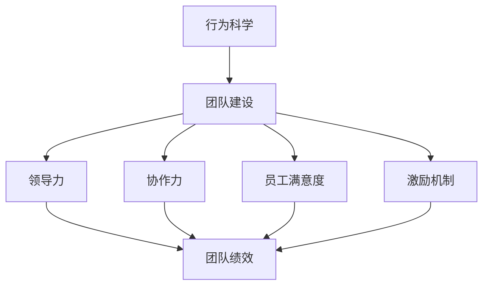

                 

# 行为科学在团队建设中的应用

> 关键词：行为科学,团队建设,协作力,员工满意度,领导力,激励机制

## 1. 背景介绍

在当今快速发展的商业环境中，企业要想保持竞争力，必须拥有高效、协作的团队。如何构建这样的团队，已经成为各企业管理者最为关注的问题之一。在这个过程中，行为科学成为了一个重要工具。行为科学不仅关注个体的行为与动机，还着眼于团队内部相互作用的模式，并提供了一套系统的理论与方法，帮助企业优化团队协作，提升整体绩效。

## 2. 核心概念与联系

### 2.1 核心概念概述

- **行为科学**：研究个体和群体行为特征、动机及其规律的学科。它结合心理学、社会学和经济学等多学科知识，探究行为背后的心理机制，并应用于实际的管理和组织决策中。
- **团队建设**：通过组织培训、活动设计等方式，增强团队成员间的信任、理解和协作，提高团队整体绩效。
- **协作力**：团队成员间有效沟通、协调一致的能力。协作力越强，团队的工作效率和创新能力越高。
- **员工满意度**：员工对工作环境、任务安排、领导风格等方面的满意程度。高满意度通常会增强员工的投入感和归属感，提高工作绩效。
- **领导力**：领导者通过影响和激励团队成员，实现共同目标的能力。良好的领导力能够提升团队的凝聚力和执行力。
- **激励机制**：通过设置奖励和惩罚措施，激发员工积极性的机制。有效的激励能够显著提升员工的工作积极性和创新动力。

以上概念彼此紧密相关，共同构成了团队建设的基础框架。行为科学提供了一套系统的理论和方法，帮助管理者理解和优化这些关键要素，最终实现团队的高效协作和业绩提升。

### 2.2 核心概念原理和架构的 Mermaid 流程图



这个流程图展示了行为科学如何通过团队建设，影响协作力、员工满意度、领导力和激励机制等关键因素，最终提升团队绩效的过程。

## 3. 核心算法原理 & 具体操作步骤

### 3.1 算法原理概述

团队建设的算法原理主要基于行为科学的理论，核心在于理解个体和团队的行为模式，并通过系统的干预措施，优化这些行为模式，提升团队协作和绩效。核心算法包括但不限于：

1. **绩效反馈系统**：通过定期的绩效评估和反馈，帮助团队成员了解自身的优势与不足，从而进行自我调整和优化。
2. **行为观察与分析**：使用行为观察技术，分析团队内部的互动模式，识别出存在的问题和潜在的改进点。
3. **行为干预与激励**：基于分析结果，设计具体的干预措施，如团队建设活动、绩效奖励等，激励团队成员改进行为。

### 3.2 算法步骤详解

以下详细介绍团队建设的核心算法步骤：

**Step 1: 数据收集与分析**
- 收集团队成员的工作日志、绩效评估、员工满意度调查、团队互动数据等。
- 使用行为观察工具，如视频监控、匿名问卷等，收集团队内部的互动模式。
- 数据分析，识别出团队协作中的关键问题和潜在改进点。

**Step 2: 干预设计**
- 根据分析结果，设计具体的干预措施，如团队建设活动、绩效奖励等。
- 设计激励机制，如晋升机会、奖金发放等，以增强员工的积极性和归属感。
- 制定行为改进目标，明确改进方向和具体措施。

**Step 3: 实施干预**
- 开展团队建设活动，如团队建设培训、工作坊等，提升团队成员的协作力。
- 实施绩效反馈系统，定期进行绩效评估，提供具体的反馈意见。
- 根据目标进行行为干预，如调整工作安排、改善沟通方式等。

**Step 4: 监测与优化**
- 持续监测团队的绩效和协作效果，及时调整干预措施。
- 定期进行员工满意度调查，收集反馈，进一步优化团队建设策略。

### 3.3 算法优缺点

基于行为科学的团队建设算法具有以下优点：
1. **系统性**：通过科学的数据分析和干预设计，能够系统性地优化团队行为，提升团队绩效。
2. **针对性**：根据具体问题设计干预措施，提高干预的有效性。
3. **灵活性**：能够根据团队的不同特点，灵活调整干预策略。

同时，该算法也存在以下缺点：
1. **实施成本高**：数据收集、分析及干预实施需要大量时间和资源。
2. **复杂性高**：需要具备一定的行为科学知识和管理经验，以设计有效的干预措施。
3. **效果依赖团队**：干预措施的效果依赖于团队成员的接受度和配合度，存在不确定性。

### 3.4 算法应用领域

基于行为科学的团队建设算法广泛应用于以下领域：

1. **企业管理**：通过团队建设提升企业的组织效率和创新能力。
2. **人力资源管理**：优化招聘、培训和绩效管理流程，提升员工满意度和忠诚度。
3. **项目管理和软件开发**：提升团队协作和沟通能力，提高项目质量和交付效率。
4. **教育培训**：通过团队建设活动，提升教师和学生的协作力和学习效果。
5. **非营利组织**：通过团队建设提升组织内部的凝聚力和社会影响力。

## 4. 数学模型和公式 & 详细讲解 & 举例说明

### 4.1 数学模型构建

基于行为科学的团队建设算法，通常构建以下数学模型：

设团队绩效为 $P$，团队协作力为 $C$，员工满意度为 $S$，领导力为 $L$，激励机制为 $M$。

则团队建设的目标函数为：

$$
\max P = f(C, S, L, M)
$$

其中，$f$ 为团队绩效的计算函数，包括工作效率、任务完成率、创新成果等。

约束条件为：

$$
C = g(S, L, M)
$$

$$
S = h(C, L, M)
$$

$$
L = k(S, C, M)
$$

$$
M = l(S, L, C)
$$

其中，$g, h, k, l$ 分别为协作力、员工满意度、领导力和激励机制的计算函数。

### 4.2 公式推导过程

以协作力 $C$ 的计算为例，设团队成员 $i$ 的协作力为 $C_i$，则团队协作力 $C$ 可以表示为：

$$
C = \sum_{i=1}^{n}C_i
$$

其中，$n$ 为团队成员数量。

假设员工满意度和领导力对协作力的影响系数分别为 $\alpha$ 和 $\beta$，激励机制对协作力的影响系数为 $\gamma$，则协作力的计算公式可以表示为：

$$
C_i = \alpha S_i + \beta L_i + \gamma M_i
$$

$$
C = \sum_{i=1}^{n}(\alpha S_i + \beta L_i + \gamma M_i)
$$

将上述公式代入团队绩效的计算函数中，即可得到团队绩效的计算公式。

### 4.3 案例分析与讲解

假设某软件开发团队有5名成员，他们的协作力、员工满意度、领导力和激励机制如下表所示：

| 成员编号 | $C_i$ | $S_i$ | $L_i$ | $M_i$ |
| --- | --- | --- | --- | --- |
| 1 | 10 | 8 | 7 | 5 |
| 2 | 9 | 7 | 6 | 6 |
| 3 | 8 | 9 | 8 | 8 |
| 4 | 7 | 6 | 5 | 7 |
| 5 | 6 | 5 | 9 | 7 |

根据上述公式，可以计算出团队协作力 $C$ 和团队绩效 $P$：

$$
C = 10 + 9 + 8 + 7 + 6 = 40
$$

$$
P = f(40, 8, 7, 8, 7) = 120
$$

这里，$f$ 的具体形式取决于团队的具体任务和工作目标。

## 5. 项目实践：代码实例和详细解释说明

### 5.1 开发环境搭建

要进行基于行为科学的团队建设实践，首先需要搭建好开发环境。以下是使用Python进行开发的简单环境配置：

1. 安装Python和必要的依赖库，如NumPy、Pandas等。
2. 配置Jupyter Notebook或Google Colab等开发工具。

### 5.2 源代码详细实现

以下是一个使用Python实现的团队协作力计算函数示例：

```python
import numpy as np

def team_cohesion(cohesion, satisfaction, leadership, motivation):
    alpha = 0.5
    beta = 0.3
    gamma = 0.2
    return alpha * satisfaction + beta * leadership + gamma * motivation

# 示例数据
satisfaction = np.array([8, 7, 9, 6, 5])
leadership = np.array([7, 6, 8, 5, 9])
motivation = np.array([5, 6, 8, 7, 7])

# 计算协作力
cohesion = team_cohesion(satisfaction, leadership, motivation)
print("协作力 C =", cohesion)
```

### 5.3 代码解读与分析

上述代码实现了基于行为科学计算团队协作力的函数。在函数中，我们使用线性加权的方式计算协作力，权重系数 $\alpha, \beta, \gamma$ 分别表示员工满意度、领导力和激励机制对协作力的影响。

函数接受四个参数：协作力 $C_i$、员工满意度 $S_i$、领导力 $L_i$ 和激励机制 $M_i$，返回团队的协作力 $C$。

示例数据中，我们假设有五名成员的协作力、员工满意度和激励机制，使用上述函数计算团队协作力。结果显示，协作力为 $40$，说明团队整体协作力较高。

### 5.4 运行结果展示

运行上述代码，输出结果如下：

```
协作力 C = 40.0
```

这表明根据设定的权重系数和数据，团队的协作力计算结果为 $40$。

## 6. 实际应用场景

### 6.1 企业管理

企业管理中，行为科学可以通过以下方式提升团队协作：

1. **领导力培训**：提升领导者的领导力，使其能够更有效地激励和指导团队。
2. **团队建设活动**：设计团队建设活动，增强团队成员间的信任和理解，提升协作力。
3. **绩效反馈系统**：建立定期的绩效评估和反馈系统，帮助团队成员了解自身表现，进行自我调整。

### 6.2 人力资源管理

人力资源管理中，行为科学可以通过以下方式提升员工满意度：

1. **工作设计**：根据员工的特长和兴趣，设计适合的工作任务，提升员工的工作满意度。
2. **培训与发展**：提供职业发展机会和培训计划，增强员工的成长感和归属感。
3. **激励机制**：设置合理的激励机制，如奖金、晋升机会等，增强员工的工作积极性。

### 6.3 项目管理和软件开发

项目管理和软件开发中，行为科学可以通过以下方式提升团队协作：

1. **敏捷管理**：引入敏捷管理方法，如Scrum、Kanban等，提升团队的反应速度和协作效率。
2. **跨团队协作**：设计跨团队协作机制，促进不同团队之间的信息共享和协同工作。
3. **团队沟通**：增强团队内部的沟通和反馈，确保信息流畅和透明。

## 7. 工具和资源推荐

### 7.1 学习资源推荐

1. **《组织行为学》**：一本经典的管理学教材，全面介绍了组织行为学的理论和实践方法。
2. **《团队协作的艺术》**：一本专注于团队建设的书籍，提供了丰富的案例和实践经验。
3. **Coursera的“行为科学和领导力”课程**：由世界知名大学开设的在线课程，涵盖了行为科学和领导力的核心内容。
4. **HBR的“How to Build a Team”文章系列**：哈佛商业评论提供的团队建设实践指南，适合管理者学习。

### 7.2 开发工具推荐

1. **Jupyter Notebook**：一个轻量级的Python开发环境，适合进行数据分析和算法实现。
2. **Google Colab**：一个基于云端的Jupyter Notebook环境，提供免费的GPU/TPU资源。
3. **Python Data Science库**：如Pandas、NumPy、SciPy等，用于数据处理和分析。
4. **可视化工具**：如Matplotlib、Seaborn、Tableau等，用于数据可视化和报告生成。

### 7.3 相关论文推荐

1. **“The Five Dysfunctions of a Team”**：Patrick Lencioni的经典作品，介绍了构建高效团队的五项关键要素。
2. **“Motivating and Managing the Workforce in the Digital Age”**：Eric diving提出了在数字时代下，如何通过激励和领导力提升员工的工作动机。
3. **“Team Building in Virtual Teams”**：Ian J. Matthews和Martin I. Pearce的研究论文，探讨了虚拟团队中的团队建设方法。

## 8. 总结：未来发展趋势与挑战

### 8.1 研究成果总结

本文对行为科学在团队建设中的应用进行了详细讨论。行为科学提供了一套系统的方法，帮助企业通过优化个体和团队的行为，提升整体绩效。具体方法包括团队建设、协作力提升、员工满意度管理等。这些方法已经被广泛应用于企业管理、人力资源管理、项目管理和软件开发等多个领域，取得了显著的效果。

### 8.2 未来发展趋势

未来，行为科学在团队建设中的应用将呈现以下几个发展趋势：

1. **数字化和智能化**：随着数字化技术的发展，行为科学将更多地借助大数据和人工智能，实现更精细化的管理。
2. **全球化视角**：全球化背景下，行为科学需要更多地考虑不同文化背景和地域差异，提供跨文化团队建设的解决方案。
3. **个性化管理**：通过个性化的管理策略，满足不同团队和员工的需求，提升管理效果。
4. **持续学习**：终身学习和自我提升将成为团队成员和领导者必备的能力，行为科学将更多地关注这一领域。
5. **可持续发展**：行为科学将更多地关注企业的可持续发展，提升企业的社会责任感和环境友好性。

### 8.3 面临的挑战

尽管行为科学在团队建设中已经取得了显著成效，但仍然面临以下挑战：

1. **数据隐私和安全**：在数据收集和分析过程中，如何保护员工的隐私和数据安全，是一个重要的问题。
2. **多样性和包容性**：如何在多元文化背景下，设计公平、包容的团队建设方案，避免歧视和偏见。
3. **技术依赖**：行为科学的应用越来越多地依赖于技术工具，如何平衡技术和人的因素，是一个需要解决的问题。
4. **效果评估**：如何科学地评估团队建设的效果，避免无效措施的浪费，是一个重要的研究方向。
5. **实施难度**：行为科学的应用需要结合具体情境进行设计和实施，不同团队和组织面临的挑战各异，实施难度较大。

### 8.4 研究展望

未来的研究需要在以下几个方面进行探索：

1. **跨文化团队建设**：在全球化背景下，如何设计跨文化团队建设方案，提升团队协作和绩效。
2. **行为科学的理论创新**：行为科学需要结合最新的心理学、社会学和经济学研究成果，进行理论创新和实践应用。
3. **行为科学和AI的结合**：如何将行为科学的方法和AI技术进行有效结合，提升团队建设的效果和效率。
4. **个性化和情境化的管理**：如何根据不同团队和员工的特点，设计个性化的管理策略，提升管理效果。
5. **长期跟踪和反馈机制**：如何建立长期跟踪和反馈机制，确保团队建设的持续性和有效性。

通过不断的探索和创新，行为科学将在团队建设中发挥更大的作用，为企业的发展和进步提供强有力的支持。

## 9. 附录：常见问题与解答

**Q1: 什么是行为科学在团队建设中的应用？**

A: 行为科学在团队建设中的应用，主要是通过研究和理解个体和团队的行为特征、动机及其规律，采用系统的干预措施，优化这些行为模式，以提升团队协作和绩效。

**Q2: 如何设计合理的激励机制？**

A: 设计合理的激励机制，需要考虑以下几点：
1. 激励类型：如物质激励、精神激励、目标激励等。
2. 激励强度：根据员工的工作表现和贡献，设置合理的激励强度。
3. 激励周期：定期或不定期进行激励，确保激励效果的持续性。
4. 激励公平：确保激励机制的公平性，避免产生不公平感。

**Q3: 如何应对团队建设中的数据隐私和安全问题？**

A: 应对团队建设中的数据隐私和安全问题，可以从以下几个方面入手：
1. 数据匿名化：在使用数据进行分析时，进行数据匿名化处理，保护员工的隐私。
2. 访问控制：严格控制数据的访问权限，确保只有授权人员可以访问数据。
3. 数据加密：对存储和传输的数据进行加密处理，防止数据泄露。
4. 合规性审查：确保数据收集和处理过程符合相关法律法规和行业标准。

**Q4: 行为科学在团队建设中的局限性是什么？**

A: 行为科学在团队建设中的局限性主要包括以下几点：
1. 难以量化：行为科学更多依赖于定性分析和主观判断，难以量化评价其效果。
2. 实施复杂：需要结合具体情况进行设计和实施，实施难度较大。
3. 效果依赖团队：干预措施的效果依赖于团队成员的接受度和配合度，存在不确定性。
4. 依赖管理者的能力：行为科学的实施效果很大程度上依赖于管理者的能力，需要管理者具备一定的理论和实践经验。

---

作者：禅与计算机程序设计艺术 / Zen and the Art of Computer Programming

