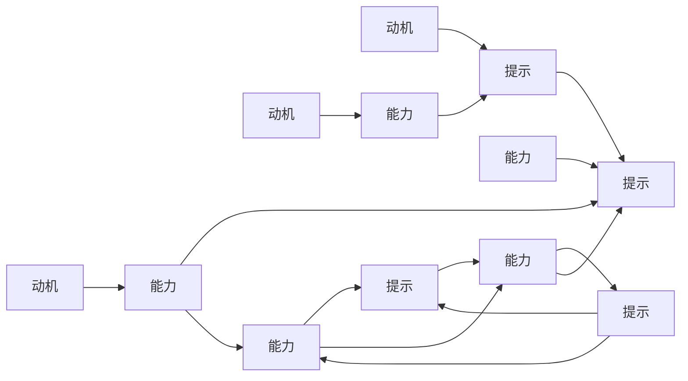

                 

# 行为设计:用福格模型塑造好习惯

> 关键词：行为设计,好习惯,福格模型,动机,能力,提示,持久性

## 1. 背景介绍

### 1.1 问题由来
在我们的日常生活中，培养好习惯是一个重要且常见的目标。无论是为了身体健康、职业发展还是人际关系，形成良好的行为习惯往往能带来持续的正向影响。然而，在实际生活中，我们往往难以坚持好习惯，导致目标难以达成。如何有效塑造和维持好习惯，成为了一个值得深入探讨的问题。

福格模型（Fogg's Model）作为一种行为设计理论，提供了一套系统的方法来帮助我们设计、激励和养成好习惯。该模型由行为设计师B.J.福格（B.J. Fogg）提出，主要包含三个关键要素：动机（Motivation）、能力（Ability）、提示（Prompts），并强调在设计和实现习惯养成时，需兼顾这三者的平衡。

## 2. 核心概念与联系

### 2.1 核心概念概述

福格模型包括以下几个核心概念：

- **动机（Motivation）**：指个体为了达成目标而产生的内在动力和外部刺激。动机越强，个体越容易采取行动。
- **能力（Ability）**：指个体执行某一行为所需要的时间和精力成本。当执行某行为所需的资源较少时，个体越可能采取行动。
- **提示（Prompts）**：指在合适的时间、地点和方式下对个体进行触发，提醒其执行某行为。合适的提示能显著提高行为的启动概率。

福格模型认为，一个行为是否能够被持续执行，取决于其是否同时满足高动机、低能力和易于执行的“提示”。因此，在设计和推广习惯时，关键在于设计合理的动机触发、能力要求和提示方式，使习惯的培养更具可操作性和可持继性。

### 2.2 核心概念原理和架构的 Mermaid 流程图



以上流程图展示了福格模型中动机、能力和提示三者的相互作用关系。任何行为能否被持续执行，取决于其能否同时满足高动机、低能力和易于执行的“提示”。

## 3. 核心算法原理 & 具体操作步骤
### 3.1 算法原理概述

福格模型并不是一个算法，而是一种行为设计的方法论。其核心思想是通过合理设计动机、能力和提示，促进目标行为的持续执行。该模型强调，在设定目标时，应考虑个体的动机、能力和提示三个要素，并针对性地设计行为策略。

### 3.2 算法步骤详解

以下是在实际生活中应用福格模型塑造好习惯的具体操作步骤：

**Step 1: 确定目标和动机**
- 明确你想要达成的具体目标，如每天阅读30分钟、每天运动半小时等。
- 分析该目标为何对你重要，并激发内心的动机。

**Step 2: 评估能力和资源**
- 分析达成该目标所需的能力和时间成本。例如，每天运动30分钟需要考虑时间、设备、健康状况等因素。
- 评估自身的能力，并制定合理的计划，以确保目标具有可操作性。

**Step 3: 设计合适的提示**
- 思考如何在日常生活场景中自然地触发该行为。例如，设定在每天固定时间起床后立即运动。
- 选择合适的提示方式，使习惯的执行变得自然和无压力。

**Step 4: 逐步调整和优化**
- 在实践中不断调整和优化动机、能力和提示的组合，直到形成稳定的行为习惯。
- 利用数据和反馈，及时调整策略，确保行为可持续。

**Step 5: 持续追踪和庆祝**
- 使用各种工具（如习惯追踪应用、日历等）持续追踪行为习惯的执行情况。
- 定期庆祝小成就，以维持动力和积极情绪。

### 3.3 算法优缺点

福格模型的优点包括：
- **系统性**：提供了一套系统的行为设计框架，帮助人们系统地分析和解决问题。
- **易于执行**：通过具体、可操作的策略，使习惯的养成变得简单明了。
- **可调整性**：通过持续调整和优化策略，使习惯的养成更具可持继性。

其缺点包括：
- **复杂度**：需要综合考虑动机、能力和提示三个要素，可能需要较多的时间和精力。
- **个体差异**：不同个体的动机、能力和生活环境差异较大，单一模型可能难以适应所有人。

### 3.4 算法应用领域

福格模型不仅适用于个人习惯养成，还广泛应用于以下领域：

- **健康管理**：通过合理设计动机、能力和提示，推动健康饮食、规律运动等习惯的养成。
- **职场发展**：通过目标设定和行为设计，提升工作效率、职业素养等。
- **教育培训**：通过激发学生的内在动机和设计合理的学习路径，提高学习效果和兴趣。
- **营销策略**：通过行为设计，促进产品推广和用户行为改变，提升市场份额。
- **社会治理**：通过社区参与和行为引导，改善公共环境和社会秩序。

## 4. 数学模型和公式 & 详细讲解 & 举例说明

### 4.1 数学模型构建

尽管福格模型不是一个数学模型，但在实际应用中，我们可以使用一些量化指标来辅助分析和评估行为设计的有效性。以下是一个简单的行为成功率模型：

$$ P(Success) = P(Motivation) \times P(Ability) \times P(Prompt) $$

其中：
- $P(Success)$ 为行为成功的概率。
- $P(Motivation)$ 为目标的动机水平。
- $P(Ability)$ 为执行行为所需的能力。
- $P(Prompt)$ 为行为触发提示的有效性。

### 4.2 公式推导过程

该模型基于行为科学的理论，考虑了动机、能力和提示三者对行为成功的影响。公式的推导基于以下假设：

- 行为成功概率为各要素乘积。
- 动机、能力和提示是独立的事件，不受彼此影响。
- 每个要素的取值范围为[0,1]，代表其出现的概率。

### 4.3 案例分析与讲解

以每天早起跑步为例，分析其成功概率的计算：

- 假设你每天早上都有一股强烈的跑步动机（$P(Motivation) = 0.9$）。
- 跑步所需的物理和心理成本较低（$P(Ability) = 0.7$）。
- 你设定每天早上7点起床时在门口穿上跑鞋作为跑步的提示（$P(Prompt) = 0.8$）。

根据上述信息，我们可以计算出该行为成功的概率：

$$ P(Success) = 0.9 \times 0.7 \times 0.8 = 0.504 $$

即，在理想情况下，你每天成功跑步的概率为50.4%。然而，现实中这个概率可能受到多种因素的影响，如天气、疲劳等。

## 5. 项目实践：代码实例和详细解释说明

### 5.1 开发环境搭建

为了实践福格模型，你需要一个简单的开发环境。以下是一些推荐的工具和库：

1. **Python**：作为编程语言，Python拥有丰富的行为设计工具和库。
2. **Pandas**：用于数据处理和分析，可以辅助记录和追踪习惯执行情况。
3. **Trello**：一款项目管理工具，可用于设计和管理习惯养成计划。
4. **Habitica**：一款行为养成应用，可以将习惯养成过程变得游戏化，增加趣味性和动力。

### 5.2 源代码详细实现

以下是一个简单的行为养成追踪应用示例，使用Python和Pandas库实现：

```python
import pandas as pd

# 创建习惯追踪表格
habits_df = pd.DataFrame({
    ' habit': ['阅读', '运动', '饮食'],
    ' frequency': [7, 5, 3],
    ' duration': [30, 30, 20],
    ' success_rate': [0.7, 0.8, 0.5],
})

# 计算每个习惯的成功概率
habits_df['success_probability'] = habits_df['frequency'] * habits_df['duration'] * habits_df['success_rate']

# 打印结果
print(habits_df)
```

### 5.3 代码解读与分析

这段代码创建了一个简单的习惯追踪表格，并计算了每个习惯的成功概率。在实际应用中，你可以根据具体情况添加更多的动机、能力和提示信息，并实时更新记录。

## 6. 实际应用场景

### 6.1 健康管理

在健康管理中，福格模型可以帮助我们制定并坚持健康的饮食、运动和睡眠计划。例如，通过设定特定的时间点（如早晨、午休、晚上）进行习惯提醒，可以显著提升习惯养成效果。

### 6.2 职场发展

在职场中，福格模型可以用于提升工作效率和职业素养。通过设定具体的工作目标（如每天写1000字、每周完成某个项目等），并结合适当的动机（如获得认可、提升技能）和能力（如空闲时间、工作环境）设计提示（如早晨第一件事写计划、工作间隙做冥想等），可以帮助员工更好地达成目标。

### 6.3 教育培训

在教育培训中，福格模型可以用于提升学生的学习效果和兴趣。通过设定明确的学习目标（如每天阅读1小时、每周完成作业等），并结合适当的动机（如提升成绩、兴趣激发）和能力（如学习时间、学习工具）设计提示（如睡前阅读、午休复习等），可以显著提高学生的学习效果。

### 6.4 营销策略

在营销策略中，福格模型可以用于设计更具吸引力和有效性的营销活动。通过设定具体的营销目标（如每天发一条微信推广、每周写一篇博客等），并结合适当的动机（如提高品牌知名度、吸引新客户）和能力（如时间、资源）设计提示（如早晨第一件事写推广文案、午休发微信等），可以提升营销效果。

### 6.5 社会治理

在社会治理中，福格模型可以用于推动社区参与和行为改变。通过设定具体的社区参与目标（如每周参加一次社区活动、每天做一次环保行为等），并结合适当的动机（如社区责任、环保意识）和能力（如时间、资源）设计提示（如每次社区活动后发总结、每天散步时捡垃圾等），可以改善公共环境和社会秩序。

## 7. 工具和资源推荐

### 7.1 学习资源推荐

以下是一些推荐的学习资源，帮助深入理解和应用福格模型：

1. **《行为设计》（B.J. Fogg 著）**：福格模型原作者的作品，详细介绍了行为设计的原理和应用。
2. **Coursera行为设计课程**：由斯坦福大学提供的在线课程，涵盖行为设计的核心概念和实践方法。
3. **Habitica**：一款结合游戏元素的习惯养成应用，通过任务和成就系统激发用户的动力。
4. **Trello**：项目管理工具，适合用于规划和追踪习惯养成计划。
5. **Google Calendar**：日历应用，可以设定提醒和追踪习惯执行情况。

### 7.2 开发工具推荐

以下是一些推荐的开发工具，辅助福格模型在实际生活中的应用：

1. **Python**：行为设计分析常用编程语言，简单易用，支持丰富的数据处理库。
2. **Pandas**：用于数据处理和分析，适合记录和追踪习惯执行情况。
3. **Trello**：项目管理工具，适合制定和追踪习惯养成计划。
4. **Habitica**：结合游戏元素的习惯养成应用，提升动力和趣味性。
5. **Google Calendar**：日历应用，可以设定提醒和追踪习惯执行情况。

### 7.3 相关论文推荐

以下是一些关于福格模型和行为设计的重要论文，推荐阅读：

1. **《行为设计：如何使好习惯成自然》（B.J. Fogg 著）**：详细介绍了行为设计的理论和方法。
2. **《设计行为：改变习惯与增加动机的艺术》（B.J. Fogg 著）**：进一步探讨了行为设计的实践方法和应用案例。
3. **《行为科学的应用与挑战》（Jordan B. Clark 等 著）**：综合介绍了行为科学的基本理论和实际应用。

## 8. 总结：未来发展趋势与挑战

### 8.1 研究成果总结

福格模型作为一种行为设计理论，在实际生活中得到了广泛应用，并取得了显著的效果。通过合理设计动机、能力和提示，帮助人们形成和维持好习惯，推动了健康、职业、教育等多个领域的发展。

### 8.2 未来发展趋势

未来，福格模型在以下几个方面具有广阔的发展前景：

1. **跨领域应用**：福格模型不仅适用于个人行为养成，还可以应用于组织管理和公共政策等领域，提升整体效率和效果。
2. **技术融合**：结合人工智能和大数据技术，实现更加精准的行为分析和预测，优化行为设计策略。
3. **文化适应**：研究不同文化背景下的行为设计模式，开发适应全球不同文化习惯的应用工具。
4. **持续优化**：通过大数据分析和用户反馈，不断优化行为设计模型，提升效果和用户体验。

### 8.3 面临的挑战

尽管福格模型在实际应用中取得了良好的效果，但在推广和应用过程中仍面临以下挑战：

1. **复杂性**：行为设计需要综合考虑多种因素，设计过程较为复杂，对个人能力要求较高。
2. **个性化**：不同个体的行为模式和生活环境差异较大，单一模型可能难以适应所有人。
3. **数据隐私**：在追踪和分析行为数据时，需要考虑数据隐私和安全性问题。
4. **持续性**：长期坚持习惯养成可能会遇到各种困难，如缺乏动机、疲劳等，需要持续激励和调整策略。

### 8.4 研究展望

未来的研究方向可以从以下几个方面进行探讨：

1. **行为科学整合**：将行为设计与心理学、社会学等学科结合，形成更系统、全面的理论体系。
2. **算法与模型优化**：研究更加高效的算法和模型，提升行为设计的精确度和可操作性。
3. **跨学科应用**：探索行为设计在医疗、金融、教育等领域的深入应用，推动各行业的发展。
4. **技术融合**：结合人工智能、大数据等技术，实现更智能、个性化的行为设计系统。
5. **伦理与法规**：研究行为设计在伦理、隐私、安全等方面的问题，制定相关法规和标准。

## 9. 附录：常见问题与解答

**Q1：如何设定合理的动机？**

A: 设定动机时，应考虑以下几点：
- 确定目标的重要性，使其与个人价值观和生活目标相匹配。
- 将大目标分解为小目标，使每个小目标都有清晰的意义和成就感。
- 设定具体、可量化的指标，以便于追踪和评估进展。

**Q2：如何设计合适的提示？**

A: 设计提示时，应注意以下几点：
- 在合适的时机、地点和方式下触发行为。例如，早晨起床后立即进行锻炼。
- 确保提示的方式简单明了，易于执行。例如，设定手机闹铃提醒、在手机日历中设定任务等。
- 根据实际情况灵活调整提示方式，使其适应不同场景。

**Q3：如何评估和优化行为设计？**

A: 评估和优化行为设计时，应考虑以下几点：
- 定期记录和分析行为执行情况，识别问题和改进点。
- 根据数据反馈调整动机、能力和提示的组合，优化行为设计策略。
- 持续激励和调整策略，保持行为养成的高效和可持续性。

通过以上分析和实践，相信你能够更好地理解和应用福格模型，塑造和维持良好的行为习惯。感谢阅读，期待你的精彩实践！

---

作者：禅与计算机程序设计艺术 / Zen and the Art of Computer Programming

