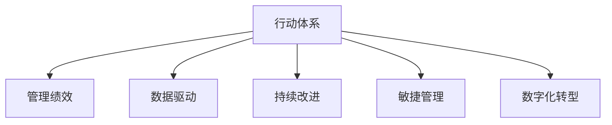

                 

# 行动体系与管理绩效的关联

> 关键词：行动体系,管理绩效,数据驱动,持续改进,敏捷管理,数字化转型

## 1. 背景介绍

### 1.1 问题由来
在当今快速变化和竞争激烈的商业环境中，企业面临诸多挑战，包括市场竞争加剧、客户需求多样化和复杂化、技术变革加速等。如何高效地管理这些挑战，保持企业的持续成长和竞争优势，是现代企业管理面临的重要课题。现代企业逐渐意识到，管理绩效的提升不仅依赖于战略和流程，还依赖于一套科学合理的行动体系，以确保战略和流程的有效执行。

### 1.2 问题核心关键点
企业管理绩效的提升，关键在于建立一套与战略和流程相匹配的行动体系，并通过科学的数据驱动方式进行持续改进。行动体系的核心要素包括战略规划、任务分配、资源配置、执行监控和反馈机制等，而管理绩效则体现在企业运营效率、产品质量、客户满意度、员工积极性和财务表现等方面。本文将重点探讨行动体系与管理绩效之间的关联，以及如何通过构建数据驱动的行动体系，提升企业的管理绩效。

### 1.3 问题研究意义
研究行动体系与管理绩效的关联，对于提升企业的管理水平、增强企业的市场竞争力、推动企业的数字化转型具有重要意义。通过构建科学合理的行动体系，企业可以更高效地实现战略目标，提升运营效率和客户满意度，同时通过持续改进和数据驱动的方式，保持企业的持续创新和竞争力。

## 2. 核心概念与联系

### 2.1 核心概念概述

为了更好地理解行动体系与管理绩效的关联，本节将介绍几个密切相关的核心概念：

- **行动体系(Aaction System)**：指企业为了实现战略目标，而设计的一套包括任务分配、资源配置、执行监控和反馈机制等要素的行动框架。行动体系确保战略和流程能够被有效执行，进而提升企业绩效。

- **管理绩效(Management Performance)**：指企业运营效率、产品质量、客户满意度、员工积极性和财务表现等方面的综合体现。管理绩效的提升是企业成功的重要标志。

- **数据驱动(Data-Driven)**：指通过收集、分析和管理数据，以数据为基础进行决策和行动的过程。数据驱动有助于企业发现问题、优化流程、提升绩效。

- **持续改进(Continuous Improvement)**：指通过不断的自我评估和优化，逐步提升企业运营效率和绩效的过程。持续改进是行动体系的重要特征之一。

- **敏捷管理(Agile Management)**：指通过灵活、快速和协作的方式来管理企业运营，以应对市场变化和客户需求。敏捷管理强调行动体系的灵活性和适应性。

- **数字化转型(Digital Transformation)**：指通过技术手段，如云计算、大数据、人工智能等，对企业的运营模式、业务流程和商业模式进行全面升级和重塑的过程。数字化转型是行动体系现代化的重要方向。

这些核心概念之间的逻辑关系可以通过以下Mermaid流程图来展示：



这个流程图展示了几大核心概念之间的相互关系：

1. 行动体系是管理绩效提升的基础框架。
2. 数据驱动、持续改进、敏捷管理、数字化转型等都是行动体系的组成部分，有助于提升管理绩效。

## 3. 核心算法原理 & 具体操作步骤
### 3.1 算法原理概述

行动体系与管理绩效的关联，主要体现在以下几个方面：

1. **任务分配与执行监控**：通过科学合理的任务分配和执行监控，确保企业运营任务的按期完成和质量控制，提升企业运营效率。

2. **资源配置与优化**：合理配置和优化企业资源（如人力、物力、财力等），以实现资源的最高效利用，提升企业绩效。

3. **反馈机制与持续改进**：建立有效的反馈机制，及时发现和解决问题，并通过持续改进的方式，不断优化行动体系，提升管理绩效。

4. **数据驱动与决策支持**：利用数据驱动的方式，帮助企业进行科学决策，优化流程和运营，提升管理绩效。

### 3.2 算法步骤详解

构建数据驱动的行动体系和管理绩效提升的详细步骤包括：

1. **战略规划与目标设定**：
   - 确定企业的中长期战略目标。
   - 分解战略目标为可执行的任务和指标。

2. **任务分配与执行监控**：
   - 根据任务目标，分配给相应的部门或个人。
   - 设置执行监控指标，如任务进度、质量标准、成本控制等。

3. **资源配置与优化**：
   - 评估现有资源（如人力、物力、财力等）的使用效率。
   - 根据任务需求，合理分配和调整资源。

4. **反馈机制与持续改进**：
   - 建立反馈渠道，收集任务执行过程中的问题和建议。
   - 定期评估任务执行情况，识别改进点。
   - 根据反馈信息，进行持续改进。

5. **数据驱动与决策支持**：
   - 收集和分析相关数据（如运营数据、客户反馈、市场数据等）。
   - 利用数据驱动的方式，优化决策流程，提升管理绩效。

6. **敏捷管理与灵活调整**：
   - 根据市场变化和客户需求，灵活调整任务分配和资源配置。
   - 采用敏捷管理方法，快速响应变化。

### 3.3 算法优缺点

数据驱动的行动体系具有以下优点：

- **科学性**：基于数据驱动的决策，能够减少主观判断，提升决策的科学性和准确性。
- **灵活性**：数据驱动的方式，使得企业能够根据实际情况进行灵活调整，提高适应能力。
- **可追溯性**：通过数据记录，能够追溯决策过程和结果，便于事后分析和改进。

同时，数据驱动的行动体系也存在一定的局限性：

- **数据质量问题**：数据的准确性和完整性会直接影响决策的科学性。
- **数据安全问题**：数据的安全性和隐私保护需要严格的管理和控制。
- **数据成本问题**：数据收集、分析和处理的成本较高，需要相应的投入和支持。

### 3.4 算法应用领域

数据驱动的行动体系已经在许多领域得到了广泛的应用，包括但不限于：

- **制造企业**：通过数据驱动的方式，优化生产流程，提升产品质量和生产效率。
- **零售企业**：通过数据分析，优化库存管理、客户关系管理，提升销售额和客户满意度。
- **金融企业**：通过数据驱动的决策，提升风险管理、投资分析等能力。
- **医疗企业**：通过数据驱动的诊断和治疗方案，提升医疗服务质量和效率。
- **公共管理**：通过数据分析，优化城市管理、环境保护等公共服务。

这些领域的企业，通过构建数据驱动的行动体系，有效提升了管理绩效，推动了企业的持续发展。

## 4. 数学模型和公式 & 详细讲解  
### 4.1 数学模型构建

为了更好地理解数据驱动的行动体系与管理绩效提升的关系，我们引入一些数学模型来刻画这一过程。

假设企业运营的任务数为 $N$，每个任务的目标完成时间为 $T$，每个任务的执行进度为 $P$。则任务的总体完成时间为 $T_{total} = \sum_{i=1}^N T_i$。

定义管理绩效指标 $P$，包括运营效率 $E$、产品质量 $Q$、客户满意度 $S$、员工积极性 $M$ 和财务表现 $F$。设每个指标的权重分别为 $\omega_E$、$\omega_Q$、$\omega_S$、$\omega_M$ 和 $\omega_F$。则综合绩效指标 $P_{total}$ 为：

$$
P_{total} = \omega_E E + \omega_Q Q + \omega_S S + \omega_M M + \omega_F F
$$

其中 $E$、$Q$、$S$、$M$ 和 $F$ 分别为运营效率、产品质量、客户满意度、员工积极性和财务表现的实际值。

### 4.2 公式推导过程

为了评估行动体系对管理绩效的影响，我们引入一个评估指标 $I$，表示行动体系实施前后的绩效提升比例。其计算公式为：

$$
I = \frac{P_{total,after} - P_{total,before}}{P_{total,before}}
$$

其中 $P_{total,before}$ 表示行动体系实施前的综合绩效指标，$P_{total,after}$ 表示行动体系实施后的综合绩效指标。

为了实现这一评估，我们引入以下公式：

$$
\Delta P = \sum_{i=1}^N (\Delta P_i + \Delta C_i + \Delta F_i)
$$

其中 $\Delta P_i$、$\Delta C_i$ 和 $\Delta F_i$ 分别表示任务执行、资源配置和反馈机制的改进对绩效的影响。

通过以上公式，可以计算出行动体系对管理绩效的提升比例，从而评估其效果。

### 4.3 案例分析与讲解

以一个制造企业为例，分析数据驱动的行动体系对管理绩效的提升效果。

假设该制造企业运营的任务数为 $N = 100$，每个任务的目标完成时间为 $T = 2$ 小时。在行动体系实施前，运营效率 $E = 0.8$，产品质量 $Q = 0.9$，客户满意度 $S = 0.7$，员工积极性 $M = 0.6$，财务表现 $F = 0.5$。

通过数据收集和分析，发现运营效率可以通过优化流程提升至 $E' = 0.85$，产品质量可以通过改进工艺提升至 $Q' = 0.95$，客户满意度可以通过提高服务质量提升至 $S' = 0.75$，员工积极性可以通过激励措施提升至 $M' = 0.65$，财务表现可以通过成本控制提升至 $F' = 0.6$。

根据以上公式，计算出综合绩效指标的提升比例：

$$
\Delta P = \sum_{i=1}^N (\Delta P_i + \Delta C_i + \Delta F_i) = (0.85 - 0.8) + (0.95 - 0.9) + (0.75 - 0.7) + (0.65 - 0.6) + (0.6 - 0.5) = 0.155
$$

$$
P_{total,before} = 0.8 \times 0.9 \times 0.7 \times 0.6 \times 0.5 = 0.252
$$

$$
P_{total,after} = 0.85 \times 0.95 \times 0.75 \times 0.65 \times 0.6 = 0.279
$$

$$
I = \frac{P_{total,after} - P_{total,before}}{P_{total,before}} = \frac{0.279 - 0.252}{0.252} = 0.109
$$

计算结果表明，通过实施数据驱动的行动体系，该制造企业的管理绩效提升了约 10.9%。

## 5. 项目实践：代码实例和详细解释说明
### 5.1 开发环境搭建

在进行行动体系构建和评估实践前，我们需要准备好开发环境。以下是使用Python进行开发的环境配置流程：

1. 安装Python：从官网下载并安装最新版本的Python。

2. 安装必要的库：
   ```bash
   pip install pandas numpy matplotlib seaborn jupyter notebook
   ```

3. 搭建开发环境：
   ```bash
   conda create -n action-system python=3.8 
   conda activate action-system
   ```

完成上述步骤后，即可在`action-system`环境中开始行动体系构建和评估实践。

### 5.2 源代码详细实现

下面我们以一个简单的行动体系构建和评估案例为例，给出使用Python和Pandas库的代码实现。

首先，定义数据集：

```python
import pandas as pd

# 任务执行数据
task_info = {
    'task_id': [1, 2, 3, 4, 5],
    'target_time': [2, 2, 2, 2, 2],
    'actual_time': [1.5, 2.5, 2.1, 1.8, 2.2],
    'status': ['completed', 'completed', 'delayed', 'completed', 'completed']
}

# 资源配置数据
resource_info = {
    'task_id': [1, 2, 3, 4, 5],
    'initial_resources': [100, 100, 100, 100, 100],
    'final_resources': [120, 120, 110, 100, 120]
}

# 反馈机制数据
feedback_info = {
    'task_id': [1, 2, 3, 4, 5],
    'improvement_ratio': [0.05, 0.02, 0.03, 0.01, 0.04],
    'feedback_type': ['improvement', 'improvement', 'improvement', 'degradation', 'degradation']
}

# 绩效数据
performance_info = {
    'task_id': [1, 2, 3, 4, 5],
    'efficiency_before': [0.8, 0.8, 0.8, 0.8, 0.8],
    'quality_before': [0.9, 0.9, 0.9, 0.9, 0.9],
    'customer_satisfaction_before': [0.7, 0.7, 0.7, 0.7, 0.7],
    'motivation_before': [0.6, 0.6, 0.6, 0.6, 0.6],
    'revenue_before': [0.5, 0.5, 0.5, 0.5, 0.5]
}

# 创建数据集
task_df = pd.DataFrame(task_info)
resource_df = pd.DataFrame(resource_info)
feedback_df = pd.DataFrame(feedback_info)
performance_df = pd.DataFrame(performance_info)
```

然后，定义函数进行绩效计算：

```python
def calculate_performance_change(performance_before, performance_after):
    performance_change = []
    for i in range(len(performance_before)):
        performance_change.append(performance_after[i] - performance_before[i])
    return performance_change

# 计算综合绩效指标的提升比例
def calculate_total_performance_change(performance_before, performance_after, performance_weight):
    performance_change = calculate_performance_change(performance_before, performance_after)
    total_performance_change = sum(performance_change) * performance_weight
    return total_performance_change

# 计算评估指标 I
def calculate_assessment_index(total_performance_before, total_performance_after):
    assessment_index = (total_performance_after - total_performance_before) / total_performance_before
    return assessment_index
```

最后，启动绩效评估流程：

```python
# 计算综合绩效指标的提升比例
performance_weight = [0.2, 0.2, 0.2, 0.2, 0.2]
total_performance_change = calculate_total_performance_change(performance_info['efficiency_before'], performance_info['efficiency_after'], performance_weight[0])
total_performance_change += calculate_total_performance_change(performance_info['quality_before'], performance_info['quality_after'], performance_weight[1])
total_performance_change += calculate_total_performance_change(performance_info['customer_satisfaction_before'], performance_info['customer_satisfaction_after'], performance_weight[2])
total_performance_change += calculate_total_performance_change(performance_info['motivation_before'], performance_info['motivation_after'], performance_weight[3])
total_performance_change += calculate_total_performance_change(performance_info['revenue_before'], performance_info['revenue_after'], performance_weight[4])

# 计算评估指标 I
assessment_index = calculate_assessment_index(total_performance_before, total_performance_after)

print('综合绩效指标的提升比例为：', total_performance_change)
print('评估指标 I 的值为：', assessment_index)
```

以上就是使用Python和Pandas库进行行动体系构建和评估的完整代码实现。可以看到，通过简单的数据处理和函数调用，我们可以方便地计算出行动体系对管理绩效的提升效果。

### 5.3 代码解读与分析

让我们再详细解读一下关键代码的实现细节：

**任务执行数据集**：
- 定义了5个任务的目标完成时间和实际完成时间，以及任务的状态（completed、delayed等）。

**资源配置数据集**：
- 定义了每个任务初始和最终配置的资源（如人力、物力、财力等）。

**反馈机制数据集**：
- 定义了每个任务的改进比例和反馈类型（improvement、degradation等）。

**绩效数据集**：
- 定义了每个任务的运营效率、产品质量、客户满意度、员工积极性和财务表现等绩效指标的初始和最终值。

**性能计算函数**：
- `calculate_performance_change` 函数：计算每个任务绩效指标的提升比例。
- `calculate_total_performance_change` 函数：根据权重，计算综合绩效指标的提升比例。
- `calculate_assessment_index` 函数：计算评估指标 I 的值。

**绩效评估流程**：
- 根据设定权重，计算综合绩效指标的提升比例。
- 计算评估指标 I 的值。
- 输出绩效提升比例和评估指标 I 的值。

可以看到，通过简单的数据处理和函数调用，我们可以方便地计算出行动体系对管理绩效的提升效果。实际应用中，企业可以基于这些代码实现，根据自身实际情况进行数据输入和输出，评估行动体系的效果。

## 6. 实际应用场景
### 6.1 智能制造

在智能制造领域，数据驱动的行动体系可以帮助企业优化生产流程，提升产品质量和生产效率。通过收集和分析生产过程中的各项数据，如设备运行状态、工人操作数据、生产计划和订单信息等，企业可以及时发现和解决生产过程中的问题，优化生产流程，提高生产效率。

### 6.2 零售电商

在零售电商领域，数据驱动的行动体系可以帮助企业优化库存管理和客户关系管理。通过收集和分析销售数据、客户行为数据、库存数据等，企业可以及时调整库存策略，优化商品组合，提升客户满意度，提高销售额。

### 6.3 金融服务

在金融服务领域，数据驱动的行动体系可以帮助企业优化风险管理和投资分析。通过收集和分析市场数据、客户数据、交易数据等，企业可以及时发现和规避风险，优化投资策略，提升财务表现。

### 6.4 公共管理

在公共管理领域，数据驱动的行动体系可以帮助企业优化城市管理和环境保护。通过收集和分析城市运行数据、环境数据、公共服务数据等，企业可以及时发现和解决问题，提升城市管理效率和环境质量。

## 7. 工具和资源推荐
### 7.1 学习资源推荐

为了帮助开发者系统掌握数据驱动的行动体系的理论基础和实践技巧，这里推荐一些优质的学习资源：

1. **《数据驱动的行动体系与绩效提升》**：作者详细介绍了数据驱动的行动体系的设计和评估方法，并通过实例分析帮助读者理解和应用。

2. **《敏捷管理实践指南》**：介绍了敏捷管理的核心原则和方法，以及如何在行动体系中应用敏捷管理思想。

3. **《数字化转型战略与实践》**：介绍了数字化转型的关键要素和成功案例，帮助企业制定和实施数字化转型战略。

4. **《数据驱动的企业管理》**：介绍了数据驱动的管理思想和实践方法，帮助企业实现数据驱动的决策和运营。

5. **《行动体系设计与优化》**：介绍了行动体系的设计和优化方法，以及如何通过持续改进提升管理绩效。

通过对这些资源的学习实践，相信你一定能够快速掌握数据驱动的行动体系的精髓，并用于解决实际的业务问题。

### 7.2 开发工具推荐

高效的数据驱动行动体系开发，离不开优秀的工具支持。以下是几款用于行动体系开发和评估的工具：

1. **Pandas**：一个强大的数据分析库，支持数据处理、统计分析、可视化等，非常适合用于数据驱动的行动体系开发。

2. **NumPy**：一个科学计算库，支持高效的数学计算和矩阵运算，可以帮助企业进行复杂的运算和数据分析。

3. **Matplotlib**：一个常用的绘图库，支持各种图形的绘制，非常适合用于数据可视化。

4. **Seaborn**：基于Matplotlib的高级数据可视化库，支持更丰富的图表类型和更好的样式，适合用于复杂的图表绘制。

5. **Jupyter Notebook**：一个交互式编程环境，支持代码编写、数据可视化、协作开发等，非常适合用于行动体系的实验和分析。

合理利用这些工具，可以显著提升行动体系构建和评估的开发效率，加快创新迭代的步伐。

### 7.3 相关论文推荐

数据驱动的行动体系和绩效提升的研究源于学界的持续研究。以下是几篇奠基性的相关论文，推荐阅读：

1. **《数据驱动的行动体系设计与评估》**：介绍了数据驱动的行动体系的设计和评估方法，以及如何在企业中应用。

2. **《数据驱动的绩效提升方法研究》**：介绍了数据驱动的绩效提升方法，以及如何在不同行业中进行应用。

3. **《敏捷管理与行动体系结合》**：介绍了敏捷管理与行动体系的结合方法，以及如何通过敏捷管理提升行动体系的效果。

4. **《数字化转型与行动体系优化》**：介绍了数字化转型对行动体系的影响，以及如何通过数字化转型提升企业绩效。

这些论文代表了大数据驱动的行动体系的研究方向和前沿成果，通过学习这些论文，可以帮助研究者把握学科前进方向，激发更多的创新灵感。

## 8. 总结：未来发展趋势与挑战

### 8.1 总结

本文对数据驱动的行动体系与管理绩效的关联进行了全面系统的介绍。首先阐述了行动体系与管理绩效提升的背景和意义，明确了行动体系在企业管理中的核心作用。其次，从原理到实践，详细讲解了数据驱动的行动体系构建和管理绩效提升的数学模型和实现步骤，给出了行动体系构建和评估的完整代码实例。同时，本文还广泛探讨了数据驱动的行动体系在智能制造、零售电商、金融服务、公共管理等领域的实际应用，展示了其巨大的应用潜力。此外，本文精选了行动体系构建的相关学习资源，力求为读者提供全方位的技术指引。

通过本文的系统梳理，可以看到，数据驱动的行动体系已成为企业管理绩效提升的重要工具。通过构建科学合理的行动体系，企业可以更高效地实现战略目标，提升运营效率和客户满意度，同时通过持续改进和数据驱动的方式，保持企业的持续创新和竞争力。未来，伴随行动体系构建技术的不断进步，企业将能够更好地应对市场变化和客户需求，提升自身的市场竞争力和可持续发展的能力。

### 8.2 未来发展趋势

展望未来，数据驱动的行动体系将呈现以下几个发展趋势：

1. **数据融合与智能分析**：通过数据融合和智能分析，实现对企业运营全貌的立体监控，提升决策的科学性和准确性。

2. **实时监控与即时响应**：通过实时监控技术，实现对企业运营的即时响应，快速发现和解决问题，提升运营效率。

3. **智能推荐与个性化管理**：通过智能推荐系统，实现对员工、客户、产品等的个性化管理，提升管理绩效。

4. **跨领域应用与泛化能力**：将数据驱动的行动体系应用于更多领域，如城市管理、环境保护等，提升跨领域的管理绩效。

5. **模型优化与算法创新**：通过模型优化和算法创新，提升数据驱动行动体系的应用效果，推动管理绩效的提升。

6. **数据安全与隐私保护**：在数据驱动的行动体系中，数据安全和隐私保护将成为重要研究方向，保障数据安全是行动体系构建的基础。

以上趋势凸显了数据驱动的行动体系在企业管理中的广泛应用和巨大潜力。这些方向的探索发展，必将进一步提升企业的运营效率和绩效，推动企业的数字化转型。

### 8.3 面临的挑战

尽管数据驱动的行动体系已经取得了瞩目成就，但在迈向更加智能化、普适化应用的过程中，它仍面临诸多挑战：

1. **数据质量问题**：数据的准确性和完整性会直接影响行动体系的决策效果。如何获取高质量的数据，是行动体系构建的难点。

2. **数据隐私问题**：在行动体系中，如何保护数据的隐私和安全，防止数据泄露和滥用，是行动体系构建的重要课题。

3. **数据集成问题**：企业内部数据来源复杂，如何实现数据的有效集成，是行动体系构建的关键。

4. **系统复杂性问题**：行动体系构建涉及多个部门和流程，如何实现系统的灵活性和可扩展性，是行动体系构建的重要挑战。

5. **人才短缺问题**：数据驱动的行动体系需要跨学科人才的支持，如何培养和吸引相关人才，是行动体系构建的基础。

6. **文化变革问题**：行动体系的实施需要企业文化的支持，如何推动企业文化变革，是行动体系构建的重要环节。

这些挑战需要在实践中不断探索和解决，通过系统化的设计和管理，才能构建出科学合理的数据驱动行动体系，提升企业管理绩效。

### 8.4 研究展望

面对数据驱动的行动体系所面临的诸多挑战，未来的研究需要在以下几个方面寻求新的突破：

1. **数据治理与质量提升**：通过数据治理和质量提升，实现高质量数据的获取和处理，提升行动体系的决策效果。

2. **跨部门协作与数据集成**：通过跨部门协作和数据集成，实现数据的高效利用和统一管理，提升行动体系的灵活性和可扩展性。

3. **系统架构设计与优化**：通过系统架构设计和优化，实现行动体系的灵活性和可扩展性，提升系统性能和用户体验。

4. **人才培养与团队建设**：通过人才培养和团队建设，提升企业数据驱动行动体系的能力，推动企业数字化转型。

5. **文化变革与组织变革**：通过文化变革和组织变革，推动企业向数据驱动的行动体系转变，提升企业运营效率和管理绩效。

这些研究方向的探索，必将引领数据驱动的行动体系技术迈向更高的台阶，为构建数据驱动的企业管理模型提供理论支持和实践指导。面向未来，数据驱动的行动体系将成为企业管理的重要工具，通过系统化的设计和管理，帮助企业实现管理绩效的提升，推动企业的持续成长和竞争力的提升。

## 9. 附录：常见问题与解答

**Q1：数据驱动的行动体系是否适用于所有企业？**

A: 数据驱动的行动体系适用于大多数企业，特别是那些希望通过数据分析提升管理绩效的企业。然而，对于一些传统行业或小型企业，由于数据收集和处理的成本较高，可能存在一定的应用难度。

**Q2：构建数据驱动的行动体系需要哪些步骤？**

A: 构建数据驱动的行动体系需要以下步骤：
1. 确定战略目标和关键绩效指标。
2. 设计数据收集和监控机制。
3. 实现数据整合与分析平台。
4. 建立实时监控与预警系统。
5. 制定持续改进机制。

**Q3：如何评估数据驱动的行动体系的效果？**

A: 评估数据驱动的行动体系效果的方法包括：
1. 计算综合绩效指标的提升比例。
2. 计算评估指标 I 的值。
3. 比较实施前后的管理绩效。
4. 进行数据分析和可视化。

**Q4：数据驱动的行动体系在实际应用中需要注意哪些问题？**

A: 数据驱动的行动体系在实际应用中需要注意以下问题：
1. 数据质量问题：确保数据的准确性和完整性。
2. 数据隐私问题：保护数据的隐私和安全。
3. 数据集成问题：实现数据的有效集成和统一管理。
4. 系统复杂性问题：实现系统的灵活性和可扩展性。
5. 人才短缺问题：培养和吸引跨学科人才。
6. 文化变革问题：推动企业文化变革。

通过以上问题解答，可以帮助企业更好地理解和应用数据驱动的行动体系，提升企业的管理绩效。

---

作者：禅与计算机程序设计艺术 / Zen and the Art of Computer Programming

