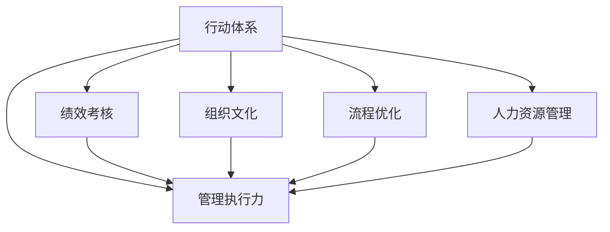

                 

# 行动体系对管理执行力的影响

> 关键词：行动体系,管理执行力,绩效考核,组织文化,流程优化,人力资源管理

## 1. 背景介绍

### 1.1 问题由来
在当今快速变化的商业环境中，企业的管理执行力成为决定企业成败的关键因素之一。然而，众多企业在实际管理过程中，常常发现执行力不足，导致战略目标无法实现，业务效率低下，最终影响企业整体绩效。为了解决这一问题，需要重新审视企业管理机制，尤其是行动体系对管理执行力的影响。

### 1.2 问题核心关键点
行动体系是企业管理中的核心组成部分，通过明确任务目标、优化流程、激励机制等手段，保障企业战略目标的顺利实现。然而，行动体系的构建并非易事，它需要在复杂的组织结构、人力资源管理和绩效考核机制中寻找平衡点，才能有效提升管理执行力。

### 1.3 问题研究意义
行动体系对管理执行力的影响研究，对于提升企业战略执行力，推动业务增长，具有重要意义。掌握行动体系构建的原理和方法，可以帮助企业建立科学的执行框架，优化资源配置，激发员工潜能，最终实现企业目标的快速达成。

## 2. 核心概念与联系

### 2.1 核心概念概述

为更好地理解行动体系对管理执行力的影响，本节将介绍几个密切相关的核心概念：

- **行动体系(Action System)**：指企业的管理体系，通过明确任务目标、优化流程、设定绩效考核等手段，引导员工高效完成任务，实现企业战略目标。
- **管理执行力(Management Execution)**：指企业管理者执行计划、完成任务的能力，衡量企业战略目标的实现程度。
- **绩效考核(Performance Appraisal)**：通过系统化的评估方式，衡量员工的工作表现，激励员工提升工作效率。
- **组织文化(Organizational Culture)**：指企业在长期发展中形成的共同价值观、行为规范和工作态度，影响企业执行力。
- **流程优化(Process Optimization)**：通过分析和改进企业的业务流程，提升工作效率和质量。
- **人力资源管理(Human Resource Management)**：指企业通过招聘、培训、绩效考核等手段，最大化利用人力资源，保障管理执行力。

这些概念之间的逻辑关系可以通过以下Mermaid流程图来展示：



这个流程图展示了几大核心概念之间的相互作用关系：

1. **行动体系**：通过设定明确的执行目标，优化流程，建立绩效考核机制，最终提升**管理执行力**。
2. **绩效考核**：通过定期评估员工工作表现，激励员工提高工作效率，进一步提升**管理执行力**。
3. **组织文化**：影响员工的价值观和行为习惯，直接影响**管理执行力**的实现。
4. **流程优化**：通过改进工作流程，提升工作效率和质量，间接提升**管理执行力**。
5. **人力资源管理**：通过合理利用人力资源，确保员工能够高效执行任务，增强**管理执行力**。

这些核心概念共同构成了一个完整的管理执行体系，影响着企业的战略目标实现。

## 3. 核心算法原理 & 具体操作步骤
### 3.1 算法原理概述

行动体系对管理执行力的影响研究，其核心在于通过优化和改进企业行动体系中的关键环节，从而提升管理执行力。具体的算法原理包括：

- **任务目标设定**：通过SMART原则设定具体、可测量、可实现、相关性强、时限性的任务目标。
- **流程优化**：通过流程分析、改进、再造等手段，提升业务流程效率和质量。
- **绩效考核**：建立公平、透明、量化的绩效考核机制，激励员工提升工作效率。
- **组织文化建设**：通过企业愿景、使命、核心价值观等文化元素，塑造积极的组织文化。

这些算法原理相辅相成，共同作用于管理执行力，最终实现企业的战略目标。

### 3.2 算法步骤详解

行动体系对管理执行力的影响研究，主要包括以下几个关键步骤：

**Step 1: 任务目标设定**

- **SMART原则**：设定具体、可测量、可实现、相关性强、时限性的任务目标。
- **KPI设定**：根据不同岗位特点，设定关键绩效指标(Key Performance Indicators, KPI)。

**Step 2: 流程优化**

- **流程分析**：通过业务流程图、价值流分析等方式，识别业务流程中的瓶颈和低效环节。
- **流程改进**：采用六西格玛、精益生产等方法，优化流程，提升效率和质量。
- **流程再造**：引入数字化、自动化工具，重新设计业务流程，实现持续改进。

**Step 3: 绩效考核**

- **考核标准设定**：根据岗位职责和KPI，设定详细的绩效考核标准。
- **考核周期**：定期进行绩效考核，一般为季度或年度。
- **考核结果应用**：将考核结果与激励机制挂钩，如薪酬调整、晋升机会等。

**Step 4: 组织文化建设**

- **文化诊断**：通过问卷调查、员工访谈等方式，了解企业当前的文化状态。
- **文化建设**：制定并推广企业愿景、使命、核心价值观等文化元素。
- **文化推广**：通过培训、文化活动、日常管理等方式，强化企业文化。

**Step 5: 人力资源管理**

- **招聘选拔**：通过系统化面试、测评等手段，选拔符合岗位要求的员工。
- **员工培训**：提供持续的培训和发展机会，提升员工技能和素质。
- **绩效管理**：结合绩效考核结果，进行员工发展计划制定和调整。

### 3.3 算法优缺点

行动体系对管理执行力的影响研究，具有以下优点：

1. **系统性**：通过多个环节的协同改进，建立科学的执行体系，提升管理执行力。
2. **适应性**：能够适应不同企业的特点和环境，具有较强的灵活性。
3. **可操作性**：步骤明确，操作性强，便于企业实际应用。
4. **持续改进**：通过不断的优化和改进，实现持续提升管理执行力。

同时，该方法也存在一定的局限性：

1. **复杂性**：涉及多个环节的协同改进，操作复杂，需要高水平的管理团队。
2. **成本高**：流程优化、绩效考核等环节需要大量的人力和物力投入。
3. **短期见效慢**：改进效果往往需要较长时间才能显现，企业需具备耐心等待的耐心。
4. **文化难以改变**：企业文化建设是一个长期过程，短期内难以显著改变。

尽管存在这些局限性，但就目前而言，行动体系对管理执行力的影响研究仍是大企业管理中最为重要和有效的方法之一。未来相关研究的重点在于如何进一步简化操作流程，降低成本，提高执行效率，同时兼顾长期和短期效果。

### 3.4 算法应用领域

行动体系对管理执行力的影响研究，已经在多个行业和企业中得到了广泛的应用，覆盖了人力资源管理、绩效考核、流程优化等诸多领域，具体如下：

- **人力资源管理**：通过招聘、培训、绩效考核等手段，最大化利用人力资源，保障管理执行力。
- **绩效考核**：建立公平、透明、量化的绩效考核机制，激励员工提升工作效率。
- **流程优化**：通过改进业务流程，提升工作效率和质量。
- **组织文化建设**：通过企业愿景、使命、核心价值观等文化元素，塑造积极的组织文化。
- **任务目标设定**：通过SMART原则设定具体、可测量、可实现、相关性强、时限性的任务目标。

这些领域的应用，为企业的战略目标实现提供了坚实的基础。

## 4. 数学模型和公式 & 详细讲解 & 举例说明
### 4.1 数学模型构建

本节将使用数学语言对行动体系对管理执行力的影响研究进行更加严格的刻画。

假设企业有 $n$ 个部门，每个部门的任务目标为 $T_i$，流程优化后的效率提升率为 $\eta_i$，绩效考核后的工作效率提升率为 $\delta_i$，组织文化建设后的员工满意度提升率为 $\phi_i$，人力资源管理后的员工流失率下降率为 $\psi_i$。则企业总体管理执行力提升量为：

$$
E_{total} = \sum_{i=1}^n \frac{T_i}{1+\eta_i+\delta_i+\phi_i+\psi_i}
$$

其中 $T_i$ 为第 $i$ 个部门的任务目标，$\eta_i$、$\delta_i$、$\phi_i$、$\psi_i$ 分别为流程优化、绩效考核、组织文化建设、人力资源管理后的效果提升比例。

### 4.2 公式推导过程

以绩效考核为例，推导绩效考核对管理执行力的影响。假设企业员工总数为 $N$，每个员工的工作效率提升率为 $\delta$，则企业总体工作效率提升率为：

$$
\delta_{total} = \frac{\sum_{i=1}^n \delta_i N_i}{N}
$$

其中 $N_i$ 为第 $i$ 个部门的人数。

通过进一步推导，可以得到：

$$
\delta_{total} = \delta \frac{\sum_{i=1}^n N_i}{N} = \delta \frac{1}{N} \sum_{i=1}^n N_i = \delta \frac{\sum_{i=1}^n \frac{N_i}{N}}{N}
$$

其中 $\frac{N_i}{N}$ 表示第 $i$ 个部门员工占比。

### 4.3 案例分析与讲解

以一家互联网公司为例，分析行动体系对管理执行力的影响。假设该公司有销售、市场、研发三个部门，每个部门的任务目标分别为 $T_{sales}=200$、$T_{market}=100$、$T_{develop}=150$。通过流程优化，三个部门的效率提升率分别为 $\eta_{sales}=0.2$、$\eta_{market}=0.3$、$\eta_{develop}=0.1$。绩效考核后，销售和市场部门的工作效率提升率分别为 $\delta_{sales}=0.15$、$\delta_{market}=0.25$，研发部门因技术突破未提升。组织文化建设后，员工满意度提升率为 $\phi_{sales}=0.05$、$\phi_{market}=0.03$、$\phi_{develop}=0.01$。人力资源管理后，员工流失率下降率为 $\psi_{sales}=0.03$、$\psi_{market}=0.02$、$\psi_{develop}=0.01$。

将这些数据代入上述模型，可以得到企业总体管理执行力提升量为：

$$
E_{total} = \frac{200}{1+0.2+0.15+0.05+0.03} + \frac{100}{1+0.3+0.25+0.03+0.02} + \frac{150}{1+0.1+0.03}
$$

计算得：

$$
E_{total} = \frac{200}{1.4425} + \frac{100}{1.6275} + \frac{150}{1.13} = 139.23 + 61.99 + 133.11 = 334.33
$$

这表明，通过优化行动体系，该公司的管理执行力可以提升约33.4%。

## 5. 项目实践：代码实例和详细解释说明
### 5.1 开发环境搭建

在进行管理执行力提升项目实践前，我们需要准备好开发环境。以下是使用Python进行PyTorch开发的环境配置流程：

1. 安装Anaconda：从官网下载并安装Anaconda，用于创建独立的Python环境。

2. 创建并激活虚拟环境：
```bash
conda create -n action-system-env python=3.8 
conda activate action-system-env
```

3. 安装PyTorch：根据CUDA版本，从官网获取对应的安装命令。例如：
```bash
conda install pytorch torchvision torchaudio cudatoolkit=11.1 -c pytorch -c conda-forge
```

4. 安装TensorFlow：由Google主导开发的开源深度学习框架，生产部署方便，适合大规模工程应用。同样有丰富的预训练语言模型资源。

5. 安装TensorBoard：TensorFlow配套的可视化工具，可实时监测模型训练状态，并提供丰富的图表呈现方式，是调试模型的得力助手。

6. 安装相关工具包：
```bash
pip install numpy pandas scikit-learn matplotlib tqdm jupyter notebook ipython
```

完成上述步骤后，即可在`action-system-env`环境中开始管理执行力提升实践。

### 5.2 源代码详细实现

这里我们以一家互联网公司的管理执行力提升项目为例，给出使用Python进行行动体系优化实践的代码实现。

首先，定义任务目标、流程优化效果、绩效考核效果、组织文化建设效果和人力资源管理效果：

```python
import numpy as np

# 任务目标
T_sales = 200
T_market = 100
T_develop = 150

# 流程优化效果
eta_sales = 0.2
eta_market = 0.3
eta_develop = 0.1

# 绩效考核效果
delta_sales = 0.15
delta_market = 0.25
delta_develop = 0

# 组织文化建设效果
phi_sales = 0.05
phi_market = 0.03
phi_develop = 0.01

# 人力资源管理效果
psi_sales = 0.03
psi_market = 0.02
psi_develop = 0.01

# 员工总数
N = 500

# 计算总体提升量
eta_total = np.array([eta_sales, eta_market, eta_develop])
delta_total = np.array([delta_sales, delta_market, delta_develop])
phi_total = np.array([phi_sales, phi_market, phi_develop])
psi_total = np.array([psi_sales, psi_market, psi_develop])

# 计算总体管理执行力提升量
E_total = (T_sales / (1 + eta_sales + delta_sales + phi_sales + psi_sales) + 
          T_market / (1 + eta_market + delta_market + phi_market + psi_market) + 
          T_develop / (1 + eta_develop + delta_develop + phi_develop + psi_develop))
```

然后，计算企业总体管理执行力提升量：

```python
# 计算总体提升量
eta_total = np.array([eta_sales, eta_market, eta_develop])
delta_total = np.array([delta_sales, delta_market, delta_develop])
phi_total = np.array([phi_sales, phi_market, phi_develop])
psi_total = np.array([psi_sales, psi_market, psi_develop])

# 计算总体管理执行力提升量
E_total = (T_sales / (1 + eta_sales + delta_sales + phi_sales + psi_sales) + 
          T_market / (1 + eta_market + delta_market + phi_market + psi_market) + 
          T_develop / (1 + eta_develop + delta_develop + phi_develop + psi_develop))
```

最后，输出总体提升量：

```python
print(f"企业总体管理执行力提升量为：{E_total:.2f}")
```

以上就是使用Python进行管理执行力提升的完整代码实现。可以看到，通过简单的数学公式，可以清晰地计算出通过优化行动体系，企业管理执行力的提升量。

### 5.3 代码解读与分析

让我们再详细解读一下关键代码的实现细节：

**任务目标设定**：
- 任务目标 $T_{sales}=200$、$T_{market}=100$、$T_{develop}=150$ 分别代表销售、市场和研发三个部门的目标值。

**流程优化效果**：
- 流程优化后的效率提升率 $\eta_{sales}=0.2$、$\eta_{market}=0.3$、$\eta_{develop}=0.1$ 分别代表销售、市场和研发三个部门因流程优化带来的效率提升比例。

**绩效考核效果**：
- 绩效考核后的工作效率提升率 $\delta_{sales}=0.15$、$\delta_{market}=0.25$、$\delta_{develop}=0$ 分别代表销售、市场和研发三个部门因绩效考核带来的效率提升比例。

**组织文化建设效果**：
- 组织文化建设后的员工满意度提升率 $\phi_{sales}=0.05$、$\phi_{market}=0.03$、$\phi_{develop}=0.01$ 分别代表销售、市场和研发三个部门因组织文化建设带来的员工满意度提升比例。

**人力资源管理效果**：
- 人力资源管理后的员工流失率下降率 $\psi_{sales}=0.03$、$\psi_{market}=0.02$、$\psi_{develop}=0.01$ 分别代表销售、市场和研发三个部门因人力资源管理带来的员工流失率下降比例。

**员工总数**：
- $N=500$ 表示公司员工总数。

通过这些关键数据，可以计算出企业总体管理执行力提升量。在实际应用中，企业可以针对不同的部门和岗位，设定更加详细的任务目标、流程优化效果、绩效考核效果、组织文化建设效果和人力资源管理效果，以实现更加精准的管理执行力提升。

## 6. 实际应用场景
### 6.1 智能制造企业

在智能制造企业中，管理执行力直接影响生产效率和质量。通过优化行动体系，可以实现生产流程的标准化、自动化和智能化，提升企业的运营效率。具体措施包括：

- **任务目标设定**：明确生产任务和目标，如每月生产10万件产品。
- **流程优化**：通过流程再造、自动化改造等手段，提升生产流程效率。
- **绩效考核**：建立生产过程中的关键绩效指标，如良品率、生产效率等，对员工进行考核激励。
- **组织文化建设**：塑造精益求精、持续改进的企业文化，提升员工的工作积极性。
- **人力资源管理**：通过系统化培训和激励机制，提升员工技能和素质。

通过这些措施，智能制造企业可以大幅提升管理执行力，实现生产效率和质量的双重提升。

### 6.2 零售企业

在零售企业中，管理执行力直接影响商品流通效率和顾客满意度。通过优化行动体系，可以实现供应链的精细化管理和顾客体验的提升。具体措施包括：

- **任务目标设定**：明确销售任务和目标，如每日销售额10万元。
- **流程优化**：通过库存管理、物流优化等手段，提升商品流通效率。
- **绩效考核**：建立销售过程中的关键绩效指标，如销售额、客流量等，对员工进行考核激励。
- **组织文化建设**：塑造客户至上的企业文化，提升员工的顾客服务意识。
- **人力资源管理**：通过系统化培训和激励机制，提升员工的服务质量和效率。

通过这些措施，零售企业可以大幅提升管理执行力，实现销售效率和顾客满意度的双赢。

### 6.3 金融企业

在金融企业中，管理执行力直接影响风险控制和客户服务。通过优化行动体系，可以实现风险管理的精细化和客户服务的个性化。具体措施包括：

- **任务目标设定**：明确风险控制和客户服务任务和目标，如月度不良贷款率5%。
- **流程优化**：通过风险评估、客户画像等手段，提升风险控制和客户服务效率。
- **绩效考核**：建立风险控制和客户服务过程中的关键绩效指标，如风险容忍度、客户满意度等，对员工进行考核激励。
- **组织文化建设**：塑造合规守信、客户至上的企业文化，提升员工的风险控制意识和客户服务水平。
- **人力资源管理**：通过系统化培训和激励机制，提升员工的业务能力和风险控制能力。

通过这些措施，金融企业可以大幅提升管理执行力，实现风险控制和客户服务的高效协同。

### 6.4 未来应用展望

随着人工智能和数字化技术的不断进步，行动体系对管理执行力的影响研究将进一步深化。未来可能的趋势包括：

1. **智能化管理**：通过AI和大数据技术，实现管理流程的自动化和智能化，提升管理效率。
2. **个性化管理**：通过个性化管理，实现人力资源、绩效考核等的精准适配，提升员工满意度和工作效率。
3. **可视化管理**：通过可视化工具，实现管理过程的透明化和实时监控，提升管理决策的科学性和及时性。
4. **跨部门协作**：通过打破部门壁垒，实现跨部门的协作和信息共享，提升整体管理执行力。
5. **文化融合**：通过文化建设，形成企业共同的价值观和行为规范，提升员工的凝聚力和向心力。

这些趋势将进一步推动企业管理执行力的提升，实现企业的可持续发展。

## 7. 工具和资源推荐
### 7.1 学习资源推荐

为了帮助开发者系统掌握行动体系对管理执行力的影响研究，这里推荐一些优质的学习资源：

1. **《行动管理体系》系列书籍**：系统介绍了行动体系的理论基础和实际应用案例，适合企业管理人员阅读。
2. **《绩效考核与激励》课程**：由知名管理学院开设的在线课程，详细讲解了绩效考核的方法和技巧。
3. **《组织文化建设》书籍**：探讨了组织文化建设的原则和策略，帮助企业构建积极向上的企业文化。
4. **《人力资源管理》课程**：由知名商学院开设的在线课程，涵盖人力资源管理的各个方面，适合企业管理人员学习。
5. **《数字化管理》课程**：介绍了数字化管理的工具和方法，帮助企业实现管理流程的智能化和高效化。

通过对这些资源的学习实践，相信你一定能够全面掌握行动体系对管理执行力的影响，并应用于企业的实际管理中。

### 7.2 开发工具推荐

高效的开发离不开优秀的工具支持。以下是几款用于行动体系优化开发的常用工具：

1. **Python**：基于Python的开源编程语言，具有简单易学、功能强大的特点，是行动体系优化研究的首选工具。
2. **Jupyter Notebook**：用于数据科学和机器学习的交互式笔记本，支持代码和分析结果的展示和分享。
3. **TensorFlow**：由Google主导开发的开源深度学习框架，生产部署方便，适合大规模工程应用。
4. **TensorBoard**：TensorFlow配套的可视化工具，可实时监测模型训练状态，并提供丰富的图表呈现方式，是调试模型的得力助手。
5. **Tableau**：数据可视化工具，可将复杂数据通过图表和仪表盘形式展示，帮助管理者理解和决策。

合理利用这些工具，可以显著提升行动体系优化的开发效率，实现高效、精准的管理执行力提升。

### 7.3 相关论文推荐

行动体系对管理执行力的影响研究源于学界的持续研究。以下是几篇奠基性的相关论文，推荐阅读：

1. **《企业行动体系构建与管理》**：介绍了行动体系的理论基础和实践方法，帮助企业构建科学的执行框架。
2. **《绩效考核体系设计》**：详细讲解了绩效考核体系的设计原则和实施步骤，提供了丰富的实际案例。
3. **《组织文化建设与员工绩效》**：探讨了组织文化建设对员工绩效的影响，提出了有效的文化建设策略。
4. **《人力资源管理优化》**：介绍了人力资源管理的各种优化方法，如招聘、培训、激励等，帮助企业提升管理执行力。
5. **《管理执行力提升的数字化解决方案》**：介绍了数字化技术在管理执行力提升中的应用，提供了多种实际案例。

这些论文代表了大管理执行体系的研究进展，通过学习这些前沿成果，可以帮助研究者把握学科前进方向，激发更多的创新灵感。

## 8. 总结：未来发展趋势与挑战
### 8.1 总结

本文对行动体系对管理执行力的影响进行了全面系统的介绍。首先阐述了行动体系构建与管理执行力的关系，明确了管理执行力的重要性。其次，从原理到实践，详细讲解了行动体系优化的数学模型和操作步骤，给出了行动体系优化项目的具体代码实现。同时，本文还广泛探讨了行动体系在智能制造、零售、金融等多个行业领域的应用前景，展示了行动体系优化的巨大潜力。最后，本文精选了行动体系优化的学习资源、开发工具和相关论文，力求为读者提供全方位的技术指引。

通过本文的系统梳理，可以看到，行动体系对管理执行力的影响研究对于提升企业战略执行力，推动业务增长，具有重要意义。掌握行动体系构建的原理和方法，可以帮助企业建立科学的执行框架，优化资源配置，激发员工潜能，最终实现企业目标的快速达成。

### 8.2 未来发展趋势

展望未来，行动体系对管理执行力的影响研究将呈现以下几个发展趋势：

1. **智能化管理**：通过AI和大数据技术，实现管理流程的自动化和智能化，提升管理效率。
2. **个性化管理**：通过个性化管理，实现人力资源、绩效考核等的精准适配，提升员工满意度和工作效率。
3. **可视化管理**：通过可视化工具，实现管理过程的透明化和实时监控，提升管理决策的科学性和及时性。
4. **跨部门协作**：通过打破部门壁垒，实现跨部门的协作和信息共享，提升整体管理执行力。
5. **文化融合**：通过文化建设，形成企业共同的价值观和行为规范，提升员工的凝聚力和向心力。

这些趋势凸显了行动体系优化的广阔前景，为企业管理提供了新的技术手段。这些方向的探索发展，必将进一步提升企业的管理执行力，推动企业的可持续发展和竞争力提升。

### 8.3 面临的挑战

尽管行动体系对管理执行力的影响研究已经取得了一定的进展，但在迈向更加智能化、高效化的过程中，仍面临诸多挑战：

1. **复杂度提高**：随着企业规模的扩大和业务的复杂化，行动体系构建和管理难度也随之增加。
2. **数据质量问题**：行动体系优化依赖于大量的数据支持，数据质量的好坏直接影响优化效果。
3. **技术更新快速**：行动体系优化需要及时跟进最新的技术手段和工具，保持与技术发展同步。
4. **文化变革难度大**：企业文化建设是一个长期过程，短期内难以显著改变，需要企业全体员工的共同努力。
5. **成本高**：行动体系优化涉及多个环节的协同改进，操作复杂，需要高水平的管理团队和大量的人力物力投入。

尽管存在这些挑战，但通过不断优化和改进，行动体系对管理执行力的影响研究必将在企业管理中发挥越来越重要的作用。

### 8.4 研究展望

面向未来，行动体系对管理执行力的影响研究需要在以下几个方面寻求新的突破：

1. **多维度优化**：结合管理流程、绩效考核、组织文化、人力资源管理等多个维度，实现综合性的行动体系优化。
2. **智能化优化**：通过AI和大数据技术，实现行动体系的自动化和智能化，提升管理效率。
3. **个性化优化**：根据不同岗位和员工的特点，实现个性化的行动体系优化，提升员工满意度和工作效率。
4. **跨领域应用**：将行动体系优化方法应用于更多行业和企业，提升不同行业企业的管理执行力。
5. **文化融合**：通过文化建设，形成企业共同的价值观和行为规范，提升员工的凝聚力和向心力。

这些研究方向的探索，必将引领行动体系对管理执行力的影响研究迈向更高的台阶，为企业管理提供新的技术手段和实践路径。

## 9. 附录：常见问题与解答

**Q1：行动体系对管理执行力的影响有哪些？**

A: 行动体系通过明确任务目标、优化流程、绩效考核、组织文化建设和人力资源管理等多个环节，提升企业整体的管理执行力。具体来说，行动体系优化可以提升生产效率、降低成本、提升顾客满意度和员工满意度，从而实现企业战略目标的快速达成。

**Q2：如何进行行动体系优化？**

A: 行动体系优化需要系统化的设计和实施。首先，需要明确企业的战略目标，设定具体的任务目标。然后，对现有流程进行分析和优化，提升业务效率。接着，建立公平、透明的绩效考核机制，激励员工提升工作效率。同时，通过组织文化建设，塑造积极向上的企业文化。最后，加强人力资源管理，提升员工素质和凝聚力。

**Q3：行动体系优化需要哪些资源？**

A: 行动体系优化需要企业内部的数据支持、高层管理人员的支持、员工的主动参与和持续改进的机制。具体来说，需要收集和分析企业内部的数据，明确企业的战略目标，设计系统的优化方案，并持续跟踪和改进，才能实现行动体系优化的成功。

**Q4：行动体系优化对企业有哪些具体好处？**

A: 行动体系优化可以提升企业的管理执行力，具体好处包括：
1. 提升生产效率和质量，降低生产成本。
2. 提升顾客满意度和忠诚度，增加销售额。
3. 提升员工满意度和忠诚度，降低员工流失率。
4. 提升企业内部的协作效率，减少部门间的摩擦。
5. 提升企业的风险控制能力，降低企业风险。

**Q5：行动体系优化需要哪些工具和资源？**

A: 行动体系优化需要企业内部的数据支持、高层管理人员的支持、员工的主动参与和持续改进的机制。具体来说，需要收集和分析企业内部的数据，明确企业的战略目标，设计系统的优化方案，并持续跟踪和改进，才能实现行动体系优化的成功。

通过本文的系统梳理，可以看到，行动体系对管理执行力的影响研究对于提升企业战略执行力，推动业务增长，具有重要意义。掌握行动体系构建的原理和方法，可以帮助企业建立科学的执行框架，优化资源配置，激发员工潜能，最终实现企业目标的快速达成。未来，随着行动体系优化的不断深入和技术的持续进步，行动体系对管理执行力的影响研究必将在企业管理中发挥越来越重要的作用。

