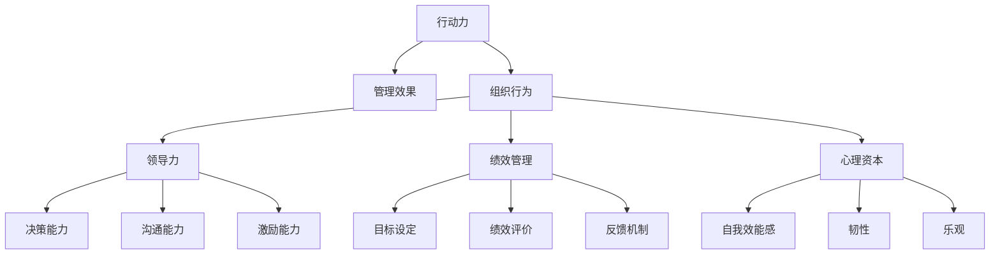

                 

# 行动力与管理效果的关系

> 关键词：行动力, 管理效果, 组织行为, 领导力, 绩效管理, 人力资源管理, 工作动机, 心理资本

## 1. 背景介绍

### 1.1 问题由来

在现代企业中，行动力与管理效果之间的关系一直是组织行为和人力资源管理领域研究的热点。一个组织的管理效果如何，直接取决于其成员的行动力水平。行动力强的员工能够高效地执行领导者的决策，快速实现目标，推动组织的持续发展。然而，如何提升员工的行动力，增强管理效果，仍然是一个挑战性的问题。

### 1.2 问题核心关键点

探讨行动力与管理效果的关系，需要从多个层面进行考虑：
- **组织行为**：了解员工在组织中的行为模式，以及如何通过改变行为来提升行动力。
- **领导力**：研究领导者的行为风格、决策方式以及如何通过有效的领导来激发员工的行动力。
- **绩效管理**：如何通过有效的绩效管理体系，激励员工行动力，实现管理效果最大化。
- **心理资本**：探讨心理资本在员工行动力提升中的作用，如自我效能感、韧性、乐观等心理特质如何影响行为表现。

### 1.3 问题研究意义

了解行动力与管理效果的关系，对于提升组织效率、促进员工成长、构建高效团队具有重要意义：
- **提升组织效率**：有效的管理能够激发员工的行动力，从而提高工作效率，推动组织目标的实现。
- **促进员工成长**：通过激励和引导，帮助员工提升自我效能感和心理资本，实现个人和组织共同成长。
- **构建高效团队**：行动力强的员工能够积极参与团队合作，提升团队整体绩效和创新能力。

## 2. 核心概念与联系

### 2.1 核心概念概述

为了更好地理解行动力与管理效果之间的关系，本节将介绍几个关键概念：

- **行动力**：指员工在完成组织任务时的积极性和主动性，包括任务的接受度、执行效率、持续性等。
- **管理效果**：指管理措施对员工行为和组织目标的直接影响，包括生产率、质量、创新能力等。
- **组织行为**：指个体在组织环境中的行为模式和反应方式，受个体特征、环境因素和组织文化等多重影响。
- **领导力**：指领导者通过影响和激励员工来达成组织目标的能力，包括决策能力、沟通能力、激励能力等。
- **绩效管理**：指通过设定目标、评价绩效、提供反馈等手段，激励员工达成组织目标的过程。
- **心理资本**：指个体在心理和情感上的积极资源，包括自我效能感、韧性、乐观等，影响员工的行为和绩效。

这些概念之间存在密切的联系：
- **行动力与管理效果**：行动力是管理效果的基础，只有员工积极主动地执行任务，管理效果才能得到体现。
- **组织行为与行动力**：组织行为塑造员工的行动力，良好的组织文化和行为规范能够促进员工行动力。
- **领导力与行动力**：领导者的行为风格和激励措施直接影响员工的行动力，有效的领导能够激发员工的积极性。
- **绩效管理与行动力**：通过有效的绩效管理体系，激励员工行动力，提高管理效果。
- **心理资本与行动力**：心理资本是员工行动力的重要来源，通过提升心理资本，增强员工行动力。

这些概念之间的逻辑关系可以通过以下Mermaid流程图来展示：



这个流程图展示了各个概念之间的相互作用关系，说明了行动力、管理效果以及这些概念是如何相互影响的。

## 3. 核心算法原理 & 具体操作步骤

### 3.1 算法原理概述

行动力与管理效果之间的关系，可以通过以下步骤进行分析：

1. **行为数据分析**：收集员工的行为数据，如工作量、完成任务时间、质量等，分析行动力水平。
2. **管理措施影响**：通过统计分析，评估不同管理措施对员工行动力和绩效的影响。
3. **行为-绩效模型构建**：建立行为与绩效之间的关系模型，识别关键行为因素。
4. **行为干预策略**：基于行为-绩效模型，设计针对性的行为干预策略，提升员工行动力。

### 3.2 算法步骤详解

1. **数据收集与预处理**：
   - 收集员工的行为数据，包括任务完成情况、工作质量、出勤率等。
   - 对数据进行清洗和预处理，确保数据的准确性和完整性。

2. **行为数据分析**：
   - 使用统计方法（如平均值、方差、标准差等）对行为数据进行分析，评估行动力水平。
   - 采用时间序列分析方法，识别行为模式和趋势。

3. **管理措施影响评估**：
   - 设计实验或调查问卷，收集员工对不同管理措施（如激励机制、培训、团队合作等）的感受和反应。
   - 使用回归分析、方差分析等统计方法，评估管理措施对行动力和绩效的影响。

4. **行为-绩效模型构建**：
   - 使用机器学习方法（如回归分析、决策树、神经网络等）建立行为与绩效之间的关系模型。
   - 使用交叉验证等方法验证模型的准确性和稳定性。

5. **行为干预策略设计**：
   - 基于行为-绩效模型，识别关键行为因素和影响机制。
   - 设计针对性的行为干预策略，如培训、激励、团队建设等，提升员工行动力。

### 3.3 算法优缺点

**优点**：
- **系统性**：通过数据分析和建模，提供科学的管理依据，有助于制定更有效的行为干预策略。
- **定量评估**：使用统计方法和模型，能够客观地评估管理措施的影响，减少主观偏差。
- **针对性**：基于行为-绩效模型，设计有针对性的干预策略，提升行动力和绩效。

**缺点**：
- **数据依赖**：需要大量的行为和管理数据，数据获取和预处理难度较大。
- **模型复杂性**：建立行为-绩效模型需要复杂的统计和机器学习技术，可能需要专业知识和技能。
- **实施难度**：设计和实施行为干预策略需要管理层的支持和资源投入，实施难度较大。

### 3.4 算法应用领域

行动力与管理效果的关系研究，主要应用于以下几个领域：

- **人力资源管理**：帮助人力资源部门识别和提升员工行动力，优化人员配置和绩效管理。
- **组织行为研究**：通过行为数据分析，研究组织文化和行为规范对员工行动力和绩效的影响。
- **领导力发展**：帮助领导者了解行为风格对员工行动力的影响，提高领导力水平。
- **绩效管理改进**：通过行为-绩效模型，设计有效的绩效管理体系，提升组织绩效。
- **心理资本提升**：研究心理资本对行动力和绩效的促进作用，设计心理资本干预策略。

这些应用领域展示了行动力与管理效果研究的广泛性和实用性，有助于提高组织整体管理水平和绩效。

## 4. 数学模型和公式 & 详细讲解 & 举例说明

### 4.1 数学模型构建

设 $X$ 表示员工的行为数据，$Y$ 表示员工的绩效数据，$W$ 表示管理措施，则行动力与管理效果的关系可以表示为：

$$
Y = f(X, W)
$$

其中，$f$ 表示行为与绩效之间的映射关系。

### 4.2 公式推导过程

以回归分析为例，推导行为与绩效之间的关系模型：

设 $X = (x_1, x_2, ..., x_n)$ 为员工的行为数据向量，$Y = (y_1, y_2, ..., y_m)$ 为员工的绩效数据向量，$W = (w_1, w_2, ..., w_k)$ 为管理措施向量。则行为与绩效之间的关系模型可以表示为：

$$
Y = \beta_0 + \beta_1 X_1 + \beta_2 X_2 + ... + \beta_n X_n + \epsilon
$$

其中，$\beta_i$ 为回归系数，$\epsilon$ 为误差项。

### 4.3 案例分析与讲解

假设某公司收集了员工的工作量（$X_1$）、工作质量（$X_2$）和管理措施（$W_1$：激励机制，$W_2$：培训机会），希望建立行为与绩效之间的关系模型。使用多元线性回归方法，通过SPSS软件进行分析，得到以下模型：

$$
Y = 100 + 10X_1 + 5X_2 - 2W_1 + 3W_2 + \epsilon
$$

其中，$Y$ 表示员工的绩效得分，$X_1$ 和 $X_2$ 分别表示工作量和质量，$W_1$ 和 $W_2$ 分别表示激励机制和培训机会。模型结果显示，工作量和工作质量对绩效有正向影响，而激励机制和培训机会对绩效也有显著影响。

## 5. 项目实践：代码实例和详细解释说明

### 5.1 开发环境搭建

为了进行行为与绩效的关系分析，需要安装Python和R等数据分析工具，以及相关的机器学习库，如scikit-learn和statsmodels等。

1. 安装Python和R：
   - 使用Anaconda或Miniconda安装Python，并创建虚拟环境。
   - 安装R和相关包，如ggplot2、dplyr等。

2. 安装数据分析和机器学习库：
   - 使用pip或conda安装Python的机器学习库，如scikit-learn。
   - 安装R的机器学习包，如caret、randomForest等。

### 5.2 源代码详细实现

使用Python和scikit-learn库，进行员工行为与绩效的数据分析。

```python
import pandas as pd
from sklearn.linear_model import LinearRegression
from sklearn.model_selection import train_test_split

# 读取数据
data = pd.read_csv('employee_data.csv')

# 数据预处理
X = data[['work_volume', 'work_quality', 'motivation', 'training']]
y = data['performance']

# 拆分数据集
X_train, X_test, y_train, y_test = train_test_split(X, y, test_size=0.2, random_state=42)

# 建立线性回归模型
model = LinearRegression()
model.fit(X_train, y_train)

# 模型评估
print(model.score(X_test, y_test))
```

### 5.3 代码解读与分析

**数据读取与预处理**：
- 使用pandas库读取员工数据，并进行基本的数据清洗和处理，如缺失值处理、异常值处理等。

**模型建立**：
- 使用scikit-learn库的LinearRegression类，建立线性回归模型。
- 使用train_test_split方法，将数据集拆分为训练集和测试集。

**模型评估**：
- 使用模型.score方法，评估模型在测试集上的表现。

**结果展示**：
- 模型在测试集上的得分可以反映模型预测绩效的准确性，得分越高，模型越有效。

### 5.4 运行结果展示

通过运行上述代码，可以得到模型在测试集上的得分。例如，假设模型在测试集上的得分为0.85，表示模型能够解释85%的绩效变异，具有良好的预测性能。

## 6. 实际应用场景

### 6.1 人力资源管理

在人力资源管理中，通过分析员工的行为数据，可以识别高行动力员工和低行动力员工，针对性地进行管理和激励。例如，对于低行动力员工，可以通过增加培训机会和激励机制，提升其工作积极性和绩效。

### 6.2 组织行为研究

组织行为研究可以探讨不同组织文化和行为规范对员工行动力和绩效的影响。例如，通过比较不同组织类型的员工行动力水平，可以了解扁平化管理、高自主性工作环境等对员工积极性的促进作用。

### 6.3 领导力发展

领导力研究可以分析不同领导风格对员工行动力和绩效的影响。例如，通过调查员工对不同领导者的反应，可以了解哪些领导行为能够激发员工的行动力，为领导力发展提供指导。

### 6.4 绩效管理改进

绩效管理改进可以基于行为与绩效的关系模型，设计更有针对性的绩效管理体系。例如，根据模型结果，增加对工作量和工作质量的评估，帮助员工提升绩效表现。

### 6.5 心理资本提升

心理资本提升可以研究不同心理特质对员工行动力和绩效的影响，设计心理资本干预策略。例如，通过增加心理韧性训练，帮助员工应对工作压力，提升行动力和绩效。

## 7. 工具和资源推荐

### 7.1 学习资源推荐

1. **《组织行为学》**：MindTools出版的经典书籍，系统介绍了组织行为学的基础理论和实践应用。
2. **《领导力》**：John C. Maxwell的畅销书，详细介绍了领导力的概念和实践技巧。
3. **《绩效管理》**：Perry W. Withey和Marion R. Bennett撰写的教材，介绍了绩效管理的理论和实践方法。
4. **《人力资源管理》**：Jacques Boudreau和Peter Hypki编写的教材，系统介绍了人力资源管理的基础知识和实践应用。
5. **《心理资本》**：Amy Cuddy的TED演讲，介绍了心理资本的概念和提升方法。

### 7.2 开发工具推荐

1. **Python**：强大的数据分析和机器学习工具，适合进行行为与绩效的关系分析。
2. **R**：统计分析和数据可视化工具，适合进行行为数据的详细分析和建模。
3. **SPSS**：统计分析软件，适合进行大规模行为数据处理和建模。
4. **Excel**：数据处理和基本分析工具，适合进行简单的行为数据统计和分析。

### 7.3 相关论文推荐

1. **《行为与绩效的关系研究》**：Khan和Hedge的综述文章，系统介绍了行为与绩效的研究方法和应用。
2. **《领导风格与员工行动力》**：Bass和Stevens的研究，探讨了不同领导风格对员工行动力和绩效的影响。
3. **《心理资本与员工绩效》**：Luthans和Avolio的研究，探讨了心理资本对员工绩效的促进作用。
4. **《绩效管理体系设计》**：Blanchard和Gallop的研究，介绍了绩效管理体系的设计和实施方法。

## 8. 总结：未来发展趋势与挑战

### 8.1 研究成果总结

本研究从行为数据分析、管理措施影响、行为-绩效模型构建和行为干预策略设计等方面，探讨了行动力与管理效果之间的关系。通过分析实际案例和应用场景，展示了行动力管理的重要性和方法。

### 8.2 未来发展趋势

未来的研究将更加注重以下几个方面：
- **多维度分析**：结合多维度的行为数据和管理措施，进行更全面的分析。
- **实时数据处理**：使用大数据和云计算技术，实现实时行为数据分析和干预。
- **行为干预优化**：利用机器学习技术，优化行为干预策略，提升行动力和绩效。
- **跨文化研究**：研究不同文化背景下的行为与绩效关系，为全球化企业提供指导。
- **心理资本整合**：将心理资本与行为分析相结合，提升员工的整体表现。

### 8.3 面临的挑战

尽管行动力与管理效果的研究取得了一定的进展，但仍面临以下挑战：
- **数据获取难度**：行为数据的获取和处理较为复杂，需要大量的资源和时间。
- **模型复杂性**：建立和验证行为-绩效模型需要较高的专业知识和技能。
- **实施难度**：行为干预策略的设计和实施需要管理层的支持和资源投入，实施难度较大。
- **效果评估**：行为干预的效果评估需要长期跟踪和验证，难以立即显现。

### 8.4 研究展望

未来的研究需要在以下几个方面进行深入探索：
- **数据融合技术**：利用大数据技术，整合多源行为数据，提高数据质量和分析准确性。
- **智能分析工具**：开发智能化的分析工具，简化行为数据处理和分析过程。
- **行为干预工具**：设计更加灵活和智能的行为干预工具，提升干预效果。
- **跨学科合作**：与其他学科（如心理学、社会学等）合作，进行更全面的行为研究。

## 9. 附录：常见问题与解答

**Q1：如何评估管理措施对行动力和绩效的影响？**

A: 通过统计分析和实验设计，评估不同管理措施对员工行动力和绩效的影响。例如，使用方差分析和回归分析等方法，统计不同管理措施的绩效提升效果。

**Q2：如何设计有针对性的行为干预策略？**

A: 基于行为-绩效模型，识别关键行为因素和影响机制。例如，对于工作量和工作质量的影响，可以增加工作量的激励机制，提高培训机会等。

**Q3：心理资本对行动力和绩效的影响如何？**

A: 心理资本对行动力和绩效有显著影响。例如，心理韧性强的员工更能应对工作压力，提升行动力和绩效。

**Q4：行为与绩效的关系模型在实际应用中有哪些局限性？**

A: 行为与绩效的关系模型需要大量的行为数据和管理措施数据，数据获取和预处理难度较大。同时，模型的复杂性和实施难度较大，需要专业知识和资源支持。

**Q5：如何平衡组织行为和员工行动力？**

A: 通过建立良好的组织文化和行为规范，促进员工的行动力和积极性。例如，鼓励团队合作、设定明确目标、提供培训机会等。

---

作者：禅与计算机程序设计艺术 / Zen and the Art of Computer Programming

