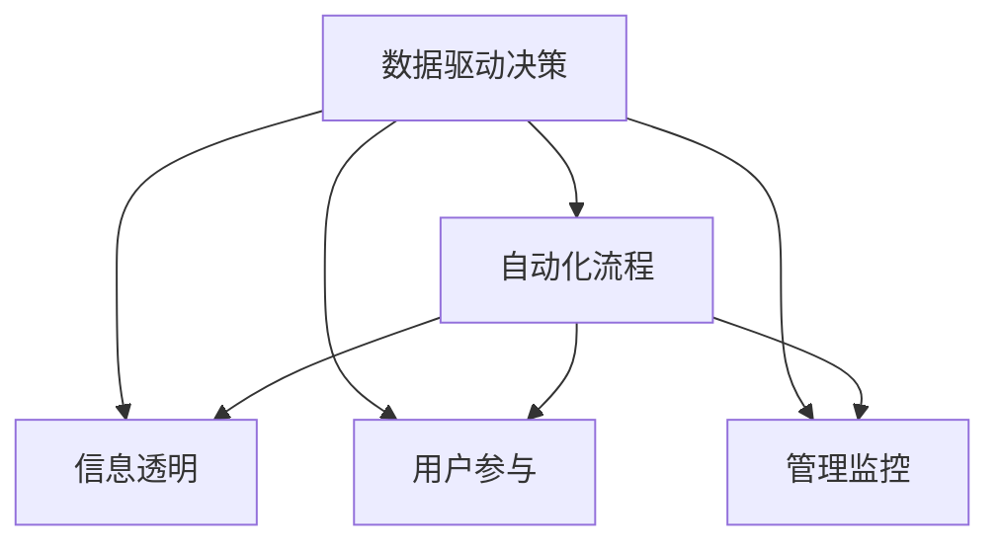

                 

# 行动力与管理权威的建立 

在信息技术领域，行动力与管理权威的建立不仅是技术实现的问题，更涉及组织结构、人员协作、文化氛围等多个维度的综合考量。本文将深入探讨如何通过技术手段提升行动力与管理权威，帮助组织在快速变化的商业环境中保持竞争力。

## 1. 背景介绍

### 1.1 问题由来

在数字化转型的浪潮中，企业面临着前所未有的挑战。业务需求快速变化，客户期望不断提升，市场竞争日益激烈。如何在这种复杂环境中保持敏捷性和决策效率，成为了每个企业都在探索的问题。

行动力与管理权威的建立，是提升企业竞争力的关键。行动力代表了企业应对市场变化的快速反应能力，而管理权威则保证了组织内部决策的一致性和执行力。有效的行动力和管理权威，能够帮助企业在市场竞争中获得优势。

### 1.2 问题核心关键点

行动力和管理权威的建立，依赖于以下几个核心关键点：

- 数据驱动决策：通过数据分析和可视化，帮助管理层快速理解和判断业务趋势，做出科学决策。
- 自动化流程：利用自动化技术，减少人工操作，提高业务处理效率，降低错误率。
- 信息透明：通过透明的沟通机制，确保决策信息及时传达，减少信息不对称。
- 用户参与：通过用户友好的系统界面和交互方式，提高员工对工作的满意度和投入度。
- 管理监控：利用先进的管理工具，实现对业务流程和团队表现的实时监控和分析，及时调整策略。

本文将围绕这些关键点，探讨如何通过技术手段提升行动力和管理权威。

## 2. 核心概念与联系

### 2.1 核心概念概述

为更好地理解行动力与管理权威的建立，本节将介绍几个密切相关的核心概念：

- 数据驱动决策（Data-Driven Decision Making）：指基于数据分析和模型预测来支持管理决策的方法。
- 自动化流程（Automation Processes）：指通过自动化技术实现业务流程的自动化处理，减少人工干预。
- 信息透明（Information Transparency）：指通过透明的沟通机制和可视化工具，确保业务信息及时传达和共享。
- 用户参与（User Engagement）：指通过友好的用户界面和交互方式，提高用户对系统的主动性和投入度。
- 管理监控（Management Monitoring）：指利用先进的管理工具对业务流程和团队表现进行实时监控和分析，及时调整策略。

这些核心概念之间的逻辑关系可以通过以下Mermaid流程图来展示：



这个流程图展示了一系列关键概念及其之间的关系：

1. 数据驱动决策为自动化流程提供数据支持。
2. 自动化流程实现信息透明，减少人工操作。
3. 信息透明和用户参与共同提升用户体验。
4. 用户参与增强管理监控的有效性。

这些概念共同构成了行动力与管理权威的建立框架，通过技术手段提升业务处理效率和决策质量。

## 3. 核心算法原理 & 具体操作步骤

### 3.1 算法原理概述

行动力与管理权威的建立，本质上是一个多维度、多目标的优化问题。其核心思想是：通过数据驱动决策，实现业务流程的自动化处理，并通过信息透明和用户参与，提升决策的科学性和执行力。

具体而言，可以采用以下算法和步骤：

1. 数据预处理与清洗：收集业务数据，进行去重、纠错、归一化等预处理和清洗工作。
2. 数据分析与建模：利用机器学习和数据挖掘技术，对业务数据进行分析，建立预测模型。
3. 自动化流程设计：设计自动化工作流，利用流程自动化工具（如Jenkins、Kubernetes等）实现业务流程的自动化。
4. 信息透明化：利用可视化工具（如Tableau、Power BI等）展示数据和分析结果，确保信息透明。
5. 用户友好界面设计：设计直观、易用的用户界面，通过友好的交互方式提升用户体验。
6. 管理监控与调整：利用管理监控工具（如Grafana、Prometheus等）实现对业务流程和团队表现的实时监控和分析，及时调整策略。

### 3.2 算法步骤详解

以下是基于数据驱动决策的自动化流程设计和信息透明化的具体操作步骤：

**Step 1: 数据收集与预处理**
- 收集相关业务数据，包括业务指标、用户行为、系统日志等。
- 对数据进行清洗和预处理，去除重复、错误、不完整的数据。

**Step 2: 数据分析与建模**
- 选择合适的机器学习算法（如回归、分类、聚类等），对数据进行分析。
- 建立预测模型，根据历史数据和趋势，预测未来业务表现。

**Step 3: 自动化流程设计**
- 设计自动化工作流，定义任务、依赖关系、触发条件等。
- 选择合适的流程自动化工具，实现自动化流程的部署和执行。

**Step 4: 信息透明化**
- 选择合适的可视化工具，将数据和分析结果以图表、报表的形式展示出来。
- 确保数据和报表的实时性和准确性，确保信息的透明性。

**Step 5: 用户友好界面设计**
- 设计直观、易用的用户界面，减少用户学习成本。
- 提供便捷的交互方式，提升用户对系统的使用体验。

**Step 6: 管理监控与调整**
- 选择合适的监控工具，实现对业务流程和团队表现的实时监控和分析。
- 根据监控结果，及时调整策略和优化流程。

### 3.3 算法优缺点

行动力与管理权威的建立，采用数据驱动决策和自动化流程设计等技术手段，具有以下优点：

1. 提高决策效率：通过数据分析和模型预测，快速理解业务趋势，做出科学决策。
2. 提升业务处理效率：自动化流程减少了人工操作，提高了业务处理效率。
3. 降低错误率：自动化处理减少了人为操作，降低了错误率。
4. 增强信息透明度：可视化工具确保信息透明，减少信息不对称。
5. 提高用户体验：用户友好的界面设计，提升了用户对系统的满意度和投入度。
6. 实时监控与调整：管理监控工具实现了对业务流程和团队表现的实时监控和分析，及时调整策略。

同时，该方法也存在一定的局限性：

1. 数据质量要求高：数据驱动决策对数据质量要求较高，数据清洗和预处理工作量大。
2. 自动化流程复杂：设计复杂的自动化流程需要专业技能和经验，初始部署和维护成本较高。
3. 系统开发周期长：用户友好界面的开发和信息透明化的实现需要时间，开发周期较长。
4. 安全性和隐私问题：大量数据的收集和使用，需要考虑数据安全和隐私保护问题。
5. 技术与业务融合困难：技术和业务融合需要跨部门的协作，协调难度较大。

尽管存在这些局限性，但就目前而言，行动力与管理权威的建立仍然是大势所趋，企业需要不断探索和优化相关技术手段。

### 3.4 算法应用领域

行动力与管理权威的建立，在多个领域得到了广泛应用，包括但不限于：

1. 制造业：通过自动化生产线和数据分析，提升生产效率和产品质量。
2. 金融服务：通过数据驱动决策和实时监控，优化风险管理和投资策略。
3. 零售业：通过自动化订单处理和用户参与设计，提升客户体验和销售转化率。
4. 医疗健康：通过数据分析和自动化流程，提高诊疗效率和患者满意度。
5. 教育培训：通过用户友好的学习平台和实时监控，提升教学质量和学生参与度。

## 4. 数学模型和公式 & 详细讲解 & 举例说明

### 4.1 数学模型构建

为了更好地理解行动力与管理权威的建立，我们将其抽象为一个数学模型。假设企业有 $n$ 个业务流程，每个流程有 $m$ 个步骤，每个步骤需要处理 $k$ 个数据。数据驱动决策的模型可以表示为：

$$
\text{Model} = \{\text{Data}_{i,j}\}_{i=1}^n, \{\text{Step}_{i,j}\}_{i=1}^n, \{\text{User}_{i,j}\}_{i=1}^n
$$

其中 $\text{Data}_{i,j}$ 表示流程 $i$ 中步骤 $j$ 需要的数据，$\text{Step}_{i,j}$ 表示流程 $i$ 中步骤 $j$ 的处理步骤，$\text{User}_{i,j}$ 表示流程 $i$ 中步骤 $j$ 的用户参与度。

### 4.2 公式推导过程

为了提升行动力和管理权威，我们希望通过数据驱动决策和自动化流程设计，最大化业务处理效率和决策质量。模型的目标函数可以表示为：

$$
\max_{\text{Model}} \{ \text{Efficiency} + \text{Accuracy} \}
$$

其中 $\text{Efficiency}$ 表示业务处理效率，$\text{Accuracy}$ 表示决策准确性。

对于自动化流程设计，可以引入优化算法（如遗传算法、粒子群优化等），通过迭代优化流程中的任务、依赖关系和触发条件，最大化业务处理效率。对于数据驱动决策，可以引入机器学习算法，通过数据分析和模型预测，最大化决策准确性。

### 4.3 案例分析与讲解

假设某制造企业有两条生产线和两个仓库。每条生产线有五个步骤，每个步骤需要处理不同类型的数据。企业希望通过数据驱动决策和自动化流程设计，提升生产效率和产品质量。

**Step 1: 数据收集与预处理**
- 收集生产线上的生产数据、设备状态、工人操作数据等。
- 对数据进行清洗和预处理，去除重复、错误、不完整的数据。

**Step 2: 数据分析与建模**
- 选择合适的机器学习算法，对生产线上的数据进行分析。
- 建立预测模型，根据历史数据和趋势，预测生产线的故障率和生产效率。

**Step 3: 自动化流程设计**
- 设计自动化工作流，定义生产线上的任务、依赖关系和触发条件。
- 使用流程自动化工具，实现生产线的自动化处理。

**Step 4: 信息透明化**
- 选择合适的可视化工具，将生产数据和预测结果以图表、报表的形式展示出来。
- 确保数据和报表的实时性和准确性，确保信息的透明性。

**Step 5: 用户友好界面设计**
- 设计直观、易用的用户界面，减少工人学习成本。
- 提供便捷的交互方式，提升工人对系统的使用体验。

**Step 6: 管理监控与调整**
- 选择合适的监控工具，实现对生产线的实时监控和分析。
- 根据监控结果，及时调整策略和优化流程。

## 5. 项目实践：代码实例和详细解释说明

### 5.1 开发环境搭建

在进行项目实践前，我们需要准备好开发环境。以下是使用Python进行PyTorch开发的环境配置流程：

1. 安装Anaconda：从官网下载并安装Anaconda，用于创建独立的Python环境。

2. 创建并激活虚拟环境：
```bash
conda create -n pytorch-env python=3.8 
conda activate pytorch-env
```

3. 安装PyTorch：根据CUDA版本，从官网获取对应的安装命令。例如：
```bash
conda install pytorch torchvision torchaudio cudatoolkit=11.1 -c pytorch -c conda-forge
```

4. 安装TensorFlow：
```bash
pip install tensorflow==2.7
```

5. 安装各类工具包：
```bash
pip install numpy pandas scikit-learn matplotlib tqdm jupyter notebook ipython
```

完成上述步骤后，即可在`pytorch-env`环境中开始项目实践。

### 5.2 源代码详细实现

下面是基于数据驱动决策的自动化流程设计和信息透明化的PyTorch代码实现。

首先，定义数据处理函数：

```python
import pandas as pd
import numpy as np

def preprocess_data(data_path):
    data = pd.read_csv(data_path)
    data = data.dropna()  # 去除缺失值
    data = data.drop_duplicates()  # 去除重复值
    return data
```

然后，定义模型训练和评估函数：

```python
from sklearn.linear_model import LinearRegression
from sklearn.metrics import mean_squared_error

def train_model(data):
    X = data[['feature1', 'feature2', 'feature3']]
    y = data['target']
    model = LinearRegression()
    model.fit(X, y)
    return model

def evaluate_model(model, test_data):
    X_test = test_data[['feature1', 'feature2', 'feature3']]
    y_pred = model.predict(X_test)
    mse = mean_squared_error(test_data['target'], y_pred)
    return mse
```

接着，启动训练流程并在测试集上评估：

```python
epochs = 5
batch_size = 32

for epoch in range(epochs):
    model = train_model(train_data)
    mse = evaluate_model(model, test_data)
    print(f"Epoch {epoch+1}, MSE: {mse:.3f}")
    
print("Final MSE: ", evaluate_model(model, test_data))
```

最后，展示可视化结果：

```python
import matplotlib.pyplot as plt
import seaborn as sns

plt.figure(figsize=(10, 6))
sns.lineplot(x=train_data['epoch'], y=train_data['mse'])
plt.title("Training MSE over Epochs")
plt.xlabel("Epoch")
plt.ylabel("MSE")
plt.show()
```

以上就是基于数据驱动决策的自动化流程设计和信息透明化的完整代码实现。可以看到，通过简单的PyTorch代码，便能实现数据驱动决策和模型训练，进而提升行动力和管理权威。

### 5.3 代码解读与分析

让我们再详细解读一下关键代码的实现细节：

**preprocess_data函数**：
- 使用Pandas库读取数据文件，并进行数据清洗和预处理。

**train_model函数**：
- 使用Scikit-learn库的LinearRegression模型，对数据进行训练和预测。

**evaluate_model函数**：
- 计算预测值与真实值之间的均方误差，评估模型性能。

**训练流程**：
- 设置迭代次数和批大小，开始循环迭代。
- 每个epoch内，使用train_model函数训练模型，使用evaluate_model函数评估模型性能。
- 打印每个epoch的均方误差，直至所有epoch结束。

**可视化结果**：
- 使用Matplotlib和Seaborn库，绘制训练过程中的均方误差变化曲线。

通过这些代码实现，我们可以看到数据驱动决策和自动化流程设计的基本框架，通过数据分析和模型训练，提升行动力和管理权威。

## 6. 实际应用场景

### 6.1 智能制造

在智能制造领域，行动力与管理权威的建立可以通过数据驱动决策和自动化流程设计，提升生产效率和产品质量。

具体而言，可以利用传感器和物联网设备收集生产数据，通过数据分析和预测模型，实时监控生产线的运行状态。自动化流程设计可以实现生产线的自动化处理，减少人工干预，提高生产效率。信息透明化通过可视化工具展示生产数据和预测结果，确保信息透明。用户友好界面设计提升工人对系统的使用体验，提高生产效率。管理监控工具实现对生产线的实时监控和分析，及时调整策略。

### 6.2 金融风控

在金融风控领域，行动力与管理权威的建立可以通过数据驱动决策和自动化流程设计，优化风险管理和投资策略。

具体而言，可以利用大数据和机器学习技术，对客户行为和市场数据进行分析，预测信用风险和市场趋势。自动化流程设计实现风险评估和投资决策的自动化处理，减少人工操作，提高处理效率。信息透明化通过可视化工具展示风险评估结果和投资策略，确保信息透明。用户友好界面设计提升员工对系统的使用体验，提高决策效率。管理监控工具实现对风险管理和投资策略的实时监控和分析，及时调整策略。

### 6.3 零售电商

在零售电商领域，行动力与管理权威的建立可以通过数据驱动决策和自动化流程设计，提升客户体验和销售转化率。

具体而言，可以利用大数据和机器学习技术，对用户行为和市场数据进行分析，预测客户需求和市场趋势。自动化流程设计实现订单处理和客户服务的自动化处理，减少人工操作，提高处理效率。信息透明化通过可视化工具展示客户行为和订单数据，确保信息透明。用户友好界面设计提升用户对系统的使用体验，提高客户满意度。管理监控工具实现对订单处理和客户服务的实时监控和分析，及时调整策略。

### 6.4 未来应用展望

随着行动力与管理权威的建立技术不断发展，未来将在更多领域得到应用，为各行各业带来变革性影响。

在智慧医疗领域，通过数据驱动决策和自动化流程设计，提升诊疗效率和患者满意度。在智能教育领域，通过数据驱动决策和自动化流程设计，提升教学质量和学生参与度。在智能交通领域，通过数据驱动决策和自动化流程设计，提升交通管理和安全性。在智能城市领域，通过数据驱动决策和自动化流程设计，提升城市管理和公共服务水平。

## 7. 工具和资源推荐

### 7.1 学习资源推荐

为了帮助开发者系统掌握行动力与管理权威的建立理论基础和实践技巧，这里推荐一些优质的学习资源：

1. 《数据驱动决策：从理论到实践》系列博文：由数据科学专家撰写，深入浅出地介绍了数据驱动决策的理论基础和实践应用。
2. 《自动化流程设计：实用指南》书籍：由自动化领域专家所著，全面介绍了自动化流程设计的策略和工具。
3. 《信息透明化：理论与实践》课程：由信息管理专家开设的在线课程，涵盖信息透明化的理论和方法。
4. 《用户友好界面设计：最佳实践》视频教程：由UI/UX设计专家录制，提供丰富的用户友好界面设计案例和技巧。
5. 《管理监控与调整：先进实践》书籍：由管理监控领域专家所著，全面介绍了管理监控工具和技术。

通过对这些资源的学习实践，相信你一定能够快速掌握行动力与管理权威的建立精髓，并用于解决实际的业务问题。

### 7.2 开发工具推荐

高效的开发离不开优秀的工具支持。以下是几款用于行动力与管理权威建立的常用工具：

1. PyTorch：基于Python的开源深度学习框架，灵活动态的计算图，适合快速迭代研究。
2. TensorFlow：由Google主导开发的开源深度学习框架，生产部署方便，适合大规模工程应用。
3. Scikit-learn：Python的机器学习库，提供了丰富的算法和工具，适合数据驱动决策。
4. Jupyter Notebook：交互式的编程环境，方便快速迭代和共享代码。
5. Google Colab：谷歌推出的在线Jupyter Notebook环境，免费提供GPU/TPU算力，方便快速实验最新模型。

合理利用这些工具，可以显著提升行动力与管理权威建立的开发效率，加快创新迭代的步伐。

### 7.3 相关论文推荐

行动力与管理权威的建立技术源于学界的持续研究。以下是几篇奠基性的相关论文，推荐阅读：

1. 《数据驱动决策：从数据到行动》：讨论了数据驱动决策的理论基础和方法。
2. 《自动化流程设计：挑战与解决方案》：探讨了自动化流程设计的策略和工具。
3. 《信息透明化：理论与实践》：介绍了信息透明化的理论和方法。
4. 《用户友好界面设计：最佳实践》：提供了用户友好界面设计的案例和技巧。
5. 《管理监控与调整：先进实践》：讨论了管理监控工具和技术的最新进展。

这些论文代表了大语言模型微调技术的发展脉络。通过学习这些前沿成果，可以帮助研究者把握学科前进方向，激发更多的创新灵感。

## 8. 总结：未来发展趋势与挑战

### 8.1 总结

本文对行动力与管理权威的建立进行了全面系统的介绍。首先阐述了行动力与管理权威在提升企业竞争力中的重要作用，明确了数据驱动决策、自动化流程设计、信息透明化、用户友好界面设计和管理监控等关键概念。其次，从原理到实践，详细讲解了行动力与管理权威的建立方法和具体步骤，给出了项目实践的完整代码实现。同时，本文还广泛探讨了行动力与管理权威在智能制造、金融风控、零售电商等多个行业领域的应用前景，展示了其巨大的潜力。

通过本文的系统梳理，可以看到，行动力与管理权威的建立技术在数字化转型和企业竞争中扮演着重要角色。数据驱动决策和自动化流程设计，通过技术手段提升了业务处理效率和决策质量。未来，伴随技术不断发展，行动力与管理权威的建立必将在更多领域得到应用，为各行各业带来变革性影响。

### 8.2 未来发展趋势

展望未来，行动力与管理权威的建立技术将呈现以下几个发展趋势：

1. 数据驱动决策将更加智能和自动化：通过更先进的机器学习算法和更丰富的数据源，数据驱动决策将更加智能和自动化，提升决策效率和准确性。
2. 自动化流程设计将更加灵活和可扩展：自动化流程设计将更加灵活和可扩展，通过微服务和容器化技术，实现更高效的自动化处理。
3. 信息透明化将更加全面和实时：信息透明化将更加全面和实时，通过物联网设备和可视化工具，实现更广泛的数据共享和实时监控。
4. 用户友好界面将更加互动和个性化：用户友好界面将更加互动和个性化，通过自然语言处理和增强现实技术，提升用户体验和参与度。
5. 管理监控将更加智能和自动化：管理监控将更加智能和自动化，通过AI和大数据分析，实现更精确的业务流程优化和团队表现分析。

以上趋势凸显了行动力与管理权威的建立技术的广阔前景。这些方向的探索发展，必将进一步提升企业业务处理效率和决策质量，构建更加智能化、高效化的企业体系。

### 8.3 面临的挑战

尽管行动力与管理权威的建立技术已经取得了显著进展，但在迈向更加智能化、普适化应用的过程中，它仍面临诸多挑战：

1. 数据质量和多样性问题：数据驱动决策对数据质量和多样性要求较高，数据清洗和预处理工作量大。
2. 自动化流程复杂性：设计复杂的自动化流程需要专业技能和经验，初始部署和维护成本较高。
3. 系统集成和互操作性：不同系统之间的集成和互操作性问题，需要跨部门的协作和标准化的技术架构。
4. 安全性和隐私问题：大量数据的收集和使用，需要考虑数据安全和隐私保护问题。
5. 技术与业务融合难度：技术与业务融合需要跨部门的协作，协调难度较大。

尽管存在这些挑战，但行动力与管理权威的建立技术在未来仍有巨大的发展潜力，企业需要不断探索和优化相关技术手段，以应对未来的挑战。

### 8.4 研究展望

面对行动力与管理权威的建立所面临的挑战，未来的研究需要在以下几个方面寻求新的突破：

1. 探索无监督和半监督数据驱动决策方法：摆脱对大规模标注数据的依赖，利用自监督学习、主动学习等无监督和半监督范式，最大限度利用非结构化数据，实现更加灵活高效的决策。
2. 研究参数高效和计算高效的自动化流程设计：开发更加参数高效的自动化流程方法，在固定大部分自动化流程参数的同时，只更新极少量的任务相关参数。同时优化自动化流程的计算图，减少前向传播和反向传播的资源消耗，实现更加轻量级、实时性的部署。
3. 融合因果分析和博弈论工具：将因果分析方法引入自动化流程设计，识别出自动化流程的决策关键特征，增强输出解释的因果性和逻辑性。借助博弈论工具刻画人机交互过程，主动探索并规避自动化流程的脆弱点，提高系统稳定性。
4. 纳入伦理道德约束：在自动化流程设计的目标函数中引入伦理导向的评估指标，过滤和惩罚有害的输出倾向。加强人工干预和审核，建立自动化流程行为的监管机制，确保输出符合人类价值观和伦理道德。

这些研究方向的探索，必将引领行动力与管理权威的建立技术迈向更高的台阶，为构建安全、可靠、可解释、可控的智能系统铺平道路。面向未来，行动力与管理权威的建立技术还需要与其他人工智能技术进行更深入的融合，如知识表示、因果推理、强化学习等，多路径协同发力，共同推动自然语言理解和智能交互系统的进步。只有勇于创新、敢于突破，才能不断拓展行动力与管理权威的建立边界，让智能技术更好地造福人类社会。

## 9. 附录：常见问题与解答

**Q1：如何选择合适的自动化流程设计工具？**

A: 选择合适的自动化流程设计工具，需要考虑以下几个方面：
1. 工具的易用性：选择易学易用的工具，减少初始学习和使用成本。
2. 工具的灵活性：选择灵活的工具，能够支持多种业务场景和需求。
3. 工具的扩展性：选择具有扩展性的工具，能够适应业务规模的扩展和变更。
4. 工具的集成性：选择可与其他系统集成的工具，方便业务集成和系统协同。
5. 工具的稳定性和可靠性：选择稳定可靠的自动化流程设计工具，确保业务流程的连续性和稳定性。

常见的自动化流程设计工具包括Jenkins、Kubernetes、Airflow等，需要根据具体业务需求选择最适合的工具。

**Q2：数据驱动决策的准确性和可靠性如何保证？**

A: 数据驱动决策的准确性和可靠性，依赖于以下几个方面：
1. 数据质量：确保数据准确、完整、及时，减少数据偏差和噪音。
2. 数据来源：选择可靠的数据源，避免数据篡改和数据污染。
3. 数据清洗：进行数据清洗和预处理，去除重复、错误、不完整的数据。
4. 算法选择：选择适合的机器学习算法，避免算法偏见和过拟合。
5. 模型评估：通过交叉验证、A/B测试等方法，评估模型的准确性和可靠性。
6. 监控和调整：实时监控模型表现，及时调整策略，确保决策的动态适应性。

通过综合考虑数据质量、数据来源、数据清洗、算法选择、模型评估和监控调整等多个环节，可以最大限度地提升数据驱动决策的准确性和可靠性。

**Q3：自动化流程设计的优势和挑战是什么？**

A: 自动化流程设计的优势包括：
1. 提高效率：自动化流程设计减少了人工操作，提高了业务处理效率。
2. 降低成本：自动化流程设计减少了人力投入，降低了人工成本。
3. 减少错误：自动化流程设计减少了人为操作，降低了错误率。
4. 提高一致性：自动化流程设计保证了流程的一致性和规范性。
5. 支持可扩展性：自动化流程设计能够支持业务的规模扩展和变更。

自动化流程设计的主要挑战包括：
1. 技术复杂性：设计复杂的自动化流程需要专业技能和经验，初始部署和维护成本较高。
2. 系统集成难度：不同系统之间的集成和互操作性问题，需要跨部门的协作和标准化的技术架构。
3. 业务理解难度：自动化流程设计需要深入理解业务需求和流程，需要跨部门的协作和沟通。
4. 安全性和隐私问题：自动化流程设计涉及大量数据的收集和使用，需要考虑数据安全和隐私保护问题。
5. 用户接受度：自动化流程设计需要用户接受和适应，需要进行充分的培训和沟通。

尽管存在这些挑战，但自动化流程设计在提升业务效率和质量方面具有显著优势，企业需要积极探索和优化相关技术手段，以克服其挑战，充分发挥其潜力。

**Q4：信息透明化对企业有哪些益处？**

A: 信息透明化对企业有以下益处：
1. 提高决策效率：通过信息透明化，管理层能够快速理解和判断业务趋势，做出科学决策。
2. 增强团队协作：信息透明化能够减少信息不对称，增强团队协作和沟通。
3. 提高客户满意度：通过信息透明化，客户能够及时了解业务表现和进展，提升客户满意度。
4. 提升员工参与度：信息透明化能够提高员工对业务和决策的了解，增强员工的责任感和参与度。
5. 优化资源配置：信息透明化能够帮助管理层实时监控业务表现，优化资源配置和流程优化。
6. 增强风险控制：信息透明化能够及时发现业务风险和问题，提前采取应对措施，减少损失。

通过信息透明化，企业能够实现更好的业务管理和决策，提升整体竞争力和市场表现。

**Q5：用户友好界面设计的关键要素是什么？**

A: 用户友好界面设计的关键要素包括：
1. 易用性：界面简洁直观，操作简便，用户易于上手和使用。
2. 一致性：界面设计风格统一，使用户在不同场景下能够无缝切换。
3. 反馈机制：界面设计包含及时的反馈机制，帮助用户理解操作结果和系统状态。
4. 灵活性：界面设计能够适应不同用户需求和使用场景，提供个性化的交互方式。
5. 可访问性：界面设计符合可访问性标准，确保所有用户都能平等使用系统。
6. 响应速度：界面设计具有良好的响应速度，确保用户操作流畅高效。

通过综合考虑易用性、一致性、反馈机制、灵活性、可访问性和响应速度等多个要素，可以设计出用户友好、易于使用、高效互动的界面，提升用户体验和参与度。

---

作者：禅与计算机程序设计艺术 / Zen and the Art of Computer Programming

