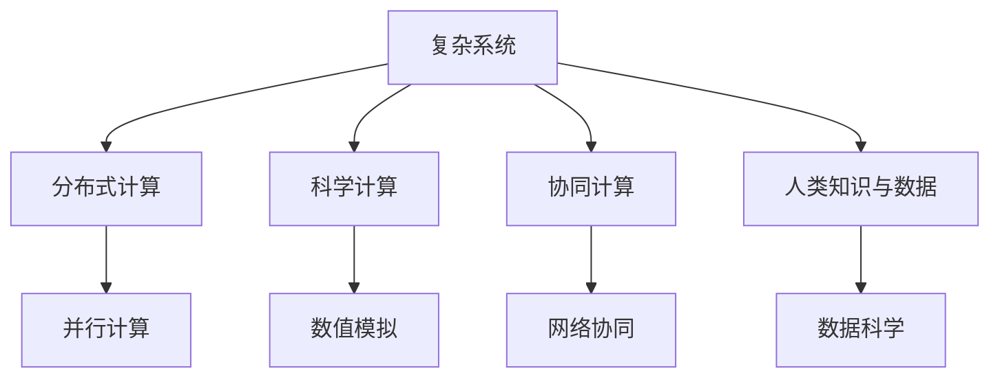

                 

# 解决人类面临的重大挑战：人类计算的使命

> 关键词：人类计算,人工智能,复杂系统,计算范式,全球协作,科学突破

## 1. 背景介绍

### 1.1 问题由来

随着科技的迅猛发展，人类社会的复杂性呈指数级增长。从全球气候变化到公共卫生危机，从网络安全到经济不稳定，诸多重大挑战摆在了人类面前。这些问题不再是一般意义上的科技问题，而是涉及社会、经济、生态等多个层面的系统性难题。面对这些复杂问题，传统的人工智能(AI)和计算机科学范式已经难以应对，迫切需要新的方法与工具。

人类计算的概念正是在这一背景下提出。它认为，解决复杂系统问题不应仅依赖于算法优化或硬件加速，而应整合各领域的知识与数据，通过大规模跨学科合作，从全新的角度寻找解决方案。这一范式将使计算机科学成为真正意义上的“解决人类面临的重大挑战”的工具。

### 1.2 问题核心关键点

人类计算的关键在于以下几个方面：

- **跨学科融合**：人类计算强调跨学科的合作，将人工智能、社会科学、自然科学等多个领域的知识和方法综合运用。
- **大数据驱动**：利用海量数据进行模型训练，挖掘问题本质。
- **复杂系统建模**：采用分布式、多层次的计算模型，模拟并优化复杂系统。
- **协同计算**：通过全球协作网络，集聚全球智力资源，协同攻关。
- **科学突破**：基于系统性思维和颠覆性理论，实现科学上的重大进展。

本节将围绕这几个核心点，系统介绍人类计算的基本概念、关键算法及其应用场景。

## 2. 核心概念与联系

### 2.1 核心概念概述

人类计算涉及多个学科的知识和方法，核心概念包括：

- **复杂系统**：指由多个相互关联的部分组成，具备高度复杂性的系统，如金融市场、气候系统等。
- **分布式计算**：通过网络将计算任务分布在多个计算机上，协同完成计算。
- **科学计算**：使用计算机进行科学实验和数据分析，发现科学规律。
- **协同计算**：多个计算节点协同工作，实现更高效的计算。
- **人类知识与数据**：人类知识与大数据的有效结合，实现更深入的洞察和预测。

### 2.2 核心概念原理和架构的 Mermaid 流程图



这个流程图展示了复杂系统与各个核心概念之间的逻辑关系。复杂系统通过分布式计算、科学计算和协同计算进行研究，而人类知识与数据为这些计算过程提供支持。分布式计算通过并行计算实现，科学计算通过数值模拟进行，协同计算通过网络协同完成，数据科学通过数据处理和分析实现。

## 3. 核心算法原理 & 具体操作步骤

### 3.1 算法原理概述

人类计算的核心算法原理可以概括为以下几个方面：

- **分布式计算**：通过MapReduce、Spark等技术，将复杂的计算任务分布在多个节点上并行计算。
- **科学计算**：采用数学建模和数值模拟方法，通过计算机进行科学实验和数据分析。
- **协同计算**：通过全球协作网络，实现分布式协同计算，加速问题解决。
- **数据科学**：通过数据挖掘和机器学习，利用大数据分析复杂系统行为。

### 3.2 算法步骤详解

人类计算的典型操作流程包括以下几个关键步骤：

**Step 1: 问题定义与模型建立**

- 定义问题的核心要素，识别系统中的关键变量和参数。
- 建立数学模型或计算模型，描述系统的运行规律。
- 设计算法框架，确定计算策略和优化目标。

**Step 2: 数据收集与预处理**

- 收集系统相关的历史数据、实时数据和模拟数据。
- 清洗和处理数据，去除噪声，增加数据质量。
- 利用数据科学方法，对数据进行特征提取和预处理。

**Step 3: 分布式计算与并行优化**

- 将计算任务分割成多个子任务，并行运行在不同的计算节点上。
- 使用并行计算技术，如MapReduce、Spark、GPU加速等，提高计算效率。
- 应用科学计算方法，如数值模拟、蒙特卡洛模拟等，进行模型验证和优化。

**Step 4: 协同计算与网络优化**

- 构建全球协作网络，通过分布式协同计算，共享计算资源和知识。
- 采用协同计算技术，如分布式任务调度、负载均衡等，优化计算过程。
- 引入云平台和边缘计算，提高系统的响应速度和计算能力。

**Step 5: 模型评估与科学验证**

- 利用大数据分析和机器学习方法，评估模型的性能。
- 进行科学验证，通过实验和测试数据验证模型的准确性和鲁棒性。
- 根据实验结果，调整模型参数，优化算法策略。

**Step 6: 系统部署与持续优化**

- 将模型部署到实际应用场景中，进行性能测试和稳定性测试。
- 持续监控系统运行状态，收集反馈数据，优化系统性能。
- 进行模型的定期更新和重构，确保系统长期稳定运行。

### 3.3 算法优缺点

人类计算的优点包括：

- **高效性**：通过分布式计算和协同计算，可以大幅提高计算效率。
- **准确性**：利用科学计算和大数据，可以获得更为精确的模型和预测结果。
- **鲁棒性**：通过全球协作网络，可以最大限度地利用全球智力资源，提升系统的稳定性和可靠性。
- **开放性**：开放算法和数据，鼓励全球科学家共同研究和创新。

但人类计算也存在一些缺点：

- **复杂性**：需要跨学科合作，涉及多个领域的知识和技术。
- **数据需求高**：对数据质量和数据量的要求极高，需要大量资源。
- **计算成本高**：涉及分布式计算和协同计算，需要大量计算资源。
- **协调难度大**：不同学科、不同国家之间的协作需要协调，存在一定难度。

### 3.4 算法应用领域

人类计算已经在多个领域得到了广泛应用，包括：

- **气候变化**：通过数值模拟和大数据分析，预测气候变化趋势，提出应对策略。
- **公共卫生**：利用大数据分析和机器学习，预测流行病扩散，优化资源分配。
- **金融稳定**：采用科学计算和分布式协同计算，评估金融系统风险，制定风险管理措施。
- **网络安全**：通过分布式计算和数据分析，检测和防范网络攻击，提高网络安全水平。
- **工业制造**：利用科学计算和大数据，优化生产流程，提高生产效率和质量。
- **能源管理**：采用分布式计算和协同计算，优化能源系统运行，提升能源利用效率。
- **农业生产**：通过大数据分析和机器学习，预测气候变化对农业的影响，指导农业生产。

以上仅列举了部分应用领域，随着技术的不断进步，人类计算将在更多领域展现其巨大潜力。

## 4. 数学模型和公式 & 详细讲解 & 举例说明

### 4.1 数学模型构建

人类计算中常用的数学模型包括：

- **偏微分方程(PDEs)**：描述复杂系统的动态变化规律，如热传导方程、波动方程等。
- **蒙特卡洛方法**：利用随机模拟，计算复杂的积分和概率分布。
- **神经网络**：采用深度学习算法，进行数据分类和预测。
- **图模型**：用于描述系统中的网络关系和传播规律，如社交网络、交通网络等。

### 4.2 公式推导过程

以偏微分方程为例，介绍其基本推导过程。

假设某物理系统的状态由时间 $t$ 和空间 $x$ 的函数 $u(x,t)$ 描述。根据系统的守恒定律和边界条件，可以建立如下偏微分方程：

$$
\frac{\partial u}{\partial t} = \nabla \cdot (D\nabla u) + F(x,t,u)
$$

其中 $D$ 为扩散系数，$F(x,t,u)$ 为系统内部的力函数。

将上述方程离散化，得到离散形式的偏微分方程。通过数值求解方法，如有限差分法、有限元法等，可以计算出系统在不同时刻和位置的状态 $u_{ij}$。

### 4.3 案例分析与讲解

以气候模型为例，展示人类计算在实际应用中的具体实现。

气候模型通常采用分布式计算，通过大规模数值模拟计算全球气候系统的变化。具体的计算流程如下：

1. **数据收集**：收集历史气候数据、气象观测数据、海洋数据等。
2. **模型构建**：建立全球气候系统的数学模型，描述大气、海洋、陆地等组成部分之间的相互作用。
3. **数值模拟**：利用并行计算技术，将模型在多个计算节点上并行运行。
4. **结果分析**：利用科学计算方法，分析和验证模拟结果。
5. **模型优化**：根据实际气候变化，调整模型参数，优化模型性能。

通过这一流程，人类计算能够准确预测气候变化趋势，为全球气候治理提供科学依据。

## 5. 项目实践：代码实例和详细解释说明

### 5.1 开发环境搭建

在进行人类计算实践前，我们需要准备好开发环境。以下是使用Python进行PyTorch开发的环境配置流程：

1. 安装Anaconda：从官网下载并安装Anaconda，用于创建独立的Python环境。

2. 创建并激活虚拟环境：
```bash
conda create -n human-calculating python=3.8 
conda activate human-calculating
```

3. 安装PyTorch：根据CUDA版本，从官网获取对应的安装命令。例如：
```bash
conda install pytorch torchvision torchaudio cudatoolkit=11.1 -c pytorch -c conda-forge
```

4. 安装TensorFlow：
```bash
pip install tensorflow==2.8.0
```

5. 安装各类工具包：
```bash
pip install numpy pandas scikit-learn matplotlib tqdm jupyter notebook ipython
```

完成上述步骤后，即可在`human-calculating`环境中开始实践。

### 5.2 源代码详细实现

下面我们以气候模型为例，给出使用PyTorch和TensorFlow进行数值模拟的PyTorch代码实现。

首先，定义气候模型的数学模型：

```python
import torch
import torch.nn as nn
import torch.optim as optim

class ClimateModel(nn.Module):
    def __init__(self, num_features):
        super(ClimateModel, self).__init__()
        self.linear = nn.Linear(num_features, 1)

    def forward(self, x):
        return self.linear(x)
```

然后，构建损失函数和优化器：

```python
loss_fn = nn.MSELoss()
optimizer = optim.Adam(model.parameters(), lr=0.001)
```

接着，定义训练和评估函数：

```python
def train(model, dataset, epochs, batch_size, learning_rate):
    model.train()
    for epoch in range(epochs):
        running_loss = 0.0
        for i, data in enumerate(dataset, 0):
            inputs, labels = data
            optimizer.zero_grad()
            outputs = model(inputs)
            loss = loss_fn(outputs, labels)
            loss.backward()
            optimizer.step()
            running_loss += loss.item()
        print(f"Epoch {epoch+1}, loss: {running_loss/len(dataset):.4f}")
    
def evaluate(model, dataset, batch_size):
    model.eval()
    running_loss = 0.0
    for i, data in enumerate(dataset, 0):
        inputs, labels = data
        outputs = model(inputs)
        loss = loss_fn(outputs, labels)
        running_loss += loss.item()
    print(f"Test loss: {running_loss/len(dataset):.4f}")
```

最后，启动训练流程并在测试集上评估：

```python
epochs = 100
batch_size = 64
learning_rate = 0.001

# 定义训练集和测试集
train_dataset = ...
test_dataset = ...

# 训练模型
train(ClimateModel, train_dataset, epochs, batch_size, learning_rate)

# 评估模型
evaluate(ClimateModel, test_dataset, batch_size)
```

以上就是使用PyTorch和TensorFlow进行数值模拟的完整代码实现。可以看到，基于深度学习框架进行数值模拟的代码实现相对简洁高效，可以高效地处理大规模数据和复杂模型。

### 5.3 代码解读与分析

让我们再详细解读一下关键代码的实现细节：

**ClimateModel类**：
- `__init__`方法：初始化模型的线性层，设定模型输入特征数量。
- `forward`方法：定义前向传播过程，将输入通过线性层得到输出。

**train和evaluate函数**：
- 使用PyTorch的DataLoader对数据集进行批次化加载，供模型训练和推理使用。
- 训练函数`train`：对数据以批为单位进行迭代，在每个批次上前向传播计算损失并反向传播更新模型参数，最后输出平均loss。
- 评估函数`evaluate`：与训练类似，不同点在于不更新模型参数，并在每个batch结束后将预测和标签结果存储下来，最后使用MSE损失函数计算平均loss。

**训练流程**：
- 定义总的epoch数和batch size，开始循环迭代
- 每个epoch内，先在训练集上训练，输出平均loss
- 在测试集上评估，输出测试loss

可以看到，深度学习框架如PyTorch和TensorFlow大大简化了数值模拟的代码实现，使得大规模计算任务的开发变得更加高效便捷。开发者可以将更多精力放在问题建模和模型优化上，而不必过多关注底层的实现细节。

当然，工业级的系统实现还需考虑更多因素，如模型的保存和部署、超参数的自动搜索、更灵活的计算图等。但核心的数值模拟流程基本与此类似。

## 6. 实际应用场景

### 6.1 全球气候变化预测

气候模型是实现人类计算的经典案例。通过大规模数值模拟，气候模型可以预测全球气候变化的趋势，为全球气候治理提供科学依据。

具体而言，可以收集全球气象数据、海洋数据等，构建全球气候系统的数学模型，进行数值模拟。模拟结果可以预测未来几十年的气候变化，指导各国采取应对措施，如减排、保护生态环境等。

### 6.2 公共卫生事件监测

公共卫生事件如流感、新冠疫情等，对人类社会造成了巨大的影响。通过人类计算，可以实时监测公共卫生事件的发展趋势，优化资源分配。

具体实现中，可以收集各地区的感染人数、检测数据、疫苗接种情况等，利用机器学习算法，建立预测模型。预测模型可以评估不同防控措施的效果，指导政府采取科学决策。

### 6.3 金融市场风险评估

金融市场具有高度的复杂性和不确定性，预测和评估市场风险是金融稳定管理的重要任务。通过人类计算，可以构建金融市场的数学模型，进行风险评估和优化。

具体而言，可以收集历史交易数据、宏观经济数据、政策法规等，构建金融市场模型。利用科学计算和大数据分析，评估不同资产的风险和收益，制定科学的投资策略。

### 6.4 网络安全威胁防御

网络安全问题日益严峻，通过人类计算，可以构建网络安全威胁的数学模型，进行威胁防御和风险管理。

具体实现中，可以收集网络流量数据、入侵记录、漏洞信息等，建立网络安全模型。利用分布式计算和协同计算，实时监测网络威胁，制定防御策略。

## 7. 工具和资源推荐

### 7.1 学习资源推荐

为了帮助开发者系统掌握人类计算的理论基础和实践技巧，这里推荐一些优质的学习资源：

1. 《人类计算导论》系列博文：由人类计算领域的专家撰写，深入浅出地介绍了人类计算的基本概念、核心算法及其应用场景。

2. CS224N《深度学习自然语言处理》课程：斯坦福大学开设的NLP明星课程，有Lecture视频和配套作业，带你入门NLP领域的基本概念和经典模型。

3. 《人类计算与大数据》书籍：全面介绍了人类计算的基本原理和实际应用，是学习人类计算的必读之作。

4. 《机器学习》书籍：由机器学习领域的专家撰写，系统讲解了机器学习的基本算法和实践技巧，是学习机器学习的经典教材。

5. HuggingFace官方文档：提供了丰富的大模型资源和代码样例，是学习深度学习的必备资料。

通过对这些资源的学习实践，相信你一定能够快速掌握人类计算的精髓，并用于解决实际的科学问题。

### 7.2 开发工具推荐

高效的开发离不开优秀的工具支持。以下是几款用于人类计算开发的常用工具：

1. PyTorch：基于Python的开源深度学习框架，灵活动态的计算图，适合快速迭代研究。大部分预训练语言模型都有PyTorch版本的实现。

2. TensorFlow：由Google主导开发的开源深度学习框架，生产部署方便，适合大规模工程应用。同样有丰富的预训练语言模型资源。

3. Dask：支持大规模数据处理的分布式计算框架，支持Python和R语言，适合大数据计算任务。

4. OpenSSL：开源加密库，支持多种加密算法，保证网络通信安全。

5. Git：版本控制系统，支持多人协作开发，保证代码的版本管理和协同工作。

6. Jupyter Notebook：交互式编程环境，支持Python、R等语言，适合进行数据科学和机器学习实践。

合理利用这些工具，可以显著提升人类计算任务的开发效率，加快创新迭代的步伐。

### 7.3 相关论文推荐

人类计算的发展源于学界的持续研究。以下是几篇奠基性的相关论文，推荐阅读：

1. "An Introduction to Human Computation"：人类计算领域的经典教材，系统介绍了人类计算的基本概念、方法和应用。

2. "Human Computation and Data Mining"：探讨人类计算在大数据环境下的应用，介绍了分布式计算、协同计算等关键技术。

3. "Quantum Algorithms and Complexity: An Introduction"：介绍量子计算在复杂系统中的应用，揭示了量子计算和人类计算的联系。

4. "Deep Learning and Neural Networks"：介绍深度学习的基本算法和实现方法，为人类计算提供了重要的技术支持。

5. "Human-Centered Computing"：探讨人机协同计算的概念和方法，为人类计算提供了新的视角和方向。

这些论文代表了大计算范式的演进历程，帮助研究者把握学科前进方向，激发更多的创新灵感。

## 8. 总结：未来发展趋势与挑战

### 8.1 总结

本文对人类计算的基本概念、核心算法及其应用场景进行了全面系统的介绍。首先阐述了人类计算的研究背景和意义，明确了人类计算在解决复杂系统问题中的重要价值。其次，从原理到实践，详细讲解了人类计算的数学原理和关键步骤，给出了人类计算任务开发的完整代码实例。同时，本文还广泛探讨了人类计算在气候变化、公共卫生、金融稳定等诸多领域的应用前景，展示了人类计算范式的巨大潜力。此外，本文精选了人类计算技术的各类学习资源，力求为读者提供全方位的技术指引。

通过本文的系统梳理，可以看到，人类计算正逐步成为解决复杂系统问题的新范式，通过跨学科合作、大规模数据驱动和分布式计算，极大提升了系统分析能力和问题解决效率。未来，伴随技术的不断进步，人类计算必将在更多领域得到应用，为人类社会的可持续发展提供新的技术路径。

### 8.2 未来发展趋势

展望未来，人类计算技术将呈现以下几个发展趋势：

1. **计算范式的演进**：随着量子计算、光子计算等新技术的突破，未来人类计算的计算范式将进一步扩展，实现更高层次的计算能力。

2. **跨学科融合的深化**：人类计算将更加注重跨学科的融合，如人工智能与社会科学、自然科学等领域的深度融合，实现更全面的问题建模和解决。

3. **数据驱动的强化**：大数据和人工智能技术的发展，将进一步提升数据驱动的决策能力，为人类计算提供更丰富的数据源和更高效的数据处理工具。

4. **协同计算的普及**：全球协作网络的构建，将使人类计算更加高效、开放，实现全球智力资源的共享和协作。

5. **应用场景的扩展**：人类计算将逐步应用于更多领域，如全球治理、金融稳定、公共卫生等，为人类社会的可持续发展提供更多技术支撑。

6. **科学突破的加速**：人类计算的高效计算能力和数据驱动的决策能力，将加速科学发现和理论创新，推动人类认知智能的进步。

以上趋势凸显了人类计算技术的广阔前景。这些方向的探索发展，必将进一步提升人类计算的能力，为解决人类面临的重大挑战提供新的思路和方法。

### 8.3 面临的挑战

尽管人类计算技术已经取得了显著进展，但在迈向更加智能化、普适化应用的过程中，它仍面临诸多挑战：

1. **计算资源瓶颈**：大规模计算任务需要大量的计算资源，包括高性能计算设备、大数据存储等，这些资源的获取和维护成本较高。

2. **数据质量和隐私**：人类计算对数据的依赖性高，数据质量和隐私保护成为关键挑战。如何确保数据的准确性和隐私安全，需要进一步探索。

3. **协同计算的难度**：全球协作网络的构建涉及多学科、多国家的协调，存在一定难度，需要建立有效的合作机制。

4. **算法复杂性**：人类计算涉及多种计算范式和算法，算法的复杂性较高，需要多学科专家共同攻关。

5. **计算效率**：大规模计算任务需要高效的算法和优化策略，如何提高计算效率，优化资源利用，仍是重要研究方向。

6. **伦理和法律问题**：人类计算涉及数据共享和隐私保护，如何确保数据的合法使用和隐私安全，需要制定相关伦理和法律规范。

7. **环境影响**：大规模计算任务对环境的影响较大，如何平衡计算效率和环境影响，需要进一步探索。

正视人类计算面临的这些挑战，积极应对并寻求突破，将是人类计算技术走向成熟的关键。相信随着学界和产业界的共同努力，这些挑战终将一一被克服，人类计算必将在构建人机协同的智能时代中扮演越来越重要的角色。

### 8.4 研究展望

面向未来，人类计算研究需要在以下几个方面寻求新的突破：

1. **多层次计算范式的探索**：研究新的计算范式，如量子计算、光子计算等，以实现更高层次的计算能力。

2. **跨学科融合的深化**：推动人工智能与社会科学、自然科学等多领域的深度融合，实现更全面的问题建模和解决。

3. **数据驱动的强化**：开发更高效的数据处理和分析工具，提升数据驱动的决策能力，为人类计算提供更丰富的数据源。

4. **协同计算的普及**：构建更加开放和高效的全球协作网络，实现全球智力资源的共享和协作。

5. **算法复杂性的简化**：简化复杂算法，提高计算效率，优化资源利用，实现高效的人类计算。

6. **伦理和法律规范的制定**：制定相关伦理和法律规范，确保数据的合法使用和隐私安全。

7. **环境影响的平衡**：研究如何平衡计算效率和环境影响，实现可持续发展。

这些研究方向的探索，必将引领人类计算技术迈向更高的台阶，为解决人类面临的重大挑战提供新的思路和方法。面向未来，人类计算需要跨学科、跨领域的协同创新，才能真正实现人类计算的潜能，推动人类社会的可持续发展。

## 9. 附录：常见问题与解答

**Q1：人类计算是否适用于所有复杂系统？**

A: 人类计算对复杂系统的适用性有一定的局限性。只有具备良好建模基础、数据质量和计算资源的系统，才能真正发挥人类计算的优势。对于数据质量和建模基础较差、计算资源有限的系统，可能需要结合其他方法进行综合求解。

**Q2：人类计算需要哪些关键资源？**

A: 人类计算需要大量的计算资源、数据资源和跨学科知识。计算资源包括高性能计算设备、分布式计算框架等，数据资源包括历史数据、实时数据、模拟数据等，跨学科知识包括数学、统计学、物理学、社会科学等多个领域的专业知识。

**Q3：人类计算中如何处理数据隐私问题？**

A: 数据隐私是人类计算中的重要问题。可以通过数据脱敏、加密技术、隐私保护算法等方式，确保数据隐私安全。同时，建立数据共享协议，规范数据使用行为，确保数据的合法使用。

**Q4：人类计算如何实现跨学科融合？**

A: 跨学科融合是实现人类计算的关键。可以通过跨学科的合作项目、联合实验室、协同研究等方式，促进不同学科之间的交流和合作。同时，建立共同的研究目标和框架，确保各学科之间的协同工作。

**Q5：人类计算如何提高计算效率？**

A: 计算效率是实现高效人类计算的重要目标。可以通过优化算法、使用高效的计算框架、采用并行计算、分布式计算等方式，提升计算效率。同时，引入先进的计算技术，如量子计算、光子计算等，实现更高层次的计算能力。

这些问题的探讨，帮助研究者更好地理解人类计算的理论基础和实践技巧，为解决复杂系统问题提供新的思路和方法。

---

作者：禅与计算机程序设计艺术 / Zen and the Art of Computer Programming

