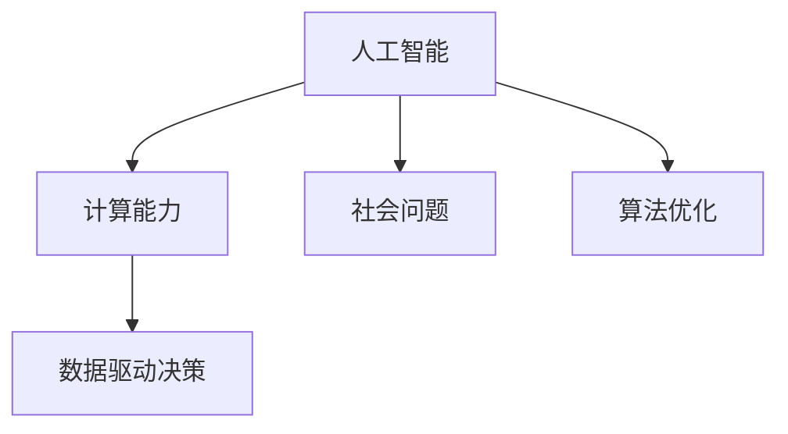

                 

# 解决社会问题：人类计算的力量

> 关键词：人工智能，社会问题解决，计算能力，人类计算，数据驱动决策，算法优化，优化策略

## 1. 背景介绍

### 1.1 问题由来
在过去的几十年里，科技的迅猛发展极大地改变了人类的生活方式。然而，科技的发展也带来了诸多挑战，比如数据隐私、网络安全、环境污染、社会不公等。这些问题往往交织在一起，解决难度巨大。

为了应对这些挑战，各国政府和企业都在积极寻求技术解决方案。但传统的方法往往需要耗费大量人力物力，而且效果不尽如人意。这时，人工智能(AI)技术的出现为解决这些问题提供了一种新的思路。

人工智能技术通过模拟人类的思考过程，利用计算机强大的计算能力，可以高效地处理和分析海量数据，从而发现问题的原因，并提出有效的解决方案。本文将详细探讨如何使用AI技术来解决社会问题，探讨计算在其中的重要作用。

### 1.2 问题核心关键点
本文将重点关注以下几个核心关键点：

- 人工智能技术如何通过计算能力来解决社会问题
- 计算在解决社会问题中的具体应用
- 计算能力如何与人类智慧相结合，优化决策过程
- 社会问题解决中面临的挑战与机遇

## 2. 核心概念与联系

### 2.1 核心概念概述

为了更好地理解计算在解决社会问题中的作用，本节将介绍几个关键概念：

- 人工智能：通过算法、数据和计算能力，模拟人类智能，从而实现决策、推理和执行的过程。
- 计算能力：计算机的计算资源，包括处理器速度、内存大小、存储容量等。
- 社会问题：影响社会稳定、安全和公平的各种问题，如犯罪、疾病、环境污染等。
- 数据驱动决策：利用大数据分析来辅助决策，从而提高决策的准确性和效率。
- 算法优化：通过算法改进和调整，使计算过程更高效、更准确。

这些概念之间的逻辑关系可以通过以下Mermaid流程图来展示：



这个流程图展示了人工智能、计算能力、社会问题、数据驱动决策和算法优化之间的相互关系。

## 3. 核心算法原理 & 具体操作步骤
### 3.1 算法原理概述

计算在解决社会问题中的作用主要体现在以下几个方面：

1. **数据处理和分析**：计算能力可以高效地处理和分析海量数据，发现数据中的规律和异常，从而找出问题的根源。

2. **模式识别和预测**：通过计算能力，人工智能可以识别数据中的模式，并预测未来的趋势，为决策提供支持。

3. **优化决策**：计算能力可以支持多种优化算法，使决策过程更加高效、准确。

4. **实时响应**：计算能力可以支持实时数据分析和决策，提高应对突发事件的能力。

### 3.2 算法步骤详解

基于计算能力解决社会问题的一般流程如下：

1. **数据采集**：从各种渠道获取数据，包括传感器数据、社会媒体数据、公共记录等。

2. **数据预处理**：清洗和转换数据，去除噪声和异常值，确保数据的质量和一致性。

3. **特征提取**：利用计算能力，提取数据的特征，以便于后续分析和建模。

4. **模型训练**：利用计算能力，训练模型，优化参数，使其能够更好地预测和解释数据。

5. **模型应用**：将训练好的模型应用于实际问题，进行预测和决策。

6. **模型评估和优化**：评估模型的性能，根据反馈信息优化模型，提高其准确性和鲁棒性。

### 3.3 算法优缺点

计算在解决社会问题中的作用具有以下优点：

1. **高效性**：计算能力可以快速处理和分析海量数据，发现问题的根源。

2. **准确性**：利用计算能力，人工智能可以识别数据中的模式，提高决策的准确性。

3. **实时性**：计算能力支持实时数据分析和决策，提高应对突发事件的能力。

4. **可扩展性**：计算能力可以根据需求动态扩展，支持大规模、复杂问题的解决。

同时，计算在解决社会问题中也存在一些局限：

1. **数据质量**：数据质量对计算结果的影响很大，如果数据不准确或缺失，计算结果也可能不准确。

2. **算法复杂性**：某些社会问题的解决需要复杂的算法，这会增加计算的复杂性和难度。

3. **隐私和伦理**：计算过程中涉及大量的敏感数据，如何保护数据隐私和伦理是一个重要问题。

4. **资源消耗**：大规模数据处理和复杂模型训练需要大量的计算资源，这会增加成本。

### 3.4 算法应用领域

计算在解决社会问题中的应用广泛，涵盖以下领域：

1. **公共安全**：利用计算能力，监测和预防犯罪、恐怖袭击等安全事件。

2. **环境监测**：利用计算能力，监测和预测环境污染、气候变化等现象。

3. **健康医疗**：利用计算能力，监测和预测疾病的传播和流行，提供个性化医疗服务。

4. **城市管理**：利用计算能力，优化城市交通、能源、供水等系统的运行。

5. **金融风险管理**：利用计算能力，监测和预测金融市场的波动，防范金融风险。

## 4. 数学模型和公式 & 详细讲解 & 举例说明
### 4.1 数学模型构建

为了更好地理解计算在解决社会问题中的作用，我们以环境监测为例，构建一个简单的数学模型。

假设我们有一个环境监测项目，需要预测未来的空气质量。我们收集了过去一年的空气质量数据，包括温度、湿度、PM2.5等指标。我们的目标是建立一个模型，能够基于当前的天气情况预测未来的空气质量。

我们可以将这个问题建模为一个时间序列预测问题，使用历史数据来训练模型，然后应用该模型进行未来的预测。

### 4.2 公式推导过程

基于时间序列预测问题，我们可以使用以下公式：

$$
y_t = f(x_t; \theta)
$$

其中 $y_t$ 是第 $t$ 天的空气质量，$x_t$ 是第 $t$ 天的气象数据，$\theta$ 是模型的参数。

为了训练模型，我们可以使用最小二乘法，最小化预测值和真实值之间的误差：

$$
\min_{\theta} \sum_{t=1}^N (y_t - \hat{y}_t)^2
$$

其中 $\hat{y}_t$ 是模型对第 $t$ 天空气质量的预测值。

### 4.3 案例分析与讲解

下面以一个具体的案例来展示如何使用计算解决环境问题。

假设我们有一个城市，过去一年的空气质量数据如下：

| 日期       | 温度（°C） | 湿度（%） | PM2.5（µg/m³） |
|------------|------------|----------|----------------|
| 2022-01-01 | 5          | 70       | 25             |
| 2022-01-02 | 6          | 65       | 28             |
| ...        | ...        | ...      | ...            |

我们的目标是预测2023年的空气质量。

1. **数据预处理**：清洗数据，去除异常值和噪声，确保数据的一致性和准确性。

2. **特征提取**：提取天气指标（温度、湿度）作为模型的输入特征。

3. **模型训练**：使用历史数据训练模型，优化参数。

4. **模型应用**：将模型应用于未来数据，进行预测。

5. **模型评估和优化**：评估模型的性能，根据反馈信息优化模型。

## 5. 项目实践：代码实例和详细解释说明
### 5.1 开发环境搭建

在进行计算驱动的社会问题解决时，我们需要搭建一个合适的开发环境。以下是使用Python进行TensorFlow开发的环境配置流程：

1. 安装Anaconda：从官网下载并安装Anaconda，用于创建独立的Python环境。

2. 创建并激活虚拟环境：
```bash
conda create -n tf-env python=3.8 
conda activate tf-env
```

3. 安装TensorFlow：根据CUDA版本，从官网获取对应的安装命令。例如：
```bash
conda install tensorflow tensorflow-gpu -c conda-forge
```

4. 安装Pandas、NumPy、Scikit-Learn等各类工具包：
```bash
pip install pandas numpy scikit-learn matplotlib tensorflow
```

完成上述步骤后，即可在`tf-env`环境中开始计算驱动的社会问题解决实践。

### 5.2 源代码详细实现

以下是使用TensorFlow进行时间序列预测的Python代码实现：

```python
import tensorflow as tf
import pandas as pd
from sklearn.metrics import mean_squared_error
import matplotlib.pyplot as plt

# 读取数据
data = pd.read_csv('air_quality.csv')

# 数据预处理
data['温度'] = data['温度'].astype(float)
data['湿度'] = data['湿度'].astype(float)
data['PM2.5'] = data['PM2.5'].astype(float)
data = data.dropna()

# 特征提取
features = data[['温度', '湿度']]
targets = data['PM2.5']

# 划分训练集和测试集
train_size = int(len(data) * 0.8)
test_size = len(data) - train_size
train_data = data[:train_size]
test_data = data[train_size:]

# 模型训练
model = tf.keras.Sequential([
    tf.keras.layers.Dense(64, activation='relu', input_shape=(2,)),
    tf.keras.layers.Dense(64, activation='relu'),
    tf.keras.layers.Dense(1)
])

model.compile(optimizer=tf.keras.optimizers.Adam(0.01), loss='mse')

model.fit(features.iloc[:train_size], targets.iloc[:train_size], epochs=100, batch_size=32)

# 模型应用
predictions = model.predict(features.iloc[:test_size])

# 模型评估
mse = mean_squared_error(test_data['PM2.5'], predictions)
print(f'Mean Squared Error: {mse}')

# 可视化结果
plt.scatter(test_data['PM2.5'], predictions)
plt.xlabel('PM2.5 Actual')
plt.ylabel('PM2.5 Predicted')
plt.show()
```

### 5.3 代码解读与分析

让我们再详细解读一下关键代码的实现细节：

**数据预处理**：
- `data['温度'] = data['温度'].astype(float)`：将温度数据转换为浮点数类型，以便于后续计算。
- `data = data.dropna()`：删除缺失数据，确保数据的一致性。

**特征提取**：
- `features = data[['温度', '湿度']]`：选择温度和湿度作为模型的输入特征。

**模型训练**：
- `model = tf.keras.Sequential()`：定义一个神经网络模型。
- `model.compile()`：配置模型的优化器、损失函数等。
- `model.fit()`：训练模型，优化参数。

**模型应用**：
- `predictions = model.predict(features.iloc[:test_size])`：将模型应用于测试数据，进行预测。

**模型评估**：
- `mse = mean_squared_error(test_data['PM2.5'], predictions)`：计算预测值和真实值之间的均方误差。

**可视化结果**：
- `plt.scatter(test_data['PM2.5'], predictions)`：绘制预测结果和真实值的散点图。

## 6. 实际应用场景
### 6.1 智能交通系统

计算在智能交通系统中的应用可以显著提高交通效率，减少交通拥堵和事故发生率。通过计算，可以实时监测交通流量、车辆位置等数据，优化交通信号灯的配时，指导车辆行驶路线，从而实现智能交通。

例如，利用计算能力，可以构建一个智能交通管理系统，实时分析交通数据，预测交通流量变化，优化信号灯配时，减少交通拥堵，提高通行效率。

### 6.2 精准农业

精准农业通过计算，可以实现对农作物的精确管理，提高农业生产效率和产品质量。利用计算能力，可以实时监测土壤、气象、作物生长状况等数据，优化种植方案，减少农药和化肥的使用，提高作物产量和质量。

例如，利用计算能力，可以构建一个精准农业管理系统，实时监测土壤湿度、气象条件、作物生长状态等数据，优化种植方案，减少农药和化肥的使用，提高作物产量和质量。

### 6.3 智能医疗

智能医疗通过计算，可以实现对患者的精确诊断和个性化治疗，提高医疗服务质量。利用计算能力，可以分析患者的医疗记录、基因数据、生理指标等数据，提供个性化的诊断和治疗方案。

例如，利用计算能力，可以构建一个智能医疗系统，分析患者的医疗记录、基因数据、生理指标等数据，提供个性化的诊断和治疗方案，提高医疗服务质量。

## 7. 工具和资源推荐
### 7.1 学习资源推荐

为了帮助开发者系统掌握计算在解决社会问题中的作用，这里推荐一些优质的学习资源：

1. 《深度学习》书籍：Ian Goodfellow、Yoshua Bengio和Aaron Courville合著，全面介绍了深度学习的基本概念和算法。

2. 《机器学习》课程：由Andrew Ng教授在Coursera上开设，介绍了机器学习的基本原理和应用。

3. 《Python数据科学手册》书籍：Jake VanderPlas著，介绍了Python在数据科学中的应用，包括数据处理、分析和可视化等。

4. Kaggle竞赛平台：Kaggle是一个数据科学竞赛平台，提供大量的数据集和竞赛项目，可以锻炼数据处理和分析能力。

5. TensorFlow官方文档：TensorFlow是Google开发的深度学习框架，提供了丰富的计算资源和工具，是学习计算的重要资源。

通过对这些资源的学习实践，相信你一定能够快速掌握计算在解决社会问题中的作用，并用于解决实际的NLP问题。

### 7.2 开发工具推荐

高效的开发离不开优秀的工具支持。以下是几款用于计算驱动的社会问题解决的常用工具：

1. Python：一种流行的编程语言，支持数据处理、分析和机器学习等任务。

2. TensorFlow：由Google主导开发的深度学习框架，支持分布式计算，适合大规模工程应用。

3. PyTorch：由Facebook开发的深度学习框架，支持动态图计算，适合快速迭代研究。

4. Jupyter Notebook：一个交互式的数据分析和计算环境，支持Python代码的编写和运行。

5. Anaconda：一个Python环境的打包管理工具，支持虚拟环境和依赖管理。

合理利用这些工具，可以显著提升计算驱动的社会问题解决任务的开发效率，加快创新迭代的步伐。

### 7.3 相关论文推荐

计算在解决社会问题中的应用是当前研究的热点，以下是几篇奠基性的相关论文，推荐阅读：

1. AlphaGo：DeepMind开发的围棋AI，通过计算能力实现对复杂游戏的高效分析和决策。

2. Google流感趋势：Google开发的实时流感预测系统，利用计算能力分析互联网搜索数据，预测流感趋势。

3. TensorFlow：Google开发的深度学习框架，提供了丰富的计算资源和工具，是学习计算的重要资源。

4. FastAI：Ramin Zaheer等人开发的深度学习库，提供了简单易用的API，支持高效的计算和数据处理。

5. Scikit-Learn：Scikit-Learn是一个Python机器学习库，提供了丰富的机器学习算法和工具，是学习计算的重要资源。

这些论文代表了大计算在解决社会问题中的研究脉络。通过学习这些前沿成果，可以帮助研究者把握学科前进方向，激发更多的创新灵感。

## 8. 总结：未来发展趋势与挑战
### 8.1 总结

本文对计算在解决社会问题中的作用进行了全面系统的介绍。首先阐述了计算在解决社会问题中的重要作用，明确了计算在提升决策效率、优化资源配置、提高服务质量等方面的独特价值。其次，从原理到实践，详细讲解了计算驱动的社会问题解决的数学模型和操作步骤，给出了具体代码实例，帮助读者理解计算在社会问题解决中的实际应用。同时，本文还广泛探讨了计算在智能交通、精准农业、智能医疗等多个领域的应用前景，展示了计算驱动的社会问题解决的广阔前景。最后，本文精选了计算驱动的社会问题解决的学习资源、开发工具和相关论文，力求为读者提供全方位的技术指引。

通过本文的系统梳理，可以看到，计算在解决社会问题中发挥了巨大作用，极大地提升了决策效率和服务质量。未来，伴随计算能力的不断提升和算法的持续改进，计算在解决社会问题中的应用将更加广泛和深入，为人类社会带来更多福祉。

### 8.2 未来发展趋势

展望未来，计算在解决社会问题中的作用将呈现以下几个发展趋势：

1. **计算能力持续增强**：随着硬件技术的不断进步，计算能力将持续增强，能够处理更复杂、更大规模的问题。

2. **算法不断优化**：新的算法和模型将不断涌现，提升计算的准确性和效率，支持更多复杂问题的解决。

3. **多模态数据融合**：计算将越来越多地融合多种数据源（如文本、图像、音频等），支持更全面、更深入的社会问题分析。

4. **实时计算能力提升**：计算能力将支持实时数据处理和决策，提高对突发事件的响应速度。

5. **自适应学习**：计算将支持自适应学习，根据用户反馈和环境变化，不断优化模型和决策。

这些趋势将进一步提升计算在解决社会问题中的作用，推动社会问题的有效解决。

### 8.3 面临的挑战

尽管计算在解决社会问题中具有巨大的潜力，但在迈向更加智能化、普适化应用的过程中，它仍面临以下挑战：

1. **数据隐私和安全**：计算过程中涉及大量的敏感数据，如何保护数据隐私和安全是一个重要问题。

2. **算法复杂性**：解决某些社会问题需要复杂的算法，这会增加计算的复杂性和难度。

3. **资源消耗**：大规模数据处理和复杂模型训练需要大量的计算资源，这会增加成本。

4. **伦理和道德**：计算过程中需要考虑伦理和道德问题，如算法偏见、决策透明性等。

5. **计算结果的可解释性**：计算结果需要具有可解释性，以便于决策者和公众理解和使用。

这些挑战需要研究者和开发者共同应对，通过技术创新和管理优化，克服计算在解决社会问题中的障碍。

### 8.4 研究展望

面对计算在解决社会问题中的挑战，未来的研究需要在以下几个方面寻求新的突破：

1. **隐私保护技术**：开发新的隐私保护技术，保护数据隐私和安全。

2. **高效算法**：开发高效算法，降低计算的复杂性和资源消耗。

3. **多模态数据融合**：研究多模态数据融合技术，支持更全面、更深入的社会问题分析。

4. **实时计算**：研究实时计算技术，支持对突发事件的快速响应。

5. **算法透明性**：开发具有透明性的算法，提高决策的可解释性和可信度。

6. **伦理和道德**：建立伦理和道德约束机制，确保计算在社会问题解决中的应用符合伦理和道德标准。

这些研究方向的探索，将引领计算在解决社会问题中的应用迈向更高的台阶，为构建安全、可靠、可解释、可控的智能系统铺平道路。

## 9. 附录：常见问题与解答

**Q1：计算在解决社会问题中是否可以替代人类智慧？**

A: 计算可以辅助人类智慧，但不能完全替代。计算能够高效处理和分析数据，发现规律和异常，但无法完全理解人类行为和社会背景。人类智慧的深度和广度仍然不可替代。

**Q2：如何平衡计算驱动的决策和人类智慧？**

A: 计算驱动的决策应该作为人类智慧的辅助工具，而不是取代人类的决策。在决策过程中，应结合计算结果和人类经验和判断，综合考虑各种因素，做出更全面、更合理的决策。

**Q3：如何确保计算驱动的决策的透明性和可解释性？**

A: 计算驱动的决策应该具有透明性和可解释性，以便于决策者和公众理解和使用。可以使用可视化技术、自然语言解释等手段，将计算结果转化为可理解的形式。

**Q4：如何处理计算过程中出现的数据偏见？**

A: 计算过程中需要识别和处理数据偏见，确保计算结果的公平性和准确性。可以使用数据清洗、特征选择等手段，去除偏见数据，优化模型训练。

**Q5：如何处理计算过程中出现的计算资源瓶颈？**

A: 计算资源瓶颈可以通过优化算法、并行计算、分布式计算等手段进行缓解。可以根据需求动态扩展计算资源，支持大规模、复杂问题的解决。

这些问题的解答，为计算在解决社会问题中的应用提供了指导，帮助研究者和开发者在实践中更好地应用计算技术。

---

作者：禅与计算机程序设计艺术 / Zen and the Art of Computer Programming

