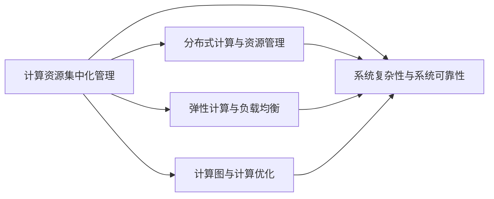

                 

## 1. 背景介绍

### 1.1 问题由来

随着人工智能(AI)技术的快速发展和广泛应用，计算资源的集中化管理日益成为AI发展的显著特征。这种集中化不仅体现在硬件设施（如GPU集群、TPU）上，也体现在软件开发、数据分析、算法模型训练等各个环节中。这种趋势一方面显著提升了AI模型的开发和部署效率，另一方面也带来了对资源管理的严峻挑战。如何平衡资源利用效率与灵活性，避免资源浪费和过度集中，是当前AI领域亟待解决的重要问题。

### 1.2 问题核心关键点

计算资源的集中化管理在提升AI模型开发效率的同时，也带来了对资源管理的复杂性和风险。以下是该问题的主要关键点：

- 资源集中化管理：通过集中管理和调度计算资源，提升AI模型的训练速度和效率。
- 资源利用率：如何在资源集中化管理下，最大化利用计算资源，避免浪费。
- 灵活性与扩展性：如何保持资源的灵活性和快速扩展能力，适应AI应用的动态变化。
- 数据隐私与安全：集中化管理带来的数据安全和隐私风险。
- 系统复杂性与运维成本：资源集中化管理带来的系统复杂性和运维成本增加。

这些关键点体现了计算资源集中化管理在AI发展中的双重作用，既有积极的一面，也存在潜在的风险和挑战。

## 2. 核心概念与联系

### 2.1 核心概念概述

为了更深入地理解计算资源集中化管理及其对AI发展的影响，我们需要先了解几个核心概念：

- 计算资源集中化管理（Resource Centralization Management）：通过集中管理和调度计算资源，实现AI模型的快速开发和部署。
- 分布式计算与资源管理（Distributed Computing & Resource Management）：在大规模分布式环境中，对计算资源进行高效管理和调度。
- 弹性计算与负载均衡（Elastic Computing & Load Balancing）：根据任务需求动态调整计算资源，保持系统稳定运行。
- 计算图与计算优化（Computation Graph & Optimization）：通过对计算图进行优化，提升模型训练和推理的效率。
- 系统复杂性与系统可靠性（System Complexity & Reliability）：在计算资源集中化管理下，系统复杂性增加，对系统可靠性和稳定性提出更高要求。

这些核心概念构成了计算资源集中化管理的基础，彼此之间相互关联，共同影响AI的发展进程。

### 2.2 核心概念原理和架构的 Mermaid 流程图



这个流程图展示了计算资源集中化管理与其它核心概念之间的联系：

- 集中化管理与分布式计算、弹性计算等共同作用，实现计算资源的有效管理和调度。
- 计算图优化与系统复杂性、系统可靠性等相互作用，提升系统整体性能和稳定性。

## 3. 核心算法原理 & 具体操作步骤

### 3.1 算法原理概述

计算资源集中化管理的核心算法原理主要围绕以下几个方面展开：

1. **资源调度算法**：通过对计算资源进行优化调度，提升资源利用率，避免资源浪费。
2. **负载均衡算法**：在分布式环境中，根据任务需求动态调整计算资源，保持系统稳定运行。
3. **计算图优化算法**：通过优化计算图，减少计算量，提升模型训练和推理的效率。
4. **系统可靠性保障**：通过冗余设计、容错机制等技术，确保系统在高负载情况下的稳定性和可靠性。

这些算法原理共同构成了计算资源集中化管理的核心框架，是实现高效、稳定、可靠AI系统的关键。

### 3.2 算法步骤详解

计算资源集中化管理的具体操作步骤通常包括以下几个关键步骤：

**Step 1: 资源池化与调度**  
- 将分散的计算资源进行集中管理和调度，构建资源池。
- 根据任务需求，通过调度算法动态分配计算资源。

**Step 2: 负载均衡**  
- 实时监测系统负载情况，根据任务优先级和资源可用性，合理分配计算资源。
- 采用负载均衡算法，如轮询、最少连接、随机等策略，确保任务均衡执行。

**Step 3: 计算图优化**  
- 对计算图进行优化，如剪枝、分解、合并等操作，减少计算量。
- 采用数据并行、模型并行、混合并行等技术，提升计算效率。

**Step 4: 系统冗余与容错**  
- 引入冗余设计，构建故障转移机制，确保系统的高可用性。
- 采用容错机制，如热备份、自动恢复等，提高系统的鲁棒性。

**Step 5: 监控与调优**  
- 实时监控系统运行状态，收集性能数据。
- 根据监控数据进行系统调优，提升资源利用率和系统性能。

### 3.3 算法优缺点

计算资源集中化管理的主要优点包括：

- **提升效率**：通过集中管理和优化调度，显著提升计算资源的利用率，加速AI模型的训练和推理。
- **降低成本**：集中管理和优化调度，有效避免了资源浪费，降低了维护和管理成本。
- **支持大规模应用**：集中化管理使得大规模分布式应用成为可能，提升了系统的扩展性和灵活性。

但同时，这种管理方式也存在一些显著的缺点：

- **系统复杂性增加**：集中管理和调度带来系统复杂性增加，增加了运维难度和风险。
- **灵活性受限**：资源集中化管理在一定程度上限制了系统的灵活性和扩展性，可能无法快速适应新需求。
- **数据隐私与安全问题**：集中化管理带来的数据集中存储和处理，增加了数据隐私和安全风险。

### 3.4 算法应用领域

计算资源集中化管理的应用领域非常广泛，涉及数据中心、云计算、AI模型训练、网络安全等多个领域。以下是一些主要应用领域：

- **数据中心**：在大型数据中心，通过集中管理和调度计算资源，提升数据处理能力。
- **云计算**：在云平台上，通过弹性计算和负载均衡，支持大规模云应用。
- **AI模型训练**：在AI模型训练过程中，通过集中管理GPU、TPU等高性能计算资源，加速模型训练。
- **网络安全**：在网络安全领域，通过集中管理网络资源，实现高效的网络威胁检测和响应。

这些应用领域展示了计算资源集中化管理在提升系统效率、扩展性和灵活性方面的强大能力，但也需要注意其潜在的缺点和风险。

## 4. 数学模型和公式 & 详细讲解 & 举例说明

### 4.1 数学模型构建

计算资源集中化管理涉及复杂的数学模型和算法，主要包括以下几个方面：

- **资源调度模型**：基于优化理论，构建资源调度模型，优化资源分配。
- **负载均衡模型**：基于分布式系统理论，构建负载均衡模型，合理分配计算资源。
- **计算图优化模型**：基于图论和优化理论，构建计算图优化模型，提升计算效率。
- **系统可靠性模型**：基于可靠性理论，构建系统可靠性模型，确保系统高可用性。

这些模型通过数学语言精确地描述了计算资源集中化管理的各个环节，是实现高效、稳定AI系统的基础。

### 4.2 公式推导过程

以资源调度模型为例，推导其基本公式。假设系统有N个任务，每个任务需要分配K个计算资源，则资源调度问题可以表示为：

$$
\maximize \sum_{i=1}^N f_i(\mathbf{x}_i)
$$

其中，$f_i(\mathbf{x}_i)$为任务$i$的目标函数，$\mathbf{x}_i$为任务$i$的资源分配向量，$\mathbf{x}_i \in [0,1]^K$。

约束条件为：

$$
\begin{aligned}
& \sum_{i=1}^N \mathbf{x}_i \leq M \\
& \mathbf{x}_i \geq 0 \quad \forall i
\end{aligned}
$$

其中，$M$为总的计算资源数。

通过上述线性规划模型，可以通过优化算法求解出最优的资源分配方案。

### 4.3 案例分析与讲解

假设有一个大型AI模型训练任务，需要在5个计算节点上进行分布式训练。每个节点的计算能力不同，分别为CPU、GPU、TPU等。任务的目标是在一定时间内完成模型训练，同时确保每个节点的计算资源利用率最大化。

在计算资源集中化管理下，可以通过分布式训练和负载均衡算法，将任务分配到不同计算节点上。具体步骤如下：

1. 构建资源池，将CPU、GPU、TPU等计算节点集中管理。
2. 根据每个节点的计算能力和任务需求，计算任务分配比例。
3. 通过调度算法，动态分配计算资源，确保任务均衡执行。
4. 实时监控系统负载情况，根据任务优先级和资源可用性，合理调整资源分配。
5. 优化计算图，减少计算量，提升训练效率。
6. 引入冗余设计，构建故障转移机制，确保系统高可用性。

通过这些步骤，可以高效地管理计算资源，加速AI模型的训练和推理。

## 5. 项目实践：代码实例和详细解释说明

### 5.1 开发环境搭建

在进行计算资源集中化管理实践前，我们需要准备好开发环境。以下是使用Python进行TensorFlow开发的环境配置流程：

1. 安装Anaconda：从官网下载并安装Anaconda，用于创建独立的Python环境。

2. 创建并激活虚拟环境：
```bash
conda create -n tf-env python=3.8 
conda activate tf-env
```

3. 安装TensorFlow：根据CUDA版本，从官网获取对应的安装命令。例如：
```bash
conda install tensorflow -c tf -c conda-forge
```

4. 安装TensorFlow Addons：用于支持一些高级功能，如分布式计算、动态图等。
```bash
conda install tensorflow-addons -c tf
```

5. 安装TensorBoard：TensorFlow配套的可视化工具，用于实时监测模型训练状态。
```bash
conda install tensorboard -c tf
```

6. 安装Flax：高性能深度学习库，支持分布式计算和自动微分。
```bash
pip install flax
```

完成上述步骤后，即可在`tf-env`环境中开始计算资源集中化管理实践。

### 5.2 源代码详细实现

下面我们以TensorFlow的分布式计算为例，给出计算资源集中化管理的PyTorch代码实现。

首先，定义计算资源池和任务队列：

```python
from tensorflow import tf
from flax import linen as nn

# 定义计算资源池
resources = tf.distribute.Strategy(
    "tpu",
    tpu="grpc://${TPU_IP}:8470"
)

# 定义任务队列
dataset = tf.data.Dataset.from_tensor_slices((inputs, labels))
dataset = dataset.batch(32).shuffle(buffer_size=10000)
```

然后，定义模型和优化器：

```python
# 定义模型
model = nn.DenseNet(
    hidden_dim=256,
    num_classes=num_classes,
    activation=tf.nn.relu
)

# 定义优化器
optimizer = tf.keras.optimizers.Adam(learning_rate=1e-3)
```

接着，定义训练函数：

```python
@tf.function
def train_step(inputs, labels):
    with tf.GradientTape() as tape:
        logits = model(inputs)
        loss = tf.keras.losses.sparse_categorical_crossentropy(labels, logits)
    grads = tape.gradient(loss, model.trainable_variables)
    optimizer.apply_gradients(zip(grads, model.trainable_variables))
    return loss

# 训练函数
@tf.function
def train_epoch():
    total_loss = 0
    for inputs, labels in dataset:
        with tf.GradientTape() as tape:
            logits = model(inputs)
            loss = tf.keras.losses.sparse_categorical_crossentropy(labels, logits)
        grads = tape.gradient(loss, model.trainable_variables)
        optimizer.apply_gradients(zip(grads, model.trainable_variables))
        total_loss += loss.numpy()
    return total_loss
```

最后，启动训练流程并在测试集上评估：

```python
epochs = 10

for epoch in range(epochs):
    total_loss = train_epoch()
    print(f"Epoch {epoch+1}, total loss: {total_loss:.3f}")

# 测试集评估
test_dataset = tf.data.Dataset.from_tensor_slices((test_inputs, test_labels))
test_dataset = test_dataset.batch(32).shuffle(buffer_size=10000)
test_loss = 0
for inputs, labels in test_dataset:
    logits = model(inputs)
    loss = tf.keras.losses.sparse_categorical_crossentropy(labels, logits)
    test_loss += loss.numpy()
print(f"Test loss: {test_loss:.3f}")
```

以上就是使用TensorFlow和Flax进行分布式计算的代码实现。可以看到，TensorFlow和Flax的结合可以高效地支持分布式计算和自动微分，极大提升了计算资源集中化管理的开发效率。

### 5.3 代码解读与分析

让我们再详细解读一下关键代码的实现细节：

**计算资源池定义**：
- 通过`tf.distribute.Strategy`定义计算资源池，指定使用TPU资源。

**任务队列定义**：
- 使用`tf.data.Dataset`定义任务队列，将数据集拆分成小批量数据，并进行预处理和随机化。

**模型定义与优化器定义**：
- 使用Flax定义模型，支持自动微分和分布式计算。
- 定义Adam优化器，用于更新模型参数。

**训练函数定义**：
- 使用`tf.function`进行模型训练的代码优化，提升执行效率。
- 在训练循环中，使用`tf.GradientTape`记录梯度，并使用`optimizer.apply_gradients`更新模型参数。

**训练流程启动**：
- 循环遍历训练集数据，在每个批次上更新模型参数。
- 实时监测训练损失，并在每个epoch结束后输出。

**测试集评估**：
- 使用测试集数据进行评估，计算测试损失。
- 打印测试集评估结果。

可以看到，TensorFlow和Flax的结合，显著简化了分布式计算和自动微分的过程，使得开发者能够更专注于模型设计和优化。

## 6. 实际应用场景

### 6.1 数据中心

在大数据中心，计算资源集中化管理能够显著提升数据处理能力。通过集中管理GPU、TPU等高性能计算资源，可以实现大规模数据批处理和实时计算，加速数据处理流程。

在实际应用中，可以采用以下策略：

- 构建资源池，集中管理GPU、TPU等计算资源。
- 根据任务需求，动态分配计算资源，提升资源利用率。
- 实时监测系统负载情况，调整计算资源分配，确保系统稳定运行。
- 优化计算图，减少计算量，提升数据处理效率。

通过这些策略，可以高效地管理计算资源，提升数据中心的服务能力。

### 6.2 云计算平台

在云平台上，计算资源集中化管理能够支持大规模云应用。通过弹性计算和负载均衡，可以根据用户需求动态调整计算资源，实现高效的服务部署和扩展。

具体实践如下：

- 构建资源池，集中管理CPU、GPU、TPU等计算资源。
- 根据用户需求，动态调整计算资源分配，支持弹性扩展。
- 实时监测系统负载情况，调整计算资源分配，确保系统稳定运行。
- 优化计算图，减少计算量，提升云应用的处理效率。

通过这些策略，可以实现高效、灵活的云应用服务。

### 6.3 AI模型训练

在AI模型训练过程中，计算资源集中化管理能够加速模型训练和推理。通过集中管理GPU、TPU等高性能计算资源，可以显著缩短模型训练时间，提升模型性能。

具体实践如下：

- 构建资源池，集中管理GPU、TPU等计算资源。
- 根据模型需求，动态调整计算资源分配，提升资源利用率。
- 实时监测系统负载情况，调整计算资源分配，确保系统稳定运行。
- 优化计算图，减少计算量，提升模型训练效率。

通过这些策略，可以实现高效、稳定的AI模型训练。

## 7. 工具和资源推荐

### 7.1 学习资源推荐

为了帮助开发者系统掌握计算资源集中化管理的理论基础和实践技巧，这里推荐一些优质的学习资源：

1. 《Distributed Computing for Machine Learning》系列博文：由机器学习专家撰写，深入浅出地介绍了分布式计算和资源管理的基本概念和经典算法。

2. 《TensorFlow Distribution Strategies》官方文档：TensorFlow的官方文档，提供了丰富的分布式计算和资源管理样例代码，是实践学习的重要资料。

3. 《Flax用户手册》：Flax的官方文档，介绍了Flax的高性能深度学习特性和分布式计算支持，是深入学习Flax的重要资料。

4. 《Scalable Deep Learning》书籍：TensorFlow和Keras的联合创始人撰写，全面介绍了分布式计算、资源管理、优化算法等前沿话题。

5. 《Distributed TensorFlow》课程：由谷歌DeepMind团队开设的课程，详细介绍了TensorFlow的分布式计算和资源管理技术，适合深入学习。

通过对这些资源的学习实践，相信你一定能够快速掌握计算资源集中化管理的精髓，并用于解决实际的计算资源管理问题。

### 7.2 开发工具推荐

高效的开发离不开优秀的工具支持。以下是几款用于计算资源集中化管理开发的常用工具：

1. TensorFlow：基于Python的开源深度学习框架，支持分布式计算和资源管理，适合大规模工程应用。

2. Flax：高性能深度学习库，支持自动微分和分布式计算，适合高效开发AI模型。

3. TensorFlow Addons：TensorFlow的扩展库，支持一些高级功能，如分布式计算、动态图等。

4. TensorBoard：TensorFlow配套的可视化工具，用于实时监测模型训练状态，是调试模型的得力助手。

5. Kubernetes：开源容器编排平台，用于高效管理和调度计算资源，支持大规模分布式应用。

6. Elastic Kubernetes Operations (EKO)：Kubernetes的扩展工具，支持弹性计算和负载均衡，适合云平台应用。

合理利用这些工具，可以显著提升计算资源集中化管理的开发效率，加快创新迭代的步伐。

### 7.3 相关论文推荐

计算资源集中化管理的研究源于学界的持续研究。以下是几篇奠基性的相关论文，推荐阅读：

1. "A Survey of Resource Management in Cloud Computing"（云计算资源管理的综述）：详细介绍了云平台资源管理的理论和实践。

2. "Elastic Cloud Computing"（弹性云计算）：提出了基于弹性计算的云平台资源管理模型，实现了高效的资源分配和扩展。

3. "Distributed Deep Learning with TensorFlow"（基于TensorFlow的分布式深度学习）：介绍了TensorFlow的分布式计算和资源管理特性，适合实际应用。

4. "Distributed TensorFlow for Multi-Device Learning"（基于TensorFlow的分布式多设备学习）：详细介绍了TensorFlow在多设备学习中的应用，适合深入研究。

5. "Flax: Fast and Functional Deep Learning"（Flax：快速且功能强大的深度学习）：介绍了Flax的高性能特性和分布式计算支持，适合实际应用。

这些论文代表了大语言模型微调技术的发展脉络。通过学习这些前沿成果，可以帮助研究者把握学科前进方向，激发更多的创新灵感。

## 8. 总结：未来发展趋势与挑战

### 8.1 总结

本文对计算资源集中化管理进行了全面系统的介绍。首先阐述了计算资源集中化管理的背景和重要性，明确了其在提升AI模型开发效率和系统性能方面的关键作用。其次，从原理到实践，详细讲解了计算资源集中化管理的核心算法和具体操作步骤，给出了实际应用场景下的代码实现。同时，本文还广泛探讨了计算资源集中化管理在数据中心、云计算、AI模型训练等多个行业领域的应用前景，展示了其强大的适应能力。

通过本文的系统梳理，可以看到，计算资源集中化管理已经成为AI领域的重要组成部分，显著提升了AI系统的开发效率和性能。未来，伴随计算资源管理技术的不断进步，AI系统的复杂性和应用场景将更加多样，如何在计算资源集中化管理中实现高效、稳定、灵活、安全的系统运行，仍需更多的研究和探索。

### 8.2 未来发展趋势

展望未来，计算资源集中化管理将呈现以下几个发展趋势：

1. **弹性计算与自动化调优**：通过自动化调优算法，动态调整计算资源分配，实现高效的系统管理和扩展。
2. **分布式训练与联邦学习**：利用分布式训练和联邦学习技术，提升模型训练的效率和数据隐私保护。
3. **资源池化与多云协同**：构建多云资源池，实现跨云平台的资源管理和协同部署，提升系统灵活性和扩展性。
4. **智能运维与自动化运维**：引入人工智能和自动化技术，实现智能运维，提升系统的可靠性和运维效率。
5. **异构计算与融合技术**：利用异构计算和融合技术，提升系统的计算效率和资源利用率。
6. **系统复杂性与系统可靠性**：在资源集中化管理中，通过系统复杂性和系统可靠性的协同优化，提升系统的整体性能和稳定性。

这些趋势凸显了计算资源集中化管理的广阔前景。这些方向的探索发展，必将进一步提升AI系统的性能和应用范围，为人类认知智能的进化带来深远影响。

### 8.3 面临的挑战

尽管计算资源集中化管理在提升AI模型开发效率和系统性能方面具有显著优势，但在实际应用中也面临诸多挑战：

1. **系统复杂性**：集中化管理带来系统复杂性增加，增加了运维难度和风险。
2. **灵活性受限**：资源集中化管理在一定程度上限制了系统的灵活性和扩展性，可能无法快速适应新需求。
3. **资源浪费与过度集中**：集中化管理可能导致资源浪费和过度集中，带来一定的资源利用效率问题。
4. **数据隐私与安全问题**：集中化管理带来的数据集中存储和处理，增加了数据隐私和安全风险。
5. **计算资源管理与优化算法**：如何高效管理和优化计算资源，提升资源利用率和系统性能，仍需深入研究和探索。

这些挑战凸显了计算资源集中化管理在实际应用中的复杂性和风险，需要我们不断优化和改进算法和系统设计。

### 8.4 研究展望

面对计算资源集中化管理所面临的种种挑战，未来的研究需要在以下几个方面寻求新的突破：

1. **自动化调优算法**：引入自动化调优算法，动态调整计算资源分配，实现高效的系统管理和扩展。
2. **分布式训练与联邦学习**：利用分布式训练和联邦学习技术，提升模型训练的效率和数据隐私保护。
3. **智能运维与自动化运维**：引入人工智能和自动化技术，实现智能运维，提升系统的可靠性和运维效率。
4. **异构计算与融合技术**：利用异构计算和融合技术，提升系统的计算效率和资源利用率。
5. **系统复杂性与系统可靠性**：在资源集中化管理中，通过系统复杂性和系统可靠性的协同优化，提升系统的整体性能和稳定性。
6. **多云协同与边缘计算**：构建多云资源池，实现跨云平台的资源管理和协同部署，提升系统灵活性和扩展性。

这些研究方向将推动计算资源集中化管理技术不断进步，实现高效、稳定、灵活、安全的系统运行，为AI技术的持续发展提供坚实保障。

## 9. 附录：常见问题与解答

**Q1：计算资源集中化管理是否适用于所有AI应用场景？**

A: 计算资源集中化管理在大多数AI应用场景中都能取得显著效果，特别是在需要大规模计算资源支持的AI应用中。但对于一些特定应用场景，如边缘计算、移动端应用等，集中化管理可能带来一定的系统复杂性和延迟问题。因此，需要根据具体应用场景选择合适的资源管理策略。

**Q2：如何避免计算资源集中化管理中的资源浪费？**

A: 避免资源浪费的关键在于合理设计计算资源池和任务队列，动态调整计算资源分配。具体措施包括：
1. 合理设计计算资源池，根据不同计算资源的需求和负载情况，进行合理配置。
2. 采用弹性计算和负载均衡技术，动态调整计算资源分配，确保资源高效利用。
3. 实时监测系统负载情况，根据任务优先级和资源可用性，合理调整资源分配，避免资源浪费。

**Q3：如何提升计算资源集中化管理的系统可靠性？**

A: 提升系统可靠性的关键在于引入冗余设计和容错机制。具体措施包括：
1. 引入冗余设计，构建故障转移机制，确保系统的高可用性。
2. 采用容错机制，如热备份、自动恢复等，提高系统的鲁棒性。
3. 定期进行系统测试和优化，及时发现和解决系统问题。

**Q4：计算资源集中化管理如何应对数据隐私和安全问题？**

A: 计算资源集中化管理在数据隐私和安全方面存在一定的风险，具体措施包括：
1. 采用数据加密和脱敏技术，保护数据隐私。
2. 引入多云协同和边缘计算技术，减少数据集中存储和处理的风险。
3. 制定严格的数据访问和操作规则，确保数据安全。

**Q5：如何在计算资源集中化管理中实现高效系统运维？**

A: 实现高效系统运维的关键在于引入自动化和智能运维技术。具体措施包括：
1. 引入自动化调优算法，动态调整计算资源分配，实现高效的系统管理和扩展。
2. 引入智能运维技术，实时监测系统状态，预测和解决潜在问题。
3. 建立完善的运维流程和规范，提升运维效率和质量。

这些措施可以帮助计算资源集中化管理在实际应用中更好地应对系统复杂性、资源浪费、系统可靠性、数据隐私和安全问题，实现高效、稳定、灵活、安全的系统运行。

---

作者：禅与计算机程序设计艺术 / Zen and the Art of Computer Programming

