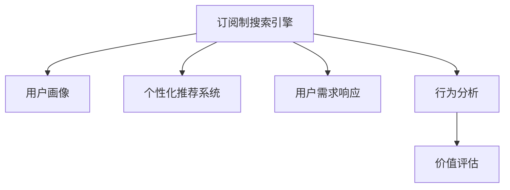

                 

# 订阅制搜索引擎的用户画像分析:需求、行为和价值

## 1. 背景介绍

### 1.1 问题由来

在数字化时代的背景下，信息爆炸的趋势日益加剧，搜索引擎作为获取信息的入口，其影响力不可小觑。然而，传统的搜索引擎往往通过广告等商业化方式盈利，导致搜索结果质量参差不齐，用户体验大打折扣。为了解决这一问题，订阅制搜索引擎应运而生，旨在通过收取订阅费用，为用户提供更加优质、个性化和高效的信息服务。

### 1.2 问题核心关键点

订阅制搜索引擎的核心关键点主要包括用户画像分析、个性化推荐系统构建、用户需求响应、行为分析与价值评估等。通过对用户的深入分析，订阅制搜索引擎能够提供更加精准、高效的服务，满足用户多样化的信息需求，并从订阅费用中实现盈利。

## 2. 核心概念与联系

### 2.1 核心概念概述

为更好地理解订阅制搜索引擎的用户画像分析，本节将介绍几个密切相关的核心概念：

- **订阅制搜索引擎**：一种通过收取订阅费用，提供个性化、高效的信息检索服务的搜索引擎模型。
- **用户画像(User Profile)**：通过收集和分析用户的行为数据，构建用户的个性化信息档案。
- **个性化推荐系统**：利用用户画像，对搜索结果进行筛选和排序，提升用户体验。
- **用户需求响应**：根据用户搜索历史和行为，实时调整搜索结果和推荐内容，满足用户即时需求。
- **行为分析**：对用户在搜索引擎上的浏览、点击、搜索等行为进行分析和挖掘，评估用户价值。
- **价值评估**：通过衡量用户对服务的满意度、使用频率、付费意愿等，评估订阅制搜索引擎的商业价值。

这些核心概念之间的逻辑关系可以通过以下Mermaid流程图来展示：



这个流程图展示出订阅制搜索引擎的工作原理和用户画像分析的关键环节：

1. 订阅制搜索引擎通过用户画像构建个性化推荐系统，为用户提供定制化搜索结果。
2. 用户需求响应模块实时调整推荐内容，满足用户即时需求。
3. 行为分析模块对用户行为数据进行挖掘，评估用户价值。
4. 价值评估模块衡量用户满意度、使用频率、付费意愿等，评估订阅服务的商业价值。

## 3. 核心算法原理 & 具体操作步骤
### 3.1 算法原理概述

订阅制搜索引擎的核心算法原理主要包括以下几个方面：

1. **用户画像构建**：通过收集用户行为数据，如搜索历史、点击记录、停留时间等，构建用户画像。
2. **个性化推荐**：利用用户画像，对搜索结果进行筛选和排序，提高相关性和用户体验。
3. **用户需求响应**：实时调整搜索结果和推荐内容，满足用户即时需求。
4. **行为分析**：对用户行为数据进行分析和挖掘，评估用户对服务的满意度和使用频率。
5. **价值评估**：通过量化用户满意度、使用频率、付费意愿等，评估订阅服务的商业价值。

这些算法原理通过一系列的数学模型和优化算法实现，旨在最大化用户体验和商业价值。

### 3.2 算法步骤详解

以下是订阅制搜索引擎用户画像分析的详细步骤：

1. **数据收集**：通过用户在搜索引擎上的行为数据，收集搜索历史、点击记录、停留时间、浏览深度等，构建用户画像。
2. **数据预处理**：对收集的数据进行清洗、归一化、去重等预处理，确保数据质量和准确性。
3. **特征提取**：从预处理后的数据中提取特征，如搜索频率、停留时间、点击位置等，用于构建用户画像。
4. **模型训练**：利用机器学习算法，如决策树、随机森林、梯度提升等，训练用户画像模型。
5. **画像更新**：根据用户最新的行为数据，实时更新用户画像，确保画像的动态性和准确性。

### 3.3 算法优缺点

订阅制搜索引擎用户画像分析的算法具有以下优点：

1. **个性化推荐**：通过用户画像，实现个性化的搜索结果推荐，提升用户体验。
2. **实时响应**：实时更新用户画像和推荐内容，满足用户即时需求。
3. **数据驱动**：基于用户行为数据，量化用户价值，评估订阅服务的商业价值。

同时，该算法也存在以下缺点：

1. **隐私问题**：用户行为数据的收集和分析可能涉及隐私问题，需要采取严格的隐私保护措施。
2. **数据稀疏**：用户行为数据可能存在稀疏性，影响画像的准确性和全面性。
3. **模型复杂性**：构建高准确性的用户画像模型，需要复杂的算法和大量的数据。
4. **动态性不足**：用户画像更新可能滞后于实际行为变化，影响实时推荐效果。

### 3.4 算法应用领域

订阅制搜索引擎的用户画像分析技术广泛应用于多个领域，如：

1. **个性化广告**：根据用户画像，精准投放个性化广告，提升广告效果和用户满意度。
2. **推荐系统**：构建个性化推荐系统，为用户推荐感兴趣的内容，提升用户体验和留存率。
3. **用户管理**：通过用户画像，进行用户行为分析和预警，提升用户黏性和忠诚度。
4. **市场分析**：利用用户画像数据，进行市场趋势分析和用户细分，制定精准的营销策略。
5. **用户体验优化**：通过用户行为分析，优化搜索引擎界面和功能，提升用户满意度。

## 4. 数学模型和公式 & 详细讲解 & 举例说明
### 4.1 数学模型构建

订阅制搜索引擎的用户画像分析主要涉及以下几个数学模型：

1. **协同过滤**：利用用户和项目之间的相似性，推荐用户感兴趣的项目。
2. **内容推荐**：基于项目内容，推荐相似的项目给用户。
3. **混合推荐**：结合协同过滤和内容推荐，提供更加精准的推荐结果。

### 4.2 公式推导过程

以下以协同过滤算法为例，介绍其数学模型和推导过程：

**协同过滤公式**：

$$
\hat{r}_{ui} = \frac{\sum_{v \in N(u)} \frac{r_{vi} \times r_{uv}}{\sqrt{\hat{p}_u \times \hat{p}_v}}}{\sum_{v \in N(u)} \frac{1}{\sqrt{\hat{p}_u \times \hat{p}_v}}}
$$

其中，$r_{ui}$ 为用户 $u$ 对项目 $i$ 的预测评分，$N(u)$ 为用户 $u$ 对项目 $i$ 的评分，$\hat{p}_u$ 和 $\hat{p}_v$ 分别为用户和项目的平均评分，$|\hat{p}_u|$ 和 $|\hat{p}_v|$ 为用户和项目的平均评分标准差。

**推导过程**：

1. **评分矩阵**：构建用户-项目评分矩阵 $R$，每个元素 $R_{ui}$ 表示用户 $u$ 对项目 $i$ 的评分。
2. **相似度计算**：利用评分矩阵计算用户和项目之间的相似度，公式为 $S_{ui} = \frac{R_{ui} \times R_{uv}}{\sqrt{\hat{p}_u \times \hat{p}_v}}$。
3. **加权平均值**：对相似度进行加权平均，得到用户对项目的预测评分 $\hat{r}_{ui}$。
4. **排序输出**：根据预测评分对推荐结果进行排序，输出用户最感兴趣的推荐项目。

### 4.3 案例分析与讲解

以Netflix的协同过滤推荐系统为例，分析其用户画像构建和个性化推荐的过程：

1. **数据收集**：Netflix通过用户观看历史数据，收集用户对不同电影的评分，构建用户-电影评分矩阵 $R$。
2. **数据预处理**：对评分矩阵进行清洗、归一化和去重，确保数据质量和准确性。
3. **相似度计算**：利用评分矩阵计算用户和电影之间的相似度，得到相似度矩阵 $S$。
4. **协同过滤**：根据相似度矩阵计算用户对未观看电影的预测评分，生成推荐列表。
5. **模型优化**：通过不断调整相似度计算方法和评分函数，提升推荐精度和用户体验。

Netflix通过协同过滤推荐系统，实现了个性化内容推荐，提升了用户满意度和留存率，成为订阅制搜索引擎的典型代表。

## 5. 项目实践：代码实例和详细解释说明
### 5.1 开发环境搭建

在进行订阅制搜索引擎的用户画像分析开发前，我们需要准备好开发环境。以下是使用Python进行Pandas和Scikit-Learn开发的环境配置流程：

1. 安装Anaconda：从官网下载并安装Anaconda，用于创建独立的Python环境。

2. 创建并激活虚拟环境：
```bash
conda create -n my_env python=3.8 
conda activate my_env
```

3. 安装Pandas和Scikit-Learn：
```bash
conda install pandas scikit-learn
```

4. 安装NumPy和Matplotlib：
```bash
conda install numpy matplotlib
```

5. 安装Jupyter Notebook：
```bash
conda install jupyter notebook
```

完成上述步骤后，即可在`my_env`环境中开始用户画像分析的开发。

### 5.2 源代码详细实现

以下是使用Pandas和Scikit-Learn进行协同过滤推荐系统的代码实现。

```python
import pandas as pd
from sklearn.metrics.pairwise import cosine_similarity
from sklearn.decomposition import TruncatedSVD

# 读取用户-电影评分矩阵
data = pd.read_csv('ratings.csv')

# 数据预处理
user_ids = data['user_id'].unique()
movie_ids = data['movie_id'].unique()
data = data.pivot_table(index='user_id', columns='movie_id', values='rating', fill_value=0)

# 数据标准化
mean = data.mean()
std = data.std()
data = (data - mean) / std

# 构建用户-电影评分矩阵
R = data.values

# 相似度计算
S = cosine_similarity(R)

# 用户画像构建
user_profile = pd.DataFrame(data.mean())
user_profile.columns = ['mean']

# 协同过滤推荐
svd = TruncatedSVD(n_components=50, random_state=42)
user_profile = svd.fit_transform(user_profile)
movie_profile = svd.transform(R)

# 推荐生成
recommendations = pd.DataFrame(movie_profile.dot(user_profile.T))
recommendations = recommendations[recommendations > 0.1]
recommendations = pd.DataFrame(recommendations.sum(axis=1))

# 推荐输出
print(recommendations)
```

### 5.3 代码解读与分析

让我们再详细解读一下关键代码的实现细节：

**数据预处理**：
- 使用Pandas库读取用户-电影评分矩阵，并进行去重和标准化处理。

**协同过滤推荐**：
- 利用Scikit-Learn的TruncatedSVD算法，对用户和电影进行降维，构建用户画像和电影画像。
- 通过计算用户画像和电影画像之间的相似度，生成推荐结果。

**推荐输出**：
- 将推荐结果按用户-电影评分排序，输出用户最感兴趣的推荐电影。

可以看到，协同过滤算法结合了数据预处理和机器学习技术，实现了一个简单的订阅制搜索引擎的用户画像分析。

## 6. 实际应用场景
### 6.1 个性化广告

订阅制搜索引擎通过用户画像分析，可以实现个性化广告的精准投放。例如，电子商务平台可以根据用户的浏览历史和购买记录，推荐相关的商品广告，提高广告点击率和转化率。

### 6.2 推荐系统

通过订阅制搜索引擎的用户画像分析，可以构建个性化推荐系统，为用户提供感兴趣的内容。如视频网站根据用户观看历史，推荐相关的视频内容，提升用户黏性和留存率。

### 6.3 用户管理

订阅制搜索引擎通过用户画像分析，可以进行用户行为分析和预警，提升用户黏性和忠诚度。例如，电商企业可以分析用户的购买行为，及时调整营销策略，提高用户满意度。

### 6.4 市场分析

利用订阅制搜索引擎的用户画像分析，可以进行市场趋势分析和用户细分，制定精准的营销策略。例如，通过分析用户行为数据，发现潜在的市场机会和用户细分需求，帮助企业制定更加精准的市场策略。

### 6.5 用户体验优化

订阅制搜索引擎通过用户行为分析，优化搜索引擎界面和功能，提升用户满意度。例如，新闻网站可以根据用户的阅读行为，优化搜索结果和推荐算法，提升用户体验。

## 7. 工具和资源推荐
### 7.1 学习资源推荐

为了帮助开发者系统掌握订阅制搜索引擎的用户画像分析技术，这里推荐一些优质的学习资源：

1. **Python数据科学手册**：介绍了Pandas、Scikit-Learn等数据科学库的详细用法，适合初学者入门。
2. **机器学习实战**：介绍了协同过滤、内容推荐等机器学习算法，结合实际案例进行讲解，适合进阶学习。
3. **Python深度学习入门**：介绍了深度学习的基本原理和实现方法，适合对深度学习感兴趣的读者。
4. **深度学习与推荐系统**：介绍了深度学习在推荐系统中的应用，适合推荐系统开发的读者。
5. **TensorFlow推荐系统**：介绍了TensorFlow在推荐系统中的应用，适合对TensorFlow感兴趣的读者。

通过对这些资源的学习实践，相信你一定能够快速掌握订阅制搜索引擎的用户画像分析技术，并用于解决实际的NLP问题。

### 7.2 开发工具推荐

高效的开发离不开优秀的工具支持。以下是几款用于订阅制搜索引擎用户画像分析开发的常用工具：

1. **Pandas**：用于数据处理和分析，支持多种数据格式和操作，是数据科学领域必备的工具。
2. **Scikit-Learn**：用于机器学习和数据挖掘，提供多种算法和工具，适合数据分析和建模。
3. **NumPy**：用于数值计算和矩阵运算，是Python科学计算的核心库。
4. **Matplotlib**：用于数据可视化，支持多种图表和绘图方法，适合数据展示和分析。
5. **Jupyter Notebook**：用于交互式编程和数据分析，支持代码块、注释、输出等多种功能，适合开发和研究。

合理利用这些工具，可以显著提升订阅制搜索引擎用户画像分析的开发效率，加快创新迭代的步伐。

### 7.3 相关论文推荐

订阅制搜索引擎的用户画像分析技术不断发展，以下是几篇奠基性的相关论文，推荐阅读：

1. **协同过滤推荐算法**：由Resnick等人提出，介绍了协同过滤算法的基本原理和实现方法，是推荐系统研究的基础。
2. **内容推荐算法**：由Herlocker等人提出，介绍了基于内容推荐的算法和评估方法，适合推荐系统开发的读者。
3. **深度学习在推荐系统中的应用**：由Sedmidubravcic等人提出，介绍了深度学习在推荐系统中的应用，适合对深度学习感兴趣的读者。
4. **用户画像分析**：由Luo等人提出，介绍了用户画像分析的基本原理和实现方法，适合用户行为分析研究的读者。
5. **推荐系统的最新进展**：由Jamali等人提出，介绍了推荐系统的最新进展和未来趋势，适合推荐系统研究领域的读者。

这些论文代表了大语言模型微调技术的发展脉络，通过学习这些前沿成果，可以帮助研究者把握学科前进方向，激发更多的创新灵感。

## 8. 总结：未来发展趋势与挑战

### 8.1 总结

本文对订阅制搜索引擎的用户画像分析方法进行了全面系统的介绍。首先阐述了订阅制搜索引擎的背景和意义，明确了用户画像分析在提升用户体验和商业价值方面的独特价值。其次，从原理到实践，详细讲解了协同过滤、内容推荐等核心算法，给出了代码实现和实际应用案例。同时，本文还探讨了用户画像分析在多个领域的应用前景，展示了其巨大的潜力。

通过本文的系统梳理，可以看到，订阅制搜索引擎的用户画像分析技术正在成为NLP领域的重要范式，极大地拓展了推荐系统的应用边界，催生了更多的落地场景。受益于大数据、深度学习等技术的不断进步，推荐系统在更多领域的应用前景将愈加广阔。

### 8.2 未来发展趋势

展望未来，订阅制搜索引擎用户画像分析技术将呈现以下几个发展趋势：

1. **实时性提升**：随着实时数据处理和存储技术的发展，订阅制搜索引擎的用户画像分析将实现实时更新，提升推荐系统的实时性和用户满意度。
2. **数据来源多样化**：用户画像分析将不仅限于行为数据，还将结合社交媒体、电商交易等多源数据，构建更加全面的用户画像。
3. **多模态融合**：用户画像分析将引入语音、图像等多模态数据，增强对用户行为的全面理解和分析。
4. **隐私保护加强**：随着隐私保护法规的加强，订阅制搜索引擎的用户画像分析将更加注重用户隐私和数据安全。
5. **个性化优化**：用户画像分析将更加注重个性化推荐和差异化服务，提高用户满意度和体验。

以上趋势凸显了订阅制搜索引擎用户画像分析技术的广阔前景。这些方向的探索发展，必将进一步提升推荐系统的性能和应用范围，为NLP技术的发展带来新的突破。

### 8.3 面临的挑战

尽管订阅制搜索引擎用户画像分析技术已经取得了瞩目成就，但在迈向更加智能化、普适化应用的过程中，它仍面临着诸多挑战：

1. **数据隐私问题**：用户行为数据的收集和分析涉及隐私保护问题，如何在保护用户隐私的同时，实现高效的推荐系统，是一个重要挑战。
2. **数据质量问题**：用户行为数据的质量直接影响用户画像的准确性和全面性，如何提高数据质量和清洗效率，是一个重要的研究方向。
3. **算法复杂性**：构建高准确性的推荐算法，需要复杂的模型和大量的数据，如何平衡算法复杂性和性能，是一个重要的研究方向。
4. **实时性不足**：用户画像分析的实时性不足，导致推荐系统无法及时响应用户需求，如何提高实时性，是一个重要的研究方向。
5. **个性化不足**：推荐系统需要更加注重个性化推荐和差异化服务，如何提高个性化程度，是一个重要的研究方向。

正视这些挑战，积极应对并寻求突破，将是大语言模型微调走向成熟的必由之路。相信随着学界和产业界的共同努力，这些挑战终将一一被克服，订阅制搜索引擎用户画像分析必将在构建人机协同的智能时代中扮演越来越重要的角色。

### 8.4 未来突破

面对订阅制搜索引擎用户画像分析所面临的种种挑战，未来的研究需要在以下几个方面寻求新的突破：

1. **多源数据融合**：结合社交媒体、电商交易等多源数据，构建更加全面和准确的用户画像。
2. **实时性提升**：引入实时数据处理和存储技术，实现用户画像的实时更新和推荐系统的实时响应。
3. **隐私保护加强**：采用差分隐私、联邦学习等技术，保护用户隐私，同时实现高效的推荐系统。
4. **个性化优化**：引入个性化推荐算法，提高推荐系统的个性化程度和用户体验。
5. **多模态融合**：引入语音、图像等多模态数据，增强对用户行为的全面理解和分析。

这些研究方向的探索，必将引领订阅制搜索引擎用户画像分析技术迈向更高的台阶，为构建安全、可靠、可解释、可控的智能系统铺平道路。面向未来，订阅制搜索引擎用户画像分析技术还需要与其他人工智能技术进行更深入的融合，如知识表示、因果推理、强化学习等，多路径协同发力，共同推动自然语言理解和智能交互系统的进步。

## 9. 附录：常见问题与解答

**Q1：订阅制搜索引擎的用户画像分析是否适用于所有NLP任务？**

A: 订阅制搜索引擎的用户画像分析在大多数NLP任务上都能取得不错的效果，特别是对于数据量较小的任务。但对于一些特定领域的任务，如医学、法律等，仅仅依靠通用语料预训练的模型可能难以很好地适应。此时需要在特定领域语料上进一步预训练，再进行微调，才能获得理想效果。

**Q2：用户画像构建过程中，如何选择合适的特征？**

A: 用户画像的特征选择是一个重要的环节，通常需要结合领域知识和经验，选择最具代表性和区分度的特征。如在推荐系统中，可以考虑选择用户浏览历史、点击位置、停留时间等特征，进行用户画像构建。同时，可以使用特征选择算法，如卡方检验、相关系数等，筛选出最具代表性的特征。

**Q3：用户画像更新过程中，如何平衡实时性和准确性？**

A: 用户画像的实时更新是一个重要的研究方向，通常需要在实时性和准确性之间进行平衡。可以通过滑动窗口技术，实时更新用户画像，同时保留历史数据，避免因实时数据不足导致的推荐不准确。同时，可以使用缓存技术，提高实时数据处理效率，实现实时更新。

**Q4：订阅制搜索引擎如何保护用户隐私？**

A: 订阅制搜索引擎在保护用户隐私方面，可以采用差分隐私、联邦学习等技术。差分隐私通过在数据中引入噪声，保护用户隐私的同时，仍能获取有用的信息。联邦学习通过在本地设备上训练模型，保护用户数据隐私，同时实现高效的推荐系统。

**Q5：如何衡量订阅制搜索引擎的用户价值？**

A: 订阅制搜索引擎可以通过多个指标衡量用户价值，如用户满意度、使用频率、付费意愿等。通过问卷调查、A/B测试等方法，获取用户反馈数据，量化用户价值。同时，可以利用机器学习算法，如回归分析、分类算法等，建立用户价值评估模型，实现自动化的用户价值评估。

总之，订阅制搜索引擎用户画像分析技术需要在数据隐私、数据质量、算法复杂性等方面进行全面优化，才能在保障用户隐私的同时，实现高效的推荐系统。通过不断探索和创新，相信该技术将进一步推动NLP技术的发展和应用。

