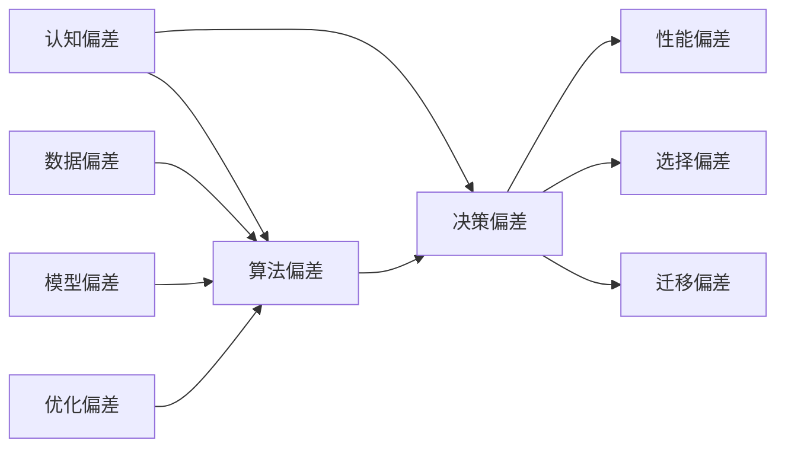

                 

## 1. 背景介绍

### 1.1 问题由来

决策是人机交互中最常见的活动之一，对于智能系统而言，其核心功能之一便是辅助或代替人类进行合理决策。然而，认知偏差的出现使得决策过程充满了不确定性。认知偏差是人类在认知过程中产生的一系列非理性行为，影响决策的客观性和准确性。

在人工智能（AI）中，认知偏差问题同样存在，特别是在大数据和深度学习模型的应用中。数据偏差、算法设计偏差、模型训练偏差等，都可能导致AI系统产生不合理的决策。尤其在AI辅助决策的应用场景中，如医疗诊断、金融投资、法律裁决等，认知偏差问题可能会带来严重的后果。

### 1.2 问题核心关键点

为了帮助开发者和AI研究者更好地理解并应对认知偏差问题，本节将介绍几个关键概念：

- 认知偏差（Cognitive Bias）：指人们在信息处理和决策过程中，基于经验、情绪、文化背景等因素，形成的系统性偏差。
- 算法偏差（Algorithmic Bias）：指算法在数据处理和模型训练过程中，因为数据质量、模型设计、优化策略等问题，产生的系统性偏见。
- 决策偏差（Decision Bias）：指在决策过程中，因为认知偏差和算法偏差，使得决策结果偏离真实最优解的系统性偏差。
- 数据偏差（Data Bias）：指数据样本不均衡、不充分或不代表总体分布，导致模型学习到的知识存在偏差。
- 模型偏差（Model Bias）：指模型结构设计不合理、参数选择不恰当或过度拟合等问题，使得模型在处理特定问题时产生偏差。

这些核心概念共同构成了AI系统在决策过程中需要面对的认知偏差问题。通过理解这些关键点，我们能够更好地掌握避免思维陷阱的策略，提升AI系统的决策能力。

### 1.3 问题研究意义

研究认知偏差问题，对于保障AI系统的决策质量、增强AI系统的可信度和可靠性、推动AI技术的可持续发展具有重要意义：

1. **保障决策质量**：认知偏差问题可能导致AI系统输出错误或不可靠的决策结果，影响系统可信度和应用场景的实际效果。
2. **增强系统可信度**：认知偏差的识别和纠正，可以提升AI系统的透明性和可解释性，增强用户和监管机构对系统的信任。
3. **推动技术发展**：识别和应对认知偏差问题，推动了AI领域的研究和应用领域的探索，加速了AI技术的发展和成熟。
4. **防止潜在风险**：通过系统性设计，预防认知偏差问题，能够减少AI系统在关键应用场景中带来的潜在风险和负面影响。
5. **促进人工智能产业化**：解决认知偏差问题，有助于构建更加安全、可靠、高效的AI应用系统，推动AI技术在各行业的广泛应用。

## 2. 核心概念与联系

### 2.1 核心概念概述

为了更系统地理解认知偏差问题，本节将详细讲解与认知偏差相关的几个核心概念及其联系。

#### 2.1.1 认知偏差

认知偏差（Cognitive Bias）是人们在信息处理和决策过程中，基于主观经验和情绪等因素形成的系统性偏差。常见的认知偏差包括但不限于以下几种：

- **锚定效应（Anchoring Bias）**：在决策时过度依赖初始信息，难以根据最新信息调整决策。
- **可得性启发式（Availability Heuristic）**：倾向于根据易得的信息做出决策，忽视不易获取的信息。
- **代表性启发式（Representativeness Heuristic）**：倾向于将特定样本的特征与总体特征等同，忽略样本的真实频率。
- **确认偏误（Confirmation Bias）**：倾向于只接受支持自己观点的信息，忽略或歪曲不利于自己的信息。
- **过度自信（Overconfidence）**：倾向于高估自己的能力和决策的准确性。
- **事后聪明偏差（Hindsight Bias）**：在事件发生后，倾向于认为预测是显而易见的，忽视了当时的困难。

#### 2.1.2 算法偏差

算法偏差（Algorithmic Bias）指在算法设计和训练过程中，因为数据质量、模型设计、优化策略等问题，产生的系统性偏见。常见的算法偏差包括但不限于以下几种：

- **数据偏差（Data Bias）**：数据样本不均衡、不充分或不代表总体分布，导致模型学习到的知识存在偏差。
- **模型偏差（Model Bias）**：模型结构设计不合理、参数选择不恰当或过度拟合等问题，使得模型在处理特定问题时产生偏差。
- **优化偏差（Optimization Bias）**：优化算法选择不合理，导致模型在训练过程中产生偏差。

#### 2.1.3 决策偏差

决策偏差（Decision Bias）指在决策过程中，因为认知偏差和算法偏差，使得决策结果偏离真实最优解的系统性偏差。常见的决策偏差包括但不限于以下几种：

- **性能偏差（Performance Bias）**：在评估模型性能时，倾向于选择表现最好的模型，忽略其他有潜力的模型。
- **选择偏差（Selection Bias）**：倾向于选择与历史数据或目标相似的数据集进行模型训练，导致模型泛化能力不足。
- **迁移偏差（Transfer Bias）**：在模型迁移应用时，因为新数据集与训练数据集分布不同，导致模型性能下降。

通过理解认知偏差、算法偏差和决策偏差的联系，我们可以更好地识别和应对AI系统中的认知偏差问题，提升系统的决策能力。

### 2.2 核心概念原理和架构的 Mermaid 流程图

下面通过Mermaid流程图展示认知偏差、算法偏差和决策偏差之间的联系。



从上述流程图中，我们可以看到：

- 认知偏差会通过算法设计传递到算法偏差，进而影响决策偏差。
- 数据偏差和模型偏差是算法偏差的主要来源。
- 优化偏差同样会对算法偏差产生影响。
- 决策偏差会进一步影响性能、选择和迁移偏差。

这些概念之间的联系和互动，形成了AI系统中的认知偏差问题链条。通过理解和处理这些偏差，我们可以提升AI系统的决策质量和可信度。

## 3. 核心算法原理 & 具体操作步骤

### 3.1 算法原理概述

认知偏差问题的应对，主要是通过识别、分析和纠正算法和决策过程中存在的偏差。本节将详细讲解认知偏差问题的算法原理，包括数据处理、模型设计和优化策略等方面。

#### 3.1.1 数据处理

数据处理是认知偏差问题应对的基础。数据偏差是指数据样本不均衡、不充分或不代表总体分布，导致模型学习到的知识存在偏差。通过数据处理，可以有效减少数据偏差的影响。

常见的数据处理技术包括：

- **数据增强（Data Augmentation）**：通过对数据进行旋转、平移、缩放等变换，增加数据样本的多样性，减少数据偏差的影响。
- **样本平衡（Sample Balancing）**：通过欠采样、过采样或重新采样等方法，平衡数据集中不同类别的样本数量，减少数据偏差的影响。
- **数据清洗（Data Cleaning）**：去除数据中的噪声、异常值和重复数据，提高数据的质量和代表性。

#### 3.1.2 模型设计

模型设计是认知偏差问题应对的关键。模型偏差是指模型结构设计不合理、参数选择不恰当或过度拟合等问题，使得模型在处理特定问题时产生偏差。通过合理的模型设计，可以有效减少模型偏差的影响。

常见的模型设计技术包括：

- **正则化（Regularization）**：通过引入L1、L2正则化等方法，防止模型过度拟合，提高模型的泛化能力。
- **参数共享（Parameter Sharing）**：通过共享参数，减少模型参数数量，提高模型的泛化能力。
- **模型集成（Model Ensembling）**：通过组合多个模型进行预测，减少单一模型偏差的累积影响。

#### 3.1.3 优化策略

优化策略是认知偏差问题应对的重要手段。优化偏差是指优化算法选择不合理，导致模型在训练过程中产生偏差。通过合理的优化策略，可以有效减少优化偏差的影响。

常见的优化策略包括：

- **自适应优化算法（Adaptive Optimization Algorithms）**：通过自适应调整学习率和步长等参数，防止模型陷入局部最优，提高模型泛化能力。
- **多目标优化（Multi-Objective Optimization）**：通过同时优化多个目标函数，提升模型的性能和鲁棒性。
- **超参数调优（Hyperparameter Tuning）**：通过网格搜索、贝叶斯优化等方法，找到最佳的超参数组合，减少优化偏差的影响。

### 3.2 算法步骤详解

本节将详细介绍认知偏差问题应对的具体步骤，包括数据处理、模型设计和优化策略等方面的具体操作。

#### 3.2.1 数据处理

1. **数据收集与标注**：收集具有代表性的数据样本，并对数据进行标注，确保数据集的真实性和代表性。
2. **数据清洗与预处理**：去除数据中的噪声、异常值和重复数据，并进行标准化和归一化处理。
3. **数据增强与平衡**：通过数据增强和样本平衡技术，增加数据样本的多样性和代表性。

#### 3.2.2 模型设计

1. **模型选择与结构设计**：选择适合的模型架构，设计合理的模型结构，如CNN、RNN、Transformer等。
2. **正则化与参数共享**：引入正则化技术，如L1、L2正则化，进行参数共享，减少模型参数数量。
3. **模型集成与融合**：组合多个模型进行预测，如Bagging、Boosting、Stacking等方法。

#### 3.2.3 优化策略

1. **优化算法选择**：选择适合的数据集和任务，选择合适的优化算法，如SGD、Adam等。
2. **自适应优化**：通过自适应调整学习率和步长等参数，防止模型陷入局部最优。
3. **超参数调优**：通过网格搜索、贝叶斯优化等方法，找到最佳的超参数组合。

### 3.3 算法优缺点

#### 3.3.1 优点

- **提升模型泛化能力**：通过数据处理、模型设计和优化策略，可以有效减少数据偏差和模型偏差，提升模型的泛化能力。
- **提高模型鲁棒性**：通过正则化、参数共享和模型集成等方法，可以提高模型的鲁棒性，减少过拟合和优化偏差的影响。
- **降低计算成本**：通过数据增强和样本平衡等方法，可以减少数据样本的数量，降低计算成本。

#### 3.3.2 缺点

- **数据处理复杂**：数据收集、标注、清洗和预处理等步骤较为繁琐，需要大量的工作量和资源。
- **模型设计复杂**：模型选择、结构设计、正则化和参数共享等技术较为复杂，需要较高的技术水平和经验。
- **超参数调优困难**：超参数调优需要大量的计算资源和时间，且容易陷入局部最优。

### 3.4 算法应用领域

认知偏差问题在多个领域都有应用。

#### 3.4.1 医疗诊断

在医疗诊断领域，认知偏差问题可能导致医生过度诊断或漏诊，影响患者健康和治疗效果。通过数据处理、模型设计和优化策略，可以有效减少认知偏差问题，提升诊断的准确性和可靠性。

#### 3.4.2 金融投资

在金融投资领域，认知偏差问题可能导致投资者过度自信或盲目跟随，影响投资决策和资产回报。通过数据处理、模型设计和优化策略，可以有效减少认知偏差问题，提升投资决策的科学性和理性。

#### 3.4.3 法律裁决

在法律裁决领域，认知偏差问题可能导致法官误判或偏袒，影响司法公正和法律威信。通过数据处理、模型设计和优化策略，可以有效减少认知偏差问题，提升裁决的公正性和准确性。

## 4. 数学模型和公式 & 详细讲解 & 举例说明

### 4.1 数学模型构建

本节将通过数学语言对认知偏差问题的应对方法进行更加严格的刻画。

假设数据集为$D=\{(x_i,y_i)\}_{i=1}^N$，其中$x_i$为输入样本，$y_i$为对应的标签。模型$M_{\theta}$表示参数为$\theta$的模型，训练过程的目标是最小化经验风险：

$$
\mathcal{L}(\theta) = \frac{1}{N}\sum_{i=1}^N \ell(M_{\theta}(x_i),y_i)
$$

其中$\ell$为损失函数，表示模型预测与真实标签之间的差异。常见的损失函数包括均方误差损失（MSE Loss）和交叉熵损失（Cross-Entropy Loss）。

### 4.2 公式推导过程

以交叉熵损失为例，推导模型的训练过程。

假设模型$M_{\theta}$的输出为$\hat{y}$，真实标签为$y$，则交叉熵损失函数为：

$$
\ell(M_{\theta}(x),y) = -y\log \hat{y} - (1-y)\log (1-\hat{y})
$$

将其代入经验风险公式，得：

$$
\mathcal{L}(\theta) = -\frac{1}{N}\sum_{i=1}^N [y_i\log \hat{y_i}+(1-y_i)\log(1-\hat{y_i})]
$$

根据链式法则，损失函数对参数$\theta$的梯度为：

$$
\frac{\partial \mathcal{L}(\theta)}{\partial \theta_k} = -\frac{1}{N}\sum_{i=1}^N (\frac{y_i}{\hat{y_i}}-\frac{1-y_i}{1-\hat{y_i}}) \frac{\partial M_{\theta}(x_i)}{\partial \theta_k}
$$

其中$\frac{\partial M_{\theta}(x_i)}{\partial \theta_k}$为模型$M_{\theta}$对输入$x_i$的梯度。

在得到损失函数的梯度后，即可带入参数更新公式，完成模型的迭代优化。重复上述过程直至收敛，最终得到适应数据的最佳模型参数$\theta^*$。

### 4.3 案例分析与讲解

以金融投资决策为例，分析认知偏差问题的应对方法。

#### 4.3.1 数据处理

1. **数据收集与标注**：收集历史交易数据，并进行标注，确保数据集的真实性和代表性。
2. **数据清洗与预处理**：去除数据中的噪声、异常值和重复数据，并进行标准化和归一化处理。
3. **数据增强与平衡**：通过数据增强和样本平衡技术，增加数据样本的多样性和代表性。

#### 4.3.2 模型设计

1. **模型选择与结构设计**：选择适合的模型架构，设计合理的模型结构，如CNN、RNN、Transformer等。
2. **正则化与参数共享**：引入正则化技术，如L1、L2正则化，进行参数共享，减少模型参数数量。
3. **模型集成与融合**：组合多个模型进行预测，如Bagging、Boosting、Stacking等方法。

#### 4.3.3 优化策略

1. **优化算法选择**：选择适合的数据集和任务，选择合适的优化算法，如SGD、Adam等。
2. **自适应优化**：通过自适应调整学习率和步长等参数，防止模型陷入局部最优。
3. **超参数调优**：通过网格搜索、贝叶斯优化等方法，找到最佳的超参数组合。

通过上述步骤，可以有效减少认知偏差问题，提升金融投资决策的准确性和可靠性。

## 5. 项目实践：代码实例和详细解释说明

### 5.1 开发环境搭建

在进行认知偏差问题应对的实践前，我们需要准备好开发环境。以下是使用Python进行TensorFlow开发的环境配置流程：

1. 安装Anaconda：从官网下载并安装Anaconda，用于创建独立的Python环境。

2. 创建并激活虚拟环境：
```bash
conda create -n tf-env python=3.8 
conda activate tf-env
```

3. 安装TensorFlow：根据CUDA版本，从官网获取对应的安装命令。例如：
```bash
conda install tensorflow -c tf -c conda-forge
```

4. 安装各类工具包：
```bash
pip install numpy pandas scikit-learn matplotlib tqdm jupyter notebook ipython
```

完成上述步骤后，即可在`tf-env`环境中开始认知偏差问题应对的实践。

### 5.2 源代码详细实现

下面我们以金融投资决策为例，给出使用TensorFlow进行认知偏差问题应对的代码实现。

首先，定义数据处理函数：

```python
import tensorflow as tf
from tensorflow.keras.preprocessing import sequence

def preprocess_data(data, seq_len):
    X, y = [], []
    for d in data:
        X.append(d[0])
        y.append(d[1])
    X = sequence.pad_sequences(X, maxlen=seq_len)
    y = tf.keras.utils.to_categorical(y)
    return X, y
```

然后，定义模型和优化器：

```python
from tensorflow.keras.models import Sequential
from tensorflow.keras.layers import Dense, Dropout, LSTM

model = Sequential([
    LSTM(128, input_shape=(seq_len, 1), return_sequences=True),
    Dropout(0.2),
    LSTM(128),
    Dropout(0.2),
    Dense(1, activation='sigmoid')
])

optimizer = tf.keras.optimizers.Adam(lr=0.001)
```

接着，定义训练和评估函数：

```python
from tensorflow.keras.callbacks import EarlyStopping

def train_model(model, X_train, y_train, X_valid, y_valid, batch_size, epochs):
    model.compile(loss='binary_crossentropy', optimizer=optimizer, metrics=['accuracy'])
    early_stopping = EarlyStopping(monitor='val_loss', patience=3)
    model.fit(X_train, y_train, batch_size=batch_size, epochs=epochs, validation_data=(X_valid, y_valid), callbacks=[early_stopping])

def evaluate_model(model, X_test, y_test, batch_size):
    y_pred = model.predict(X_test)
    y_pred = (y_pred > 0.5).astype(int)
    accuracy = tf.keras.metrics.Accuracy()
    accuracy(y_test, y_pred).numpy()
    print('Test Accuracy:', accuracy.result())
```

最后，启动训练流程并在测试集上评估：

```python
seq_len = 20
X_train, y_train = preprocess_data(train_data, seq_len)
X_valid, y_valid = preprocess_data(valid_data, seq_len)
X_test, y_test = preprocess_data(test_data, seq_len)

train_model(model, X_train, y_train, X_valid, y_valid, batch_size=32, epochs=10)
evaluate_model(model, X_test, y_test, batch_size=32)
```

以上就是使用TensorFlow进行金融投资决策认知偏差问题应对的完整代码实现。可以看到，得益于TensorFlow的强大封装，我们可以用相对简洁的代码完成模型的加载和训练。

### 5.3 代码解读与分析

让我们再详细解读一下关键代码的实现细节：

**preprocess_data函数**：
- 定义了数据处理的核心函数，将原始数据转换为模型所需的格式。

**train_model函数**：
- 定义了模型的训练过程，包括模型编译、设置EarlyStopping回调、模型拟合等步骤。

**evaluate_model函数**：
- 定义了模型的评估过程，包括预测、准确率计算等步骤。

**train_model和evaluate_model函数**：
- 使用TensorFlow的Keras API，实现模型的训练和评估过程。

**主函数**：
- 将训练集和测试集数据按照seq_len分批次加载，并调用train_model和evaluate_model函数进行模型训练和评估。

可以看到，TensorFlow结合Keras API，使得认知偏差问题应对的代码实现变得简洁高效。开发者可以将更多精力放在数据处理、模型改进等高层逻辑上，而不必过多关注底层的实现细节。

当然，工业级的系统实现还需考虑更多因素，如模型的保存和部署、超参数的自动搜索、更灵活的任务适配层等。但核心的微调范式基本与此类似。

## 6. 实际应用场景

### 6.1 医疗诊断

在医疗诊断领域，认知偏差问题可能导致医生过度诊断或漏诊，影响患者健康和治疗效果。通过数据处理、模型设计和优化策略，可以有效减少认知偏差问题，提升诊断的准确性和可靠性。

例如，可以使用CNN或RNN模型对X光片或CT扫描进行图像处理，然后通过正则化、参数共享和模型集成等方法，减少模型的过拟合和优化偏差，提升诊断的准确性和鲁棒性。

### 6.2 金融投资

在金融投资领域，认知偏差问题可能导致投资者过度自信或盲目跟随，影响投资决策和资产回报。通过数据处理、模型设计和优化策略，可以有效减少认知偏差问题，提升投资决策的科学性和理性。

例如，可以使用LSTM模型对历史交易数据进行建模，然后通过数据增强、样本平衡和自适应优化等方法，减少模型的数据偏差和优化偏差，提升模型的泛化能力和决策的可靠性。

### 6.3 法律裁决

在法律裁决领域，认知偏差问题可能导致法官误判或偏袒，影响司法公正和法律威信。通过数据处理、模型设计和优化策略，可以有效减少认知偏差问题，提升裁决的公正性和准确性。

例如，可以使用Transformer模型对法律案件文本进行语义分析，然后通过数据清洗、参数共享和模型集成等方法，减少模型的文本偏差和模型偏差，提升模型的语义理解和判决的公正性。

### 6.4 未来应用展望

随着认知偏差问题应对方法的不断发展，其在多个领域的应用前景广阔。

在智慧医疗领域，基于认知偏差问题的应对方法，构建智能诊断系统，可以大幅提升诊断的准确性和效率，辅助医生进行更科学的诊断和治疗。

在智能金融领域，基于认知偏差问题的应对方法，构建智能投资系统，可以大幅提升投资决策的科学性和理性，减少投资风险，提高投资回报。

在智能司法领域，基于认知偏差问题的应对方法，构建智能裁决系统，可以大幅提升司法公正性和透明度，减少司法不公，增强法律威信。

此外，在智慧教育、智能制造、智能交通等众多领域，基于认知偏差问题的应对方法，可以构建更加智能、高效、可靠的系统，推动各行各业的发展和进步。

## 7. 工具和资源推荐

### 7.1 学习资源推荐

为了帮助开发者和AI研究者更好地理解并应对认知偏差问题，这里推荐一些优质的学习资源：

1. **《认知偏差：从理论到应用》**：一本详细介绍认知偏差的理论基础和实际应用的书籍，有助于深入理解认知偏差的本质和应对方法。

2. **《深度学习入门》**：一本介绍深度学习基础和应用的书籍，涵盖认知偏差问题的数据处理、模型设计和优化策略。

3. **CS231n《计算机视觉：卷积神经网络》课程**：斯坦福大学开设的计算机视觉明星课程，涵盖深度学习在图像处理中的应用，有助于理解认知偏差问题在医学图像处理中的应用。

4. **Coursera《机器学习基础》课程**：由斯坦福大学Andrew Ng教授主讲的机器学习入门课程，涵盖数据处理、模型设计和优化策略等基础知识，有助于理解认知偏差问题在金融投资中的应用。

5. **Kaggle《认知偏差问题应对》竞赛**：通过实际数据集和竞赛任务，锻炼数据处理、模型设计和优化策略等技能，提升应对认知偏差问题的实战能力。

通过对这些资源的学习实践，相信你一定能够快速掌握认知偏差问题的应对策略，并用于解决实际的AI问题。

### 7.2 开发工具推荐

高效的开发离不开优秀的工具支持。以下是几款用于认知偏差问题应对开发的常用工具：

1. **TensorFlow**：基于Python的开源深度学习框架，灵活动态的计算图，适合快速迭代研究。同样有丰富的预训练语言模型资源。

2. **PyTorch**：基于Python的开源深度学习框架，灵活高效的动态计算图，适合快速原型开发和研究。

3. **Keras**：基于Python的高层神经网络API，简化了深度学习模型的构建过程，易于上手和调试。

4. **Jupyter Notebook**：一个交互式的数据分析和模型训练平台，支持多种语言和库的集成，适合开发和分享AI研究项目。

5. **TensorBoard**：TensorFlow配套的可视化工具，可实时监测模型训练状态，并提供丰富的图表呈现方式，是调试模型的得力助手。

6. **Weights & Biases**：模型训练的实验跟踪工具，可以记录和可视化模型训练过程中的各项指标，方便对比和调优。

合理利用这些工具，可以显著提升认知偏差问题应对的开发效率，加快创新迭代的步伐。

### 7.3 相关论文推荐

认知偏差问题在AI领域的研究还在不断进步。以下是几篇奠基性的相关论文，推荐阅读：

1. **《深度学习中的认知偏差问题》**：一篇详细介绍深度学习中认知偏差问题的综述论文，涵盖了数据偏差、模型偏差、决策偏差等方面的研究成果。

2. **《算法偏差：数据、模型和训练的影响》**：一篇详细介绍算法偏差问题的综述论文，分析了数据偏差、模型偏差和优化偏差对AI系统的影响。

3. **《认知偏差问题应对方法综述》**：一篇详细介绍认知偏差问题应对方法的综述论文，涵盖了数据处理、模型设计和优化策略等方面的研究成果。

4. **《认知偏差问题在医疗诊断中的应用》**：一篇详细介绍认知偏差问题在医疗诊断中的应用论文，分析了数据偏差、模型偏差和决策偏差对诊断系统的影响。

5. **《认知偏差问题在金融投资中的应用》**：一篇详细介绍认知偏差问题在金融投资中的应用论文，分析了数据偏差、模型偏差和决策偏差对投资系统的影响。

这些论文代表了大语言模型微调技术的发展脉络。通过学习这些前沿成果，可以帮助研究者把握学科前进方向，激发更多的创新灵感。

## 8. 总结：未来发展趋势与挑战

### 8.1 总结

本文对认知偏差问题的应对方法进行了全面系统的介绍。首先阐述了认知偏差问题的研究背景和意义，明确了认知偏差问题在AI系统中的重要性和应对策略。其次，从原理到实践，详细讲解了认知偏差问题的算法原理和关键步骤，给出了认知偏差问题应对的完整代码实例。同时，本文还广泛探讨了认知偏差问题在医疗诊断、金融投资、法律裁决等多个领域的应用前景，展示了认知偏差问题应对的巨大潜力。此外，本文精选了认知偏差问题应对的技术资源，力求为读者提供全方位的技术指引。

通过本文的系统梳理，可以看到，认知偏差问题在AI系统的决策过程中具有广泛的影响。通过理解认知偏差问题的本质和应对策略，我们可以提升AI系统的决策质量和可信度，增强系统的可靠性和安全性。

### 8.2 未来发展趋势

展望未来，认知偏差问题应对技术将呈现以下几个发展趋势：

1. **多模态数据融合**：未来的认知偏差问题应对将更多地融合视觉、语音、文本等多种模态数据，提升AI系统对复杂环境的理解和决策能力。
2. **自监督学习**：未来的认知偏差问题应对将更多地利用自监督学习，减少对标注数据的依赖，提升模型的泛化能力和鲁棒性。
3. **元学习**：未来的认知偏差问题应对将更多地应用元学习，提升模型的适应能力和迁移学习能力，使得AI系统能够更好地适应新环境和新任务。
4. **因果推理**：未来的认知偏差问题应对将更多地应用因果推理，提升模型的解释能力和透明性，使得AI系统的决策过程更具可解释性。
5. **人工智能伦理**：未来的认知偏差问题应对将更多地考虑人工智能伦理问题，确保AI系统在决策过程中符合伦理道德规范，避免潜在的社会风险。

以上趋势凸显了认知偏差问题应对技术的广阔前景。这些方向的探索发展，必将进一步提升AI系统的决策质量和可信度，为构建安全、可靠、高效的智能系统铺平道路。

### 8.3 面临的挑战

尽管认知偏差问题应对技术已经取得了一定的进展，但在迈向更加智能化、普适化应用的过程中，它仍面临着诸多挑战：

1. **数据质量问题**：高质量、代表性强的数据获取和处理难度较大，数据偏差难以彻底消除。
2. **模型复杂度问题**：复杂的模型设计和高维参数空间增加了优化难度，容易导致过拟合和优化偏差。
3. **算法透明性问题**：复杂的AI模型缺乏解释性，难以理解其内部工作机制和决策逻辑。
4. **伦理和道德问题**：AI系统的决策过程可能涉及伦理和道德问题，需要建立相应的监管机制。
5. **社会公平问题**：AI系统可能在某些群体中存在偏见，导致社会不公平现象。

这些挑战需要我们在技术、伦理和社会等多方面进行综合考虑，才能更好地应对认知偏差问题，构建更加智能、公平、可靠的AI系统。

### 8.4 研究展望

面对认知偏差问题应对所面临的种种挑战，未来的研究需要在以下几个方面寻求新的突破：

1. **高质量数据获取**：通过更高效的数据收集和标注方法，获取高质量、代表性强的数据集，减少数据偏差的影响。
2. **简化模型设计**：通过简化模型结构和参数空间，降低优化难度，减少过拟合和优化偏差的影响。
3. **增强模型透明性**：通过模型解释技术和因果推理，提升模型的透明性和可解释性，增强用户的信任和理解。
4. **建立伦理规范**：通过制定AI伦理规范和标准，确保AI系统的决策过程符合伦理道德规范，避免潜在的社会风险。
5. **社会公平研究**：通过研究AI系统在不同群体中的表现和偏见，建立公平、公正的AI系统，减少社会不公平现象。

这些研究方向的探索，必将引领认知偏差问题应对技术迈向更高的台阶，为构建安全、可靠、高效的AI系统提供理论和技术支持。

## 9. 附录：常见问题与解答

**Q1：认知偏差问题是如何产生的？**

A: 认知偏差问题的产生，源于人类在信息处理和决策过程中，基于经验、情绪、文化背景等因素，形成的系统性偏差。常见的认知偏差问题包括锚定效应、可得性启发式、代表性启发式、确认偏误等。

**Q2：如何应对认知偏差问题？**

A: 应对认知偏差问题，主要是通过识别、分析和纠正算法和决策过程中存在的偏差。具体方法包括数据处理、模型设计和优化策略等方面。例如，数据增强、样本平衡、正则化、参数共享、模型集成、自适应优化、超参数调优等技术，可以有效减少认知偏差问题，提升系统的决策质量和可信度。

**Q3：认知偏差问题对AI系统的影响是什么？**

A: 认知偏差问题可能导致AI系统输出错误或不可靠的决策结果，影响系统可信度和应用场景的实际效果。例如，在医疗诊断、金融投资、法律裁决等关键应用场景中，认知偏差问题可能导致严重的后果，如误诊、投资损失、司法不公等。

**Q4：认知偏差问题应对的难点是什么？**

A: 认知偏差问题应对的难点主要在于：
1. 高质量数据获取难度较大，数据偏差难以彻底消除。
2. 复杂的模型设计和高维参数空间增加了优化难度，容易导致过拟合和优化偏差。
3. 复杂的AI模型缺乏解释性，难以理解其内部工作机制和决策逻辑。
4. 算法透明性和社会公平问题，需要建立相应的监管机制。

**Q5：未来认知偏差问题应对技术的发展方向是什么？**

A: 未来认知偏差问题应对技术的发展方向主要在于：
1. 多模态数据融合，提升AI系统对复杂环境的理解和决策能力。
2. 自监督学习，减少对标注数据的依赖，提升模型的泛化能力和鲁棒性。
3. 元学习，提升模型的适应能力和迁移学习能力。
4. 因果推理，提升模型的解释能力和透明性。
5. 人工智能伦理，确保AI系统的决策过程符合伦理道德规范。

通过对这些资源的学习实践，相信你一定能够快速掌握认知偏差问题的应对策略，并用于解决实际的AI问题。

---

作者：禅与计算机程序设计艺术 / Zen and the Art of Computer Programming

