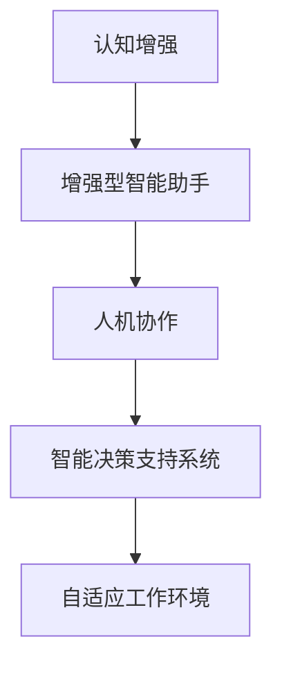

                 

# 认知增强与人机协作：未来工作模式的探索

## 1. 背景介绍

随着人工智能技术的迅猛发展，人与机器的协作模式正在发生深刻的变革。传统的以人类为中心的工作方式正在逐步向人机协同的新模式转变。未来，人工智能将不再仅仅是人类智慧的辅助工具，而是与人类形成真正意义上“增强”的关系，共同完成复杂的工作任务。这种认知增强工作模式将极大地提升工作效率、改善工作体验，并为人类创造更多价值。

本文将从认知增强和人机协作的视角出发，探讨未来工作模式的趋势与挑战，并提出具体的实现策略。通过深入分析人工智能技术在各领域的应用，揭示未来工作模式的本质与核心价值，为构建智能辅助、高效协同的未来工作环境提供有价值的参考。

## 2. 核心概念与联系

### 2.1 核心概念概述

为了更好地理解认知增强和人机协作的未来工作模式，本节将介绍几个核心概念：

- **认知增强**：指通过人工智能技术，增强人类的认知能力、决策能力和操作能力，使人类能够更高效地完成复杂任务。
- **人机协作**：指人工智能与人类共同完成任务的过程。通过合理分配任务，使人工智能执行重复性、计算性任务，而人类负责创意、决策和监督等任务。
- **增强型智能助手**：一种基于人工智能的辅助工具，旨在通过提供智能建议、自动执行简单任务等方式，增强人类的工作效率和决策质量。
- **智能决策支持系统**：通过分析海量数据，辅助人类做出最优决策的系统，包括数据分析、预测、推荐等。
- **自适应工作环境**：能够根据用户的习惯和需求自动调整工作方式和环境，提升用户体验的工作系统。

这些概念之间存在紧密的联系，共同构成了未来工作模式的理论基础。认知增强通过增强人类能力，使人机协作更加高效，而智能决策支持系统和自适应工作环境则为这种协作提供了实现手段。

### 2.2 核心概念原理和架构的 Mermaid 流程图



这个流程图展示了认知增强、增强型智能助手、人机协作、智能决策支持系统、自适应工作环境之间的联系。

## 3. 核心算法原理 & 具体操作步骤

### 3.1 算法原理概述

认知增强和人机协作的工作模式，本质上是通过人工智能技术，增强人类的认知能力，提升工作效率，同时实现人与机器的高效协同。其核心算法包括：

1. **增强型智能助手算法**：利用自然语言处理(NLP)和机器学习技术，分析用户输入，提供智能建议和自动执行简单任务。
2. **智能决策支持系统算法**：通过数据挖掘和机器学习技术，对海量数据进行分析，辅助用户做出最优决策。
3. **自适应工作环境算法**：利用智能推荐和自动化技术，根据用户行为和偏好，动态调整工作环境，提升用户体验。

这些算法通过深度学习、强化学习、优化算法等多种技术手段，不断提升其准确性和实用性。

### 3.2 算法步骤详解

以下以增强型智能助手为例，详细介绍其核心算法步骤：

**Step 1: 用户输入解析**  
利用NLP技术，解析用户输入的自然语言，提取关键信息，如任务需求、时间限制、优先级等。

**Step 2: 任务推荐和分派**  
根据解析出的信息，利用机器学习模型推荐合适的任务和步骤，分派给不同的模块或人工执行。

**Step 3: 任务执行和监控**  
对于自动可执行的任务，通过API调用或其他技术手段，自动执行任务，并实时监控执行过程，确保任务完成。

**Step 4: 结果反馈和优化**  
将任务执行结果反馈给用户，并根据用户反馈和执行结果，优化算法和执行流程。

### 3.3 算法优缺点

认知增强和人机协作具有以下优点：

- **高效协作**：通过合理分配任务，使得人工智能执行重复性、计算性任务，而人类负责创意、决策和监督等任务，显著提高工作效率。
- **错误率低**：人工智能在执行简单任务时，错误率较低，可以减少人为错误。
- **灵活性高**：人工智能可以根据需求动态调整工作流程，提升灵活性。

同时，也存在以下缺点：

- **依赖数据**：算法的准确性和效果依赖于数据质量和数据量，对数据的依赖较高。
- **人机协作复杂**：人机协作需要合理的任务分配和沟通，难度较大。
- **安全问题**：人工智能执行任务时，可能涉及敏感数据和隐私问题，需要额外的安全措施。

### 3.4 算法应用领域

认知增强和人机协作的工作模式，已经在多个领域得到了广泛应用，例如：

- **办公自动化**：通过智能助手，自动执行文档处理、邮件回复、日程安排等任务，提高办公效率。
- **金融分析**：利用智能决策支持系统，对海量金融数据进行分析，提供投资建议和风险预警。
- **医疗诊断**：利用智能助手，提供患者病历分析、症状检查、推荐治疗方案等辅助诊断服务。
- **教育培训**：通过智能助教，提供个性化学习计划、智能题库、即时答疑等服务，提升学习效果。
- **制造业**：利用智能机器人，执行流水线作业，减少人工错误，提高生产效率。

## 4. 数学模型和公式 & 详细讲解 & 举例说明

### 4.1 数学模型构建

在认知增强和人机协作的算法中，数学模型通常包括以下几个部分：

- **用户输入解析模型**：基于NLP技术，构建用户意图识别模型，将自然语言输入转化为结构化数据。
- **任务推荐模型**：利用推荐系统技术，构建任务推荐模型，提供合适的任务和步骤。
- **任务执行监控模型**：利用实时监控技术，构建任务执行监控模型，实时调整执行策略。
- **反馈和优化模型**：构建用户反馈模型，利用机器学习技术，优化算法和执行流程。

### 4.2 公式推导过程

以任务推荐模型为例，假设我们有一个用户输入$x$，通过解析模型得到用户意图$u$，任务推荐模型基于历史数据$D$和用户意图$u$，预测任务推荐$y$。

任务推荐模型的数学公式为：

$$
y = f(x, u, D)
$$

其中$f$为任务推荐模型，$x$为用户输入，$u$为意图识别结果，$D$为历史数据集。

利用机器学习算法，如深度学习、梯度提升树等，可以训练出任务推荐模型$f$，使其能够预测合适的任务$y$。

### 4.3 案例分析与讲解

假设我们要构建一个智能客服系统，通过分析用户输入，推荐合适的客服方案。我们可以利用自然语言处理技术，解析用户输入，提取关键信息，如问题类型、紧急程度等。然后利用机器学习模型，训练出一个任务推荐模型，根据用户意图和历史数据，推荐合适的客服方案。

## 5. 项目实践：代码实例和详细解释说明

### 5.1 开发环境搭建

要进行认知增强和人机协作的实践，需要搭建一个良好的开发环境。以下是使用Python进行TensorFlow开发的环境配置流程：

1. 安装Anaconda：从官网下载并安装Anaconda，用于创建独立的Python环境。

2. 创建并激活虚拟环境：
```bash
conda create -n tf-env python=3.8 
conda activate tf-env
```

3. 安装TensorFlow：根据CUDA版本，从官网获取对应的安装命令。例如：
```bash
conda install tensorflow==2.4
```

4. 安装TensorBoard：
```bash
pip install tensorboard
```

5. 安装TensorFlow Addons：
```bash
pip install tensorflow-addons
```

6. 安装Keras：
```bash
pip install keras
```

完成上述步骤后，即可在`tf-env`环境中开始实践。

### 5.2 源代码详细实现

以下是使用TensorFlow构建智能客服系统的示例代码：

```python
import tensorflow as tf
import numpy as np
import keras
from tensorflow.keras.layers import Input, Dense, Embedding, LSTM
from tensorflow.keras.models import Model
from tensorflow.keras.callbacks import EarlyStopping

# 定义模型参数
vocab_size = 10000
embedding_dim = 128
lstm_units = 128

# 加载数据集
(x_train, y_train), (x_test, y_test) = keras.datasets.imdb.load_data(num_words=vocab_size)

# 构建输入层
input_tensor = Input(shape=(max_len,), dtype='int32')

# 构建嵌入层
embedding_layer = Embedding(vocab_size, embedding_dim)(input_tensor)

# 构建LSTM层
lstm_layer = LSTM(lstm_units)(embedding_layer)

# 构建输出层
output_tensor = Dense(1, activation='sigmoid')(lstm_layer)

# 定义模型
model = Model(input_tensor, output_tensor)

# 编译模型
model.compile(optimizer='adam', loss='binary_crossentropy', metrics=['accuracy'])

# 训练模型
model.fit(x_train, y_train, batch_size=32, epochs=10, validation_data=(x_test, y_test), callbacks=[EarlyStopping(patience=3)])

# 评估模型
model.evaluate(x_test, y_test)
```

### 5.3 代码解读与分析

这个示例代码展示了如何使用TensorFlow构建一个基于LSTM的情感分类模型。在智能客服系统中，我们可以利用类似的模型，对用户输入进行情感分析，从而推荐合适的客服方案。

代码中，我们首先定义了模型参数，包括词汇表大小、嵌入维度和LSTM单元数。然后加载IMDB数据集，将其转换为模型所需的格式。接着，构建输入层、嵌入层、LSTM层和输出层，最后定义模型并编译。

在训练过程中，我们使用EarlyStopping回调函数，避免过拟合。最后，对模型进行评估，输出准确率和损失值。

## 6. 实际应用场景

### 6.1 智能客服系统

智能客服系统通过认知增强和人机协作，可以实现高效的客户服务。传统客服往往需要配备大量人力，高峰期响应缓慢，且一致性和专业性难以保证。而使用增强型智能助手，可以7x24小时不间断服务，快速响应客户咨询，用自然流畅的语言解答各类常见问题。

在技术实现上，可以收集企业内部的历史客服对话记录，将问题和最佳答复构建成监督数据，在此基础上对预训练语言模型进行微调。微调后的语言模型能够自动理解用户意图，匹配最合适的答案模板进行回复。对于客户提出的新问题，还可以接入检索系统实时搜索相关内容，动态组织生成回答。

### 6.2 金融分析

金融机构需要实时监测市场舆论动向，以便及时应对负面信息传播，规避金融风险。传统的人工监测方式成本高、效率低，难以应对网络时代海量信息爆发的挑战。通过智能决策支持系统，金融分析可以实现高效的数据分析和风险预警。

具体而言，可以收集金融领域相关的新闻、报道、评论等文本数据，并对其进行主题标注和情感标注。在此基础上对预训练语言模型进行微调，使其能够自动判断文本属于何种主题，情感倾向是正面、中性还是负面。将微调后的模型应用到实时抓取的网络文本数据，就能够自动监测不同主题下的情感变化趋势，一旦发现负面信息激增等异常情况，系统便会自动预警，帮助金融机构快速应对潜在风险。

### 6.3 医疗诊断

利用智能决策支持系统，医疗诊断可以实现高效的数据分析和推荐。传统医疗诊断依赖于医生的经验和知识，对医生的专业水平和判断能力要求较高。而通过智能决策支持系统，可以辅助医生进行病历分析、症状检查和推荐治疗方案。

在实践中，可以收集大量医疗案例和相关数据，利用机器学习技术，训练出一个智能决策支持系统。系统可以根据用户输入的症状和病历，推荐合适的治疗方案和检查项目。同时，系统还可以实时监控患者的健康数据，提供个性化的健康建议。

### 6.4 未来应用展望

随着认知增强和人机协作技术的不断发展，未来工作模式将呈现以下几个趋势：

1. **智能化水平提升**：未来的人工智能系统将更加智能，能够进行复杂的逻辑推理和情感分析，为人类提供更加智能化的服务。

2. **数据驱动决策**：未来的工作模式将更加依赖数据驱动，通过分析海量数据，提供智能决策支持，提高决策的科学性和准确性。

3. **自适应工作环境**：未来的工作环境将更加自适应，能够根据用户的行为和需求，动态调整工作方式和环境，提升用户体验。

4. **跨领域融合**：未来的工作模式将更加跨领域，结合人工智能、大数据、物联网等技术，构建更加全面、智能的工作系统。

5. **人机协同优化**：未来的工作模式将更加注重人机协同，通过合理的任务分配和沟通，实现高效的协作。

## 7. 工具和资源推荐

### 7.1 学习资源推荐

为了帮助开发者系统掌握认知增强和人机协作的理论基础和实践技巧，这里推荐一些优质的学习资源：

1. 《深度学习》系列书籍：由深度学习专家撰写，系统介绍了深度学习的基本原理和应用场景，包括自然语言处理、计算机视觉等领域。

2. 《人机协作的未来》系列博文：由AI专家撰写，深入浅出地介绍了人机协作的未来趋势和应用场景，探讨了认知增强技术的发展方向。

3. 《认知增强：人机协同的革命》书籍：系统介绍了认知增强技术的基本原理和应用案例，探讨了人机协同的未来前景。

4. HuggingFace官方文档：提供了海量预训练语言模型和完整的微调样例代码，是进行微调任务开发的必备资料。

5. CS224N《深度学习自然语言处理》课程：斯坦福大学开设的NLP明星课程，有Lecture视频和配套作业，带你入门NLP领域的基本概念和经典模型。

通过对这些资源的学习实践，相信你一定能够快速掌握认知增强和人机协作的精髓，并用于解决实际的NLP问题。

### 7.2 开发工具推荐

高效的开发离不开优秀的工具支持。以下是几款用于认知增强和人机协作开发的常用工具：

1. TensorFlow：基于Python的开源深度学习框架，灵活动态的计算图，适合快速迭代研究。

2. PyTorch：由Facebook开发的开源深度学习框架，灵活性高，适合进行复杂的模型训练和优化。

3. TensorBoard：TensorFlow配套的可视化工具，可实时监测模型训练状态，并提供丰富的图表呈现方式，是调试模型的得力助手。

4. Jupyter Notebook：交互式的编程环境，支持代码块、代码运行和结果展示，方便开发者快速迭代和共享代码。

5. Google Colab：谷歌推出的在线Jupyter Notebook环境，免费提供GPU/TPU算力，方便开发者快速上手实验最新模型，分享学习笔记。

合理利用这些工具，可以显著提升认知增强和人机协作任务的开发效率，加快创新迭代的步伐。

### 7.3 相关论文推荐

认知增强和人机协作的发展源于学界的持续研究。以下是几篇奠基性的相关论文，推荐阅读：

1. Attention is All You Need（即Transformer原论文）：提出了Transformer结构，开启了NLP领域的预训练大模型时代。

2. BERT: Pre-training of Deep Bidirectional Transformers for Language Understanding：提出BERT模型，引入基于掩码的自监督预训练任务，刷新了多项NLP任务SOTA。

3. Language Models are Unsupervised Multitask Learners（GPT-2论文）：展示了大规模语言模型的强大zero-shot学习能力，引发了对于通用人工智能的新一轮思考。

4. Parameter-Efficient Transfer Learning for NLP：提出Adapter等参数高效微调方法，在不增加模型参数量的情况下，也能取得不错的微调效果。

5. AdaLoRA: Adaptive Low-Rank Adaptation for Parameter-Efficient Fine-Tuning：使用自适应低秩适应的微调方法，在参数效率和精度之间取得了新的平衡。

这些论文代表了大语言模型微调技术的发展脉络。通过学习这些前沿成果，可以帮助研究者把握学科前进方向，激发更多的创新灵感。

## 8. 总结：未来发展趋势与挑战

### 8.1 总结

本文从认知增强和人机协作的视角出发，探讨了未来工作模式的趋势与挑战，并提出具体的实现策略。通过深入分析人工智能技术在各领域的应用，揭示了未来工作模式的本质与核心价值，为构建智能辅助、高效协同的未来工作环境提供有价值的参考。

### 8.2 未来发展趋势

展望未来，认知增强和人机协作技术将呈现以下几个趋势：

1. **智能化水平提升**：未来的人工智能系统将更加智能，能够进行复杂的逻辑推理和情感分析，为人类提供更加智能化的服务。

2. **数据驱动决策**：未来的工作模式将更加依赖数据驱动，通过分析海量数据，提供智能决策支持，提高决策的科学性和准确性。

3. **自适应工作环境**：未来的工作环境将更加自适应，能够根据用户的行为和需求，动态调整工作方式和环境，提升用户体验。

4. **跨领域融合**：未来的工作模式将更加跨领域，结合人工智能、大数据、物联网等技术，构建更加全面、智能的工作系统。

5. **人机协同优化**：未来的工作模式将更加注重人机协同，通过合理的任务分配和沟通，实现高效的协作。

### 8.3 面临的挑战

尽管认知增强和人机协作技术已经取得了瞩目成就，但在迈向更加智能化、普适化应用的过程中，它仍面临着诸多挑战：

1. **依赖数据**：算法的准确性和效果依赖于数据质量和数据量，对数据的依赖较高。如何获取高质量的数据，是未来需要解决的问题。

2. **模型复杂度**：认知增强和人机协作的模型通常较为复杂，需要大量的计算资源和时间进行训练和优化。如何降低模型的计算复杂度，提升训练效率，是未来的研究方向。

3. **用户接受度**：认知增强和人机协作技术的应用需要用户的信任和接受。如何提升用户对新技术的接受度，是推广和应用的关键。

4. **伦理和安全问题**：认知增强和人机协作技术的应用涉及到隐私和伦理问题，如何保护用户的隐私和安全，是必须考虑的问题。

5. **跨领域适用性**：认知增强和人机协作技术在不同领域的应用，需要根据领域特点进行优化和调整，具有较大的挑战性。

### 8.4 研究展望

面对认知增强和人机协作面临的挑战，未来的研究需要在以下几个方面寻求新的突破：

1. **数据增强和预处理**：开发更加高效的数据增强和预处理技术，提升模型的泛化能力。

2. **模型压缩和优化**：开发更加高效的模型压缩和优化技术，降低计算复杂度，提升训练效率。

3. **跨领域知识融合**：开发跨领域知识融合技术，提升模型的通用性和适用性。

4. **自适应学习和优化**：开发自适应学习和优化技术，提升模型的适应性和鲁棒性。

5. **伦理和安全性研究**：加强伦理和安全性的研究，提升技术的安全性和可靠性。

这些研究方向的探索，必将引领认知增强和人机协作技术迈向更高的台阶，为构建安全、可靠、可解释、可控的智能系统铺平道路。面向未来，认知增强和人机协作技术还需要与其他人工智能技术进行更深入的融合，如知识表示、因果推理、强化学习等，多路径协同发力，共同推动自然语言理解和智能交互系统的进步。只有勇于创新、敢于突破，才能不断拓展认知增强和人机协作的边界，让智能技术更好地造福人类社会。

## 9. 附录：常见问题与解答

**Q1：认知增强和人机协作是否适用于所有行业？**

A: 认知增强和人机协作在大多数行业中都可以应用，但对于一些特殊行业，如医疗、金融等，需要针对具体领域进行优化。例如，在医疗行业中，需要考虑医疗数据的隐私和安全问题，以及医疗知识的特殊性。

**Q2：如何提高认知增强和人机协作的效率？**

A: 提高认知增强和人机协作的效率，可以从以下几个方面入手：

1. **数据质量**：提高数据的质量和数量，确保模型能够获得充分的训练。

2. **模型优化**：使用更高效的模型结构，如Transformer等，提升模型的训练速度和效果。

3. **自动化**：引入自动化技术，如自动标注、自动优化等，减少人工干预。

4. **跨领域融合**：结合多个领域的数据和知识，提升模型的泛化能力。

**Q3：认知增强和人机协作面临哪些伦理和安全问题？**

A: 认知增强和人机协作面临的伦理和安全问题主要包括：

1. **隐私保护**：在处理敏感数据时，需要保证数据的安全和隐私，防止数据泄露和滥用。

2. **偏见和歧视**：模型可能存在偏见和歧视，需要采取措施消除偏见，确保公平性。

3. **责任归属**：当模型出现错误时，需要明确责任归属，防止误导和滥用。

4. **透明度和可解释性**：模型的决策过程需要透明，用户需要能够理解和解释模型的行为。

5. **安全性**：模型需要具备抗攻击和抗干扰的能力，防止恶意攻击和误导。

**Q4：认知增强和人机协作的实际应用场景有哪些？**

A: 认知增强和人机协作的实际应用场景包括：

1. **智能客服**：通过认知增强和人机协作，实现7x24小时不间断服务，快速响应客户咨询。

2. **金融分析**：通过智能决策支持系统，实时监测市场舆论动向，规避金融风险。

3. **医疗诊断**：利用智能决策支持系统，辅助医生进行病历分析、症状检查和推荐治疗方案。

4. **教育培训**：通过智能助教，提供个性化学习计划、智能题库、即时答疑等服务，提升学习效果。

5. **制造业**：利用智能机器人，执行流水线作业，减少人工错误，提高生产效率。

通过认知增强和人机协作技术，可以提升各行各业的智能化水平，提高工作效率和决策质量。

---

作者：禅与计算机程序设计艺术 / Zen and the Art of Computer Programming

