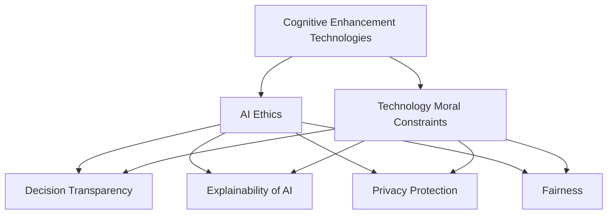

                 

# 认知增强与伦理：技术发展的道德约束

> 关键词：认知增强,人工智能伦理,技术道德约束,决策透明性,人工智能可解释性,隐私保护,公平性,负责任创新

## 1. 背景介绍

随着人工智能(AI)技术的飞速发展，特别是深度学习在计算机视觉、自然语言处理等领域取得的突破，认知增强技术正在逐步成为推动社会进步和提升人类生活质量的重要工具。然而，认知增强技术的广泛应用也带来了伦理和道德层面的诸多挑战，包括决策透明性、可解释性、隐私保护、公平性等问题。如何在技术创新和伦理约束之间找到平衡点，是当前人工智能领域亟待解决的重大问题。本文将从认知增强技术的核心概念出发，探讨其在应用过程中面临的伦理道德约束，并提出相应的解决方案。

## 2. 核心概念与联系

### 2.1 核心概念概述

为了深入理解认知增强技术及其面临的伦理道德问题，首先需要介绍几个关键概念：

- **认知增强技术(Cognitive Enhancement Technologies)**：指利用AI技术提升人类认知能力的方法，包括但不限于增强学习能力、改善记忆、提升决策能力等。常见的认知增强技术包括智能辅导、虚拟助手、个性化学习系统等。

- **人工智能伦理(AI Ethics)**：指在人工智能技术开发和应用过程中，遵循的道德规范和原则，包括但不限于隐私保护、公平性、透明性、可解释性等。

- **技术道德约束(Technology Moral Constraints)**：指在人工智能技术发展过程中，应当遵循的道德准则和法律规定，以确保技术应用的伦理性和社会可接受性。

- **决策透明性(Decision Transparency)**：指技术决策过程的可解释性和可理解性，即用户能够清楚地了解技术如何做出决策，以及决策背后的依据。

- **人工智能可解释性(Explainability of AI)**：指AI模型的决策过程和结果可以清楚地向人类解释，有助于增强用户信任和提升模型的可接受性。

- **隐私保护(Privacy Protection)**：指在AI技术应用中，保护用户数据隐私和个人信息安全，防止数据滥用和泄露。

- **公平性(Fairness)**：指AI技术在处理不同群体、不同背景的用户时，能够提供公正、无偏见的处理结果，避免对特定群体的歧视。

这些核心概念之间的关系可以通过以下Mermaid流程图来展示：



这个流程图展示了几组关键概念之间的逻辑关系：

1. **认知增强技术与伦理道德**：认知增强技术的应用必须遵循伦理道德原则。
2. **技术与道德约束**：技术创新不应违反任何伦理道德约束，确保技术的社会可接受性。
3. **伦理维度**：包括决策透明性、可解释性、隐私保护、公平性等，是认知增强技术应用中必须考虑的重要方面。

## 3. 核心算法原理 & 具体操作步骤

### 3.1 算法原理概述

认知增强技术通常通过深度学习模型来实现，如基于神经网络的个性化学习系统、智能辅导系统等。这些模型的核心原理包括：

- **数据预处理**：收集和处理用户数据，包括学习历史、行为记录等，以便模型进行训练。
- **模型训练**：使用训练数据对模型进行优化，使其能够根据用户特点提供个性化建议或推荐。
- **模型部署**：将训练好的模型部署到实际应用环境中，如智能辅导系统、个性化学习平台等。

### 3.2 算法步骤详解

#### 3.2.1 数据预处理

数据预处理是认知增强技术的关键步骤之一。具体包括：

1. **数据收集**：通过各种渠道收集用户数据，如学习记录、行为数据、反馈信息等。
2. **数据清洗**：对数据进行去重、填补缺失值、处理异常值等预处理，确保数据质量。
3. **数据标注**：根据任务需求，对数据进行标注，如分类、回归等。
4. **特征工程**：提取和构建有用的特征，如学习时长、成绩、兴趣标签等。

#### 3.2.2 模型训练

模型训练包括选择模型架构、定义损失函数、设置优化器等步骤。具体如下：

1. **模型选择**：根据任务需求，选择适合的深度学习模型，如卷积神经网络(CNN)、循环神经网络(RNN)、变压器(Transformer)等。
2. **损失函数定义**：根据任务目标，定义合适的损失函数，如交叉熵、均方误差、对比学习损失等。
3. **优化器选择**：选择合适的优化器，如SGD、Adam等，设置学习率和批大小等超参数。
4. **模型训练**：使用训练数据对模型进行迭代训练，通过反向传播算法更新模型参数。

#### 3.2.3 模型部署

模型部署是将训练好的模型应用于实际场景的过程。具体包括：

1. **模型保存**：将训练好的模型保存到本地或远程服务器。
2. **接口开发**：开发API接口，供其他系统或应用调用。
3. **性能优化**：对模型进行性能优化，如剪枝、量化等，以提高推理速度和降低资源消耗。
4. **安全加固**：加强模型的安全防护，防止恶意攻击和数据泄露。

### 3.3 算法优缺点

#### 3.3.1 优点

认知增强技术在提升人类认知能力方面具有显著优势：

1. **个性化学习**：根据用户特点，提供个性化学习路径和建议，提升学习效果。
2. **高效决策**：通过深度学习模型，快速处理和分析大量数据，提高决策效率。
3. **自主学习**：用户可以通过互动式学习系统，自主掌握知识和技能，提升自主学习能力。

#### 3.3.2 缺点

认知增强技术在应用过程中也存在一些问题：

1. **数据隐私**：大量用户数据的收集和处理可能涉及隐私保护问题。
2. **公平性**：模型可能会对某些群体存在偏见，导致不公平的结果。
3. **可解释性**：深度学习模型的决策过程不透明，难以向用户解释。
4. **技术依赖**：过度依赖技术，可能导致用户忽视自我努力和反思。

### 3.4 算法应用领域

认知增强技术在多个领域得到了广泛应用，包括：

1. **教育**：如智能辅导系统、个性化学习平台等，帮助学生高效学习。
2. **医疗**：如智能诊断系统、个性化治疗方案等，提高医疗服务水平。
3. **金融**：如风险评估系统、个性化理财建议等，提升金融服务质量。
4. **安全**：如智能监控系统、网络安全预警等，增强安全防护能力。

## 4. 数学模型和公式 & 详细讲解

### 4.1 数学模型构建

以智能辅导系统为例，我们可以使用神经网络模型来实现个性化学习建议。模型的输入为学生的学习数据，包括学习时长、成绩、兴趣标签等，输出为推荐的学习路径和建议。数学模型可以表示为：

$$
y = f(x; \theta)
$$

其中 $x$ 为输入数据，$\theta$ 为模型参数，$f$ 为模型函数。

### 4.2 公式推导过程

假设我们采用一个简单的多层感知器(MLP)模型，其函数形式为：

$$
f(x; \theta) = \sigma(W_n\sigma(W_{n-1}\cdots \sigma(W_1 x) \cdots))
$$

其中 $W_i$ 为第 $i$ 层的权重矩阵，$\sigma$ 为激活函数。模型的训练目标是最小化预测结果与真实标签之间的差距，即：

$$
\min_{\theta} \sum_{i=1}^N (y_i - f(x_i; \theta))^2
$$

其中 $N$ 为样本数，$y_i$ 为真实标签，$x_i$ 为输入数据。

### 4.3 案例分析与讲解

以智能辅导系统为例，我们可以分析模型在训练和推理过程中面临的伦理道德问题：

1. **数据隐私**：学生的数据是否被妥善保护，避免被滥用或泄露。
2. **公平性**：模型是否会对某些学生存在偏见，导致不公平的结果。
3. **可解释性**：模型如何向学生解释推荐的原因，增强其信任感。
4. **透明性**：用户如何了解模型的决策过程，确保其合理性和公正性。

## 5. 项目实践：代码实例和详细解释说明

### 5.1 开发环境搭建

要进行认知增强技术的项目实践，首先需要搭建开发环境。以下是使用Python和TensorFlow进行深度学习开发的环境配置流程：

1. 安装Anaconda：从官网下载并安装Anaconda，用于创建独立的Python环境。
2. 创建并激活虚拟环境：
```bash
conda create -n tf-env python=3.8 
conda activate tf-env
```
3. 安装TensorFlow：根据CUDA版本，从官网获取对应的安装命令。例如：
```bash
conda install tensorflow==2.7.0 -c conda-forge -c pytorch-nightly
```
4. 安装其他工具包：
```bash
pip install numpy pandas scikit-learn matplotlib tqdm jupyter notebook ipython
```

完成上述步骤后，即可在`tf-env`环境中开始认知增强技术的项目实践。

### 5.2 源代码详细实现

这里以一个简单的智能辅导系统为例，使用TensorFlow实现个性化学习建议。

首先，定义模型和优化器：

```python
import tensorflow as tf
from tensorflow.keras import layers

model = tf.keras.Sequential([
    layers.Dense(64, activation='relu', input_shape=(4,)),
    layers.Dense(32, activation='relu'),
    layers.Dense(2, activation='softmax')
])

optimizer = tf.keras.optimizers.Adam(learning_rate=0.001)
```

然后，定义训练函数：

```python
@tf.function
def train_step(data):
    with tf.GradientTape() as tape:
        predictions = model(data)
        loss = tf.losses.categorical_crossentropy(targets, predictions)
    gradients = tape.gradient(loss, model.trainable_variables)
    optimizer.apply_gradients(zip(gradients, model.trainable_variables))
    return loss
```

最后，启动训练流程：

```python
epochs = 10
batch_size = 32

for epoch in range(epochs):
    loss = 0
    for batch in dataset:
        loss += train_step(batch)
    print(f'Epoch {epoch+1}, loss: {loss/n_samples:.4f}')
```

以上就是使用TensorFlow实现认知增强技术的完整代码实现。可以看到，TensorFlow提供了强大的深度学习框架，可以方便地实现模型训练和推理。

### 5.3 代码解读与分析

让我们再详细解读一下关键代码的实现细节：

1. **Sequential模型**：定义了多层感知器模型，包括三个全连接层，其中第二层采用ReLU激活函数，最后一层采用softmax激活函数，用于多分类任务。
2. **优化器**：使用Adam优化器，设置学习率为0.001，梯度更新采用Adam算法。
3. **train_step函数**：在每个批次上前向传播计算损失，反向传播计算梯度，并使用Adam优化器更新模型参数。
4. **模型训练**：使用训练集进行迭代训练，输出平均损失。

可以看到，TensorFlow提供了丰富的工具和组件，使得深度学习模型的实现变得更加简便高效。开发者可以根据具体任务进行模型设计和优化，并结合TensorBoard等工具进行模型训练和推理的可视化分析。

## 6. 实际应用场景

### 6.1 智能教育

基于认知增强技术的智能教育系统，可以为学生提供个性化的学习建议和辅导，提升学习效果。具体应用场景包括：

1. **个性化学习路径**：根据学生的学习历史和行为数据，推荐适合的学习资源和路径。
2. **智能辅导**：通过智能助手，解答学生在学习过程中遇到的问题，提供即时辅导。
3. **学习分析**：利用深度学习模型分析学生的学习行为和成绩，提供学习报告和改进建议。

### 6.2 医疗健康

在医疗健康领域，认知增强技术可以用于智能诊断和个性化治疗方案推荐，提升医疗服务质量。具体应用场景包括：

1. **智能诊断**：利用深度学习模型分析患者的症状和历史数据，提供初步诊断和建议。
2. **个性化治疗**：根据患者的基因信息和病史数据，推荐个性化的治疗方案和药物。
3. **健康监测**：利用可穿戴设备采集的健康数据，分析患者状态，提供健康管理建议。

### 6.3 金融服务

在金融服务领域，认知增强技术可以用于风险评估和个性化理财建议，提升金融服务质量。具体应用场景包括：

1. **风险评估**：利用深度学习模型分析用户的信用历史和行为数据，评估其信用风险。
2. **个性化理财**：根据用户的财务状况和投资偏好，推荐个性化的理财方案和投资建议。
3. **欺诈检测**：利用深度学习模型分析交易数据，识别潜在的欺诈行为。

### 6.4 未来应用展望

随着认知增强技术的不断发展和应用，未来将呈现以下几个发展趋势：

1. **跨模态认知增强**：结合视觉、听觉、触觉等多模态数据，提升认知增强系统的感知和推理能力。
2. **人机协同**：在认知增强系统中引入人类专家和知识，增强系统的决策和解释能力。
3. **边缘计算**：在认知增强系统中引入边缘计算，提升系统的实时性和资源利用效率。
4. **联邦学习**：利用分布式计算和数据隐私保护技术，提升认知增强系统的安全性和可靠性。

## 7. 工具和资源推荐

### 7.1 学习资源推荐

为了帮助开发者系统掌握认知增强技术的理论基础和实践技巧，这里推荐一些优质的学习资源：

1. **《深度学习》课程**：由斯坦福大学开设的深度学习课程，涵盖深度学习的基本概念和算法。
2. **TensorFlow官方文档**：TensorFlow的官方文档，提供完整的API和使用指南，适合深度学习初学者和高级开发者。
3. **《AI Superpowers》一书**：由Google AI团队撰写，探讨人工智能技术对社会的广泛影响和未来趋势。
4. **Kaggle竞赛**：Kaggle提供大量的数据集和竞赛任务，帮助开发者在实践中提升深度学习技能。

通过对这些资源的学习实践，相信你一定能够快速掌握认知增强技术的精髓，并用于解决实际的AI问题。

### 7.2 开发工具推荐

高效的开发离不开优秀的工具支持。以下是几款用于认知增强技术开发的常用工具：

1. **TensorFlow**：由Google主导开发的深度学习框架，生产部署方便，适合大规模工程应用。
2. **PyTorch**：基于Python的开源深度学习框架，灵活动态，适合快速迭代研究。
3. **TensorBoard**：TensorFlow配套的可视化工具，可实时监测模型训练状态，提供丰富的图表呈现方式。
4. **Jupyter Notebook**：交互式编程环境，适合进行数据处理、模型训练和结果展示。
5. **GitHub**：代码托管平台，方便版本控制和协作开发。

合理利用这些工具，可以显著提升认知增强技术的开发效率，加快创新迭代的步伐。

### 7.3 相关论文推荐

认知增强技术的发展源于学界的持续研究。以下是几篇奠基性的相关论文，推荐阅读：

1. **《深度学习》一书**：由Goodfellow等撰写，全面介绍深度学习的基本概念和算法。
2. **《人类计算》一书**：由John McCarthy等撰写，探讨认知增强技术对人类计算能力的影响。
3. **《认知增强与伦理》论文**：探讨认知增强技术的伦理问题和解决方案，强调公平性和可解释性。
4. **《认知增强系统的设计与实现》论文**：介绍认知增强系统的设计原则和实现方法，强调技术可行性和用户需求。

这些论文代表了大规模语言模型微调技术的发展脉络。通过学习这些前沿成果，可以帮助研究者把握学科前进方向，激发更多的创新灵感。

## 8. 总结：未来发展趋势与挑战

### 8.1 总结

本文对认知增强技术及其面临的伦理道德问题进行了全面系统的介绍。首先阐述了认知增强技术的核心概念和发展背景，明确了其在提升人类认知能力方面的重要作用。其次，从技术实现的角度，详细讲解了认知增强技术的基本原理和操作步骤，提供了完整的代码实现示例。同时，本文还广泛探讨了认知增强技术在实际应用中面临的伦理道德问题，包括决策透明性、可解释性、隐私保护、公平性等，提出了相应的解决方案。

通过本文的系统梳理，可以看到，认知增强技术在提升人类认知能力方面具有巨大潜力，但在应用过程中必须遵循伦理道德原则，确保技术的社会可接受性。未来，伴随技术的不断进步和应用场景的拓展，认知增强技术必将在各个领域发挥越来越重要的作用，推动社会进步和人类福祉的提升。

### 8.2 未来发展趋势

展望未来，认知增强技术的发展将呈现以下几个趋势：

1. **跨领域融合**：认知增强技术将与其他领域的技术进行深度融合，如生物医学、心理学等，推动认知科学的进步。
2. **个性化定制**：利用AI技术实现更加个性化的认知增强服务，满足不同用户的需求和偏好。
3. **隐私保护**：在认知增强系统的设计和实现中，将隐私保护作为重要目标，保障用户数据的安全和隐私。
4. **公平性**：通过优化算法和数据处理方式，确保认知增强系统对不同群体的公平性。
5. **可解释性**：提高认知增强系统的可解释性，增强用户信任和满意度。

以上趋势将推动认知增强技术的发展和应用，为社会带来更加美好和智慧的未来。

### 8.3 面临的挑战

尽管认知增强技术已经取得了显著进展，但在推广应用过程中仍面临诸多挑战：

1. **数据隐私**：大规模数据收集和处理可能涉及隐私保护问题，需要采取有效的隐私保护措施。
2. **公平性**：模型可能对某些群体存在偏见，导致不公平的结果，需要进一步优化模型和数据处理方式。
3. **技术依赖**：过度依赖技术，可能忽视人类自我努力和反思，需要平衡技术和人类的关系。
4. **伦理约束**：认知增强技术的应用必须遵循伦理道德原则，确保技术的社会可接受性。
5. **可解释性**：深度学习模型的决策过程不透明，难以向用户解释，需要提高系统的可解释性。

这些挑战需要在技术创新和伦理约束之间找到平衡点，确保认知增强技术的健康发展。

### 8.4 研究展望

未来，认知增强技术的研究需要在以下几个方面寻求新的突破：

1. **跨模态认知增强**：结合视觉、听觉、触觉等多模态数据，提升认知增强系统的感知和推理能力。
2. **人机协同**：在认知增强系统中引入人类专家和知识，增强系统的决策和解释能力。
3. **联邦学习**：利用分布式计算和数据隐私保护技术，提升认知增强系统的安全性和可靠性。
4. **负责任创新**：强调认知增强技术的社会责任，确保技术应用的伦理性和公平性。

这些研究方向的探索，必将引领认知增强技术迈向更高的台阶，为构建安全、可靠、可解释、可控的智能系统铺平道路。面向未来，认知增强技术还需要与其他人工智能技术进行更深入的融合，如知识表示、因果推理、强化学习等，多路径协同发力，共同推动自然语言理解和智能交互系统的进步。只有勇于创新、敢于突破，才能不断拓展认知增强技术的边界，让智能技术更好地造福人类社会。

## 9. 附录：常见问题与解答

**Q1：认知增强技术是否适用于所有领域？**

A: 认知增强技术在大多数领域都可以应用，但具体应用效果取决于数据质量、任务需求和技术实现等因素。对于一些高风险领域，如医疗、金融等，需要特别注重伦理道德和技术安全问题。

**Q2：如何平衡技术创新和伦理道德？**

A: 平衡技术创新和伦理道德需要从多个方面入手：
1. **伦理评估**：在技术研发和应用过程中，进行全面的伦理评估，确保技术符合社会价值观和道德准则。
2. **用户参与**：通过用户反馈和参与，了解技术应用对不同群体的影响，优化技术设计和实现。
3. **法律法规**：制定和遵守相关法律法规，确保技术应用的合法性和合规性。

**Q3：如何提高认知增强系统的可解释性？**

A: 提高认知增强系统的可解释性需要从多个方面入手：
1. **透明性设计**：在技术设计中，注重决策过程的透明性，提供可解释的模型参数和算法。
2. **解释工具**：利用可解释性工具，如LIME、SHAP等，生成模型决策的可视化解释。
3. **用户反馈**：通过用户反馈，不断优化和改进系统的可解释性。

**Q4：如何保障认知增强系统的隐私保护？**

A: 保障认知增强系统的隐私保护需要从多个方面入手：
1. **数据匿名化**：在数据收集和处理过程中，采用数据匿名化技术，保护用户隐私。
2. **差分隐私**：利用差分隐私技术，在数据发布和分析过程中，保护用户隐私。
3. **访问控制**：采用严格的访问控制机制，确保数据的安全和隐私保护。

这些措施可以结合技术手段和法律法规，共同保障认知增强系统的隐私保护。

---

作者：禅与计算机程序设计艺术 / Zen and the Art of Computer Programming

