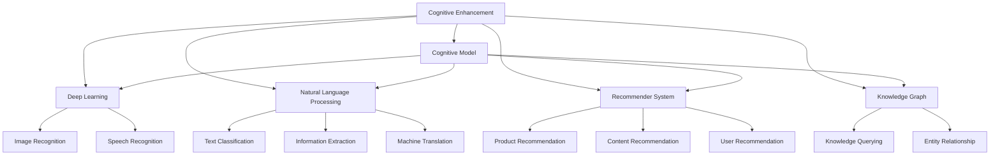

                 

# 认知增强套件：AI时代的思维升级工具

> 关键词：认知增强,人工智能,思维升级,认知科学,认知模型,神经网络,深度学习

## 1. 背景介绍

### 1.1 问题由来
随着人工智能(AI)技术的迅猛发展，认知增强技术日益成为人们关注的焦点。认知增强，简言之，就是借助人工智能，提升人类的认知能力，通过增强学习、自然语言处理、知识图谱、推荐系统等技术，拓宽信息获取渠道，加速知识更新速度，优化信息加工方式，从而提升决策质量、提高创新效率，最终实现思维的全面升级。

在当今信息爆炸的时代，人类获取、处理、应用信息的效率和能力面临着前所未有的挑战。信息过载、知识陈旧、认知偏差等问题，不仅影响着日常生活和工作，甚至可能带来认知负荷过重、决策失误等严重后果。因此，如何利用人工智能技术，构建认知增强套件，实现思维升级，成为了迫切需要解决的问题。

### 1.2 问题核心关键点
构建认知增强套件，涉及多个关键环节，包括认知科学基础、认知模型设计、深度学习架构、自然语言处理技术等。这些核心要素之间相互关联，共同构成了认知增强套件的底层架构。

1. **认知科学基础**：理解人类认知机制，建立理论框架。认知科学致力于揭示人类认知的机制和规律，是认知增强技术的重要理论支撑。

2. **认知模型设计**：构建能够模拟人类认知过程的计算模型。认知模型通过符号计算、神经网络、逻辑推理等方法，模拟人类学习、推理、记忆等认知活动。

3. **深度学习架构**：利用深度学习技术，实现认知增强任务。深度学习具有强大的表征学习能力，能够处理大规模非结构化数据，适用于自然语言处理、图像识别、推荐系统等任务。

4. **自然语言处理(NLP)**：提升认知增强中信息获取和处理的能力。NLP技术能够理解和生成自然语言，使得认知增强套件具备自然的交互界面。

5. **推荐系统**：增强认知过程中知识获取的针对性和个性化程度。推荐系统通过学习用户偏好和行为，提供精准的知识推荐，加速知识更新和应用。

6. **知识图谱**：构建全局性的知识网络，支撑认知增强中的信息关联和推理。知识图谱通过实体、属性、关系等信息，实现知识的全面整合和高效检索。

这些关键要素的有机结合，使得认知增强套件能够在信息时代，助力人类实现思维的全面升级。

### 1.3 问题研究意义
认知增强套件的构建，对于提升人类认知能力、推动科学进步、促进产业创新，具有重要意义：

1. **提升认知能力**：帮助人们更高效地获取、处理、应用信息，拓宽信息获取渠道，加速知识更新速度，优化信息加工方式，从而提升决策质量、提高创新效率。
2. **推动科学进步**：为科学研究提供强有力的工具支持，助力跨领域知识的整合与创新，加速科学前沿的探索和突破。
3. **促进产业创新**：通过认知增强，提升企业决策水平，推动产业技术创新，加速产业升级转型。
4. **优化工作生活**：帮助人们在复杂多变的工作和生活环境中，做出更精准的决策，提高效率和质量，减少压力和焦虑。
5. **增强社会福祉**：通过认知增强技术，改善教育、医疗、法律等领域的认知服务，提升社会福祉水平。

## 2. 核心概念与联系

### 2.1 核心概念概述

为更好地理解认知增强套件的工作原理和设计思路，本节将介绍几个关键概念及其相互联系：

- **认知增强(Cognitive Enhancement)**：通过人工智能技术，提升人类的认知能力，包括学习、记忆、推理、创造等各个方面。
- **认知模型(Cognitive Model)**：基于认知科学理论，构建的能够模拟人类认知过程的计算模型。常见的认知模型包括符号逻辑模型、神经网络模型等。
- **深度学习(Deep Learning)**：利用多层神经网络模型，通过数据驱动的方式学习复杂数据表征的机器学习方法。深度学习广泛应用于图像识别、语音识别、自然语言处理等领域。
- **自然语言处理(Natural Language Processing, NLP)**：研究如何让计算机理解和生成自然语言的学科。NLP技术包括文本分类、信息抽取、机器翻译等。
- **推荐系统(Recommender System)**：通过分析用户历史行为和兴趣偏好，为用户提供个性化的信息推荐。推荐系统广泛应用于电商、媒体、社交网络等领域。
- **知识图谱(Knowledge Graph)**：通过实体、属性、关系等信息，构建全局性的知识网络，支持知识的全面整合和高效检索。知识图谱在问答系统、知识管理、信息检索等领域有广泛应用。

这些核心概念之间的逻辑关系可以通过以下Mermaid流程图来展示：



这个流程图展示了几类核心概念及其相互联系：

1. 认知增强通过构建认知模型、深度学习、NLP、推荐系统、知识图谱等多种技术手段，提升人类认知能力。
2. 认知模型通过符号计算、神经网络等方法，模拟人类学习、推理、记忆等认知活动。
3. 深度学习利用多层神经网络模型，学习数据的高层次表征，应用于图像识别、语音识别、自然语言处理等任务。
4. NLP技术能够理解和生成自然语言，使得认知增强套件具备自然的交互界面。
5. 推荐系统通过学习用户历史行为和兴趣偏好，提供个性化的信息推荐，增强认知过程中的知识获取效率。
6. 知识图谱通过实体、属性、关系等信息，构建全局性的知识网络，支撑认知增强中的信息关联和推理。

这些概念共同构成了认知增强套件的底层架构，为其高效运行提供了坚实的理论和技术支持。

## 3. 核心算法原理 & 具体操作步骤
### 3.1 算法原理概述

认知增强套件的核心算法原理，主要基于认知模型设计和深度学习架构，通过自然语言处理技术，实现信息获取、处理和应用的全面提升。

认知模型设计基于认知科学理论，通过符号计算、神经网络等方法，模拟人类学习、推理、记忆等认知活动。深度学习则利用多层神经网络模型，学习复杂数据表征，应用于图像识别、语音识别、自然语言处理等任务。NLP技术能够理解和生成自然语言，使得认知增强套件具备自然的交互界面。

认知增强套件的操作流程，通常包括以下几个关键步骤：

1. **数据采集与预处理**：通过网络爬虫、API接口等方式，采集相关领域的文本、图像、音频等数据。对数据进行清洗、分词、标注等预处理，为后续模型训练和应用提供基础数据支持。
2. **模型训练与优化**：选择合适的认知模型和深度学习架构，利用标注数据进行模型训练和优化。通过损失函数、正则化技术、学习率调度等方法，调整模型参数，提升模型性能。
3. **信息检索与推理**：利用推荐系统、知识图谱等技术，实现信息检索与推理。根据用户输入，推荐相关知识，并进行逻辑推理，生成有针对性的信息摘要或回答。
4. **知识整合与生成**：通过自然语言处理技术，整合和生成新的知识。利用文本生成、知识图谱等方法，生成自然语言描述和知识结点，支持知识的表达和传播。
5. **应用部署与监控**：将训练好的模型和推理引擎部署到实际应用系统中，通过API接口提供服务。实时监控系统性能，根据反馈信息进行调整和优化。

### 3.2 算法步骤详解

以一个基于深度学习和NLP技术的认知增强套件为例，具体说明其操作步骤：

**Step 1: 数据采集与预处理**

- 通过爬虫技术采集新闻、论文、网页等文本数据。
- 利用分词工具进行文本分词，去除停用词、标点符号等噪声。
- 对文本进行标注，生成训练集和测试集。

**Step 2: 模型训练与优化**

- 使用BERT、GPT等预训练语言模型作为基础模型。
- 选择适当的训练数据集，设计合适的训练函数，进行模型训练。
- 使用正则化技术、学习率调度等方法，优化模型参数，提升模型精度。

**Step 3: 信息检索与推理**

- 设计知识图谱，抽取实体、属性、关系等信息，构建全局知识网络。
- 根据用户输入，利用知识图谱进行信息检索和推理，生成相关信息。
- 使用自然语言处理技术，生成自然语言描述和知识结点，提供信息摘要。

**Step 4: 知识整合与生成**

- 使用文本生成技术，整合新知识，生成自然语言描述。
- 利用推荐系统，根据用户历史行为和兴趣偏好，推荐相关知识。
- 设计知识图谱更新策略，实时更新知识图谱，保持其时效性和准确性。

**Step 5: 应用部署与监控**

- 将训练好的模型和推理引擎部署到实际应用系统中，通过API接口提供服务。
- 实时监控系统性能，根据反馈信息进行调整和优化。
- 定期更新数据和模型，保持认知增强套件的性能和稳定性。

### 3.3 算法优缺点

认知增强套件具有以下优点：

1. **高效性**：利用深度学习和自然语言处理技术，能够快速处理大规模非结构化数据，提供高效的信息检索和推理服务。
2. **通用性**：基于认知科学理论设计认知模型，能够应用于多种认知任务，如知识获取、推理、生成等。
3. **可扩展性**：通过添加新的认知模型和自然语言处理技术，可以不断扩展认知增强套件的功能和应用范围。
4. **互动性**：基于自然语言处理技术，认知增强套件能够与用户进行自然语言交互，提升用户体验。

同时，认知增强套件也存在一些局限性：

1. **数据依赖**：认知增强套件的性能很大程度上依赖于标注数据的质量和数量，获取高质量标注数据成本较高。
2. **模型复杂性**：深度学习模型参数量庞大，训练和推理过程复杂，需要高性能计算资源。
3. **解释性不足**：认知增强套件通常被视为"黑盒"系统，难以解释其内部工作机制和决策逻辑，影响其在高风险应用中的可接受性。
4. **伦理风险**：认知增强套件可能学习到有偏见、有害的信息，通过推理传递到下游任务，产生误导性、歧视性的输出，带来伦理风险。
5. **安全性问题**：认知增强套件在信息检索和推理过程中，可能面临数据隐私和信息安全问题，需要采取严格的保护措施。

尽管存在这些局限性，但就目前而言，认知增强套件在提高认知效率、优化决策质量、提升信息获取能力等方面，已经展现出显著的优势。未来相关研究的方向，在于如何进一步降低数据依赖，提高模型效率，增强模型解释性，减少伦理风险，保障信息安全。

### 3.4 算法应用领域

认知增强套件在多个领域已经得到了广泛应用，包括但不限于：

1. **医疗健康**：辅助医生进行病情诊断、治疗方案推荐、患者健康管理等。认知增强套件能够整合医疗知识库，提供精准的医学信息和建议。
2. **教育培训**：辅助教师进行教学内容设计、个性化学习推荐、学生学习状态监控等。认知增强套件能够根据学生行为和学习偏好，推荐相关学习资源，提升学习效果。
3. **金融服务**：辅助金融分析师进行市场分析、投资决策、风险管理等。认知增强套件能够整合金融知识库，提供精准的市场信息和分析报告。
4. **法律咨询**：辅助律师进行法律信息检索、案件分析、法律文书生成等。认知增强套件能够整合法律知识库，提供高效的法律信息服务和法律文书生成工具。
5. **新闻媒体**：辅助新闻工作者进行新闻信息整合、深度报道、数据分析等。认知增强套件能够提供精准的新闻信息推荐和新闻内容生成服务。
6. **电子商务**：辅助电商企业进行用户行为分析、产品推荐、广告投放等。认知增强套件能够根据用户行为和偏好，提供个性化的产品推荐和广告投放服务。
7. **智能家居**：辅助智能家居设备进行语音识别、环境感知、决策支持等。认知增强套件能够整合家居环境数据，提供智能化的家居服务。
8. **环境保护**：辅助环保部门进行环境监测、数据分析、政策制定等。认知增强套件能够整合环境数据，提供精准的环境监测和数据分析服务。

随着认知增强技术的发展，未来认知增强套件的应用领域将更加广泛，其潜力也将得到进一步挖掘和利用。

## 4. 数学模型和公式 & 详细讲解 & 举例说明

### 4.1 数学模型构建

认知增强套件的数学模型构建，主要基于深度学习架构和自然语言处理技术，通过神经网络模型，实现信息的编码和解码。

以自然语言处理中的文本分类任务为例，其数学模型可以表示为：

$$
P(C|x) = \frac{P(C)P(x|C)}{P(x)}
$$

其中，$P(C|x)$表示给定文本$x$属于类别$C$的概率；$P(C)$表示类别$C$的概率；$P(x|C)$表示给定类别$C$下生成文本$x$的概率；$P(x)$表示文本$x$在所有类别下的概率。

在深度学习中，通常使用softmax函数来计算后验概率，即：

$$
P(C|x) = \frac{\exp{(\text{logit}(x,C))}{\sum_C \exp{(\text{logit}(x,C))}
$$

其中，$\text{logit}(x,C)$表示文本$x$在类别$C$下的logit值。

### 4.2 公式推导过程

以文本分类任务为例，使用BERT模型进行推理的过程如下：

1. **文本编码**：将输入文本$x$输入BERT模型，得到文本的表示向量$V_x$。
2. **类别编码**：将类别$C$也输入BERT模型，得到类别的表示向量$V_C$。
3. **相似度计算**：计算文本表示向量$V_x$与类别表示向量$V_C$的相似度，得到相似度分数。
4. **softmax计算**：使用softmax函数计算后验概率，得到文本属于该类别的概率$P(C|x)$。

在计算过程中，BERT模型的参数通过预训练获得，可以通过如下公式进行计算：

$$
V_x = \text{BERT}(x)
$$
$$
V_C = \text{BERT}(C)
$$
$$
P(C|x) = \frac{\exp(\text{logit}(V_x,V_C))}{\sum_C \exp(\text{logit}(V_x,V_C))}
$$

其中，$\text{logit}(V_x,V_C)$表示文本表示向量$V_x$和类别表示向量$V_C$之间的logit值，可以通过如下公式计算：

$$
\text{logit}(V_x,V_C) = V_x^T W_C + b_C
$$

其中，$W_C$和$b_C$是类别的权重和偏置。

### 4.3 案例分析与讲解

以一个基于BERT模型的文本分类任务为例，具体说明其应用场景和实现过程：

1. **任务定义**：假设我们要构建一个用于识别新闻类别的认知增强套件，可以将每个新闻文章看作一个文本，将其分类为体育、财经、科技等类别。
2. **数据准备**：准备新闻文章和其对应的类别标签，将其划分为训练集和测试集。
3. **模型训练**：使用BERT模型对新闻文章进行编码，得到文本表示向量$V_x$。使用类别标签进行训练，优化模型的权重和偏置。
4. **推理预测**：对于新的新闻文章，输入BERT模型进行编码，得到文本表示向量$V_x$。根据模型推理结果，预测其类别。

## 5. 项目实践：代码实例和详细解释说明

### 5.1 开发环境搭建

在开始项目实践前，我们需要准备好开发环境。以下是使用Python进行PyTorch开发的环伺配置流程：

1. 安装Anaconda：从官网下载并安装Anaconda，用于创建独立的Python环境。

2. 创建并激活虚拟环境：
```bash
conda create -n pytorch-env python=3.8 
conda activate pytorch-env
```

3. 安装PyTorch：根据CUDA版本，从官网获取对应的安装命令。例如：
```bash
conda install pytorch torchvision torchaudio cudatoolkit=11.1 -c pytorch -c conda-forge
```

4. 安装Transformers库：
```bash
pip install transformers
```

5. 安装各类工具包：
```bash
pip install numpy pandas scikit-learn matplotlib tqdm jupyter notebook ipython
```

完成上述步骤后，即可在`pytorch-env`环境中开始项目实践。

### 5.2 源代码详细实现

这里以一个简单的文本分类任务为例，使用BERT模型进行实现。

**Step 1: 数据准备**

```python
import pandas as pd
from sklearn.model_selection import train_test_split

# 加载数据
data = pd.read_csv('news_data.csv')

# 划分训练集和测试集
train_data, test_data = train_test_split(data, test_size=0.2, random_state=42)

# 定义标签和文本
labels = train_data['category'].values
texts = train_data['text'].values

# 将文本转换为BERT模型所需的格式
tokenizer = BertTokenizer.from_pretrained('bert-base-uncased')
train_encodings = tokenizer(texts, truncation=True, padding='max_length', max_length=512)
train_labels = labels
```

**Step 2: 模型训练**

```python
from transformers import BertForSequenceClassification, Trainer, TrainingArguments

# 定义模型
model = BertForSequenceClassification.from_pretrained('bert-base-uncased', num_labels=len(set(labels)))

# 定义训练参数
training_args = TrainingArguments(
    output_dir='./results',
    evaluation_strategy='epoch',
    learning_rate=2e-5,
    per_device_train_batch_size=16,
    per_device_eval_batch_size=16,
    num_train_epochs=3,
    logging_dir='./logs',
    logging_steps=10,
    save_steps=10,
    save_total_limit=2,
    load_best_model_at_end=True,
    metric_for_best_model='accuracy',
)

# 定义训练器
trainer = Trainer(
    model=model,
    args=training_args,
    train_dataset=train_dataset,
    eval_dataset=test_dataset,
)

# 训练模型
trainer.train()
```

**Step 3: 模型推理**

```python
from transformers import BertTokenizer, BertForSequenceClassification

# 定义模型和分词器
tokenizer = BertTokenizer.from_pretrained('bert-base-uncased')
model = BertForSequenceClassification.from_pretrained('bert-base-uncased', num_labels=len(set(labels)))

# 定义待分类文本
text = 'This is a sample news article about science and technology.'

# 将文本转换为BERT模型所需的格式
inputs = tokenizer(text, truncation=True, padding='max_length', max_length=512, return_tensors='pt')

# 进行推理预测
logits = model(**inputs).logits
predicted_label = logits.argmax().item()
```

### 5.3 代码解读与分析

让我们再详细解读一下关键代码的实现细节：

**数据准备**

- 使用pandas库加载数据集，将数据集划分为训练集和测试集。
- 定义标签和文本，使用BERT分词器对文本进行分词和编码，转换为BERT模型所需的格式。

**模型训练**

- 使用BertForSequenceClassification模型，并指定分类数目为标签集合的大小。
- 定义训练参数，包括输出目录、评估策略、学习率、批大小、训练轮数等。
- 定义训练器，传入模型、训练参数和训练数据。
- 调用训练器进行模型训练。

**模型推理**

- 定义模型和分词器，传入待分类文本。
- 使用分词器对文本进行编码，转换为BERT模型所需的格式。
- 调用模型进行推理预测，得到文本分类的概率分布。
- 根据概率分布，选择概率最大的类别作为预测结果。

## 6. 实际应用场景

### 6.1 智能健康助手

基于认知增强套件的健康助手，能够提供精准的健康管理建议，帮助用户监控健康状况，提升生活质量。

**应用场景**

- **健康监控**：通过分析用户的生理数据和行为数据，提供个性化的健康监控建议，如睡眠质量、饮食建议、运动计划等。
- **疾病预警**：通过分析用户的健康数据，识别出潜在的健康风险，提供及时的疾病预警和建议。
- **健康知识普及**：提供精准的健康知识普及服务，帮助用户了解相关疾病的预防和治疗知识。

**实现流程**

1. **数据采集**：通过可穿戴设备和传感器，采集用户的生理数据和行为数据，如心率、睡眠质量、运动量等。
2. **信息检索**：利用认知增强套件，从健康知识库中检索相关健康知识，提供精准的健康建议。
3. **推理预测**：根据用户健康数据，利用认知增强套件进行推理预测，识别出潜在的健康风险，提供及时的疾病预警。
4. **知识生成**：利用认知增强套件，生成个性化的健康知识普及内容，帮助用户了解相关疾病的预防和治疗知识。

### 6.2 教育辅导系统

基于认知增强套件的教育辅导系统，能够提供个性化的学习推荐和辅导服务，帮助学生提升学习效果。

**应用场景**

- **学习推荐**：根据学生的学习行为和偏好，推荐相关的学习资源，如课程、习题、视频等。
- **学习辅导**：利用认知增强套件，提供个性化的学习辅导服务，帮助学生解决学习中的疑难问题。
- **学习状态监控**：监控学生的学习状态，提供学习报告和反馈，帮助学生改进学习方法。

**实现流程**

1. **学习行为采集**：通过教育平台和智能设备，采集学生的学习行为数据，如学习时间、答题情况、视频观看等。
2. **信息检索**：利用认知增强套件，从学习资源库中检索相关的学习资源，提供个性化的学习推荐。
3. **推理预测**：根据学生的学习行为数据，利用认知增强套件进行推理预测，识别出学生在学习中的疑难问题，提供个性化的学习辅导。
4. **知识生成**：利用认知增强套件，生成个性化的学习报告和反馈，帮助学生改进学习方法。

### 6.3 智能客服系统

基于认知增强套件的智能客服系统，能够提供全天候、高效、智能的客服服务，帮助企业提升客户体验和满意度。

**应用场景**

- **问题解答**：自动回答客户咨询，提供高效、准确的问题解答服务。
- **情感分析**：分析客户情绪，识别出客户的不满情绪，及时采取措施解决问题。
- **个性化服务**：根据客户历史行为和偏好，提供个性化的客服服务，提升客户满意度。

**实现流程**

1. **客户咨询采集**：通过智能客服系统，采集客户的咨询数据，包括客户提出的问题和历史行为记录。
2. **信息检索**：利用认知增强套件，从知识库中检索相关的知识信息，提供精准的问题解答。
3. **推理预测**：根据客户咨询数据，利用认知增强套件进行推理预测，识别出客户的不满情绪，提供及时的情感分析服务。
4. **知识生成**：利用认知增强套件，生成个性化的客服服务建议，提升客户满意度。

## 7. 工具和资源推荐

### 7.1 学习资源推荐

为了帮助开发者系统掌握认知增强技术，这里推荐一些优质的学习资源：

1. 《Deep Learning》系列书籍：Ian Goodfellow等著，全面介绍了深度学习的理论基础和应用实践。
2. 《Natural Language Processing with Python》：Stuart Zimmerman等著，介绍了自然语言处理中的常见技术和算法。
3. 《Recommender Systems: Algorithms and Applications》：Claude Bertrand等著，介绍了推荐系统中的经典算法和应用。
4. 《Knowledge Graphs: Representation and Reasoning》：Xavier Carreira等著，介绍了知识图谱中的基本概念和构建方法。
5. 《Cognitive Enhancement: Technology for Smartening Up》：Byron Tomkin等著，介绍了认知增强技术的最新进展和应用案例。

通过对这些资源的学习实践，相信你一定能够快速掌握认知增强技术的精髓，并用于解决实际的认知增强问题。

### 7.2 开发工具推荐

高效的开发离不开优秀的工具支持。以下是几款用于认知增强技术开发的常用工具：

1. PyTorch：基于Python的开源深度学习框架，灵活动态的计算图，适合快速迭代研究。
2. TensorFlow：由Google主导开发的开源深度学习框架，生产部署方便，适合大规模工程应用。
3. HuggingFace Transformers库：提供了丰富的预训练语言模型和推理引擎，是进行认知增强任务开发的利器。
4. Weights & Biases：模型训练的实验跟踪工具，可以记录和可视化模型训练过程中的各项指标，方便对比和调优。
5. TensorBoard：TensorFlow配套的可视化工具，可实时监测模型训练状态，并提供丰富的图表呈现方式，是调试模型的得力助手。

合理利用这些工具，可以显著提升认知增强技术的开发效率，加快创新迭代的步伐。

### 7.3 相关论文推荐

认知增强技术的发展源于学界的持续研究。以下是几篇奠基性的相关论文，推荐阅读：

1. Attention is All You Need（即Transformer原论文）：提出了Transformer结构，开启了深度学习在NLP领域的广泛应用。
2. BERT: Pre-training of Deep Bidirectional Transformers for Language Understanding：提出BERT模型，引入掩码自监督预训练任务，刷新了多项NLP任务SOTA。
3. Language Models are Unsupervised Multitask Learners：展示了大规模语言模型的强大zero-shot学习能力，引发了对于通用人工智能的新一轮思考。
4. Cognitive Enhancement via Augmented Intelligence：提出了认知增强的AI增强方法，讨论了如何通过AI技术提升人类认知能力。
5. A Survey on Cognitive Enhancement through Artificial Intelligence：总结了AI在认知增强中的应用现状和未来发展方向。

这些论文代表了大规模语言模型微调技术的发展脉络。通过学习这些前沿成果，可以帮助研究者把握学科前进方向，激发更多的创新灵感。

## 8. 总结：未来发展趋势与挑战

### 8.1 总结

本文对认知增强套件进行了全面系统的介绍。首先阐述了认知增强技术的研究背景和意义，明确了认知增强技术在提升人类认知能力、推动科学进步、促进产业创新等方面的重要价值。其次，从原理到实践，详细讲解了认知增强套件的数学模型和操作步骤，给出了认知增强任务开发的完整代码实例。同时，本文还广泛探讨了认知增强套件在智能健康、教育、客服等多个领域的应用前景，展示了认知增强技术的广阔潜力。此外，本文精选了认知增强技术的各类学习资源，力求为开发者提供全方位的技术指引。

通过本文的系统梳理，可以看到，认知增强套件正在成为AI时代的重要工具，通过深度学习和自然语言处理技术，提升人类的认知能力，优化信息获取和处理方式，实现思维的全面升级。得益于大规模语料的预训练和深度学习模型的强大表征能力，认知增强套件在信息时代的应用前景广阔，未来必将在更多领域发挥重要作用。

### 8.2 未来发展趋势

展望未来，认知增强技术的发展趋势如下：

1. **深度学习与认知科学结合**：随着深度学习技术的不断进步，未来认知增强技术将更加依赖于认知科学理论，构建更加符合人类认知机制的认知模型。
2. **多模态认知增强**：未来的认知增强技术将不再局限于文本数据，而是融合视觉、语音、图像等多种模态信息，提升认知能力。
3. **跨领域认知增强**：认知增强技术将突破单一领域，在医疗、教育、金融、法律等众多领域得到广泛应用，带来深远的影响。
4. **持续学习与适应性**：未来的认知增强系统将具备持续学习和适应性，能够不断从新数据中学习，保持性能的时效性和适应性。
5. **参数高效与计算高效**：未来的认知增强技术将更加注重参数高效和计算高效，降低资源消耗，提升系统性能。
6. **伦理与安全性**：未来的认知增强系统将更加注重伦理和安全性，避免偏见和有害信息的传递，确保系统的可控性和安全性。

这些趋势凸显了认知增强技术的广阔前景。通过不断探索和创新，认知增强技术必将在未来发挥更大的作用，推动人工智能技术的持续进步。

### 8.3 面临的挑战

尽管认知增强技术已经取得了显著进展，但在迈向更加智能化、普适化应用的过程中，仍面临诸多挑战：

1. **数据依赖**：认知增强套件的性能很大程度上依赖于标注数据的质量和数量，获取高质量标注数据的成本较高。如何进一步降低认知增强套件对标注样本的依赖，将是一大难题。
2. **模型复杂性**：深度学习模型参数量庞大，训练和推理过程复杂，需要高性能计算资源。
3. **伦理风险**：认知增强套件可能学习到有偏见、有害的信息，通过推理传递到下游任务，产生误导性、歧视性的输出，带来伦理风险。
4. **安全性问题**：认知增强套件在信息检索和推理过程中，可能面临数据隐私和信息安全问题，需要采取严格的保护措施。
5. **解释性不足**：认知增强套件通常被视为"黑盒"系统，难以解释其内部工作机制和决策逻辑，影响其在高风险应用中的可接受性。

尽管存在这些挑战，但随着学界和产业界的共同努力，认知增强技术必将逐步克服这些难题，实现其全面应用。

### 8.4 研究展望

未来的研究需要在以下几个方面寻求新的突破：

1. **无监督和半监督学习**：探索无监督和半监督学习方法，摆脱对大规模标注数据的依赖，利用自监督学习、主动学习等技术，最大限度利用非结构化数据，实现更加灵活高效的认知增强。
2. **多模态融合**：融合视觉、语音、图像等多种模态信息，提升认知增强系统的综合能力，构建更加全面的认知模型。
3. **知识图谱与认知模型结合**：将知识图谱与认知模型进行有机结合，构建全局性的知识网络，支撑认知增强中的信息关联和推理。
4. **因果推理与逻辑推理**：引入因果推理和逻辑推理技术，增强认知增强系统的决策能力，提高系统的稳定性和可解释性。
5. **伦理与安全性研究**：加强伦理与安全性研究，构建可控、安全的认知增强系统，避免偏见和有害信息的传递。

这些研究方向将推动认知增强技术的不断进步，为构建人机协同的智能时代提供强有力的技术支撑。

## 9. 附录：常见问题与解答

**Q1：认知增强套件的开发难点是什么？**

A: 认知增强套件的开发难点主要在于以下几个方面：
1. **数据采集与预处理**：需要采集大规模高质量的数据，并进行清洗、标注等预处理工作，数据依赖性较强。
2. **模型设计与训练**：需要选择合适的认知模型和深度学习架构，设计合适的训练函数，调整模型参数，训练过程复杂。
3. **信息检索与推理**：需要构建全局性的知识网络，实现信息的全面检索和推理，技术实现复杂。
4. **知识整合与生成**：需要设计知识图谱和文本生成算法，实现知识的整合和生成，技术难度较大。
5. **应用部署与监控**：需要构建稳定可靠的应用系统，实时监控系统性能，确保系统稳定运行。

**Q2：如何评估认知增强套件的效果？**

A: 评估认知增强套件的效果，主要从以下几个方面进行：
1. **模型性能评估**：通过测试集上的精度、召回率、F1值等指标，评估模型的推理精度和泛化能力。
2. **用户体验评估**：通过用户满意度调查、使用率统计等，评估认知增强套件的用户体验和接受度。
3. **任务完成度评估**：通过任务完成度、任务效率等指标，评估认知增强套件的实际应用效果。
4. **安全与伦理评估**：通过隐私保护、数据安全等指标，评估认知增强套件的安全性和伦理水平。

**Q3：如何提高认知增强套件的效率？**

A: 提高认知增强套件的效率，可以从以下几个方面入手：
1. **参数优化**：通过剪枝、量化、蒸馏等方法，减少模型的参数量，提升推理速度。
2. **模型压缩**：通过模型压缩技术，如低秩近似、知识蒸馏等，减少模型的存储空间和计算资源消耗。
3. **分布式训练**：通过分布式训练技术，利用多台机器并行训练，加速模型训练过程。
4. **缓存机制**：通过缓存机制，对常用数据和模型进行缓存，减少重复计算，提升系统响应速度。

**Q4：认知增强套件在实际应用中面临的主要问题是什么？**

A: 认知增强套件在实际应用中面临的主要问题包括：
1. **数据获取难度大**：高质量标注数据的获取成本较高，影响模型的性能。
2. **模型计算资源消耗大**：深度学习模型参数量庞大，训练和推理过程复杂，需要高性能计算资源。
3. **解释性不足**：认知增强套件通常被视为"黑盒"系统，难以解释其内部工作机制和决策逻辑，影响其在高风险应用中的可接受性。
4. **伦理与安全性问题**：认知增强套件可能学习到有偏见、有害的信息，通过推理传递到下游任务，产生误导性、歧视性的输出，带来伦理风险。
5. **系统复杂性高**：认知增强系统涉及多个环节，包括数据采集、模型训练、信息检索、知识生成等，系统实现复杂。

通过系统梳理这些问题，可以有效指导认知增强套件的实际应用，提升系统的性能和可靠性。

---

作者：禅与计算机程序设计艺术 / Zen and the Art of Computer Programming

