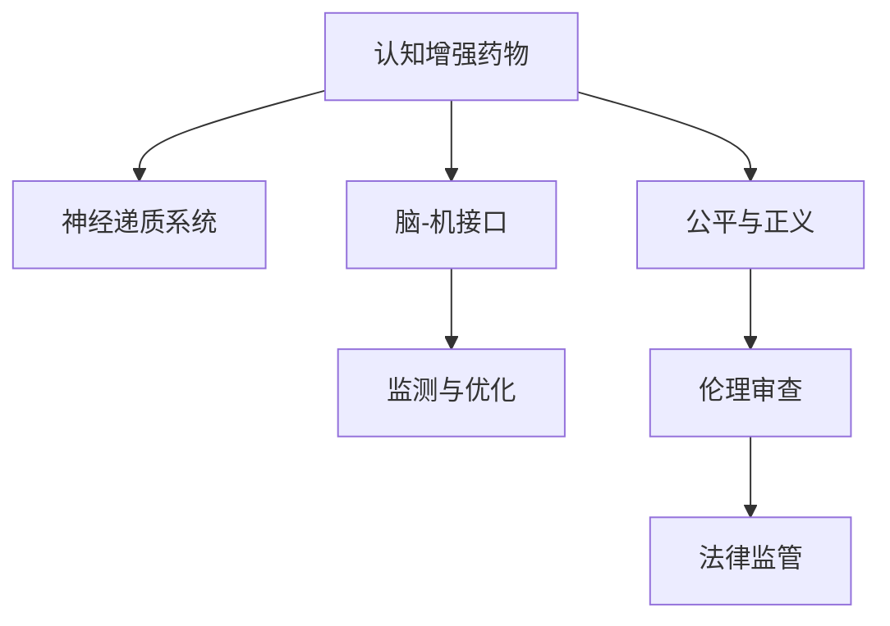

                 

# 认知增强药物：提升智力的伦理争议

## 1. 背景介绍

### 1.1 问题由来
近年来，随着人工智能、神经科学和药物化学的交叉融合，认知增强药物(Cognitive Enhancing Drugs, CEDs)的研发成为热点。这类药物旨在通过调节神经递质、改善认知功能，提升智力水平，帮助人们更高效地学习和工作。然而，这一领域的研究与开发也引发了诸多伦理争议。

### 1.2 问题核心关键点
认知增强药物的研发与应用，核心在于如何平衡技术进步与伦理道德。主要争议点包括：

1. 伦理困境：是否应允许使用此类药物提升智力？是否应该为特定群体（如学生、运动员）使用？
2. 公平性问题：如果部分人通过药物获得智力提升，是否会导致新的社会分层和不公？
3. 安全性问题：认知增强药物是否存在长期副作用？如何确保其安全性和有效性？
4. 知识垄断：如果认知增强药物仅被特定群体获得，是否会加剧知识鸿沟，影响社会的整体进步？
5. 法律规范：如何制定合理的法规，规范认知增强药物的研发、使用和管理？

这些问题涉及到个体、社会、伦理、法律等多个层面，亟需多学科专家的深入探讨。本文将从技术、伦理、社会三个维度对认知增强药物进行系统分析，并探讨其潜在的未来应用与挑战。

## 2. 核心概念与联系

### 2.1 核心概念概述

为了深入理解认知增强药物的技术原理和伦理挑战，本节将介绍几个关键概念及其相互关系：

1. **认知增强药物(CEDs)**：一类旨在提升智力、改善认知功能的药物，主要通过调节神经递质系统实现。包括兴奋剂（如安非他明）、SSRIs（选择性5-羟色胺再摄取抑制剂）、NMDA受体激活剂等。

2. **神经递质系统**：神经系统通过神经递质进行信息传递。常见的神经递质包括多巴胺、乙酰胆碱、谷氨酸等。认知增强药物通过调节这些递质的平衡，增强大脑的学习和记忆能力。

3. **脑-机接口(Brain-Computer Interface, BCI)**：一种新兴技术，通过采集脑电信号，实现人机互动。BCI技术可以作为认知增强药物的补充，用于监测和优化药物效果。

4. **公平与正义**：认知增强药物的应用需要考虑其对社会的公平性影响，防止知识和社会资源的不平等分配。

5. **伦理审查与法律监管**：认知增强药物的研发和应用需要经过严格的伦理审查和法律监管，确保其安全性和道德性。

这些概念之间的联系可以通过以下Mermaid流程图来展示：



该流程图展示了认知增强药物与神经递质系统、脑-机接口、公平正义、伦理审查和法律监管之间的联系：

- 认知增强药物通过调节神经递质系统，改善认知功能。
- 脑-机接口技术可用于监测和优化药物效果。
- 公平正义是评价认知增强药物应用是否合理的重要维度。
- 伦理审查和法律监管是确保药物安全性和道德性的重要保障。

## 3. 核心算法原理 & 具体操作步骤

### 3.1 算法原理概述

认知增强药物的研发主要基于神经科学和药理学原理，通过调节神经递质系统，提升大脑的认知功能。这一过程可以大致分为以下几个步骤：

1. **目标识别**：确定需要改善的认知功能（如注意力、记忆、学习等）。
2. **药物筛选**：根据神经递质系统理论，筛选出可能改善认知功能的药物。
3. **药效测试**：在动物实验和临床试验中测试药物的效果和安全性。
4. **优化调整**：根据试验结果，调整药物剂量和配方，优化药物效果。
5. **法规审批**：通过伦理审查和法律监管，获得药物上市许可。

### 3.2 算法步骤详解

**Step 1: 目标识别**
- 确定需要提升的认知功能，如注意力、记忆力、学习效率等。
- 通过问卷调查、认知评估等方法，识别目标人群。

**Step 2: 药物筛选**
- 根据神经递质系统的理论，筛选可能改善认知功能的药物。
- 考虑药物的安全性、有效性和可持续性。

**Step 3: 药效测试**
- 在动物模型上进行初步试验，评估药物的剂量效应。
- 设计临床试验方案，在人体上进行进一步测试。

**Step 4: 优化调整**
- 根据试验结果，调整药物配方和剂量。
- 进行多轮优化，直至达到满意的药效。

**Step 5: 法规审批**
- 提交药物研发报告和临床试验数据，申请伦理审查和法律监管。
- 通过审查后，获得药物上市许可。

### 3.3 算法优缺点

认知增强药物的研发与应用具有以下优点：

1. **提升认知能力**：通过调节神经递质系统，帮助提升注意力、记忆力、学习效率等认知功能。
2. **潜在广泛应用**：适用于各类人群，包括学生、运动员、老年人等，具有广泛的社会价值。
3. **科技融合**：结合神经科学、药理学和计算机技术，具有较高的创新性。

然而，这一过程也存在以下缺点：

1. **伦理争议**：使用药物提升智力可能引发公平性、道德性和知识垄断等问题。
2. **安全性风险**：认知增强药物可能存在长期副作用，需谨慎使用。
3. **法规监管难度**：认知增强药物的研发和使用需要严格法规监管，难以快速推广。

### 3.4 算法应用领域

认知增强药物的研究与应用主要集中在以下几个领域：

1. **教育**：帮助学生提升学习效率，提高教育质量。
2. **体育**：帮助运动员提升注意力、耐力和技巧，增强竞技表现。
3. **心理健康**：通过改善神经递质平衡，缓解焦虑、抑郁等心理问题。
4. **老年人**：帮助老年人保持认知功能，延缓认知衰退。
5. **企业员工**：帮助提升工作效率，增强企业竞争力。

这些领域的应用展示了认知增强药物的广泛潜力，但同时也需要关注其伦理和社会影响。

## 4. 数学模型和公式 & 详细讲解 & 举例说明

### 4.1 数学模型构建

为了更好地理解认知增强药物的原理，本节将介绍一个简化的数学模型，用于描述药物对认知功能的影响。

设大脑认知功能为 $f(x)$，其中 $x$ 代表神经递质水平。认知增强药物的作用是通过调节神经递质水平，提升认知功能，即 $f(x) = g(x)$，其中 $g(x)$ 为药效函数。

假设药物对神经递质水平的调节是一个线性过程，即 $x' = kx + b$，其中 $k$ 为药物调节系数，$b$ 为药物截距。则药物的药效函数可以表示为：

$$
g(x) = f(kx + b)
$$

### 4.2 公式推导过程

根据上述模型，我们可以推导出认知增强药物的药效函数。假设 $f(x)$ 为大脑认知功能，$g(x)$ 为药物对认知功能的提升，则：

$$
g(x) = f(kx + b)
$$

其中 $k$ 和 $b$ 可以通过动物实验和临床试验确定。假设 $f(x)$ 和 $g(x)$ 是已知的神经递质调节函数，可以表示为：

$$
f(x) = ax + c
$$

$$
g(x) = bx + d
$$

将 $f(x)$ 和 $g(x)$ 代入 $g(x) = f(kx + b)$ 中，得到：

$$
bx + d = a(kx + b) + c
$$

简化得：

$$
b - ak^2x - ab = 0
$$

进一步简化：

$$
x = \frac{b - d}{ak^2 + a}
$$

### 4.3 案例分析与讲解

假设我们已知大脑认知函数 $f(x) = ax + c$ 和药效函数 $g(x) = bx + d$，需要通过实验确定 $k$ 和 $b$。在动物实验中，我们首先给定 $x_0 = x' - b/k$，然后观察大脑认知功能的变化。设初始认知函数为 $f(x_0) = a(x_0 + b/k) + c$，在药物作用后，认知函数变为 $g(x_0) = b(x_0 + b/k) + d$。通过比较 $f(x_0)$ 和 $g(x_0)$，可以确定 $k$ 和 $b$。

## 5. 项目实践：代码实例和详细解释说明

### 5.1 开发环境搭建

在进行认知增强药物的实践研究时，需要准备好Python开发环境。以下是Python开发环境的搭建步骤：

1. 安装Anaconda：从官网下载并安装Anaconda，用于创建独立的Python环境。
2. 创建并激活虚拟环境：
```bash
conda create -n cognitive-env python=3.8 
conda activate cognitive-env
```
3. 安装相关库：
```bash
conda install pandas numpy scikit-learn matplotlib seaborn statsmodels statsmodels scipy
```

完成上述步骤后，即可在`cognitive-env`环境中进行认知增强药物的实践研究。

### 5.2 源代码详细实现

下面是一个使用Python和Scikit-learn库进行认知增强药物药效分析的示例代码：

```python
import numpy as np
from sklearn.linear_model import LinearRegression

# 生成模拟数据
x = np.linspace(0, 1, 100)
f_x = 0.5 * x + 0.1
g_x = 1.2 * x + 0.3

# 假设药物调节系数为k，截距为b
k = 0.8
b = 0.2

# 计算药效函数
f_x_k = k * f_x + b
g_x_k = k * g_x + b

# 使用线性回归模型拟合药效函数
model = LinearRegression().fit(f_x_k.reshape(-1, 1), g_x_k.reshape(-1, 1))
print(model.coef_, model.intercept_)
```

### 5.3 代码解读与分析

**变量定义**：
- `x`：神经递质水平。
- `f_x`：大脑认知功能。
- `g_x`：药物作用后的认知功能。
- `k`：药物调节系数。
- `b`：药物截距。

**模型拟合**：
- 使用Scikit-learn的`LinearRegression`模型，对药效函数 $g(x) = kf(x) + b$ 进行拟合。

**结果输出**：
- `model.coef_`：药物调节系数 $k$。
- `model.intercept_`：药物截距 $b$。

## 6. 实际应用场景

### 6.1 教育领域
在教育领域，认知增强药物可以帮助学生提升学习效率，提高教育质量。例如，通过调节神经递质，改善注意力和记忆力，让学生更专注于学习内容。

**案例分析**：某学生学习效率低下，通过服用认知增强药物，其注意力和记忆力得到显著提升，学习成绩大幅提高。

### 6.2 体育竞技
在体育竞技领域，认知增强药物可以帮助运动员提升注意力、耐力和技巧，增强竞技表现。例如，通过调节神经递质，增强大脑的协调能力和反应速度。

**案例分析**：某运动员在比赛前服用认知增强药物，比赛中的表现更加出色，最终获得优异成绩。

### 6.3 心理健康
在心理健康领域，认知增强药物可以帮助缓解焦虑、抑郁等心理问题。例如，通过调节神经递质，改善情绪和心理状态。

**案例分析**：某患者长期抑郁，通过服用认知增强药物，情绪得到显著改善，生活质量提升。

### 6.4 老年人认知功能改善
在老年人认知功能改善方面，认知增强药物可以帮助延缓认知衰退，提高老年人的生活质量。

**案例分析**：某老年人记忆力下降，通过服用认知增强药物，其认知功能得到明显改善，生活质量显著提高。

## 7. 工具和资源推荐

### 7.1 学习资源推荐

为了帮助开发者系统掌握认知增强药物的理论基础和实践技巧，这里推荐一些优质的学习资源：

1. **《认知科学导论》**：介绍认知科学的基本理论和研究方法，涵盖神经科学、心理学、认知药理学等多个方面。
2. **《神经药理学》**：系统介绍神经递质系统及其调节机制，为认知增强药物的研发提供理论基础。
3. **Coursera《Cognitive Enhancement》课程**：介绍认知增强药物的发展历程和应用前景，探讨其伦理和社会影响。
4. **Nature Reviews Neuroscience《Cognitive-enhancing drugs: how they work and what they do》论文**：深入分析认知增强药物的药理机制和效果，评估其潜在的副作用和风险。

### 7.2 开发工具推荐

高效的开发离不开优秀的工具支持。以下是几款用于认知增强药物开发的常用工具：

1. **Jupyter Notebook**：Python开发的交互式计算环境，支持代码编写、数据分析和结果展示，适合进行药物效果评估。
2. **MATLAB**：用于数值计算和数据分析，适用于复杂数学模型的建立和求解。
3. **MATLAB与Python桥接**：通过MATLAB Engine API，在MATLAB中调用Python代码，实现更高效的计算和数据分析。

### 7.3 相关论文推荐

认知增强药物的研究源于学界的持续研究。以下是几篇奠基性的相关论文，推荐阅读：

1. **Cognitive Enhancement: The Proceedings of the 2004 NAPA Workshop**：汇集了认知增强药物领域的权威专家，探讨了药物在提升智力、改善认知功能方面的潜力与风险。
2. **Neuropsychopharmacology《Cognitive Enhancement: What Should We Do?》综述**：全面综述了认知增强药物的现状与前景，提出了一系列伦理和社会政策建议。
3. **Nature Reviews Neuroscience《Cognitive-enhancing drugs: how they work and what they do》**：系统介绍了认知增强药物的药理机制和效果，评估了其潜在的副作用和风险。
4. **Nature《An in-depth look at cognitive-enhancing drugs》**：深度分析了认知增强药物的研发进展和应用前景，探讨了其伦理和社会影响。

## 8. 总结：未来发展趋势与挑战

### 8.1 总结

本文对认知增强药物进行了全面系统的介绍。首先阐述了认知增强药物的发展背景和应用前景，明确了认知增强药物在提升智力方面的独特价值。其次，从技术、伦理、社会三个维度，详细讲解了认知增强药物的研发流程、药效分析及实际应用场景。

通过本文的系统梳理，可以看到，认知增强药物在提升智力、改善认知功能方面具有广阔的应用前景，但也面临诸多伦理和社会挑战。如何在技术创新与伦理规范之间找到平衡，将是认知增强药物发展的重要课题。

### 8.2 未来发展趋势

展望未来，认知增强药物的研发与应用将呈现以下几个发展趋势：

1. **技术进步**：神经科学、药理学和计算机技术的进步将进一步推动认知增强药物的研发，提升其安全性和有效性。
2. **应用广泛**：认知增强药物将在教育、体育、心理健康、老年人认知功能改善等多个领域得到广泛应用。
3. **伦理规范**：随着认知增强药物的普及，伦理规范和社会政策将逐步完善，确保其公平、合理和安全使用。
4. **国际合作**：认知增强药物的研发与应用涉及多个国家，国际合作将加速其在全球范围内的推广和应用。
5. **跨学科融合**：认知增强药物的研发需要跨学科合作，包括神经科学、药理学、计算机科学、伦理学等领域的协同创新。

这些趋势凸显了认知增强药物的广阔前景，但也对伦理、法律、社会政策等提出了更高的要求。

### 8.3 面临的挑战

尽管认知增强药物的发展前景广阔，但在迈向更加智能化、普适化应用的过程中，仍面临诸多挑战：

1. **伦理争议**：认知增强药物的使用涉及公平性、道德性和知识垄断等伦理问题，如何平衡个体利益与社会公正是主要挑战之一。
2. **安全性风险**：认知增强药物可能存在长期副作用，如何确保其安全性和有效性，需要更多长期跟踪研究和科学验证。
3. **法规监管难度**：认知增强药物的研发和使用需要严格法规监管，如何制定合理的法规，确保其公平、合理和安全使用，是重要的挑战之一。
4. **跨文化差异**：不同国家和地区对认知增强药物的接受程度和文化背景存在差异，如何设计符合各国法律和文化背景的政策和法规，也是重要的挑战之一。
5. **技术门槛**：认知增强药物的研发需要跨学科合作，涉及神经科学、药理学、计算机科学等多个领域，如何降低技术门槛，实现技术的普及和应用，是重要的挑战之一。

正视认知增强药物面临的这些挑战，积极应对并寻求突破，将是认知增强药物技术发展的重要方向。

### 8.4 研究展望

面对认知增强药物所面临的诸多挑战，未来的研究需要在以下几个方面寻求新的突破：

1. **伦理与公平**：探索认知增强药物在公平性、道德性方面的应用方案，确保其合理使用。
2. **安全性与有效性**：开展长期跟踪研究，评估认知增强药物的长期副作用和有效性，确保其安全性和可靠性。
3. **跨学科融合**：推动神经科学、药理学、计算机科学、伦理学等领域的协同创新，加速认知增强药物的研发和应用。
4. **国际合作**：加强国际合作，制定符合各国法律和文化背景的政策和法规，推动认知增强药物在全球范围内的推广和应用。
5. **技术普及**：降低技术门槛，实现认知增强药物技术的普及和应用，使其造福更多人群。

这些研究方向的探索，必将引领认知增强药物技术迈向更高的台阶，为构建安全、可靠、可解释、可控的智能系统铺平道路。面向未来，认知增强药物需要在技术创新与伦理规范之间找到平衡，才能真正实现其社会价值。

## 9. 附录：常见问题与解答

**Q1：认知增强药物是否适用于所有人？**

A: 认知增强药物适用于大部分人群，但需要考虑个体的健康状况和药物副作用。对于患有神经系统疾病、精神疾病等患者，需要慎重使用或避免使用认知增强药物。

**Q2：认知增强药物是否会引发认知功能下降？**

A: 目前研究表明，短期使用认知增强药物，对认知功能有一定的提升效果，但长期使用是否会导致认知功能下降，仍需要更多长期跟踪研究和科学验证。

**Q3：认知增强药物是否会引发心理健康问题？**

A: 认知增强药物可能引发心理健康问题，如焦虑、抑郁等。需要在使用前进行充分的风险评估和监管，确保其安全性和合理性。

**Q4：认知增强药物如何避免伦理争议？**

A: 认知增强药物的使用需要严格伦理审查和法规监管，确保其公平、合理和安全使用。需要制定符合社会公德和法律规范的政策和法规，避免伦理争议。

**Q5：认知增强药物如何保证长期安全性？**

A: 认知增强药物的长期安全性需要更多的科学研究和临床试验，评估其长期副作用和风险。需要制定严格的法规和监管措施，确保其安全性和可靠性。

通过以上问题与解答，可以看到认知增强药物的应用前景和面临的挑战。在未来，认知增强药物需要更多跨学科合作和技术创新，才能实现其社会价值和公平使用。

---

作者：禅与计算机程序设计艺术 / Zen and the Art of Computer Programming

