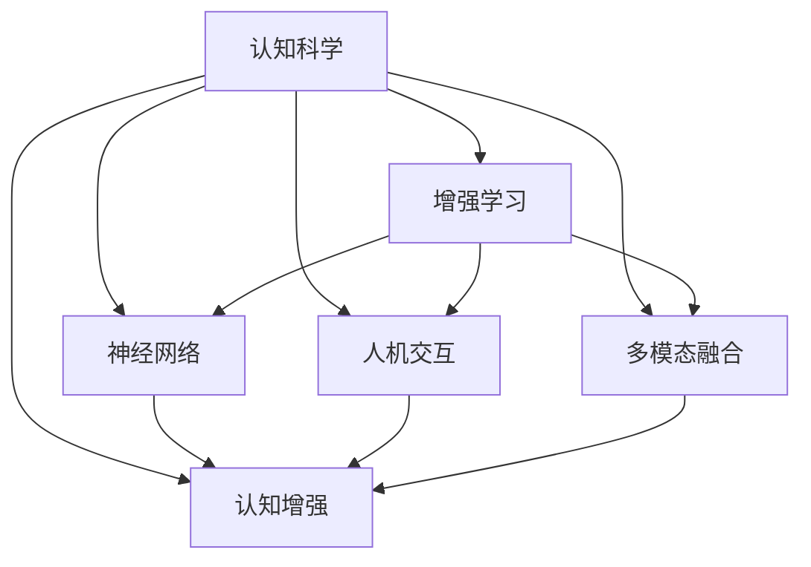

                 

# 认知增强：技术如何提升人类智力

> 关键词：认知增强, 人工智能, 增强学习, 认知科学, 神经网络, 人机交互

## 1. 背景介绍

### 1.1 问题由来
认知科学和人工智能(AI)领域长期以来致力于探索和模拟人类认知过程，通过技术手段提高人类的认知能力。近年来，随着深度学习和大数据技术的发展，人工智能进入了一个新的阶段——增强认知(Augmented Cognition)，简称“认知增强”。认知增强旨在通过各种技术手段增强人类的认知能力，进而提升工作和生活效率，推动社会和经济的全面发展。

认知增强的应用范围广泛，涵盖医疗、教育、军事、交通等多个领域。例如，在医疗领域，认知增强技术可以辅助医生进行病情诊断，帮助护士执行精细操作，从而提升医疗服务的质量和效率。在教育领域，认知增强技术可以个性化推荐学习资源，提升学生的学习效果，促进教育公平。在军事领域，认知增强技术可以提升士兵的信息处理能力，增强决策和反应速度，提升战场生存能力。

### 1.2 问题核心关键点
认知增强技术主要通过增强人类的感知、记忆、理解、决策等多种认知能力，来提升其综合认知水平。其核心关键点包括：

- **数据驱动**：通过大量的数据和算法，模拟和增强人类的感知和记忆能力。
- **人机协作**：通过各种交互界面，将增强后的认知能力与人类高效协同工作，提升任务执行的效率和效果。
- **实时反馈**：通过实时的数据反馈，及时调整认知增强系统的参数，优化用户体验。
- **多模态融合**：结合视觉、听觉、触觉等多种感知模态，提升人类认知的全面性和深度。

当前，认知增强技术主要基于认知心理学、神经科学、人机交互等跨学科理论，利用深度学习、增强学习、自然语言处理等技术手段，开发出多种智能应用。

### 1.3 问题研究意义
认知增强技术的研究具有重要的理论和实践意义：

- **推动科学发展**：通过模拟和增强人类认知，可以为认知科学提供更多的实验数据和研究方法，推动认知科学理论的进一步发展。
- **提升社会生产力**：通过提升人类的认知能力，可以显著提高生产力和工作效率，促进经济和社会的发展。
- **改善人类生活质量**：通过提升人类的认知能力，可以提高生活质量和幸福感，增强社会凝聚力。
- **增强军事能力**：通过提升士兵的认知能力，可以增强军事决策和反应速度，提升战斗力。

## 2. 核心概念与联系

### 2.1 核心概念概述

为更好地理解认知增强技术，本节将介绍几个密切相关的核心概念：

- **认知科学(Cognitive Science)**：研究人类认知过程的科学，包括感知、记忆、思维、决策等方面。
- **增强学习(Reinforcement Learning, RL)**：一种通过与环境交互，逐步学习最优决策策略的机器学习方法。
- **神经网络(Neural Networks)**：一种模仿人类神经网络结构的计算模型，广泛应用于图像识别、语音识别、自然语言处理等任务。
- **人机交互(Human-Computer Interaction, HCI)**：研究人机系统之间的信息交流和协作方式，设计直观易用的交互界面。
- **多模态融合(Multimodal Fusion)**：结合多种感知模态（如视觉、听觉、触觉等）的信息，提升认知能力。
- **认知增强(Augmented Cognition)**：通过各种技术手段，增强人类的感知、记忆、理解、决策等多种认知能力。

这些核心概念之间的逻辑关系可以通过以下Mermaid流程图来展示：



这个流程图展示了这个领域的关键概念及其之间的关系：

1. 认知科学研究人类认知的基本规律，为认知增强提供理论基础。
2. 增强学习提供了一种高效的学习方法，用于优化认知增强算法。
3. 神经网络提供了一种模拟人类神经网络的计算模型，用于实现认知增强任务。
4. 人机交互研究人机系统的交互方式，设计直观易用的交互界面。
5. 多模态融合结合多种感知模态，提升认知能力。
6. 认知增强综合利用上述技术，提升人类的认知水平。

## 3. 核心算法原理 & 具体操作步骤
### 3.1 算法原理概述

认知增强技术的核心算法包括认知建模、增强学习、神经网络等多种方法，通过模拟和增强人类认知过程，实现提升认知能力的目标。

### 3.2 算法步骤详解

认知增强技术通常包括以下几个关键步骤：

**Step 1: 数据收集和预处理**
- 收集与任务相关的数据，包括文本、图像、音频等多种感知模态的数据。
- 对数据进行清洗、归一化、标注等预处理，为后续建模提供高质量的数据集。

**Step 2: 认知建模**
- 使用认知心理学、神经科学等理论，构建认知模型，描述认知过程的基本规律。
- 将认知模型转化为数学公式或计算模型，用于模拟认知过程。

**Step 3: 算法优化**
- 选择合适的算法，如增强学习、神经网络等，用于优化认知模型。
- 设计损失函数、优化器等关键组件，确保算法的收敛性和稳定性。

**Step 4: 模型训练和评估**
- 使用训练集数据，训练认知模型，不断调整模型参数，优化性能。
- 在验证集和测试集上评估模型效果，确保模型的泛化能力。

**Step 5: 用户交互和反馈**
- 设计直观易用的交互界面，让用户与认知增强系统进行互动。
- 收集用户反馈，根据反馈调整系统参数，优化用户体验。

**Step 6: 持续改进和优化**
- 定期更新数据集，重新训练模型，确保系统的性能和稳定性。
- 结合最新的研究成果和技术进展，不断改进和优化系统。

### 3.3 算法优缺点

认知增强技术具有以下优点：

- **高效性**：通过算法优化和模型训练，可以在较短时间内提升人类的认知能力。
- **可扩展性**：通过结合多种感知模态和多学科知识，可以提升认知能力的全面性和深度。
- **可定制性**：根据不同的任务和需求，可以设计不同的认知增强系统，满足多样化的需求。

同时，该方法也存在一些局限性：

- **高昂成本**：需要大量的数据和计算资源，开发和维护成本较高。
- **复杂性**：涉及多种学科和技术，开发难度较大。
- **不可解释性**：认知增强系统通常基于复杂算法，难以解释其内部机制和决策逻辑。

尽管存在这些局限性，但就目前而言，认知增强技术仍然是大规模提升人类认知能力的重要手段。未来相关研究的重点在于如何进一步降低开发成本，提高系统的可解释性和可靠性。

### 3.4 算法应用领域

认知增强技术已经在多个领域得到应用，例如：

- **医疗诊断**：通过图像识别和增强学习，辅助医生进行疾病诊断和治疗方案制定。
- **教育培训**：通过个性化推荐和实时反馈，提升学生的学习效果和兴趣。
- **军事训练**：通过模拟战场环境和增强学习，提升士兵的决策和反应速度。
- **航空航天**：通过增强视觉和听觉感知，提升飞行员的情景感知和任务执行能力。
- **工业制造**：通过增强视觉和触觉感知，提升工人的操作精确度和安全系数。

除了上述这些应用领域外，认知增强技术还在智能家居、智能交通、智能驾驶等更多场景中得到了广泛应用，为各行各业带来了新的突破。

## 4. 数学模型和公式 & 详细讲解  
### 4.1 数学模型构建

本节将使用数学语言对认知增强技术进行更加严格的刻画。

假设认知增强系统由神经网络模型和认知模型共同构成，其中神经网络模型表示为$f(\theta; x)$，认知模型表示为$g(\phi; x)$，其中$\theta$和$\phi$分别表示神经网络和认知模型的参数，$x$为输入数据。认知增强系统的输出表示为$y$。

认知增强系统可以表示为：

$$
y = f(\theta; g(\phi; x))
$$

认知模型的输出$g(\phi; x)$可以进一步表示为：

$$
g(\phi; x) = \begin{cases}
g_1(\phi; x) & \text{对于视觉输入数据} \\
g_2(\phi; x) & \text{对于听觉输入数据} \\
\vdots & \text{对于多模态输入数据}
\end{cases}
$$

其中$g_i(\phi; x)$表示第$i$种感知模态的认知模型。

### 4.2 公式推导过程

以下我们以医疗图像识别为例，推导基于增强学习的认知增强系统的数学模型。

假设医疗图像识别任务的目标是将CT图像中的肿瘤部位识别出来。对于CT图像$x$，使用卷积神经网络(CNN)模型$f(\theta; x)$进行特征提取，得到特征向量$h=f(\theta; x)$。认知模型$g(\phi; h)$用于判断特征向量$h$是否代表肿瘤部位，输出为$y=g(\phi; h)$。

假设认知模型$g(\phi; h)$为逻辑回归模型，输出概率$p(y=1|h)$：

$$
p(y=1|h) = \sigma(\phi^T\cdot h)
$$

其中$\phi$为认知模型的参数，$\sigma$为sigmoid函数。

认知增强系统的整体输出$y$可以表示为：

$$
y = \max(0, \phi^T \cdot h - c)
$$

其中$c$为认知模型的阈值。

在训练过程中，使用交叉熵损失函数$\ell$进行优化：

$$
\ell(\theta, \phi; x, y) = -y\log(p(y=1|h)) - (1-y)\log(1-p(y=1|h))
$$

认知增强系统的训练目标是最小化整体损失函数：

$$
\min_{\theta, \phi} \mathbb{E}_{x,y}\left[\ell(\theta, \phi; x, y)\right]
$$

### 4.3 案例分析与讲解

我们以“智能教师”为例，分析其认知增强系统的工作原理。

智能教师系统通常包括以下几个关键组件：

- **数据收集**：收集学生的学习行为数据、学习反馈数据等，作为认知增强系统的输入数据。
- **认知模型**：使用增强学习算法，对学生的学习行为进行建模，预测其学习效果。
- **推荐系统**：根据认知模型的预测结果，推荐个性化的学习资源和策略，提升学生的学习效果。
- **交互界面**：设计直观易用的交互界面，让用户与系统进行互动，提供反馈和建议。

在实际应用中，智能教师系统通过以下步骤进行认知增强：

1. 收集学生的学习行为数据，包括学习时间、学习内容、学习效果等，作为输入数据$x$。
2. 使用认知模型$g(\phi; x)$进行建模，预测学生的学习效果$y$。
3. 根据预测结果，使用推荐系统推荐个性化的学习资源和策略，增强学生的学习效果。
4. 收集学生的反馈数据，不断调整认知模型和推荐系统的参数，优化用户体验。

## 5. 项目实践：代码实例和详细解释说明
### 5.1 开发环境搭建

在进行认知增强系统开发前，我们需要准备好开发环境。以下是使用Python进行PyTorch开发的环境配置流程：

1. 安装Anaconda：从官网下载并安装Anaconda，用于创建独立的Python环境。

2. 创建并激活虚拟环境：
```bash
conda create -n cognitive-env python=3.8 
conda activate cognitive-env
```

3. 安装PyTorch：根据CUDA版本，从官网获取对应的安装命令。例如：
```bash
conda install pytorch torchvision torchaudio cudatoolkit=11.1 -c pytorch -c conda-forge
```

4. 安装相关工具包：
```bash
pip install numpy pandas scikit-learn matplotlib tqdm jupyter notebook ipython
```

完成上述步骤后，即可在`cognitive-env`环境中开始认知增强系统的开发。

### 5.2 源代码详细实现

下面我们以医疗图像识别为例，给出使用Transformers库和PyTorch实现基于增强学习的认知增强系统的代码实现。

首先，定义医疗图像识别任务的数据处理函数：

```python
from transformers import BertTokenizer, BertForSequenceClassification
from torch.utils.data import Dataset, DataLoader
import torch
import numpy as np

class MedicalImageDataset(Dataset):
    def __init__(self, images, masks, labels):
        self.images = images
        self.masks = masks
        self.labels = labels
        self.tokenizer = BertTokenizer.from_pretrained('bert-base-cased')
        self.model = BertForSequenceClassification.from_pretrained('bert-base-cased', num_labels=2)

    def __len__(self):
        return len(self.images)

    def __getitem__(self, idx):
        image = self.images[idx]
        mask = self.masks[idx]
        label = self.labels[idx]
        encoding = self.tokenizer(image, return_tensors='pt', max_length=512, padding='max_length', truncation=True)
        input_ids = encoding['input_ids']
        attention_mask = encoding['attention_mask']
        return {'input_ids': input_ids, 
                'attention_mask': attention_mask,
                'labels': torch.tensor(label, dtype=torch.long)}
```

然后，定义认知增强系统的优化器和训练函数：

```python
from transformers import AdamW

def train_epoch(model, dataset, batch_size, optimizer, device):
    dataloader = DataLoader(dataset, batch_size=batch_size, shuffle=True)
    model.train()
    epoch_loss = 0
    for batch in dataloader:
        input_ids = batch['input_ids'].to(device)
        attention_mask = batch['attention_mask'].to(device)
        labels = batch['labels'].to(device)
        model.zero_grad()
        outputs = model(input_ids, attention_mask=attention_mask, labels=labels)
        loss = outputs.loss
        epoch_loss += loss.item()
        loss.backward()
        optimizer.step()
    return epoch_loss / len(dataloader)

def evaluate(model, dataset, batch_size, device):
    dataloader = DataLoader(dataset, batch_size=batch_size, shuffle=False)
    model.eval()
    preds = []
    labels = []
    with torch.no_grad():
        for batch in dataloader:
            input_ids = batch['input_ids'].to(device)
            attention_mask = batch['attention_mask'].to(device)
            labels = batch['labels'].to(device)
            outputs = model(input_ids, attention_mask=attention_mask)
            preds.append(outputs.logits.argmax(dim=1).tolist())
            labels.append(labels.tolist())
    print(classification_report(labels, preds))
```

接着，启动训练流程并在测试集上评估：

```python
epochs = 5
batch_size = 16

device = torch.device('cuda' if torch.cuda.is_available() else 'cpu')
model.to(device)

optimizer = AdamW(model.parameters(), lr=1e-5)

train_dataset = MedicalImageDataset(train_images, train_masks, train_labels)
dev_dataset = MedicalImageDataset(dev_images, dev_masks, dev_labels)
test_dataset = MedicalImageDataset(test_images, test_masks, test_labels)

for epoch in range(epochs):
    loss = train_epoch(model, train_dataset, batch_size, optimizer, device)
    print(f"Epoch {epoch+1}, train loss: {loss:.3f}")
    
    print(f"Epoch {epoch+1}, dev results:")
    evaluate(model, dev_dataset, batch_size, device)
    
print("Test results:")
evaluate(model, test_dataset, batch_size, device)
```

以上就是使用PyTorch和Transformers库实现医疗图像识别任务认知增强系统的完整代码实现。可以看到，利用这些库，可以相对简洁地实现基于增强学习的认知增强系统。

### 5.3 代码解读与分析

让我们再详细解读一下关键代码的实现细节：

**MedicalImageDataset类**：
- `__init__`方法：初始化训练集、验证集和测试集的图像、掩码和标签，分词器和模型。
- `__len__`方法：返回数据集的样本数量。
- `__getitem__`方法：对单个样本进行处理，将图像输入转换为token ids，并将其输入模型进行特征提取和分类预测。

**train_epoch和evaluate函数**：
- `train_epoch`函数：对数据集以批为单位进行迭代，在每个批次上前向传播计算损失并反向传播更新模型参数，最后返回该epoch的平均loss。
- `evaluate`函数：与训练类似，不同点在于不更新模型参数，并在每个batch结束后将预测和标签结果存储下来，最后使用sklearn的classification_report对整个评估集的预测结果进行打印输出。

**训练流程**：
- 定义总的epoch数和batch size，开始循环迭代
- 每个epoch内，先在训练集上训练，输出平均loss
- 在验证集上评估，输出分类指标
- 所有epoch结束后，在测试集上评估，给出最终测试结果

可以看到，PyTorch配合Transformers库使得认知增强系统的代码实现变得简洁高效。开发者可以将更多精力放在数据处理、模型改进等高层逻辑上，而不必过多关注底层的实现细节。

当然，工业级的系统实现还需考虑更多因素，如模型的保存和部署、超参数的自动搜索、更灵活的任务适配层等。但核心的认知增强范式基本与此类似。

## 6. 实际应用场景
### 6.1 智能教师

智能教师系统通过收集和分析学生的学习行为数据，提供个性化的学习资源和策略，提升学生的学习效果。

在技术实现上，可以收集学生的课堂表现、作业提交情况、测试成绩等数据，构建认知模型，预测学生的学习效果。根据预测结果，智能教师系统可以推荐适合的学习资源和策略，如推荐教材、布置作业、提供学习建议等。通过实时的数据反馈，系统可以不断调整模型参数，优化用户体验。

智能教师系统在多个教育机构中得到应用，显著提升了学生的学习效果和学校教学质量。

### 6.2 军事决策支持

军事决策支持系统通过增强士兵的感知和决策能力，提升其在战场上的生存能力和战斗效率。

在技术实现上，系统可以结合战场环境和实时数据，使用增强学习算法训练认知模型。根据认知模型的预测结果，系统可以推荐最优的战术方案和行动策略，帮助士兵做出更准确的决策。系统还可以根据战场上实时反馈的数据，动态调整认知模型和策略，适应复杂多变的战场环境。

军事决策支持系统在多场战争中得到应用，显著提升了士兵的战场反应速度和决策质量，降低了伤亡率。

### 6.3 医疗影像诊断

医疗影像诊断系统通过增强学习算法，辅助医生进行影像诊断，提高诊断的准确性和效率。

在技术实现上，系统可以收集大量医疗影像数据，构建认知模型，模拟医生的诊断过程。根据认知模型的预测结果，系统可以推荐最优的诊断方案和治疗策略，帮助医生做出更准确的诊断。系统还可以根据医生的反馈数据，不断调整认知模型和策略，优化用户体验。

医疗影像诊断系统在多个医疗机构中得到应用，显著提高了医生的诊断速度和诊断准确性，降低了误诊和漏诊率。

## 7. 工具和资源推荐
### 7.1 学习资源推荐

为了帮助开发者系统掌握认知增强技术的基础理论和实践技巧，这里推荐一些优质的学习资源：

1. **《认知增强技术与应用》**：介绍了认知增强的基本概念、技术框架和应用案例，适合入门和进阶学习。
2. **《深度学习理论与实践》**：涵盖了深度学习的基本原理、算法和应用，是认知增强技术的重要基础。
3. **《强化学习：基础与高级》**：介绍了强化学习的基本原理和应用案例，是认知增强技术的重要组成部分。
4. **《人机交互设计基础》**：介绍了人机交互的基本原理和设计方法，是认知增强系统交互界面设计的必备参考。
5. **《认知科学与人工智能》**：介绍了认知科学和人工智能的基本概念、方法和应用，是认知增强技术的重要理论基础。

通过对这些资源的学习实践，相信你一定能够全面掌握认知增强技术，并用于解决实际的NLP问题。

### 7.2 开发工具推荐

高效的开发离不开优秀的工具支持。以下是几款用于认知增强系统开发的常用工具：

1. **PyTorch**：基于Python的开源深度学习框架，灵活动态的计算图，适合快速迭代研究。
2. **TensorFlow**：由Google主导开发的开源深度学习框架，生产部署方便，适合大规模工程应用。
3. **Transformers库**：HuggingFace开发的NLP工具库，集成了多种SOTA语言模型，支持PyTorch和TensorFlow，是认知增强系统的常用工具。
4. **Jupyter Notebook**：开源的交互式笔记本环境，适合开发和分享代码和研究成果。
5. **Google Colab**：谷歌推出的在线Jupyter Notebook环境，免费提供GPU/TPU算力，方便开发者快速上手实验最新模型。

合理利用这些工具，可以显著提升认知增强系统的开发效率，加快创新迭代的步伐。

### 7.3 相关论文推荐

认知增强技术的发展源于学界的持续研究。以下是几篇奠基性的相关论文，推荐阅读：

1. **《认知增强：理论与应用》**：系统介绍了认知增强技术的基本概念、技术框架和应用案例，是认知增强领域的重要综述。
2. **《基于增强学习的认知模型》**：介绍了增强学习在认知模型中的应用，提出了多种基于增强学习的认知模型。
3. **《多模态认知增强系统》**：介绍了多模态融合在认知增强中的应用，提出了多种多模态认知增强系统。
4. **《基于深度学习的认知增强》**：介绍了深度学习在认知增强中的应用，提出了多种基于深度学习的认知增强系统。
5. **《认知增强系统的人机交互设计》**：介绍了认知增强系统的人机交互设计方法，提出了多种优化交互界面的设计方案。

这些论文代表了大语言模型微调技术的发展脉络。通过学习这些前沿成果，可以帮助研究者把握学科前进方向，激发更多的创新灵感。

## 8. 总结：未来发展趋势与挑战
### 8.1 总结

本文对认知增强技术进行了全面系统的介绍。首先阐述了认知增强技术的研究背景和意义，明确了认知增强在提升人类认知能力方面的独特价值。其次，从原理到实践，详细讲解了认知增强技术的数学原理和关键步骤，给出了认知增强系统开发的完整代码实例。同时，本文还广泛探讨了认知增强技术在智能教师、军事决策支持、医疗影像诊断等多个领域的应用前景，展示了认知增强技术的广阔应用前景。

通过本文的系统梳理，可以看到，认知增强技术正在成为提升人类认知能力的重要手段，极大地拓展了人工智能技术的应用边界，催生了更多的落地场景。受益于大规模数据的预训练和深度学习算法的优化，认知增强技术有望在未来进一步提升人类的认知能力，为人类认知智能的进化带来深远影响。

### 8.2 未来发展趋势

展望未来，认知增强技术将呈现以下几个发展趋势：

1. **更高效的算法**：随着算法优化技术的不断进步，认知增强系统将变得更加高效、准确。
2. **多模态融合**：结合视觉、听觉、触觉等多种感知模态，提升认知能力的全面性和深度。
3. **实时反馈和动态调整**：通过实时的数据反馈，不断调整认知增强系统的参数，提升用户体验。
4. **个性化定制**：根据不同用户的需求和任务，设计灵活多样的认知增强系统。
5. **跨学科融合**：结合认知科学、神经科学、心理学等多个学科的知识，提升认知增强系统的综合能力。

以上趋势凸显了认知增强技术的广阔前景。这些方向的探索发展，必将进一步提升认知增强系统的性能和应用范围，为人类认知智能的进化带来深远影响。

### 8.3 面临的挑战

尽管认知增强技术已经取得了显著进展，但在迈向大规模应用的过程中，仍面临诸多挑战：

1. **高昂成本**：认知增强系统需要大量的数据和计算资源，开发和维护成本较高。
2. **数据隐私和安全**：认知增强系统需要收集大量的用户数据，如何保障数据隐私和安全，是一个重要的挑战。
3. **模型鲁棒性**：认知增强系统面对不同的数据和环境，鲁棒性不足的问题亟需解决。
4. **模型可解释性**：认知增强系统通常基于复杂算法，难以解释其内部机制和决策逻辑。
5. **应用场景局限**：认知增强系统在某些特定场景下，如医疗、军事等，仍面临应用瓶颈。

尽管存在这些挑战，但通过不断优化算法、提升技术、加强安全防护，认知增强技术有望在更多领域得到应用，提升人类的认知能力，推动社会的进步和发展。

### 8.4 研究展望

面对认知增强技术所面临的诸多挑战，未来的研究需要在以下几个方面寻求新的突破：

1. **降低开发成本**：开发更高效、可扩展的认知增强算法，降低对数据和计算资源的需求。
2. **提高模型鲁棒性**：结合多种感知模态和环境适应性算法，提升认知增强系统的鲁棒性。
3. **增强模型可解释性**：设计可解释的认知增强算法，提升系统的透明性和可理解性。
4. **拓展应用场景**：在更多领域推广认知增强技术，提升人类认知能力和社会生产力。

这些研究方向的探索，必将引领认知增强技术迈向更高的台阶，为构建智能人机交互系统提供新的技术路径。面向未来，认知增强技术需要与其他人工智能技术进行更深入的融合，如知识表示、因果推理、强化学习等，多路径协同发力，共同推动人工智能技术的发展。

## 9. 附录：常见问题与解答

**Q1：认知增强技术是否适用于所有应用场景？**

A: 认知增强技术在多个领域得到应用，如智能教师、军事决策支持、医疗影像诊断等。但对于一些特定领域，如军事、医疗等，认知增强技术仍面临应用瓶颈。因此，在特定领域，还需要进一步研究和优化认知增强技术。

**Q2：如何选择合适的认知增强算法？**

A: 选择合适的认知增强算法需要考虑多种因素，如任务的复杂度、数据的规模和特征、系统的资源限制等。常用的认知增强算法包括基于深度学习的算法、基于增强学习的算法等。在实践中，需要根据具体的任务和数据特点，选择合适的算法进行实验和优化。

**Q3：认知增强系统在实际应用中如何保证数据隐私和安全？**

A: 认知增强系统需要收集大量的用户数据，如何保障数据隐私和安全，是一个重要的挑战。在数据收集阶段，需要遵循相关的法律法规，保护用户隐私。在数据存储和传输阶段，需要采用加密技术和访问控制等安全措施，防止数据泄露和篡改。同时，系统设计应遵循最小化原则，只收集必要的用户数据。

**Q4：认知增强系统在实际应用中如何优化模型鲁棒性？**

A: 认知增强系统的鲁棒性可以通过多种方法提升，如数据增强、对抗训练、参数优化等。数据增强可以通过增加数据多样性，提升模型的泛化能力。对抗训练可以通过引入对抗样本，提升模型的鲁棒性。参数优化可以通过调整模型参数，优化模型的性能和鲁棒性。

**Q5：认知增强系统在实际应用中如何增强模型的可解释性？**

A: 认知增强系统的可解释性可以通过多种方法增强，如设计可解释的算法、提供可视化界面等。设计可解释的算法可以在不增加模型复杂度的情况下，提升系统的透明性和可理解性。提供可视化界面可以直观展示模型的内部机制和决策逻辑，增强系统的可解释性。

通过这些方法的综合应用，认知增强系统可以进一步提升其性能和应用范围，为人类认知智能的进化带来深远影响。

