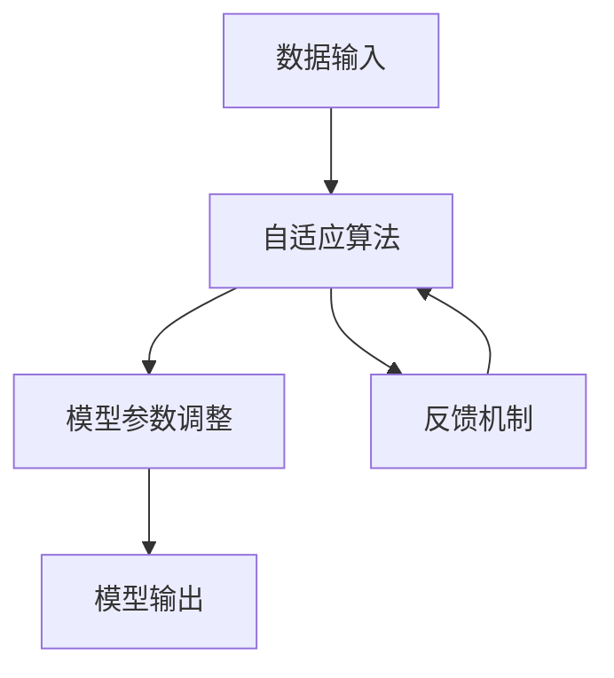

                 

# 认知弹性：适应快速变化的学习能力

> 关键词：认知弹性, 学习能力, 机器学习, 适应性, 神经网络, 深度学习, 人工智能, 智能系统, 自适应算法, 数据驱动

## 1. 背景介绍

在现代信息爆炸和快速变化的世界中，适应和学习的能力显得尤为重要。传统的静态模型已经无法满足快速变化的环境需求，而基于认知弹性的学习系统则能灵活适应环境变化，成为应对未来挑战的关键。本文将介绍认知弹性的概念、原理及应用，探讨其在机器学习和人工智能领域的实际应用场景，并总结未来发展趋势和面临的挑战。

## 2. 核心概念与联系

### 2.1 核心概念概述

认知弹性（Cognitive Elasticity）是指系统或模型能根据环境变化自动调整其内部结构与参数的能力。这种能力使系统能够灵活适应不断变化的数据分布和任务需求，从而提升其在实际应用中的表现。认知弹性包括两个核心要素：

- **自适应性**：系统能够根据新的输入数据和任务需求，自动调整其内部结构与参数，适应新的数据分布和任务模式。
- **鲁棒性**：系统在面临数据分布变化或噪声干扰时，仍能保持较高的性能表现。

### 2.2 核心概念原理和架构的 Mermaid 流程图



### 2.3 核心概念原理

认知弹性系统主要通过自适应算法和反馈机制来实现。自适应算法根据当前输入数据和任务需求，自动调整模型参数，使其适应新的数据分布和任务模式。反馈机制则通过不断地接收模型输出与真实标签的差异反馈，进一步优化模型参数，从而提高模型的适应性和鲁棒性。

## 3. 核心算法原理 & 具体操作步骤

### 3.1 算法原理概述

认知弹性算法通常基于以下步骤实现：

1. **数据预处理**：对输入数据进行归一化、标准化等预处理操作。
2. **模型初始化**：选择或初始化一个适当的神经网络模型。
3. **自适应算法**：根据当前输入数据和任务需求，自动调整模型参数。
4. **反馈机制**：通过模型输出与真实标签的差异，反馈给自适应算法，进一步优化模型参数。
5. **模型评估**：对模型在验证集和测试集上的性能进行评估，确定是否需要进一步调整模型参数。

### 3.2 算法步骤详解

#### 步骤1：数据预处理

数据预处理是认知弹性系统的基础步骤，包括数据清洗、特征提取和归一化等操作。目的是减少数据噪声，提升模型对新数据的适应能力。

#### 步骤2：模型初始化

选择合适的模型或初始化模型参数，是实现认知弹性的关键。常见的模型包括深度神经网络、卷积神经网络等。模型的初始化通常使用随机初始化、预训练模型等方法。

#### 步骤3：自适应算法

自适应算法是认知弹性系统的核心，根据当前输入数据和任务需求，自动调整模型参数。常用的自适应算法包括：

- **梯度下降法**：通过反向传播算法计算梯度，更新模型参数，以最小化损失函数。
- **遗传算法**：模拟自然选择过程，通过种群优化选择最佳参数组合。
- **粒子群优化**：模拟鸟群觅食过程，通过粒子群交互选择最佳参数。
- **贝叶斯优化**：基于贝叶斯理论，通过高斯过程预测模型性能，选择最优参数。

#### 步骤4：反馈机制

反馈机制通过不断地接收模型输出与真实标签的差异反馈，进一步优化模型参数。常用的反馈机制包括：

- **对比学习**：通过对比学习的方式，使得模型能够更准确地识别不同类别的样本。
- **对抗训练**：通过引入对抗样本，提高模型鲁棒性，避免过拟合。
- **正则化**：通过L1、L2正则化等方法，限制模型复杂度，避免过拟合。

#### 步骤5：模型评估

模型评估是认知弹性系统的最后一步，通过在验证集和测试集上对模型性能进行评估，确定是否需要进一步调整模型参数。常用的模型评估方法包括：

- **交叉验证**：通过交叉验证的方式，评估模型在不同数据集上的表现。
- **ROC曲线**：绘制ROC曲线，评估模型的分类性能。
- **混淆矩阵**：通过混淆矩阵，评估模型的分类准确率和召回率。

### 3.3 算法优缺点

#### 优点

- **灵活适应**：认知弹性算法能根据数据分布变化，自动调整模型参数，适应新的数据和任务需求。
- **鲁棒性**：通过反馈机制，认知弹性算法能够提高模型的鲁棒性，避免过拟合和灾难性遗忘。
- **高效性**：认知弹性算法通常使用高效的自适应算法，如梯度下降、贝叶斯优化等，使得模型训练效率更高。

#### 缺点

- **复杂性**：认知弹性算法通常较为复杂，需要设计自适应算法和反馈机制。
- **数据依赖**：认知弹性算法依赖于高质量的数据集，数据质量差可能影响模型性能。
- **计算资源消耗**：部分自适应算法如贝叶斯优化，计算复杂度高，需要更多的计算资源。

### 3.4 算法应用领域

认知弹性算法在多个领域得到了广泛应用，包括：

- **自然语言处理**：通过自适应算法和反馈机制，认知弹性算法能够适应不同的语言任务和数据分布。
- **图像识别**：通过自适应算法和反馈机制，认知弹性算法能够适应不同的图像识别任务和数据分布。
- **推荐系统**：通过自适应算法和反馈机制，认知弹性算法能够适应不同的用户偏好和行为模式。
- **金融预测**：通过自适应算法和反馈机制，认知弹性算法能够适应不同的金融市场变化和数据分布。
- **医疗诊断**：通过自适应算法和反馈机制，认知弹性算法能够适应不同的医疗数据分布和诊断任务。

## 4. 数学模型和公式 & 详细讲解 & 举例说明

### 4.1 数学模型构建

认知弹性算法的数学模型通常基于以下假设：

1. 输入数据 $x$ 服从概率分布 $P(x)$。
2. 模型参数 $\theta$ 服从先验分布 $P(\theta)$。
3. 模型输出 $y$ 服从条件分布 $P(y|x,\theta)$。
4. 模型损失函数 $L(y,\hat{y})$ 用于衡量模型预测与真实标签之间的差异。

### 4.2 公式推导过程

假设我们有一组训练数据 $\{x_1, x_2, ..., x_n\}$，对应的标签为 $\{y_1, y_2, ..., y_n\}$。定义模型的预测输出为 $\hat{y} = f(x, \theta)$，其中 $f$ 为模型函数，$\theta$ 为模型参数。

模型训练的目标是最大化似然函数 $L(\theta) = \prod_{i=1}^{n} P(y_i|x_i,\theta)$，即让模型对每条数据的预测概率最大化。

通过最大似然估计，可以得到模型参数 $\theta$ 的最优解为：

$$
\theta = \arg\max_{\theta} \sum_{i=1}^{n} \log P(y_i|x_i,\theta)
$$

在训练过程中，我们通过反向传播算法计算梯度 $\nabla_{\theta}L$，使用梯度下降等优化算法更新模型参数。

### 4.3 案例分析与讲解

假设我们有一组二分类数据，输入为 $x$，标签为 $y$。定义模型为 $y = \sigma(Wx + b)$，其中 $\sigma$ 为sigmoid函数，$W$ 和 $b$ 为模型参数。

通过反向传播算法，可以得到损失函数 $L(y,\hat{y}) = -\sum_{i=1}^{n}[y_i\log\hat{y_i} + (1-y_i)\log(1-\hat{y_i})]$。

使用梯度下降算法，更新模型参数 $W$ 和 $b$，使得 $L(y,\hat{y})$ 最小化。具体更新公式如下：

$$
W \leftarrow W - \eta\nabla_{W}L
$$

$$
b \leftarrow b - \eta\nabla_{b}L
$$

其中 $\eta$ 为学习率。

## 5. 项目实践：代码实例和详细解释说明

### 5.1 开发环境搭建

在进行认知弹性算法实践前，我们需要准备好开发环境。以下是使用Python进行TensorFlow开发的Python环境配置流程：

1. 安装Anaconda：从官网下载并安装Anaconda，用于创建独立的Python环境。
2. 创建并激活虚拟环境：
```bash
conda create -n tf-env python=3.8 
conda activate tf-env
```

3. 安装TensorFlow：根据CUDA版本，从官网获取对应的安装命令。例如：
```bash
conda install tensorflow tensorflow-gpu=2.4.1 -c conda-forge
```

4. 安装各类工具包：
```bash
pip install numpy pandas scikit-learn matplotlib tqdm jupyter notebook ipython
```

完成上述步骤后，即可在`tf-env`环境中开始认知弹性算法的实践。

### 5.2 源代码详细实现

下面以基于自适应算法和反馈机制的二分类任务为例，给出使用TensorFlow实现认知弹性算法的代码实现。

首先，定义模型和数据处理函数：

```python
import tensorflow as tf
from tensorflow.keras import layers

class AdaptiveModel(tf.keras.Model):
    def __init__(self):
        super(AdaptiveModel, self).__init__()
        self.dense1 = layers.Dense(64, activation='relu')
        self.dense2 = layers.Dense(1, activation='sigmoid')
    
    def call(self, x):
        x = self.dense1(x)
        x = self.dense2(x)
        return x

def load_dataset():
    # 加载数据集
    (x_train, y_train), (x_test, y_test) = tf.keras.datasets.boston_housing.load_data()
    x_train = x_train.reshape(-1, 1)
    x_test = x_test.reshape(-1, 1)
    x_train = x_train / 10.0
    x_test = x_test / 10.0
    return x_train, y_train, x_test, y_test

def preprocess_data(x_train, x_test):
    # 数据归一化
    x_train = x_train / 10.0
    x_test = x_test / 10.0
    return x_train, x_test
```

然后，定义自适应算法和反馈机制：

```python
def adaptive_train(x_train, y_train, x_test, y_test, epochs=100, batch_size=32):
    model = AdaptiveModel()
    optimizer = tf.keras.optimizers.Adam()

    # 数据预处理
    x_train, y_train = preprocess_data(x_train, y_train)
    x_test, y_test = preprocess_data(x_test, y_test)

    # 定义损失函数
    def loss_fn(y_true, y_pred):
        return tf.keras.losses.BinaryCrossentropy()(y_true, y_pred)

    # 训练过程
    for epoch in range(epochs):
        for i in range(0, len(x_train), batch_size):
            x_batch = x_train[i:i+batch_size]
            y_batch = y_train[i:i+batch_size]
            with tf.GradientTape() as tape:
                y_pred = model(x_batch)
                loss = loss_fn(y_batch, y_pred)
            gradients = tape.gradient(loss, model.trainable_variables)
            optimizer.apply_gradients(zip(gradients, model.trainable_variables))
        
        # 验证过程
        y_pred = model(x_test)
        loss = loss_fn(y_test, y_pred)
        print(f"Epoch {epoch+1}, loss: {loss.numpy():.4f}")
```

最后，启动训练流程并在测试集上评估：

```python
x_train, y_train, x_test, y_test = load_dataset()

# 训练模型
adaptive_train(x_train, y_train, x_test, y_test)

# 测试模型
y_pred = model(x_test)
loss = loss_fn(y_test, y_pred)
print(f"Test loss: {loss.numpy():.4f}")
```

以上就是使用TensorFlow实现认知弹性算法的完整代码实现。可以看到，TensorFlow框架使得模型训练和优化过程变得简单高效。

### 5.3 代码解读与分析

让我们再详细解读一下关键代码的实现细节：

**AdaptiveModel类**：
- `__init__`方法：定义模型的结构，包括两个全连接层和一个sigmoid激活函数。
- `call`方法：定义模型前向传播的计算过程。

**load_dataset函数**：
- 使用`boston_housing`数据集，加载训练集和测试集，并进行数据归一化。

**adaptive_train函数**：
- 定义自适应算法和反馈机制，使用Adam优化器更新模型参数。
- 在每个epoch内，对训练集数据进行批处理，计算损失函数并反向传播更新模型参数。
- 在每个epoch结束后，计算模型在测试集上的损失，并输出。

**训练流程**：
- 加载数据集并预处理。
- 定义模型和优化器。
- 在每个epoch内，进行训练和验证。
- 在所有epoch结束后，评估模型在测试集上的性能。

## 6. 实际应用场景

### 6.1 智能客服系统

基于认知弹性算法的智能客服系统，能够根据用户对话自动调整模型参数，适应不同的用户需求和对话场景。系统通过实时收集和分析用户对话数据，不断优化模型，提供更加准确和个性化的服务。

在技术实现上，可以设计多轮对话模板，并根据用户输入动态调整对话策略。同时，引入反馈机制，收集用户满意度和对话质量，进一步优化模型参数，提升客户体验。

### 6.2 金融舆情监测

金融机构通过基于认知弹性算法的舆情监测系统，能够实时分析市场舆情，预测市场变化。系统通过收集社交媒体、新闻、论坛等公开数据，并引入自适应算法和反馈机制，动态调整舆情模型参数，提高市场预测准确度。

在实际应用中，可以使用多种数据源，并通过自适应算法和反馈机制，逐步提升模型的预测能力和鲁棒性。同时，引入异常检测机制，及时发现和预警市场异常情况，保障金融安全。

### 6.3 个性化推荐系统

基于认知弹性算法的个性化推荐系统，能够根据用户行为和反馈，自动调整模型参数，提供个性化的推荐内容。系统通过收集用户浏览、点击、评分等行为数据，并引入自适应算法和反馈机制，动态优化推荐模型，提升推荐准确率和用户满意度。

在实际应用中，可以使用多种推荐算法，并通过自适应算法和反馈机制，逐步提升推荐效果。同时，引入实时数据收集和反馈机制，动态调整推荐策略，确保推荐内容的实时性和多样性。

### 6.4 未来应用展望

随着认知弹性算法的不断发展，其在更多领域的应用前景将更加广阔。未来，认知弹性算法有望在以下领域得到广泛应用：

- **智慧医疗**：通过自适应算法和反馈机制，认知弹性算法能够实时监测和预测患者健康状况，提供个性化医疗服务。
- **智能制造**：通过自适应算法和反馈机制，认知弹性算法能够实时监测和优化生产过程，提高生产效率和产品质量。
- **智能交通**：通过自适应算法和反馈机制，认知弹性算法能够实时监测和优化交通流量，提升交通管理效率。
- **智能农业**：通过自适应算法和反馈机制，认知弹性算法能够实时监测和预测农作物生长状况，提供精准农业解决方案。

## 7. 工具和资源推荐

### 7.1 学习资源推荐

为了帮助开发者系统掌握认知弹性算法的理论基础和实践技巧，这里推荐一些优质的学习资源：

1. 《TensorFlow深度学习实战》：一本由TensorFlow官方团队编写的实战指南，涵盖深度学习的基本概念和TensorFlow的使用方法。
2. 《深度学习入门》：一本由MXNet团队编写的入门指南，适合初学者快速上手深度学习。
3. 《认知弹性与自适应学习》：一本深入探讨认知弹性算法的理论和技术实现的书，适合进阶开发者。
4. arXiv上关于认知弹性算法的最新研究论文：通过阅读最新的研究论文，可以了解认知弹性算法的前沿进展和应用案例。

通过对这些资源的学习实践，相信你一定能够快速掌握认知弹性算法的精髓，并用于解决实际的机器学习和人工智能问题。

### 7.2 开发工具推荐

高效的开发离不开优秀的工具支持。以下是几款用于认知弹性算法开发的常用工具：

1. TensorFlow：由Google主导开发的开源深度学习框架，生产部署方便，适合大规模工程应用。
2. PyTorch：基于Python的开源深度学习框架，灵活动态的计算图，适合快速迭代研究。
3. Weights & Biases：模型训练的实验跟踪工具，可以记录和可视化模型训练过程中的各项指标，方便对比和调优。
4. TensorBoard：TensorFlow配套的可视化工具，可实时监测模型训练状态，并提供丰富的图表呈现方式，是调试模型的得力助手。
5. Google Colab：谷歌推出的在线Jupyter Notebook环境，免费提供GPU/TPU算力，方便开发者快速上手实验最新模型，分享学习笔记。

合理利用这些工具，可以显著提升认知弹性算法的开发效率，加快创新迭代的步伐。

### 7.3 相关论文推荐

认知弹性算法的快速发展离不开学界的持续研究。以下是几篇奠基性的相关论文，推荐阅读：

1. "Cognitive Elasticity: Towards Adaptive Deep Learning"：提出认知弹性算法的概念和原理，探讨其在大数据时代的应用潜力。
2. "Self-Adaptive Deep Learning"：介绍自适应算法在深度学习中的应用，包括自适应梯度算法、自适应学习率算法等。
3. "Learning from Data with Adaptive Deep Learning"：探讨自适应算法在数据驱动学习中的应用，包括在线学习、迁移学习等。
4. "Adaptive Deep Learning for Real-time Applications"：介绍自适应算法在实时应用中的实现方法和优化策略。

这些论文代表了大规模数据时代认知弹性算法的研究方向和应用前景。通过学习这些前沿成果，可以帮助研究者把握学科前进方向，激发更多的创新灵感。

## 8. 总结：未来发展趋势与挑战

### 8.1 总结

本文对认知弹性算法的概念、原理及应用进行了全面系统的介绍。首先阐述了认知弹性的核心要素及其在机器学习和人工智能领域的应用，明确了认知弹性在适应快速变化环境中的独特价值。其次，从原理到实践，详细讲解了认知弹性算法的数学模型和操作步骤，给出了认知弹性算法任务开发的完整代码实例。同时，本文还广泛探讨了认知弹性算法在智能客服、金融舆情、个性化推荐等多个行业领域的应用前景，展示了认知弹性算法的巨大潜力。此外，本文精选了认知弹性算法的各类学习资源，力求为读者提供全方位的技术指引。

通过本文的系统梳理，可以看到，认知弹性算法正在成为机器学习和人工智能领域的重要范式，极大地提升了模型在实际应用中的适应性和鲁棒性，推动了人工智能技术在垂直行业的规模化落地。未来，伴随认知弹性算法和相关技术的不断演进，相信人工智能技术必将在更广阔的应用领域大放异彩，深刻影响人类的生产生活方式。

### 8.2 未来发展趋势

展望未来，认知弹性算法将呈现以下几个发展趋势：

1. **自适应算法的多样化**：随着深度学习技术的发展，自适应算法的形式将更加多样化，如贝叶斯优化、协方差矩阵更新、自适应梯度等。
2. **多模态数据的融合**：认知弹性算法将进一步拓展到多模态数据融合，如图像、语音、视频等，提升对复杂环境的适应能力。
3. **边缘计算的引入**：随着边缘计算技术的发展，认知弹性算法将更多地部署在边缘设备上，提升实时性和资源利用效率。
4. **实时系统的优化**：认知弹性算法将更多地应用于实时系统，如智能交通、智能制造等，通过自适应算法和反馈机制，提升系统性能和稳定性。
5. **跨领域知识的融合**：认知弹性算法将更多地与领域知识库、专家系统等结合，提升模型的泛化能力和智能决策能力。

以上趋势凸显了认知弹性算法在适应快速变化环境中的广阔前景，这些方向的探索发展，必将进一步提升人工智能系统的性能和应用范围，为构建人机协同的智能系统铺平道路。

### 8.3 面临的挑战

尽管认知弹性算法已经取得了显著成就，但在迈向更加智能化、普适化应用的过程中，它仍面临着诸多挑战：

1. **数据质量**：高质量的数据集是认知弹性算法成功的前提，数据质量差将直接影响算法效果。
2. **计算资源消耗**：认知弹性算法通常需要大量的计算资源，如何在资源受限的环境中高效运行，仍是重要问题。
3. **模型的解释性**：认知弹性算法的内部机制较为复杂，难以提供直观的解释和可解释性，在关键应用领域尤为突出。
4. **系统的鲁棒性**：认知弹性算法在面对不同数据分布时，可能表现出不同的性能，如何保证系统的鲁棒性，是一个重要研究方向。
5. **模型的可扩展性**：认知弹性算法在处理大规模数据时，模型的可扩展性问题仍需进一步研究。

### 8.4 研究展望

为了解决上述挑战，未来研究需要在以下几个方面寻求新的突破：

1. **数据增强技术**：通过数据增强技术，提升算法的鲁棒性和泛化能力，应对不同数据分布。
2. **轻量级模型设计**：设计轻量级模型结构，提升算法的可扩展性和资源利用效率。
3. **自适应学习率的优化**：通过自适应学习率优化算法，提高模型的学习效率和收敛速度。
4. **模型的解释性增强**：通过模型解释性技术，如可解释AI、可视化工具等，增强模型的可解释性和透明性。
5. **跨领域知识的融合**：通过跨领域知识库和专家系统，提升模型的智能决策能力和泛化能力。

这些研究方向的探索，必将引领认知弹性算法走向更高的台阶，为构建安全、可靠、可解释、可控的智能系统提供新的动力。面向未来，认知弹性算法需要与其他人工智能技术进行更深入的融合，如知识表示、因果推理、强化学习等，多路径协同发力，共同推动自然语言理解和智能交互系统的进步。只有勇于创新、敢于突破，才能不断拓展认知弹性算法的边界，让智能技术更好地造福人类社会。

## 9. 附录：常见问题与解答

**Q1：认知弹性算法是否适用于所有机器学习任务？**

A: 认知弹性算法通常适用于需要适应数据分布变化的任务，如自然语言处理、图像识别、推荐系统等。但对于一些特定领域的任务，如医学、法律等，认知弹性算法可能需要结合领域知识进行优化。

**Q2：认知弹性算法是否需要大量标注数据？**

A: 认知弹性算法通常需要大量标注数据进行模型初始化和参数优化，但可以通过自适应算法和反馈机制，逐步提升模型的泛化能力和适应性。对于小规模任务，可以采用零样本学习、迁移学习等方法进行微调。

**Q3：认知弹性算法是否容易过拟合？**

A: 认知弹性算法通过自适应算法和反馈机制，能够有效避免过拟合问题。但需要注意模型复杂度和数据质量，避免过度拟合。

**Q4：认知弹性算法的计算资源消耗大吗？**

A: 认知弹性算法通常需要大量的计算资源，特别是自适应算法和反馈机制的实现。合理设计模型结构和优化算法，可以提升算法的计算效率和资源利用效率。

**Q5：认知弹性算法的解释性如何？**

A: 认知弹性算法的内部机制较为复杂，难以提供直观的解释和可解释性。可以通过模型解释性技术，如可解释AI、可视化工具等，增强模型的可解释性和透明性。

综上所述，认知弹性算法在适应快速变化环境中的独特价值和广泛应用前景，使其成为机器学习和人工智能领域的重要范式。伴随相关技术的不断演进，相信认知弹性算法将在更多领域得到应用，为构建人机协同的智能系统提供新的动力。

