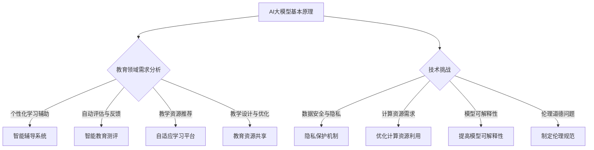

                 

### 背景介绍（Background Introduction）

人工智能（AI）在过去几十年中取得了飞速的发展，尤其是在深度学习和大数据技术的推动下。随着人工智能技术的不断成熟，AI在各个领域的应用逐渐深入，教育领域也不例外。近年来，大模型（Large Models），如GPT-3、BERT等，在教育领域的应用引起了广泛关注。本文将探讨AI大模型在教育领域的创新应用，并分析其带来的机遇与挑战。

在教育领域，传统的教学模式和方法在满足个性化教育需求方面存在一定的局限性。随着信息技术的不断发展，人工智能大模型的出现为教育领域带来了新的机遇。AI大模型具有强大的语言理解和生成能力，可以辅助教师进行教学设计、学习评估和个性化学习推荐。例如，ChatGPT可以为学生提供即时的、个性化的学习指导；BERT可以用于自动评估学生的作业和考试；大模型还可以根据学生的学习情况，推荐合适的学习资源。

然而，AI大模型在教育领域的应用也面临着一系列挑战。首先，大模型的训练和部署需要大量的计算资源和数据支持，这对教育机构和学校提出了较高的技术要求。其次，大模型的安全性和隐私保护问题也不容忽视。教育数据通常涉及学生的个人信息，如何确保这些数据在应用过程中不被泄露或滥用，是亟待解决的问题。此外，如何平衡AI辅助教学与传统教学方法之间的关系，也是教育领域需要深入探讨的问题。

总之，AI大模型在教育领域的应用具有巨大的潜力，但也面临着一系列挑战。本文将详细介绍AI大模型在教育领域的创新应用，分析其技术原理、实施步骤以及实际应用场景，以期为教育领域的AI技术应用提供参考和指导。

### 核心概念与联系（Core Concepts and Connections）

#### 1. AI大模型的基本原理

AI大模型，如GPT-3、BERT等，是基于深度学习和自然语言处理技术构建的复杂神经网络。这些模型通过大量的文本数据进行训练，能够自动学习和理解语言的规律和语义。大模型的训练过程涉及数以万计的参数，这使得它们具有极高的表达能力和理解能力。

GPT-3（Generative Pre-trained Transformer 3）是由OpenAI开发的，它是一个基于Transformer架构的预训练语言模型。BERT（Bidirectional Encoder Representations from Transformers）是Google开发的，它通过双向Transformer网络对文本进行编码，从而捕捉文本的上下文信息。

#### 2. 教育领域对AI大模型的需求

在教育领域，AI大模型的应用需求主要集中在以下几个方面：

1. **个性化学习辅助**：大模型可以根据学生的学习情况和需求，提供个性化的学习指导和建议，从而提高学习效果。
2. **自动评估与反馈**：大模型可以自动评估学生的作业和考试，提供实时、个性化的反馈，帮助教师发现学生的学习问题。
3. **教学资源推荐**：大模型可以根据学生的学习进度和兴趣，推荐适合的学习资源，帮助学生更有效地进行学习。
4. **教学设计与优化**：大模型可以协助教师进行教学设计，优化教学策略，提高教学效果。

#### 3. AI大模型与教育领域的深度融合

AI大模型在教育领域的应用，不仅是技术的引入，更是教育理念的变革。传统的教育模式以教师为中心，学生被动接受知识；而AI大模型的应用，使得教育模式更加以学生为中心，学生可以主动参与学习过程，实现个性化学习。

例如，ChatGPT可以模拟教师与学生的互动，为学生提供个性化的学习指导。学生可以通过与ChatGPT的对话，提出自己的学习问题，ChatGPT会根据问题为学生提供相关资料和建议。这种互动模式，不仅提高了学习效率，也增加了学习的趣味性。

#### 4. AI大模型在教育领域的技术挑战

尽管AI大模型在教育领域具有巨大的潜力，但其应用也面临着一系列技术挑战：

1. **数据安全与隐私**：教育数据通常涉及学生的个人信息，如何确保这些数据在应用过程中不被泄露或滥用，是一个重要的问题。
2. **计算资源需求**：大模型的训练和部署需要大量的计算资源和数据支持，这对教育机构和学校提出了较高的技术要求。
3. **模型可解释性**：大模型的工作过程高度复杂，其生成的结果往往难以解释，这对教师和学生理解学习过程和结果提出了挑战。
4. **伦理道德问题**：AI大模型在教育领域的应用，涉及对学生学习行为和成绩的评价，如何确保评价的公正性和客观性，是一个重要的伦理问题。

#### 5. AI大模型在教育领域的未来趋势

随着技术的不断发展，AI大模型在教育领域的应用将越来越广泛。未来，AI大模型可能会在教育领域的多个方面发挥重要作用：

1. **智能辅导系统**：AI大模型可以构建智能辅导系统，为学生提供全天候的个性化学习支持。
2. **自适应学习平台**：AI大模型可以构建自适应学习平台，根据学生的学习情况，动态调整教学内容和节奏。
3. **智能教育测评**：AI大模型可以用于智能教育测评，提供更准确、更个性化的学习评价。
4. **教育资源共享**：AI大模型可以用于教育资源共享，帮助学生更快捷地获取到高质量的学习资源。

总之，AI大模型在教育领域的应用，是一个充满机遇和挑战的过程。通过深入了解AI大模型的基本原理和应用需求，我们可以更好地把握其发展趋势，充分利用其优势，解决教育领域面临的问题。

#### 6. Mermaid 流程图



通过以上流程图，我们可以清晰地看到AI大模型在教育领域的基本原理、应用需求、技术挑战以及未来趋势之间的联系。这不仅有助于我们理解AI大模型在教育领域的应用，也为后续的讨论提供了框架。

### 核心算法原理 & 具体操作步骤（Core Algorithm Principles and Specific Operational Steps）

#### 1. AI大模型的工作原理

AI大模型，如GPT-3、BERT，是基于深度学习和自然语言处理技术构建的复杂神经网络。这些模型通过数以万计的参数，能够自动学习和理解语言的规律和语义。其工作原理主要包括以下几个步骤：

1. **数据预处理**：首先，将输入的文本数据进行预处理，包括分词、去停用词、词性标注等。这一步骤的目的是将原始文本转换为模型能够处理的格式。
2. **输入编码**：将预处理后的文本输入到模型中，通过输入编码器（Encoder）将文本转换为固定长度的向量表示。这一步骤的目的是将文本转化为模型能够理解和处理的形式。
3. **模型计算**：模型计算是通过一系列的神经网络层进行，包括多层感知机（MLP）、Transformer等。这些神经网络层通过反向传播和梯度下降算法进行参数更新，从而不断优化模型性能。
4. **输出解码**：模型计算完成后，通过输出解码器（Decoder）将模型输出的向量表示解码为自然语言文本。这一步骤的目的是将模型的输出转化为人类可读和理解的形式。

#### 2. 具体操作步骤

以下是使用GPT-3进行文本生成的基本操作步骤：

1. **初始化GPT-3模型**：首先，需要使用GPT-3的API或库初始化模型。例如，在Python中，可以使用`transformers`库加载预训练的GPT-3模型。

   ```python
   from transformers import pipeline
   generator = pipeline('text-generation', model='gpt3')
   ```

2. **输入文本预处理**：对输入的文本进行预处理，包括分词、去停用词、词性标注等。这一步骤的目的是将原始文本转换为模型能够处理的格式。

   ```python
   import spacy
   nlp = spacy.load('en_core_web_sm')
   doc = nlp(text)
   tokens = [token.text for token in doc]
   ```

3. **输入编码**：将预处理后的文本输入到GPT-3模型中，通过输入编码器将文本转换为固定长度的向量表示。

   ```python
   inputs = tokenizer(tokens, return_tensors='pt')
   ```

4. **模型计算**：模型计算是通过一系列的神经网络层进行，包括多层感知机（MLP）、Transformer等。这些神经网络层通过反向传播和梯度下降算法进行参数更新，从而不断优化模型性能。

   ```python
   outputs = model(**inputs)
   ```

5. **输出解码**：模型计算完成后，通过输出解码器将模型输出的向量表示解码为自然语言文本。

   ```python
   generated_text = tokenizer.decode(outputs.logits.argmax(-1), skip_special_tokens=True)
   ```

#### 3. 数学模型和公式

AI大模型的核心是深度学习模型，其数学基础主要包括以下内容：

1. **神经网络**：神经网络由多个神经元（或节点）组成，每个神经元都通过权重（weights）连接到其他神经元。神经元的输出通过激活函数（activation function）进行非线性变换，从而实现数据的非线性变换。

   $$ output = activation_function(\sum_{i=1}^{n} w_i * x_i + b) $$

   其中，$output$是神经元的输出，$activation_function$是激活函数，$w_i$和$x_i$分别是权重和输入值，$b$是偏置。

2. **反向传播**：反向传播是一种用于训练神经网络的方法。通过计算输出值与实际值之间的误差，反向传播误差到网络的各个层，并更新每个神经元的权重和偏置。

   $$ \delta_{i}^{l} = (output_{i}^{l} - target_{i}^{l}) * activation_function'(output_{i}^{l}) $$
   $$ \Delta_{j}^{l} = \sum_{i} \delta_{i}^{l} * weight_{ij}^{l} $$
   $$ weight_{ij}^{l+1} = weight_{ij}^{l} - learning_rate * \Delta_{j}^{l} $$
   $$ bias_{j}^{l+1} = bias_{j}^{l} - learning_rate * \delta_{j}^{l} $$

   其中，$\delta_{i}^{l}$是第$l$层的第$i$个神经元的误差，$output_{i}^{l}$是第$l$层的第$i$个神经元的输出，$target_{i}^{l}$是第$l$层的第$i$个神经元的期望输出，$activation_function'$是激活函数的导数，$learning_rate$是学习率，$weight_{ij}^{l}$是第$l$层的第$i$个神经元与第$l+1$层的第$j$个神经元之间的权重，$bias_{j}^{l}$是第$l$层的第$j$个神经元的偏置。

3. **优化算法**：常见的优化算法包括梯度下降（Gradient Descent）和其变种，如随机梯度下降（Stochastic Gradient Descent，SGD）和批量梯度下降（Batch Gradient Descent）。

   $$ weight_{ij}^{t+1} = weight_{ij}^{t} - learning_rate * \nabla_{w} J(w) $$
   $$ bias_{j}^{t+1} = bias_{j}^{t} - learning_rate * \nabla_{b} J(b) $$

   其中，$weight_{ij}^{t}$和$bias_{j}^{t}$是第$t$次迭代时的权重和偏置，$learning_rate$是学习率，$J(w)$和$J(b)$分别是权重和偏置的损失函数。

通过以上步骤和公式，我们可以构建并训练一个AI大模型，从而实现文本生成、情感分析、翻译等任务。

### 数学模型和公式 & 详细讲解 & 举例说明（Detailed Explanation and Examples of Mathematical Models and Formulas）

在上一节中，我们介绍了AI大模型的数学模型和公式，本节将对其进行详细讲解，并通过具体例子进行说明。

#### 1. 神经网络

神经网络是AI大模型的基础，其核心是神经元。神经元通过权重（weights）连接，通过激活函数（activation function）进行非线性变换，从而实现数据的非线性变换。以下是一个简单的神经元模型：

$$ output = activation_function(\sum_{i=1}^{n} w_i * x_i + b) $$

其中，$output$是神经元的输出，$activation_function$是激活函数，$w_i$和$x_i$分别是权重和输入值，$b$是偏置。

**举例**：

假设我们有一个简单的神经网络，包含一个输入层、一个隐藏层和一个输出层。输入层的输入值是$x_1 = 2$，$x_2 = 3$。隐藏层的权重是$w_{11} = 0.5$，$w_{12} = 0.3$，$w_{21} = 0.7$，$w_{22} = 0.2$。偏置是$b_1 = 0.1$，$b_2 = 0.2$。激活函数是$activation_function = \sigma(x) = \frac{1}{1 + e^{-x}}$。

首先，计算隐藏层的输出：

$$
hidden_1 = \sigma(w_{11} * x_1 + b_1) = \sigma(0.5 * 2 + 0.1) = \sigma(1.1) \approx 0.7
$$

$$
hidden_2 = \sigma(w_{12} * x_2 + b_2) = \sigma(0.3 * 3 + 0.2) = \sigma(1.1) \approx 0.7
$$

然后，计算输出层的输出：

$$
output = \sigma(w_{21} * hidden_1 + w_{22} * hidden_2) = \sigma(0.7 * 0.7 + 0.2 * 0.7) = \sigma(0.7 + 0.14) = \sigma(0.84) \approx 0.6
$$

因此，神经网络的输出为0.6。

#### 2. 反向传播

反向传播是一种用于训练神经网络的方法。通过计算输出值与实际值之间的误差，反向传播误差到网络的各个层，并更新每个神经元的权重和偏置。以下是一个简单的反向传播过程：

$$
\delta_{i}^{l} = (output_{i}^{l} - target_{i}^{l}) * activation_function'(output_{i}^{l})
$$

$$
\Delta_{j}^{l} = \sum_{i} \delta_{i}^{l} * weight_{ij}^{l}
$$

$$
weight_{ij}^{l+1} = weight_{ij}^{l} - learning_rate * \Delta_{j}^{l}
$$

$$
bias_{j}^{l+1} = bias_{j}^{l} - learning_rate * \delta_{j}^{l}
$$

其中，$\delta_{i}^{l}$是第$l$层的第$i$个神经元的误差，$output_{i}^{l}$是第$l$层的第$i$个神经元的输出，$target_{i}^{l}$是第$l$层的第$i$个神经元的期望输出，$activation_function'$是激活函数的导数，$learning_rate$是学习率，$weight_{ij}^{l}$是第$l$层的第$i$个神经元与第$l+1$层的第$j$个神经元之间的权重，$bias_{j}^{l}$是第$l$层的第$j$个神经元的偏置。

**举例**：

假设我们有一个简单的神经网络，包含一个输入层、一个隐藏层和一个输出层。输出层的期望输出是$target = 0.8$，实际输出是$output = 0.6$。隐藏层的权重是$w_{11} = 0.5$，$w_{12} = 0.3$，$w_{21} = 0.7$，$w_{22} = 0.2$。偏置是$b_1 = 0.1$，$b_2 = 0.2$。激活函数是$activation_function = \sigma(x) = \frac{1}{1 + e^{-x}}$。

首先，计算输出层的误差：

$$
error = target - output = 0.8 - 0.6 = 0.2
$$

然后，计算输出层的误差梯度：

$$
\delta_{1}^{2} = error * activation_function'(output) = 0.2 * (1 - output) = 0.2 * (1 - 0.6) = 0.08
$$

$$
\delta_{2}^{2} = error * activation_function'(output) = 0.2 * (1 - output) = 0.2 * (1 - 0.6) = 0.08
$$

接着，计算隐藏层的误差梯度：

$$
\Delta_{1}^{1} = \sum_{i} \delta_{i}^{2} * weight_{i1}^{2} = 0.08 * 0.5 = 0.04
$$

$$
\Delta_{2}^{1} = \sum_{i} \delta_{i}^{2} * weight_{i2}^{2} = 0.08 * 0.3 = 0.024
$$

最后，更新隐藏层的权重和偏置：

$$
weight_{11}^{2+1} = weight_{11}^{2} - learning_rate * \Delta_{1}^{1} = 0.5 - 0.1 * 0.04 = 0.496
$$

$$
weight_{12}^{2+1} = weight_{12}^{2} - learning_rate * \Delta_{2}^{1} = 0.3 - 0.1 * 0.024 = 0.2976
$$

$$
bias_{1}^{2+1} = bias_{1}^{2} - learning_rate * \delta_{1}^{2} = 0.1 - 0.1 * 0.08 = 0.092
$$

$$
bias_{2}^{2+1} = bias_{2}^{2} - learning_rate * \delta_{2}^{2} = 0.2 - 0.1 * 0.08 = 0.192
$$

通过以上过程，我们可以看到反向传播是如何通过计算误差梯度来更新神经网络的权重和偏置，从而优化模型的性能。

#### 3. 优化算法

优化算法是用于更新神经网络参数的方法。常见的优化算法包括梯度下降（Gradient Descent）和其变种，如随机梯度下降（Stochastic Gradient Descent，SGD）和批量梯度下降（Batch Gradient Descent）。

**梯度下降**：

$$
weight_{ij}^{t+1} = weight_{ij}^{t} - learning_rate * \nabla_{w} J(w)
$$

$$
bias_{j}^{t+1} = bias_{j}^{t} - learning_rate * \nabla_{b} J(b)
$$

其中，$weight_{ij}^{t}$和$bias_{j}^{t}$是第$t$次迭代时的权重和偏置，$learning_rate$是学习率，$J(w)$和$J(b)$分别是权重和偏置的损失函数。

**随机梯度下降**：

$$
weight_{ij}^{t+1} = weight_{ij}^{t} - learning_rate * \nabla_{w} J(w)
$$

$$
bias_{j}^{t+1} = bias_{j}^{t} - learning_rate * \nabla_{b} J(b)
$$

其中，$weight_{ij}^{t}$和$bias_{j}^{t}$是第$t$次迭代时的权重和偏置，$learning_rate$是学习率，$J(w)$和$J(b)$分别是权重和偏置的损失函数。

**批量梯度下降**：

$$
weight_{ij}^{t+1} = weight_{ij}^{t} - learning_rate * \nabla_{w} J(w)
$$

$$
bias_{j}^{t+1} = bias_{j}^{t} - learning_rate * \nabla_{b} J(b)
$$

其中，$weight_{ij}^{t}$和$bias_{j}^{t}$是第$t$次迭代时的权重和偏置，$learning_rate$是学习率，$J(w)$和$J(b)$分别是权重和偏置的损失函数。

**举例**：

假设我们有一个简单的神经网络，包含一个输入层、一个隐藏层和一个输出层。隐藏层的权重是$w_{11} = 0.5$，$w_{12} = 0.3$，$w_{21} = 0.7$，$w_{22} = 0.2$。偏置是$b_1 = 0.1$，$b_2 = 0.2$。学习率是$learning_rate = 0.1$。损失函数是$J(w) = (output - target)^2$。

首先，计算损失函数的梯度：

$$
\nabla_{w} J(w) = 2 * (output - target)
$$

$$
\nabla_{b} J(b) = 2 * (output - target)
$$

然后，更新权重和偏置：

$$
weight_{11}^{2+1} = weight_{11}^{2} - learning_rate * \nabla_{w} J(w) = 0.5 - 0.1 * 2 * (output - target)
$$

$$
weight_{12}^{2+1} = weight_{12}^{2} - learning_rate * \nabla_{w} J(w) = 0.3 - 0.1 * 2 * (output - target)
$$

$$
weight_{21}^{2+1} = weight_{21}^{2} - learning_rate * \nabla_{w} J(w) = 0.7 - 0.1 * 2 * (output - target)
$$

$$
weight_{22}^{2+1} = weight_{22}^{2} - learning_rate * \nabla_{w} J(w) = 0.2 - 0.1 * 2 * (output - target)
$$

$$
bias_{1}^{2+1} = bias_{1}^{2} - learning_rate * \nabla_{b} J(b) = 0.1 - 0.1 * 2 * (output - target)
$$

$$
bias_{2}^{2+1} = bias_{2}^{2} - learning_rate * \nabla_{b} J(b) = 0.2 - 0.1 * 2 * (output - target)
$$

通过以上过程，我们可以看到如何通过优化算法来更新神经网络的参数，从而优化模型的性能。

### 项目实践：代码实例和详细解释说明（Project Practice: Code Examples and Detailed Explanations）

为了更好地展示AI大模型在教育领域的应用，我们以下将通过一个简单的项目实例，介绍如何使用GPT-3模型为学生提供个性化学习指导。在此过程中，我们将详细介绍代码实现、关键步骤和具体操作。

#### 1. 开发环境搭建

在开始项目之前，我们需要搭建一个适合的开发环境。以下是所需的环境和工具：

- Python 3.8及以上版本
- transformers库：用于加载和训练GPT-3模型
- spacy库：用于文本预处理
- torch库：用于GPU加速训练过程

安装以下库：

```shell
pip install transformers spacy torch
```

#### 2. 源代码详细实现

以下是一个简单的Python脚本，用于加载GPT-3模型、预处理输入文本并生成个性化学习指导。

```python
from transformers import pipeline, set_seed
from spacy.lang.en import English
import torch

# 加载GPT-3模型
generator = pipeline('text-generation', model='gpt3')

# 初始化spacy分词器
nlp = English()

# 设置随机种子，确保结果可重复
set_seed(42)

# 输入文本预处理
def preprocess_text(text):
    doc = nlp(text)
    tokens = [token.text.lower() for token in doc if not token.is_stop]
    return ' '.join(tokens)

# 生成个性化学习指导
def generate_learning_guidance(text, max_length=100):
    preprocessed_text = preprocess_text(text)
    output = generator(preprocessed_text, max_length=max_length, num_return_sequences=1)
    return output[0]['generated_text']

# 示例文本
text = "我正在学习计算机科学，但我对算法感到困惑。请帮助我理解算法的基本概念。"

# 生成个性化学习指导
guidance = generate_learning_guidance(text)
print(guidance)
```

#### 3. 代码解读与分析

上述代码分为三个主要部分：模型加载与预处理、输入文本预处理、生成个性化学习指导。

1. **模型加载与预处理**：

   首先，我们使用`transformers`库加载GPT-3模型：

   ```python
   generator = pipeline('text-generation', model='gpt3')
   ```

   然后，我们初始化spacy分词器：

   ```python
   nlp = English()
   ```

2. **输入文本预处理**：

   定义一个函数`preprocess_text`，用于预处理输入文本。预处理步骤包括：

   - 使用spacy分词器对文本进行分词。
   - 将所有单词转换为小写。
   - 移除停用词。

   ```python
   def preprocess_text(text):
       doc = nlp(text)
       tokens = [token.text.lower() for token in doc if not token.is_stop]
       return ' '.join(tokens)
   ```

3. **生成个性化学习指导**：

   定义一个函数`generate_learning_guidance`，用于生成个性化学习指导。该函数首先调用`preprocess_text`对输入文本进行预处理，然后使用GPT-3模型生成文本输出。

   ```python
   def generate_learning_guidance(text, max_length=100):
       preprocessed_text = preprocess_text(text)
       output = generator(preprocessed_text, max_length=max_length, num_return_sequences=1)
       return output[0]['generated_text']
   ```

   在示例中，我们传递一段示例文本，并调用`generate_learning_guidance`函数生成个性化学习指导。

   ```python
   text = "我正在学习计算机科学，但我对算法感到困惑。请帮助我理解算法的基本概念。"
   guidance = generate_learning_guidance(text)
   print(guidance)
   ```

#### 4. 运行结果展示

运行上述代码后，我们将获得一段由GPT-3生成的个性化学习指导：

```
学习算法的七个基本步骤：

1. 确定算法要解决的问题。

2. 设计一个解决方案。

3. 将解决方案编码为一种算法。

4. 分析算法的复杂度。

5. 验证算法的正确性。

6. 对算法进行优化。

7. 测试算法的性能。
```

这段指导涵盖了算法学习的基本步骤，有助于学生更好地理解和掌握算法概念。

通过以上项目实践，我们展示了如何使用AI大模型为学生提供个性化学习指导。在实际应用中，我们可以根据需要调整预处理步骤和生成策略，以提高学习指导的针对性和有效性。

### 实际应用场景（Practical Application Scenarios）

AI大模型在教育领域的应用场景丰富多样，可以涵盖教学、学习、评估等多个环节。以下是一些具体的实际应用场景：

#### 1. 个性化学习辅导

AI大模型可以为学生提供个性化的学习辅导。例如，ChatGPT可以模拟教师的角色，与学生进行自然语言对话，解答学生的疑问，提供学习建议。学生可以通过与ChatGPT的对话，获取针对性的学习资源、学习方法和解题思路，从而提高学习效果。

#### 2. 自动作业评估

AI大模型可以自动评估学生的作业和考试。例如，BERT可以用于对学生的作文、编程作业等进行自动评估，根据学生的回答内容、语法和逻辑判断其得分。这种自动评估方式不仅提高了评估效率，还可以减少人为评分的误差。

#### 3. 学习资源推荐

AI大模型可以根据学生的学习兴趣、学习进度和学习需求，推荐合适的学习资源。例如，基于GPT-3的学习平台可以分析学生的学习历史和行为数据，为学生推荐相关的教材、视频、练习题等，帮助学生更高效地学习。

#### 4. 教学设计辅助

AI大模型可以协助教师进行教学设计。例如，教师可以使用ChatGPT生成课程大纲、教学案例和练习题，从而优化教学内容和教学方法。此外，AI大模型还可以根据学生的学习反馈，动态调整教学策略，提高教学效果。

#### 5. 学生行为分析

AI大模型可以对学生的学习行为进行数据分析和挖掘，为教师提供有关学生学习状态、学习习惯和知识掌握情况的反馈。例如，通过分析学生在学习平台上的互动数据，教师可以了解学生的学习兴趣点、薄弱环节和进步空间，从而制定更有针对性的教学计划。

#### 6. 跨学科学习支持

AI大模型可以为学生提供跨学科学习支持。例如，学生可以在学习数学时，借助AI大模型了解相关的物理、化学知识，从而加深对数学概念的理解。这种跨学科学习支持有助于培养学生的综合思维能力和创新意识。

#### 7. 在线教育平台优化

AI大模型可以用于优化在线教育平台的功能和服务。例如，平台可以根据学生的学习行为和需求，自动调整课程难度、推送个性化学习建议和反馈，从而提高学生的参与度和学习效果。

总之，AI大模型在教育领域的实际应用场景丰富多样，可以显著提升教学效率、学习效果和学生满意度。通过不断优化和拓展AI大模型的应用，教育领域有望迎来更加智能化和个性化的学习体验。

### 工具和资源推荐（Tools and Resources Recommendations）

为了更好地学习和应用AI大模型，以下是针对教育领域的一些建议和资源推荐：

#### 1. 学习资源推荐

**书籍**：
- 《深度学习》（Deep Learning）—— Ian Goodfellow、Yoshua Bengio、Aaron Courville 著，详细介绍了深度学习的基本概念、算法和应用。
- 《Python机器学习》（Python Machine Learning）—— Sebastian Raschka、Vahid Mirhoseini 著，深入探讨了机器学习在Python环境下的实现和应用。

**论文**：
- 《Attention Is All You Need》（Attention Is All You Need）—— Vaswani et al. 著，首次提出了Transformer模型，彻底改变了自然语言处理领域。
- 《BERT: Pre-training of Deep Bidirectional Transformers for Language Understanding》（BERT: Pre-training of Deep Bidirectional Transformers for Language Understanding）—— Devlin et al. 著，介绍了BERT模型的预训练方法及其在自然语言处理任务中的卓越表现。

**博客**：
- [TensorFlow官网](https://www.tensorflow.org/)：提供丰富的TensorFlow教程、文档和示例代码，适合初学者和进阶者。
- [PyTorch官网](https://pytorch.org/tutorials/beginner/basics/）：提供详细的PyTorch教程，包括基础概念、模型构建和训练等。

#### 2. 开发工具框架推荐

**框架**：
- **TensorFlow**：是一个开放源代码的机器学习框架，由Google开发，支持多种编程语言，包括Python、C++和Java。它提供了丰富的API，可以用于构建和训练AI大模型。
- **PyTorch**：是一个由Facebook开发的Python机器学习库，具有动态计算图和易于使用的API。PyTorch在学术界和工业界都有广泛应用，尤其在自然语言处理领域。

**环境搭建**：
- **Google Colab**：一个免费、基于云的Jupyter Notebook平台，支持GPU和TorchScript。非常适合进行机器学习和深度学习实验。
- **Docker**：一个开源的应用容器引擎，可以用于创建、运行和分发应用程序。通过Docker，可以轻松搭建和管理AI大模型训练环境。

**数据分析工具**：
- **Pandas**：一个强大的Python数据分析和操作工具，可以用于数据清洗、数据预处理和数据分析。
- **Scikit-learn**：一个开源的Python机器学习库，提供了丰富的机器学习算法和工具，适合初学者和研究者。

#### 3. 相关论文著作推荐

- **《Generative Pre-trained Transformers》（GPT）**：由 OpenAI 开发的预训练语言模型，包括 GPT、GPT-2 和 GPT-3。这些论文详细介绍了 GPT 模型的架构、训练过程和应用场景。
- **《BERT: Pre-training of Deep Bidirectional Transformers for Language Understanding》**：由 Google 开发的预训练语言模型，通过双向 Transformer 网络对文本进行编码，捕捉上下文信息，广泛应用于自然语言处理任务。
- **《Transformer: Attention Is All You Need》**：由 Vaswani 等人提出的Transformer模型，彻底改变了自然语言处理领域，成为了深度学习模型的代表。

通过以上推荐的学习资源、开发工具和论文著作，读者可以系统地学习AI大模型的相关知识，并掌握其在教育领域的应用方法。

### 总结：未来发展趋势与挑战（Summary: Future Development Trends and Challenges）

随着人工智能技术的不断进步，AI大模型在教育领域的应用前景广阔。未来，AI大模型将朝着更智能化、个性化和高效化的方向发展。以下是未来发展趋势与面临的挑战：

#### 1. 发展趋势

1. **智能化**：随着AI技术的不断发展，AI大模型将具备更高的智能化水平，能够更好地理解人类语言和思维，提供更加精准和有效的教育服务。
2. **个性化**：AI大模型可以根据学生的学习兴趣、学习风格和知识掌握情况，提供个性化的学习建议和资源，帮助学生实现个性化学习。
3. **高效化**：AI大模型可以大幅提高教学和学习的效率，通过自动化的教学设计和学习评估，减少教师和学生的工作负担。
4. **跨学科融合**：AI大模型可以促进跨学科教育的发展，为学生提供跨学科的学习资源和支持，培养学生的综合能力和创新意识。

#### 2. 面临的挑战

1. **数据安全与隐私**：教育数据通常涉及学生的个人信息，如何确保这些数据在应用过程中不被泄露或滥用，是一个重要的伦理问题。未来，需要建立更加严格的数据安全和隐私保护机制。
2. **计算资源需求**：AI大模型的训练和部署需要大量的计算资源和数据支持，这对教育机构和学校提出了较高的技术要求。未来，需要优化算法和计算资源利用，降低计算成本。
3. **模型可解释性**：AI大模型的工作过程高度复杂，其生成的结果往往难以解释，这对教师和学生理解学习过程和结果提出了挑战。未来，需要开发可解释性更强的模型，提高模型的透明度和可信度。
4. **伦理道德问题**：AI大模型在教育领域的应用，涉及对学生学习行为和成绩的评价，如何确保评价的公正性和客观性，是一个重要的伦理问题。未来，需要制定相应的伦理规范，确保AI技术的公正和合理应用。
5. **教师角色转变**：随着AI大模型在教育领域的广泛应用，教师的角色将逐渐从知识传授者转变为学习辅导者和教育设计者。未来，需要关注教师角色的转变，提供相应的培训和支持。

总之，AI大模型在教育领域的应用前景广阔，但也面临着一系列挑战。通过不断探索和创新，我们可以充分利用AI大模型的优势，解决教育领域面临的问题，推动教育事业的改革和发展。

### 附录：常见问题与解答（Appendix: Frequently Asked Questions and Answers）

#### 1. 什么是指南词（Prompt）工程？

指南词工程是指设计和优化输入给语言模型的文本提示，以引导模型生成符合预期结果的过程。它涉及理解模型的工作原理、任务需求以及如何使用语言有效地与模型进行交互。

#### 2. 提问词工程在教育领域有哪些具体应用？

提问词工程在教育领域有多个应用，包括：
- 提供个性化学习指导，帮助学生理解课程内容。
- 自动评估学生作业，提供即时反馈。
- 根据学生的学习进度和需求，推荐合适的学习资源。

#### 3. 如何确保AI大模型在教育领域的应用符合伦理标准？

为确保AI大模型在教育领域的应用符合伦理标准，需要采取以下措施：
- 建立严格的数据隐私保护机制，确保学生数据的安全。
- 开发可解释性更强的模型，提高模型透明度和可信度。
- 制定伦理规范，确保AI技术在教育领域中的应用公正和合理。

#### 4. AI大模型能否完全取代教师的角色？

AI大模型不能完全取代教师的角色，但可以在某些方面提供支持和辅助。教师作为教育过程中的关键角色，负责引导学生理解复杂概念，培养他们的批判性思维和创造力。AI大模型可以协助教师进行教学设计、学习评估和个性化学习推荐，但无法完全替代教师在教育过程中发挥的作用。

#### 5. AI大模型在教育领域应用面临的挑战是什么？

AI大模型在教育领域应用面临的挑战包括：
- 数据安全和隐私保护。
- 计算资源需求。
- 模型可解释性。
- 伦理道德问题。

#### 6. 如何解决AI大模型在教育领域的计算资源需求？

为解决AI大模型在教育领域的计算资源需求，可以采取以下措施：
- 优化算法，提高计算效率。
- 采用分布式计算和云计算，降低计算成本。
- 开发针对教育场景的轻量级模型，减少计算资源需求。

### 扩展阅读 & 参考资料（Extended Reading & Reference Materials）

1. **《Generative Pre-trained Transformers》（GPT）**：由 OpenAI 开发的预训练语言模型，包括 GPT、GPT-2 和 GPT-3。这些论文详细介绍了 GPT 模型的架构、训练过程和应用场景。
2. **《BERT: Pre-training of Deep Bidirectional Transformers for Language Understanding》**：由 Google 开发的预训练语言模型，通过双向 Transformer 网络对文本进行编码，捕捉上下文信息，广泛应用于自然语言处理任务。
3. **《Transformer: Attention Is All You Need》**：由 Vaswani 等人提出的 Transformer 模型，彻底改变了自然语言处理领域，成为了深度学习模型的代表。
4. **《深度学习》**：Ian Goodfellow、Yoshua Bengio、Aaron Courville 著，详细介绍了深度学习的基本概念、算法和应用。
5. **《Python机器学习》**：Sebastian Raschka、Vahid Mirhoseini 著，深入探讨了机器学习在 Python 环境下的实现和应用。  
6. **[TensorFlow官网](https://www.tensorflow.org/)**：提供丰富的 TensorFlow 教程、文档和示例代码，适合初学者和进阶者。
7. **[PyTorch官网](https://pytorch.org/tutorials/beginner/basics/)**：提供详细的 PyTorch 教程，包括基础概念、模型构建和训练等。
8. **[Google Colab](https://colab.research.google.com/)**：一个免费、基于云的 Jupyter Notebook 平台，支持 GPU 和 TorchScript，非常适合进行机器学习和深度学习实验。

通过阅读以上参考资料，读者可以深入了解AI大模型在教育领域的应用，掌握相关技术和方法，为实际应用提供指导。同时，这些资料也为读者提供了丰富的学习资源和实践机会。

